--- 
title: "R for Epidemiology"
author: "Brad Cannell"
date: "`r Sys.Date()`"
description: "This is the textbook for Brad Cannell's Introduction to R Programming for Epidemiologic Research course."
cover-image: "r4epi_icon.png"
site: bookdown::bookdown_site
output: bookdown::gitbook
documentclass: book
bibliography: [book.bib, packages.bib]
link-citations: yes
csl: ama.csl
github-repo: "brad-cannell/r4epi"
url: 'https://brad-cannell.github.io/r4epi/'
---

```{r setup, include=FALSE}
# automatically create a bib database for R packages
knitr::write_bib(c(
  .packages(), 'bookdown', 'knitr', 'rmarkdown'
), 'packages.bib')

# To fix error that says: "Error: Input files not all in same directory, please supply explicit wd
# Execution halted"
options(bookdown.render.file_scope = FALSE)

# Add Font Awesome icons (https://fontawesome.com/)
library(fontawesome)
```

# Welcome {-}

<!-- R4Epi Hex Sticker -->


Welcome to R for Epidemiology! 

This electronic book was originally created to accompany my Introduction to R Programming for Epidemiologic Research course at the [University of Texas Health Science Center School of Public Health](https://sph.uth.edu/). However, I hope it will be useful to anyone who is interested in R and epidemiology.

## Acknowledgements {-}

This book is currently a work in progress (and probably always will be); however, there are already many people who have played an important role (some unknowingly) in helping develop it thus far. First, I’d like to offer my gratitude to all past, current, and future members of the R Core Team for maintaining this _amazing_, _free_ software. I’d also like to express my gratitude to everyone at RStudio. You are also developing and _giving away_ some amazing software. In particular, I’d like to acknowledge **Garrett Grolemund** and **Hadley Wickham**. Both have had a huge impact on how I use, and teach, R. I’d also like to thank my students for all the feedback they’ve given me while taking my course. In particular, I want to thank **Jared Wiegand** and **Yiqun Wang** for their many edits and suggestions. 

This electronic textbook was created and published using [R](https://cran.r-project.org/), [RStudio](https://www.rstudio.com/), the [bookdown](https://bookdown.org/) package, [GitHub](https://github.com/), and [Netlify](https://www.netlify.com/).

<a href="https://www.netlify.com"></a>

# Introduction {-}

## Goals {-}

We're going to start the introduction by writing down some basic goals that underlie the construction and content of this book. We're writing this for you, the reader, but also to hold ourselves accountable as we write. So, feel free to read if you are interested or skip ahead if you aren't.

The goals of this book are:   

1. To teach you how to use R and RStudio as tools for applied epidemiology. Our goal is not to teach you to be a computer scientist or an advanced R programmer. Therefore, some readers who are experienced programmers may catch some technical inaccuracies regarding what we consider to be the fine points of what R is doing "under the hood."    

2. To make this writing as accessible and practically useful as possible without stripping out all of the complexity that makes doing epidemiology in real life a challenge. In other words, We're going to try to give you all the tools you need to _do_ epidemiology in "real world" conditions (as opposed to ideal conditions) without providing a whole bunch of extraneous (often theoretical) stuff that detracts from _doing_. Having said that, we will strive to add links to the other (often theoretical) stuff for readers who are interested.

3. To teach you to accomplish common _tasks_, rather than teach you to use functions or families of functions. In many R courses and texts, there is a focus on learning all the things a function, or set of related functions, can do. It's then up to you, the reader, to sift through all of these capabilities and decided which, if any, of the things that _can_ be done will accomplish the tasks that you are _actually trying_ to accomplish. Instead, we will strive to start with the end in mind. What is the task we are actually trying to accomplish? What are some functions/methods we could use to accomplish that task? What are the strengths and limitations of each?

4. To start each concept by showing you the end result and then deconstruct how we arrived at that result, where possible. We find that it is easier for many people to understand new concepts when learning them as a component of a final product.

5. To learn concepts with data instead of (or alongside) mathematical formulas and text descriptions, where possible. We find that it is easier for many people to understand new concepts by seeing them in action.

## Text conventions used in this book {-}

* **Bold** text is used to highlight important **terms**, file names, and file extensions.

* `Highlighted inline code` is used to emphasize small sections of R code and program elements such as variable or function names.  

## Other reading {-}

If you are interested in R4Epi, you may also be interested in:

* [Hands-on Programming with R](https://rstudio-education.github.io/hopr/) by Garrett Grolemund. This book is designed to provide a friendly introduction to the R language.   

* [R for Data Science](https://r4ds.had.co.nz/) by Garrett Grolemund and Hadley Wickham. This book is designed to teach readers how to do data science with R.   

* [Statistical Inference via Data Science: A ModernDive into R and the Tidyverse](https://moderndive.com/). This book is designed to be a gentle introduction to the practice of analyzing data and answering questions using data the way data scientists, statisticians, data journalists, and other researchers would.   

* [Reproducable Research with R and RStudio](http://christophergandrud.github.io/RepResR-RStudio/) by Christopher Gandrud. This book gives you tools for data gathering, analysis, and presentation of results so that you can create dynamic and highly reproducible research.   

* [Advanced R](https://adv-r.hadley.nz/) by Hadley Wickham. This book is designed primarily for R users who want to improve their programming skills and understanding of the language.   

## Contributing to R4Epi {-}

Over the years, we have learned so much from our students and colleagues, and we anticipate that there is much more we can learn from you -- our readers. Therefore, we welcome and appreciate all constructive contributions to R4Epi!

### Typos {-}

The easiest way for you to contribute is to help us clean up the little typos and grammatical errors that inevitably sneak into the text. 

If you spot a typo, you can offer a correction directly in GitHub. You will first need to create a free GitHub account: [sign-up at github.com](https://github.com/join). Later in the book, we will cover using [GitHub in greater depth][Introduction to git and GitHub]. Here, we're just going to walk you through how to fix a typo without much explanation of how GitHub works.

Let's say you spot a typo while reading along.

```{r echo=FALSE}
knitr::include_graphics("img/index/typo_on_screen.png")
```

Next, click the edit button in the toolbar as shown in the screenshot below.

```{r echo=FALSE}
knitr::include_graphics("img/index/edit_button.png")
```

Close up, it looks like this:

```{r echo=FALSE, fig.align = 'center'}
knitr::include_graphics("img/index/edit_button_close.png")
```

The first time you click the icon, you will be taken to the R4Epi **repository** on GitHub and asked to **Fork** it. For our purposes, you can think of a GitHub repository as being similar to a shared folder on Dropbox or Google Drive. 

```{r echo=FALSE}
knitr::include_graphics("img/index/fork_button.png")
```

"Forking the repository" basically just means "make a copy of the repository" on your GitHub account. In other words, copy all of the files that make up the R4Epi textbook to your GitHub account. Then, you can fix the typos you found in your _copy_ of the files that make up the book instead of directly editing the _actual_ files that make up the book. This is a safeguard to prevent people from accidentally making changes that shouldn't be made. 

<p class="note"> 🗒**Side Note:** Forking the R4Epi repository does not cost any money or add any files to your computer. </p>

After you fork the repository, you will see a text editor on your screen.

```{r echo=FALSE}
knitr::include_graphics("img/index/text_editor.png")
```

The text editor will display the contents of the file (called an **R markdown** file), which is used to make the chapter you were looking at when you clicked the `edit` button. In our example, it was the "Contributing to R4Epi" section of the file named `index.Rmd`. We will learn more about R markdown files in the chapter on [R markdown], but for now just know that R Markdown files contain a mix of R `code` and plain text like the text you are reading right now. You may not understand the code yet, but you will probably be able to skim through the document and find the typo you want to fix.

Next, Scroll down through the text until you find the typo, and fix it. 

```{r echo=FALSE}
knitr::include_graphics("img/index/fix_typo.png")
```

Now, the only thing left to do is propose your typo fix to the authors. To do so, simply scroll to the bottom of the same screen where you made the edits to the file. There, you will see a "Propose changes" form box you can fill out. In the first line, type a brief (i.e., 72 characters or less) summary of the change you made. There is also a box to add a more detailed description of what you did, but you shouldn't need to use it for a simple typo fix. 

```{r echo=FALSE}
knitr::include_graphics("img/index/propose_changes.png")
```

Next, click the "Propose changes" button. That will take you to another screen where you will be able to create a **pull request**. This screen is kind of busy, but try not to let it overwhelm you. 

```{r echo=FALSE}
knitr::include_graphics("img/index/create_pull_request_1.png")
```

For now, we will focus on the three different sections of the screen that are highlighted with a red outline. We will start at the bottom and work our way up. The red box that is closest to the bottom of the screenshot shows us that the change we made was on line 93. We removed the word "typoo" (highlighted in red) and added the word "typo" (highlighted in green). The red box in the middle of the screenshot shows us the brief description we wrote for our proposed change -- "Fixed a typo in index.Rmd". Finally, the red box closest to the top of the screenshot is surrounding the "Create pull request" button. Let's go ahead and click it now. 

```{r echo=FALSE}
knitr::include_graphics("img/index/create_pull_request_2.png")
```

After doing so, we will get one final chance to amend our description of our proposed changes. We don't want to change our description, so let's go ahead and click "Create pull request" one more time. Our job is done! It is now up to the authors to review the changes we've proposed and "pull" them into the file in their repository. 

In case you are curious, here is what the process looks like on the authors' end. First, when we open the R4Epi repository page on GitHub, we will see that there is a new pull request. 

```{r echo=FALSE}
knitr::include_graphics("img/index/create_pull_request_3.png")
```

When we open the pull request, we can see the proposed changes to the file.

```{r echo=FALSE}
knitr::include_graphics("img/index/create_pull_request_4.png")
```

Then, all we have to do is click the "Merge pull request button" and the fixed file is "pulled in" to replace the file with the typo. 

```{r echo=FALSE}
knitr::include_graphics("img/index/create_pull_request_5.png")
```

### Issues {-}

There may be times when you see a problem that you don't know how to fix, but you still want to make the authors aware of. In that case, you can create an **issue** in the R4Epi repository. To do so, navigate to the issue tracker using this link: https://github.com/brad-cannell/r4epi/issues. 

```{r echo=FALSE}
knitr::include_graphics("img/index/issue_tracker.png")
```

Once there, you can check to see if someone has already raised the issue you are concerned about. If not, you can click the "New issue" button to raise it yourself.

Please note that R4Epi uses a [Contributor Code of Conduct](https://contributor-covenant.org/version/2/0/CODE_OF_CONDUCT.html). By contributing to this book, you agree to abide by its terms.

**License Information**

<a rel="license" href="http://creativecommons.org/licenses/by-nc-nd/4.0/"></a><br />This book was created by Brad Cannell and is licensed under a <a rel="license" href="http://creativecommons.org/licenses/by-nc-nd/4.0/">Creative Commons Attribution-NonCommercial-NoDerivatives 4.0 International License</a>.

# About the Authors {-}

## Brad Cannell {-}

**Brad Cannell, PhD, MPH**   
<!-- Cannell profile photo -->

Associate Professor    
Department of Epidemiology, Human Genetics and Environmental Sciences    
University of Texas Health Science Center    
School of Public Health    
[www.bradcannell.com](https://www.bradcannell.com)   

Dr. Cannell received his PhD in Epidemiology, and Graduate Certificate in Gerontology, in 2013 from the University of Florida. He received his MPH with a concentration in Epidemiology from the University of Louisville in 2009, and his BA in Political Science and Marketing from the University of North Texas in 2005. During his doctoral studies, he was a Graduate Research Assistant for the Florida Office on Disability and Health, an affiliated scholar with the Claude D. Pepper Older Americans Independence Center, and a student-inducted member of the Delta Omega Honorary Society in Public Health. In 2016, Dr. Cannell received a Graduate Certificate in Predictive Analytics from the University of Maryland University College, and a Certificate in Big Data and Social Analytics from the Massachusetts Institute of Technology. 

He previously held professional staff positions in the Louisville Metro Health Department and the Northern Kentucky Independent District Health Department. He spent three years as a project epidemiologist for the Florida Office on Disability and Health at the University of Florida. He also served as an Environmental Science Officer in the United States Army Reserves from 2009 to 2013.

Dr. Cannell’s research is broadly focused on healthy aging and health-related quality of life. Specifically, he has published research focusing on preservation of physical and cognitive function, living and aging with disability, and understanding and preventing elder mistreatment. Additionally, he has a strong background and training in epidemiologic methods and predictive analytics. He has been principal or co-investigator on multiple trials and observational studies in community and healthcare settings. He is currently the principal investigator on multiple data-driven federally funded projects that utilize technological solutions to public health issues in novel ways.

**Contact**   
Connect with Dr. Cannell and follow his work.   
<a href="https://www.bradcannell.com" target="_blank">`r fa("globe", fill = "#003087", height="2em")`</a>
<a href="https://www.facebook.com/Brad-Cannell-PhD-MPH-109345984850672" target="_blank">`r fa("facebook-square", fill = "#4267B2", height="2em")`</a>
<a href="https://www.linkedin.com/in/bradcannell/" target="_blank">`r fa("linkedin", fill = "#2867B2", height="2em")`</a>
<a href="https://twitter.com/brad_cannell" target="_blank">`r fa("twitter-square", fill = "#198CD8", height="2em")`</a>
<a href="https://www.instagram.com/brad_cannell/" target="_blank">`r fa("instagram-square", fill = "#833AB4", height="2em")`</a>


## Melvin Livingston {-}

**Melvin Livingston, PhD (Doug)**   
<!-- Livingston profile photo -->

Research Associate Professor    
Department of Behavioral, Social, and Health Education Sciences     
Emory University Woodruff Health Sciences Center    
Rollins School of Public Health    
[Dr. Livingston's Faculty Profile](https://sph.emory.edu/faculty/profile/index.php?FID=melvin-livingston-8970)

Dr. Livingston is a methodologist with expertise in the the application of quasi-experimental design principals to the evaluation for both community interventions and state policies. He has particular expertise in time series modeling, mixed effects modeling, econometric methods, and power analysis. As part of his work involving community trials, he has been the statistician on the long term follow-up study of a school based cluster randomized trial in low-income communities with a focus on explaining the etiology of risky alcohol, drug, and sexual behaviors. Additionally, he was the statistician for a longitudinal study examining the etiology of alcohol use among racially diverse and economically disadvantaged urban youth, and co-investigator for a NIAAA- and NIDA-funded trial to prevent alcohol use and alcohol-related problems among youth living in high-risk, low-income communities within the Cherokee Nation. Prevention work at the community level led him to an interest in the impact of state and federal socioeconomic policies on health outcomes. He is a Co-Investigator of a 50-state, 30-year study of effects of state-level economic and education policies on a diverse set of public health outcomes, explicitly examining differential effects across disadvantaged subgroups of the population.

His current research interests center around the application of quasi-experimental design and econometric methods to the evaluation of the health effects of state and federal policy.

**Contact**    
Connect with Dr. Livingston and follow his work.   
<a href="https://sph.emory.edu/faculty/profile/index.php?FID=melvin-livingston-8970" target="_blank">`r fa("globe", fill = "#003087", height="2em")`</a>
<a href="https://twitter.com/MD3_Phd" target="_blank">`r fa("twitter-square", fill = "#198CD8", height="2em")`</a>

<!--chapter:end:index.Rmd-->

# (PART) Getting Started {-}

<!-- This Rmd just creates a part heading in the table of contents -->

<!--chapter:end:chapters/01_part_getting_started/00_part_getting_started.Rmd-->

# Installing R and RStudio

Before we can do any programming with **R**, we first have to download it to your computer. Fortunately, R is free, easy to install, and runs on all major operating systems (i.e., Mac and Windows). However, R by itself is not nearly as easy to use as when we combine it with another program called **RStudio**. Fortunately, RStudio is also free and will also run on all major operating systems. 

At this point, you may be wondering what R is, what RStudio is, and how they are related. We will answer those questions in the near future. However, in the interest of keeping things brief and simple, I’m not going to get into them right now. Instead, all you have to worry about is getting the R programming language and the RStudio IDE (IDE is short for interactive development environment) downloaded and installed on your computer. The steps involved are slightly different depending on whether you are using a Mac or a PC (i.e., Windows). Therefore, please feel free to use the navigation panel on the left-hand side of the screen to navigate directly to the instructions that you need for your computer.

<p class="note"> 🗒**Side Note:** In this chapter, I cover how to download and install R and RStudio on both Mac and PC. However, I personally use a Mac; therefore, the screenshots in all following chapters will be from a Mac. The good news is that RStudio operates almost identically on Mac and PC. </p>

**Step 1:** Regardless of which operating system you are using, please make sure your computer is on, properly functioning, connected to the internet, and has enough space on your hard drive to save R and RStudio.

## Download and install on a Mac

**Step 2:** Navigate to the Comprehensive R Archive Network (CRAN), which is located at https://cran.r-project.org/.

```{r screenshot-cran, echo=FALSE}
knitr::include_graphics("img/01_part_getting_started/01_install_r/install_r_mac/cran.png")
```

**Step 3:** Click on Download R for (Mac) OS X.

```{r echo=FALSE}
knitr::include_graphics("img/01_part_getting_started/01_install_r/install_r_mac/download_r.png")
```

**Step 4:** Click on the link for the latest version of R. As you are reading this, the newest version may be different than the version you see in this picture, but the location of the newest version should be roughly in the same place -- the middle of the screen under “Latest release:”. After clicking the link, R should start to download to your computer automatically.

```{r echo=FALSE}
knitr::include_graphics("img/01_part_getting_started/01_install_r/install_r_mac/r_version.png")
```

**Step 5:** Locate the package file you just downloaded and double click it. Unless you’ve changed your download settings, this file will probably be in your "downloads" folder. That is the default location for most web browsers. After you locate the file, just double click it.

```{r echo=FALSE}
knitr::include_graphics("img/01_part_getting_started/01_install_r/install_r_mac/install_r1.png")
```

**Step 6:** A dialogue box will open and ask you to make some decisions about how and where you want to install R on your computer. I typically just click “continue” at every step without changing any of the default options. 

```{r echo=FALSE}
knitr::include_graphics("img/01_part_getting_started/01_install_r/install_r_mac/install_r2.png")
```

If R installed properly, you should now see it in your applications folder.

```{r echo=FALSE}
knitr::include_graphics("img/01_part_getting_started/01_install_r/install_r_mac/view_r.png")
```

**Step 7:** Now we need to install the RStudio IDE. To do this, navigate to the RStudio desktop download website, which is located at https://rstudio.com/products/rstudio/download/. On that page, click the download button under RStudio Desktop Open Source License Free.

```{r echo=FALSE}
knitr::include_graphics("img/01_part_getting_started/01_install_r/install_r_mac/download_rstudio1.png")
```

**Step 8:** Download the most current version for Mac.

```{r echo=FALSE}
knitr::include_graphics("img/01_part_getting_started/01_install_r/install_r_mac/download_rstudio2.png")
```

**Step 9:** Again, locate the dmg file you just downloaded and double click it. Unless you’ve changed your download settings, this file should be in the same location as the R package file you already downloaded.

```{r echo=FALSE}
knitr::include_graphics("img/01_part_getting_started/01_install_r/install_r_mac/install_rstudio1.png")
```

**Step 10:** A new finder window should automatically pop up that looks like the one you see here. Click on the RStudio icon and drag it into the Applications folder.

```{r echo=FALSE}
knitr::include_graphics("img/01_part_getting_started/01_install_r/install_r_mac/install_rstudio2.png")
```

You should now see RStudio in your Applications folder. Double click the icon to open RStudio.

```{r echo=FALSE}
knitr::include_graphics("img/01_part_getting_started/01_install_r/install_r_mac/open_rstudio.png")
```

If this warning pops up, just click Open.

```{r echo=FALSE}
knitr::include_graphics("img/01_part_getting_started/01_install_r/install_r_mac/open_warning.png")
```

The RStudio IDE should open and look something like the window you see here. If so, you are good to go! 🎉

```{r echo=FALSE}
knitr::include_graphics("img/01_part_getting_started/01_install_r/install_r_mac/view_rstudio.png")
```

## Download and install on a PC

**Step 2:** Navigate to the Comprehensive R Archive Network (CRAN), which is located at https://cran.r-project.org/.

```{r echo=FALSE}
knitr::include_graphics("img/01_part_getting_started/01_install_r/install_r_windows/cran.png")
```

**Step 3:** Click on Download R for Windows.

```{r echo=FALSE}
knitr::include_graphics("img/01_part_getting_started/01_install_r/install_r_windows/download_r1.png")
```

**Step 4:** Click on the base link.

```{r echo=FALSE}
knitr::include_graphics("img/01_part_getting_started/01_install_r/install_r_windows/download_r2.png")
```

**Step 5:** Click on the link for the latest version of R. As you are reading this, the newest version may be different than the version you see in this picture, but the location of the newest version should be roughly the same. After clicking, R should start to download to your computer.

```{r echo=FALSE}
knitr::include_graphics("img/01_part_getting_started/01_install_r/install_r_windows/download_r3.png")
```

**Step 6:** Locate the installation file you just downloaded and double click it. Unless you’ve changed your download settings, this file will probably be in your downloads folder. That is the default location for most web browsers. 

```{r echo=FALSE}
knitr::include_graphics("img/01_part_getting_started/01_install_r/install_r_windows/install_r1.png")
```

**Step 7:** A dialogue box will open that asks you to make some decisions about how and where you want to install R on your computer. I typically just click “Next” at every step without changing any of the default options. 

```{r echo=FALSE}
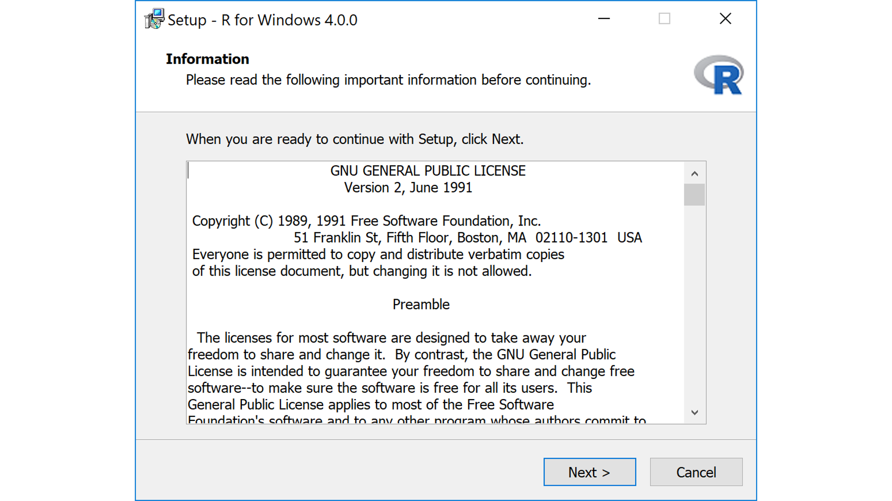
```

If R installed properly, you should now see it in the Windows start menu.

```{r echo=FALSE}
knitr::include_graphics("img/01_part_getting_started/01_install_r/install_r_windows/view_r.png")
```

**Step 8:** Now we need to install the RStudio IDE. To do this, navigate to the RStudio desktop download website, which is located at https://rstudio.com/products/rstudio/download/. On that page, click the download button under RStudio Desktop Open Source License Free.

```{r echo=FALSE}
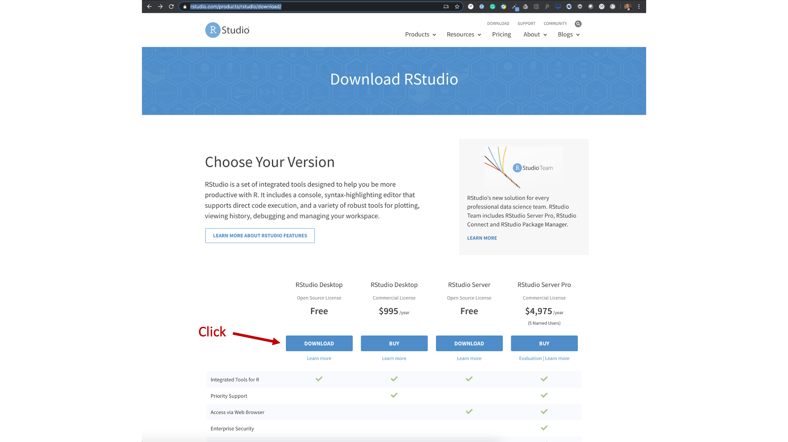
```

**Step 9:** Download the most current version for Windows.

```{r echo=FALSE}
knitr::include_graphics("img/01_part_getting_started/01_install_r/install_r_windows/download_rstudio2.png")
```

**Step 10:** Again, locate the installation file you just downloaded and double click it. Unless you’ve changed your download settings, this file should be in the same location as the R installation file you already downloaded.

```{r echo=FALSE}
knitr::include_graphics("img/01_part_getting_started/01_install_r/install_r_windows/install_rstudio1.png")
```

**Step 11:** Another dialogue box will open and ask you to make some decisions about how and where you want to install RStudio on your computer. I typically just click “Next” at every step without changing any of the default options. 

```{r echo=FALSE}
knitr::include_graphics("img/01_part_getting_started/01_install_r/install_r_windows/install_rstudio2.png")
```

When RStudio is finished installing, you should see RStudio in the Windows start menu. Click the icon to open RStudio.

```{r echo=FALSE}
knitr::include_graphics("img/01_part_getting_started/01_install_r/install_r_windows/view_rstudio1.png")
```

The RStudio IDE should open and look something like the window you see here. If so, you are good to go! 🎉

```{r echo=FALSE}
knitr::include_graphics("img/01_part_getting_started/01_install_r/install_r_windows/view_rstudio2.png")
```

<!--chapter:end:chapters/01_part_getting_started/01_install_r.Rmd-->

# What is R?

At this point in the book, you should have installed R and RStudio on your computer, but you may be thinking to yourself, “I don’t even know what R is.” Well, in this chapter you’ll find out. I’ll start with an overview of the R language, and then briefly touch on its capabilities and uses. You’ll also see a complete R program and some complete documents generated by R programs. In this book you’ll learn how to create similar programs and documents, and by the end of the book you’ll be able to write your own R programs and present your results in the form of an issue brief written for general audiences who may or may not have public health expertise. But, before we discuss R let’s discuss something even more basic – data. Here’s a question for you: What is data?

## What is data?

Data is information about objects (e.g., people, places, schools) and observable phenomenon (e.g., weather, temperatures, and disease symptoms) that is recorded and stored somehow as a collection of symbols, numbers, and letters. So, data is just information that has been "written" down.

<!-- maybe insert a data fig -->

Here we have a table, which is a common way of organizing data. In R, we will typically refer to these tables as **data frames**.

```{r echo=FALSE}
knitr::include_graphics("img/01_part_getting_started/02_what_is_r/table.png")
```

Each box is a data frame is called a **cell**.

```{r echo=FALSE}
knitr::include_graphics("img/01_part_getting_started/02_what_is_r/table_cells.png")
```

Moving from left to right across the data frame are **columns**. Columns are also sometimes referred to as **variables**. In this book, we will often use the terms columns and variables interchangeably. Each column in a data frame has one, and only one, type. For now, know that the type tells us what kind of data is contained in a column and what we can _do_ with that data. You may have already noticed that 3 of the columns in the table we’ve been looking at contain numbers and 1 of the columns contains words. These columns will have different types in R and we can do different things with them based on their type. For example, we could ask R to tell us what the average value of the numbers in the height column are, but it wouldn’t make sense to ask R to tell us the average value of the words in the Gender column. We will talk more about many of the different column types exist in R later in this book.

```{r echo=FALSE}
knitr::include_graphics("img/01_part_getting_started/02_what_is_r/table_columns.png")
```

The information contained in the first cell of each column is called the **column name** (or variable) name.

R gives us a lot of flexibility in terms of what we can name our columns, but there are a few rules. 

1. Column names can contain letters, numbers and the dot (.) or underscore (_) characters.    
2. Additionally, they can begin with a letter or a dot -- as long as the dot is not followed by a number. So, a name like ".2cats" is not allowed.    
3. Finally, R has some reserved words that you are not allowed to use for column names. These include: “if”,  “else”, “repeat”, “while”, “function”, “for”, “in”, “next”, and “break”.    

```{r echo=FALSE}
knitr::include_graphics("img/01_part_getting_started/02_what_is_r/table_column_name.png")
```

Moving from top to bottom across the table are **rows**, which are sometimes referred to as records.

```{r echo=FALSE}
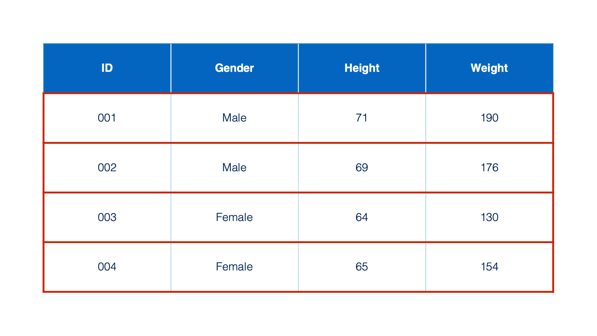
```

Finally, the contents of each cell are called **values**. 

```{r echo=FALSE}
knitr::include_graphics("img/01_part_getting_started/02_what_is_r/table_values.png")
```

You should now be up to speed on some basic terminology used by R, as well as other analytic, database, and spreadsheet programs. These terms will be used repeatedly throughout the course.

## What is R?

```{r echo=FALSE}
knitr::include_graphics("img/01_part_getting_started/02_what_is_r/r_logo.png")
```

So, what is R? Well, R is an **open source** statistical programming language that was created in the 1990’s specifically for data analysis. We will talk more about what open source means later, but for now, just think of R as an easy (relatively 😂) way to ask your computer to do math and statistics for you. More specifically, by the end of this book you will be able to independently use R to transfer data, manage data, analyze data, and present the results of your analysis. Let’s quickly take a closer look at each of these.

```{r echo=FALSE}
knitr::include_graphics("img/01_part_getting_started/02_what_is_r/competencies_overview.png")
```

### Transferring data {#transferring-data}

```{r echo=FALSE}
knitr::include_graphics("img/01_part_getting_started/02_what_is_r/competencies_transfer.png")
```

So, what do we mean by “transfer data”? Well, individuals and organizations store their data using different computer programs that use different file types. Some common examples that you may come across in epidemiology are database files, spreadsheets, raw data files, and SAS data sets. No matter how the data is stored, you can’t do anything with it until you can get it into R, in a form that R can use, and in a location that you can reach. In other words, transferring your data. Therefore, among our first tasks in this course will be to transfer data.

### Managing data

```{r echo=FALSE}
knitr::include_graphics("img/01_part_getting_started/02_what_is_r/competencies_manage.png")
```

This isn’t very specific, but managing data is all the things you may have to do to your data to get it ready for analysis. You may also hear people refer to this process as data wrangling or data munging. Some specific examples of data management tasks include:

* <span class="underline">Validating and cleaning data</span>. In other words, dealing with potential errors in the data.   
* <span class="underline">Subsetting data</span>. For example, using only some of the columns or some of the rows.    
* <span class="underline">Creating new variables</span>. For example, creating a BMI variable in a data frame that was sent to you with height and weight columns.    
* <span class="underline">Combining data frames</span>. For example, combining sociodemographic data about study participants with data collected in the field during an intervention.    

You may sometimes hear people refer to the 80/20 rule in reference to data management. This “rule” says that in a typical data analysis project, roughly 80% of your time will be spent on data management and only 20% will be spent on the analysis itself. I can’t provide you with any empirical evidence (i.e., data) to back this claim up. But, as a person who has been involved in many projects that involve the collection and analysis of data, I can tell you anecdotally that this ”rule” is probably pretty close to being accurate in most cases. 

Additionally, it’s been my experience that most students of epidemiology are required to take one or more classes that emphasize methods for analyzing data; however, almost none of them have taken a course that emphasizes data management! 

Therefore, because data management is such a large component of most projects that involve the collection and analysis of data, and because most readers will have already been exposed to data analysis to a much greater extent than data management, this course will heavily emphasize the latter.

### Analyzing data

```{r echo=FALSE}
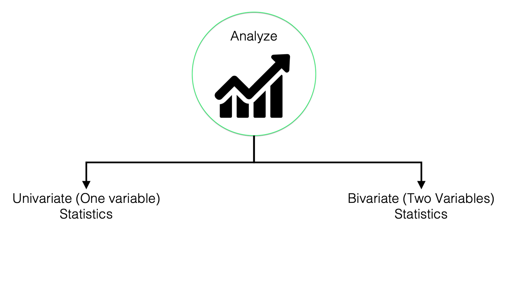
```

As just discussed, this is probably the capability you most closely associate with R, and there is no doubt that R is a powerful tool for analyzing data. However, in this book we won’t go beyond using R to calculate basic descriptive statistics. For our purposes, descriptive statistics include:    

* <span class="underline">Measures of central tendency</span>. For example, mean, median, and mode.   
* <span class="underline">Measures of dispersion</span>. For example, variance and standard error.   
* <span class="underline">Measures for describing categorical variables</span>. For example, counts and percentages.   
* <span class="underline">Describing data using graphs and charts</span>. With R, we can describe our data using [beautiful and informative graphs](https://www.r-graph-gallery.com/).   

### Presenting data

```{r echo=FALSE}
knitr::include_graphics("img/01_part_getting_started/02_what_is_r/competencies_present.png")
```

And finally, the ultimate goal is typically to present your findings in some form or another. For example, a report, a website, or a journal article. With R you can present your results in many different formats with relative ease. In fact, this is one of my favorite things about R and RStudio. In this class you will learn how to take your text, tabular, or graphical results and then publish them in many different formats including Microsoft Word, html files that can be viewed in web browsers, and pdf documents. Let’s take a look at some examples.

1. **Microsoft Word documents**. [Click here](https://www.dropbox.com/s/6l1ikp6wbyue9bd/chap_2_example_word_docI.docx?dl=0) to view an example report created for one of my research projects in Microsoft Word.   
2. **PDF documents**. [Click here](https://www.dropbox.com/s/hheuyv5qcabf197/chap_2_example_pdf.pdf?dl=0) to view a data dictionary I created in PDF format.   
3. **HTML files**. Hypertext Markup Language (HTML) files are what you are looking at whenever you view a webpage. You can use R to create HTML files that others can view in their web browser. You can email them these files to view in their web browser, or you can make them available for others to view online just like any other website. [Click here](https://brad-cannell.github.io/detect_recruitment_dashboard/) to view an example dashboard I created for one of my research projects.    
4. **Web applications**. You can even use R to create full-fledged web applications. View the [RStudio website](https://shiny.rstudio.com/gallery/) to see some examples.

<!--chapter:end:chapters/01_part_getting_started/02_what_is_r.Rmd-->

# Navigating the RStudio interface

You now have R and RStudio on your computer and you have some idea of what R and RStudio are. At this point, it is really common for people to open RStudio and get totally overwhelmed. _“What am I looking at?”_ _”What do I click first?”_ _“Where do I even start?”_ Don’t worry if these, or similar, thoughts have crossed your mind. You are in good company and we will start to clear some of them up in this chapter.

When you first load RStudio you should see a screen that looks very similar to what you see in the picture below. \@ref(fig:rstudio) In the current view, you see three **panes** and each pane has multiple tabs. Don’t beat yourself up if this isn't immediately obvious. I’ll make it clearer soon.

```{r rstudio, echo=FALSE, fig.cap="The default RStudio user interface."}
knitr::include_graphics("img/01_part_getting_started/03_navigating_rstudio/rstudio.png")
```

## The console

The first pane we are going to talk about is the Console/Terminal/Jobs pane. \@ref(fig:console)

```{r console, echo=FALSE, fig.cap="The R console."}
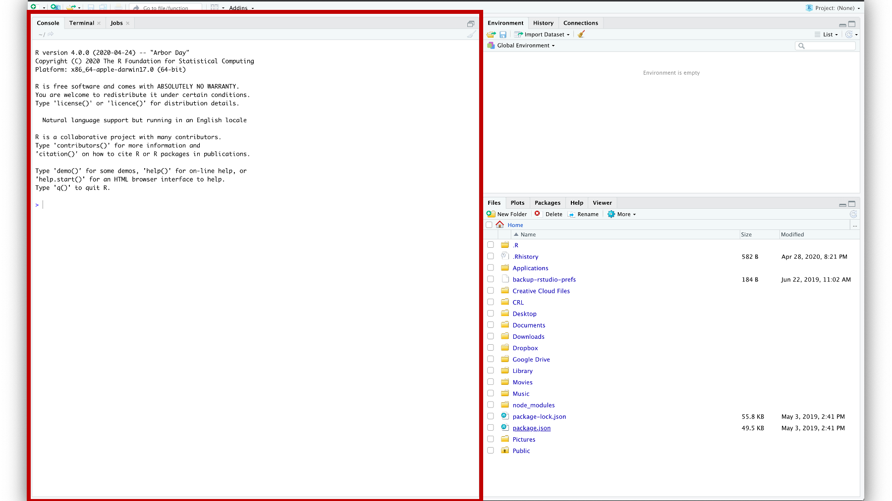
```

It’s called the Console/Terminal/Jobs pane because it has three tabs you can click on: Console, Terminal, and Jobs. However, we will mostly refer to it as the Console pane and we will mostly ignore the Terminal and Jobs tabs. We aren’t ignoring them because they aren’t useful; rather, we are ignoring them because using them isn’t essential for anything we discuss anytime soon, and I want to keep things as simple as possible. 

The **console** is the most basic way to interact with R. You can type a command to R into the console prompt (the prompt looks like “>”) and R will respond to what you type. For example, below I’ve typed “1 plus 1,” hit enter, and the R console returned the sum of the numbers 1 and 1. \@ref(fig:one-plus-one)

```{r one-plus-one, echo=FALSE, fig.cap="Doing some addition in the R console."}
knitr::include_graphics("img/01_part_getting_started/03_navigating_rstudio/one_plus_one.png")
```

The number 1 you see in brackets before the 2 (i.e., [1]) is telling you that this line of results starts with the first result. That fact is obvious here because there is only one result. To make this idea clearer, let’s show you a result with multiple lines.

```{r seq-function, echo=FALSE, fig.cap="Demonstrating a function that returns multiple results."}
knitr::include_graphics("img/01_part_getting_started/03_navigating_rstudio/seq_function.png")
```

In the screenshot above we see a couple new things demonstrated. \@ref(fig:seq-function)

First, as promised, we have more than one line of results (or output). The first line of results starts with a 1 in brackets (i.e., [1]), which indicates that this line of results starts with the first result. In this case the first result is the number 2. The second line of results starts with a 29 in brackets (i.e., [29]), which indicates that this line of results starts with the twenty-ninth result. In this case the twenty-ninth result is the number 58. If you count the numbers in the first line, there should be 28 -- results 1 through 28. I also want to make it clear that “1” and “29” are NOT results themselves. They are just helping us count the number of results per line. 

The second new thing here that you may have noticed is our use of a **function**. Functions are a **BIG DEAL** in R. So much so that R is called a _functional language_. You don’t really need to know all the details of what that means; however, you should know that, in general, everything you _do_ in R you will _do_ with a function. By contrast, everything you _create_ in R will be an _object_. If you wanted to make an analogy between the R language and the English language, functions are verbs -- they _do_ things -- and objects are nouns -- they _are_ things. This may be confusing right now. Don’t worry. It will become clearer soon.

Most functions in R begin with the function name followed by parentheses. For example, `seq()`, `sum()`, and `mean()`. 

_Question_: What is the name of the function we used in the example above? 

It’s the `seq()` function – short for sequence. Inside the function, you may notice that there are three pairs of words, equal symbols, and numbers that are separated by commas. They are, `from = 2`, `to = 100`, and `by = 2`. In this case, `from`, `to`, and `by` are all **arguments** to the `seq()` function. I don’t know why they are called arguments, but as far as we are concerned, they just are. We will learn more about functions and arguments later, but for now just know that arguments _give functions the information they need to give us the result we want_. 

In this case, the `seq()` function gives us a sequence of numbers, but we have to give it information about where that sequence should start, where it should end, and how many steps should be in the middle. Here the sequence begins with the value we gave to the `from` argument (i.e., 2), ends with the value we gave to the `to` argument (i.e., 100), and increases at each step by the number we gave to the `by` argument (i.e., 2). So, 2, 4, 6, 8 … 100. 

While it’s convenient, let’s also learn some programming terminology:

* **Arguments:** Arguments always go _inside_ the parentheses of a function and give the function the information it needs to give us the result we want.   

* **Pass:** In programming lingo, you _pass_ a value to a function argument. For example, in the function call `seq(from = 2, to = 100, by = 2)` we could say that we passed a value of 2 to the `from` argument, we passed a value of 100 to the `to` argument, and we passed a value of 2 to the `by` argument.   

* **Returns:** Instead of saying, “the `seq()` function _gives us_ a sequence of numbers…” we could say, “the `seq()` function _returns_ a sequence of numbers…” In programming lingo, functions _return_ one or more results.   

<p class="note"> 🗒**Side Note:** The `seq()` function isn’t particularly important or noteworthy. I essentially chose it at random to illustrate some key points. However, arguments, passing values, and return values are extremely important concepts and we will return to them many times. </p>

## The environment pane

The second pane we are going to talk about is the Environment/History/Connections pane.  \@ref(fig:environment-pane) However, we will mostly refer to it as the Environment pane and we will mostly ignore the History and Connections tab. We aren’t ignoring them because they aren’t useful; rather, we are ignoring them because using them isn’t essential for anything we will discuss anytime soon, and I want to keep things as simple as possible. 

```{r environment-pane, echo=FALSE, fig.cap="The environment pane."}
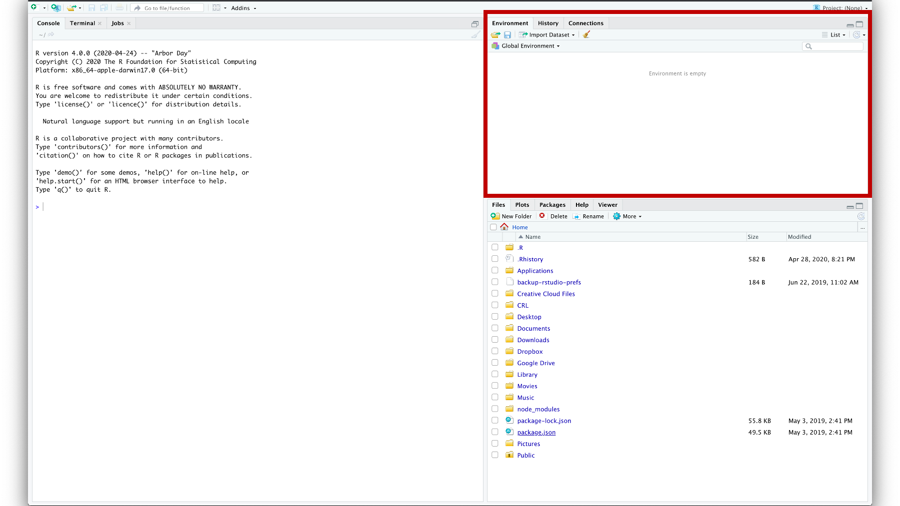
```

The Environment pane shows you all the **objects** that R can currently use for data management or analysis. In this picture, \@ref(fig:environment-pane) our environment is empty. Let’s create an object and add it to our Environment.

```{r environment-pane2, echo=FALSE, fig.cap="The vector x in the global environment."}
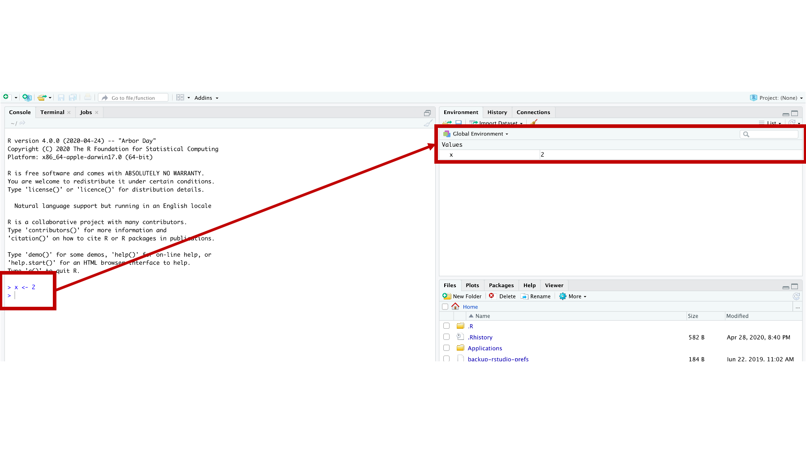
```

Here we see that we created a new object called `x`, which now appears in our **Global Environment**. \@ref(fig:environment-pane2) This gives us another great opportunity to discuss some new concepts. 

First, we created the `x` object in the Console by _assigning_ the value 2 to the letter x. We did this by typing “x” followed by a less than symbol (<), a dash symbol (-), and the number 2. R is kind of unique in this way. I have never seen another programming language (although I’m sure they are out there) that uses `<-` to assign values to variables. By the way, `<-` is called the assignment operator (or assignment arrow), and ”assign” here means “make x contain 2” or "put 2 inside x." 

In many other languages you would write that as `x = 2`. But, for whatever reason, in R it is `<-`. Unfortunately, `<-` is more awkward to type than `=`. Fortunately, RStudio gives us a keyboard shortcut to make it easier. To type the assignment operator in RStudio, just hold down Option + - (dash key) on a Mac or Alt + - (dash key) on a PC and RStudio will insert `<-` complete with spaces on either side of the arrow. This may still seem awkward at first, but you will get used to it.

<p class="note"> 🗒**Side Note:** A note about using the letter "x": By convention, the letter "x" is a widely used variable name. You will see it used a lot in example documents and online. However, there is nothing special about the letter x. We could have just as easily used any other letter (`a <- 2`), word (`variable <- 2`), or descriptive name (`my_favorite_number <- 2`) that is allowed by R. </p>

Second, you can see that our Global Environment now includes the object `x`, which has a value of 2. In this case, we would say that `x` is a **numeric vector** of length 1 (i.e., it has one value stored in it). We will talk more about vectors and vector types soon. For now, just notice that objects that you can manipulate or analyze in R will appear in your Global Environment.

<p class="warning"> ⚠️**Warning:** R is a **case sensitive** language. That means that uppercase x (X) and lowercase x (x) are different things to R. So, if you assign 2 to lower case x (`x <- 2`). And then later ask R to tell what number you stored in uppercase X, you will get an error (`Error: object 'X' not found`). </p>

## The files pane

Next, let’s talk about the Files/Plots/Packages/Help/Viewer pane (that’s a mouthful). \@ref(fig:files-pane) 

```{r files-pane, echo=FALSE, fig.cap="The Files/Plots/Packages/Help/Viewer pane."}
knitr::include_graphics("img/01_part_getting_started/03_navigating_rstudio/files_pane.png")
```

Again, some of these tabs are more applicable for us than others. For us, the **files** tab and the **help** tab will probably be the most useful. You can think of the files tab as a mini Finder window (for Mac) or a mini File Explorer window (for PC). The help tab is also extremely useful once you get acclimated to it.

```{r help, echo=FALSE, fig.cap="The help tab."}
knitr::include_graphics("img/01_part_getting_started/03_navigating_rstudio/help.png")
```

For example, in the screenshot above \@ref(fig:help) we typed the `seq` into the search bar. The help pane then shows us a page of documentation for the `seq()` function. The documentation includes a brief description of what the function does, outlines all the arguments the `seq()` function recognizes, and, if you scroll down, gives examples of using the `seq()` function. Admittedly, this help documentation can seem a little like reading Greek (assuming you don't speak Greek) at first. But, you will get more comfortable using it with practice. I hated the help documentation when I was learning R. Now, I use it _all the time_.

## The source pane

There is actually a fourth pane available in RStudio. If you click on the icon shown below you will get the following dropdown box with a list of files you can create. \@ref(fig:source1)

```{r source1, echo=FALSE, fig.cap="Click the new source file icon."}
knitr::include_graphics("img/01_part_getting_started/03_navigating_rstudio/source1.png")
```

If you click any of these options, a new pane will appear. I will arbitrarily pick the first option – R Script. 

```{r source2, echo=FALSE, fig.cap="New source file options."}
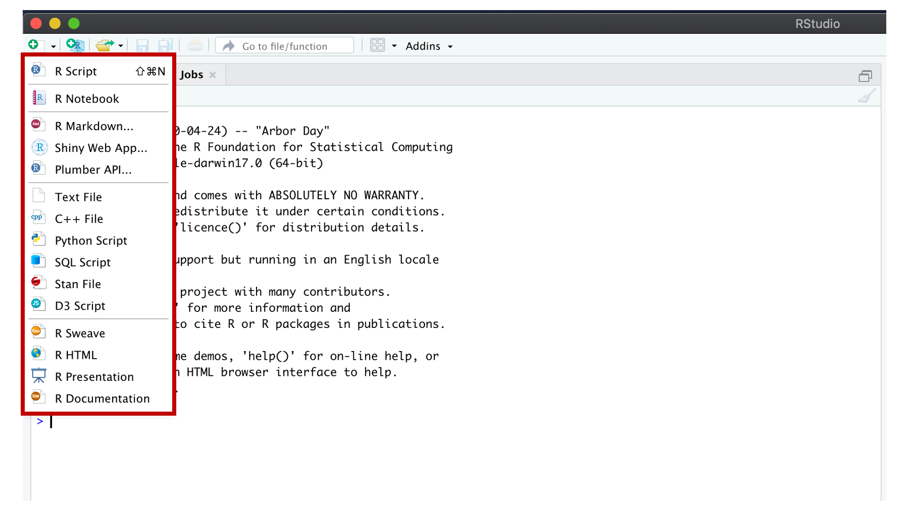
```

When I do, a new pane appears. It's called the **source pane**. In this case, the source pane contains an untitled R Script. We won’t get into the details now because I don’t want to overwhelm you, but soon you will do the majority of your R programming in the source pane.

```{r source3, echo=FALSE, fig.cap="A blank R script in the source pane."}
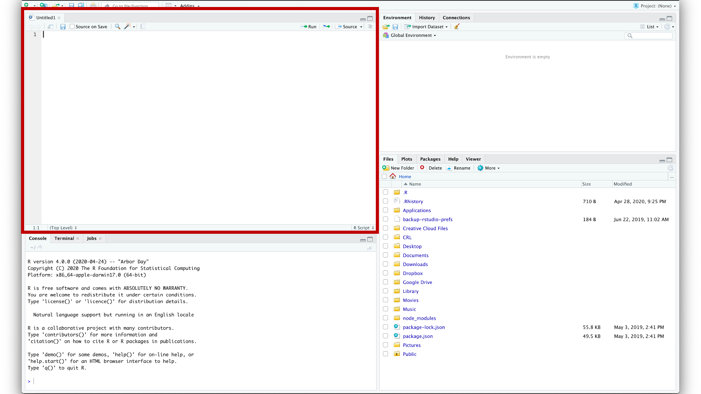
```

## RStudio preferences

Finally, I’m going to recommend that you change a few settings in RStudio before we move on. 

Start by going to RStudio -> Preferences (on Mac) \@ref(fig:preferences1) 

```{r preferences1, echo=FALSE, fig.cap="Select the preferences menu on Mac."}
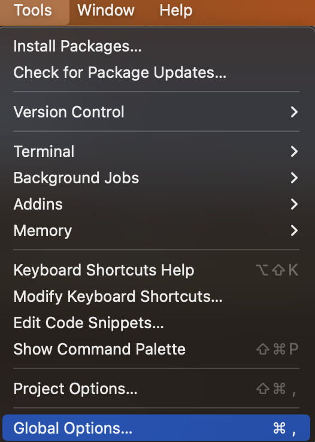
```

Or start by going to Tools -> Global Options (on Windows) \@ref(fig:preferences2) 

```{r preferences2, echo=FALSE, fig.cap="Select the global options menu on Windows."}
knitr::include_graphics("img/01_part_getting_started/03_navigating_rstudio/preferences2.png")
```

In the “General” tab, I recommend unchecking the “Restore .Rdata into workspace at startup” checkbox. I also recommend setting the “Save workspace .Rdata on exit” dropdown to “Never.” Finally, I recommend unchecking the “Always save history (even when not saving .Rdata)” checkbox. \@ref(fig:preferences3)

```{r preferences3, echo=FALSE, fig.cap="General options tab."}
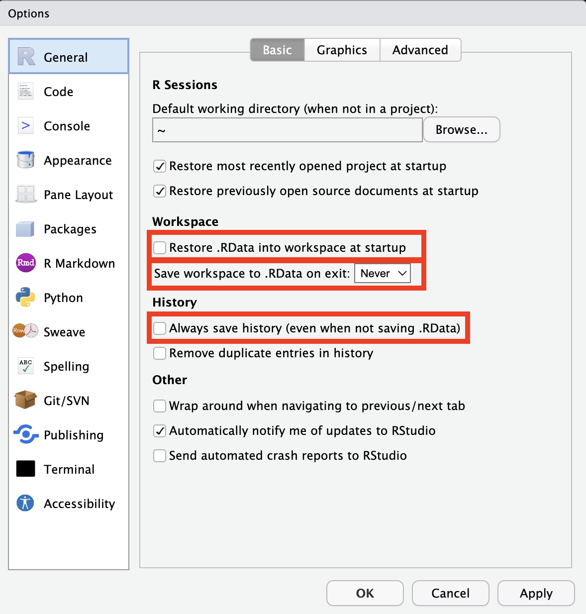
```

On the “Appearance” tab, I’m going to change my Editor Theme to Twilight. It’s not so much that I’m recommending you change yours – this is entirely personal preference – I’m just letting you know why my screenshots will look different from here on out. \@ref(fig:preferences4)

```{r preferences4, echo=FALSE, fig.cap="Appearance tab."}
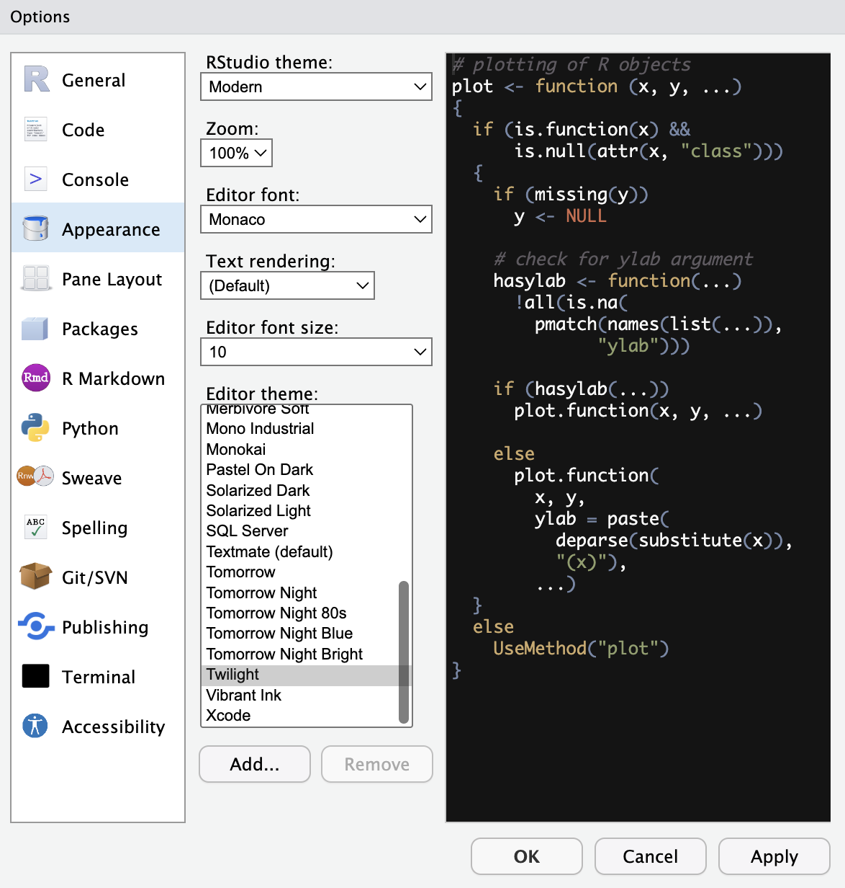
```

I'm sure you still have lots of questions at this point. That's totally natural. However, I hope you now feel like you have some idea of what you are looking at when you open RStudio. Most of you will naturally get more comfortable with RStudio as we move through the book. For those of you who want more resources now, here are some suggestions.

1. [RStudio IDE cheatsheet](https://rstudio.com/resources/cheatsheets/)

2. [ModernDive: What are R and RStudio?](https://moderndive.com/1-getting-started.html#r-rstudio)

<!--chapter:end:chapters/01_part_getting_started/03_navigating_rstudio.Rmd-->

# Speaking R’s language

```{r echo=FALSE}
knitr::include_graphics("img/01_part_getting_started/04_speaking_r/intro_slide_gif.gif")
```

Students taking my R for epidemiology course often come into the course thinking it will be a math or statistics course. In reality, this course is probably much closer to a foreign language course. There is no doubt that we need a foundational understanding of math and statistics to understand the results we get from R, but R will take care of all of the complicated stuff for us. All we have to do is learn how to ask R to do what we want it to do. To some extent, this entire book is about learning to communicate with R. So, in this chapter we will introduce the R programming language from the 30,000-foot level.

## R is a _language_

In the same way that many people use the English language to communicate with each other, we will use the R programming language to communicate with R. Just like the English language, the R language comes complete with its own structure and vocabulary. Unfortunately, just like the English language, it also includes some weird exceptions and occasional miscommunications. We’ve already seen a couple examples of commands written to R in the R programming language. Specifically:

```{r}
# Store the value 2 in the variable x
x <- 2
# Print the contents of x to the screen
x
```

and 

```{r}
# Print an example number sequence to the screen
seq(from = 2, to = 100, by = 2)
```

<p class="note"> 🗒**Side Note:** The gray boxes you see above are called R code chunks and I created them (and this entire book) using something called [R markdown](https://rmarkdown.rstudio.com/). Can you believe that you can write an entire book with R and RStudio? How cool is that? You will learn to use R markdown documents later in this book. R markdown is great because it allows you to mix R code with narrative text and multimedia content as I've done throughout the page you're currently looking at. This makes it really easy for us to add context and aesthetic appeal to our results.</p>

## The R interpreter

Question: I keep talking about "speaking" to R, but when you speak to R using the R language, who are you actually speaking to?

Well, you are speaking to something called the **R interpreter**. The R interpreter takes the commands we've written in the R language, sends them to your computer to do the actual work (e.g., get the mean of a set of numbers), and then translates the results of that work back to us in a form that we humans can understand (e.g., the mean is 25.5). At this stage, one of the key concepts for you to understand about the R language is that is **extremely literal!** Understanding the literal nature of R is important because it will be the underlying cause of a lot of errors in your R code. 

## Errors

No matter what I write next, you are going to get errors in your R code. I still get errors in my R code every single time I write R code. However, my hope is that this section will help you begin to understand _why_ you are getting errors when you get them and provide us with a common language for discussing errors.

So, what exactly do I mean when I say that the R interpreter is extremely literal? Well, in the Navigating RStudio chapter I already told you that R is a **case sensitive** language. Again, that means that uppercase x (X) and lowercase x (x) are different things to R. So, if you assign 2 to lowercase x (`x <- 2`). And then later ask R to tell what number you stored in upper case X; you will get an error (`Error: object 'X' not found`).

```{r error=TRUE}
x <- 2
X
```

Specifically, this is an example of a **logic error**. Meaning, R understands what you are _asking_ it to do -- you want it to print the contents of the uppercase X object to the screen. However, it can't complete your request because you are asking it to do something that doesn't logically make sense -- print the contents of a thing that doesn't exist. Remember, R is literal, and it will not try to guess that you actually _meant_ to ask it to print the contents of lowercase x.

Another general type of error is known as a **syntax error**. In programming languages, **syntax** refers to the rules of the language. You can sort of think of this as the grammar of the language. In English, I could say something like, "giving dog water drink." This sentence is grammatically completely incorrect; however, most of you would roughly be able to figure out what I'm asking you to do based on your life experience and knowledge of the situational context. The R interpreter, as awesome as it is, would not be able to make an assumption about what I want it to do. There would either be one, and only one, preprogrammed correct response to such a request, or the R interpreter would say, "I don't know what you're asking me to do." When the R interpreter says, "I don't know what you're asking me to do," you've made a syntax error.

Throughout the rest of the book, I will try to point out situations where R programmers often encounter errors and how you may be able to address them. The remainder of this chapter will discuss some key components of R's syntax and the data structures (i.e., ways of storing data) that the R syntax interacts with.

## Functions

R is a [functional programming language](https://en.wikipedia.org/wiki/Functional_programming), which simply means that _functions_ play a central role in the R language. But what are functions? Well, factories are a common analogy used to represent functions. In this analogy, arguments are raw material inputs that go into the factory. For example, steel and rubber. The function is the factory where all the work takes place -- converting raw materials into the desired output. Finally, the factory output represents the returned results. In this case, bicycles. 

```{r factory, echo=FALSE, fig.cap="A factory making bicycles."}
knitr::include_graphics("img/01_part_getting_started/04_speaking_r/factory1.png")
```

To make this concept more concrete, in the [Navigating RStudio][Navigating the RStudio interface] chapter we used the `seq()` function as a factory. Specifically, we wrote `seq(from = 2, to = 100, by = 2)`. The inputs (arguments) were `from`, `to`, and `by`. The output (returned result) was a set of numbers that went from 2 to 100 by 2's. Most functions, like the `seq()` function, will be a word or word part followed by parentheses. Other examples are the `sum()` function for addition and the `mean()` function to calculate the average value of a set of numbers.

```{r factory2, echo=FALSE, fig.cap="A function factory making numbers."}
knitr::include_graphics("img/01_part_getting_started/04_speaking_r/factory2.png")
```

## Objects

In addition to functions, the R programming language also includes objects. In the Navigating RStudio chapter we created an object called `x` with a value of 2 using the `x <- 2` R code. In general, you can think of objects as anything that lives in your R global environment. Objects may be single variables (also called vectors in R) or entire data sets (also called data frames in R). 

Objects can be a confusing concept at first. I think it’s because it is hard to precisely define exactly what an object is. I’ll say two things about this. First, you’re probably overthinking it. When we use R, we create and save stuff. We have to call that stuff something in order to talk about it or write books about it. Somebody decided we would call that stuff “objects.” The second thing I’ll say is that this becomes much less abstract when we finally get to a place where you can really get your hands dirty doing some R programming.

```{r object, echo=FALSE, fig.cap="Creating the x object."}
knitr::include_graphics("img/01_part_getting_started/04_speaking_r/objects.png")
```

Sometimes it can be useful to relate the R language to English grammar. That is, when you are writing R code you can roughly think of functions as verbs and objects as nouns. Just like nouns _are_ things in the English language, and verbs _do_ things in the English language, objects _are_ things and functions _do_ things in the R language. 

So, in the `x <- 2` command `x` is the object and `<-` is the function. “Wait! Didn’t you just tell us that functions will be a word followed by parentheses?” Fair question. Technically, I said, “_Most_ functions will be a word, or word part, followed by parentheses.” Just like English, R has exceptions. All **operators** in R are also functions. Operators are symbols like `+`, `-`, `=`, and `<-`. There are many more operators, but you will notice that they all _do_ things. In this case, they add, subtract, and assign values to objects.

```{r echo=FALSE}
knitr::include_graphics("img/01_part_getting_started/04_speaking_r/language.png")
```

## Comments
 
And finally, there are comments. If our R code is a conversation we are having with the R interpreter, then comments are your inner thoughts taking place during the conversation. Comments don’t actually mean anything to R, but they will be extremely important for you. You actually already saw a couple examples of comments above. 

```{r}
# Store the value 2 in the variable x
x <- 2
# Print the contents of x to the screen
x
```

In this code chunk, "# Store the value 2 in the variable x" and "# Print the contents of x to the screen" are both examples of comments. Notice that they both start with the pound or hash sign (#). The R interpreter will ignore anything on the _current line_ that comes after the hash sign. A carriage return (new line) ends the comment. However, comments don't have to be written on their own line. They can also be written on the same line as R code as long as put them after the R code, like this:

```{r}
x <- 2 # Store the value 2 in the variable x
x      # Print the contents of x to the screen
```

Most beginning R programmers underestimate the importance of comments. In the silly little examples above, the comments are not that useful. However, comments will become extremely important as you begin writing more complex programs. When working on projects, you will often need to share your programs with others. Reading R code without any context is really challenging -- even for experienced R programmers. Additionally, even if your collaborators can surmise _what_ your R code is doing, they may have no idea _why_ you are doing it. Therefore, your comments should tell others what your code does (if it isn't completely obvious), and more importantly, what your code is trying to accomplish. Even if you aren't sharing your code with others, you may need to come back and revise or reuse your code months or years down the line. You may be shocked at how foreign the code _you wrote_ will seem months or years after you wrote it. Therefore, comments are not just important for others, they are also important for future you!

<p class="note"> 🗒**Side Note:** RStudio has a handy little keyboard shortcut for creating comments. On a Mac, type shift + command + C. On Windows, Shift + Ctrl + C. </p>

<p class="note"> 🗒**Side Note:** Please put a space in between the pound/hash sign and the rest of your text when writing comments. For example, `# here is my comment` instead of `#here is my comment`. It just makes the comment easier to read.</p>

## Packages

In addition to being a functional programming language, R is also a type of programming language called an [open source](https://en.wikipedia.org/wiki/Open-source_software) programming language. For our purposes, this has two big advantages. First, it means that R is **FREE!** Second, it means that smart people all around the world get to develop new **packages** for the R language that can do cutting edge and/or very niche things.

That second advantage is probably really confusing if this is not a concept you are already familiar with. For example, when you install Microsoft Word on your computer all the code that makes that program work is owned and Maintained by the Microsoft corporation. If you need Word to do something that it doesn’t currently do, your only option is really to make a feature request on Microsoft’s website.

R works a little differently. When you downloaded R from the CRAN website, you actually downloaded something called **Base R**. Base R maintained by the R Core Team. However, anybody – _even you_ – can write your own code (called packages) that add new functions to the R syntax. Like all functions, these new functions allow you to _do_ things that you can't do (or can't do as easily) with Base R.

An analogy that I really like here is used by Ismay and Kim in [ModernDive](https://moderndive.com/1-getting-started.html#packages).

> A good analogy for R packages is they are like apps you can download onto a mobile phone. So R is like a new mobile phone: while it has a certain amount of features when you use it for the first time, it doesn’t have everything. R packages are like the apps you can download onto your phone from Apple’s App Store or Android’s Google Play. @Ismay2019-iw

So, when you get a new smart phone it comes with apps for making phone calls, checking email, and sending text messages. But, what if you want to listen to music on Spotify? You may or may not be able to do that through your phone's web browser, but it's way more convenient and powerful to download and install the Spotify app.

In this course, we will make extensive use of packages developed by people and teams outside of the R Core Team. In particular, we will use a number of related packages that are collectively known as the [Tidyverse](https://www.tidyverse.org/). One of the most popular packages in the tidyverse collection (and one of the most popular R packages overall) is called the `dplyr` package for data management.

In the same way that you have to download and install Spotify on your mobile phone before you can use it, you have to download and install new R packages on your computer before you can use the functions they contain. Fortunately, R makes this really easy. For most packages, all you have to do is run the `install.packages()` function in the R console. For example, here is how you would install the `dplyr` package. 

```{r eval=FALSE}
# Make sure you remember to wrap the name of the package in single or double quotes.
install.packages("dplyr")
```

Over time, you will download and install a lot of different packages. All those packages with all of those new functions start to create a lot of overhead. Therefore, R doesn't keep them loaded and available for use at all times. Instead, _every time_ you open RStudio, you will have to explicitly tell R which packages you want to use. So, when you close RStudio and open it again, the only functions that you will be able to use are Base R functions. If you want to use functions from any other package (e.g., `dplyr`) you will have to tell R that you want to do so using the `library()` function. 

```{r eval=FALSE}
# No quotes needed here
library(dplyr)
```

Technically, loading the package with the `library()` function is not the only way to use a function from a package you've downloaded. For example, the `dplyr` package contains a function called `filter()` that helps us keep or drop certain rows in a data frame. To use this function, we have to first download the `dplyr` package. Then we can use the filter function in one of two different ways.

```{r eval=FALSE}
library(dplyr)
filter(states_data, state == "Texas") # Keeps only the rows from Texas
```

The first way you already saw above. Load all the functions contained in the `dplyr` package using the `library()` function. Then use that function just like any other Base R function. 

The second way is something called the **double colon syntax**. To use the double colon syntax, you type the package name, two colons, and the name of the function you want to use from the package. Here is an example of the double colon syntax.

```{r eval=FALSE}
dplyr::filter(states_data, state == "Texas") # Keeps only the rows from Texas
```

Most of the time you will load packages using the `library()` function. However, I wanted to show you the double colon syntax because you may come across it when you are reading R documentation and because there are times when it makes sense to use this syntax. 

## Programming style

Finally, I want to discuss programming style. R can read any code you write as long as you write it using valid R syntax. However, R code can be much easier or harder for people (including you) to read depending on how it's written. The [coding best practices chapter](#coding-best-practices) of this book gives complete details on writing R code that is as easy as possible for _people_ to read. So, please make sure to read it. It will make things so much easier for all of us!

<!--chapter:end:chapters/01_part_getting_started/04_speaking_r.Rmd-->

# Let’s get programming

In this chapter, we are going to tie together many of the concepts we've learned so far, and you are going to create your first basic R program. Specifically, you are going to write a program that simulates some data and analyzes it. 

## Simulating data

Data simulation can be really complicated, but it doesn't have to be. It is simply the process of _creating_ data as opposed to _finding data in the wild_. This can be really useful in several different ways.

1. Simulating data is really useful for getting help with a problem you are trying to solve. Often, it isn't feasible for you to send other people the actual data set you are working on when you encounter a problem you need help with. Sometimes, it may not even be legally allowed (i.e., for privacy reasons). Instead of sending them your entire data set, you can simulate a little data set that recreates the challenge you are trying to address without all the other complexity of the full data set. As a bonus, I have often found that I end up figuring out the solution to the problem I'm trying to solve as I recreate the problem in a simulated data set that I intended to share with others.

2. Simulated data can also be useful for learning about and testing statistical assumptions. In epidemiology, we use statistics to draw conclusions about populations of people we are interested in based on samples of people drawn from the population. Because we don't actually have data from _all_ the people in the population, we have to make some assumptions about the population based on what we find in our sample. When we simulate data, we know the truth about our population because we _created_ our population to have that truth. We can then use this simulated population to play "what if" games with our analysis. _What if we only sampled half as many people?_ _What if their heights aren't actually normally distributed?_ _What if we used a probit model instead of a logit model?_ Going through this process and answering these questions can help us understand how much, and under what circumstances, we can trust the answers we found in the real world. 

So, let's go ahead and write a complete R program to simulate and analyze some data. As I said, it doesn't have to be complicated. In fact, in just a few lines of R code below we simulate and analyze some data about a hypothetical class.

```{r}
class <- data.frame(
  names   = c("John", "Sally", "Brad", "Anne"),
  heights = c(68, 63, 71, 72)
)
```

```{r}
class
```

```{r}
mean(class$heights)
```

As you can see, this data frame contains the students' names and heights. We also use the `mean()` function to calculate the average height of the class. By the end of this chapter, you will understand all the elements of this R code and how to simulate your own data.

## Vectors

Vectors are the most fundamental data structure in R. Here, data structure means "container for our data." There are other data structures as well; however, they are all built from vectors. That's why I say vectors are the most fundamental data structure. Some of these other structures include matrices, lists, and data frames. In this book, we won't use matrices or lists much at all, so you can forget about them for now. Instead, we will almost exclusively use data frames to hold and manipulate our data. However, because data frames are built from vectors, it can be useful to start by learning a little bit about them. Let's create our first vector now.

```{r}
# Create an example vector
names <- c("John", "Sally", "Brad", "Anne")
# Print contents to the screen
names
```

👆**Here's what we did above:**

* We _created_ a vector of names with the `c()` (short for combine) function.    
  
  - The vector contains four values: "John", "Sally", "Brad", and "Anne".   
  
  - All of the values are character strings (i.e., words). We know this because all of the values are wrapped with quotation marks.    
 
  - Here we used double quotes above, but we could have also used single quotes. We cannot, however, mix double and single quotes for each character string. For example, `c("John', ...)` won't work.   

* We _assigned_ that vector of character strings to the word `names` using the `<-` function.   
  
  - R now recognizes `names` as an **object** that we can do things with.   
  
  - R programmers may refer to the names object as "the names object", "the names vector", or "the names variable". For our purposes, these all mean the same thing.
  
* We _printed_ the contents of the `names` object to the screen by typing the word "names".    
  
  - R **returns** (shows us) the four character values ("John"  "Sally" "Brad"  "Anne") on the computer screen.   

Try copying and pasting the code above into the RStudio console on your computer. You should notice the names vector appear in your **global environment**. You may also notice that the global environment pane gives you some additional information about this vector to the right of its name. Specifically, you should see `chr [1:4] "John"  "Sally" "Brad"  "Anne"`. This is R telling us that `names` is a character vector (`chr`), with four values (`[1:4]`), and the first four values are `"John"  "Sally" "Brad"  "Anne"`.

<!-- May want to include a screenshot at some point -->

### Vector types

There are several different vector **types**, but each vector can have only one type. The type of the vector above was character. We can validate that with the `typeof()` function like so:

```{r}
typeof(names)
```

The other vector types that we will use in this book are double, integer, and logical. Double vectors hold [real numbers](https://en.wikipedia.org/wiki/Real_number) and integer vectors hold [integers](https://en.wikipedia.org/wiki/Integer). Collectively, double vectors and integer vectors are known as numeric vectors. Logical vectors can only hold the values TRUE and FALSE. Here are some examples of each:

### Double vectors

```{r}
# A numeric vector
my_numbers <- c(12.5, 13.98765, pi)
my_numbers
```

```{r}
typeof(my_numbers)
```

### Integer vectors

Creating integer vectors involves a weird little quirk of the R language. For some reason, and I have no idea why, we must type an "L" behind the number to make it an integer.

```{r}
# An integer vector - first attempt
my_ints_1 <- c(1, 2, 3)
my_ints_1
```

```{r}
typeof(my_ints_1)
```

```{r}
# An integer vector - second attempt
# Must put "L" behind the number to make it an integer. No idea why they chose "L".
my_ints_2 <- c(1L, 2L, 3L)
my_ints_2
```

```{r}
typeof(my_ints_2)
```

### Logical vectors

```{r}
# An integer vector
# Type TRUE and FALSE in all caps
my_logical <- c(TRUE, FALSE, TRUE)
my_logical
```

```{r}
typeof(my_logical)
```

Rather than have an abstract discussion about the particulars of each of these vector types right now, I think it's best to wait and learn more about them when they naturally arise in the context of a real challenge we are trying to solve with data. At this point, just having some vague idea that they exist is good enough.

## Data frames

Vectors are useful for storing a single characteristic where all the data is of the same type. However, in epidemiology, we typically want to store information about many different characteristics of whatever we happen to be studying. For example, we didn't just want the names of the people in our class, we also wanted the heights. Of course, we can also store the heights in a vector like so:

```{r}
heights <- c(68, 63, 71, 72)
heights
```

But this vector, in and of itself, doesn't tell us which height goes with which person. When we want to create relationships between our vectors, we can use them to build a data frame. For example:

```{r}
# Create a vector of names
names <- c("John", "Sally", "Brad", "Anne")
# Create a vector of heights
heights <- c(68, 63, 71, 72)
# Combine them into a data frame
class <- data.frame(names, heights)
# Print the data frame to the screen
class
```

👆**Here's what we did above:**

* We _created_ a data frame with the `data.frame()` function.    
  
  - The first argument we passed to the `data.frame()` function was a vector of names that we previously created.
  
  - The second argument we passed to the `data.frame()` function was a vector of heights that we previously created.

* We _assigned_ that data frame to the word `class` using the `<-` function.   
  
  - R now recognizes `class` as an **object** that we can do things with.   
  
  - R programmers may refer to this class object as "the class object" or "the class data frame". For our purposes, these all mean the same thing. We could also call it a data set, but that term isn't used much in R circles.
  
* We _printed_ the contents of the `class` object to the screen by typing the word "class".    
  
  - R **returns** (shows us) the data frame on the computer screen.   

Try copying and pasting the code above into the RStudio console on your computer. You should notice the `class` data frame appear in your **global environment**. You may also notice that the global environment pane gives you some additional information about this data frame to the right of its name. Specifically, you should see `4 obs. of 2 variables`. This is R telling us that `class` has four rows or observations (`4 obs.`) and two columns or variables (`2 variables`). If you click the little blue arrow to the left of the data frame's name, you will see information about the individual vectors that make up the data frame. 

As a shortcut, instead of creating individual vectors and then combining them into a data frame as we've done above, most R programmers will create the vectors (columns) directly inside of the data frame function like this:

```{r}
# Create the class data frame
class <- data.frame(
  names   = c("John", "Sally", "Brad", "Anne"),
  heights = c(68, 63, 71, 72)
) # Closing parenthesis down here.

# Print the data frame to the screen
class
```

As you can see, both methods produce the exact same result. The second method, however, requires a little less typing and results in fewer objects cluttering up your global environment. What I mean by that is that the `names` and `heights` vectors won't exist independently in your global environment. Rather, they will only exist as columns of the `class` data frame.

You may have also noticed that when we created the `names` and `heights` vectors (columns) directly inside of the `data.frame()` function we used the equal sign (`=`) to assign values instead of the assignment arrow (`<-`). This is just one of those quirky R exceptions we talked about in the chapter on speaking R's language. In fact, `=` and `<-` can be used interchangeably in R. It is only by convention that we usually use `<-` for assigning values, but use `=` for assigning values to columns in data frames. I don't know why this is the convention. If it were up to me, we wouldn't do this. We would just pick `=` or `<-` and use it in all cases where we want to assign values. But, it isn't up to me and I gave up on trying to fight it a long time ago. Your R programming life will be easier if you just learn to assign values this way -- even if it's dumb. 🤷

<p class="warning"> ⚠️**Warning:** By definition, all columns in a data frame must have the same length (i.e., number of rows). That means that each vector you create when building your data frame must have the same number of values in it. For example, the class data frame above has four names and four heights. If we had only entered three heights, we would have gotten the following error: `Error in data.frame(names = c("John", "Sally", "Brad", "Anne"), heights = c(68,  : arguments imply differing number of rows: 4, 3`</p>

## Tibbles

[Tibbles](https://tibble.tidyverse.org/) are a data structure that come from another [tidyverse](https://www.tidyverse.org/) package -- the `tibble` package. Tibbles _are_ data frames and serve the same purpose in R that data frames serve; however, they are enhanced in several ways. 💪 You are welcome to look over the [tibble documentation](https://tibble.tidyverse.org/) or the [tibbles chapter in R for Data Science](https://r4ds.had.co.nz/tibbles.html) if you are interested in learning about all the differences between tibbles and data frames. For our purposes, there are really only a couple things I want you to know about tibbles right now.

First, tibbles are a part of the `tibble` package -- NOT base R. Therefore, we have to install and load either the `tibble` package or the `dplyr` package (which loads the tibble package for us behind the scenes) before we can create tibbles. I typically just load the `dplyr` package. 

```{r eval=FALSE}
# Install the dplyr package. YOU ONLY NEED TO DO THIS ONE TIME.
install.packages("dplyr")
```

```{r message=FALSE}
# Load the dplyr package. YOU NEED TO DO THIS EVERY TIME YOU START A NEW R SESSION.
library(dplyr)
```

Second, we can create tibbles using one of three functions: `as_tibble()`, `tibble()`, or `tribble()`. I'll show you some examples shortly.

Third, try not to be confused by the terminology. Remember, tibbles _are_ data frames. They are just enhanced data frames. 

### The as_tibble function

We use the `as_tibble()` function to turn an already existing basic data frame into a tibble. For example:

```{r}
# Create a data frame
my_df <- data.frame(
  name = c("john", "alexis", "Steph", "Quiera"),
  age  = c(24, 44, 26, 25)
)

# Print my_df to the screen
my_df
```

```{r}
# View the class of my_df
class(my_df)
```

👆**Here's what we did above:**

* We used the `data.frame()` function to create a new data frame called `my_df`.   

* We used the `class()` function to view `my_df`'s class (i.e., what kind of object it is).

  * The result returned by the `class()` function tells us that `my_df` is a data frame.


```{r}
# Use as_tibble() to turn my_df into a tibble
my_df <- as_tibble(my_df)

# Print my_df to the screen
my_df
```

```{r}
# View the class of my_df
class(my_df)
```

👆**Here's what we did above:**

* We used the `as_tibble()` function to turn `my_df` into a tibble.   

* We used the `class()` function to view `my_df`'s class (i.e., what kind of object it is).

  * The result returned by the `class()` function tells us that `my_df` is still a data frame, but it is also a tibble. That's what "tbl_df" and "tbl" mean.
  
### The tibble function
  
We can use the `tibble()` function in place of the `data.frame()` function when we want to create a tibble from scratch. For example: 

```{r}
# Create a data frame
my_df <- tibble(
  name = c("john", "alexis", "Steph", "Quiera"),
  age  = c(24, 44, 26, 25)
)

# Print my_df to the screen
my_df
```

```{r}
# View the class of my_df
class(my_df)
```

👆**Here's what we did above:**

* We used the `tibble()` function to create a new tibble called `my_df`.   

* We used the `class()` function to view `my_df`'s class (i.e., what kind of object it is).

  * The result returned by the `class()` function tells us that `my_df` is still a data frame, but it is also a tibble. That's what "tbl_df" and "tbl" mean.
  
### The tribble function
  
Alternatively, we can use the `tribble()` function in place of the `data.frame()` function when we want to create a tibble from scratch. For example: 

```{r}
# Create a data frame
my_df <- tribble(
  ~name,    ~age,
  "john",   24, 
  "alexis", 44, 
  "Steph",  26,
  "Quiera", 25
)

# Print my_df to the screen
my_df
```

```{r}
# View the class of my_df
class(my_df)
```

👆**Here's what we did above:**

* We used the `tribble()` function to create a new tibble called `my_df`. 

* We used the `class()` function to view `my_df`'s class (i.e., what kind of object it is).

  * The result returned by the `class()` function tells us that `my_df` is still a data frame, but it is also a tibble. That's what "tbl_df" and "tbl" mean.
  
* There is absolutely no difference between the tibble we created above with the `tibble()` function and the tibble we created above with the `tribble()` function. The only difference between the two functions is the syntax we used to pass the column names and data values to each function. 

  * When we use the `tibble()` function, we pass the data values to the function horizontally as vectors. This is the same syntax that the `data.frame()` function expects us to use.
  
  * When we use the `tribble()` function, we pass the data values to the function vertically instead. The only reason this function exists is because it can sometimes be more convenient to type in our data values this way. That's it. 
  
  * Remember to type a tilde ("~") in front of your column names when using the `tribble()` function. For example, type `~name` instead of `name`. That's how R knows you're giving it a column name instead of a data value. 

### Why use tibbles

At this point, some students wonder, "If tibbles are just data frames, why use them? Why not just use the `data.frame()` function?" That's a fair question. As I have said multiple times already, tibbles are enhanced. However, I don't believe that going into detail about those enhancements is going to be useful to most of you at this point -- and may even be confusing. But, I will show you one quick example that's pretty self-explanatory. 

Let's say that we are given some data that contains four people's age in years. We want to create a data frame from that data. However, let's say that we also want a column in our new data frame that contains those same ages in months. Well, we could do the math ourselves. We could just multiply each age in years by 12 (for the sake of simplicity, assume that everyone's age in years is gathered on their birthday). But, we'd rather have R do the math for us. We can do so by asking R to multiply each value of the the column called `age_years` by 12. Take a look:

```{r error=TRUE}
# Create a data frame using the data.frame() function
my_df <- data.frame(
  name       = c("john", "alexis", "Steph", "Quiera"),
  age_years  = c(24, 44, 26, 25),
  age_months = age_years * 12
)
```

Uh, oh! We got an error! This error says that the column `age_years` can't be found. How can that be? We are clearly passing the column name `age_years` to the `data.frame()` function in the code chunk above. Unfortunately, the `data.frame()` function doesn't allow us to _create_ and _refer to_ a column name in the same function call. So, we would need to break this task up into two steps if we wanted to use the `data.frame()` function. Here's one way we could do this:

```{r}
# Create a data frame using the data.frame() function
my_df <- data.frame(
  name       = c("john", "alexis", "Steph", "Quiera"),
  age_years  = c(24, 44, 26, 25)
)

# Add the age in months column to my_df
my_df <- my_df %>% mutate(age_months = age_years * 12)

# Print my_df to the screen
my_df
```

Alternatively, we can use the `tibble()` function to get the result we want in just one step like so:

```{r}
# Create a data frame using the tibble() function
my_df <- tibble(
  name       = c("john", "alexis", "Steph", "Quiera"),
  age_years  = c(24, 44, 26, 25),
  age_months = age_years * 12
)

# Print my_df to the screen
my_df
```

In summary, tibbles _are_ data frames. For the most part, we will use the terms "tibble" and "data frame" interchangeably for the rest of the book. However, remember that tibbles are _enhanced_ data frames. Therefore, there are some things that we will do with tibbles that we can't do with basic data frames. 

## Missing data

As indicated in the warning box at the end of the data frames section of this chapter, all columns in our data frames have to have the same length. So what do we do when we are truly missing information in some of our observations? For example, how do we create the `class` data frame if we are missing Anne's height for some reason?

In R, we represent missing data with an `NA`. For example:

```{r}
# Create the class data frame
data.frame(
  names   = c("John", "Sally", "Brad", "Anne"),
  heights = c(68, 63, 71, NA) # Now we are missing Anne's height
)
```

<p class="warning"> ⚠️**Warning:** Make sure you capitalize `NA` and don't use any spaces or quotation marks. Also, make sure you use `NA` instead of writing `"Missing"` or something like that.</p>

By default, R considers `NA` to be a logical-type value (as opposed to character or numeric). for example:

```{r}
typeof(NA)
```

However, you can tell R to make `NA` a different type by using one of the more specific forms of `NA`. For example:

```{r}
typeof(NA_character_)
```

```{r}
typeof(NA_integer_)
```

```{r}
typeof(NA_real_)
```

Most of the time, you won't have to worry about doing this because R will take care of converting `NA` for you. What do I mean by that? Well, remember that every vector can have only one type. So, when you add an `NA` (logical by default) to a vector with double values as we did above (i.e., `c(68, 63, 71, NA)`), that would cause you to have three double values and one logical value in the same vector, which is not allowed. Therefore, R will automatically convert the `NA` to `NA_real_` for you behind the scenes. 

This is a concept known as "type coercion" and you can read more about it [here](https://r4ds.had.co.nz/vectors.html#coercion) if you are interested. As I said, most of the time you don't have to worry about type coercion -- it will happen automatically. But, sometimes it doesn't and it will cause R to give you an error. I mostly encounter this when using the `if_else()` and `case_when()` functions, which we will discuss later.

## Our first analysis

Congratulations on your new R programming skills. 🎉 You can now create vectors and data frames. This is no small thing. Basically, everything else we do in this book will start with vectors and data frames.

Having said that, just _creating_ data frames may not seem super exciting. So, let's round out this chapter with a basic descriptive analysis of the data we simulated. Specifically, let's find the average height of the class.

You will find that in R there are almost always many different ways to accomplish a given task. Sometimes, choosing one over another is simply a matter of preference. Other times, one method is clearly more efficient and/or accurate than another. This is a point that will come up over and over in this book. Let's use our desire to find the mean height of the class as an example.

### Manual calculation of the mean

For starters, we can add up all the heights and divide by the total number of heights to find the mean.

```{r}
(68 + 63 + 71 + 72) / 4
```

👆**Here's what we did above:**

* We used the addition operator (+) to add up all the heights.   

* We used the division operator (/) to divide the sum of all the heights by 4 - the number of individual heights we added together.   

* We used parentheses to enforce the correct order of operations (i.e., make R do addition before division).   

This works, but why might it not be the best approach? Well, for starters, manually typing in the heights is error prone. We can easily accidently press the wrong key. Luckily, we already have the heights stored as a column in the `class` data frame. We can _access_ or _refer to_ a single column in a data frame using the **dollar sign notation**.

### Dollar sign notation

```{r}
class$heights
```

👆**Here's what we did above:**

* We used the dollar sign notation to _access_ the `heights` column in the `class` data frame.   
  
  - Dollar sign notation is just the data frame name, followed by the dollar sign, followed by the column name.   
  
### Bracket notation
  
Further, we can use **bracket notation** to access each value in a vector. I think it's easier to demonstrate bracket notation than it is to describe it. For example, we could access the third value in the names vector like this:

```{r}
# Create the heights vector
heights <- c(68, 63, 71, 72)

# Bracket notation
# Access the third element in the heights vector with bracket notation
heights[3]
```

Remember, that data frame columns are also vectors. So, we can combine the dollar sign notation and bracket notation, to access each individual value of the `height` column in the `class` data frame. This will help us get around the problem of typing each individual height value. For example:

```{r}
# First way to calculate the mean
# (68 + 63 + 71 + 72) / 4

# Second way. Use dollar sign notation and bracket notation so that we don't 
# have to type individual heights
(class$heights[1] + class$heights[2] + class$heights[3] + class$heights[4]) / 4
```

### The sum function

The second method is better in the sense that we no longer have to worry about mistyping the heights. However, who wants to type `class$heights[...]` over and over? What if we had a hundred numbers? What if we had a thousand numbers? This wouldn't work. Luckily, there is a function that adds all the numbers contained in a numeric vector -- the `sum()` function. Let's take a look:

```{r}
# Create the heights vector
heights <- c(68, 63, 71, 72)

# Add together all the individual heights with the sum function
sum(heights)
```

Remember, that data frame columns are also vectors. So, we can combine the dollar sign notation and `sum()` function, to add up all the individual heights in the `heights` column of the `class` data frame. It looks like this:

```{r}
# First way to calculate the mean
# (68 + 63 + 71 + 72) / 4

# Second way. Use dollar sign notation and bracket notation so that we don't 
# have to type individual heights
# (class$heights[1] + class$heights[2] + class$heights[3] + class$heights[4]) / 4

# Third way. Use dollar sign notation and sum function so that we don't have 
# to type as much
sum(class$heights) / 4
```

👆**Here's what we did above:**

* We passed the numeric vector `heights` from the `class` data frame to the `sum()` function using dollar sign notation.  

* The `sum()` function returned the total value of all the heights added together.    

* We divided the total value of the heights by four -- the number of individual heights.   

### Nesting functions

<span class="red-text">!!</span> Before we move on, I want to point out something that is actually kind of a big deal. In the third method above, we didn't manually add up all the individual heights - R did this calculation for us. Further, we didn't store the sum of the individual heights somewhere and then divide that stored value by 4. Heck, we didn't even see what the sum of the individual heights were. Instead, the returned value from the sum function (274) was used _directly_ in the next calculation (` / 4`) by R without us seeing the result. In other words, `(68 + 63 + 71 + 72) / 4`, `274 / 4`, and `sum(class$heights) / 4` are all exactly the same thing to R. However, the third method (`sum(class$heights) / 4`) is much more **scalable** (i.e., adding a lot more numbers doesn't make this any harder to do) and much less error prone. Just to be clear, the BIG DEAL is that we now know that the values returned by functions can be _directly_ passed to other functions in exactly the same way as if we typed the values ourselves.

This concept, functions passing values to other functions is known as **nesting functions**. It's called nesting functions because we can put functions inside of other functions. 

"But, Brad, there's only one function in the command `sum(class$heights) / 4` -- the `sum()` function." Really? Is there? Remember when I said that operators are also functions in R? Well, the division operator is a function. And, like all functions it can be written with parentheses like this:

```{r}
# Writing the division operator as a function with parentheses
`/`(8, 4)
```

👆**Here's what we did above:**

* We wrote the division operator in its more function-looking form. 
  
  - Because the division operator isn't a letter, we had to wrap it in backticks (`). 
  
  - The backtick key is on the top left corner of your keyboard near the escape key (esc).   
  
  - The first argument we passed to the division function was the dividend (The number we want to divide).   
  
  - The second argument we passed to the division function was the divisor (The number we want to divide by).   
  
So, the following two commands mean exactly the same thing to R:

```{r eval=FALSE}
8 / 4
```

```{r eval=FALSE}
`/`(8, 4)
```

And if we use this second form of the division operator, we can clearly see that one function is _nested_ inside another function.

```{r}
`/`(sum(class$heights), 4)
```

👆**Here's what we did above:**

* We calculated the mean height of the class. 
  
  - The first argument we passed to the division function was the returned value from the `sum()` function.   
  
  - The second argument we passed to the division function was the divisor (4).   
  
This is kind of mind-blowing stuff the first time you encounter it. 🤯 I wouldn't blame you if you are feeling overwhelmed or confused. The main points to take away from this section are:

1. Everything we _do_ in R, we will _do_ with functions. Even operators are functions, and they can be written in a form that looks function-like; however, we will almost never actually write them in that way.

2. Functions can be **nested**. This is huge because it allows us to directly pass returned values to other functions. Nesting functions in this way allows us to do very complex operations in a scalable way and without storing a bunch of unneeded values that are created in the intermediate steps of the operation.

3. The downside of nesting functions is that it can make our code difficult to read - especially when we nest many functions. Fortunately, we will learn to use the pipe operator (`%>%`) in the workflow basics part of this book. Once you get used to pipes, they will make nested functions much easier to read.

Now, let's get back to our analysis...

### The length function

I think most of us would agree that the third method we learned for calculating the mean height is preferable to the first two methods for most situations. However, the third method still requires us to know how many individual heights are in the `heights` column (i.e., 4). Luckily, there is a function that tells us how many individual values are contained in a vector -- the `length()` function. Let's take a look:

```{r}
# Create the heights vector
heights <- c(68, 63, 71, 72)

# Return the number of individual values in heights
length(heights)
```

Remember, that data frame columns are also vectors. So, we can combine the dollar sign notation and `length()` function to automatically calculate the number of values in the `heights` column of the `class` data frame. It looks like this:

```{r}
# First way to calculate the mean
# (68 + 63 + 71 + 72) / 4

# Second way. Use dollar sign notation and bracket notation so that we don't 
# have to type individual heights
# (class$heights[1] + class$heights[2] + class$heights[3] + class$heights[4]) / 4

# Third way. Use dollar sign notation and sum function so that we don't have 
# to type as much
# sum(class$heights) / 4

# Fourth way. Use dollar sign notation with the sum function and the length 
# function
sum(class$heights) / length(class$heights)
```

👆**Here's what we did above:**

* We passed the numeric vector `heights` from the `class` data frame to the `sum()` function using dollar sign notation.  

* The `sum()` function returned the total value of all the heights added together.    

* We passed the numeric vector `heights` from the `class` data frame to the `length()` function using dollar sign notation.  

* The `length()` function returned the total number of values in the `heights` column.   

* We divided the total value of the heights by the total number of values in the `heights` column.     

### The mean function

The fourth method above is definitely the best method yet. However, this need to find the mean value of a numeric vector is so common that someone had the sense to create a function that takes care of all the above steps for us -- the `mean()` function. And as you probably saw coming, we can use the mean function like so:

```{r}
# First way to calculate the mean
# (68 + 63 + 71 + 72) / 4

# Second way. Use dollar sign notation and bracket notation so that we don't 
# have to type individual heights
# (class$heights[1] + class$heights[2] + class$heights[3] + class$heights[4]) / 4

# Third way. Use dollar sign notation and sum function so that we don't have 
# to type as much
# sum(class$heights) / 4

# Fourth way. Use dollar sign notation with the sum function and the length 
# function
# sum(class$heights) / length(class$heights)

# Fifth way. Use dollar sign notation with the mean function
mean(class$heights)
```

Congratulations again! You completed your first analysis using R! 

## Some common errors

Before we move on, I want to briefly discuss a couple common errors that will frustrate many of you early in your R journey. You may have noticed that I went out of my way to differentiate between the `heights` vector and the `heights` column in the `class` data frame. As annoying as that may have been, I did it for a reason. The `heights` vector and the `heights` column in the `class` data frame are two separate things to the R interpreter, and you have to be very specific about which one you are referring to. To make this more concrete, let's add a `weight` column to our `class` data frame.

```{r}
class$weight <- c(160, 170, 180, 190)
```

👆**Here's what we did above:**

* We created a new column in our data frame -- `weight` -- using dollar sign notation.   

Now, let's find the mean weight of the students in our class.

```{r error=TRUE}
mean(weight)
```

Uh, oh! What happened? Why is R saying that `weight` doesn't exist? We clearly created it above, right? Wrong. We didn't create an _object_ called weight in the code chunk above. We created a _column_ called `weight` in the _object_ called `class` in the code chunk above. Those are _different things_ to R. If we want to get the mean of `weight` we have to tell R that `weight` is a column in `class` like so:

```{r}
mean(class$weight)
```

A related issue can arise when you have an object and a column with the same name but different values. For example:

```{r}
# An object called scores
scores <- c(5, 9, 3)

# A colummn in the class data frame called scores
class$scores <- c(95, 97, 93, 100)
```

If you ask R for the mean of `scores`, R will give you an answer.

```{r}
mean(scores)
```

However, if you wanted the mean of the `scores` column in the `class` data frame, this won't be the _correct_ answer. Hopefully, you already know how to get the correct answer, which is:

```{r}
mean(class$scores)
```

Again, the `scores` object and the `scores` column of the `class` object are different things to R.

## Summary

Wow! We covered a lot in this first part of the book on getting started with R and RStudio. Don't feel bad if your head is swimming. It's a lot to take-in. However, you should feel proud of the fact that you can already do some legitimately useful things with R. Namely, simulate and analyze data. In the next part of this book, we are going to discuss some tools and best practices that will make it easier and more efficient for you to write and share your R code. After that, we will move on to tackling more advanced programming and data analysis challenges.

<!--chapter:end:chapters/01_part_getting_started/05_lets_get_programming.Rmd-->

# Asking questions

Sooner or later, all of us will inevitably have questions while writing `R` programs. This is true for novice `R` users and experienced `R` veterans alike. Getting useful answers to programming questions can be really complicated under the best conditions (i.e., where someone with experience can physically sit down next to you interactively work through your code with you). In reality, getting answers to our coding questions is often further complicated by the fact that we don't have access to an experienced R programmer who can sit down next to us and help us debug our code. Therefore, this chapter will provide us with some guidance for seeking `R` programming help remotely. We’re not going to lie, this will likely be a frustrating process at times, but we will get through it!

**An example**

Because we like to start with the end in mind, <a href="https://stackoverflow.com/questions/62161460/using-filter-with-across-to-keep-all-rows-of-a-data-frame-that-include-a-mis" target="_blank"> click here </a> for an example of a real post that we created on Stack Overflow. We will refer back to this post below.

## When should we seek help?

Imagine yourself sitting in front of your computer on a Wednesday afternoon. You are working on a project that requires the analysis of some data. You know that you need to clean up your data a little bit before you can do your analysis. For example, maybe you need to drop all the rows from your data that have a missing value for a set of variables. Before you drop them, you want to take a look at which rows meet this criterion and what information would potentially be lost in the process of dropping those rows. In other words, you just want to view the rows of your data that have a missing value for any variable. Sounds simple enough! However, you start typing out the code to make this happen and that's when you start to run into problems. At this point, the problem you encounter will typically come in one of a few different flavors.

1. As you sit down to write the code, you realize that you don't really even know where to start.  

2. You happily start typing out the code that you believe should work, but when you run the code you get an [error][errors] message.   

3. You happily start typing out the code that you believe should work, but when you run the code you don't get the result you were expecting.

4. You happily start typing out the code that you believe should work and it does! However, you notice that your solution seems clunky, inefficient, or otherwise less than ideal. 

In any of these cases, you will need to figure out what your next step will be. We believe that there is typically a lot of value in starting out by attempting to solve the problem on your own without directly asking others for help. Doing so will often lead you to a deeper understanding of the solution than you would obtain by simply being given the answer. Further, finding the solution on your own helps you develop problem-solving skills that will be useful for the next coding problem you encounter -- even if the details of that problem are completely different than the details of your current problem. Having said that, finding a solution on your own does **not** mean attempting to do so in a vacuum without the use of any resources (e.g., textbooks, existing code, or the internet). By all means, use available resources (we suggest some good ones below)! 

On the other hand, we -- the authors -- have found ourselves stubbornly hacking away on our own solution to a coding problem long after doing so ceased being productive on many occasions. We don't recommend doing this either. We hope that the guidance in this chapter will provide you with some tools for effectively and efficiently seeking help from the broader `R` programming community once you've made a sincere effort to solve the problem on your own. 

But, how long should you attempt to solve the problem on your own before reaching out for help? As far as we know, there are no hard-and-fast rules about how long you should wait before seeking help with coding problems from others. In reality, the ideal amount of time to wait is probably dependent on a host of factors including the nature of the problem, your level of experience, project deadlines, all of your little personal idiosyncrasies, and a whole host of other factors. Therefore, the best guidance we can provide is pretty vague. In general, it isn't ideal to reach out to the `R` programming community for help as soon as you encounter a problem, nor is it typically ideal to spend many hours attempting to solve a coding problem that could be solved in few minutes if you were to post a well-written question on Stack Overflow or the RStudio Community (more on these below).

## Where should we seek help?

Where should you turn once you've determined that it is time to seek help for your coding problem? We suggest that you simply start with Google. Very often, a quick Google search will give you the results you need to help you solve your problem. However, Google search results won't _always_ have the answer you are looking for.

If you've done a Google search and you still can't figure out how to solve your coding problem, we recommend posting a question on one of the following two websites:

1. **Stack Overflow** (https://stackoverflow.com/). This is a great website where programmers who use many different languages help each other solve programming problems. This website is free, but you will need to create an account.   

2. **RStudio Community** (https://community.rstudio.com/). Another great discussion-board-type website from the people who created a lot of the software we will use in this book. This website is also free, but also requires you to create an account.

<p class="note"> 🗒**Side Note:** Please remember to cross-link your posts if you happen to create them on both Stack Overflow and RStudio Community. When we say "cross-link" we mean that you should add a hyperlink to your RStudio Community post on your Stack Overflow post and a link to your Stack Overflow post on your RStudio Community post. </p>

Next, let's learn how to make a post.

## How should we seek help?

At this point, you've run into a problem, you've spent a little time trying to work out a solution in your head, you've searched Google for a solution to the problem, and you've still come up short. So, you decide to ask the `R` programming community for some help using Stack Overflow. But, how do you do that?

<p class="note"> 🗒**Side Note:** We've decided to show you haw to create a post on Stack Overflow in this section, but the process for creating a post in the RStudio Community is very similar. Further, an RStudio Community tutorial is available here: https://community.rstudio.com/t/example-question-answer-topic-thread/70762. </p>

### Creating a post on Stack Overflow

The first thing you need to do is navigate to the [Stack Overflow website](https://stackoverflow.com/). The homepage will look something like the screenshot below. 

```{r echo=FALSE}
knitr::include_graphics("img/01_part_getting_started/06_asking_questions/so_1.png")
```

Next, you will click the blue "Ask Question" button. Doing so will take you to a screen like the following.

```{r echo=FALSE}
knitr::include_graphics("img/01_part_getting_started/06_asking_questions/so_2.png")
```

As you can see, you need to give your post a **title**, you need to post the actual question in the **body** section of the form, and then you can (and should) [tag](https://stackoverflow.com/help/tagging) your post. "A tag is simply a word or a phrase that describes the topic of the question." @Stack_Overflow2022-ga For our `R`-related questions we will want to use the "r" tag. Other examples of tags you may use often if you continue your `R` programming journey may include "dplyr" and "ggplot2". When you have completed the form, you simply click the blue "Review your question" button towards the bottom-left corner of the screen. 

#### Inserting R code

To insert `R` code into your post (i.e., in the body), you will need to create **code blocks**. Then, you will type your `R` code inside of the code blocks. You can create code blocks using back-ticks ( \` ). The back-tick key is the upper-left key of most keyboards -- right below the escape key. On our keyboard, the back-tick and the tilde ( ~ ) share the same key. We will learn more about code blocks in the chapter on using [R markdown]. For now, let's just take a look at an example of creating a code block in the screenshot below. This screenshot comes from the <a href="https://stackoverflow.com/questions/62161460/using-filter-with-across-to-keep-all-rows-of-a-data-frame-that-include-a-mis" target="_blank"> example Stack Overflow post </a> introduced at the beginning of the chapter. 

```{r echo=FALSE}
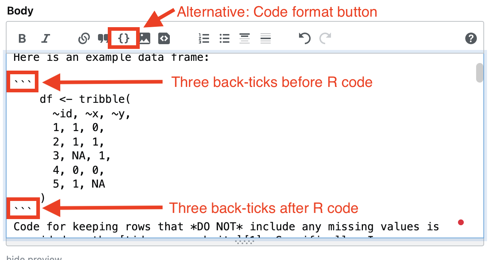
```

As you can see, we placed three back-ticks on their own line before our `R` code and three back-ticks on their own line after our R code. Alternatively, we could have used our mouse to highlight our `R` code and then clicked the code format button, which is highlighted in the screenshot above and looks like an empty pair of curly braces ( \{\} ).

#### Reviewing the post

After you create your post and click the "Review your question" button, you will have an opportunity to check your post for a couple of potential issues.

1. Duplicates. You want to try your best to make sure your question isn't a duplicate question. Meaning, you want to make sure that someone else hasn't already asked the same question or a question that is very similar. As you are typing your post title, Stack Overflow will show you a list of potentially similar questions. It will show you that list again as you are reviewing your post. You should take a moment to look through that list and make sure you question isn't going to be a duplicate. If it does end up being a duplicate, [Stack Overflow moderators may tag it as such and close it](https://stackoverflow.com/help/duplicates). 

2. Typos and errors. Of course, you also want to check your post for standard typos, grammatical errors, and coding errors. However, you can always edit your post later if an error does slip through. You just need to click the `edit` text at the bottom of your post. A screenshot from the example post is shown in the screenshot below.

```{r echo=FALSE}
knitr::include_graphics("img/01_part_getting_started/06_asking_questions/so_4_edit.png")
```

### Creating better posts and asking better questions

There are no bad `R` programming questions, but there are definitely ways to ask those questions that will be better received than others. And better received questions will typically result in faster responses and more useful answers. It’s important that you ask your questions in a way that will allow the reader to understand what you are trying to accomplish, what you’ve already tried, and what results you are getting. Further, unless it’s something extremely straight forward, **you should always provide a little chunk of data that recreates the problem you are experiencing.** These are known as **reproducible examples** This is so important that there is an R package that does nothing but help you create reproducible examples --  [Reprex](https://reprex.tidyverse.org/). 

Additionally, Stack Overflow and the RStudio community both publish guidelines for posting good questions.

* Stack Overflow guide to asking questions: https://stackoverflow.com/help/how-to-ask

* RStudio Community Tips for writing R-related questions: https://community.rstudio.com/t/faq-tips-for-writing-r-related-questions/6824

You should definitely pause here an take a few minutes to read through these guidelines. If not now, come back and read them before you post your first question on either website. Below, we show you a few example posts and highlight some of the most important characteristics of quality posts. 

#### Example posts

Here are a few examples of highly viewed posts on Stack Overflow and the RStudio community. Feel free to look them over. Notice what was good about these posts and what could have been better. The specifics of these questions are totally irrelevant. Instead, look for the elements that make posts easy to understand and respond to. 

1. [Stack Overflow: How to join (merge) data frames (inner, outer, left, right)](https://stackoverflow.com/questions/1299871/how-to-join-merge-data-frames-inner-outer-left-right)

2. [RStudio Community: Error: Aesthetics must be either length 1 or the same as the data (2): fill](https://community.rstudio.com/t/error-aesthetics-must-be-either-length-1-or-the-same-as-the-data-2-fill/15579)

3. [Stack Overflow: How should I deal with "package 'xxx' is not available (for R version x.y.z)" warning?](https://stackoverflow.com/questions/25721884/how-should-i-deal-with-package-xxx-is-not-available-for-r-version-x-y-z-wa)    

4. [RStudio Community: Could anybody help me! Cannot add ggproto objects together](https://community.rstudio.com/t/could-anybody-help-me-cannot-add-ggproto-objects-together/11271/4)

#### Question title

When creating your posts, you want to make sure they have succinct, yet descriptive, titles. Stack overflow suggests that you pretend you are talking to a busy colleague and have to summarize your issue in a single sentence. @Stack_Overflow2022-uc The RStudio Community tips for writing questions further suggests that you be specific and use keywords. @RStudio2021-zl Finally, if you are really struggling, it may be helpful to write your title last. @Stack_Overflow2022-uc In our opinion, the titles from the first 3 examples above are pretty good. The fourth has some room for improvement.

#### Explanation of the issue

Make sure your posts have a brief, yet clear, explanation of what you are trying to accomplish. For example, "Sometimes I want to view all rows in a data frame that will be dropped if I drop all rows that have a missing value for any variable. In this case, I'm specifically interested in how to do this with dplyr 1.0's across() function used inside of the filter() verb." 

In addition, you may want to **add what you've already tried, what result you are getting, and what result you are expecting**. This information can help others better understand your problem and understand if the solution they offer you does what you are actually trying to do. 

Finally, if you've already come across other posts or resources that were similar to the problem you are having, but not quite similar enough for you to solve your problem, it can be helpful to provide links to those as well. The author of example 3 above (i.e., [How should I deal with "package 'xxx' is not available (for R version x.y.z)" warning?](https://stackoverflow.com/questions/25721884/how-should-i-deal-with-package-xxx-is-not-available-for-r-version-x-y-z-wa)) does a very thorough job of linking to other posts.

#### Reproducible example

**Make sure your question/post includes a small, reproducible data set that helps others recreate your problem.** This is so important, and so often overlooked by students in our courses. Notice that we did **NOT** say to post the actual data you are working on for your project. Typically, the actual data sets that we work with will have many more rows and columns than are needed to recreate the problem. All of this extra data just makes the problem harder to clearly see. And more importantly, the real data we often work with contains **protected health information (PHI)** that should **NEVER** be openly published on the internet. 

Here is an example of a small, reproducible data set that we created for the <a href="https://stackoverflow.com/questions/62161460/using-filter-with-across-to-keep-all-rows-of-a-data-frame-that-include-a-mis" target="_blank"> example Stack Overflow post </a> introduced at the beginning of the chapter. It only has 5 data rows and 3 columns, but any solution that solves the problem for this small data set will likely solve the problem in our actual data set as well. 

```{r eval=FALSE}
# Load the dplyr package.
library(dplyr)

# Simulate a small, reproducible example of the problem.
df <- tribble(
  ~id, ~x, ~y,
  1, 1, 0,
  2, 1, 1,
  3, NA, 1,
  4, 0, 0,
  5, 1, NA
)
```

Sometimes you can add reproducible data to your post without simulating your own data. When you download R, it comes with some built in data sets that all other R users have access to as well. You can see an full list of those data sets by typing the following command in your `R` console: 

```{r eval=FALSE}
data()
```

There are two data sets in particular, `mtcars` and `iris`, that seemed to be used often in programming examples and question posts. You can add those data sets to your global environment and start experimenting with them using the following code.

```{r eval=FALSE}
# Add the mtcars data frame your global environment
data(mtcars)

# Add the iris data frame to your global environment
data(iris)
```

In general, you are safe to post a question on Stack Overflow or the RStudio Community using either of these data frames in your example code -- assuming you are able to recreate the issue you are trying to solve using these data frames. 

## Helping others

Eventually, you may get to a point where you are able to help others with their R coding issues. In fact, spending a little time each day looking through posts and seeing if you can provide answers (whether you officially post them or not) is one way to improve _your_ R coding skills. For some of us, this is even a fun way to pass time! 🤓 

In the same way that there ways to improve the quality and usefulness of your question posts, there are also ways to improve the quality and usefulness of your replies to question posts. Stack Overflow also provides a guide for writing quality answers, which is available here: https://stackoverflow.com/help/how-to-answer. In our opinion, the most important part is to be patient, kind, and respond with a genuine desire to be helpful. 

## Summary

In this chapter we discussed when and how to ask for help with R coding problems that will inevitably occur. In short,

1. Try solving the problem on your own first, but don't spend an entire day beating your head against the wall. 

2. Start with Google.

3. If you can't find a solution on Google, create a post on Stack Overflow or the RStudio Community. 

4. Use best practices to create a high quality posts on Stack Overflow or the RStudio Community. Specifically:

    - Write succinct, yet descriptive, titles.
    
    - Write a a brief, yet clear, explanation of what you are trying to accomplish. Add what you've already tried, what result you are getting, and what result you are expecting.
    
    - Try to always include a reproducable example of the problem you are encountering in the form of data.
    
5. Be patient, kind, and genuine when posting or responding to posts. 


<!--chapter:end:chapters/01_part_getting_started/06_asking_questions.Rmd-->

# (PART) Coding Tools and Best Practices {-}

<!-- This Rmd just creates a part heading in the table of contents -->

<!--chapter:end:chapters/02_part_coding_tools_and_best_practices/00_part_coding_tools_and_best_practices.Rmd-->

# R scripts

Up to this point, I've only showed you how to submit your R code to R in the console. \@ref(fig:using-console)

```{r using-console, echo=FALSE, fig.cap="Submitting R code in the console."}
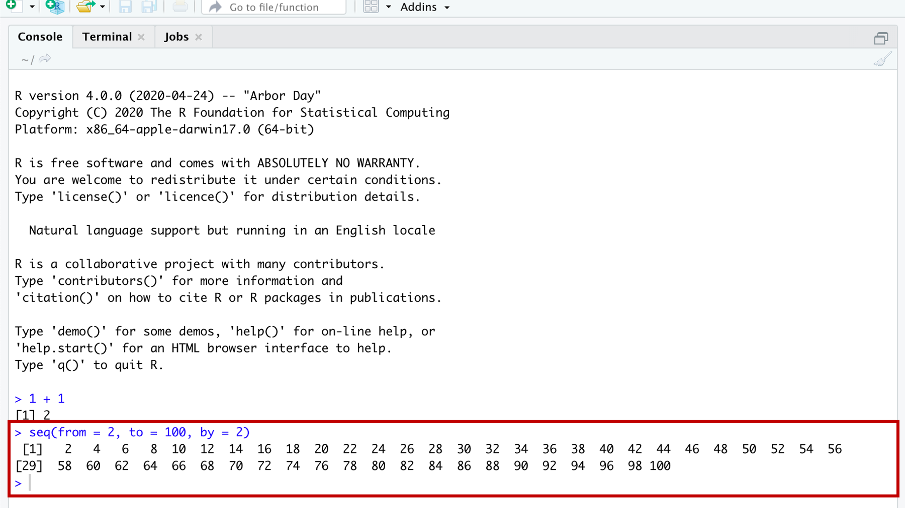
```

Submitting code directly to the console in this way works well for quick little tasks and snippets of code. But, writing longer R programs this way has some drawbacks that are probably already obvious to you. Namely, your code isn't saved anywhere. And, because it isn't saved anywhere, you can't modify it, use it again later, or share it with others.

Technically, the statements above are not entirely true. When you submit code to the console, it is copied to RStudio's History pane and from there you can save, modify, and share with others (see figure \@ref(fig:history)). But, this method is much less convenient, and provides you with far fewer whistles and bells than the other methods we'll discuss in this book.

```{r history, echo=FALSE, fig.cap="Console commands copied to the History pane."}
knitr::include_graphics("img/02_part_coding_tools_and_best_practices/02_r_scripts/history.png")
```

Those of you who have worked with other statistical programs before may be familiar with the idea of writing, modifying, saving, and sharing code scripts. SAS calls these code scripts "SAS programs", Stata calls them "DO files", and SPSS calls them "SPSS syntax files". If you haven't created code scripts before, don't worry. There really isn't much to it. 

In R, the most basic type of code script is simply called an R script. An R script is just a plain text file that contains R code and comments. R script files end with the file extension `.R`. 

Before I dive into giving you any more details about R scripts, I want to say that I'm actually going to discourage you from using them for most of what we do in this book. Instead, I'm going to encourage you to use R markdown files for the majority of your interactive coding, and for preparing your final products for end users. The next chapter is all about R markdown files. However, I'm starting with R scripts because:

1. They are simpler than R markdown files, so they are a good place to start.   
2. Some of what I discuss below will also apply to R markdown files.    
3. R scripts _are_ a better choice than R markdown files in some situations (e.g., writing R packages, creating Shiny apps).   
4. Some people just prefer using R scripts.   

With all that said, the screenshot below is of an example R script:

```{r example-script, echo=FALSE, fig.cap="Example R script."}
knitr::include_graphics("img/02_part_coding_tools_and_best_practices/02_r_scripts/example_script.png")
```

[Click here to download the R script](https://www.dropbox.com/s/k0yaydzqypc9yxt/chap_7_example_script.R?dl=1)

As you can see, I've called out a couple key elements of the R script to discuss. \@ref(fig:example-script) 

First, instead of just jumping into writing R code, lines 1-5 contain a **header** that I've created with comments. Because I've created it with comments, the R interpreter will ignore it. But, it will help other people you collaborate with (including future you) figure out what this script does. Therefore, I suggest that your header includes at least the following elements:

1. A brief description of what the R script does.   
2. The author(s) who wrote the R script.   
3. Important dates. For example, the date it was originally created and the date it was last modified. You can usually get these dates from your computer's operating system, but they aren't always accurate.    

Second, you may notice that I also used comments to create something I'm calling **decorations** on lines 1, 5, and 17. Like all comments, they are ignored by the R interpreter. But, they help create visual separation between distinct sections of your R code, which makes your code easier for _humans_ to read. I tend to use the equal sign (`# ====`) for separating major sections and the dash (`# ----`) for separating minor sections; although, "major" and "minor" are admittedly subjective. 

I haven't explicitly highlighted it in the screenshot above, but it's probably worth pointing out the use of line breaks (i.e., returns) in the code as well. This is much easier to read...

```{r eval=FALSE}
# Load packages
library(dplyr)

# Load data
data("mtcars")

# I'm not sure what's in the mtcars data. I'm printing it below to take a look
mtcars

## Data analysis
# ----------------------------------------------------------------------------

# Below, we calculate the average mpg across all cars in the mtcars data frame.
mean(mtcars$mpg)

# Here, we also plot mpg against displacement.
plot(mtcars$mpg, mtcars$disp)
```

than this...

```{r eval=FALSE}
# Load packages
library(dplyr)
# Load data
data("mtcars")
# I'm not sure what's in the mtcars data. I'm printing it below to take a look
mtcars
## Data analysis
# ----------------------------------------------------------------------------
# Below, we calculate the average mpg across all cars in the mtcars data frame.
mean(mtcars$mpg)
# Here, we also plot mpg against displacement.
plot(mtcars$mpg, mtcars$disp)
```

Third, it's considered a best practice to keep each line of code to 80 characters (including spaces) or less. There's a little box at the bottom left corner of your R script that will tell you what row your cursor is currently in and how many characters into that row your cursor is currently at (starting at 1, not 0). 

```{r counter, echo=FALSE, fig.cap="Cursor location."}
knitr::include_graphics("img/02_part_coding_tools_and_best_practices/02_r_scripts/counter.png")
```

For example, `20:3` corresponds to having your cursor between the "e" and the "a" in `mean(mtcars$mpg)` in the example script above. \@ref(fig:counter)

Fourth, it's also considered a best practice to load any packages that your R code will use at the very top of your R script (lines 7 & 8). \@ref(fig:example-script) Doing so will make it much easier for others (including future you) to see what packages your R code needs to work properly right from the start.

## Creating R scripts

To create your own R scripts, click on the icon shown below \@ref(fig:new-r-script1) and you will get a dropdown box with a list of files you can create. \@ref(fig:new-r-script2)

```{r new-r-script1, echo=FALSE, fig.cap="Click the new source file icon."}
knitr::include_graphics("img/02_part_coding_tools_and_best_practices/02_r_scripts/new_r_script1.png")
```

Click the very first option – `R Script`. 

```{r new-r-script2, echo=FALSE, fig.cap="New source file options."}
knitr::include_graphics("img/02_part_coding_tools_and_best_practices/02_r_scripts/new_r_script2.png")
```

When you do, a new untitled R Script will appear in the source pane.

```{r new-r-script3, echo=FALSE, fig.cap="A blank R script in the source pane."}
knitr::include_graphics("img/02_part_coding_tools_and_best_practices/02_r_scripts/new_r_script3.png")
```

And that's pretty much it. Everything else in figure \@ref(fig:example-script) is just R code and comments about the R code. But, you can now easily save, modify, and share this code with others. In the next chapter, we are going to learn how to write R code in R markdown files, where we can add a ton of whistles and bells to this simple R script.

<!--chapter:end:chapters/02_part_coding_tools_and_best_practices/01_r_scripts.Rmd-->

# R markdown

In the chapter on [R Scripts], you learned how to create R scripts -- plain text files that contain R code and comments. These R scripts are kind of a big deal because they give us a simple and effective tool for saving, modifying, and sharing our R code. If it weren't for the existence of R markdown files, we would probably do all of the coding in this book using R scripts. However, R markdown files _do_ exist and they are AWESOME! So, I'm actually going to suggest that you use them instead of R scripts the majority of the time.

It's actually kind of difficult for me to _describe_ what an **R markdown** file is if you've never seen or heard of one before. Therefore, I'm going to start with an example and work backwards from there. Figure \@ref(fig:example-r-markdown) below is an R markdown file. It includes the exact same R code and comments as the example we saw in the chapter on creating R scripts. \@ref(fig:example-script)

```{r example-r-markdown, echo=FALSE, fig.cap="Example R markdown file."}
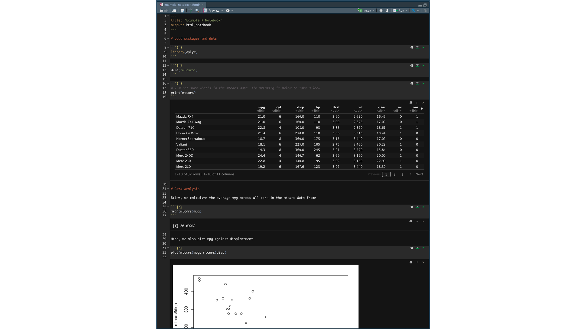
```

[Click here to download the R markdown file](https://www.dropbox.com/s/zgvtsfl0b8d61su/chap_7_example_notebook.Rmd?dl=1)

Notice that the results are embedded directly in the R markdown file immediately below the R code (e.g., between lines 19 and 20)! 

Once **rendered**, this R markdown file creates the HTML file you see below in figure \@ref(fig:rendered-preview). HTML files are what websites are made out of, and I'll walk you through _how_ to create them from R markdown files later in this chapter.

```{r rendered-preview, echo=FALSE, fig.cap="Preview of HTML file created from an R markdown file."}
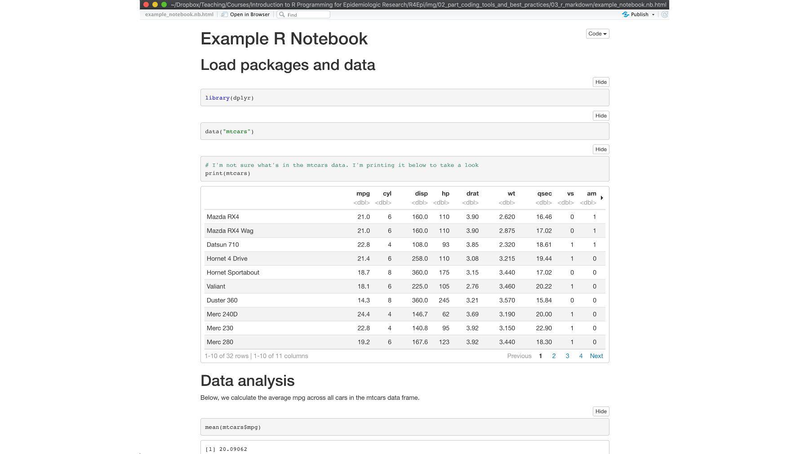
```

[Click here to download the HTML Notebook file](https://www.dropbox.com/s/5jszna863xc7k6o/chap_7_example_notebook.nb.html?dl=1).

Notice how everything is nicely formatted and easy to read!

When you create R markdown files on your computer, the rendered HTML file is saved in the same folder by default. \@ref(fig:markdown-files)

```{r markdown-files, echo=FALSE, fig.cap="HTML Notebook file and R markdown file on MacOS."}
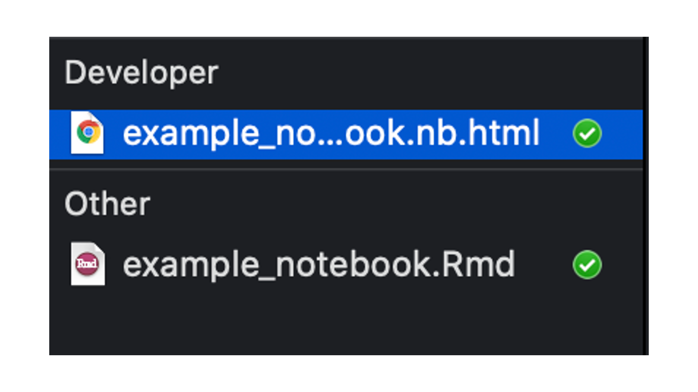
```

In the figure above, the HTML Notebook file is highlighted in blue and ends with the `.nb.html` file extension. The R markdown file is below the HTML Notebook file and ends with the `.Rmd` file extension. Both of these files can be modified, saved, and shared with others. 

## What is R markdown?

There is literally an [entire book about R markdown](https://bookdown.org/yihui/rmarkdown/) (and it's worth reading at some point). Therefore, I'm only going to hit some of the highlights in this chapter. As a starting point, you can think of R markdown files as being a mix of R scripts, the R console, and a Microsoft Word or Google Doc document. I say this because: 

* The R code that you would otherwise write in R scripts is written in R **code chunks** when you use R markdown files. In figure   \@ref(fig:example-r-markdown) there are R code chunks at lines 8 to 10, 12 to 14, 16 to 19, 25 to 27, and 31 to 33.    

* Instead of having to flip back and forth between your source pane and your console (or viewer) pane in RStudio, the results from your R code are embedded directly in the R markdown file, right alongside the code that generated them. In figure \@ref(fig:example-r-markdown) there are embedded results between lines 19 and 20, between lines 27 and 28, and between lines 33 and 34.

* When creating a document in Microsoft Word or Google Docs, you may format text headers to help organize your document, you may format your text to <span style="color:red;">emphasize</span> _certain_ **words**, you may add tables to help organize concepts or data, you may add links to other resources, and you may add pictures or charts to help you clearly communicate ideas to yourself or others. Similarly, R markdown files allow you to surround your R code with formatted text, tables, links, pictures, and charts directly in your document.   

Even when I don't share my R markdown files with anyone else, I find that the added functionality described above really helps me organize my data analysis more effectively, and helps me understand what I was doing if I come back to the analysis at some point in the future.

But, R markdown _really_ shines when I _do_ want to share my analysis or results with others. To get an idea of what I'm talking about, please take a look at the [R markdown gallery](https://rmarkdown.rstudio.com/gallery.html) and view some of the amazing things you can do with R markdown. As you can see, these R markdown files mix R code with other kinds of text and images to create documents, websites, presentations, and more.

## Why use R markdown?

At this point, you may be thinking "Ok, that R markdown gallery has some cool stuff, but this also looks complicated. Why shouldn't I just use a basic R script for the little R program I'm writing?" If that's what you're thinking, you have a valid point. R markdown files are slightly more complicated than basic R scripts. However, after reading in the sections below, I think you will find that getting started with R markdown doesn't have to be super complicated, and the benefits provided make the initial investment in learning R markdown worth your time.

## Create an R Notebook

RStudio makes it very easy to create your own R markdown file, of which there are several types. In this chapter, I'm going to show you how to create a really commonly used type of R markdown file called an R Notebook.

The process is actually really similar to the process we used to create an R script. Start by clicking on the icon shown below. \@ref(fig:new-r-markdown1)

```{r new-r-markdown1, echo=FALSE, fig.cap="Click the new source file icon."}
knitr::include_graphics("img/02_part_coding_tools_and_best_practices/03_r_markdown/new_r_markdown1.png")
```

As before, you'll be presented with a dropdown box that lists a bunch of different file types that you can create. This time, we'll click `R Notebook` instead of `R script`. \@ref(fig:new-r-markdown2) 

```{r new-r-markdown2, echo=FALSE, fig.cap="New source file options."}
knitr::include_graphics("img/02_part_coding_tools_and_best_practices/03_r_markdown/new_r_markdown2.png")
```

At this point you may have noticed that right below `R Notebook` in the dropdown menu is an option that says `R Markdown...` and you may be confused about why we aren't choosing that option. Great observation! As I said at the beginning of this chapter, R markdown files have a ton of functionality. Usually, when things have a ton of functionality (e.g., phones, cars, computers) it comes at a cost. That cost is _complexity_. R markdown files are no exception. They are awesome, but it can take some time to learn how to take advantage of all they have to offer. `R Notebooks` _ARE_ R markdown files, but they have some default settings that make it quick and easy for us to jump right into using them for doing some interactive R coding. 

<p class="note"> 🗒**Side Note:** When I say "interactive R coding" I mean, type some R code, submit, see the result, type some more R code, submit it, see the result...</p>

After you click the `R Notebook` option in the dropdown menu, a new untitled R Notebook file will appear in the source pane. This R Notebook will even include some example text and code meant to help get you started. We are typically going to erase all the example stuff and write our own text and code, but for now I will use it to highlight some key components of R markdown files. \@ref(fig:new-r-markdown3)

```{r new-r-markdown3, echo=FALSE, fig.cap="A blank R script in the source pane."}
knitr::include_graphics("img/02_part_coding_tools_and_best_practices/03_r_markdown/new_r_markdown3.png")
```

First, notice lines 1 through 4 in the example above. These lines make up something called the **YAML header** (pronounced yamel). You don't need to know what YAML means, but you do need to know that this is one of the defining features of all R markdown files. Essentially, The YAML header turns plain text files into R markdown files. We'll talk more about the details of the YAML header soon. 

Second, notice lines 10 through 12. These lines make up something called an **R code chunk**. Code chunks in R markdown files always start with three backticks ( ` ) and a pair of curly braces ({}), and they always end with three more backticks. We know that this code chunk contains R code because of the "r" inside of the curly braces. You can also create code chunks that will run other languages (e.g., python), but we won't do that in this book. In this book, we will exclusively use the R language. You can think of each R code chunk as a mini R script. We'll talk more about the details of code chunks soon.

Third, notice lines 6, 8, 14, and 18. These lines contain text instructions to help you use R Notebooks, but in a real analysis you would use formatted text like this to add context around the analysis in the code chunks. For now, you can think of this as being very similar to the comments we wrote in our R scripts. However, this text is actually something called **markdown**, which allows us to do lots of cool things that the comments in our R scripts aren't able to do. For example, line 6 has a link to a website embedded in it, and lines 8, 14, 16, and 18 all include text that is being formatted (the orange text wrapped in asterisks). In this case, the text is being italicized. 

And that is all you have to do to create an basic R Notebook. Next, I'm going to give you a few more details about each of the key components of the R Notebook that I briefly introduced above.

## YAML headers

As I said before, the YAML header is really what makes an R markdown file an R markdown file. The YAML header always begins and ends with dash-dash-dash (`---`) typed on its own line (1 & 4 above). \@ref(fig:new-r-markdown3) The stuff written inside the YAML header generally falls into two categories:

1. Stuff about the R markdown file itself. For example, the YAML header we saw above gives that R markdown file a title. The title is added to the file by adding the `title` keyword, followed by a colon (`:`), followed by a character string wrapped in quotes. Other examples include `author` and `date`. 

2. Stuff that tells R how to process the R markdown file. What do I mean by that? Well, remember the [R markdown gallery](https://rmarkdown.rstudio.com/gallery.html) you saw earlier? That gallery includes Word documents, PDF documents, websites, and more. But all of those different document types started as an R markdown file similar to the one in figure \@ref(fig:new-r-markdown3). R will create a PDF or a Word document or a website from the R markdown file based on the instructions you give it inside the YAML header. For example, the YAML header we saw above tells R to create an HTML Notebook from that R markdown file. This output type is selected by adding the `output` keyword, followed by a colon (`:`), followed by the `html_notebook` keyword.

What does an HTML Notebook look like? Well, if you hit the `Preview` button in RStudio:

```{r preview, echo=FALSE, fig.cap="RStudio's preview button. Only visible when an R Notebook is open."}
knitr::include_graphics("img/02_part_coding_tools_and_best_practices/03_r_markdown/preview.png")
```

R will ask you to save your R markdown file. After you save it, R will automatically create (or render) a new HTML Notebook file and save it in the same location where your R markdown file is saved. Additionally, a little browser window will pop up and give you a preview of what the rendered HTML Notebook looks like. \@ref(fig:rendered-r-notebook)

```{r rendered-r-notebook, echo=FALSE, fig.cap="An HTML Notebook created using an R markdown file."}
knitr::include_graphics("img/02_part_coding_tools_and_best_practices/03_r_markdown/rendered_r_notebook.png")
```

Notice how all the formatting that was applied when R rendered the HTML Notebook file. For example, the title -- "R Notebook" -- is in big bold letters at the top of the screen, the words "R Markdown" in the first line of text are now a clickable link to another website, and the word "Run" in the second line of text is now italicized. 

I can imagine that this section may seem a little confusing to some of you right now. If so, don't worry. You don't really _need_ to understand the YAML header right now. Remember, when you create a new `R Notebook` file in the manner I described above, the YAML header is already there. You will probably want to change the title, but that's about it.

## R code chunks

As I said above, R code chunks always start out with three backticks ( ` ) and a pair of curly braces with an "r" in them ({r}), and they always end with three more backticks. Typing that over and over can be tedious, so RStudio provides a keyboard shortcut for inserting R code chunks into your R markdown files.

On Mac type `option + command + i`.

On Windows type `control + alt + i`

Inside your code chunk, you can type anything that you would otherwise type in the console or in an R script. You can then click the little green arrow in the top right corner of the code chunk to submit it to R and see the result. \@ref(fig:code-chunk-output)

```{r code-chunk-output, echo=FALSE, fig.cap="The results of an R code chunk embedded in an R Notebook."}
knitr::include_graphics("img/02_part_coding_tools_and_best_practices/03_r_markdown/code_chunk_output.png")
```

## Markdown

Many of you have probably heard of HTML and CSS before. HTML stands for hypertext markup language and CSS stands for cascading style sheets. Together, HTML and CSS are used to create and style every website you've ever seen. Remember that R Notebooks created from our R markdown files _are_ HTML files. They will open in any web browser and behave just like any other website. Therefore, you can manipulate and style them using HTML and CSS just like any other website. However, it takes a lot of time and effort to learn HTML and CSS. So, markdown was created as an easier-to-use alternative. Think of it as HTML and CSS lite. It can't fully replace HTML and CSS, but it is much easier to learn, and you can use it to do many of the main things you would want to do with HTML and CSS. 

For example, in figures \@ref(fig:new-r-markdown3) and \@ref(fig:rendered-r-notebook) you saw that wrapping your text with single asterisks (`*`) italicizes that text, and that using a combination of brackets and parentheses `[Text](Link)` can turn your text into a clickable link.

There are a ton of other things you can do with markdown, and I recommend checking out RStudio's R markdown cheat sheet if you're interested in learning more. You can download it (any many other cheat sheets) [here](https://rstudio.com/resources/cheatsheets/). The cheat sheet is a little bit busy and may feel overwhelming at first. So, I suggest starting with the section called "Pandoc's Markdown" on the second page of the cheat sheet. Just play around with some of the formatting options and get a feel for what they do.

Having said that, it's totally fine if you don't care to try to tackle learning markdown syntax right now. You don't really _need_ markdown to follow along with the rest of the book. However, I still suggest using `R Notebook` files for writing, saving, modifying, and sharing your R code -- even if you don't plan to format them with markdown syntax.


<!--chapter:end:chapters/02_part_coding_tools_and_best_practices/02_r_markdown.Rmd-->

# R projects

<!--
Hidden comments placeholder

To preview:
bookdown::preview_chapter("chapters/02_part_coding_tools_and_best_practices/03_projects.Rmd")

👆**Here's what we did above:**
-->

In previous chapters of this book, we learned how to use [R scripts] and [R markdown] files to create, modify, save, and share our R code and results. However, in most real-world projects we will actually create _multiple_ different R scripts and/or R markdown files. Further, we will often have other files (e.g., images or data) that we want to store alongside our R code files. Over time, keeping up with all of these files can become cumbersome. **R projects** are a great tool for helping us organize and manage collections of files. Another _really_ important advantage to organizing our files into R projects is that they allow us to use **relative file paths** instead of **absolute file paths**, which we will [discuss in detail later][File paths].

RStudio makes creating R projects really simple. For starters, let's take a look at the top right corner of our RStudio application window. Currently, we see an R project icon that looks like little blue 3-dimensional box with an "R" in the middle. To the right of the R project icon, we see words `Project: (None)`. RStudio is telling us that our current session is not associated with an R project. 

```{r echo=FALSE}
knitr::include_graphics("img/02_part_coding_tools_and_best_practices/03_r_projects/create_01_icon.png")
```

To create a new R project, we just need to click the drop-down arrow next to the words `Project: (None)` to open the projects menu. Then, we will click the `New Project...` option.

```{r echo=FALSE}
knitr::include_graphics("img/02_part_coding_tools_and_best_practices/03_r_projects/create_02_new_project.png")
```

Doing so will open the new project wizard. For now, we will select the `New Directory` option. We will discuss the other options later in the book.

```{r echo=FALSE}
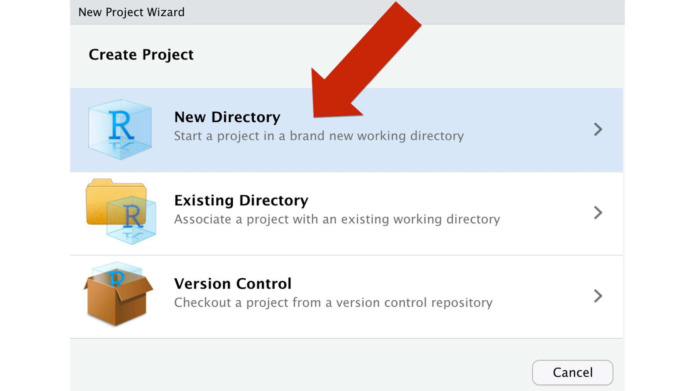
```

Next, we will click the `New Project` option.

```{r echo=FALSE}
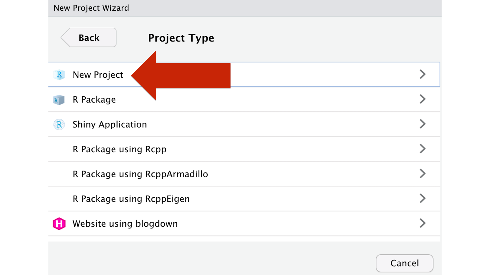
```

In the next window, we will have to make some choices and enter some information. The fist thing we will have to do is name our project. We do so by entering a value in the `Directory name:` box. Often, we can name our R project directory to match the name of the larger project we are working on in a pretty natural way. If not, the name we choose for our project directory should essentially follow the same guidelines that we use for [object (variable) names][Object (variable) names], which we will learn about soon. In this example, we went with the very creative `my_first_project` project name.😆 

When we create our R project in a moment, RStudio will create a folder on our computer where we can keep all of the files we need for our project. That folder will be named using the name we entered in the `Directory name:` box in the previous step. So, the next thing we need to do is tell R where on our computer to put the folder. We do so by clicking the `Browse...` button and selecting a location. For this example, we chose to create the project on our computer's desktop.

Finally, we just click the `Create Project` button near the bottom-right corner of the New Project Wizard.

```{r echo=FALSE}
knitr::include_graphics("img/02_part_coding_tools_and_best_practices/03_r_projects/create_05_directory.png")
```

Doing so will create our new R project in the location we selected in the `Create project as subdirectory of:` text box in the new project wizard. In the screenshot below, we can see that a folder was created on our computer's desktop called `my_first_project`. Additionally, there is one file inside of that folder named `my_first_project` that ends with the file extension `.Rproj` (see red arrow 2 in the figure below). 

```{r echo=FALSE}
knitr::include_graphics("img/02_part_coding_tools_and_best_practices/03_r_projects/create_06_rproj_file.png")
```

This file is called an R project file. Every time we create an R project, RStudio will create an R project file and add it to our project directory (i.e., the folder) for us. This file helps RStudio track and organize our R project.

To easiest way to open the R project we just created is to double click the R project file -- `my_first_project.Rproj`. Doing so will open a new RStudio session along with all of the R code files we had open last time we were working on our R project. Because this is our first time opening our example R project, we won't see any R code files. 

Alternatively, we can open our R project by once again clicking the R project icon in the upper right corner of an open RStudio session and then clicking the `Open Project...` option. This will open a file selection window where we can select our R project directory and open it.

```{r echo=FALSE}
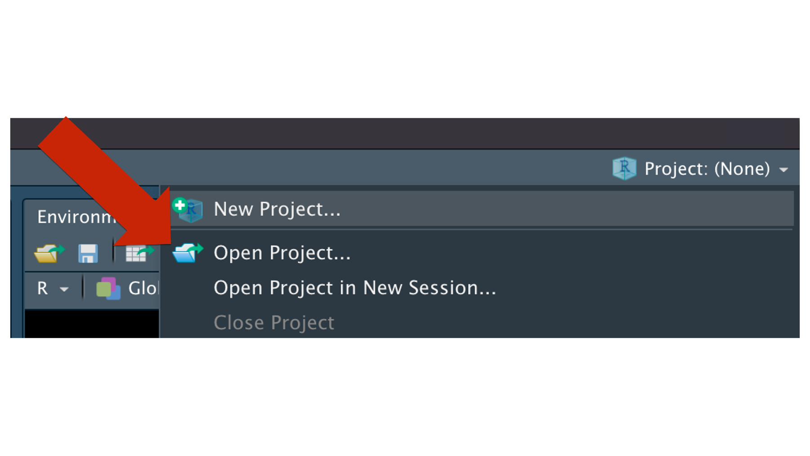
```

Finally, we will know that RStudio understands that we are working in the context of our project because the words `Project: (None)` that we previously saw in the top right corner of the RStudio window will be replaced with the project name. In this case, `my_first_project`. 

```{r echo=FALSE}
knitr::include_graphics("img/02_part_coding_tools_and_best_practices/03_r_projects/check_rproj.png")
```

Now that we've created our R project, there's nothing special we need to do to add other files to it. We only need save files and folders for our project as we typically would. We just need to make sure that we save them in our project directory (i.e., the folder). RStudio will take care of the rest. 

R projects are a great tool for organizing our R code and other complimentary files. Should we use them every single time we use R? Probably not. So, when should we use them? Well, the best -- albeit somewhat unhelpful -- answer is probably to use them whenever they are useful. However, at this point in your R journey you may not have enough experience to know when they will be useful and when they won't. Therefore, we are going to suggest that create an R project for your project if (1) your project will have more than one file and/or (2) more than one person will be working on the R code in your project. As we alluded to earlier, organizing our files into R projects allows us to use **relative file paths** instead of **absolute file paths**, which will make it much easier for us to collaborate with others. [File paths] will be discussed in detail later.

<!--chapter:end:chapters/02_part_coding_tools_and_best_practices/03_projects.Rmd-->

# Coding best practices

At this point in the book, we've talked a little bit about what R is. We've also talked about the RStudio IDE and took a quick tour around its four main panes. Finally, we wrote our first little R program, which simulated and analyzed some data about a hypothetical class. Writing and executing this R program officially made you an _R programmer_. 🏆 

However, you should know that not all R code is equally "good" -- even when it's equally valid. What do I mean that? Well, we already discussed the R interpreter and R syntax in the chapter on speaking R's language. Any code that uses R syntax that the R interpreter can understand is valid R code. But, is the R interpreter the only one reading your R code? No way! In epidemiology, we collaborate with others _all the time_! That collaboration is going to be much more efficient and enjoyable when there is good communication -- including R code that is easy to read and understand. Further, you will often need to read and/or reuse code you wrote weeks, months, or years after you wrote it. You may be amazed at how quickly you forget what you did and/or why you did it that way. Therefore, in addition to writing valid R code, this chapter is about writing "good" R code --  code that easily and efficiently communicates ideas to _humans_.

Of course, "good code" is inevitably somewhat subjective. Reasonable people can have a difference of opinion about the best way to write code that is easy to read and understand. Additionally, reasonable people can have a difference of opinion about when code is "good enough." For these reasons, I'm going to offer several "suggestions" about writing good R code below, but only two general principles, which I believe most R programmers would agree with. 

## General principles

1. **Comment your code**. Whether you intend to share your code with other people or not, make sure to write lots of comments about what you are trying to accomplish in each section of your code and why. 

2. **Use a style consistently**. I'm going to suggest several guidelines for styling your R code below, but you may find that you prefer to style your R code in a different way. Whether you adopt my suggested style or not, please find or create a style that works for you and your collaborators and use it consistently.

## Code comments

There isn't a lot of specific advice that I can give here because comments are so idiosyncratic to the task at hand. So, I think the best I can do at this point is to offer a few examples for you to think about.

### Defining key variables

As we will discuss below, variables should have names that are concise, yet informative. However, the data you receive in the real world will not always include informative variable names. Even when someone has given the variables informative names, there may still be contextual information about the variables that is important to understand for data management and analysis. Some data sets will come with something called a **codebook** or **data dictionary**. These are text files that contain information about the data set that are intended to provide you with some of that more detailed information. For example, the survey questions that were used to capture the values in each variable or what category each value in a categorical variable represents. However, real data sets don't _always_ come with a data dictionary, and even when they do, it can be convenient to have some of that contextual information close at hand, right next to your code. Therefore, I will sometimes comment my code with information about variables that are important for the analysis at hand. Here is an example from an administrative data set I was using for an analysis:

```{ eval=FALSE}
* **Case number definition**

    - Case / investigation number.

* **Intake stage definition**

    - An ID number assigned to the Intake. Each Intake (Report) has its 
      own number. A case may have more than one intake. For example, case # 12345 
      has two intakes associated with it, 9 days apart, each with their own ID 
      number. Each of the two intakes associated with this case have multiple 
      allegations.

* **Intake start definition**

    - An intake is the submission or receipt of a report - a phone call or 
      web-based. The Intake Start Date refers to the date the staff member 
      opens a new record to begin recording the report.
```

### What this code is trying to accomplish

Sometimes, it is obvious what a section of code literally _does_. but not so obvious why you're doing it. I often try to write some comments around my code about what it's trying to ultimately accomplish and why. For example:

```{r eval=FALSE}
## Standardize character strings

# Because we will merge this data with other data sets in the future based on 
# character strings (e.g., name), we need to go ahead and standardize their 
# formats here. This will prevent mismatches during the merges. Specifically, 
# we:

# 1. Transform all characters to lower case   
# 2. Remove any special characters (e.g., hyphens, periods)   
# 3. Remove trailing spaces (e.g., "John Smith ")   
# 4. Remove double spaces (e.g., "John  Smith")  

vars <- quos(full_name, first_name, middle_name, last_name, county, address, city)

client_data <- client_data %>% 
  mutate_at(vars(!!! vars), tolower) %>% 
  mutate_at(vars(!!! vars), stringr::str_replace_all, "[^a-zA-Z\\d\\s]", " ") %>%
  mutate_at(vars(!!! vars), stringr::str_replace, "[[:blank:]]$", "") %>% 
  mutate_at(vars(!!! vars), stringr::str_replace_all, "[[:blank:]]{2,}", " ")

rm(vars)
```

### Why I chose this particular strategy

In addition to writing comments about why I did something, I sometimes write comments about why I did it _instead of_ something else. Doing this can save you from having to relearn lessons you've already learned through trial and error but forgot. For example:

```{ eval=FALSE}
### Create exact match dummy variables

* We reshape the data from long to wide to create these variables because it significantly decreases computation time compared to doing this as a group_by operation on the long data. 
```

## Style guidelines

UsInG c_o_n_s_i_s_t_e_n_t    STYLE i.s.     import-ant!      

> Good coding style is like using correct punctuation. You can manage without it, but it sure makes things easier to read. As with styles of punctuation, there are many possible variations... Good style is important because while your code only has one author, it’ll usually have multiple readers. This is especially true when you’re writing code with others. In that case, it’s a good idea to agree on a common style up-front. Since no style is strictly better than another, working with others may mean that you’ll need to sacrifice some preferred aspects of your style. @Wickham2019-yt

Below, I outline the style that I and my collaborators typically use when writing R code for a research project. It generally follows [the Tidyverse style guide](https://style.tidyverse.org/), _which I strongly suggest you read_. Outside of my class, you don’t have to use my style, but you really should find or create a style that works for you and your collaborators and use it consistently.

### Comments

Please put a space in between the pound/hash sign and the rest of your text when writing comments. For example, `# here is my comment` instead of `#here is my comment`. It just makes the comment easier to read.

### Object (variable) names

In addition to the object naming guidance given in [the Tidyverse style guide](https://style.tidyverse.org/files.html#names), I suggest the following object naming conventions.

### Use names that are informative 

Using names that are informative and easy to remember will make life easier for everyone who uses your data -- including you!

```{r eval = FALSE}
# Uninformative names - Don't do this
x1
var1

# Informative names
employed
married
education
```

#### Use names that are concise   

You want names to be informative, but you don't want them to be overly verbose. Really long names create more work for you and more opportunities for typos. In fact, I recommend using a single word when you can.

```{r eval=FALSE}
# Write out entire name of the study the data comes from - Don't do this
womens_health_initiative

# Write out an acronym for the study the data comes from - assuming everyone 
# will be familiar with this acronym - Do this
whi
```

#### Use all lowercase letters 

Remember, R is case-sensitive, which means that myStudyData and mystudydata are different things to R. Capitalizing letters in your file name just creates additional details to remember and potentially mess up. Just keep it simple and stick with lowercase letters.

```{r eval=FALSE}
# All upper case - so aggressive - Don't use
MYSTUDYDATA

# Camel case - Don't use
myStudyData

# All lowercase - Use
my_study_data
```

#### Separate multiple words with underscores. 

Sometimes you really just need to use multiple words to name your object. In those cases, I suggested separating words with an underscore.

```{r eval=FALSE}
# Multiple words running together - Hard to read - Don't use
mycancerdata

# Camel case - easier to read, but more to remember and mess up - Don't use
myCancerData

# Separate with periods - easier to read, but doesn't translate well to many 
# other languages. For example, SAS won't accept variable names with 
# periods - Don't use
my.cancer.data

# Separate with underscores - Use
my_cancer_data
```

#### Prefix the names of similar variables 

When you have multiple related variables, it's good practice to start their variable names with the same word. It makes these related variables easier to find and work with in the future if we need to do something with all of them at once. We can sort our variable names alphabetically to easily find find them. Additionally, we can use variable selectors like `starts_with("name")` to perform some operation on all of them at once. 

```{r eval=FALSE}
# Don't use
first_name
last_name
middle_name

# Use
name_first
name_last
name_middle

# Don't use
street
city
state

# Use
address_street
address_city
address_state
```

### File Names

All the variable naming suggestons above also apply to file names. However, I make a few additional suggestions specific to file names below.

#### Managing multiple files in projects

When you are doing data management and analysis for real-world projects you will typically need to break the code up into multiple files. If you don't, the code often becomes really difficult to read and manage. Having said that, finding the code you are looking for when there are 10, 20, or more separate files isn't much fun either. Therefore, I suggest the following (or similar) file naming conventions be used in your projects.

* Separate _data cleaning_ and _data analysis_ into separate files (typically, .R or .Rmd).   
  
  - Data cleaning files should be prefixed with the word "data" and named as follows   
    + data_[order number]_[purpose]   

```{r eval=FALSE}
# Examples
data_01_import.Rmd
data_02_clean.Rmd
data_03_process_for_regression.Rmd
```

  
  - Analysis files that do not directly create a table or figure should be
    prefixed with the word "analysis" and named as follows   
    + analysis_[order number]_[brief summary of content]    
    
```{r eval=FALSE}
# Examples
analysis_01_exploratory.Rmd
analysis_02_regression.Rmd
```
  
  - Analysis files that _DO_ directly create a table or figure should be prefixed with the word "table" or "fig" respectively and named as follows   
    + table_[brief summary of content] or    
    + fig_[brief summary of content]   
    
```{r eval=FALSE}
# Examples
table_network_characteristics.Rmd
fig_reporting_patterns.Rmd
```

<p class="note"> 🗒**Side Note:**  I sometimes do data manipulation (create variables, subset data, reshape data) in an analysis file if that analysis (or table or chart) is the only analysis that uses the modified data. Otherwise, I do the modifications in a separate data cleaning file.</p>

* Images    
  - Should typically be exported as png (especially when they are intended for use HTML files).   
  - Should typically be saved in a separate "img" folder under the project home directory.   
  - Should be given a descriptive name.   
    + _Example_: `histogram_heights.png`, _NOT_ `fig_02.png`.
  - I have found that the following image sizes typically work pretty well for my projects.
    + 1920 x 1080 for HTML    
    + 770 x 360 for Word   

* Word and PDF output files 
  - I typically save them in a separate "docs" folder under the project home directory 
  - Whenever possible, I try to set the Word or PDF file name to match the name of the R file that it was created in.
    + _Example_: `first_quarter_report.Rmd` creates `docs/first_quarter_report.pdf`

* Exported data files (i.e., RDS, RData, CSV, Excel, etc.) 
  - I typically save them in a separate "data" folder under the project home directory.
  - Whenever possible, I try to set the Word or PDF file name to match the name of the R file that it was created in.
    + _Example_: `data_03_texas_only.Rmd` creates `data/data_03_texas_only.csv`   

<!--chapter:end:chapters/02_part_coding_tools_and_best_practices/04_best_practices.Rmd-->

# Using pipes

```{r include=FALSE}
library(dplyr)
```

## What are pipes?

🤔 What are pipes? This `%>%` is the pipe operator. The pipe operator is not part of base R. So, you will need to install and load a package to use it. There is actually more than one package that you can use. I recommend that you install and load the `dplyr` package.     

* You can install the `dplyr` package by copying and pasting the following command in your R console `install.packages("dplyr")`

* You can load the `dplyr` package by copying and pasting the following command in your R console `library(dplyr)` 

🤔 What does the pipe operator do? In my opinion, the pipe operator makes your R code _much_ easier to read and understand. 

🤔 How does it do that? It makes your R code easier to read and understand by allowing you to view your nested functions in the order you want them to execute, as opposed to viewing them literally nested inside of each other.

You were first introduced to nesting functions in the [Let's get programming chapter](#nesting-functions). Recall that functions return values, and the R language allows us to directly pass those returned values into other functions for further calculations. We referred to this as **nesting functions** and said it was a big deal because it allows us to do very complex operations in a scalable way and without storing a bunch of unneeded values.

In that chapter, we also discussed a potential downside of nesting functions. Namely, our R code can become really difficult to read when we start nesting lots of functions inside one another. 

Pipes allow us to retain the benefits of nesting functions without making our code really difficult to read. At this point, I think it's best to show you an example. In the code below we want to generate a sequence of numbers, then we want to calculate the log of each of the numbers, and then find the mean of the logged values.

```{r}
# Performing an operation using a series of steps.
my_numbers <- seq(from = 2, to = 100, by = 2)
my_numbers_logged <- log(my_numbers)
mean_my_numbers_logged <- mean(my_numbers_logged)
mean_my_numbers_logged
```

👆**Here's what we did above:**

* We created a vector of numbers called `my_numbers` using the `seq()` function.   
* Then we used the `log()` function to create a new vector of numbers called `my_numbers_logged`, which contains the log values of the numbers in `my_numbers`.   
* Then we used the `mean()` function to create a new vector called `mean_my_numbers_logged`, which contains the mean of the log values in `my_numbers_logged`.    
* Finally, we printed the value of `mean_my_numbers_logged` to the screen to view.

The obvious first question here is, "why would I ever want to do that?" Good question! You probably won't ever want to do what we just did in the code chunk above, but we haven't learned many functions for working with real data yet and I don't want to distract you with a bunch of new functions right now. Instead, I want to demonstrate what pipes do. So, we're stuck with this silly example.

👍 What's nice about the code above? I would argue that it is pretty easy to read because each line does one thing and it follows a series of steps in logical order -- create the numbers, log the numbers, get the mean.

👎 What could be better about the code above? All we really wanted was the mean value of the logged numbers (i.e., `mean_my_numbers_logged`); however, on our way to getting `mean_my_numbers_logged` we also created two other objects that we don't care about -- `my_numbers` and `my_numbers_logged`. It took us time to do the extra typing required to create those objects, and those objects are now cluttering up our global environment. It may not seem like that big of a deal here, but in a real data analysis project these things can really add up.

Next, let's try nesting these functions instead:

```{r}
# Performing an operation using nested functions.
mean_my_numbers_logged <- mean(log(seq(from = 2, to = 100, by = 2)))
mean_my_numbers_logged
```

👆**Here's what we did above:**

* We created a vector of numbers called `mean_my_numbers_logged` by nesting the `seq()` function inside of the `log()` function and nesting the `log()` function inside of the `mean()` function.   

* Then, we printed the value of `mean_my_numbers_logged` to the screen to view.

👍 What's nice about the code above? It is certainly more efficient than the sequential step method we used at first. We went from using 4 lines of code to using 2 lines of code, and we didn't generate any unneeded objects.

👎 What could be better about the code above? Many people would say that this code is harder to read than than the the sequential step method we used at first. This is primarily due to the fact that each line no longer does one thing, and the code no longer follows a sequence of steps from start to finish. For example, the final operation we want to do is calculate the mean, but the `mean()` function is the first function we use in the code. 

Finally, let's try see what this code looks like when we use pipes:

```{r}
# Performing an operation using pipes.
mean_my_numbers_logged <- seq(from = 2, to = 100, by = 2) %>% 
  log() %>% 
  mean()
mean_my_numbers_logged
```

👆**Here's what we did above:**

* We created a vector of numbers called `mean_my_numbers_logged` by passing the result of the `seq()` function directly to the `log()` function using the pipe operator, and passing the result of the the `log()` function directly to the `mean()` function using the pipe operator.   

* Then, we printed the value of `mean_my_numbers_logged` to the screen to view.

👏 As you can see, by using pipes we were able to retain the benefits of performing the operation in a series of steps (i.e., each line of code does one thing and they follow in sequential order) and the benefits of nesting functions (i.e., more efficient code).

The utility of the pipe operator may not be immediately apparent to you based on this very simple example. So, next I'm going to show you a little snippet of code from one of my research projects. In the code chunk that follows, the operation I'm trying to perform on my data is written in two different ways -- without pipes and with pipes. It's very unlikely that you will know what this code does, but that isn't really the point. Just try to get a sense of which version is easier for you to read.

```{r eval=FALSE}
# Nest functions without pipes
responses <- select(ungroup(filter(group_by(filter(merged_data, !is.na(incident_number)), incident_number), row_number() == 1)), date_entered, detect_data, validation)

# Nest functions with pipes
responses <- merged_data %>% 
  filter(!is.na(incident_number)) %>% 
  group_by(incident_number) %>% 
  filter(row_number() == 1) %>% 
  ungroup() %>% 
  select(date_entered, detect_data, validation)
```

What do you think? Even without knowing what this code does, do you feel like one version is easier to read than the other?

## How do pipes work?

Perhaps I've convinced you that pipes are generally useful. But, it may not be totally obvious to you _how_ to use them. They are actually really simple. Start by thinking about pipes as having a left side and a right side.

```{r left-right, echo=FALSE, fig.cap="Pipes have a left side and a right side."}
knitr::include_graphics("img/02_part_coding_tools_and_best_practices/05_using_pipes/left_right.png")
```

The thing on the right side of the pipe operator should always be a function.

```{r right-side, echo=FALSE, fig.cap="A function should always be to the right of the pipe operator."}
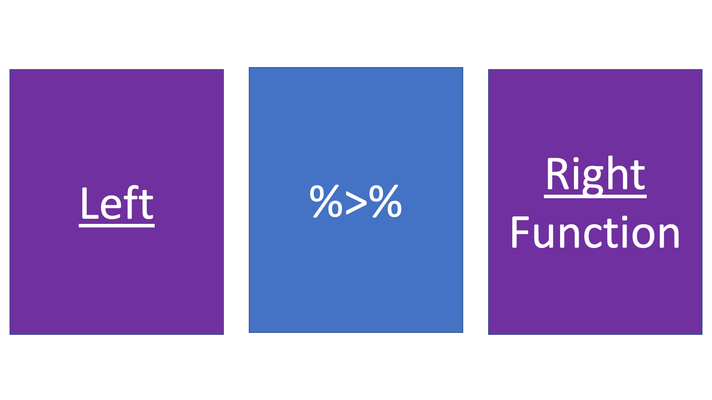
```

The thing on the left side of the pipe operator can be a function or an object.

```{r left-side, echo=FALSE, fig.cap="A function or an object can be to the left of the pipe operator."}
knitr::include_graphics("img/02_part_coding_tools_and_best_practices/05_using_pipes/left_side.png")
```

All the pipe operator does is take the thing on the left side and pass it to the first argument of the function on the right side.

```{r pipe, echo=FALSE, fig.cap="Pipe the left side to the first argument of the function on the right side."}
knitr::include_graphics("img/02_part_coding_tools_and_best_practices/05_using_pipes/pipe.png")
```

It's a really simple concept, but it can also cause people a lot of confusion at first. So, let's take look at a couple more concrete examples.

Below we pass a vector of numbers to the to the `mean()` function, which returns the mean value of those numbers to us.

```{r}
mean(c(2, 4, 6, 8))
```

We can also use a pipe to pass that vector of numbers to the `mean()` function.

```{r}
c(2, 4, 6, 8) %>% mean()
```

So, the R interpreter took the thing on the left side of the pipe operator, stuck it into the first argument of the function on the right side of the pipe operator, and then executed the function. In this case, the `mean()` function doesn't require any other arguments, so we don't have to write anything else inside of the `mean()` function's parentheses. When we see `c(2, 4, 6, 8) %>% mean()`, R sees `mean(c(2, 4, 6, 8))`

Here's one more example. Pretty soon we will learn how to use the `filter()` function from the `dplyr` package to keep only a subset of rows from our data frame. Let's start by simulating some data:

```{r}
# Simulate some data
height_and_weight <- tibble(
  id     = c("001", "002", "003", "004", "005"),
  sex    = c("Male", "Male", "Female", "Female", "Male"),
  ht_in  = c(71, 69, 64, 65, 73),
  wt_lbs = c(190, 176, 130, 154, 173)
)

height_and_weight
```

In order to work, the `filter()` function requires us to pass two values to it. The first value is the name of the data frame object with the rows we want to subset. The second is the condition used to subset the rows. Let's say that we want to do a subgroup analysis using only the females in our data frame. We could use the `filter()` function like so:

```{r}
# First value = data frame name (height_and_weight)
# Second value = condition for keeping rows (when the value of sex is Female)
filter(height_and_weight, sex == "Female")
```

👆**Here's what we did above:**

* We kept only the rows from the data frame called `height_and_weight` that had a value of `Female` for the variable called `sex` using `dplyr`'s `filter()` function.    

We can also use a pipe to pass the `height_and_weight` data frame to the `filter()` function.

```{r}
# First value = data frame name (height_and_weight)
# Second value = condition for keeping rows (when the value of sex is Female)
height_and_weight %>% filter(sex == "Female")
```

As you can see, we get the exact same result. So, the R interpreter took the thing on the left side of the pipe operator, stuck it into the first argument of the function on the right side of the pipe operator, and then executed the function. In this case, the `filter()` function needs a value supplied to two arguments in order work. So, we wrote `sex == "Female"` inside of the `filter()` function's parentheses. When we see `height_and_weight %>% filter(sex == "Female")`, R sees `filter(height_and_weight, sex == "Female")`.

<p class="note"> 🗒**Side Note:** This pattern -- a data frame piped into a function, which is usually then piped into one or more additional functions is something that you will see over and over in this book.</p>

Don't worry too much about how the `filter()` function works. That isn't the point here. The two main takeaways so far are:

1. Pipes make your code easier to read once you get used to them.   

2. The R interpreter knows how to automatically take whatever is on the left side of the pipe operator and make it the value that gets passed to the first argument of the function on the right side of the pipe operator.   

### Keyboard shortcut

Typing `%>%` over and over can be tedious! Thankfully, RStudio provides a keyboard shortcut for inserting the pipe operator into your R code.

On Mac type `shift + command + m`.

On Windows type `shift + control + m`

It may not seem totally intuitive at first, but this shortcut is really handy once you get used to it.

### Pipe style

As with all the code we write, style is an important consideration. I generally agree with the recommendations given in the [Tidyverse style guide](https://style.tidyverse.org/pipes.html). In particular, I tend to use pipes in such a way that each line of my code does one, and only one, thing. For example:

```{r eval=FALSE}
# Each line does one thing - Use
responses <- merged_data %>% 
  filter(!is.na(incident_number)) %>% 
  group_by(incident_number) %>% 
  filter(row_number() == 1) %>% 
  ungroup() %>% 
  select(date_entered, detect_data, validation)

# Some lines do more than one thing - Don't use
responses <- merged_data %>% filter(!is.na(incident_number)) %>% 
  group_by(incident_number) %>% filter(row_number() == 1) %>% 
  ungroup() %>% select(date_entered, detect_data, validation)
```

As previously stated, there is a certain amount of subjectivity in what constitutes "good" style. But, I will once again reiterate that it is important to adopt _some_ style and use it consistently.

## Final thought on pipes

I think it's important to note that not everyone in the R programming community is a fan of using pipes. I hope I've made a compelling case for why I use pipes, but I acknowledge that it is ultimately a preference, and that using pipes is not the best choice in all circumstances. Whether or not you choose to use the pipe operator is up to you; however, I will be using them extensively throughout the remainder of this book.

<!--chapter:end:chapters/02_part_coding_tools_and_best_practices/05_using_pipes.Rmd-->

# (PART) Data Transfer {-}

<!-- This Rmd just creates a part heading in the table of contents -->

<!--chapter:end:chapters/03_part_data_transfer/00_part_data_transfer.Rmd-->

# Introduction to data transfer

<!-- 
This chapter gives an overview of data transfer.
-->

In previous chapters, we learned how to write our own simple R programs by directly creating data frames in RStudio with the `data.frame()` function, the `tibble()` function, and the `tribble()` function. We consider this to be a really fundamental skill to master because it allows us to simulate data and it allows us to get data into R regardless of what format that data is stored in (assuming we can “see” the stored data). In other words, if nothing else, we can always resort to creating data frames this way.

In practice, however, this is not how people generally exchange data. You might recall that in [Section 2.2.1 Transferring data](#transferring-data) We briefly mentioned the need to get data into R that others have stored in various different **file types**. These file types are also sometimes referred to as **file formats**. Common examples encountered in epidemiology include database files, spreadsheets, text files, SAS data sets, and Stata data sets.

```{r echo=FALSE}
knitr::include_graphics("img/01_part_getting_started/02_what_is_r/competencies_transfer.png")
```

Further, the data frames we’ve created so far don’t currently live in our global environment from one programming session to the next. We haven’t yet learned how to efficiently store our data long-term. We think the limitations of having to manually create a data frame every time we start a new programming session are probably becoming obvious to you at this point.

In this part of the book, we will learn to **import** data stored in various different file types into R for data management and analysis, we will learn to store R data frames in a more permanent way so that we can come back later to modify or analyze them, and we will learn to **export** data so that we may efficiently share it with others.

<!--chapter:end:chapters/03_part_data_transfer/01_data_transfer.Rmd-->

# File paths

<!-- 
This chapter gives an overview of file paths.

Maybe start with importing data and then come back to this?

To preview:
bookdown::preview_chapter("chapters/03_part_data_transfer/02_file_paths.Rmd")

👆**Here's what we did above:**
-->

In this part of the book, we will need to work with **file paths**. File paths are nothing more than directions that tell R where to find, or place, data on our computer. In our experience, however, some students are a little bit confused about file paths at first. So, in this chapter we will briefly introduce what file paths are and how to find the path to a specific file on our computer.

Let’s say that we want you to go to the store and buy a loaf of bread.

```{r echo=FALSE}

```

When we say, “go to the store”, this is really a shorthand way of telling you a much more detailed set of directions. 

```{r echo=FALSE}
knitr::include_graphics("img/03_part_data_transfer/02_file_paths/directions.png")
```

Not only do you need to do _all_ of the steps in the directions above, but you also need to use the _exact sequence_ above in order to arrive at the desired destination.

File paths aren't so different. If we want R to "go get" the file called my_study_data.csv, we have to give it directions to where that file is located. But the file's location is not a geographic location that involves making left and right turns. Rather, it is a location in your computer's file system that involves moving deeper into folders that are nested inside one another.

```{r echo=FALSE}
knitr::include_graphics("img/03_part_data_transfer/02_file_paths/locations.png")
```

For example, let's say that we have a folder on our desktop called "NTRHD" for "North Texas Regional Health Department.

```{r echo=FALSE}

```

And, my_study_data.csv is inside the NTRHD folder.

```{r echo=FALSE}
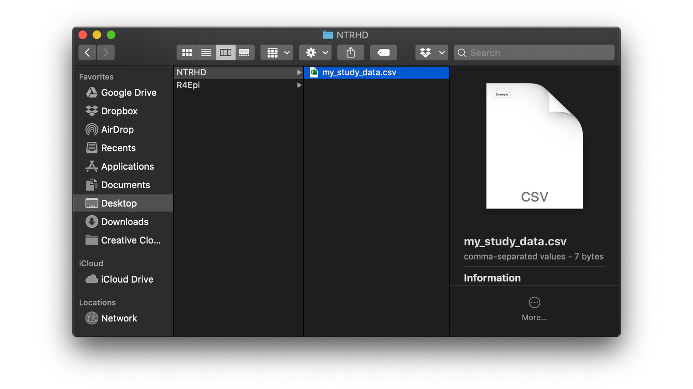
```

We can give R directions to that data using the following path:

`/Users/bradcannell/Desktop/NTRHD/my_study_data.csv` (On Mac)

OR

`C:/Users/bradcannell/Desktop/NTRHD/my_study_data.csv` (On Windows)

<p class="warning"> ⚠️**Warning:** Mac and Linux use forward slashes in file paths (`/`) by default. Windows uses backslashes (`\`) in file paths by default. However, no matter which operating system we are using, we should still use forward slashes in the file paths we pass to import and export functions in RStudio. **In other words, use forward slashes even if you are using Windows.**</p>

These directions may be read in a more human-like way by replacing the slashes with "and then". For example, `/Users/bradcannell/Desktop/NTRHD/my_study_data.csv` can be read as "starting at the computer's home directory, go into files that are accessible to the username `bradcannell`, and then go into the folder called `Desktop`, and then go into the folder called `NTRHD`, and then get the file called `my_study_data.csv`."

<p class="warning"> ⚠️**Warning:** You will need to change `bradcannell` to your username, unless your username also happens to be `bradcannell`.</p>

<p class="warning"> ⚠️**Warning:** Notice that we typed `.csv` at the end immediately after the name of our file `my_study_data`. The `.csv` we typed is called a **file extension**. File extensions tell the computer the file's type and what programs can use it. In general, we MUST use the full file name and extension when importing and exporting data in R.</p>

**Self Quiz:**

Let's say that we move `my_study_data.csv` to a different folder on our desktop called `research`. What file path would we need to give R to tell it how to find the data?


`/Users/bradcannell/Desktop/research/my_study_data.csv` (On Mac)

OR

`C:/Users/bradcannell/Desktop/research/my_study_data.csv` (On Windows)

Now let's say that we created a new folder inside of the `research` folder on our desktop called `my studies`. Now what file path would we need to give R to tell it how to find the data?

`/Users/bradcannell/Desktop/research/my studies/my_study_data.csv` (On Mac)

OR

`C:/Users/bradcannell/Desktop/research/my studies/my_study_data.csv` (On Windows)

## Finding file paths

Now that we know how file paths are constructed, we can always type them manually. However, typing file paths manually is tedious and error prone. Luckily, both Windows and MacOS have shortcuts that allow us to easily copy and paste file paths into R.

On a Mac, we right-click on the file we want the path for and a drop-down menu will appear. Then, click the `Get Info` menu option.

```{r echo=FALSE}
knitr::include_graphics("img/03_part_data_transfer/02_file_paths/get_info.png")
```

Now, we just copy the file path in the `Where` section of the get info window and paste it into our R code.

```{r echo=FALSE}
knitr::include_graphics("img/03_part_data_transfer/02_file_paths/where.png")
```

Alternatively, as shown below, we can right click on the file we want the path for to open the same drop-down menu shown above. But, if we hold down the `alt/option` key the `Copy` menu option changes to `Copy ... as Pathname`. We can then left-click that option to copy the path and paste it into our R code.

```{r echo=FALSE}
knitr::include_graphics("img/03_part_data_transfer/02_file_paths/file_path_gif.gif")
```

A similar method exists in Windows as well. First, we _hold down the shift key_ and right click on the file we want the path for. Then, we click `Copy as path` in the drop-down menu that appears and paste the file path into our R code.

## Relative file paths

All of the file paths we've seen so far in this chapter are **absolute file paths** (as opposed to **relative file paths**). In this case, _absolute_ just means that the file path begins with the computer's home directory. Remember, that the home directory in the examples above was `/Users/bradcannell`. When we are collaborating with other people, or sometimes even when we use more than one computer to work on our projects by ourselves, this can problematic. Pause here for a moment and think about why that might be...

Using absolute file paths can be problematic because the home directory can be different on every computer we use and is almost certainly different on one of our collaborator's computers. Let's take a look at an example. In the screenshot below, we are importing an Excel spreadsheet called `form_20.xlsx` into R as an R data frame named `df`. Don't worry about the import code itself. We will learn more about [importing Microsoft Excel spreadsheets][Importing Microsoft Excel spreadsheets] soon. For now, just look at the file path we are passing to the `read_excel()` function. By doing so, we are telling R where to go find the Excel file that we want to import. In this case, are we giving R an absolute or relative file path?

```{r echo=FALSE}
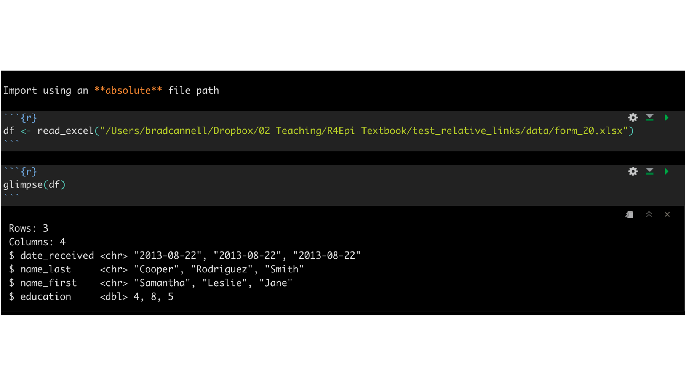
```

We are giving R an _absolute_ file path. We know this because it starts with the home directory -- `/Users/bradcannell`. Does our code work? 

Yes! Our code does work. We can tell because there are no errors on the screen and the `df` object we created looks as we expect it to when we print it to the screen. Great!!

Now, let's say that our research assistant -- Arthur Epi -- is going to help us analyze this data as well. So, we share this code file with him. What do you think will happen when he runs the code on his computer?

```{r echo=FALSE}
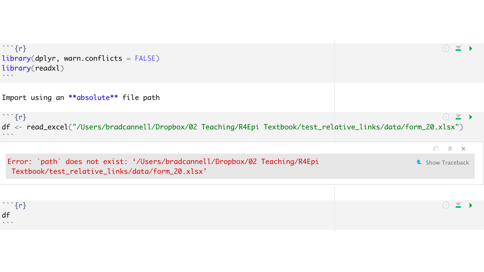
```

When Arthur tries to import this file on his computer using our code, he gets an error. The error tells him that the path `/Users/bradcannell/Dropbox/02 Teaching/R4Epi Textbook/my_first_project/data/form_20.xlsx` doesn't exist. And on Arthur's computer it doesn't! The file `form_20.xlsx` exists, but not at the location `/Users/bradcannell/Dropbox/02 Teaching/R4Epi Textbook/my_first_project/data/`. This is because Arthur's home directory is `/Users/arthurepi` not `/Users/bradcannell`. The directions are totally different!

To make this point clearer, let's return to our _directions to the store_ example from earlier in the chapter. In that example, we only gave one list of directions to the store.

```{r echo=FALSE}
knitr::include_graphics("img/03_part_data_transfer/02_file_paths/directions.png")
```

Notice that these directions assume that we are starting from our house. As long as we leave from our house, they work great! But what happens if we are at someone else's house and we ask you to go to the store and buy a loaf of bread? You'd walk out the front door and immediately discover that the directions don't make any sense! You'd think, "Camp Bowie Blvd.? Where is that? I don't see that street anywhere!" 

Did the store disappear? No, of course not! The store is still there. It's just that our directions to the store assume that we are starting from our house. If these directions were a file path, they would be an _absolute_ file path. They start all the way from our home and only work from our home.

So, could Arthur just change the absolute file path to work on his computer? Sure! He could do that, but then the file path wouldn't work on Brad's computer anymore. So, could there just be two code chunks in the file -- one for Brad's computer and one for Arthur's computer? Sure! We could do that, but then one code chunk or the other will always throw an error on someone's computer. That will mean that we won't ever be able to just run our R code in its entirety. We'll have to run it chunk-by-chunk to make sure we skip the chunk that throws an error. And this problem would just be multiplied if we are working with 5, 10, or 15 other collaborators instead of just 1. So, is there a better solution? 

Yes! A better solution is to use a **relative file path**. Returning to our _directions to the store_ example, it would be like giving directions to the store from a common starting point that everyone knows. 

```{r echo=FALSE}
knitr::include_graphics("img/03_part_data_transfer/02_file_paths/directions_relative.png")
```

Notice that the directions are now from a common location, which isn't somebody's "home". Instead, it's the corner of Camp Bowie Blvd. and Hulen St. You could even say that the directions are now _relative_ to a common starting place. Now, we can give these directions to anyone and they can use them as long as they can find the corner of Camp Bowie and Hulen! Relative file paths work in much the same way. We tell RStudio to anchor itself at a common location that exists on everyone's computer and then all the directions are relative to that location. But, how can we do that? What location do all of our collaborators have on all of their computers? 

The answer is our R project's directory (i.e., folder)! In order to effectively use relative file paths in R, we start by creating an R project. If you don't remember how to create R projects, this would be a good time to go back and review the [R projects] chapter. 

In the screenshot below, we can see that our RStudio session is open in the context of our R project called `my_first_project`. 

```{r echo=FALSE}
knitr::include_graphics("img/03_part_data_transfer/02_file_paths/relative_file_paths_03_check_project.png")
```

In that context, R starts looking for files _in our R project folder_ -- no matter where we put the R project folder on our computer. 

For example, in the next screenshot, we can see that the R project folder [we previously created][R projects] (arrow 1), which is called `my_first_project`, is located on a computer's desktop. One way we can tell that it's an R project is because it contains an R project file (arrow 2). We can also see that our R project now contains a `folder`, which contains an Excel file called `form_20.xlsx` (arrow 3). Finally, we can see that we we've added a new R markdown file called `test_relative_links.Rmd` (arrow 4). That file contains the code we wrote to import `form_20.xlsx` as an R data frame. 

```{r echo=FALSE}
knitr::include_graphics("img/03_part_data_transfer/02_file_paths/relative_file_paths_04_check_files.png")
```

Because we are using an R project, we can tell R where to find `form_20.xlsx` using a _relative_ file path. That is, we can give R directions that begin at the R project's directory. Remember, that just means the folder containing the R project file. In this case, `my_first_project`. Pause here for a minute. With that starting point in mind, how would you tell R to find `form_20.xlsx`?

Well, you would say, "go into the folder called `data`, and then get the file called `form_20.xlsx`." Written as a file path, what would that look like?

It would look like `data/form_20.xlsx`. Let's give it a try!

```{r echo=FALSE}
knitr::include_graphics("img/03_part_data_transfer/02_file_paths/relative_file_paths_05_relative_path_brad.png")
```

It works! We can tell because there are no errors on the screen and the `df` object we created looks as we expect it to when we print it to the screen.

Now, let's try it on Arthur's computer and see what happens.

```{r echo=FALSE}
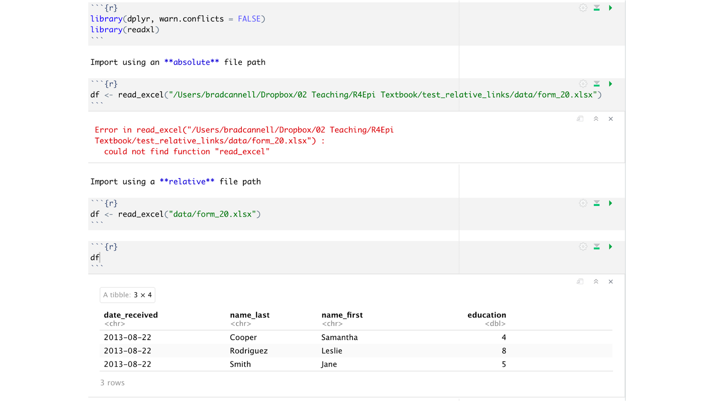
```

As you can see, the absolute path still doesn't work on Arthur's computer, but the relative path does! It may not be obvious to you now, but this makes collaborating so much easier!

Let's quickly recap what we needed to do to be able to use relative file paths. 

1. We need to create an [R project][R projects].

2. We needed to save our R code and our data inside of the R project directory. 

3. We needed to share the R project folder with our collaborators. This part wasn't shown, but it was implied. We could have shared our R project by email. We could have shared our R project by using a shared cloud-based file storage service like Dropbox, Google Drive, or OneDrive. Better yet, we could have shared our R project using a [GitHub repository][Introduction to git and GitHub], which we will discuss later in the book. 

4. We replaced all absolute file paths in our code with relative file paths. In general, we should _always_ use relative file paths if at all possible. It makes our code easier to read and maintain, and it makes life so much easier for us when we collaborate with others! 

Now that we know what file paths are and how to find them, let's use them to import and export data to and from R.

<!--chapter:end:chapters/03_part_data_transfer/02_file_paths.Rmd-->

# Importing plain text files

<!-- 
Hidden comments placeholder
---------------------------

File path for importing files interactively (testing):
"/Users/bradcannell/Dropbox/R4Epi Textbook/r4epi/data/file_name.ext"

File path for importing files when building the book:
"data/file_name.ext"

To preview:
bookdown::preview_chapter("chapters/03_part_data_transfer/03_importing_plain_text_files.Rmd")

Copy and paste:
👆**Here's what we did above:**
-->

We previously learned how to manually create a data frame in RStudio with the `data.frame()` function, the `tibble()` function, or the `tribble()` function. This will get the job done, but it’s not always very practical -- particularly when you have larger data sets. 

Additionally, others will usually share data with you that is already stored in a file of some sort. For our purposes, any file containing data that is not an R data frame is referred to as raw data. In my experience, raw data is most commonly shared as CSV (comma separated values) files or as Microsoft Excel files. CSV files will end with the **.csv** file extension and Excel files end with the **.xls** or **.xlsx** file extensions. But remember, generally speaking R can only manipulate and analyze data that has been imported into R’s global environment. In this lesson, you will learn how to take data stored in several different common types of files import them into R for use.

There are many different file types that one can use to store data. In this book, we will divide those file types into two categories: **plain text files** and **binary files**. Plain text files are simple files that you (<i>a human</i>) can directly read using only your operating system's plain text editor (i.e., Notepad on Windows or TextEdit on Mac). These files usually end with the **.txt** file extension -- one exception being the **.csv** extension. Specifically, in this chapter we will learn to import the following variations of plain text files:

* Plain text files with data delimited by a single space.

* Plain text files with data delimited by tabs.

* Plain text files stored in a fixed width format.

* Plain text files with data delimited by commas - csv files.

Later, we will discuss importing binary files. For now, you can think of binary files as more complex file types that can't generally be read by humans without the use of special software. Some examples include Microsoft Excel spreadsheets, SAS data sets, and Stata data sets.

```{r echo=FALSE}
knitr::include_graphics("img/03_part_data_transfer/03_importing_plain_text_files/files.png")
```

## Packages for importing data

Base R contains several functions that can be used to import plain text files; however, I'm going to use the [readr](https://readr.tidyverse.org/) package to import data in the examples that follow. Compared to base R functions for importing plain text files, `readr`: 

* Is roughly 10 times faster.

* Doesn't convert character variables to factors by default.

* Behaves more consistently across operating systems and geographic locations.

If you would like to follow along, I suggest that you go ahead and install and load `readr` now. 

```{r}
library(readr)
```

## Importing space delimited files

We will start by importing data with values are separated by a single space. Not necessarily because this is the most common format you will encounter; in my experience it is not. But it’s about as simple as it gets, and other types of data are often considered special cases of files separated with a single space. So, it seems like a good place to start.

<p class="note"> 🗒**Side Note:** In programming lingo, it is common to use the word **delimited** interchangeably with the word **separated.** For example, you might say "values separated by a single space" or you might say "a file with space delimited values."</p>

```{r echo=FALSE}
knitr::include_graphics("img/03_part_data_transfer/03_importing_plain_text_files/space.png")
```

For our first example we will import a text file with values separated by a single space. The contents of the file are the now familiar height and weight data.

[You may click here to download this file to your computer.](https://github.com/brad-cannell/r4epi/blob/master/data/single_delimited.txt)

```{r read-in-single-delimited-txt, cache = TRUE, cache.invalidate.if = tools::md5sum('data/single_delimited.txt')}
single_space <- read_delim(
  file = "data/single_delimited.txt",
  delim = " "
)
```

```{r}
single_space
```

👆**Here's what we did above:**

* We used `readr`'s `read_delim()` function to import a data set with values that are delimited by a single space. Those values were imported as a data frame, and we assigned that data frame to the R object called `single_space`.

* You can type `?read_delim` into your R console to view the help documentation for this function and follow along with the explanation below.

* The first argument to the `read_delim()` function is the `file` argument. The value passed to the file argument should be a file path that tells R where to find the data set on your computer.

* The second argument to the `read_delim()` function is the `delim` argument. The value passed to the `delim` argument tells R what character separates each value in the data set. In this case, a single space separates the values. Note that we had to wrap the single space in quotation marks.

* The `readr` package imported the data and printed a message giving us some information about how it interpreted column names and column types. In programming lingo, deciding how to interpret the data that is being imported is called **parsing** the data.

  - By default, `readr` will assume that the first row of data contains variable names and will try to use them as column names in the data frame it creates. In this case, that was a good assumption. We want the columns to be named `id`, `sex`, `ht_in`, and `wgt_lbs`. Later, we will learn how to override this default behavior.
  
  - By default, `readr` will try to guess what type of data (e.g., numbers, character strings, dates, etc.) each column contains. It will guess based on analyzing the contents of the first 1,000 rows of the data. In this case, `readr`'s guess was not entirely correct (or at least not what we wanted). `readr` correctly guessed that the variables `id` and `sex` should be character variables, but incorrectly guessed that `ht_in` should be a character variable as well. Below, we will learn how to fix this issue.
  
<p class="warning"> ⚠️**Warning:** Make sure to always include the file extension in your file paths. For example, using "/single_delimited" instead of "/single_delimited.txt" above (i.e., no .txt) would have resulted in an error telling you that the filed does not exist.</p>

### Specifying missing data values

In the previous example, `readr` guessed that the variable `ht_in` was a character variable. Take another look at the data and see if you can figure out why?

```{r echo=FALSE}
knitr::include_graphics("img/03_part_data_transfer/03_importing_plain_text_files/space.png")
```

Did you see the period in the third value of the third row? The period is there because this value is missing, and a period is commonly used to represent missing data. However, R represents missing data with the special `NA` value -- not a period. So, the period is just a regular character value to R. When R reads the values in the `ht_in` column, it decides that it can easily turn the numbers into character values, but it doesn't know how to turn the period into a number. So, the column is parsed as a character vector. 

But as we said, this is not what we want. So, how do we fix it? Well, in this case, we will simply need to tell R that missing values are represented with a period in the data we are importing. We do that by passing that information to the `na` argument of the `read_delim()` function:

```{r read-in-single-delimited-txt-2, cache = TRUE, cache.invalidate.if = tools::md5sum('data/single_delimited.txt')}
single_space <- read_delim(
  file = "data/single_delimited.txt",
  delim = " ",
  na = "."
)
```

```{r}
single_space
```

👆**Here's what we did above:**

* By default, the value passed to the `na` argument of the `read_delim()` function is `c("", "NA")`. This means that R looks for nothing (i.e., a value should be there but isn't - this really doesn't make sense when the delimiter is a single space) or an `NA`. 

* We told R to look for a period to represent missing data instead of a nothing or an `NA` by passing the period character to the `na` argument.

* It's important to note that changing the value of the `na` argument does not change the way R represents missing data in the data frame that is created. It only tells R how to identify missing values in the raw data that we are importing. In the R data frame that is created, missing data will still be represented with the special `NA` value. 

## Importing tab delimited files

Sometimes you will encounter plain text files that contain values separated by tab characters instead of a single space. Files like these may be called **tab separated value** or **tsv** files, or they may be called **tab-delimited** files.

```{r echo=FALSE}
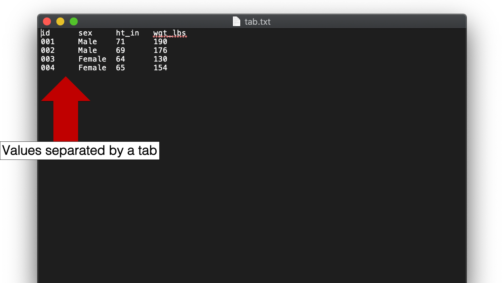
```

To import tab separated value files in R, we use a variation of the same program we just saw. We just need to tell R that now the values in the data will be delimited by tabs instead of a single space.

[You may click here to download this file to your computer.](https://github.com/brad-cannell/r4epi/blob/master/data/tab.txt)

```{r read-in-tab-txt, cache = TRUE, cache.invalidate.if = tools::md5sum('data/tab.txt')}
tab <- read_delim(
  file = "data/tab.txt",
  delim = "\t"
)
```

```{r}
tab
```

👆**Here's what we did above:**

* We used `readr`'s `read_delim()` function to import a data set with values that are delimited by tabs. Those values were imported as a data frame, and we assigned that data frame to the R object called `tab`.

* To tell R that the values are now separated by tabs, we changed the value we passed to the `delim` argument to `"\t"`. This is a special symbol that means "tab" to R.

I don't personally receive tab separated values files very often. But, apparently, they are common enough to warrant a shortcut function in the `readr` package. That is, instead of using the `read_delim()` function with the value of the `delim` argument set to `"\t"`, we can simply pass our file path to the `read_tsv()` function. Under the hood, the `read_tsv()` function does exactly the same thing as the `read_delim()` function with the value of the `delim` argument set to `"\t"`.

```{r read-in-tab-txt-2, cache = TRUE, cache.invalidate.if = tools::md5sum('data/tab.txt')}
tab <- read_tsv("data/tab.txt")
```

```{r}
tab
```

## Importing fixed width format files

Yet another type of plain text file we will discuss is called a **fixed width format** or **fwf** file. Again, these files aren't super common in my experience, but they can be sort of tricky when you do encounter them. Take a look at this example:

```{r echo=FALSE}
knitr::include_graphics("img/03_part_data_transfer/03_importing_plain_text_files/fixed_width.png")
```

As you can see, a hallmark of fixed width format files is inconsistent spacing between values. For example, there is only one single space between the values `004` and `Female` in the fourth row. But, there are multiple spaces between the values `65` and `154`. Therefore, we can't tell R to look for a single space or tab to separate values. So, how do we tell R which characters (including spaces) go with which variable? Well, if you look closely you will notice that all variable values start in the same column. If you are wondering what I mean, try to imagine a number line along the top of the data:

```{r echo=FALSE}
knitr::include_graphics("img/03_part_data_transfer/03_importing_plain_text_files/number_line_spaces.png")
```

This number line creates a sequence of columns across your data, with each column being 1 character wide. Notice that spaces are also considered a character with width just like any other. We can use these columns to tell R exactly which columns contain the values for each variable. 

[You may click here to download this file to your computer.](https://github.com/brad-cannell/r4epi/blob/master/data/fixed_width.txt)

Now, in this case we can just use `readr`'s `read_table()` function to import this data:

```{r read-in-fixed-width-txt, cache = TRUE, cache.invalidate.if = tools::md5sum('data/fixed_width.txt')}
fixed <- read_table("data/fixed_width.txt")
```

```{r}
fixed
```

👆**Here's what we did above:**

* We used `readr`'s `read_table()` function to import data from a fixed width format file. Those values were imported as a data frame, and we assigned that data frame to the R object called `fixed`.

* You can type `?read_table` into your R console to view the help documentation for this function and follow along with the explanation below.

* By default, the `read_table()` function looks for values to be separated by one or more columns of space.

However, how could you import this data if there weren't always spaces in between data values. For example:

```{r echo=FALSE}
knitr::include_graphics("img/03_part_data_transfer/03_importing_plain_text_files/number_line.png")
```

In this case, the `read_table()` function does not give us the result we want. 

```{r read-in-fixed-width-no-space-txt, cache = TRUE, cache.invalidate.if = tools::md5sum('data/fixed_width_no_space.txt')}
fixed <- read_table("data/fixed_width_no_space.txt")
```

```{r}
fixed
```

Instead, it parses the entire data set as a single character column. It does this because it can't tell where the values for one variable stop and the values for the next variable start. However, because all the variables start in the same column, we can tell R how to parse the data correctly. We can actually do this in a couple different ways:

[You may click here to download this file to your computer.](https://github.com/brad-cannell/r4epi/blob/master/data/fixed_width_no_space.txt)

### Vector of column widths

One way to import this data is to tell R how many columns wide each variable is in the raw data. We do that like so:

```{r read-in-fixed-width-no-space-txt-2, cache = TRUE, cache.invalidate.if = tools::md5sum('data/fixed_width_no_space.txt')}
fixed <- read_fwf(
  file = "data/fixed_width_no_space.txt",
  col_positions = fwf_widths(
    widths    = c(3, 6, 5, 3),
    col_names = c("id", "sex", "ht_in", "wgt_lbs")
  ),
  skip = 1
)
```

```{r}
fixed
```

👆**Here's what we did above:**

* We used `readr`'s `read_fwf()` function to import data from a fixed width format file. Those values were imported as a data frame, and we assigned that data frame to the R object called `fixed`.

* You can type `?read_fwf` into your R console to view the help documentation for this function and follow along with the explanation below.

* The first argument to the `read_fwf()` function is the `file` argument. The value passed to the file argument should be file path that tells R where to find the data set on your computer.

* The second argument to the `read_fwf()` function is the the `col_positions` argument. The value passed to this argument tells R the width (i.e., number of columns) that belong to each variable in the raw data set. This information is actually passed to the `col_positions` argument directly from the `fwf_widths()` function. This is an example of nesting functions.

  - The first argument to the `fwf_widths()` function is the `widths` argument. The value passed to the `widths` argument should be a numeric vector of column widths. The column width of each variable should be calculated as the number of columns that contain the values for that variable. For example, take another look at the data with the imaginary number line:
  
```{r echo=FALSE}
knitr::include_graphics("img/03_part_data_transfer/03_importing_plain_text_files/number_line.png")
```

<!-- Have to manually indent the bullets due to inserting the image above -->
<ul>
  <ul>
  <li style="padding-bottom: 0.5em;"> All of the values for the variable `id` can be located within the first 3 columns of data. All of the values for the variable `sex` can be located within the next 6 columns of data. All of the values for the variable `ht_in` can be located within the next 5 columns of data. And, all of the values for the variable `wgt_lbs` can be located within the next 3 columns of data. Therefore, we pass the vector `c(3, 6, 5, 3)` to the `widths` argument.</li>

  <li> The second argument to the `fwf_widths()` function is the `col_names` argument. The value passed to the `col_names` argument should be a character vector of column names.</li>
  </ul>
</ul>

* The third argument of the `read_fwf()` function that we passed a value to is the `skip` argument. The value passed to the `skip` argument tells R how many rows to ignore before looking for data values in the raw data. In this case, we passed a value of one, which told R to ignore the first row of the raw data. We did this because the first row of the raw data contained variable names instead of data values, and we already gave R variable names in the `col_names` argument to the `fwf_widths()` function.

### Paired vector of start and end positions

Another way to import this data is to tell R how which columns each variable starts and stops at in the raw data. We do that like so:

```{r read-in-fixed-width-no-space-txt-3, cache = TRUE, cache.invalidate.if = tools::md5sum('data/fixed_width_no_space.txt')}
fixed <- read_fwf(
  file = "data/fixed_width_no_space.txt",
  col_positions = fwf_positions(
    start     = c(1, 4, 10, 15),
    end       = c(3, 9, 11, 17),
    col_names = c("id", "sex", "ht_in", "wgt_lbs")
  ),
  skip = 1
)
```

```{r}
fixed
```

👆**Here's what we did above:**

* This time, we passed column positions to the `col_positions` argument of `read_fwf()` directly from the `fwf_positions()` function.

  - The first argument to the `fwf_positions()` function is the `start` argument. The value passed to the `start` argument should be a numeric vector containing the first column that contains a value for each variable. For example, take another look at the data with the imaginary number line:
  
```{r echo=FALSE}
knitr::include_graphics("img/03_part_data_transfer/03_importing_plain_text_files/number_line.png")
```

<!-- Have to manually indent the bullets due to inserting the image above -->
<ul>
  <ul>
  <li style="padding-bottom: 0.5em;"> The first column that contains part of the value for the variable `id` can be located in column 1 of data. The first column that contains part of the value for the variable `sex` can be located in column 4 of data. The first column that contains part of the value for the variable `ht_in` can be located in column 10 of data. And, the first column that contains part of the value for the variable `wgt_lbs` can be located in column 15 of data. Therefore, we pass the vector `c(1, 4, 10, 15)` to the `start` argument.</li>
  
  <li style="padding-bottom: 0.5em;"> The second argument to the `fwf_positions()` function is the `end` argument. The value passed to the `end` argument should be a numeric vector containing the last column that contains a value for each variable. The last column that contains part of the value for the variable `id` can be located in column 3 of data. The last column that contains part of the value for the variable `sex` can be located in column 9 of data. The last column that contains part of the value for the variable `ht_in` can be located in column 11 of data. And, the last column that contains part of the value for the variable `wgt_lbs` can be located in column 17 of data. Therefore, we pass the vector `c(3, 9, 11, 17)` to the `end` argument.</li>

  <li>The third argument to the `fwf_positions()` function is the `col_names` argument. The value passed to the `col_names` argument should be a character vector of column names.</li>
  </ul>
</ul>

### Using named arguments

As a shortcut, either of the methods above can be written using named vectors. All this means is that we basically combine the `widths` and `col_names` arguments to pass a vector of column widths, or we combine the `start`, `end`, and `col_names` arguments to pass a vector of start and end positions. For example:

**Column widths:**

```{r read-in-fixed-width-no-space-txt-4, cache = TRUE, cache.invalidate.if = tools::md5sum('data/fixed_width_no_space.txt'), message=FALSE}
read_fwf(
  file = "data/fixed_width_no_space.txt",
  col_positions = fwf_cols(
    id      = 3,
    sex     = 6,
    ht_in   = 5,
    wgt_lbs = 3
  ),
  skip = 1
)
```

**Column positions:**

```{r read-in-fixed-width-no-space-txt-5, cache = TRUE, cache.invalidate.if = tools::md5sum('data/fixed_width_no_space.txt'), message=FALSE}
read_fwf(
  file = "data/fixed_width_no_space.txt",
  col_positions = fwf_cols(
    id      = c(1, 3),
    sex     = c(4, 9),
    ht_in   = c(10, 11),
    wgt_lbs = c(15, 17)
  ),
  skip = 1
)
```

## Importing comma separated values files

The final type of plain text file that we will discuss is by far the most common type used in my experience. I'm talking about the **comma separated values** or **csv** file. Unlike space and tab separated values files, csv file names end with the **.csv** file extension. Although, csv files are plain text files that can be opened in plain text editors such as Notepad for Windows or TextEdit for Mac, many people view csv files in spreadsheet applications like Microsoft Excel, Numbers for Mac, or Google Sheets. 

```{r echo=FALSE, fig.cap="A csv file viewed in a plain text editor."}
knitr::include_graphics("img/03_part_data_transfer/03_importing_plain_text_files/csv_plain_text.png")
```

```{r echo=FALSE, fig.cap="A csv file viewed in Microsoft Excel."}
knitr::include_graphics("img/03_part_data_transfer/03_importing_plain_text_files/csv_excel.png")
```

Importing standard csv files into R with the `readr` package is easy and uses a syntax that is very similar to `read_delim()` and `read_tsv()`. In fact, in many cases we only have to pass the path to the csv file to the `read_csv()` function like so:

[You may click here to download this file to your computer.](https://github.com/brad-cannell/r4epi/blob/master/data/comma.csv)

```{r read-in-comma-csv, cache = TRUE, cache.invalidate.if = tools::md5sum('data/comma.csv')}
csv <- read_csv("data/comma.csv")
```

```{r}
csv
```

👆**Here's what we did above:**

* We used `readr`'s `read_csv()` function to import a data set with values that are delimited by commas. Those values were imported as a data frame, and we assigned that data frame to the R object called `csv`.

* You can type `?read_csv` into your R console to view the help documentation for this function and follow along with the explanation below.

* Like `read_tsv()`, R is basically executing  the `read_delim()` function with the value of the `delim` argument set to `","` under the hood. You could also use the `read_delim()` function with the value of the `delim` argument set to `","` if you wanted to.

## Additional arguments

For the most part, the data we imported in all of the examples above was relatively well behaved. What I mean by that is that the data basically "looked" like each of the `read_` functions were expecting it to "look". Therefore, we didn't have to adjust many of the various `read_` functions' default values. The exception was changing the default value of the `na` argument to the `read_delim()` function. However, all of the `read_` functions above have additional arguments that you may need to tweak on occasion. The two that I tend to adjust most often are the `col_names` and `col_types` arguments. It's impossible for me to think of every scenario where you may need to do this, but I'll walk through a basic example below, which should be sufficient for you to get the idea.

Take a look at this csv file for a few seconds. It started as the same exact height and weight data we've been using, but I made a few changes. See if you can spot them all.

```{r echo=FALSE}
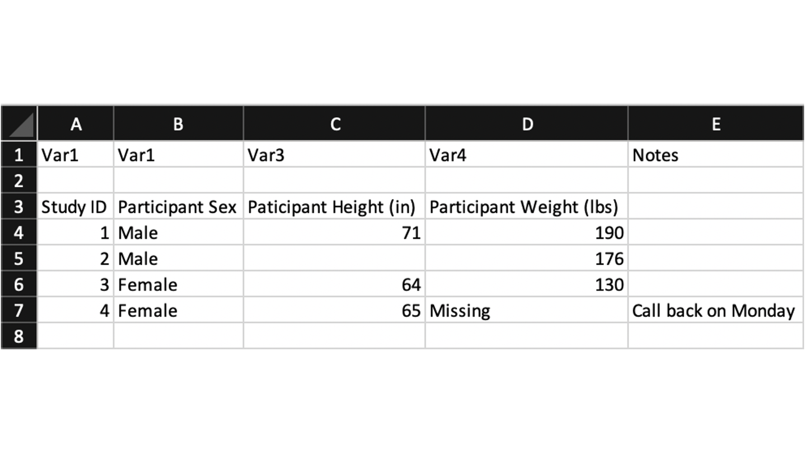
```

When people record data in Microsoft Excel, they do all kinds of crazy things. In the screenshot above, I've included just a few examples of things I see all the time. For example:

* Row one contains generic variable names that don't really serve much of a purpose. 

* Row two is a blank line. I'm not sure why it's there. Maybe the study staff finds it aesthetically pleasing?

* Row three contains some variable descriptions. These are actually useful, but they aren't currently formatted in a way that makes for good variable names.

* Row 7, column D is a missing value. However, someone wrote the word "Missing" instead of leaving the cell blank.

* Column E also contains some notes for the data collection staff that aren't really part of the data. 

All of the issues listed above are things we will have to deal with before we can analyze our data. Now, in this small data set we could just fix these issues directly in Microsoft Excel and then import the altered data into R with a simple call to `read_csv()` without adjusting any options. However, that this is generally a really bad idea. 

<div class="warning"> ⚠️**Warning:**

* I suggest that you don't **EVER** alter your raw data. All kinds of crazy things happen with data and data files. If you keep your raw data untouched and in a safe place, worst case scenario you can always come back to it and start over. If you start messing with the raw data, then you may lose the ability to recover what it looked like in its original form forever. If you import the data into R before altering it then your raw data stays preserved.

* If you are going to make alterations in Excel prior to importing the data, I **strongly** suggest making a copy of the raw data first. Then, alter the copy before importing into R. But, even this can be a bad idea.

* If you make alterations to the data in Excel then there is generally no record of those alterations. For example, let's say you click in a cell and delete a value (maybe even by accident), and then send me the csv file. I will have no way of knowing that a value was deleted. When you alter the data directly in Excel (or any program that doesn't require writing code), it can be really difficult for others (including future you) to know what was done to the data. You may be able manually compare the altered data to the original data if you have access to both, but who wants to do that -- especially if the file is large? However, if you import the data into R as-is and programmatically make alterations with R code, then your R code will, by definition, serve a record of all alterations that were made.

* Often data is updated. You could spend a significant amount of time altering your data in Excel only to be sent an updated file next week. Often, the manual alterations you made in one Excel file are not transferable to another. However, if all alterations are made in R, then you can often just run the exact same code again on the updated data. </div>

So, let's walk through addressing these issues together. We'll start by taking a look at our results with all of `read_csv`'s arguments left at their default values.

[You may click here to download this file to your computer.](https://github.com/brad-cannell/r4epi/blob/master/data/comma_complex.csv)

```{r read-in-comma-complex-csv, cache = TRUE, cache.invalidate.if = tools::md5sum('data/comma_complex.csv')}
csv <- read_csv("data/comma_complex.csv")
```

```{r}
csv
```

That is obviously not what we wanted. So, let's start adjusting some of `read_csv()`'s defaults -- staring with the column names.

```{r read-in-comma-complex-csv-2, cache = TRUE, cache.invalidate.if = tools::md5sum('data/comma_complex.csv')}
csv <- read_csv(
  file = "data/comma_complex.csv",
  col_names = c("id", "sex", "ht_in", "wgt_lbs")
)
```

```{r echo=FALSE}
csv
```

👆**Here's what we did above:**

* We passed a character vector of variable names to the `col_names` argument. Doing so told R to use the words in the character vector as column names instead of the values in the first row of the raw data (the default).

* Because the character vector of names only contained 4 values, the last column was dropped from the data. R gives us a warning message to let us know. Specially, for each row it says that it was expecting 4 columns (because we gave it 4 column names), but actually found 5 columns. We'll get rid of this message next.

```{r read-in-comma-complex-csv-3, cache = TRUE, cache.invalidate.if = tools::md5sum('data/comma_complex.csv')}
csv <- read_csv(
  file = "data/comma_complex.csv",
  col_names = c("id", "sex", "ht_in", "wgt_lbs"),
  col_types = cols(
    col_character(),
    col_character(),
    col_integer(),
    col_integer(),
    col_skip()
  )
)
```

```{r}
csv
```

👆**Here's what we did above:**

* We told R explicitly what type of values we wanted each column to contain. We did so by nesting a `col_` function for each column type inside the `col()` function, which is passed directly to the `col-types` argument.

* You can type `?readr::cols` into your R console to view the help documentation for this function and follow along with the explanation below.

* Notice various column types (e.g., `col_character()`) _are functions_, and that they are nested inside of the `cols()` function. Because they are functions, you must include the parentheses. That's just how the `readr` package is designed.

* Notice that the last column type we passed to the `col_types` argument was `col_skip()`. This tells R to ignore the 5th column in the raw data (5th because it's the 5th column type we listed). Doing this will get rid of the warning we saw earlier.

* You can type `?readr::cols` into your R console to see all available column types.

* Because we told R explicitly what type of values we wanted each column to contain, R had to drop any values that couldn't be coerced to the type we requested. More specifically, they were coerced to missing (`NA`). For example, the value `Var3` that was previously in the first row of the `ht_in` column. It was coerced to `NA` because R does not know (nor do I) how to turn the character string "Var3" into an integer. R gives us a warning message about this. 

Next, let's go ahead and tell R to ignore the first three rows of the csv file. They don't contain anything that is of use to us at this point.

```{r read-in-comma-complex-csv-4, cache = TRUE, cache.invalidate.if = tools::md5sum('data/comma_complex.csv')}
csv <- read_csv(
  file = "data/comma_complex.csv",
  col_names = c("id", "sex", "ht_in", "wgt_lbs"),
  col_types = cols(
    col_character(),
    col_character(),
    col_integer(),
    col_integer(),
    col_skip()
  ),
  skip = 3
)
```

```{r}
csv
```

👆**Here's what we did above:**

* We told R to ignore the first three rows of the csv file by passing the value 3 to the `skip` argument.

* The remaining warning above is R telling us that it still had to convert the word "Missing" to an `NA` in the 4th row of the `wgt_lbs` column because it didn't know how to turn the word "Missing" into an integer. This is actually exactly what we wanted to happen, but we can get rid of the warning by explicitly adding the word "Missing" to the list of values R looks for in the `na` argument.

```{r read-in-comma-complex-csv-5, cache = TRUE, cache.invalidate.if = tools::md5sum('data/comma_complex.csv')}
csv <- read_csv(
  file = "data/comma_complex.csv",
  col_names = c("id", "sex", "ht_in", "wgt_lbs"),
  col_types = cols(
    col_character(),
    col_character(),
    col_integer(),
    col_integer(),
    col_skip()
  ),
  skip = 3,
  na = c("", "NA", "Missing")
)
```

```{r}
csv
```

Wow! This was kind of a long chapter! 🤯 But, you should now have the foundation you need to start importing data in R instead of creating data frames manually. At least as it pertains to data that is stored in plain text files. Next, we will learn how to import data that is stored in binary files. Most of the concepts we learned in this chapter will apply, but we will get to use a couple new packages 📦.

<!--chapter:end:chapters/03_part_data_transfer/03_importing_plain_text_files.Rmd-->

# Importing binary files

<!-- 
Hidden comments placeholder
---------------------------

File path for importing files interactively (testing):
"/Users/bradcannell/Dropbox/R4Epi Textbook/r4epi/data/file_name.ext"

File path for importing files when building the book:
"data/file_name.ext"

To preview:
bookdown::preview_chapter("chapters/03_part_data_transfer/04_importing_binary_files.Rmd")

Copy and paste:
👆**Here's what we did above:**
-->

In the last chapter we learned that there are many different file types that one can use to store data. We also learned how to use the `readr` package to import several different variations of **plain text files** into R. 

In this chapter, we will focus on data stored in **binary files**. Again, you can think of binary files as being more complex than plain text files and accessing the information in binary files requires the use of special software. Some examples of binary files that I have frequently seen used in epidemiology include Microsoft Excel spreadsheets, SAS data sets, and Stata data sets. Below, we will learn how to import all three file types into R.

```{r echo=FALSE}
knitr::include_graphics("img/03_part_data_transfer/04_importing_binary_files/files.png")
```

## Packages for importing data

Technically, base R does not contain any functions that can be used to import the binary file types discussed above. However, the `foreign` package contains functions that may be used to import SAS data sets and Stata data sets, and is installed by default when you install R on your computer. Having said that, we aren't going to use the `foreign` package in this chapter. Instead, we're going to use the following packages to import data in the examples below. If you haven't done so already, I suggest that you go ahead and install these packages now. 

* [readxl](https://readxl.tidyverse.org/). We will use the `readxl` package to import Microsoft Excel files.

* [haven](https://haven.tidyverse.org/). We will use the `haven` package to import SAS and Stata data sets.

```{r}
library(readxl)
library(haven)
```

## Importing Microsoft Excel spreadsheets

I’m probably sent data in Microsoft Excel files more than any other file format. Fortunately, the `readxl` package makes it really easy to import Excel spreadsheets into R. And, because that package is maintained by the same people who create the `readr` package that you have already seen, I think it's likely that the `readxl` package will feel somewhat familiar right from the start.

I would be surprised if any of you had never seen an Excel spreadsheet before -- they are pretty ubiquitous in the modern world -- but I'll go ahead and show a screenshot of our height and weight data in Excel for the sake of completeness.

```{r echo=FALSE}
knitr::include_graphics("img/03_part_data_transfer/04_importing_binary_files/excel.png")
```

All we have to do to import this spreadsheet into R as a data frame is passing the path to the excel file to the `path` argument of the `read_excel()` function. 

[You may click here to download this file to your computer.](https://github.com/brad-cannell/r4epi/blob/master/data/excel.xlsx)

```{r read-in-excel-xlsx, cache = TRUE, cache.invalidate.if = tools::md5sum('data/excel.xlsx')}
excel <- read_excel("data/excel.xlsx")
```

```{r}
excel
```


👆**Here's what we did above:**

* We used `readxl`'s `read_excel()` function to import a Microsoft Excel spreadsheet. That spreadsheet was imported as a data frame and we assigned that data frame to the R object called `excel`.

<p class="warning"> ⚠️**Warning:** Make sure to always include the file extension in your file paths. For example, using "/excel" instead of "/excel.xlsx" above (i.e., no .xlsx) would have resulted in an error telling you that the filed does not exist.</p>

Fortunately for us, just passing the Excel file to the `read_excel()` function like this will usually "just work." But, let's go ahead and simulate another situation that is slightly more complex. Once again, we've received data from a team that is using Microsoft Excel to capture some study data. 

```{r echo=FALSE}
knitr::include_graphics("img/03_part_data_transfer/04_importing_binary_files/excel_complex.png")
```

As you can see, this data looks very similar to the csv file we previously imported. However, it looks like the study team has done a little more formatting this time. Additionally, they've added a couple of columns we haven't seen before -- date of birth and annual household income. 

As a final little wrinkle, the data for this study is actually the second sheet in this Excel file (also called a workbook). The study team used the first sheet in the workbook as a data dictionary that looks like this:

```{r echo=FALSE}
knitr::include_graphics("img/03_part_data_transfer/04_importing_binary_files/data_dictionary.png")
```

Once again, we will have to deal with some of the formatting that was done in Excel before we can analyze our data in R.

[You may click here to download this file to your computer.](https://github.com/brad-cannell/r4epi/blob/master/data/excel_complex.xlsx)

We'll start by taking a look at the result we get when we try to pass this file to the `read_excel()` function without changing any of `read_excel()`'s default values.

```{r read-in-excel-complex-xlsx, cache = TRUE, cache.invalidate.if = tools::md5sum('data/excel_complex.xlsx')}
excel <- read_excel("data/excel_complex.xlsx")
```

```{r}
excel
```

And, as I'm sure you saw coming, this isn't the result we wanted. However, we can get the result we wanted by making a few tweaks to the default values of the `sheet`, `col_names`, `col_types`, `skip`, and `na` arguments of the `read_excel()` function.

```{r read-in-excel-complex-xlsx-2, cache = TRUE, cache.invalidate.if = tools::md5sum('data/excel_complex.xlsx')}
excel <- read_excel(
  path = "data/excel_complex.xlsx",
  sheet = "Study Phase 1",
  col_names = c("id", "sex", "ht_in", "wgt_lbs", "dob", "income"),
  col_types = c(
    "text",
    "text",
    "numeric",
    "numeric",
    "date",
    "numeric",
    "skip"
  ),
  skip = 3,
  na = c("", "NA", "Missing")
)
```

```{r}
excel
```


As I said, the `readr` package and `readxl` package were developed by the same people. So, the code above looks similar to the code we used to import the csv file in the previous chapter. Therefore, I'm not going to walk through this code step-by-step. Rather, I'm just going to highlight some of the slight differences.

* You can type `?read_excel` into your R console to view the help documentation for this function and follow along with the explanation below.

* The first argument to the `read_excel()` function is the `path` argument. It serves the same purpose as the `file` argument to `read_csv()` -- it just has a different name.

* The `sheet` argument to the `read_excel()` function tells R which sheet of the Excel workbook contains the data you want to import. In this case, the study team named that sheet "Study Phase 1". We could have also passed the value `2` to the `sheet` argument because "Study Phase 1" is the second sheet in the workbook. However, I suggest using the sheet name. That way, if the study team sends you a new Excel file next week with different ordering, you are less likely to accidently import the wrong data.

* The value we pass to the `col_types` argument is now a vector of character strings instead of a list of functions nested in the `col()` function. 

  - The values that the col_types function will accept are `"skip"` for telling R to ignore a column in the spreadsheet, `"guess"` for telling R to guess the variable type, `"logical"` for logical (TRUE/FALSE) variables, "`numeric`" for numeric variables, `"date"` for date variables, `"text"` for character variables, and `"list"` for everything else. 
  
  - Notice that we told R to import income as a numeric variable. This caused the commas and dollar signs to be dropped. We did this because keeping the commas and dollar signs would have required us to make income a character variable (numeric variables can only include numbers). If we had imported income as a character variable, we would have lost the ability to perform mathematical operations on it. Remember, it makes no sense to "add" two words together. Later, I will show you how to add dollar signs and commas back to the numeric values if you want to display them in your final results.
  
* We used the `col_names`, `skip`, and `na` arguments in exactly the same way we used them in the read_csv function.

You should be able to import most of the data stored in Excel spreadsheets with just the few options that we discussed above. However, there may be times were importing spreadsheets is even more complicated. If you find yourself in that position, I suggest that you first check out [the readxl website here](https://readxl.tidyverse.org/index.html).

## Importing data from other statistical analysis software

Many applications designed for statistical analysis allow you to save data in a binary format. One reason for this is that binary data formats allow you to save **metadata** alongside your data values. Metadata is data _about_ the data. Using our running example, the data is about the heights, weights, and other characteristics of our study participants. **Metadata** about this data might include information like when this data set was created, or value labels that make the data easier to read (e.g., the dollar signs in the income variable).

In my experience, you are slightly more likely to have problems importing binary files saved from other statistical analysis applications than plain text files. Perhaps because they are more complex, the data just seems to become corrupt and do other weird things more often than is the case with plain text files. However, in my experience, it is also the case that when we are able to import binary files created in other statistical analysis applications, doing so requires less adjusting of default values. In fact, we will usually only need to pass the file path to the correct `read_` function.

Below, we will see some examples of importing binary files saved in two popular statistical analysis applications -- SAS and Stata. We will use the `haven` package to import both.

## Importing SAS data sets

SAS actually allows users to save data in more than one type of binary format. Data can be saved as SAS data sets or as SAS Transport files. SAS data set file names end with the .sas7bdat file extension. SAS Transport file file names end with the .xpt file extension. 

In order to import a SAS data set, we typically only need to pass the correct file path to `haven`'s `read_sas()` function. 

[You may click here to download this file to your computer.](https://github.com/brad-cannell/r4epi/blob/master/data/height_and_weight.sas7bdat)

```{r read-in-sas, cache = TRUE, cache.invalidate.if = tools::md5sum('data/height_and_weight.sas7bdat')}
sas <- read_sas("data/height_and_weight.sas7bdat")
```

```{r}
sas
```

👆**Here's what we did above:**

* We used `haven`'s `read_sas()` function to import a SAS data set. That data was imported as a data frame and we assigned that data frame to the R object called `sas`.

In addition to SAS data sets, data that has been altered in SAS can also be saved as a SAS transport file. Some of the national, population-based public health surveys (e.g., BRFSS and NHANES) make their data publicly available in this format.

You can [download the 2018 BRFSS data as a SAS Transport file here](https://www.cdc.gov/brfss/annual_data/annual_2018.html). About halfway down the webpage, there is a link that says, "2018 BRFSS Data (SAS Transport Format)". 

```{r echo=FALSE}
knitr::include_graphics("img/03_part_data_transfer/04_importing_binary_files/download_brfss.png")
```

Clicking that link should download the data to your computer. Notice that the SAS Transport file is actually stored _inside_ a zip file. You can unzip the file first if you would like, but you don't even have to do that. Amazingly, you can pass the path to the zipped .xpt file directly to the `read_xpt()` function like so:

```{r read-in-brfss, cache = TRUE, cache.invalidate.if = tools::md5sum('data/LLCP2018XPT.zip')}
brfss_2018 <- read_xpt("data/LLCP2018XPT.zip")
```

```{r}
head(brfss_2018)
```

👆**Here's what we did above:**

* We used `haven`'s `read_xpt()` function to import a zipped SAS Transport File. That data was imported as a data frame and we assigned that data frame to the R object called `brfss_2018`.

* Because this is a large data frame (437,436 observations and 275 variables), we used the `head()` function to print only the first 6 rows of the data to the screen. 

But, this demonstration actually gets even cooler. Instead of downloading the SAS Transport file to our computer before importing it, we can actually sometimes import files, including SAS Transport files, directly from the internet.

For example, you can [download the 2017-2018 NHANES demographic data as a SAS Transport file here](https://wwwn.cdc.gov/nchs/nhanes/search/datapage.aspx?Component=Demographics&CycleBeginYear=2017)

```{r echo=FALSE}
knitr::include_graphics("img/03_part_data_transfer/04_importing_binary_files/nhanes_link.png")
```

If you right-click on the link that says, "DEMO_I Data [XPT - 3.3 MB]", you will see an option to copy the link address. 

```{r echo=FALSE}
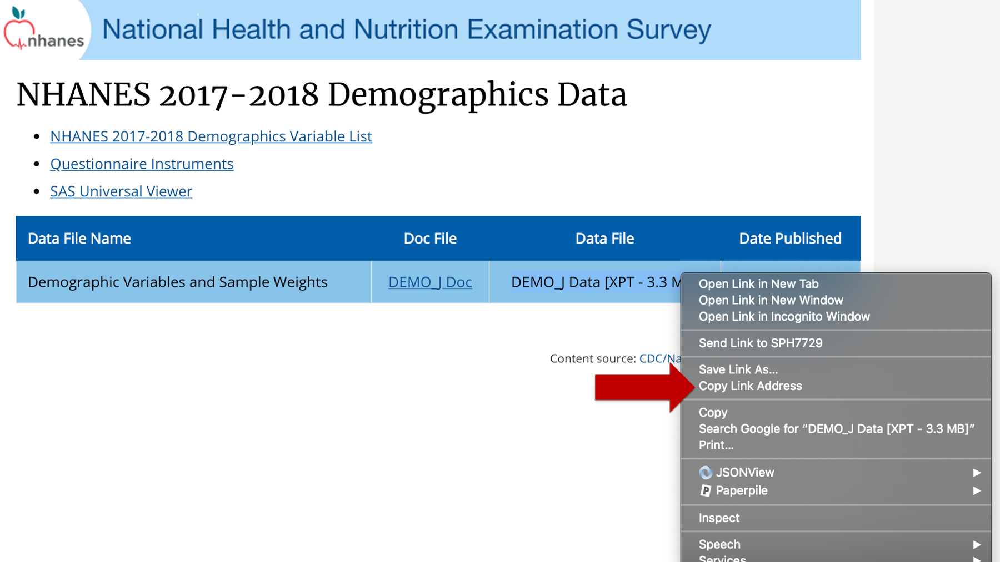
```

Click "Copy Link Address" and then navigate back to RStudio. Now, all you have to do is paste that link address where you would normally type a file path into the `read_xpt()` function. When you run the code chunk, the `read_xpt()` function will import the NHANES data directly from the internet (assuming you are connected to the internet). 😲

```{r read-in-nhanes, cache = TRUE}
nhanes_demo <- read_xpt("https://wwwn.cdc.gov/Nchs/Nhanes/2017-2018/DEMO_J.XPT")
```

```{r}
head(nhanes_demo)
```

👆**Here's what we did above:**

* We used `haven`'s `read_xpt()` function to import a SAS Transport File directly from the NHANES website. That data was imported as a data frame and we assigned that data frame to the R object called `nhanes_demo`.

* Because this is a large data frame (9,254 observations and 46 variables), we used the `head()` function to print only the first 6 rows of the data to the screen. 

## Importing Stata data sets

Finally, we will import a Stata data set (.dta) to round out our discussion of importing data from other statistical analysis software packages. There isn't much of anything new here -- you could probably have even guessed how to do this without me showing you.

[You may click here to download this file to your computer.](https://github.com/brad-cannell/r4epi/blob/master/data/height_and_weight.dta)

```{r read-in-stata, cache = TRUE, cache.invalidate.if = tools::md5sum('data/height_and_weight.dta')}
stata <- read_stata("data/height_and_weight.dta")
```

```{r}
stata
```

👆**Here's what we did above:**

* We used `haven`'s `read_stata()` function to import a Stata data set. That data was imported as a data frame and we assigned that data frame to the R object called `stata`.

You now know how to write code that will allow you to import data stored in all of the file formats that we will use in this book, and the vast majority of formats that you are likely to encounter in your real-world projects. In the next section, I will introduce you to a tool in RStudio that makes importing data even easier. 

<!--chapter:end:chapters/03_part_data_transfer/04_importing_binary_files.Rmd-->

# RStudio's data import tool

In previous chapters, we learned how to programmatically import data into R. In this chapter, I will briefly introduce you to RStudio's data import tool. Conceptually, I won't be introducing anything you haven't already seen before. I just want to make you aware of this tool, which can be a welcomed convenience at times. 

For this example, we will use the import tool to help us import the same height and weight csv file we imported in the [chapter on importing plain text files](#plain-text) -- comma.csv.

[You may click here to download this file to your compter.](https://www.dropbox.com/s/weaea47drw0iln5/comma.csv?dl=1)

To open RStudio's data import tool, click the `Import Dataset` dropdown menu near the top of the environment pane.

```{r echo=FALSE}
knitr::include_graphics("img/03_part_data_transfer/05_rstudio_import_tool/import_button.png")
```

Next, because this is a csv file, we will choose the `From Text (readr)` option from the dropdown menu. The difference between `From Text (base)` and `From Text (readr)` is that `From Text (readr)` will use functions from the `readr` package to import the data and `From Text (base)` will use base R functions to import the data.

```{r echo=FALSE}
knitr::include_graphics("img/03_part_data_transfer/05_rstudio_import_tool/readr.png")
```

After you select a file type from the import tool dropdown menu, a separate data import window will open.

```{r echo=FALSE}
knitr::include_graphics("img/03_part_data_transfer/05_rstudio_import_tool/import_window.png")
```

At this point, you should click the `browse` button to locate the file you want to import.

```{r echo=FALSE}
knitr::include_graphics("img/03_part_data_transfer/05_rstudio_import_tool/browse.png")
```

Doing so will open your operating system's file explorer window. Use that window to find and select the file you want to import. Again, I am using comma.csv for this demonstration.

```{r echo=FALSE}
knitr::include_graphics("img/03_part_data_transfer/05_rstudio_import_tool/select_file.png")
```

After selecting you file, there will be some changes in the data import window. Specifically,

* The file path to the raw data you are importing will appear in the `File/URL` field.

* A preview of how R is currently parsing that data will appear in the `Data Preview` field.

* Some or all of the import options will become available for you to select or deselect.

* The underlying code that R is currently using to import this data is displayed in the `Code Preview` window.

* The copy to clipboard icon becomes clickable.

```{r echo=FALSE}
knitr::include_graphics("img/03_part_data_transfer/05_rstudio_import_tool/overview.png")
```

Importing this simple data set doesn't require us to alter many of the import options. However, I do want to point out that you can change the variable type by clicking in the column headers in the `Data Preview` field. After clicking, a dropdown menu will display that allows you to change variable types. This is equivalent to adjusting the default values passed to the `col_types` argument of the `read_csv()` function. 

I will go ahead and change the `ht_in` and `wgt_lbs` variables from type double to type integer using the dropdown menu.

```{r echo=FALSE}
knitr::include_graphics("img/03_part_data_transfer/05_rstudio_import_tool/integer.png")
```

At this point, our data is ready for import. You can simply press the `Import` button in the bottom-right corner of the data import window. However, I am going to suggest that you don't do that. Instead, I'm going to suggest that you click the clipboard icon to copy the code displayed in the `Code Preview` window and then click the `Cancel` button. 

Next, return to your R script or R Markdown file and paste the code that was copied to your clipboard. At this point, you can run the code as though you wrote it. More importantly, this code is now a part of the record of how you conducted your data analysis. Further, if someone sends you an updated raw data set, you may only need to update the file path in your code instead of clicking around the data import tool again.

```{r echo=FALSE}
knitr::include_graphics("img/03_part_data_transfer/05_rstudio_import_tool/copy_and_paste.png")
```

That concludes the portion of the book devoted to importing data. In the next chapter, we will discuss strategies for exporting data so that you can store it in a more long-term way and/or share it with others.

<!--chapter:end:chapters/03_part_data_transfer/05_rstudio_import_tool.Rmd-->

# Exporting data

<!-- 
Exporting data for others (csv)
Exporting data for use in R (Rds)
We may also want to briefly touch on the difference between memory and disk.
-->

The data frames we’ve created so far don’t currently live in our global environment from one programming session to the next because we haven’t yet learned how to efficiently store our data long-term. This limitation makes it difficult to share our data with others or even to come back later to modify or analyze our data ourselves. In this chapter, you will learn to **export** data from R's memory to a file on your hard drive so that you may efficiently store it or share it with others. In the examples that follow, I'm going to use this simulated data.

```{r}
demo <- tibble(
  id  = c("001", "002", "003", "004"),
  age = c(30, 67, 52, 56),
  edu = c(3, 1, 4, 2)
)
```

👆 **Here's what we did above:**

* We created a data frame that is meant to simulate some demographic information about 4 hypothetical study participants.

* The first variable (`id`) is the participant's study id.

* The second variable (`age`) is the participant's age at enrollment in the study.

* The third variable (`edu`) is the highest level of formal education the participant completed. Where:

  - 1 = Less than high school
  
  - 2 = High school graduate
  
  - 3 = Some college
  
  - 4 = College graduate

## Plain text files

Most of `readr`'s `read_` functions that were introduced in the [importing plain text files](#importing-plain-text-files) chapter have a `write_` counterpart that allow you to export data from R into a plain text file. 

Additionally, all of `haven`s `read_` functions that were introduced in the [importing binary files](#importing-binary-files) chapter have a `write_` counterpart that allow you to export data from R into SAS, Stata, and SPSS binary file formats. 

Interestingly, `readxl` does not have a `write_excel()` function for exporting R data frames as .xls or .xlsx files. However, the importance of this is mitigated by the fact that Excel can open .csv files and `readr` contains a function (`write_csv()`)for exporting data frames in the .csv file format. If you absolutely have to export your data frame as a `.xls` or `.xlsx` file, there are other R packages capable of doing so (e.g., `xlsx`).

So, with all these options what format should you choose? My answer to this sort of depends on the answers to two questions. First, will this data be shared with anyone else? Second, will I need any of the metadata that would be lost if I export this data to a plain text file?

Unless you have a compelling reason to do otherwise, I'm going to suggest that you always export your R data frames as csv files if you plan to share your data with others. The reason is simple. They just work. I can think of many times when someone sent me a SAS or Stata data set and I wasn't able to import it for some reason or the data didn't import in the way that I expected it to. I don't recall ever having that experience with a csv file. Further, every operating system and statistical analysis software application that I'm aware of is able to accept csv files. Perhaps for that reason, they have become the closest thing to a standard for data sharing that exists -- at least that I'm aware of.

Exporting an R data frame to a csv file is really easy. The example below shows how to export our simulated demographic data to a csv file on my computer's desktop:

```{r eval=FALSE}
readr::write_csv(demo, "/Users/bradcannell/Desktop/demo.csv")
```

👆**Here's what we did above:**

* We used `readr`'s `write_csv()` function to export a data frame called `demo` in our global environment to a csv file on our desktop called `demo.csv`.

* You can type `?write_csv` into your R console to view the help documentation for this function and follow along with the explanation below.

* The first argument to the `write_csv()` function is the `x` argument. The value passed to the `x` argument should be a data frame that is currently in our global environment.

* The second argument to the `write_csv()` function is the `path` argument. The value passed to the `path` should be a file path telling R where to create the new csv file.

  - You name the csv file directly in the file path. Whatever name you write after the final slash in the file path is what the csv file will be named.
  
  - As always, make sure you remember to include the file extension in the file path.
  
Even if you don't plan on sharing your data, there is another benefit to saving your data as a csv file. That is, it's easy to open the file and take a quick peek if you need to for some reason. You don't have to open R and load the file. You can just find the file on your computer, double-click it, and quickly view it in your text editor or spreadsheet application of choice.

However, there is a downside to saving your data frames to a csv file. In general, csv files don't store any metadata, which can sometimes be a problem (or a least a pain). For example, if you've coerced several variables to factors, that information would not be preserved in the csv file. Instead, the factors will be converted to character strings. If you need to preserve metadata, then you may want to save you data frames in a binary format.

## R binary files

In the chapter on [importing binary files](#importing-binary-files) I mentioned that most statistical analysis software allows you to save your data in a binary file format. The primary advantage to doing so is that potentially useful metadata is stored alongside your analysis data. We were first introduced to [factor vectors][Factor vectors] in the chapter on numerical descriptions of categorical variables. There, we saw how coercing some of your variables to factors can be useful. However, doing so requires R to store metadata along with the analysis data. That metadata would be lost if you were to export your data frame to a plain text file. This is an example of a time when we may want to consider exporting our data to a binary file format.

R actually allows you to save your data in multiple different binary file formats. The two most popular are the .Rdata format and the .Rds format. I'm going to suggest that you use the .Rds format to save your R data frames. Exporting to this format is really easy with the `readr` package. 

The example below shows how to export our simulated demographic data to an .Rds file on my computer's desktop:

```{r eval=FALSE}
readr::write_rds(demo, "/Users/bradcannell/Desktop/demo.rds")
```

👆**Here's what we did above:**

* We used `readr`'s `write_rds()` function to export a data frame called `demo` in our globabl environment to an .Rds file on our desktop called `demo.rds`.

* You can type `?write_rds` into your R console to view the help documentation for this function and follow along with the explanation below.

* The first argument to the `write_rds()` function is the `x` argument. The value passed to the `x` argument should be a data frame that is currently in our global environment.

* The second argument to the `write_csv()` function is the `path` argument. The value passed to the `path` should be a file path telling R where to create the new .Rds file.

  - You name the .Rds file directly in the file path. Whatever name you write after the final slash in the file path is what the .Rds file will be named.
  
  - As always, make sure you remember to include the file extension in the file path. 

To load the .Rds data back into your global environment, simply pass the path to the .Rds file to `readr`s `read_rds()` function:

```{r eval=FALSE}
demo <- readr::read_rds("/Users/bradcannell/Desktop/demo.rds")
```

There is a final thought I want to share on exporting data frames. When I got to the end of this chapter, it occurred to me that the way I wrote it may give the impression that that you must choose to export data frames as plain text files _or_ binary files, but not _both_. That isn't the case. I frequently export my data as a csv file that I can easily open and view and/or share with others, but _also_ export it to an .Rds file that retains useful metadata I might need the next time I return to my analysis. I suppose there could be times that your files are so large that this is not an efficient strategy, but that is generally not the case in my projects.

<!--chapter:end:chapters/03_part_data_transfer/06_exporting_data_to_disk.Rmd-->

# (PART) Descriptive Analysis {-}

<!-- This Rmd just creates a part heading in the table of contents -->

<!--chapter:end:chapters/04_part_descriptive_analysis/00_part_descriptive_analysis.Rmd-->

# Introduction to descriptive analysis

```{r include=FALSE}
library(dplyr)
```

## What is descriptive analysis and why would we do it?

So, we have all this data that tells us all this information about different traits or characteristics of the people for whom the data was collected. For example, if we collected data about the students in this course, we may have information about how tall you are, about what kind of insurance you have, and about what your favorite color is.

```{r echo=FALSE, warning=FALSE}
set.seed(123)
df <- tibble(
  student_id = c(1001, 1002, 1003),
  height_in = rnorm(3, mean = 70, sd = 9) %>% round(2),
  insurance = c("private", "other", "none"),
  color = c("blue", "yellow", "red")
) 

knitr::kable(df, format = "html", align = "c") %>% 
  kableExtra::kable_styling() %>% 
  kableExtra::row_spec(row = 2, background = "yellow")
```

But, unless you’re a celebrity, or under investigation for some reason, it’s unlikely that many people outside of your friends and family care to know any of this information about you, _per se_. Usually they want to know this information about the typical person in the population, or subpopulation, to which you belong. Or, they want to know more about the _relationship_ between people who are like you in some way and some outcome that they are interested in.

For example: We typically aren't interested in knowing that student 1002 (above) is 67.93 inches tall. We are typically more interested in knowing things like the average height of the class -- `r mean(df$height_in) %>% round(2)`.

Before we can make any inferences or draw any conclusions, we must (or at least should) begin by conducting descriptive analysis of our data. This is also sometimes referred to as exploratory analysis. There are at least three reasons why we want to start with a descriptive analysis:

1. _We can use descriptive analysis to uncover errors in our data._   
2. _It helps us understand the distribution of values in our variables._   
3. _Descriptive analysis serve as a starting point for understanding relationships between our variables._   

## What kind of descriptive analysis should we perform?

When conducting descriptive analysis, the method you choose will depend on the _type_ of data you’re analyzing. At the most basic level, variables can be described as numerical or categorical.

```{r echo=FALSE}
knitr::include_graphics("img/04_part_descriptive_analysis/flowchart_num_and_cat.png")
```

Numeric variables can then be further divided into continuous and discrete - the distinction being whether the variable can take on a continuum of values, or only set of certain values.

```{r echo=FALSE}
knitr::include_graphics("img/04_part_descriptive_analysis/flowchart_num_only.png")
```

Categorical variables can be subdivided into ordinal or nominal variables - depending on whether or not the categories can logically be ordered in a meaningful way.

```{r echo=FALSE}
knitr::include_graphics("img/04_part_descriptive_analysis/flowchart_cat_only.png")
```

Finally, for all types, and subtypes, of variables there are both numerical and graphical methods we can use for descriptive analysis.

```{r echo=FALSE}
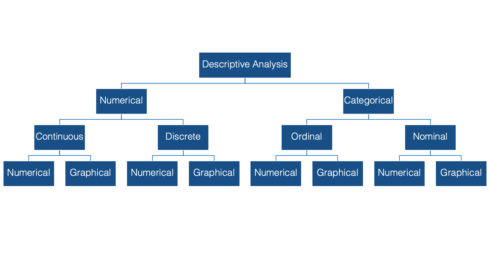
```

In the exercises that follow you will be introduced to measures of frequency, measures of central tendency, and measures of dispersion. Then, you'll learn various methods for estimating and interpreting these measures using R.

<!--chapter:end:chapters/04_part_descriptive_analysis/01_introduction.Rmd-->

# Numerical descriptions of categorical variables

We’ll begin our discussion of descriptive statistics in the categorical half of our flow chart. Specifically, we’ll start by numerically describing categorical variables. As a reminder, categorical variables are variables whose values fit into categories.

```{r echo=FALSE}
knitr::include_graphics("img/04_part_descriptive_analysis/flowchart_cat_numerical.png")
```

Some examples of categorical variables commonly seen in public health data are: sex, race or ethnicity, and level of educational attainment.

```{r echo=FALSE}
knitr::include_graphics("img/04_part_descriptive_analysis/categorical_variables_01.jpeg")
```

Notice that there is no inherent numeric value to any of these categories. Having said that, we can, and often will, assign a numeric value to each category using R.

```{r echo=FALSE}
knitr::include_graphics("img/04_part_descriptive_analysis/categorical_variables_02.jpeg")
```

The two most common numerical descriptions of categorical variables are probably the **frequency count** (you will often hear this referred to as simply the **frequency**, the **count**, or the **n**) and the **proportion** or **percentage** (the percentage is just the proportion multiplied by 100).

```{r echo=FALSE}
knitr::include_graphics("img/04_part_descriptive_analysis/categorical_variables_03.jpeg")
```

The count is simply the number of observations, in this case people, which fall into each possible category.

The proportion is just the count divided by the total number of observations. In this example, 2 people out of 5 people (.40 or 40%) are in the Asian race category.

The remainder of this chapter is devoted to learning how to calculate frequency counts and percentages using R.

## Factor vectors

Before moving on to calculating frequency counts and percentages, I want to introduce a new vector type -- the **factor** vector type. In R, factors can be useful for representing categorical data. To demonstrate, let's simulate a simple little data frame. 

```{r message=FALSE}
# Load dplyr for tibble()
library(dplyr)
```

```{r}
demo <- tibble(
  id  = c("001", "002", "003", "004"),
  age = c(30, 67, 52, 56),
  edu = c(3, 1, 4, 2)
)
```

👆 **Here's what we did above:**

* We created a data frame that is meant to simulate some demographic information about 4 hypothetical study participants.

* The first variable (`id`) is the participant's study id.

* The second variable (`age`) is the participant's age at enrollment in the study.

* The third variable (`edu`) is the highest level of formal education the participant completed. Where:

  - 1 = Less than high school
  
  - 2 = High school graduate
  
  - 3 = Some college
  
  - 4 = College graduate

Each participant in our data frame has a value for `edu` -- 1, 2, 3, or 4. The value they have for that variable corresponds to the highest level of formal education they have completed, which is split up into categories that we defined. We can see which category each person is in by viewing the data.

```{r}
demo
```

We can see that person `001` is in category `3`, person `002` is in category `1`, and so on. This compact representation of the categories is convenient for data entry and data manipulation, but it also has an obvious limitation -- what do these numbers mean? I defined what these values mean for you above, but if you didn't have that information, or some kind of prior knowledge about the process that was used to gather this data, then you would likely have no idea what these numbers mean. 

Now, we could have solved that problem by making education a character vector from the beginning. For example: 

```{r}
demo <- tibble(
  id       = c("001", "002", "003", "004"),
  age      = c(30, 67, 52, 56),
  edu      = c(3, 1, 4, 2),
  edu_char = c(
    "Some college", "Less than high school", "College graduate", 
    "High school graduate"
  )
)

demo
```

But, this strategy also has a few limitations. 

👎 First, entering data this way requires more typing. Not such a big deal in this case because we only have 4 participants. But, imagine typing out the categories as character strings 10, 20, or 100 times. 😫

👎 Second, R summarizes character vectors alphabetically by default, which may not be the ideal way to order some categorical variables. 

👎 Third, creating categorical variables in our data frame as character vectors limits us to inputting only _observed_ values for that variable. However, there are cases when other categories are possible and just didn't apply to anyone in our data. That information may be useful to know.

At this point, I'm going to show you how to coerce a variable to a factor in your data frame. Then, I will return to showing you how using factors can overcome some of the limitations outlined above.

### Coerce a numeric variable

The code below shows one method for coercing a numeric vector into a factor.

```{r message=FALSE}
# Load dplyr for pipes and mutate()
library(dplyr)
```

```{r}
demo <- demo %>% 
  mutate(
    edu_f = factor(
      x      = edu,
      levels = 1:4,
      labels = c(
        "Less than high school", "High school graduate", "Some college", 
        "College graduate"
      )
    )
  )

demo
```

👆**Here's what we did above:**

* We used `dplyr`'s `mutate()` function to create a new variable (`edu_f`) in the data frame called `demo`. The purpose of the `mutate()` function is to add new variables to data frames. We will discuss `mutate()` in greater detail in the [later in the book][creating and modifying columns].

  - You can type `?mutate` into your R console to view the help documentation for this function and follow along with the explanation below.

  - We assigned this new data frame the name `demo` using the assignment operator (`<-`). 

  - Because we assigned it the name `demo`, our previous data frame named `demo` (i.e., the one that didn't include `edu_f`) no longer exists in our global environment. If we had wanted to keep that data frame in our global environment, we would have needed to assign our new data frame a different name (e.g., `demo_w_factor`). 

* The first argument to the `mutate()` function is the `.data` argument. The value passed to the `.data` argument should be a data frame that is currently in our global environment. We passed the data frame `demo` to the `.data` argument using the pipe operator (`%>%`), which is why `demo` isn't written inside `mutate`'s parentheses. 

* The second argument to the `mutate()` function is the `...` argument. The value passed to the `...` argument should be a name value pair. That means, a variable name, followed by an equal sign, followed by the values to be assigned to that variable name (`name = value`).

  - The name we passed to the `...` argument was `edu_f`. This value tells R what to name the new variable we are creating.
  
    + If we had used the name `edu` instead, then the previous values in the `edu` variable would have been replaced with the new values. That is sometimes what you want to happen. However, when it comes to creating factors, I typically keep the numeric version of the variable in my data frame (e.g., `edu`) and _add a new_ factor variable. I just often find that it can be useful to have both versions of the variable hanging around during the analysis process.
    
    + I also use the `_f` naming convention in my code. That means that when I create a new factor variable I name it the same thing the original variable was named with the addition of `_f` (for factor) at the end.
    
  - In this case, the value that will be assigned to the name `edu_f` will be the values returned by the `factor()` function. This is an example of nesting functions. 
  
* We used the `factor()` function to create a factor vector. 

  - You can type `?factor` into your R console to view the help documentation for this function and follow along with the explanation below.
  
  - The first argument to the `factor()` function is the `x` argument. The value pass to the `x` argument should be a vector of data. We passed the `edu` vector to the `x` argument.
  
  - The second argument to the `factor()` function is the `levels` argument. This argument tells R the unique values that the new factor variable can take. We used the shorthand `1:4` to tell R that `edu_f` can take the unique values 1, 2, 3, or 4.
  
  - The third argument to the `factor()` function is the `labels` argument. The value passed to the `labels` argument should be a character vector of labels (i.e., descriptive text) for each value in the `levels` argument. The order of the labels in the character vector we pass to the `labels` argument should match the order of the values passed to the `levels` argument. For example, the ordering of `levels` and `labels` above tells R that `1` should be labeled with "Less than high school", `2` should be labeled with "High school graduate", etc.
  
When we printed the data frame above, the values in `edu_f` _looked_ the same as the character strings displayed in `edu_char`. Notice, however, that the variable type displayed below `edu_char` in the data frame above is `<chr>` for character. Alternatively, the variable type displayed below `edu_f` is `<fctr>`. Although, labels are used to make factors _look_ like character vectors, they are still integer vectors under the hood. For example:

```{r}
as.numeric(demo$edu_char)
```

```{r}
as.numeric(demo$edu_f)
```

There are two main reasons that you may want to use factors instead of character vectors at times:

👍 First, R summarizes character vectors alphabetically by default, which may not be the ideal way to order some categorical variables. However, we can explicitly set the order of factor levels. This will be useful to us later when we analyze categorical variables. Here is a glimpse of things to come:

```{r}
table(demo$edu_char)
```

```{r}
table(demo$edu_f)
```

👆**Here's what we did above:**

* You can type `?base::table` into your R console to view the help documentation for this function and follow along with the explanation below.

* We used the `table()` function to get a count of the number of times each unique value of `edu_char` appears in our data frame. In this case, each value appears one time. Notice that the results are returned to us in alphabetical order.

* Next, we used the `table()` function to get a count of the number of times each unique value of `edu_f` appears in our data frame. Again, each value appears one time. Notice, however, that this time the results are returned to us in the order that we passed to the `levels` argument of the `factor()` function above.

👍 Second, creating categorical variables in our data frame as character vectors limits us to inputting only _observed_ values for that variable. However, there are cases when other categories are possible and just didn't apply to anyone in our data. That information may be useful to know. Factors allow us to tell R that other values are possible, even when they are _unobserved_ in our data. For example, let's add a fifth possible category to our education variable -- graduate school.

```{r}
demo <- demo %>% 
  mutate(
    edu_5cat_f = factor(
      x      = edu,
      levels = 1:5,
      labels = c(
        "Less than high school", "High school graduate", "Some college", 
        "College graduate", "Graduate school"
      )
    )
  )

demo
```

Now, let's use the `table()` function once again to count the number of times each unique level of `edu_char` appears in the data frame and the number of times each unique level of `edu_5cat_f` appears in the data frame:

```{r}
table(demo$edu_char)
```

```{r}
table(demo$edu_5cat_f)
```

Notice that R now tells us that the value `Graduate school` was possible but was observed zero times in the data.

### Coerce a character variable

It is also possible to coerce character vectors to factors. For example, we can coerce `edu_char` to a factor like so:

```{r}
demo <- demo %>% 
  mutate(
    edu_f_from_char = factor(
      x      = edu_char,
      levels = c(
        "Less than high school", "High school graduate", "Some college", 
        "College graduate", "Graduate school"
      )
    )
  )

demo
```

```{r}
table(demo$edu_f_from_char)
```

👆**Here's what we did above:**

* We coerced a character vector (`edu_char`) to a factor using the `factor()` function. 

* Because the levels _are_ character strings, there was no need to pass any values to the `labels` argument this time. Keep in mind, though, that the order of the values passed to the `levels` argument matters. It will be the order that the factor levels will be displayed in your analyses.

Now that we know how to use factors, let's return to our discussion of describing categorical variables. 

## Height and Weight Data

Below, we're going to learn to do descriptive analysis in R by experimenting with some simulated data that contains several people's sex, height, and weight. You can follow along with this lesson by copying and pasting the code chunks below in your R session.

```{r message=FALSE}
# Load the dplyr package. We will need several of dplyr's functions in the 
# code below.
library(dplyr)
```

```{r error=TRUE}
# Simulate some data
height_and_weight_20 <- tibble(
  id = c(
    "001", "002", "003", "004", "005", "006", "007", "008", "009", "010", "011", 
    "012", "013", "014", "015", "016", "017", "018", "019", "020"
  ),
  sex = c(1, 1, 2, 2, 1, 1, 2, 1, 2, 1, 1, 2, 2, 2, 1, 2, 2, 2, 2, 2),
  sex_f = factor(sex, 1:2, c("Male", "Female")),
  ht_in = c(
    71, 69, 64, 65, 73, 69, 68, 73, 71, 66, 71, 69, 66, 68, 75, 69, 66, 65, 65, 
    65
  ),
  wt_lbs = c(
    190, 176, 130, 154, 173, 182, 140, 185, 157, 155, 213, 151, 147, 196, 212, 
    190, 194, 176, 176, 102
  )
)
```

### View the data

Let's start our analysis by taking a quick look at our data...

```{r}
height_and_weight_20
```

👆**Here's what we did above:** 

* Simulated some data that we can use to practice categorical data analysis.    

* We viewed the data and found that it has 5 variables (columns) and 20 observations (rows).    

* Also notice that you can use the "Next" button at the bottom right corner of the printed data frame to view rows 11 through 20 if you are viewing this data in RStudio.  

```{r echo=FALSE}
knitr::include_graphics("img/04_part_descriptive_analysis/next_button.png")
```

## Calculating frequencies

Now that we’re able to easily view our data, let’s return to the original purpose of this demonstration – calculating frequencies and proportions. At this point, I suspect that few of you would have any trouble telling me that the frequency of females in this data is 12 and the frequency of males in this data is 8. It's pretty easy to just count the number of females and males in this small data set with only 20 rows. Further, if I asked you what proportion of this sample is female, most of you would still be able to easily tell me `12/20 = 0.6`, or 60%. But, what if we had 100 observations or 1,000,000 observations? You’d get sick of counting pretty quickly. Fortunately, you don’t have to! Let R do it for you! As is almost always the case with R, there are multiple ways we can calculate the statistics that we're interested in. 

### The base R table function

As we already saw above, we can use the base R `table()` function like this:

```{r}
table(height_and_weight_20$sex)
```

Additionally, we can use the `CrossTable()` function from the `gmodels` package, which gives us a little more information by default.

### The gmodels CrossTable function

```{r}
# Like all packages, you will have to install gmodels (install.packages("gmodels")) before you can use the CrossTable() function. 
gmodels::CrossTable(height_and_weight_20$sex)
```

### The tidyverse way

The final way I'm going to discuss here is the `tidyverse` way, which is my preference. We will have to write a little additional code, but the end result will be more flexible, more readable, and will return our statistics to us in a data frame that we can save and use for further analysis. Let's walk through this step by step...

<p class="note"> 🗒**Side Note:** You should already be familiar with the pipe operator (`%>%`), but if it doesn't look familiar to you, you can learn more about it in [Using pipes]. Don't forget, if you are using RStudio, you can use the keyboard shortcut `shift + command + m` (Mac) or `shift + control + m` (Windows) to insert the pipe operator.</p>

First, we don't want to view the individual values in our data frame. Instead, we want to condense those values into summary statistics. This is a job for the [summarise()](https://dplyr.tidyverse.org/reference/summarise.html) function. 

```{r}
height_and_weight_20 %>% 
  summarise()
```

As you can see, `summarise()` doesn't do anything interesting on its own. We need to tell it what kind of summary information we want. We can use the [n()](https://dplyr.tidyverse.org/reference/n.html) function to count rows. By default, it will count all the rows in the data frame. For example:

```{r}
height_and_weight_20 %>% 
  summarise(n())
```

👆**Here's what we did above:** 

* We passed our entire data frame to the `summarise()` function and asked it to count the number of rows in the data frame. 

* The result we get is a new data frame with 1 column (named `n()`) and one row with the value 20 (the number of rows in the original data frame).

This is a great start. However, we really want to count the number of rows that have the value "Female" for sex_f, and then separately count the number of rows that have the value "Male" for sex_f. Said another way, we want to break our data frame up into smaller data frames -- one for each value of `sex_f` -- and then count the rows. This is exactly what `dplyr`'s [group_by()](https://dplyr.tidyverse.org/reference/group_by.html) function does.

```{r message=FALSE}
height_and_weight_20 %>%
  group_by(sex_f) %>% 
  summarise(n())
```

And, that's what we want.

<p class="note"> 🗒**Side Note:** `dplyr`'s `group_by()` function operationalizes the **Split - Apply - Combine** strategy for data analysis. That sounds sort of fancy, but all it really means is that we split our data frame up into smaller data frames, apply our calculation separately to each smaller data frame, and then combine those individual results back together as a single result. So, in the example above, the `height_and_weight_20` data frame was split into two separate little data frames (i.e., one for females and one for males), then the `summarise()` and `n()` functions counted the number of rows in each of the two smaller data frames (i.e., 12 and 8 respectively), and finally combined those individual results into a single data frame, which was printed to the screen for us to view.</p>

However, it will be awkward to work with a variable named `n()` (i.e., with parentheses) in the future. Let's go ahead and assign it a different name. We can assign it any valid name we want. Some names that might make sense are `n`, `frequency`, or `count`. I'm going to go ahead and just name it `n` without the parentheses.

```{r}
height_and_weight_20 %>%
  group_by(sex_f) %>% 
  summarise(n = n())
```

👆**Here's what we did above:** 

* We added `n = ` to our summarise function (`summarise(n = n())`) so that our count column in the resulting data frame would be named `n` instead of `n()`.

Finally, estimating categorical frequencies like this is such a common operation that `dplyr` has a shortcut for it -- `count()`. We can use the [count()](https://dplyr.tidyverse.org/reference/tally.html) function to get the same result that we got above.

```{r}
height_and_weight_20 %>% 
  count(sex_f)
```

## Calculating percentages

In addition to frequencies, we will often be interested in calculating percentages for categorical variables. As always, there are many ways to accomplish this task in R. From here on out, I'm going to primarily use `tidyverse` functions.

In this case, the proportion of people in our data who are female can be calculated as the number who are female (12) divided by the total number of people in the data (20). Because we already know that there are 20 people in the data, we could calculate proportions like this:

```{r}
height_and_weight_20 %>% 
  count(sex_f) %>% 
  mutate(prop = n / 20)
```

👆**Here's what we did above:**

* Because the `count()` function returns a data frame just like any other data frame, we can manipulate it in the same ways we can manipulate any other data frame.    

* So, we used `dplyr`'s `mutate()` function to create a new variable in the data frame named `prop`. Again, we could have given it any valid name.   

* Then we set the value of `prop` to be equal to the value of `n` divided by 20.    

This works, but it would be better to have R calculate the total number of observations for the denominator (20) than for us to manually type it in. In this case, we can do that with the `sum()` function.

```{r}
height_and_weight_20 %>% 
  count(sex_f) %>% 
  mutate(prop = n / sum(n))
```

👆**Here's what we did above:**

* Instead of manually typing in the total count for our denominator (20), we had R calculate it for us using the `sum()` function. The `sum()` function added together all the values of the variable `n` (i.e., 12 + 8 = 20).   

Finally, we just need to multiply our proportion by 100 to convert it to a percentage.

```{r}
height_and_weight_20 %>% 
  count(sex_f) %>% 
  mutate(percent = n / sum(n) * 100)
```

👆**Here's what we did above:**

* Changed the name of the variable we are creating from `prop` to `percent`. But, we could have given it any valid name.   

* Multiplied the proportion by 100 to convert it to a percentage.


## Missing data {#cat-missing-data}

In the real world, you will frequently encounter data that has missing values. Let's quickly take a look at an example by adding some missing values to our data frame.

```{r}
height_and_weight_20 <- height_and_weight_20 %>% 
  mutate(sex_f = replace(sex, c(2, 9), NA)) %>% 
  print()
```

👆**Here's what we did above:**

* Replaced the 2nd and 9th value of `sex_f` with `NA` (missing) using the `replace()` function.   

Now let's see how our code from above handles this

```{r}
height_and_weight_20 %>% 
  count(sex_f) %>% 
  mutate(percent = n / sum(n) * 100)
```

As you can see, we are now treating missing as if it were a category of sex_f. Sometimes this will be the result you want. However, often you will want the n and percent of _non-missing_ values for your categorical variable. This is sometimes referred to as a **complete case analysis**. There's a couple of different ways we can handle this. I will simply filter out rows with a missing value for sex_f with `dplyr`'s [filter()](https://dplyr.tidyverse.org/reference/filter.html) function.

```{r}
height_and_weight_20 %>% 
  filter(!is.na(sex_f)) %>% 
  count(sex_f) %>% 
  mutate(percent = n / sum(n) * 100)
```

👆**Here's what we did above:**

* We used `filter()` to keep only the rows that have a _non-missing_ value for sex_f.    
  
  - In the R language, we use the `is.na()` function to tell the R interpreter to identify NA (missing) values in a vector. We _cannot_ use something like `sex_f == NA` to identify NA values, which is sometimes confusing for people who are coming to R from other statistical languages.    
  
  - In the R language, `!` is the NOT operator. It sort of means "do the opposite."   
  
  - So, `filter()` tells R which rows of a data frame to _keep_, and `is.na(sex_f)` tells R to find rows with an NA value for the variable `sex_f`. Together, `filter(is.na(sex_f))` would tell R to _keep_ rows with an NA value for the variable `sex_f`. Adding the NOT operator `!` tells R to do the opposite -- _keep_ rows that do _NOT_ have an NA value for the variable `sex_f`.    

* We used our code from above to calculate the n and percent of non-missing values of sex_f.   

## Formatting results {#formatting-results}

Notice that now our percentages are being displayed with 5 digits to the right of the decimal. If we wanted to present our findings somewhere (e.g., a journal article or a report for our employer) we would almost never want to display this many digits. Let's get R to round these numbers for us.

```{r}
height_and_weight_20 %>% 
  filter(!is.na(sex_f)) %>% 
  count(sex_f) %>% 
  mutate(percent = (n / sum(n) * 100) %>% round(2))
```

👆**Here's what we did above:**

* We passed the calculated percentage values `(n / sum(n) * 100)` to the `round()` function to round our percentages to 2 decimal places.    
  
  - Notice that we had to wrap `n / sum(n) * 100` in parentheses in order to pass it to the `round()` function with a pipe.    
  
  - We could have alternatively written our R code this way: `mutate(percent = round(n / sum(n) * 100, 2))`.   
  
## Using freqtables

In the sections above, we learned how to use `dplyr` functions to calculate the frequency and percentage of observations that take on each value of a categorical variable. However, there can be a fair amount of code writing involved when using those methods. The more we have to repeatedly type code, the more tedious and error-prone it becomes. This is an idea we will return to many times in this book. Luckily, the R programming language allows us to write our own functions, which solves both of those problems.

Later in this book, I will show you [how to write your own functions][writing functions]. For the time being, I'm going to suggest that you install and use a package I created called [freqtables](https://github.com/brad-cannell/freqtables). The `freqtables` package is basically an enhanced version of the code we wrote in the sections above. I designed it to help us quickly make tables of descriptive statistics (i.e., counts, percentages, confidence intervals) for categorical variables, and it's specifically designed to work in a `dplyr` pipeline.

Like all packages, you need to first install it...

```{r eval=FALSE}
# You may be asked if you want to update other packages on your computer that
# freqtables uses. Go ahead and do so.
install.packages("freqtables")
```

And then load it...

```{r}
# After installing freqtables on your computer, you can load it just like you
# would any other package.
library(freqtables)
```

Now, let's use the `freq_table()` function from `freqtables` package to rerun our analysis from above.

```{r}
height_and_weight_20 %>%
  filter(!is.na(sex_f)) %>%
  freq_table(sex_f)
```

👆**Here's what we did above:**

* We used `filter()` to keep only the rows that have a _non-missing_ value for sex and passed the data frame on to the `freq_table()` function using a pipe.

* We told the `freq_table()` function to create a univariate frequency table for the variable `sex_f`. A "univariate frequency table" just means a table (data frame) of useful statistics about a single categorical variable.

* The univariate frequency table above includes:
    
    - `var`: The name of the categorical variable (column) we are analyzing.
    
    - `cat`: Each of the different categories the variable `var` contains -- in this case "Male" and "Female".

    - `n`: The number of rows where `var` equals the value in `cat`. In this case, there are 7 rows where the value of `sex_f` is Male, and 11 rows where the value of `sex_f` is Female.

  - `n_total`: The sum of all the `n` values. This is also to total number of rows in the data frame currently being analyzed.
  
  - `percent`: The percent of rows where `var` equals the value in `cat`.
  
  - `se`: The standard error of the percent. This value is not terribly useful on its own; however, it's necessary for calculating the 95% confidence intervals.
  
  - `t_crit`: The critical value from the t distribution. This value is not terribly useful on its own; however, it's necessary for calculating the 95% confidence intervals.
  
  - `lcl`: The lower (95%, by default) confidence limit for the percentage `percent`.
  
  - `ucl`: The upper (95%, by default) confidence limit for the percentage `percent`.
  
We will continue using the `freqtables` package at various points throughout the book. I will also show you some other cool things we can do with `freqtables`. For now, all you need to know how to do is use the `freq_table()` function to calculate frequencies and percentages for single categorical variables.

🏆 Congratulations! You now know how to use R to do some basic descriptive analysis of individual categorical variables. 

<!--chapter:end:chapters/04_part_descriptive_analysis/02_categorical_variables.Rmd-->

# Measures of central tendency

In previous sections you've seen methods for describing individual categorical variables. Now we’ll switch over to numerically describing numerical variables.

```{r echo=FALSE}
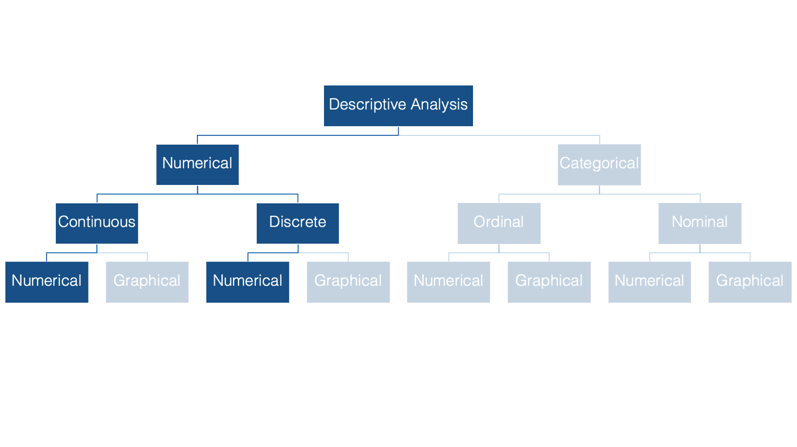
```

In epidemiology, we often want to describe the "typical" person in a population with respect to some characteristic that is recorded as a numerical variable -- like height or weight. The most basic, and probably most commonly used, way to do so is with a measure of central tendency.    

In this chapter we’ll discuss three measures of central tendency:

* **The mean**   
* **The median**    
* **The mode**    

```{r echo=FALSE}
knitr::include_graphics("img/04_part_descriptive_analysis/central_tendency_01.png")
```

Now, this is not a statistics course. But, I'm going to briefly discuss these measures, and some of their characteristics, below to make sure that we’re all on the same page when we discuss the interpretation of our results.

**The mean**

```{r echo=FALSE}
knitr::include_graphics("img/04_part_descriptive_analysis/central_tendency_02.png")
```

When we talk about the typical, or “average”, value of some variable measured on a continuous scale, we are usually talking about the mean value of that variable. To be even more specific, we are usually talking about the arithmetic mean value. This value has some favorable characteristics that make it a good description of central tendency.

👍 For starters it’s simple. Most people are familiar with the mean, and at the very least, have some intuitive sense of what it means (no pun intended).    

👍 In addition, there can be only one mean value for any set of values.    

However, there are a couple of potentially problematic characteristics of the mean as well: 

👎 It’s susceptible to extreme values in your data. In other words, a couple of people with very atypical values for the characteristic you are interested in can drastically alter the value of the mean, and your estimate for the typical person in your population of interest along with it.

👎 Additionally, it’s very possible to calculate a mean value that is not actually observed anywhere in your data. 

<p class="note"> 🗒**Side Note:** The sample mean is often referred to as $\bar{x}$, which pronounced "x bar."</p>

**The median**

```{r echo=FALSE}
knitr::include_graphics("img/04_part_descriptive_analysis/central_tendency_03.png")
```

The median is probably the second most commonly used measure of central tendency. Like the mean, it’s computationally simple and relatively straightforward to understand. 👍 There can be one, and only one, median. 👍 And, its value may also be unobserved in the data.👎

However, unlike the mean, it’s relatively resistant to extreme values. 👍 In fact, when the median is used as the measure of central tendency, it’s often because the person conducting the analysis suspects that extreme values in the data are likely to distort the mean.

**The mode**

```{r echo=FALSE}
knitr::include_graphics("img/04_part_descriptive_analysis/central_tendency_04.png")
```

And finally, we have the mode, or the value that is most often observed in the data. It doesn’t get much simpler than that. 👍 But, unlike the mean and the median, there can be more than one mode for a given set of values. In fact, there can even be no mode if all the values are observed the exact same number of times.👎

However, if there is a mode, by definition it’s observed in the data.👍

Now that we are all on the same page with respect to the fundamentals of central tendency, let’s take a look at how to calculate these measures using R.

## Calculate the mean

Calculating the mean is really straightforward. We can just use base R's built-in `mean()` function.

```{r message=FALSE}
# Load the dplyr package. We will need several of dplyr's functions in the 
# code below.
library(dplyr)
```

```{r}
# Simulate some data
height_and_weight_20 <- tribble(
  ~id,   ~sex,     ~ht_in, ~wt_lbs,
  "001", "Male",   71,     190,
  "002", "Male",   69,     177,
  "003", "Female", 64,     130,
  "004", "Female", 65,     153,
  "005", NA,       73,     173,
  "006", "Male",   69,     182,
  "007", "Female", 68,     186,
  "008", NA,       73,     185,
  "009", "Female", 71,     157,
  "010", "Male",   66,     155,
  "011", "Male",   71,     213,
  "012", "Female", 69,     151,
  "013", "Female", 66,     147,
  "014", "Female", 68,     196,
  "015", "Male",   75,     212,
  "016", "Female", 69,     19000,
  "017", "Female", 66,     194,
  "018", "Female", 65,     176,
  "019", "Female", 65,     176,
  "020", "Female", 65,     102
)
```

👆 **Here's what we did above:**

* We loaded the `tibble` package so that we could use its `tribble()` function.    

* We used the `tribble()` function to simulate some data -- heights and weights for 20 hypothetical students.
  
  - The `tribble()` function creates something called a [tibble](https://tibble.tidyverse.org/). A tibble is the `tidyverse` version of a data frame. In fact, it _is_ a data frame, but with some additional functionality. You can use the link to read more about it if you'd like.   
  
  - We used the `tribble()` function instead of the `data.frame()` function to create our data frame above because we can use the `tribble()` function to create our data frames in rows (like you see above) instead of columns with the `c()` function.    
  
  - Using the `tribble()` function to create a data frame isn't any better or worse than using the `data.frame()` function. I just wanted you to be aware that it exists and is sometimes useful.

```{r}
mean(height_and_weight_20$ht_in)
```

👆 **Here's what we did above:**

* We used base R's `mean()` function to calculate the mean of the column "ht_in" from the data frame "height_and_weight_20".

  - Note: if you just type `mean(ht_in)` you will get an error. That's because R will look for an object called "ht_in" in the global environment. 
  
  - However, we didn't create an object called "ht_in". We created an object (in this case a data frame) called "height_and_weight_20". That object has a column in it called "ht_in".

  - So, we must specifically tell R to look for the "ht_in" column in the data frame "height_and_weight_20". Using base R, we can do that in one of two ways: `height_and_weight_20$ht_in` or `height_and_weight_20[["ht_in"]]`.
  
## Calculate the median

Similar to above, we can use base R's `median()` function to calculate the median.

```{r}
median(height_and_weight_20$ht_in)
```

👆 **Here's what we did above:**

* We used base R's `median()` function to calculate the median of the column "ht_in" from the data frame "height_and_weight_20".

## Calculate the mode

Base R does not have a built-in `mode()` function. Well, it actually does have a `mode()` function, but for some reason that function does not return the mode value(s) of a set of numbers. Instead, the `mode()` function gets or sets the type or storage mode of an object. For example:

```{r}
mode(height_and_weight_20$ht_in)
```

This is clearly not what we are looking for. So, how do we find the mode value(s)? Well, we are going to have to build our own mode function. Later in the book, I'll return to this function and walk you through how I built it one step at a time. For now, just copy and paste the code into R on your computer. Keep in mind, as is almost always the case with R, my way of writing this function is only one of multiple possible ways.

```{r}
mode_val <- function(x) {
  
  # Count the number of occurrences for each value of x
  value_counts <- table(x)
  
  # Get the maximum number of times any value is observed
  max_count <- max(value_counts)
  
  # Create and index vector that identifies the positions that correspond to
  # count values that are the same as the maximum count value: TRUE if so
  # and false otherwise
  index <- value_counts == max_count
  
  # Use the index vector to get all values that are observed the same number 
  # of times as the maximum number of times that any value is observed
  unique_values <- names(value_counts)
  result <- unique_values[index]
  
  # If result is the same length as value counts that means that every value
  # occured the same number of times. If every value occurred the same number
  # of times, then there is no mode
  no_mode <- length(value_counts) == length(result)
  
  # If there is no mode then change the value of result to NA
  if (no_mode) {
    result <- NA
  }
  
  # Return result
  result
}
```

```{r}
mode_val(height_and_weight_20$ht_in)
```

👆 **Here's what we did above:**

* We created our own function, `mode_val()`, that takes a vector (or data frame column) as a value to its "x" argument and returns the mode value(s) of that vector.

* We can also see that the function works as expected when there is more than one mode value. In this case, "65" and "69" each occur 4 times in the column "ht_in". 

## Compare mean, median, and mode

<!-- This isn't HOW to get the mean. This a comparison of the mean and the median - the WHY -->

Now that you know how to calculate the mean, median, and mode, let's compare these three measures of central tendency. This is a good opportunity to demonstrate some of the different characteristics of each that we spoke about earlier.

```{r}
height_and_weight_20 %>% 
  summarise(
    min_weight    = min(wt_lbs),
    mean_weight   = mean(wt_lbs),
    median_weight = median(wt_lbs),
    mode_weight   = mode_val(wt_lbs) %>% as.double(),
    max_weight    = max(wt_lbs)
  )
```

👆 **Here's what we did above:**

* We used the `mean()` function, `median()` function, and our `mode_val()` function inside of dplyr's `summarise()` function to find the mean, median, and mode values of the column "wt_lbs" in the "height_and_weight_20" data frame.

* We also used the `as.double()` function to convert the value returned by `mode_val()` -- "176" -- from a character string to a numeric double. This isn't strictly necessary, but I think it looks better.

* Finally, we used base R's `min()` and `max()` functions to view the lowest and highest weights in our sample. 

## Data checking

Do you see any red flags 🚩as you scan the results? Do you really think a mean weight of 1,113 pounds sounds reasonable? This should definitely be a red flag for you. Now move your gaze three columns to the right and notice that the maximum value of weight is 19,000 lbs – an impossible value for a study in human populations. In this case the real weight was supposed to be 190 pounds, but the person entering the data accidently got a little trigger-happy with the zero key. 

This is an example of what I meant when I said "We can use descriptive analysis to uncover errors in our data" in the [Introduction to descriptive analysis] chapter. Often times, for various reasons, some observations for a given variable take on values that don’t make sense. Starting by calculating some basic descriptive statistics for each variable is one approach you can use to try to figure out if you have values in your data that don’t make sense.

In this case we can just go back and fix our data, but what if we didn’t know this value was an error? What if it were a value that was technically possible, but very unlikely? Well, we can’t just go changing values in our data. It’s unethical, and in some cases illegal. Below, we discuss the how the properties of the median and mode can come in handy in situations such as this.

## Properties of mean, median, and mode 

Despite the fact that this impossibly extreme value is in our data, the median and mode estimates are reasonable estimates of the typical person’s weight in this sample. This is what I meant when I said that the median and mode were more “resistant to extreme values” than the mean. 

You may also notice that no person in our sample had an actual weight of 1,112.75 (the mean) or even 176.5 (the median). This is what I meant above when I said that the mean and median values are “not necessarily observed in the data.”

In this case, the mode value (176) is also a more reasonable estimate of the average person's weight than the mean. And unlike the mean and the median, participants 18 and 19 actually weigh 176 pounds. I'm __not__ saying that the mode is always the best measure of central tendency to use. However, I __am__ saying that you can often learn useful information from your data by calculating and comparing these relatively simple descriptive statistics on each of your numeric variables.

## Missing data {#na-rm}

In [numerical descriptions of categorical variables](#cat-missing-data) we saw that we could use the `dplyr::filter()` function to remove all the rows from our data frame that contained a missing value for any of our variables of interest. We learned that this is called a **complete case analysis**. This method should pretty much always work, but in this section I'm going to show you an alternative method for dropping missing values from your analysis that you are likely to come across often when reading R documentation -- the `na.rm` argument. 

Many R functions that perform calculations on numerical variables include an `na.rm` -- short for "Remove NA" -- argument. By default, this argument is typically set to `FALSE`. By passing the value `TRUE` to this argument, we can perform a complete case analysis. Let's quickly take a look at how it works. 

We already saw that we can calculate the mean value of a numeric vector using the `mean()` function:

```{r}
mean(c(1, 2, 3))
```

But, what happens when our vector has a missing value?

```{r}
mean(c(1, NA, 3))
```

As you can see, the `mean()` function returns `NA` by default when we pass it a numeric vector that contains a missing value. It took me a little while to wrap my head around why this is the case when I was a student. Perhaps some of you are confused as well. The logic goes something like this. In R, an `NA` doesn't represent the _absence_ of a value -- a value that doesn't exist at all; rather, it represents a value that does exist, but is _unknown_ to us. So, if I ask you to tell me the mean of a set of numbers that contains 1, some unknown number, and 3 what would your answer be? Well, you can't just give me the mean of 1 and 2. That would imply that the unknown number doesn't exist. Further, you can't really give me _any_ numeric answer because that answer will depend on the value of the missing number. So, the only logical answer to give me is something like "I don't know" or "it depends." 🤷 That is essentially what R is telling us when it returns an `NA`.

While this answer is technically correct, it usually isn't very satisfying to us. Instead, we often want R to calculate the mean of the numbers that remain after all missing values are removed from the original set. The implicit assumption is that the mean of that reduced set of numbers will be "close enough" to the mean of the original set of numbers for our purposes. We can ask R to do this by changing the value of the `na.rm` argument from `FALSE` -- the default -- to `TRUE`. 

```{r}
mean(c(1, NA, 3), na.rm = TRUE)
```

In this case, the mean of the original set of numbers (2) and the mean of our complete case analysis (2) are identical. That won't always be the case. 

Finally, let's compare using `filter()` and `na.rm = TRUE` in a `dplyr` pipeline. We will first use the `replace()` function to add some missing values to our `height_and_weight_20` data. 

```{r}
height_and_weight_20 <- height_and_weight_20 %>% 
  mutate(ht_in = replace(ht_in, c(1, 2), NA)) %>% 
  print()
```

👆**Here's what we did above:**

* Replaced the 1st and 2nd value of `ht_in` with `NA` (missing) using the `replace()` function.  

Here's what our results look like when we don't perform a complete case analysis.

```{r}
height_and_weight_20 %>% 
  summarise(
    min_height    = min(ht_in),
    mean_height   = mean(ht_in),
    median_height = median(ht_in),
    mode_height   = mode_val(ht_in),
    max_height    = max(ht_in)
  )
```

Here's what our results look like when we use the `filter()` function.

```{r}
height_and_weight_20 %>% 
  filter(!is.na(ht_in)) %>% 
  summarise(
    min_height    = min(ht_in),
    mean_height   = mean(ht_in),
    median_height = median(ht_in),
    mode_height   = mode_val(ht_in),
    max_height    = max(ht_in)
  )
```

And, here's what our results look like when we change the `na.rm` argument to `TRUE`.

```{r}
height_and_weight_20 %>% 
  summarise(
    min_height    = min(ht_in, na.rm = TRUE),
    mean_height   = mean(ht_in, na.rm = TRUE),
    median_height = median(ht_in, na.rm = TRUE),
    mode_height   = mode_val(ht_in),
    max_height    = max(ht_in, na.rm = TRUE)
  )
```

As you can see, both methods give us the same result. The method you choose to use will typically just come down to personal preference. 

## Using meantables

In the sections above, we learned how to use `dplyr` functions to calculate various measures of central tendency for continuous variables. However, there can be a fair amount of code writing involved when using those methods. The more we have to repeatedly type code, the more tedious and error-prone it becomes. This is an idea we will return to many times in this book. Luckily, the R programming language allows us to write our own functions, which solves both of those problems.

Later in this book, I will show you [how to write your own functions][writing functions]. For the time being, I'm going to suggest that you install and use a package I created called [meantables](https://github.com/brad-cannell/meantables). The `meantables` package is basically an enhanced version of the code we wrote in the sections above. I designed it to help us quickly make tables of descriptive statistics for continuous variables, and it's specifically designed to work in a `dplyr` pipeline.

Like all packages, you need to first install it...

```{r eval=FALSE}
# You may be asked if you want to update other packages on your computer that
# meantables uses. Go ahead and do so.
install.packages("meantables")
```

And then load it...

```{r}
# After installing meantables on your computer, you can load it just like you
# would any other package.
library(meantables)
```

Now, let's use the `mean_table()` function from `meantables` package to rerun our analysis from above.

```{r}
height_and_weight_20 %>%
  filter(!is.na(ht_in)) %>%
  mean_table(ht_in)
```

👆**Here's what we did above:**

* We used `filter()` to keep only the rows that have a _non-missing_ value for `ht_in` and passed the data frame on to the `mean_table()` function using a pipe.

* We told the `mean_table()` function to create a table of summary statistics for the variable `ht_in`. This is just an R data frame of useful statistics about a single continuous variable.

* The summary statistics in the table above include:
    
    - `response_var`: The name of the variable (column) we are analyzing.

    - `n`: The number of non-missing values of `response_var` being analyzed in the current analysis.

  - `mean`: The mean of all `n` values of `response_var`.
  
  - `sem`: The standard error of the mean of all `n` values of `response_var`.
  
  - `lcl`: The lower (95%, by default) confidence limit for the percentage `mean`.
  
  - `ucl`: The upper (95%, by default) confidence limit for the percentage `mean`.
  
  - `min`: The minimum value of `response_var`.
  
  - `max`: The maximum value of `response_var`.
  
We will continue using the `meantables` package at various points throughout the book. I will also show you some other cool things we can do with `meantables`. For now, all you need to know how to do is use the `mean_table()` function to calculate basic descriptive statistics for single continuous variables.

```{r echo=FALSE}
rm(list = ls())
```


<!--chapter:end:chapters/04_part_descriptive_analysis/04_central_tendency.Rmd-->

# Measures of dispersion

```{r include=FALSE}
library(ggplot2)
```

In the chapter on [measures of central tendency][Measures of central tendency], we found the minimum value, mean value, median value, mode value, and maximum value of the weight variable in our hypothetical sample of students. We'll go ahead start this lesson by rerunning that analysis below, but this time we will analyze heights instead of weights.

```{r message=FALSE}
# Load the dplyr package. We will need several of dplyr's functions in the 
# code below.
library(dplyr)
```

```{r}
# Simulate some data
height_and_weight_20 <- tribble(
  ~id,   ~sex,     ~ht_in, ~wt_lbs,
  "001", "Male",   71,     190,
  "002", "Male",   69,     177,
  "003", "Female", 64,     130,
  "004", "Female", 65,     153,
  "005", NA,       73,     173,
  "006", "Male",   69,     182,
  "007", "Female", 68,     186,
  "008", NA,       73,     185,
  "009", "Female", 71,     157,
  "010", "Male",   66,     155,
  "011", "Male",   71,     213,
  "012", "Female", 69,     151,
  "013", "Female", 66,     147,
  "014", "Female", 68,     196,
  "015", "Male",   75,     212,
  "016", "Female", 69,     19000,
  "017", "Female", 66,     194,
  "018", "Female", 65,     176,
  "019", "Female", 65,     176,
  "020", "Female", 65,     102
)
```

```{r}
# Recreate our mode function
mode_val <- function(x) {
  value_counts <- table(x)
  result <- names(value_counts)[value_counts == max(value_counts)]
  if (length(value_counts) == length(result)) {
    result <- NA
  }
  result
}
```

```{r}
height_and_weight_20 %>% 
  summarise(
    min_height    = min(ht_in),
    mean_height   = mean(ht_in),
    median_height = median(ht_in),
    mode_height   = mode_val(ht_in) %>% paste(collapse = " , "),
    max_height    = max(ht_in)
  )
```

<p class="note"> 🗒**Side Note:** To get both mode height values to display in the output above I used the `paste()` function with the collapse argument set to " , " (notices the spaces). This forces R to display our mode values as a character string. The downside is that the “mode_height” variable no longer has any numeric value to R -- it's simply a character string. However, this isn't a problem for us. We won't be using the mode in this lesson -- and it is rarely used in practice.</p>

Keep in mind that our interest is in describing the “typical” or “average” person in our sample. The result of our analysis above tells us that the average person who answered the height question in our hypothetical class was: 68.4 inches. This information gets us reasonably close to understanding the typical height of the students in our hypothetical class. But remember, our average person does not necessarily have the same height as any __actual person__ in our class. So a natural extension of our original question is: “how much like the average person, are the other people in class.”

For example, is everyone in class 68.4 inches? 

```{r echo=FALSE}
knitr::include_graphics("img/04_part_descriptive_analysis/dispersion_01_people.png")
```

Or are there differences in everyone’s height, with the average person’s height always having a value in the middle of everyone else’s?

```{r echo=FALSE}
knitr::include_graphics("img/04_part_descriptive_analysis/dispersion_02_people.png")
```

The measures used to answer this question are called measures of dispersion, which we can say is the amount of difference between people in the class, or more generally, the amount of variability in the data.

Three common measures of dispersion used are the:

* **Range**   
* **Variance**   
* **Standard Deviation**  

```{r echo=FALSE}
knitr::include_graphics("img/04_part_descriptive_analysis/dispersion_03_overview.png")
```

**Range**

The range is simply the difference between the maximum and minimum value in the data. 

```{r}
height_and_weight_20 %>% 
  summarise(
    min_height  = min(ht_in),
    mean_height = mean(ht_in),
    max_height  = max(ht_in),
    range       = max_height - min_height
  )
```

In this case, the range is 11. The range can be useful because it tells us how much difference there is between the tallest person in our class and the shortest person in our class -- 11 inches. However, it doesn’t tell us how close to 68.4 inches “most” people in the class are.

In other words, are most people in the class out at the edges of the range of values in the data? 

```{r echo=FALSE}
knitr::include_graphics("img/04_part_descriptive_analysis/dispersion_04_edges.png")
```

Or are people “evenly distributed” across the range of heights for the class? 

```{r echo=FALSE}
knitr::include_graphics("img/04_part_descriptive_analysis/dispersion_05_even.png")
```

Or something else entirely?

**Variance**

The variance is a measure of dispersion that is slightly more complicated to calculate, although not much, but gives us a number we can use to quantify the dispersion of heights around the mean. To do this, let’s work through a simple example that only includes six observations: 3 people who are 58 inches tall and 3 people who are 78 inches tall. In this sample of six people from our population the average height is 68 inches.

```{r echo=FALSE}
knitr::include_graphics("img/04_part_descriptive_analysis/dispersion_04_edges.png")
```

Next, let’s draw an imaginary line straight up from the mean.

```{r echo=FALSE}
knitr::include_graphics("img/04_part_descriptive_analysis/dispersion_06_variance.png")
```

Then, let’s measure the difference, or distance, between each person’s height and the mean height.

```{r echo=FALSE}
knitr::include_graphics("img/04_part_descriptive_analysis/dispersion_07_variance.png")
```

Then we square the differences. 

```{r echo=FALSE}
knitr::include_graphics("img/04_part_descriptive_analysis/dispersion_08_variance.png")
```

Then we add up all the squared differences.

```{r echo=FALSE}
knitr::include_graphics("img/04_part_descriptive_analysis/dispersion_09_variance.png")
```

And finally, we divide by n, the number of non-missing observations, minus 1. In this case n equals six, so n-1 equals five.

```{r echo=FALSE}
knitr::include_graphics("img/04_part_descriptive_analysis/dispersion_10_variance.png")
```

<p class="note"> 🗒**Side Note:** The sample variance is often written as $s^2$.</p>

<p class="note"> 🗒**Side Note:** If the 6 observations here represented our entire population of interest, then we could simply divide by n instead of n-1.</p>

Getting R to do this math for us is really straightforward. We simply use base R's `var()` function.

```{r}
var(c(rep(58, 3), rep(78, 3)))
```

👆 **Here's what we did above:**

* We created a numeric vector of heights using the `c()` function. 

* Instead of typing `c(58, 58, 58, 78, 78, 78)` I chose to use the `rep()` function. `rep(58, 3)` is equivalent to typing `c(58, 58, 58)` and `rep(78, 3)` is equivalent to typing `c(78, 78, 78)`.

* We passed this numeric vector to the `var()` function and R returned the variance -- 120

So, 600 divided by 5 equals 120. Therefore, the sample variance in this case is 120. However, because the variance is expressed in squared units, instead of the original units, it isn’t necessarily intuitive to interpret.

**Standard deviation**

If we take the square root of the variance, we get the standard deviation. 

```{r echo=FALSE}
knitr::include_graphics("img/04_part_descriptive_analysis/dispersion_11_sd.png")
```

<p class="note"> 🗒**Side Note:** The sample standard deviation is often written as $s$.</p>

The standard deviation is 10.95 inches, which is much easier to interpret, and compare with other samples. Now that we know the sample standard deviation, we can use it to describe a value’s distance from the mean. Additionally, when our data is approximately normally distributed, then the percentage of values within each standard deviation from the mean follow the rules displayed in this table:

```{r echo=FALSE}
knitr::include_graphics("img/04_part_descriptive_analysis/dispersion_12_sd.png")
```

That is, about 68% of all the observations fall within one standard deviation of the mean (that is, 10.95 inches). About 95% of all observations are within 2 standard deviations of the mean (that is, 10.95 * 2 = 21.9 inches), and about 99.9% of all observations are within 3 standard deviations of the mean (that is, 10.95 * 3 = 32.85 inches).

Don't forget that these percentage rules apply to values __around__ the mean. In other words, half the values will be greater than the mean and half the values will be lower than the mean. You will often see this graphically illustrated with a "normal curve" or "bell curve."

<!-- Helpful site: http://t-redactyl.io/blog/2016/03/creating-plots-in-r-using-ggplot2-part-9-function-plots.html -->

```{r echo=FALSE}
mean      <- 68
sd        <- 10.95
limits    <- c(mean - 4 * sd, mean + 4 * sd)
my_breaks <- purrr::map_dbl(seq(-4, 4, 1), ~ mean + . * sd)
peak      <- dnorm(mean, mean = mean, sd = sd)

shaded <- function(x, n_sds) {
  y <- dnorm(x, mean = mean, sd = sd)
  y[x < (mean - n_sds * sd) | x > (mean + n_sds * sd)] <- NA
  y
}

y_labels <- function(x) {
  out <- dnorm(x, mean = mean, sd = sd)
  out
}

ggplot(tibble(x = c(limits[1], limits[2])), aes(x = x)) + 
  stat_function(fun = dnorm, args = list(mean = mean, sd = sd)) +
  geom_segment(aes(x = 68, y = 0, xend = 68, yend = peak), color = "red", linetype = "dashed") +
  scale_x_continuous("Heights", breaks = my_breaks) +
  # Add shaded area for 68%
  stat_function(fun = shaded, args = list(n_sds = 3), geom = "area", fill = "#005493", alpha = 0.2) +
  geom_text(aes(x = my_breaks[c(4, 6)], y = y_labels(my_breaks[c(4, 6)]), label = "1 SD \n 68%"), nudge_y = 0.007) +
  # Add shaded area for 95%
  stat_function(fun = shaded, args = list(n_sds = 2), geom = "area", fill = "#005493", alpha = 0.2) +
  geom_text(aes(x = my_breaks[c(3, 7)], y = y_labels(my_breaks[c(3, 7)]), label = "2 SD \n 95%"), nudge_y = 0.005) +
  # Add shaded area for 99%
  stat_function(fun = shaded, args = list(n_sds = 1), geom = "area", fill = "#005493", alpha = 0.2) +
  geom_text(aes(x = my_breaks[c(2, 8)], y = y_labels(my_breaks[c(2, 8)]), label = "3 SD \n 99%"), nudge_y = 0.003) +
  # Change theme
  theme_classic() +
  theme(
    axis.line.y = element_blank(), axis.text.y = element_blank(), 
    axis.ticks.y = element_blank(), axis.title.y = element_blank()
  )

rm(mean, sd, limits, my_breaks, peak, shaded, y_labels)
```

Unfortunately, the current data is nowhere near normally distributed and does not make for a good example of this rule.

## Comparing distributions

Now that you understand what the different measures of distribution are and how they are calculated, let's further develop your "feel" for interpreting them. I like to do this by comparing different simulated distributions.

```{r}
sim_data <- tibble(
  all_68     = rep(68, 20),
  half_58_78 = c(rep(58, 10), rep(78, 10)),
  even_58_78 = seq(from = 58, to = 78, length.out = 20),
  half_48_88 = c(rep(48, 10), rep(88, 10)),
  even_48_88 = seq(from = 48, to = 88, length.out = 20)
)
sim_data
```

👆 **Here's what we did above:**

* We created a data frame with 5 simulated distributions:

  - all_68 has a value of 68 repeated 20 times
  
  - half_58_78 is made up of the values 58 and 78, each repeated 10 times (similar to our example above)
  
  - even_58_78 is 20 evenly distributed numbers between 58 and 78
  
  - half_48_88 is made up of the values 48 and 88, each repeated 10 times
  
  - even_48_88 is 20 evenly distributed numbers between 48 and 88

I can use this simulated data to quickly demonstrate a couple of these concepts for you. Let’s use R to calculate and compare the mean, variance, and standard deviation of each variable.

```{r}
tibble(
  Column   = names(sim_data),
  Mean     = purrr::map_dbl(sim_data, mean),
  Variance = purrr::map_dbl(sim_data, var),
  SD       = purrr::map_dbl(sim_data, sd)
)
```

👆 **Here's what we did above:**

* We created a data frame to hold some summary statistics about each column in the "sim_data" data frame.

* We used the `map_dbl()` function from the `purrr` package to iterate over each column in the data. Don't worry too much about this right now. We will talk more about iteration and the `purrr` package later in the book. 

So, for all the columns the mean is 68 inches. And that makes sense, right? We set the middle value and/or most commonly occurring value to be 68 inches for each of these variables. However, the variance and standard deviation are quite different.

For the column "all_68" the variance and standard deviation are both zero. If you think about it, this should make perfect sense: all the values are 68 – they don’t vary – and each observations distance from the mean (68) is zero.

When comparing the rest of the columns notice that all of them have a non-zero variance. This is because not all people have the same value in that column – they vary. Additionally, we can see very clearly that variance (and standard deviation) are affected by at least two things:

1. First is the distribution of values across the range of possible values. For example, half_58_78 and half_48_88 have a larger variance than even_58_78 and even_48_88 because all the values are clustered at the min and max - far away from the mean.

2. The second property of the data that is clearly influencing variance is the width of the range of values included in the distribution. For example, even_48_88 has a larger variance and standard deviation than even_58_78, even though both are evenly distributed across the range of possible values. The reason is because the range of possible values is larger, and therefore the range of distances from the mean is larger too.

In summary, although the variance and standard deviation don’t always have a really intuitive meaning all by themselves, we can get some useful information by __comparing__ them. Generally speaking, the variance is larger when values are clustered at very low or very high values away from the mean, or when values are spread across a wider range.

<!--chapter:end:chapters/04_part_descriptive_analysis/05_dispersion.Rmd-->

# Describing the relationship between a continuous outcome and a continuous predictor

Before covering anything new, let’s quickly review the importance and utility of descriptive analysis. 

1. We can use descriptive analysis to uncover errors in our data

2. Descriptive analysis helps us understand the distribution of values in our variables

3. Descriptive analysis serves as a starting point for understanding relationships between our variables

In the first few lessons on descriptive analysis we covered performing **univariate** analysis. That is, analyzing a single numerical or a single categorical variable. In this module, we’ll learn methods for describing _relationships between_ two variables. This is also called **bivariate** analysis. 

For example, we may be interested in knowing if there is a relationship between heart rate and exercise. If so, we may ask ourselves if heart rate differs, on average, by daily minutes of exercise. And, we could answer that question with the using a bivariate descriptive analysis.

```{r echo=FALSE}
knitr::include_graphics("img/04_part_descriptive_analysis/exercise.jpg")
```

Before performing any such bivariate descriptive analysis, you should ask yourself what types of variables you will analyze. We’ve already discussed the difference between numerical variables and categorical variables, but we will also need to decide whether each variable is an outcome or a predictor.

1. **Outcome variable:** The variable whose value we are attempting to predict, estimate, or determine is the outcome variable. The outcome variable may also be referred to as the dependent variable or the response variable.

2. **Predictor variable:** The variable that we think will determine, or at least help us predict, the value of the outcome variable is called the predictor variable. The predictor variable may also be referred to as the independent variable or the explanatory variable.

```{r echo=FALSE}
knitr::include_graphics("img/04_part_descriptive_analysis/cont_cont_01.png")
```

So, think back to our interest in whether or not heart rate differs by daily minutes of exercise. In this scenario, which variable is the predictor and which is the outcome?

In this scenario daily minutes of exercise is the predictor and heart rate is the outcome.

<!-- Make that  more clever somehow. Hide it or make slide or something -->
<!-- https://rstudio.github.io/learnr/questions.html -->

Heart rate is the variable we’re interested in predicting or understanding, and exercise is a variable that we think helps to predict or explain heart rate.

In this first chapter on bivariate analysis, we will learn a simple method for describing the relationship between a continuous outcome variable and a continuous predictor variable -- the Pearson Correlation Coefficient.

```{r echo=FALSE}
knitr::include_graphics("img/04_part_descriptive_analysis/cont_cont_02.png")
```

## Pearson Correlation Coefficient

Pearson’s Correlation Coefficient is a parametric measure of the _linear_ relationship between two numerical variables. It’s also referred to as rho (pronounced like "row") and can be written shorthand as a lowercase $r$. The Pearson Correlation Coefficient can take on values between -1 and 1, including zero. 

```{r echo=FALSE}
knitr::include_graphics("img/04_part_descriptive_analysis/cont_cont_03_correlation.png")
```

A value of 0 indicates that there is no linear correlation between the two variables. 

```{r echo=FALSE}
knitr::include_graphics("img/04_part_descriptive_analysis/cont_cont_04_correlation.png")
```

A negative value indicates that there is a negative linear correlation between the two variables. In other words, as the value of x increases, the value of y decreases. Or, as the value of x decreases, the value of y increases.

```{r echo=FALSE}
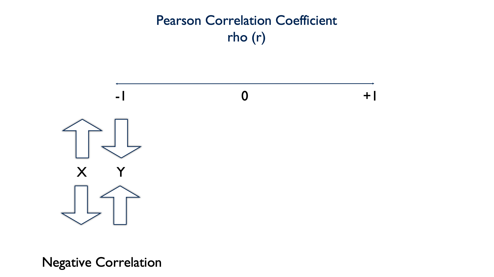
```

A positive value indicates that there is a positive linear correlation between the two variables. As the value of x increases, the value of y increases. Or as the value of x decreases, the value of y decreases.

```{r echo=FALSE}
knitr::include_graphics("img/04_part_descriptive_analysis/cont_cont_06_correlation.png")
```

<p class="warning"> ⚠️**Warning:** When the relationship between two variables is nonlinear, or when outliers are present, the correlation coefficient might incorrectly estimate the strength of the relationship. Plotting the data enables you to verify the linear relationship and to identify the potential outliers.</p>

<!-- show an example -->

### Calculating r

In this first code chunk, we’re going to use some simple simulated data to develop an intuition about describing the relationship between two continuous variables.

```{r message=FALSE}
# Load the dplyr package
library(dplyr)
# Load the ggplot2 package
library(ggplot2)
```

```{r}
set.seed(123)
df <- tibble(
  id = 1:20,
  x  = sample(x = 0:100, size = 20, replace = TRUE),
  y  = sample(x = 0:100, size = 20, replace = TRUE)
)
df
```

👆 **Here's what we did above:**

* We created a data frame with 3 simulated variables -- id, x, and y.

* We used the `sample()` function to create x and y by sampling a number between 0 and 100 at random, 20 times. 

* The `replace = TRUE` option tells R that the same number can be selected more than once.

* The `set.seed()` function is to ensure that I get the same random numbers every time I run the code chunk. 

There is nothing special about 0 and 100; they are totally arbitrary. But, because all of these values are chosen at random, we have no reason to believe that there should be any relationship between them. Accordingly, we should also expect the Pearson Correlation Coefficient to be 0 (or very close to it).

In order to develop an intuition, let’s first plot this data, and get a feel for what it looks like.

```{r}
ggplot(df, aes(x, y)) +
  geom_point() +
  theme_bw()
```

Above, we've created a nice scatter plot using `ggplot2()`. But, how do we interpret it? Well, each dot corresponds to a person in our data at the point where their x value intersects with their y value. This is made clearer by adding a `geom_text()` layer to our plot. 

```{r}
ggplot(df, aes(x, y)) +
  geom_point() +
  geom_text(aes(label = id), nudge_x = 1.5, nudge_y = 2) +
  theme_bw()
```

👆 **Here's what we did above:**

* We added a `geom_text()` layer to our plot in order to make it clear which person each dot represents. 

* The `nudge_x = 1.5` option moves our text (the id number) to the right 1.5 units. The `nudge_y = 2` option moves our text 2 units up. We did this to make the id number easier to read. If we had not nudged them, they would have been placed directly on top of the points.

For example, person 1 in our simulated data had an x value of 30 and a y value of 71. When you look at the plot above, does it look like person 1's point is approximately at (x = 30, y = 71)? If we want to emphasize the point even further, we can plot a vertical line at x = 30 and a horizontal line at y = 71. Let's do that below.

```{r}
ggplot(df, aes(x, y)) +
  geom_text(aes(label = id), nudge_x = 1.5, nudge_y = 2) +
  geom_vline(xintercept = 30, col = "red", size = 0.25) +
  geom_hline(yintercept = 71, col = "red", size = 0.25) +
  geom_point() +
  theme_bw()
```

As you can see, the dot representing id 1 is at the intersection of these two lines.

So, we know how to read the plot now, but we still don’t really know anything about the _relationship_ between x and y. Remember, we want to be able to characterize x and y as having one of these 5 relationships:

```{r echo=FALSE}
knitr::include_graphics("img/04_part_descriptive_analysis/cont_cont_07_correlation.png")
```

Looking again at our scatter plot, which relationship do you think x and y have? 

```{r}
ggplot(df, aes(x, y)) +
  geom_point() +
  geom_text(aes(label = id), nudge_x = 1.5, nudge_y = 2) +
  geom_point(aes(x, y), tibble(x = 100, y = 80), shape = 1, size = 16, col = "red") +
  geom_point(aes(x, y), tibble(x = 90, y = 8), shape = 1, size = 16, col = "blue") +
  theme_bw()
```

Well, if you look at id 9 above, x is a high number (100) and y is a high number (80). But if you look at id 15, x is a high number (90) and y is a low number (8). In other words, these dots are scattered all over the chart area. There doesn’t appear to be much of a pattern, trend, or relationship. And that’s exactly what we would expect from randomly generated data. 

Now that we know what this data looks like, and we intuitively feel as though x and y are unrelated, it would be nice to quantify our results in some way. And, that is precisely what the Pearson Correlation Coefficient does.

```{r}
cor.test(x = df$x, y = df$y)
```

👆 **Here's what we did above:**

* By default, R's `cor.test()` function gives us a list of information about the relationship between x and y. The very last number in the output (-0.1406703) is the Pearson Correlation Coefficient. 

* The fact that this value is negative (between -1 and 0) tells us that x and y tend to vary in opposite directions.

* The numeric value (0.1406703) tells us something about the strength of the relationship between x and y. In this case, the relationship is not strong -- exactly what we expected. 

  - You will sometimes hear rules of thumb for interpreting the strength of $r$ such as[@Field2013-zo]: 
  
      - ±0.1 = Weak correlation
      
      - ±0.3 = Medium correlation
      
      - ±0.5 = Strong correlation
      
  - Rules of thumb like this are useful as you are learning; however, you want to make sure you don't become overly reliant on them. As you get more experience, you will want to start interpreting effect sizes in the context of your data and the specific research question at hand.

* The p-value (0.5542) tells us that we'd be pretty likely to get the result we got even if there really were no relationship between x and y -- __assuming all other assumptions are satisfied and the sample was collected without bias.__

* Taken together, the weak negative correlation and p-value tell us that there is not much -- if any -- relationship between x and y. Another way to say the same thing is, "x and y are statistically independent."

### Correlation intuition

To further bolster our intuition about these relationships, let’s look at a few positively and negatively correlated variables.

```{r}
# Positively correlated data
tibble(
  x = 1:10,
  y = 100:109,
  r = cor(x, y)
) %>% 
  ggplot() +
    geom_point(aes(x, y)) +
    geom_text(aes(x = 2.5, y = 107.5, label = paste("r = ", r)), col = "blue") +
    theme_classic()
```

Above, we created positively correlated data. In fact, this data is perfectly positively correlated. That is, every time the value of x increases, the value of y increases by a proportional amount. Now, instead of being randomly scattered around the plot area, the dots line up in a perfect, upward-sloping, diagonal line. I also, went ahead and added the correlation coefficient directly to the plot. As you can see, it is exactly 1. This is what you should expect from perfectly positively correlated data.

How about this next data set? Now, every time x decreases by one, y decreases by one. Is this positively or negatively correlated data?

```{r}
df <- tibble(
  x = 1:-8,
  y = 100:91
)
df
```

```{r}
df %>% 
  mutate(r = cor(x, y)) %>% 
  ggplot() +
      geom_point(aes(x, y)) +
      geom_text(aes(x = -6, y = 98, label = paste("r = ", r)), col = "blue") +
      theme_classic()
```

This is still perfectly positively correlated data. The values for x and y are still changing in the same direction proportionately. The fact that the direction is one of decreasing value makes no difference.

One last simulated example here. This time, as x increases by one, y decreases by one. Let’s plot this data and calculate the Pearson Correlation Coefficient.

```{r}
tibble(
  x = 1:10,
  y = 100:91,
  r = cor(x, y)
) %>% 
  ggplot() +
    geom_point(aes(x, y)) +
    geom_text(aes(x = 7.5, y = 98, label = paste("r = ", r)), col = "blue") +
    theme_classic()
```

This is what perfectly negatively correlated data looks like. The dots line up in a perfect, downward-sloping diagonal line, and when we check the value of rho, we see that it is exactly -1.

Of course, as you may have suspected, _in real life things are almost never this cut and dry_. So, let’s investigate the relationship between continuous variables using more realistic data.

In this example I’m using data from a class survey I actually conducted in the past:

```{r}
class <- tibble(
  ht_in = c(70, 63, 62, 67, 67, 58, 64, 69, 65, 68, 63, 68, 69, 66, 67, 65, 
            64, 75, 67, 63, 60, 67, 64, 73, 62, 69, 67, 62, 68, 66, 66, 62, 
            64, 68, NA, 68, 70, 68, 68, 66, 71, 61, 62, 64, 64, 63, 67, 66, 
            69, 76, NA, 63, 64, 65, 65, 71, 66, 65, 65, 71, 64, 71, 60, 62, 
            61, 69, 66, NA),
  wt_lbs = c(216, 106, 145, 195, 143, 125, 138, 140, 158, 167, 145, 297, 146, 
             125, 111, 125, 130, 182, 170, 121, 98, 150, 132, 250, 137, 124, 
             186, 148, 134, 155, 122, 142, 110, 132, 188, 176, 188, 166, 136, 
             147, 178, 125, 102, 140, 139, 60, 147, 147, 141, 232, 186, 212, 
             110, 110, 115, 154, 140, 150, 130, NA, 171, 156, 92, 122, 102, 
             163, 141, NA)
)
```

Next, I’m going to use a scatter plot to explore the relationship between height and weight in this data.

```{r}
ggplot(class, aes(ht_in, wt_lbs)) +
  geom_jitter() +
  theme_classic()
```

Quickly, what do you think? Will height and weight be positively correlated, negatively correlated, or not correlated?

```{r}
cor.test(class$ht_in, class$wt_lbs)
```

The dots don’t line up in a perfectly upward – or downward – slope. But the general trend is still an upward slope. Additionally, we can see that height and weight are positively correlated because the value of the correlation coefficient is between 0 and positive 1 (0.5890576). By looking at the p-value (3.051e-07), we can also see that the probability of finding a correlation value this large or larger in our sample if the true value of the correlation coefficient in the population from which our sample was drawn is zero, is very small.

That’s quite a mouthful, right? In more relatable terms, you can just think of it this way. In our data, as height increases weight tends to increase as well. Our p-value indicates that it’s pretty unlikely that we would get this result if there were truly no relationship in the population this sample was drawn from -- assuming it's an unbiased sample.

_Quick detour_: The p-value above is written in scientific notation, which you may not have seen before. I'll quickly show you how to basically disable scientific notation in R.

```{r}
options(scipen = 999)
cor.test(class$ht_in, class$wt_lbs)
```

👆 **Here's what we did above:**

* We used the R global option `options(scipen = 999)` to display decimal numbers instead of scientific notation. Because this is a global option, it will remain in effect until you restart your R session. If you do restart your R session, you will have to run `options(scipen = 999)` again to disable scientific notation.

Finally, wouldn’t it be nice if we could draw a line through this graph that sort of quickly summarizes this relationship (or lack thereof). Well, that is exactly what an Ordinary Least Squares (OLS) regression line does.

To add a regression line to our plot, all we need to do is add a `geom_smooth()` layer to our scatterplot with the `method` argument set to `lm`. Let’s do that below and take a look.

```{r}
ggplot(class, aes(ht_in, wt_lbs)) +
  geom_smooth(method = "lm") +
  geom_jitter() +
  theme_classic()
```

The exact calculation for deriving this line is beyond the scope of this chapter. In general, though, you can think of the line as cutting through the middle of all of your points and representing the average change in the y value given a one-unit change in the x value. So here, the upward slope indicates that, on average, as height (the x value) increases, so does weight (the y value). And that is completely consistent with our previous conclusions about the relationship between height and weight.

<!--chapter:end:chapters/04_part_descriptive_analysis/07_cont_out_cont_pred.Rmd-->

# Describing the relationship between a continuous outcome and a categorical predictor

Up until now, we have only ever looked at the overall mean of a continuous variable. For example, the mean height for the entire class. However, we often want to estimate the means within levels, or categories, of another variable. For example, we may want to look at the mean height within gender. Said another way, we want to know the mean height for men and separately the mean height for women.

More generally, in this lesson you will learn to perform bivariate analysis when the outcome is continuous and the predictor is categorical.

```{r echo=FALSE}
knitr::include_graphics("img/04_part_descriptive_analysis/cont_cat_01.png")
```

Typically in a situation such as this, all we need to do is apply the analytic methods we’ve already learned for a single continuous outcome, but apply them separately within levels of our categorical predictor variable. Below, we'll walk through doing so with R. To start with, we will again use our previously collected class survey data.

```{r message=FALSE}
library(dplyr)
library(ggplot2)
```

```{r}
class <- tibble(
  age       = c(32, 30, 32, 29, 24, 38, 25, 24, 48, 29, 22, 29, 24, 28, 24, 25, 
                25, 22, 25, 24, 25, 24, 23, 24, 31, 24, 29, 24, 22, 23, 26, 23, 
                24, 25, 24, 33, 27, 25, 26, 26, 26, 26, 26, 27, 24, 43, 25, 24, 
                27, 28, 29, 24, 26, 28, 25, 24, 26, 24, 26, 31, 24, 26, 31, 34, 
                26, 25, 27, NA),
  age_group = c(2, 2, 2, 1, 1, 2, 1, 1, 2, 1, 1, 1, 1, 1, 1, 1, 1, 1, 1, 1, 1, 
                1, 1, 1, 2, 1, 1, 1, 1, 1, 1, 1, 1, 1, 1, 2, 1, 1, 1, 1, 1, 1, 
                1, 1, 1, 2, 1, 1, 1, 1, 1, 1, 1, 1, 1, 1, 1, 1, 1, 2, 1, 1, 2, 
                2, 1, 1, 1, NA),
  gender    = c(2, 1, 1, 2, 1, 1, 1, 2, 2, 2, 1, 1, 2, 1, 1, 1, 1, 2, 2, 1, 1, 
                1, 1, 2, 1, 1, 2, 1, 1, 1, 2, 1, 1, 2, 2, 1, 2, 2, 1, 2, 2, 1, 
                1, 1, 1, 1, 1, 1, 1, 2, 2, 1, 1, 1, 1, 2, 2, 1, 1, 2, 1, 2, 1, 
                1, 1, 2, 1, NA),
  ht_in     = c(70, 63, 62, 67, 67, 58, 64, 69, 65, 68, 63, 68, 69, 66, 67, 65, 
                64, 75, 67, 63, 60, 67, 64, 73, 62, 69, 67, 62, 68, 66, 66, 62, 
                64, 68, NA, 68, 70, 68, 68, 66, 71, 61, 62, 64, 64, 63, 67, 66, 
                69, 76, NA, 63, 64, 65, 65, 71, 66, 65, 65, 71, 64, 71, 60, 62, 
                61, 69, 66, NA),
  wt_lbs    = c(216, 106, 145, 195, 143, 125, 138, 140, 158, 167, 145, 297, 146, 
                125, 111, 125, 130, 182, 170, 121, 98, 150, 132, 250, 137, 124, 
                186, 148, 134, 155, 122, 142, 110, 132, 188, 176, 188, 166, 136, 
                147, 178, 125, 102, 140, 139, 60, 147, 147, 141, 232, 186, 212, 
                110, 110, 115, 154, 140, 150, 130, NA, 171, 156, 92, 122, 102, 
                163, 141, NA),
  bmi       = c(30.99, 18.78, 26.52, 30.54, 22.39, 26.12, 23.69, 20.67, 26.29, 
                25.39, 25.68, 45.15, 21.56, 20.17, 17.38, 20.8, 22.31, 22.75, 
                26.62, 21.43, 19.14, 23.49, 22.66, 32.98, 25.05, 18.31, 29.13, 
                27.07, 20.37, 25.01, 19.69, 25.97, 18.88, 20.07, NA, 26.76, 
                26.97, 25.24, 20.68, 23.72, 24.82, 23.62, 18.65, 24.03, 23.86, 
                10.63, 23.02, 23.72, 20.82, 28.24, NA, 37.55, 18.88, 18.3, 
                19.13, 21.48, 22.59, 24.96, 21.63, NA, 29.35, 21.76, 17.97, 
                22.31, 19.27, 24.07, 22.76, NA),
  bmi_3cat  = c(3, 1, 2, 3, 1, 2, 1, 1, 2, 2, 2, 3, 1, 1, 1, 1, 1, 1, 2, 1, 1, 
                1, 1, 3, 2, 1, 2, 2, 1, 2, 1, 2, 1, 1, NA, 2, 2, 2, 1, 1, 1, 1, 
                1, 1, 1, 1, 1, 1, 1, 2, NA, 3, 1, 1, 1, 1, 1, 1, 1, NA, 2, 1, 
                1, 1, 1, 1, 1, NA)
) %>% 
  mutate(
    age_group = factor(age_group, labels = c("Younger than 30", "30 and Older")),
    gender = factor(gender, labels = c("Female", "Male")),
    bmi_3cat = factor(bmi_3cat, labels = c("Normal", "Overweight", "Obese"))
  ) %>% 
  print()
```

## Single predictor and single outcome

We can describe our continuous outcome variables using the same methods we learned in previous lessons. However, this time we will use `dplyr's` `group_by()` function to calculate these statistics within subgroups of interests. For example:

```{r message=FALSE}
class_summary <- class %>% 
  filter(!is.na(ht_in)) %>% 
  group_by(gender) %>% 
  summarise(
    n                    = n(),
    mean                 = mean(ht_in),
    `standard deviation` = sd(ht_in),
    min                  = min(ht_in),
    max                  = max(ht_in)
  ) %>% 
  print()
```

👆 **Here's what we did above:**

* We used base R's statistical functions inside `dplyr's` `summarise()` function to calculate the number of observations, mean, standard deviation, minimum value and maximum value of height within levels of gender.

* We used `filter(!is.na(ht_in))` to remove all rows from the data that have a missing value for "ht_in". If we had not done so, R would have returned a value of "NA" for mean, standard deviation, min, and max. Alternatively, we could have added the `na.rm = TRUE` option to each of the `mean()`, `sd()`, `min()`, and `max()` functions. 

* We used `group_by(gender)` to calculate our statistics of interest separately within each category of the variable "gender." In this case, "Female" and "Male." 

* You may notice that I used backticks around the variable name "standard deviation" -- NOT single quotes. If you want to include a space in a variable name in R, you must surround it with backticks. In general, it's a **really** bad idea to create variable names with spaces in them. I recommend only doing so in situations where you are using a data frame to display summary information, as we did above.

* Notice too that I saved our summary statistics table as data frame named "class_summary." Doing so is sometimes useful, especially for plotting as we will see below.

As you look over this table, you should have an idea of whether male or female students in the class appear to be taller on average, and whether male or female students in the class appear to have more dispersion around the mean value.

Finally, let's plot this data to get a feel for the relationship between gender and height graphically.

```{r}
class %>% 
  filter(!is.na(ht_in)) %>% 
  ggplot(aes(x = gender, y = ht_in)) +
    geom_jitter(aes(col = gender), width = 0.20) +
    geom_segment(
      aes(x = c(0.75, 1.75), y = mean, xend = c(1.25, 2.25), yend = mean, col = gender), 
      size = 1.5, data = class_summary
    ) +
    scale_x_discrete("Gender") +
    scale_y_continuous("Height (Inches)") +
    scale_color_manual(values = c("#BC581A", "#00519B")) +
    theme_classic() +
    theme(legend.position = "none", axis.text.x = element_text(size = 12))
```

👆 **Here's what we did above:** 

* We used `ggplot2` to plot each student's height as well as the mean heights of female and male students respectively.

* The `geom_jitter()` function plots a point for each student's height, and then makes slight random adjustments to the location of the points so that they are less likely to overlap. One of the great things about plotting our data like this is that we can quickly see if there are many more observations in one category than another. That information would be obscured if we were to use a box plot.

* The `geom_segment()` function creates the two horizontal lines at the mean values of height. Notice we used a different data frame -- class_summary -- using the `data = class_summary` argument to plot the mean values.

* We changed the x and y axis titles using the `scale_x_discrete()` and `scale_y_continuous()` functions.

* We changed the default ggplot colors to orange and blue (Go Gators! 🐊) using the `scale_color_manual()` function.

* We simplified the plot using the `theme_classic()` function.

* `theme(legend.position = "none", axis.text.x = element_text(size = 12))` removed the legend and increased the size of the x-axis labels a little bit.

After checking both numerical and graphical descriptions of the relationship between gender and height we may conclude that male students were taller, on average, than female students.

## Multiple predictors

At times we may be interested in comparing continuous outcomes across levels of two or more categorical variables. As an example, perhaps we want to describe BMI by gender _and_ age group. All we have to do is add age group to the `group_by()` function. 

```{r message=FALSE}
class_summary <- class %>% 
  filter(!is.na(bmi)) %>% 
  group_by(gender, age_group) %>% 
  summarise(
    n                    = n(),
    mean                 = mean(bmi),
    `standard deviation` = sd(bmi),
    min                  = min(bmi),
    max                  = max(bmi)
  ) %>% 
  print()
```

And we can see these statistics for BMI within levels of gender separately for younger and older students. Males that are 30 and older report, on average, the highest BMI (28.6). Females age 30 and older report, on average, the lowest BMI (21.8). This is good information, but often when comparing groups a picture really is worth a thousand words. Let's wrap up this chapter with one final plot.

```{r}
class %>% 
  filter(!is.na(bmi)) %>% 
  ggplot(aes(x = age_group, y = bmi)) +
    facet_wrap(vars(gender)) +
    geom_jitter(aes(col = age_group), width = 0.20) +
    geom_segment(
      aes(x = rep(c(0.75, 1.75), 2), y = mean, xend = rep(c(1.25, 2.25), 2), yend = mean, 
          col = age_group),
      size = 1.5, data = class_summary
    ) +
    scale_x_discrete("Age Group") +
    scale_y_continuous("BMI") +
    scale_color_manual(values = c("#BC581A", "#00519B")) +
    theme_classic() +
    theme(legend.position = "none", axis.text.x = element_text(size = 10))
```

👆 **Here's what we did above:** 

* We used the same code for this plot that we used for the first height by gender plot. The only difference is that we added `facet_wrap(vars(gender))` to plot males and females on separate plot panels. 

<!--chapter:end:chapters/04_part_descriptive_analysis/08_cont_out_cat_pred.Rmd-->

# Describing the relationship between a categorical outcome and a categorical predictor

Generally speaking, there is no good way to describe the relationship between a continuous predictor and a categorical outcome. 

```{r echo=FALSE}
knitr::include_graphics("img/04_part_descriptive_analysis/cat_cat_01.png")
```

So, when your outcome is categorical, the predictor must also be categorical. Therefore, any continuous predictor variables must be collapsed into categories before conducting bivariate analysis when your outcome is categorical. The best categories are those that have scientific or clinical meaning. For example, collapsing raw scores on a test of cognitive function into a categorical variable for cognitive impairment. The variable could be dichotomous (yes, no) or it could have multiple levels (no, mild cognitive impairment, dementia).

```{r echo=FALSE}
knitr::include_graphics("img/04_part_descriptive_analysis/cat_cat_02_categorizing.png")
```

Once your continuous variables are collapsed you’re ready to create **n-way frequency tables** that will allow you to describe the relationship between two or more categorical variables. To start with, we will once again use our previously collected class survey data.

```{r message=FALSE}
library(dplyr)
library(ggplot2)
```

```{r}
class <- tibble(
  age       = c(32, 30, 32, 29, 24, 38, 25, 24, 48, 29, 22, 29, 24, 28, 24, 25, 
                25, 22, 25, 24, 25, 24, 23, 24, 31, 24, 29, 24, 22, 23, 26, 23, 
                24, 25, 24, 33, 27, 25, 26, 26, 26, 26, 26, 27, 24, 43, 25, 24, 
                27, 28, 29, 24, 26, 28, 25, 24, 26, 24, 26, 31, 24, 26, 31, 34, 
                26, 25, 27, NA),
  age_group = c(2, 2, 2, 1, 1, 2, 1, 1, 2, 1, 1, 1, 1, 1, 1, 1, 1, 1, 1, 1, 1, 
                1, 1, 1, 2, 1, 1, 1, 1, 1, 1, 1, 1, 1, 1, 2, 1, 1, 1, 1, 1, 1, 
                1, 1, 1, 2, 1, 1, 1, 1, 1, 1, 1, 1, 1, 1, 1, 1, 1, 2, 1, 1, 2, 
                2, 1, 1, 1, NA),
  gender    = c(2, 1, 1, 2, 1, 1, 1, 2, 2, 2, 1, 1, 2, 1, 1, 1, 1, 2, 2, 1, 1, 
                1, 1, 2, 1, 1, 2, 1, 1, 1, 2, 1, 1, 2, 2, 1, 2, 2, 1, 2, 2, 1, 
                1, 1, 1, 1, 1, 1, 1, 2, 2, 1, 1, 1, 1, 2, 2, 1, 1, 2, 1, 2, 1, 
                1, 1, 2, 1, NA),
  ht_in     = c(70, 63, 62, 67, 67, 58, 64, 69, 65, 68, 63, 68, 69, 66, 67, 65, 
                64, 75, 67, 63, 60, 67, 64, 73, 62, 69, 67, 62, 68, 66, 66, 62, 
                64, 68, NA, 68, 70, 68, 68, 66, 71, 61, 62, 64, 64, 63, 67, 66, 
                69, 76, NA, 63, 64, 65, 65, 71, 66, 65, 65, 71, 64, 71, 60, 62, 
                61, 69, 66, NA),
  wt_lbs    = c(216, 106, 145, 195, 143, 125, 138, 140, 158, 167, 145, 297, 146, 
                125, 111, 125, 130, 182, 170, 121, 98, 150, 132, 250, 137, 124, 
                186, 148, 134, 155, 122, 142, 110, 132, 188, 176, 188, 166, 136, 
                147, 178, 125, 102, 140, 139, 60, 147, 147, 141, 232, 186, 212, 
                110, 110, 115, 154, 140, 150, 130, NA, 171, 156, 92, 122, 102, 
                163, 141, NA),
  bmi       = c(30.99, 18.78, 26.52, 30.54, 22.39, 26.12, 23.69, 20.67, 26.29, 
                25.39, 25.68, 45.15, 21.56, 20.17, 17.38, 20.8, 22.31, 22.75, 
                26.62, 21.43, 19.14, 23.49, 22.66, 32.98, 25.05, 18.31, 29.13, 
                27.07, 20.37, 25.01, 19.69, 25.97, 18.88, 20.07, NA, 26.76, 
                26.97, 25.24, 20.68, 23.72, 24.82, 23.62, 18.65, 24.03, 23.86, 
                10.63, 23.02, 23.72, 20.82, 28.24, NA, 37.55, 18.88, 18.3, 
                19.13, 21.48, 22.59, 24.96, 21.63, NA, 29.35, 21.76, 17.97, 
                22.31, 19.27, 24.07, 22.76, NA),
  bmi_3cat  = c(3, 1, 2, 3, 1, 2, 1, 1, 2, 2, 2, 3, 1, 1, 1, 1, 1, 1, 2, 1, 1, 
                1, 1, 3, 2, 1, 2, 2, 1, 2, 1, 2, 1, 1, NA, 2, 2, 2, 1, 1, 1, 1, 
                1, 1, 1, 1, 1, 1, 1, 2, NA, 3, 1, 1, 1, 1, 1, 1, 1, NA, 2, 1, 
                1, 1, 1, 1, 1, NA),
  genhlth   = c(2, 2, 3, 3, 2, 1, 2, 2, 2, 1, 3, 3, 1, 2, 2, 1, 2, NA, 3, 2, 3, 
                1, 2, 2, 2, 4, 2, 2, 2, 2, 1, 2, 2, 1, 2, 2, 3, 3, 2, 1, 3, 3, 
                2, 2, 3, 3, 2, 3, 2, 2, 3, 5, 3, 2, 3, 2, 3, 3, 2, 2, 3, 3, 3, 
                1, 2, 2, 1, 3),
  persdoc   = c(1, 2, 2, 1, 2, 0, 0, 1, 2, 0, 2, 0, 1, 1, 1, 1, 1, 1, 1, 1, 0, 
                0, 1, 1, 1, 1, 2, 0, 0, 1, 1, 2, 1, 2, 0, 0, 2, 0, 0, 2, 2, 0, 
                NA, 0, 0, 0, 2, 0, 2, NA, 0, 2, 1, 1, 1, 2, 2, 0, 0, 0, 1, 2, 
                1, 1, 0, 0, 0, NA)
) %>% 
  mutate(
    age_group = factor(age_group, labels = c("Younger than 30", "30 and Older")),
    gender    = factor(gender, labels = c("Female", "Male")),
    bmi_3cat  = factor(bmi_3cat, labels = c("Normal", "Overweight", "Obese")),
    genhlth   = factor(genhlth, labels = c("Excellent", "Very Good", "Good", "Fair", "Poor")),
    persdoc    = factor(persdoc, labels = c("No", "Yes, only one", "Yes, more than one"))
  ) %>% 
  print()
```

## Comparing two variables

We’ve already used R to create one-way descriptive tables for categorical variables. One-way frequency tables can be interesting in their own right; however, most of the time we are interested in the relationships between two variables. For example, think about when we looked at mean height within levels of gender. This told us something about the relationship between height and gender. While far from definite, our little survey provides some evidence that women, on average, are shorter than men. 

Well, we can describe the relationship between two categorical variables as well. One way of doing so is with **two-way frequency tables**, which are also sometimes referred to as **crosstabs** or **contingency tables**. Let’s start by simply looking at an example. 

Below we use the same `CrossTable()` function that we used in the lesson on univariate analysis of categorical data. The only difference is that we pass two vectors to the function instead of one. The first variable will always form the rows, and the second variable will always form the columns. In other words, we can say that we are creating a two-way table of persdoc by genhealth.

```{r}
df <- filter(class, !is.na(bmi_3cat)) # Drop rows with missing bmi
gmodels::CrossTable(df$persdoc, df$genhlth)
```

Ok, let’s walk through this output together...

```{r echo=FALSE}
knitr::include_graphics("img/04_part_descriptive_analysis/cat_cat_03_crosstable.png")
```

Think of little box labeled "Cell Contents" as a legend that tells you how to interpret the rest of the boxes. Reading from top to bottom, the first number you encounter in a box will be the frequency or count of observations (labeled `N`). The second number you encounter will be the chi-square contribution. Please ignore that number for now. The third number will be the row proportion. The fourth number will be the column proportion. And the fifth number will be the overall proportion. 

```{r echo=FALSE}
knitr::include_graphics("img/04_part_descriptive_analysis/cat_cat_04_crosstable.png")
```

Reading the table of summary statistics from top to bottom, the row headers describe categories of persdoc, which are `one`, `only one`, and `more than one`. 

```{r echo=FALSE}
knitr::include_graphics("img/04_part_descriptive_analysis/cat_cat_05_crosstable.png")
```

Reading from left to right, the column headers describe categories of genhealth, which are `excellent`, `very good`, `good`, `fair`, and `poor`.

```{r echo=FALSE}
knitr::include_graphics("img/04_part_descriptive_analysis/cat_cat_06_crosstable.png")
```

The bottom row gives the total frequency and proportion of observations that fall in each of the categories defined by the columns. For example, 10 students -- about 0.164 of the entire class -- reported being in excellent general health.

```{r echo=FALSE}
knitr::include_graphics("img/04_part_descriptive_analysis/cat_cat_07_crosstable.png")
```

The far-right column gives the total frequency and proportion of observations that fall in each of the categories defined by the rows. For example, 23 students -- about 0.377 of the entire class -- reported that they have exactly one person that they think of as their personal doctor or healthcare provider. 

```{r echo=FALSE}
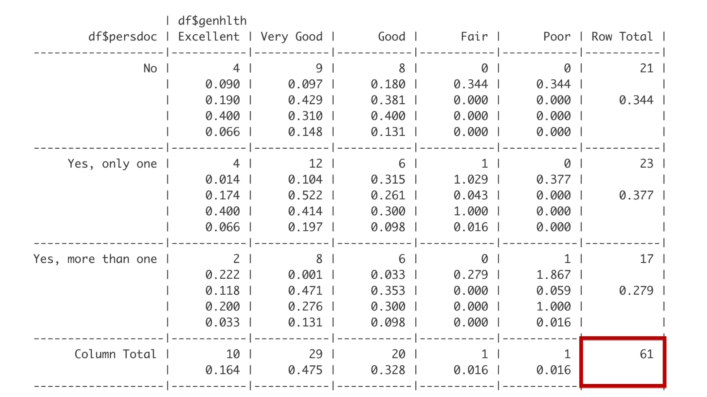
```

And the bottom right corner gives the overall total frequency of observations in the table. Together, the last row, the far-right column, and the bottom right cell make up what are called the **marginal totals** because they are on the outer margin of the table. 

Next, let’s interpret the data contained in the first cell with data. 

```{r echo=FALSE}
knitr::include_graphics("img/04_part_descriptive_analysis/cat_cat_09_crosstable.png")
```

The first number is the frequency. There are 4 students that do not have a personal doctor _and_ report being in excellent health. 
```{r echo=FALSE}
knitr::include_graphics("img/04_part_descriptive_analysis/cat_cat_10_crosstable.png")
```

The third number is the row proportion. The row this cell is in is the `No` row, which includes 21 students. Out of the 21 total students in the `No` row, 4 reported being in excellent health. 4 divided by 21 is 0.190. Said another way, 19% of students with no personal doctor reported being in excellent health.

```{r echo=FALSE}
knitr::include_graphics("img/04_part_descriptive_analysis/cat_cat_11_crosstable.png")
```

The fourth number is the column proportion. This cell is in the `Excellent` column. Of the 10 students in the `Excellent` column, 4 reported that they do not have a personal doctor. 4 out of 10 is 0.4. Said another way, 40% of students who report being in excellent health have no personal doctor.

```{r echo=FALSE}
knitr::include_graphics("img/04_part_descriptive_analysis/cat_cat_12_crosstable.png")
```

The last number is the overall proportion. So, 4 out of the 61 total students in this analysis have no personal doctor _and_ report being in excellent health. Four out of 61 is 0.066. So, about 7% of **all** the students in the class have no personal doctor _and_ are in excellent health. 

Now that you know how to read the table, I want to point out a couple subtleties that may not have jumped out at you above. 

1. **The changing denominator.** As we moved from the row proportion to the column proportion and then the overall proportion, all that changed was the denominator (the blue circle). And each time we did so we were describing the characteristics of a different group of people: (1) students without a personal doctor, (2) students in excellent general health, (3) all students -- regardless of personal doctor or general health.

2. **Language matters.** Because we are actually describing the characteristics of different subgroups, the language we use to interpret our results is important. For example, when I interpreted the row proportion above I wrote, "19% of students with no personal doctor reported being in excellent health." This language implies that I'm describing the health (characteristic) of students with no personal doctor (subgroup). It would be completely incorrect to instead say, "19% of students in excellent health have no personal doctor" or "19% of students have no personal doctor." Those are interpretations of the column percent and overall percent respectively. They are not interchangeable.

<!--chapter:end:chapters/04_part_descriptive_analysis/09_cat_out_cat_pred.Rmd-->

# (PART) Data Management {-}

<!-- This Rmd just creates a part heading in the table of contents -->

<!--chapter:end:chapters/05_part_data_management/00_part_data_management.Rmd-->

# Introduction to data management

Way back in the [Getting Started](#managing-data) chapter, I told you that managing data includes all the things you may have to do to your data to get it ready for analysis. I also talked about the 80/20 "rule." The basic idea of the 80/20 rule is that data management is where you will spend the majority of your time and effort when you are involved in just about any project that makes use of data. Unfortunately, I can't cover strategies for overcoming every single data management challenge that you will encounter in epidemiology. However, in this part of the book, I will try to give you a foundation in some of the most common data management tasks that you will encounter. I will also try to point you towards some of the best tools and resources for data management that the R community has to offer.

## Multiple paradigms for data management in R

Before moving on to providing you with examples of how to accomplish specific data management tasks, I think this is the right point in the book to touch on a couple of high-level concepts that we have more or less ignored thus far.

R is pretty unique among the major statistical programming applications used in epidemiology in many ways. Among them is that R has multiple paradigms for data management. That's what I'm calling them anyway. What I mean by that is that there are 3 primary packages that the vast majority of R users use for data management. They are  base R, `data.table`, and `dplyr`. There is a tremendous amount of overlap in the data management tasks you can perform with base R, `data.table`, and `dplyr`, but the syntax for each is very different. As are the relative strengths and weaknesses.

In this book, we will primarily use the `dplyr` paradigm for data management. We will do so because I believe in using the best tool to get the job done. Currently, I believe that the best tool for managing data in R is usually `dplyr`, and especially when you are new to R. However, there will be cases where I will show you how to use base R to accomplish a task. Where I do this, it's because I think that base R is the best tool for the job or because I think you are very likely to see base R way used when you go looking for help with a related data management challenge and I don't want you to be totally clueless about what you're looking at. 

As of this writing, I've decided not to specifically discuss using the `data.table` package for data management. I think the `data.table` package is a great package, and I use it when I think it's the best tool for the job. However, I think the confusion caused by introducing `data.table` in this text aimed primarily at inexperienced R users would cause more problems than it would solve. The last thing I'll say about `data.table` for now is that you may want to consider learning more about `data.table` if you routinely work with very large data sets (e.g., millions of rows). For reasons that are beyond the scope of this book, `data.table` is currently much faster than `dplyr`. However, for most of the work I do, and all of what we will do in this book, the time difference will be imperceptible to you. Literally milliseconds.

## The dplyr package

At this point in the book, you've already been exposed to several of the most important functions in the `dplyr` package. You saw the `filter()` function in the [Speaking R's language](#packages) chapter, the `mutate()` function in the [chapter on exporting data](#coerce-a-numeric-variable), and the `summarise()` function all over the descriptive analysis part of the book. However, I mostly glossed over the details at those points. In this section, I want to dive just a tiny bit deeper into how the `dplyr` functions work -- but not too deep.

### The dplyr verbs

The `dplyr` package includes five main functions for managing data: `mutate()`, `select()`, `filter()`, `arrange()`, and `summarise()`. [These five functions are often referred to as the dplyr verbs](https://dplyr.tidyverse.org/). And, the first two arguments to all five of these functions are `.data` and `...`. Let's go ahead and discuss those two arguments a little bit more.

<p class="note"> 🗒**Side Note:** I don't want to give you the impression that `dplyr` only contains 5 functions. In fact, `dplyr` contains many functions, and they are all designed to work together in a very intentional way.</p>

### The .data argument

I first introduced you to data frames in the [Let's get programming](#data-frames) chapter and we've been using them as our primary structure for storing and analyzing data in ever since. The R language allows for other data structures (e.g., vectors, lists, and matrices), but data frames are the most commonly used data structure for most of the kinds of things we do in epidemiology. Thankfully, the `dplyr` package is designed specifically to help people like you and I manage data stored in _data frames_. Therefore, `dplyr` verbs always receive a data frame as an input and return a data frame as an output. Specifically, the value passed to the `.data` argument must always be a data frame, and you will get an error if you attempt to pass any other data structure to the `.data` argument. For example:

```{r}
# No problem
df <- tibble(
  id = c(1, 2, 3),
  x  = c(0, 1, 0)
)

df %>% 
  filter(x == 0)
```

```{r error=TRUE}
# Problem
l <- list(
  id = c(1, 2, 3),
  x  = c(0, 1, 0)
) 

l %>% 
  filter(x == 0)
```

### The ... argument

The second value passed to all of the `dplyr` verbs is the `...` argument. If you are new to R, this probably seems like a really weird argument. And, it kind of is! But, it's also really useful. The `...` argument (pronounced "dot dot dot") has special meaning in the R language. This is true for all functions that use the `...` argument -- not just `dplyr` verbs. The `...` argument can be used to pass multiple arguments to a function without knowing exactly what those arguments will look like ahead of time -- including entire expressions. For example:

```{r}
df %>% 
  filter(x == 0)
```

Above we passed a data frame to the `.data` argument of the `filter()` function. The second value we passed to the `filter()` function was `x == 1`. Think about it, `x` is an object (i.e. a column in the data frame), `==` is a function (remember that operators are functions in R), and `0` is a value. Together, they form an expression (`x == 0`) that tells R to perform a relatively complex operation -- compare every value of `x` to the value `0` and tell me if they are the same. If you are new to programming, this may not seem like any big deal, but it's really handy to be able to pass that much information to a single argument of a single function. 

If this is all really confusing to you, don't get too hung up on it right now. The `...` argument is an important component of the R language, but it isn't important that you fully understand it in order to use R. If nothing else, just know that that the `...` is the second argument to all the `dplyr` verbs, and it is generally where you will tell R what you want to _do_ to the columns of your data frame (i.e., keep them, drop them, create them, sort them, etc.).

### Non-standard evaluation

A final little peculiarity about the `tidyverse` packages -- `dplyr` being one of them -- that I want to discuss in this chapter is something called  **non-standard evaluation**. _How_ non-standard evaluation works really isn't that important for us. If I'm being honest, I don't even fully understand how it works "under the hood." But, it is one of the big advantages of using `dplyr`, and therefore worth mentioning. Do you remember the [section in the Let's get programming chapter on common errors](#some-common-errors)? In that section I wrote about how a vector that lives in the global environment is a different thing to R than a vector that lives as a column in a data frame in the global environment. So, `weight` and `class$weight` are different things, and if you want to access the weight values in `class$weight` then you have to make sure and write the whole thing out. But, have you noticed that we don't have to do that in `dplyr` verbs? For example:

```{r}
df %>% 
  filter(df$x == 0)
```

In the example above we wrote out the column name using dollar sign notation. But, we don't _have_ to:

```{r}
df %>% 
  filter(x == 0)
```

When we don't tell a `dplyr` verb exactly which data frame a column lives in, then the `dplyr` verb will assume it lives in the data frame that is passed to the `.data` argument. This is really handy for at least two reasons:

* It reduces the amount of typing we have to do when we write our code. 👏

* It makes it easier to glance at our code and see what it's doing. Without all the data frame names and dollar signs strewn about our code, it's much easier to see what the code is actually doing. 

Overall, non-standard evaluation is a great thing -- at least in my opinion. However, it will present some challenges that we will have to overcome if we plan to use `dplyr` verbs inside of functions and loops. Don't worry, we'll come back to this topic later in the book.

Now that you (hopefully) have a better general understanding of the `dplyr` verbs, let's go take a look at how to use them for data management.

<!--chapter:end:chapters/05_part_data_management/01_introduction.Rmd-->

# Creating and modifying columns

<!--
Dollar sign notation
Bracket notation
mutate

I start with dollar sign and bracket because they were exposed to those before 
mutate already in the book.
-->

Two of the most fundamental data management tasks are to create new columns in your data frame and to modify existing columns in your data frame. In fact, we've already talked about creating and modifying columns at a few different places in the book. 

In this book, we are actually going to learn 4 different methods for creating and modifying columns of a data frame. They are:

1. Using name-value pairs to add columns to a data frame during its initial creation. This was one of the first methods we used in this book for creating columns in a data frame. However, this method does not apply to creating or modifying columns in _a data frame that already exists_. Therefore, we won't discuss it much in this chapter.

2. Dollar sign notation. This is probably the most commonly used base R way of creating and modifying columns in a data frame. In this book, we won't use it as much as we use `dplyr::mutate()`, but you will see it all over the place in the R community.

3. Bracket notation. Again, we won't use bracket notation very often in this book. However, we will use it later on when we learn about [for loops](#for-loops). Therefore, I'm going to introduce you to using bracket notation to create and modify data frame columns now.

4. The `mutate()` function from the `dplyr` package. This is the method that I will use the vast majority of the time in this book (and in my real-life projects). I'm going to recommend that you do the same.

## Creating data frames

Very early on, in the [Let's get programming](#lets-get-programming) chapter, we learned how to create data frame columns using name-value pairs passed directly into the `tibble()` function.

```{r}
class <- tibble(
  names   = c("John", "Sally", "Brad", "Anne"),
  heights = c(68, 63, 71, 72)
)
class
```

This is an absolutely fundamental R programming skill, and one that you will likely use often. However, most people would not consider this to be a "data management" task, which is the focus of this part of the book. Further, we've really already covered all we need to cover about creating columns this way. So, I'm not going to write anything further about this method.

## Dollar sign notation

Later in the [Let's get programming](#lets-get-programming) chapter, we learned about **dollar sign notation**. At that time, we used dollar sign notation to access or "get" values from a column.

```{r}
class$heights
```

However, we can also use dollar sign notation to create and/or modify columns in our data frame. For example:

```{r}
class$heights <- class$heights / 12
class
```

👆**Here's what we did above:**

* We modified the values in the `heights` column of our `class` data frame using dollar sign notation. More specifically, we converted the values in the `heights` column from inches to feet. We did this by telling R to "get" the values for the `heights` column and divide them by 12 (`class$heights / 12`) and then assign those new values back to the `heights` column (`class$heights <-`). In this case, that has the effect of modifying the values of a column that already exists.

<p class="note"> 🗒**Side Note:** I would actually suggest that you don't typically do what I just did above in a real-world analysis. It's typically safer to create a new variable with the modified values (e.g. `height_feet`) and leave the original values in the original variable as-is.</p>

We can also create a _new_ variable in our data frame in a similar way. All we have to do is use a valid column name (that doesn't already exist in the data frame) on the left side of our assignment arrow. For example:

```{r}
class$grades <- c(89, 92, 86, 98)
class
```
👆**Here's what we did above:**

* We created a new column in our `class` data frame using dollar sign notation. We assigned the values 89, 92, 86, and 98 to that column with the assignment arrow.

## Bracket notation

We also learned how to access or "get" values from a column using bracket notation in the [Let's get programming](#lets-get-programming) chapter. There, we actually used a combination of dollar sign and bracket notation to access single individual values from a data frame column. For example:

```{r}
class$heights[3]
```

But, we can also use bracket notation to access or "get" the entire column. For example:

```{r}
class[["heights"]]
```

👆**Here's what we did above:**

* We used bracket notation to get all of the values from the `heights` column of the `class` data frame.

I'd like you to notice a couple of things about the example above. First, notice that this is the exact same result we got from (`class$heights`). Well, technically, the heights are now in feet instead of inches, but you know what I mean. R returned a numeric vector containing the values from the `heights` column to us. Second, notice that we used double brackets (i.e., two brackets on each side of the column name), and that the column name is wrapped in quotation marks. Both are required to get this result. 

Similar to dollar sign notation, we can also create and/or modify columns in our data frame using bracket notation. For example, let's convert those heights back to inches using bracket notation:

```{r}
class[["heights"]] <- class[["heights"]] * 12
class
```

And, let's go ahead and add one more variable to our data frame using bracket notation.

```{r}
class[["rank"]] <- c(3, 2, 4, 1)
class
```

Somewhat confusingly, we can also access, create, and modify data frame columns using single brackets. For example:

```{r}
class["heights"]
```

Notice, however, that this returns a different result than `class$heights` and `class[["heights]]`. The results returned from `class$heights` and `class[["heights]]` were numeric vectors with 4 elements. The result returned from `class["heights"]` was a data frame with 1 column and 4 rows. 

I don't want you to get too hung up on the difference between single and double brackets right now. As I said, we are primarily going to use `mutate()` to create and modify data frame columns in this book. For now, it's enough for you to simply be aware that single brackets and double brackets are a thing, and they can sometimes return different results. I will make sure to point out whether or not that matters when we use bracket notation later in the book.

## Modify individual values

Before moving on to the `mutate()` function, I wanted to quickly discuss using dollar sign and bracket notation for modifying individual values in a column. Recall that we already learned how to access individual column values in the [Let's get programming](#lets-get-programming) chapter.

```{r}
class$heights[3]
```

As you may have guessed, we can also get the result above using only bracket notation. 

```{r}
class[["heights"]][3]
```

Not only can we use these methods to get individual values from a column in a data frame, but we can also use these methods to _modify_ an individual value in a column of a data frame. When might we want to do this? Well, I generally do this in one of two different circumstances. 

* First, I may do this when I'm writing my own R functions (you'll learn how to do this later) and I want to make sure the function still behaves in the way I intended when there are small changes to the data. So, I may add a missing value to a column or something like that. 

* The second circumstance is when there are little one-off typos in the data. For example, let's say I imported a data frame that looked like this:

```{r echo=FALSE}
study_data <- tibble(
  id = c(1, 2, 3, 4),
  site = c("TX", "CA", "tx", "CA")
)

study_data
```

Notice that `tx` in the third row of data isn't capitalized. Remember, R is a case-sensitive language, so this will likely cause us problems down the road if we don't fix it. The easiest way to do so is probably:

```{r}
study_data$site[3] <- "TX"
study_data
```

Keep in mind that I said that I fix _little one-off typos_. If I needed to change `tx` to `TX` in multiple different places in the data, I wouldn't use this method. Instead, I would use a [conditional operation](#conditional-operations), which we will discuss later in the book.

## The mutate() function

```{r}
# Load dplyr for the mutate function
library(dplyr)
```

We first discussed `mutate()` in the [chapter on exporting data](#coerce-a-numeric-variable), and again in the [Introduction to data management chapter](introduction-to-data-management). As I said there, the first two arguments to `mutate()` are `.data` and `...`. 

The value passed to `.data` should always be a data frame. In this book, we will often pass data frames to the `.data` argument using the pipe operator (e.g., `df %>% mutate()`). 

The value passed to the `...` argument should be a name-value pair or multiple name value pairs separated by commas. The `...` argument is where you will tell `mutate()` to create or modify columns in your data frame and how.

* Name-value pairs look like this: `column name = value`.  The only thing that distinguishes whether you are creating or modifying a column is the column name in the name-value pair. If the column name in the name-value pair matches the name of an existing column in the data frame, then `mutate()` will modify that existing column. If the column name in the name-value pair does NOT match the name of an existing column in the data frame, then `mutate()` will create a _new_ column in the data frame with a matching column name. 

Let's take a look at a couple of examples. To get us started, let's simulate some data that is a little more interesting than the class data we used above.

```{r}
set.seed(123)

drug_trial <- tibble(
  # Study id, there are 20 people enrolled in the trial.
  id = rep(1:20, each = 3),
  # Follow-up year, 0 = baseline, 1 = year one, 2 = year two.
  year = rep(0:2, times = 20),
  # Participant age a baseline. Must be between the ages of 35 and 75 at 
  # baseline to be eligible for the study
  age = sample(35:75, 20, TRUE) %>% rep(each = 3),
  # Drug the participant received, Placebo or active
  drug = sample(c("Placebo", "Active"), 20, TRUE) %>% 
    rep(each = 3),
  # Reported headaches side effect, Y/N
  se_headache = if_else(
    drug == "Placebo", 
    sample(0:1, 60, TRUE, c(.95,.05)), 
    sample(0:1, 60, TRUE, c(.10, .90))
  ),
  # Report diarrhea side effect, Y/N
  se_diarrhea = if_else(
    drug == "Placebo", 
    sample(0:1, 60, TRUE, c(.98,.02)), 
    sample(0:1, 60, TRUE, c(.20, .80))
  ),
  # Report dry mouth side effect, Y/N
  se_dry_mouth = if_else(
    drug == "Placebo", 
    sample(0:1, 60, TRUE, c(.97,.03)), 
    sample(0:1, 60, TRUE, c(.30, .70))
  ),
  # Participant had myocardial infarction in study year, Y/N
  mi = if_else(
    drug == "Placebo", 
    sample(0:1, 60, TRUE, c(.85, .15)), 
    sample(0:1, 60, TRUE, c(.80, .20))
  )
)
```

👆**Here's what we did above:**

* We are simulating some drug trial data that includes the following variables:

  - id: Study id, there are 20 people enrolled in the trial.
  
  - year: Follow-up year, 0 = baseline, 1 = year one, 2 = year two.
  
  - age: Participant age a baseline. Must be between the ages of 35 and 75 at baseline to be eligible for the study.
  
  - drug: Drug the participant received, Placebo or active.
  
  - se_headache: Reported headaches side effect, Y/N.
  
  - se_diarrhea: Report diarrhea side effect, Y/N.
  
  - se_dry_mouth: Report dry mouth side effect, Y/N.
  
  - mi: Participant had myocardial infarction in study year, Y/N.
  
* We used the `tibble()` function above to create our data frame instead of the `data.frame()` function. This allows us to pass the `drug` column as a value to the `if_else()` function when we create `se_headache`, `se_diarrhea`, `se_dry_mouth`, and `mi`. If we had used `data.frame()` instead, we would have had to create `se_headache`, `se_diarrhea`, `se_dry_mouth`, and `mi` in a separate step.

* We used a new function, `if_else()`, above to help us simulate this data. This function allows us to do something called **conditional operations**. There will be an entire chapter on [conditional operations] later in the book.

* We used a new function, `sample()`, above to help us simulate this data. We used this function to randomly assign values to `age`, `drug`, `se_headache`, `se_diarrhea`, `se_dry_mouth`, and `mi` instead of manually assigning each value ourselves.

  - You can type `?sample` into your R console to view the help documentation for this function and follow along with the explanation below.
  
  - The first argument to the `sample()` function is the `x` argument. You should pass a vector of values you want R to randomly choose from. For example, we told R to select values from a vector of numbers that spanned between 35 and 75 to fill-in the `age` column. Alternatively, we told R to select values from a character vector that included the values "Placebo" and "Active" to fill-in the `drug` column.
  
  - The second argument to the `sample()` function is the `size` argument. You should pass a number to the size argument. That number tells R how many times to choose a value from the vector of possible values passed to the `x` argument.
  
  - The third argument to the `sample()` function is the `replace` argument. The default value passed to the `replace` argument is `FALSE`. This tells R that once it has chosen a value from the vector of possible values passed to the `x` argument, it can't choose that value again. If you want R to be able to choose the same value more than once, then you have to pass the value `TRUE` to the `replace` argument.
  
  - The fourth argument to the `sample()` function is the `prob` argument. The default value passed to the `prob` argument is `NULL`. This just means that this argument is _optional_. Passing a vector of probabilities to this argument allows you to adjust how likely it is that R will choose certain values from the vector of possible values passed to the `x` argument.
  
  - Finally, notice that we also used the `set.seed()` function at the very top of the code chunk. We did this because, the `sample()` function chooses values at random. That means, every time we run the code above, we get different values. That makes it difficult for me to write about the data because it's constantly changing. When we use the `set.seed()` function, the values will still be randomly selected, but they will be the _same_ randomly selected values every time. It doesn't matter what numbers you pass to the `set.seed()` function as long as you pass the same numbers every time you want to get the same random values. For example:
  
```{r}
# No set.seed - Random values
sample(1:100, 10, TRUE)
```

```{r}
# No set.seed - Different random values
sample(1:100, 10, TRUE)
```

```{r}
# Use set.seed - Random values
set.seed(456)
sample(1:100, 10, TRUE)
```

```{r}
# Use set.seed again - Same random values
set.seed(456)
sample(1:100, 10, TRUE)
```

```{r}
# Use set.seed with different value - Different random values
set.seed(789)
sample(1:100, 10, TRUE)
```

* It's not important that you fully understand the `sample()` function at this point. I'm just including it for those of you who are interested in simulating some slightly more complex data than we have simulated so far. The rest of you can just copy and paste the code if you want to follow along.

### Adding or modifying a single column

This is probably the simplest case of adding a new column. We are going to use `mutate()` to add a single new column to the `drug_trial` data frame. Let's say we want to add a column called `complete` that is equal to `1` if the participant showed up for all follow-up visits and equal to `0` if they didn't. In this case, we simulated our data in such a way that we have complete follow-up for every participant. So, the value for complete should be `0` in all 60 rows of the data frame. We can do this in a few different ways.

```{r}
drug_trial %>% 
  mutate(complete = c(
    0, 0, 0, 0, 0, 0, 0, 0, 0, 0, 0, 0, 0, 0, 0, 0, 0, 0, 0, 0, 0, 0, 0, 0, 0, 
    0, 0, 0, 0, 0, 0, 0, 0, 0, 0, 0, 0, 0, 0, 0, 0, 0, 0, 0, 0, 0, 0, 0, 0, 0, 
    0, 0, 0, 0, 0, 0, 0, 0, 0, 0)
  )
```

So, that works, but typing that out is no fun. Not to mention, this isn't scalable at all. What if we needed 1,000 zeros? There's actually a much easier way to get the result above, which may surprise you. Take a look 👀:

```{r}
drug_trial %>% 
  mutate(complete = 0)
```

How easy is that? Just pass the value to the name-value pair once and R will use it in every row. This works because of something called the recycling rules ♻️. In a nutshell, this means that R will change the length of vectors in certain situations all by itself when it thinks it knows what you "meant." So, above we passed gave R a length 1 vector `0` (i.e. a numeric vector with one value in it), and R changed it to a length 60 vector behind the scenes so that it could complete the operation it thought you were trying to complete. 

### Recycling rules

♻️The recycling rules work as long as the length of the longer vector is an integer multiple of the length of the shorter vector. For example, every vector (column) in R data frames must have the same length. In this case, 60. The length of the value we used in the name-value pair above was 1 (i.e., a single `0`). Therefore, the longer vector had a length of 60 and the shorter vector had a length of 1. Because 60 * 1 = But, what if we had tried to pass the values 0 and 1 to the column instead of just zero?

```{r error=TRUE}
drug_trial %>% 
  mutate(complete = c(0, 1))
```

This doesn't work, but it actually isn't for the reason you may be thinking. Because 30 * 2 = 60, the length of the longer vector (60) is an integer multiple (30) of the length of the shorter vector (2). However, `tidyverse` functions throw errors when you try to recycle anything other than a single number. They are designed this way to protect you from accidentally getting unexpected results. So, I'm going to switch back over to using base R to round out our discussion of the recycling rules. Let's try our example above again using base R:

```{r error=TRUE}
drug_trial$complete <- c(0,1)
drug_trial
```

Wait, why are we still getting an error? Well, take a look at the output below and see if you can figure it out.

```{r}
class(drug_trial)
```

It may not be totally obvious, but this is telling us that `drug_trial` is a tibble -- an enhanced data frame. Remember, we created `drug_trial` using the `tibble()` function instead of the `tibble()` function. Because tibbles are part of the `tidyverse` they throw the same recycling errors that the `mutate()` function did above. So, we'll need to create a non-tibble version of `drug_trial` to finish our discussion of recycling rules.

```{r}
drug_trial_df <- as.data.frame(drug_trial)
class(drug_trial_df)
```

There we go! A regular old data frame. 

```{r}
drug_trial_df$complete <- c(0,1)
drug_trial_df
```

As you can see, the values 0 and 1 are now recycled as expected. Because 30 * 2 = 60, the length of the longer vector (60) is an integer multiple (30) of the length of the shorter vector (2). Now, what happens in a situation where the length of the longer vector is _not_ an integer multiple of the length of the shorter vector.

```{r error=TRUE}
drug_trial_df$complete <- c(0, 1, 2, 3, 4, 5, 6) # 7 values
```

60 / 7 = 8.571429 -- not an integer. Because there is no integer value that we can multiply by 7 to get the number 60, R throws us an error telling us that it isn't able to use the recycling rules.

Finally, the recycling rules don't only apply to creating new data frame columns. It applies in all cases where R is using two vectors to perform an operation. For example, R uses the recycling rules in mathematical operations.

```{r}
nums <- 1:10
nums
```

To demonstrate, we create a simple numeric vector above. This vector just contains the numbers 1 through 10. Now, we can add 1 to each of those numbers like so:

```{r}
nums + 1
```

Notice how R used the recycling rules to add 1 to every number in the `nums` vector. We didn't have to explicitly tell R to add 1 to each number. This is sometimes referred to as **vectorization**. Functions that perform an action on _all_ elements of a vector, rather than having to be explicitly programmed to perform an action on _each_ element of a vector, is a **vectorized** function. Remember, that mathematical operators -- including `+` -- _are functions_ in R. More specifically, `+` is a **vectorized** function. In fact, most built-in R functions are vectorized. Why am I telling you this? It isn't intended to confuse you, but when I was learning R I came across this term all the time in R resources and help pages, and I had no idea what it meant. I hope that this very simple example above makes it easy to understand what vectorization means, and you won't be intimidated when it pops up while you’re trying to get help with your R programs.

Ok, so what happens when we add a longer vector and a shorter vector?

```{r}
nums + c(1, 2)
```

As expected, R uses the recycling rules to change the length of the short vector to match the length of the longer vector, and then performs the operation -- in this case, addition. So, the net result is 1 + 1 = `2`, 2 + 2 = `4`, 3 + 1 = `4`, 4 + 2 = `6`, etc. You probably already guessed what's going to happen if we try to add a length 3 vector to `nums`, but let's go ahead and take a look for the sake of completeness:

```{r}
nums + c(1, 2, 3)
```

Yep, we get an error. 10 / 3 = 3.333333 -- not an integer. Because there is no integer value that we can multiply by 3 to get the number 10, R throws us an error telling us that it isn't able to use the recycling rules.

Now that you understand R's recycling rules, let's return to our motivating example.

```{r}
drug_trial %>% 
  mutate(complete = 0)
```

This method works, but not always. And, it can sometimes give us intended results. You may have originally thought to yourself, "we've already learned the `rep()` function. Let's use that." In fact, that's a great idea!

```{r}
drug_trial %>% 
  mutate(complete = rep(0, 60))
```

That's a lot less typing than the first method we tried, and it also has the added benefit of providing code that is easier for humans to read. We can both look at the code we used in the first method and tell that there are a bunch of zeros, but it's hard to guess exactly how many, and it's hard to feel completely confident that there isn't a 1 in there somewhere that our eyes are missing. By contrast, it's easy to look at `rep(0, 60)` and know that there are exactly 60 zeros, and only 60 zeros.

### Using existing variables in name-value pairs

In the example above, we create a new column called `complete` by directly supplying values for that column in the name-value pair. In my experience, it is probably more common to create new columns in our data frames by combining or transforming the values of columns that already exist in our data frame. You've already seen an example of doing so when [we created factor versions of variables](#factor-vectors). As an additional example, we could create a factor version of our `mi` variable like this:

```{r}
drug_trial %>% 
  mutate(mi_f = factor(mi, c(0, 1), c("No", "Yes")))
```

Notice that in the code above, we didn't tell R what values to use for `mi_f` by typing them explicitly in the name-value pair. Instead, we told R to go get the values of the column `mi`, do some stuff to those values, and then assign those modified values to a column in the data frame and name that column `mi_f`. 

Here's another example. It’s common to mean-center numeric values for many different kinds of analyses. For example, this is often done in regression analysis to aid in the interpretation of regression coefficients. We can easily mean-center numeric variables inside our `mutate()` function like so:

```{r}
drug_trial %>% 
  mutate(age_center = age - mean(age))
```

Notice how succinctly we were able to express this fairly complicated task. We had to figure out the find the mean of the variable `age` in the `drug_trial` data frame, subtract that value from the value for `age` in each row of the data frame, and then create a new column in the data frame containing the mean-centered values. Because of the fact that `mutate()`'s name-value pairs can accept complex expressions a value, and because all of the functions used in the code above are vectorized, we can perform this task using only a single, easy-to-read line of code (`age_center = age - mean(age)`).

### Adding or modifying multiple columns

In all of the examples above, we passed a single name-value pair to the `...` argument of the `mutate()` function. If we want to create or modify multiple columns, we don't need to keep typing the `mutate()` function over and over. We can simply pass multiple name-value pairs, separated by columns, to the `...` argument. And, there is no limit to the number of pairs we can pass. This is part of the beauty of the `...` argument in R. For example, we have three variables in `drug_trial` that capture information about whether or not the participant reported side effects including headache, diarrhea, and dry mouth. Currently, those are all stored as integer vectors that can take the values `0` and `1`. Let's say that we want to also create factor versions of those vectors:

```{r}
drug_trial %>% 
  mutate(
    se_headache_f  = factor(se_headache, c(0, 1), c("No", "Yes")),
    se_diarrhea_f  = factor(se_diarrhea, c(0, 1), c("N0", "Yes")),
    se_dry_mouth_f = factor(se_dry_mouth, c(0, 1), c("No", "Yes"))
  )
```

👆**Here's what we did above:**

* We created three new factor columns in the `drug_trial` data called `se_headache_f`, `se_diarrhea_f`, and `se_dry_mouth_f`.

* We created all columns inside a single `mutate()` function. 

* Notice that I created one variable per line. I suggest you do the same. It just makes your code much easier to read.

So, adding or modifying multiple columns is really easy with `mutate()`. But, did any of you notice an error? Take a look at the structure of the data the line of code that creates `se_diarrhea_f`. Instead of writing the "No" label with an "N" and an "o", I accidently wrote it with an "N" and a zero. I find that when I have to type something over and over like this, I am more likely to make a mistake. Further, if I ever need to change the levels or labels, I will have to change them in every `factor()` function in the code above.

For these reasons (and others), programmers of many languages -- including R -- are taught [the DRY principle](https://en.wikipedia.org/wiki/Don%27t_repeat_yourself). DRY is an acronym for don't repeat yourself. We will discuss the DRY principle again in the chapter on [repeated operations](#introduction-to-repeated-operations), but for now, it just means that you typically don't want to type code that is the same (or nearly the same) over and over in your programs. Here's one way we could reduce the repetition in the code above:

```{r}
# Create a vector of 0/1 levels that can be reused below.
yn_levs <- c(0, 1)
# Create a vector of "No"/"Yes" labels that can be reused below.
yn_labs <- c("No", "Yes")

drug_trial %>% 
  mutate(
    se_headache_f  = factor(se_headache, yn_levs, yn_labs),
    se_diarrhea_f  = factor(se_diarrhea, yn_levs, yn_labs),
    se_dry_mouth_f = factor(se_dry_mouth, yn_levs, yn_labs)
  )
```

Notice that in the code above we type `c(0, 1)` and `c("No", "Yes")` once each instead of 3 times each. In the chapter on [repeated operations](#repeated-operations) we will learn techniques for removing even more repetition from the code above.

### Rowwise mutations

In all the examples above we used the values from _a single_ already existing variable in our name-value pair. However, we can also use the values from _multiple_ variables in our name-value pairs. 

For example, we have three variables in our `drug_trial` data that capture information about whether or not the participant reported side effects including headache, diarrhea, and dry mouth (sounds like every drug commercial that exists 😂). What if we want to know if our participants reported _any_ side effect at each follow-up? That requires us to combine and transform data from across three different columns! This is one of those situations where there are many different ways we could accomplish this task, but I'm going to use `dplyr`'s `rowwise()` function to do so in the following code:

```{r}
drug_trial %>% 
  rowwise() %>% 
  mutate(any_se_year = sum(se_headache, se_diarrhea, se_dry_mouth) > 0)
```

👆**Here's what we did above:**

* We created a new column in the `drug_trial` data called `any_se_year` using the `mutate()` function.

* We used the `rowwise()` function to tell R to group the data frame by rows. Said another way, `rowwise()` tells R to do any calculations that follow _across_ columns instead _within_ columns. Don't worry, there are more examples below.

* The value we passed to the name-value pair inside `mutate()` was actually the result of two calculations. 

  - First, R summed the values of se_headache, se_diarrhea, and se_dry_mouth (i.e., `sum(se_headache, se_diarrhea, se_dry_mouth)`). 
  
  - Next, R compared that the summed value to `0`. If the summed value was greater than 0, then the value assigned to `any_se_year` was `TRUE`. Otherwise, the value assigned to `any_se_year` was `FALSE`.

Because there is some new stuff in the code above, I'm going break it down a little bit further. We'll start with `rowwise()`. And, to reduce distractions a much as possible, I'm going to create a new data frame with only the columns we need for this example (sneak peek at the next chapter):

```{r}
drug_trial_sub <- drug_trial %>% 
  select(id, year, starts_with("se")) %>% 
  print()
```

Let's start by discussing what `rowwise()` does. As we discussed above, most built-in R functions are vectorized. They _do things_ to entire vectors, and data frame columns _are_ vectors. So, without using `rowwise()` the `sum()` function would have returned the value `54`:

```{r}
drug_trial_sub %>% 
  mutate(any_se_year = sum(se_headache, se_diarrhea, se_dry_mouth))
```

Any guesses why it returns 54? Here's a hint:

```{r}
sum(c(0, 1, 0))
```

```{r}
sum(c(1, 1, 0))
```

```{r}
sum(
  c(0, 1, 0),
  c(1, 1, 0)
)
```

When we pass a single numeric vector to the `sum()` function, it adds together all the numbers in that function. When we pass two or more numeric vectors to the `sum()` function, it adds together all the numbers in all the vectors combined. Our data frame columns are no different:

```{r}
sum(drug_trial_sub$se_headache)
```

```{r}
sum(drug_trial_sub$se_diarrhea)
```

```{r}
sum(drug_trial_sub$se_dry_mouth)
```

```{r}
sum(
  drug_trial_sub$se_headache,
  drug_trial_sub$se_diarrhea,
  drug_trial_sub$se_dry_mouth
)
```

Hopefully, you see that the `sum()` function is taking the total of all three vectors added together, which is a single number (`54`), and then using recycling rules to assign that value to every row of `any_se_year`. 

Using `rowwise()` tells R to add _across_ the columns instead of _within_ the columns. So, add the first value for `se_headache` to the first value for `se_diarrhea` to the first value for `se_dry_mouth`, assign that value to the first value of `any_se_year`, and then repeat for each subsequent row. This is what that result looks like:

```{r}
drug_trial_sub %>% 
  rowwise() %>% 
  mutate(any_se_year = sum(se_headache, se_diarrhea, se_dry_mouth))
```

Because the value for each side effect could only be 0 (if not reported) or 1 (if reported) then the rowwise sum of those numbers is a count of the number of side effects reported in each row. For example, person 1 reported not having headaches (`0`), having diarrhea (`1`), and having dry mouth (`1`) at baseline (`year` == `0`). And, 0 + 1 + 1 = 2 -- the same value you see for `any_se_year` in that row. For instructional purposes, let's run the code above again, but change the name of the variable to `n_se_year` (i.e., the count of side effects a  participant reported in a given year).

This may be a useful result in and of itself. However, we said we wanted a variable that captured whether a participant reported _any_ side effect at each follow-up. Well, because `any_se_year` is currently a count of side effects reported for that participant in that year, then where the value of `any_se_year` is `0` no side effects were reported. If the current value of `any_se_year` is greater than `0`, then one or more side effects were reported. Generally, we can test inequalities like this in the following way:

```{r}
# Is 0 greater than 0?
0 > 0
```

```{r}
# Is 2 greater than 0?
2 > 0
```

In our specific situation, instead of using a number on the left side of the inequality, we can use our calculated `n_se_year` variable values on the left side of the inequality:

```{r}
drug_trial_sub %>% 
  rowwise() %>% 
  mutate(
    n_se_year   = sum(se_headache, se_diarrhea, se_dry_mouth),
    any_se_year = n_se_year > 0
  )
```

In this way, `any_se_year` is TRUE if the participant reported any side effect in that year and false if they reported no side effects in that year. We could write the code more succinctly like this:

```{r}
drug_trial_sub %>% 
  rowwise() %>% 
  mutate(any_se_year = sum(se_headache, se_diarrhea, se_dry_mouth) > 0)
```

But, is that really what we want to do? The answer is it depends. If we are going to stop here, then the succinct code may be what we want. But, what if we want to also know if the participant reported _all_ side effects in each year. Perhaps, you've already worked out what that code would look like. Perhaps you're thinking something like:

```{r}
drug_trial_sub %>% 
  rowwise() %>% 
  mutate(
    any_se_year = sum(se_headache, se_diarrhea, se_dry_mouth) > 0,
    all_se_year = sum(se_headache, se_diarrhea, se_dry_mouth) == 3
  )
```

That works, and hopefully, you're able to reason out why it works. But, there we go repeating code again! So, in this case, we have to choose between more succinct code and the DRY principle. When presented with that choice, I will typically favor the DRY principle. Therefore, my code would look like this:

```{r}
drug_trial_sub %>% 
  rowwise() %>% 
  mutate(
    n_se_year   = sum(se_headache, se_diarrhea, se_dry_mouth),
    any_se_year = n_se_year > 0,
    all_se_year = n_se_year == 3
  )
```

Not only am I less like to make a typing error in this code, but I think the differences between each line of code (i.e., what that line of code is doing) stands out more. In other words, the intent of the code isn't buried in unneeded words.

Before moving on, I also want to point out that the method above would not have worked on factors. For example:

```{r error=TRUE}
drug_trial_sub %>% 
  mutate(
    se_headache  = factor(se_headache, yn_levs, yn_labs),
    se_diarrhea  = factor(se_diarrhea, yn_levs, yn_labs),
    se_dry_mouth = factor(se_dry_mouth, yn_levs, yn_labs)
  ) %>% 
  rowwise() %>% 
  mutate(
    n_se_year   = sum(se_headache, se_diarrhea, se_dry_mouth),
    any_se_year = n_se_year > 0,
    all_se_year = n_se_year == 3
  )
```

The `sum()` function cannot add factors. Back when I [first introduced factors in this book](#factor-vectors), I suggested that you keep the numeric version of your variables in your data frames and create factors as new variables. I said that I thought this was a good idea because I often find that it can be useful to have both versions of the variable hanging around during the analysis process. The situation above is an example of what I was talking about.

### Group_by mutations

So far, we've created variables that tell us if our participants reported _any_ side effects in a given and if they reported _all 3_ side effects in a given year. The next logical question might be to ask if each participant experienced _any_ side effect in _any year_. For that, we will need `dplyr`'s `group_by()` function. Before discussing `group_by()`, I'm going to show you the code I would use to accomplish this task:

```{r}
drug_trial_sub %>% 
  rowwise() %>% 
  mutate(
    n_se_year   = sum(se_headache, se_diarrhea, se_dry_mouth),
    any_se_year = n_se_year > 0,
    all_se_year = n_se_year == 3
  ) %>% 
  group_by(id) %>% 
  mutate(any_se = sum(any_se_year) > 0)
```

👆**Here's what we did above:**

* We created a new column in the `drug_trial_sub` data called `any_se` using the `mutate()` function. The `any_se` column is TRUE if the participant reported _any_ side effect in _any year_ and FALSE if they _never_ reported a side effect in _any year_.

* We first grouped the data by `id` using the `group_by()` function. Note that grouping the data by `id` with `group_by()` overrides grouping the data by row with `rowwise()` as soon as R gets to that point in the code. In other words, the data is grouped by row from `rowwise() %>%` to `group_by(id) %>%` and grouped by `id` after.

<p class="note"> 🗒**Side Note:** You can use `dplyr::ungroup()` to ungroup your data frames. This works regardless of whether you grouped them with `rowwise()` or `group_by()`.</p>

I already introduced `group_by()` in the chapter on [numerical descriptions of categorical variables](#the-tidyverse-way). I also said that `group_by()` operationalizes the **Split - Apply - Combine** strategy for data analysis. That means is that we split our data frame up into smaller data frames, apply our calculation separately to each smaller data frame, and then combine those individual results back together as a single result. 

So, in the example above, the `drug_trial_sub` data frame was split into twenty separate little data frames (i.e., one for each study id). Because there are 3 rows for each study id, each of these 20 little data frames had three rows. 

Each of those 20 little data frames was then passed to the `mutate()` function. The name-value pair inside the `mutate()` function `any_se = sum(any_se_year) > 0` told R to add up all the values for the column `any_se_year` (i.e., `sum(any_se_year)`), compare that summed value to `0` (i.e., `sum(any_se_year) > 0`), and then assign `TRUE` to `any_se` if the summed value is greater than zero and `FALSE` otherwise. Then, all 20 of the little data frames are combined back together and returned to us as a single data frame.

```{r}
drug_trial_sub %>% 
  rowwise() %>% 
  mutate(
    n_se_year   = sum(se_headache, se_diarrhea, se_dry_mouth),
    any_se_year = n_se_year > 0,
    all_se_year = n_se_year == 3
  ) %>% 
  mutate(any_se = sum(any_se_year) > 0)
```

You may be wondering why I used the `sum()` function when the values for `any_se_year` are not numbers. The way R treats logical vectors can actually be pretty useful in situations like this. That is, when mathematical operations are applied to logical vectors, R treats FALSE as a 0 and TRUE as a 1. So, for participant 1, R calculated the value for `any_se` something like this:

```{r}
any_se_year <- c(TRUE, TRUE, TRUE)
any_se_year
```

```{r}
sum_any_se_year <- sum(any_se_year)
sum_any_se_year
```

```{r}
any_se <- sum_any_se_year > 0
any_se
```

R used the recycling rules to copy that result to the other two rows of data from participant 1. R then repeated that process for every other participant, and then returned the combined data frame to us.

I hope you found the example above useful. I think it's fairly representative of the kinds of data management stuff I tend to do on a day-to-day basis. Of course, missing data always complicates things (more to come on that!). In the next chapter, we will round out our introduction to the basics of data management by learning how to subset rows and columns of a data frame.

<!--chapter:end:chapters/05_part_data_management/02_creating_and_modifying_columns.Rmd-->

# Subsetting data frames

<!--
select
  - tidy-select
  - Subsetting by name and position
rename
filter
  - missing data
  - Delete all missing
arrange
deduplication
  - numbering rows
  - No difference - drop
  - Obviously an error - drop
  - Systematically do something and report it
  - Don't pick and choose, or even give the appearance of picking and choosing, rows with values that are aligned with the results you want to see.

Maybe modulo operator
Maybe logical indexes
-->

Subsetting data frames is another one of the most common data management tasks I carryout in my data analysis projects. Subsetting data frames just refers to the process of deciding which columns and rows to keep in your data frame and which to drop.

For example, I may need to subset the rows of a data frame because I'm interested in understanding a subpopulation in my sample. Below, we only want to analyze the rows that correspond to participants from Texas.

```{r echo=FALSE}
knitr::include_graphics("img/05_part_data_management/03_subsetting_data_frame/rows.png")
```

Or, perhaps I'm only interested in a subset of the statistics returned to me in a data frame of analysis results. Below, I only want to view and present the variable name, variable category, count, and percent.
 
```{r echo=FALSE}
knitr::include_graphics("img/05_part_data_management/03_subsetting_data_frame/columns.png")
```

Fortunately, the `dplyr` package includes functions that make it really easy for us to subset our data frames -- even in some fairly complicated ways. Let's start by simulating the same drug trial data we simulated in the last chapter and use it to work through some examples.

```{r message=FALSE}
# Load dplyr
library(dplyr)
```

```{r}
set.seed(123)

drug_trial <- tibble(
  # Follow-up year, 0 = baseline, 1 = year one, 2 = year two.
  year = rep(0:2, times = 20),
  # Participant age a baseline. Must be between the ages of 35 and 75 at 
  # baseline to be eligible for the study
  age = sample(35:75, 20, TRUE) %>% rep(each = 3),
  # Drug the participant received, Placebo or active
  drug = sample(c("Placebo", "Active"), 20, TRUE) %>% 
    rep(each = 3),
  # Reported headaches side effect, Y/N
  se_headache = if_else(
    drug == "Placebo", 
    sample(0:1, 60, TRUE, c(.95,.05)), 
    sample(0:1, 60, TRUE, c(.10, .90))
  ),
  # Report diarrhea side effect, Y/N
  se_diarrhea = if_else(
    drug == "Placebo", 
    sample(0:1, 60, TRUE, c(.98,.02)), 
    sample(0:1, 60, TRUE, c(.20, .80))
  ),
  # Report dry mouth side effect, Y/N
  se_dry_mouth = if_else(
    drug == "Placebo", 
    sample(0:1, 60, TRUE, c(.97,.03)), 
    sample(0:1, 60, TRUE, c(.30, .70))
  ),
  # Participant had myocardial infarction in study year, Y/N
  mi = if_else(
    drug == "Placebo", 
    sample(0:1, 60, TRUE, c(.85, .15)), 
    sample(0:1, 60, TRUE, c(.80, .20))
  )
)
```

As a reminder, we are simulating some drug trial data that includes the following variables:

* id: Study id, there are 20 people enrolled in the trial.
  
* year: Follow-up year, 0 = baseline, 1 = year one, 2 = year two.
  
* age: Participant age a baseline. Must be between the ages of 35 and 75 at baseline to be eligible for the study.
  
* drug: Drug the participant received, Placebo or active.
  
* se_headache: Reported headaches side effect, Y/N.
  
* se_diarrhea: Report diarrhea side effect, Y/N.
  
* se_dry_mouth: Report dry mouth side effect, Y/N.
  
* mi: Participant had myocardial infarction in study year, Y/N. 

Actually, this data is slightly different than the data we used in the last chapter. Did you catch the difference? Take another look:

```{r}
drug_trial
```

We forgot to put a study id in our data. Because we simulated this data above, the best way to fix this oversite is to make the necessary change to the simulation code above. But, let's pretend that someone sent us this data instead, and we have to add a new study id column to it. Well, we now know how to use the `mutate()` function to columns to our data frame. We can do so like this:

```{r}
drug_trial <- drug_trial %>% 
  mutate(
    # Study id, there are 20 people enrolled in the trial.
    id = rep(1:20, each = 3)
  ) %>% 
  print()
```

And now we have the study id in our data. But, by default R adds new columns as the rightmost column of the data frame. In terms of analysis, it doesn't really matter where this column is located in our data. R couldn't care less. However, when humans look at this data, they typically expect the study id (or some other identifier) to be the first column in the data frame. That is a job for `select()`.

## The select() function

```{r}
drug_trial %>% 
  select(id, year, age, se_headache, se_diarrhea, se_dry_mouth, mi)
```

👆**Here's what we did above:**

* We used the `select()` function to change the order of the columns in the `drug_trial` data frame so that `id` would be the first variable in the data frame when reading from left to right.

* You can type `?select` into your R console to view the help documentation for this function and follow along with the explanation below.

* The first argument to the `select()` function is `.data`. The value passed to `.data` should always be a data frame. In this book, we will often pass data frames to the `.data` argument using the pipe operator (e.g., `df %>% select()`). 

* The second argument to the `select()` function is `...`. The value passed to the `...` argument should column names or expressions that return column positions. We'll dive deeper into this soon.

More generally, the `select()` function tells R which variables in your data frame to keep (or drop) and in what order.

The code above gave us the result we wanted. 👏 But, it can be tedious and error prone to manually type every variable name inside the `select()` function. Did you notice that I forgot the `drug` column "by accident"? 

Thankfully, the `select()` function is one of several `dplyr` functions that accept [tidy-select](https://dplyr.tidyverse.org/reference/dplyr_tidy_select.html) argument modifiers (i.e., functions and operators). In this chapter, I will show you some of the tidy-select argument modifiers I regularly use, but you can always type `?dplyr_tidy_select` into your console to see a complete list.

In our little example above, we could have used the tidy-select `everything()` function to make our code easier to write and we wouldn't have accidently missed the `drug` column. We can do so like this:

```{r}
drug_trial <- drug_trial %>% 
  select(id, everything()) %>% 
  print()
```

👆**Here's what we did above:**

* We used the `select()` function to change the order of the columns in the `drug_trial` data frame so that `id` would be the first variable in the data frame when reading from left to right. 

* Rather than explicitly typing the other column names, we used the `everything()` tidy-select function. As you may have guessed, `everything()` tells R to do X (in this keep) to all the other variables not explicitly mentioned.

For our next example, let's go ahead and add our mean-centered age variable to our `drug_trial` data again. We did this for the first time in the last chapter, in case you missed.

```{r}
drug_trial <- drug_trial %>% 
  mutate(age_center = age - mean(age)) %>% 
  print()
```

One way  I will often use `select()` is for performing quick little **data checks**. For example, let's say that I wanted to make sure the code I wrote above actually _did_ what I _intended_ it to do. If I print the entire data frame to the screen, `age` and `age_center` aren't directly side-by-side, and there's a lot of other visual clutter from the other variables. In a case like this, I would use `select()` to get a clearer picture:

```{r}
drug_trial %>% 
  select(age, age_center)
```

👆**Here's what we did above:**

* We used the `select()` function to view the `age` and `age_center` columns _only_.

* We can type individual column names, separated by commas, into `select()` to return a data frame containing only those columns, and in that order.

<p class="warning"> ⚠️**Warning:** Notice that I didn't assign our result above to anything (i.e., there's no `drug_trial <-`). If I had done so, the `drug_trial` data would have contained these two columns only. I didn't want to drop the other columns. I could have assigned the result of the code to a different R object (e.g., `check_age <-`, but it wasn't really necessary. I just wanted to quickly view `age` and `age_center` side-by-side for data checking purposes. When I'm satisfied that I coded it correctly, I can move on. There's no need to save those results to an R object.</p>

You may also recall that we wanted to subset the `drug_trial` data to include only the columns we needed for the rowwise demonstrations. Here is the code we used to do so:

```{r}
drug_trial %>% 
  select(id, year, starts_with("se"))
```

👆**Here's what we did above:**

* We used the `select()` function to view the `id` `year`, `se_headache`, `se_diarrhea`, and `se_dry_mouth` columns _only_.

* We used the tidy-select `starts_with()` function to select all the side effect variables.

We already know that we can use `everything()` to select _all_ of the other variables in a data frame, but what if we just want to grab a _range_ or _group_ of other variables in a data frame? tidy-select makes it easy for us. Above, we used the `starts_with()` function to select all the columns with names that literally start with the letters "se". Because all of the side effect columns are directly next to each other (i.e., no columns in between them) we could have also used the colon operator `:` like this:

```{r}
drug_trial %>% 
  select(id, year, se_headache:se_dry_mouth)
```

While either method gets us the same result, I tend to prefer using `starts_with()` when possible. I think it makes your code easier to read (i.e., "Oh, he's selecting all the side effect columns here.").

In addition to `starts_with()`, there is also an `ends_with()` tidy-select function that can also be useful. For example, we've named factors with the `_f` naming convention throughout the book. We could use that, along with the `ends-with()` function to create a subset of our data that includes only the factor versions of our side effects columns.

```{r}
# Add the side effect factor columns to our data frame again...
yn_levs <- c(0, 1)
yn_labs <- c("No", "Yes")

drug_trial <- drug_trial %>% 
  mutate(
    se_headache_f  = factor(se_headache, yn_levs, yn_labs),
    se_diarrhea_f  = factor(se_diarrhea, yn_levs, yn_labs),
    se_dry_mouth_f = factor(se_dry_mouth, yn_levs, yn_labs)
  )
```

```{r}
drug_trial %>% 
  select(id, year, ends_with("_f"))
```

<p class="note"> 🗒**Side Note:** Variable names are important! Throughout this book, I've tried to repeatedly emphasize the importance of coding style -- including the way we name our R objects. Many people who are new to data management and analysis (and some who aren't, **MDL**) don't fully appreciate the importance of such things. I hope that the preceding two examples are helping you to see why the little details, like variable names, are important. Using consistent variable naming conventions, for example, allows us to write code that requires less typing, is easier for humans to skim and understand, and is less prone to typos and other related errors.</p>

We can also select columns we want to keep by position instead of name. I don't do this often. I think it's generally better to use column names or tidy-select argument modifiers when subsetting columns in your data frame. However, I do sometimes select columns by position when I'm writing my own functions. Therefore, I want to quickly show you what this looks like:

```{r}
drug_trial %>% 
  select(1:2, 4)
```

👆**Here's what we did above:**

* We passed column numbers to the `select()` function to keep the 1st, 2nd, and 4th columns from our `drug_trial` data frame.

Finally, in addition to using `select()` to _keep_ columns in our data frame, we can also use `select()` to explicitly _drop_ columns from our data frame. To do so, we just need to use either the subtraction symbol (`-`) or the Not operator (`!`).

Think back to our example from the previous chapter. There we created some new variables that captured information about participants reporting _any_ and _all_ side effects. During that process we created a column that contained a count of the side effects experienced in each year -- `n_se_year`.

```{r}
drug_trial_sub <- drug_trial %>% 
  rowwise() %>% 
  mutate(
    n_se_year   = sum(se_headache, se_diarrhea, se_dry_mouth),
    any_se_year = n_se_year > 0,
    all_se_year = n_se_year == 3
  ) %>% 
  group_by(id) %>% 
  mutate(any_se = sum(any_se_year) > 0) %>% 
  ungroup() %>% 
  select(id:year, n_se_year:any_se) %>% 
  print()
```

Let's say we decided we don't need `n_se_year` column now that we created `any_se_year`, `all_se_year`, and `any_se`. We can easily drop it from the data frame in a couple of ways:

```{r}
drug_trial_sub %>% 
  select(-n_se_year)
```

```{r}
drug_trial_sub %>% 
  select(!n_se_year)
```

Note that we could have also dropped it indirectly by selecting everything else:

```{r}
drug_trial_sub %>% 
  select(id:year, any_se_year:any_se)
```

But, I think this is generally a bad idea. Not only is it more typing, but skimming through your code doesn't really tell me (or future you) what you were trying to accomplish there.

## The rename() function

Sometimes, we want to change the names of some, or all, of the columns in our data frame. For me, this most commonly comes up with data I've imported from someone else. For example, let's say I'm importing data that uses column names that aren't super informative. We saw column names like that when we imported NHANES data. It looked something like this:

```{r}
nhanes <- tibble(
  SEQN = c(1:4),
  ALQ101 = c(1, 2, 1, 2),
  ALQ110 = c(2, 2, 2, 1)
) %>% 
  print()
```

We previously learned how to change these column names on import (i.e., `col_names`), but let's say we didn't do that for whatever reason. We can rename columns in our data frame using the `rename()` function like so:

```{r}
nhanes %>% 
  rename(
    id = SEQN,
    drinks_12_year = ALQ101,
    drinks_12_life = ALQ110
  )
```

👆**Here's what we did above:**

* We used the `rename()` function to change the name of each column in the `drug_trial` data frame to be more informative.

* You can type `?rename` into your R console to view the help documentation for this function and follow along with the explanation below.

* The first argument to the `rename()` function is `.data`. The value passed to `.data` should always be a data frame. In this book, we will often pass data frames to the `.data` argument using the pipe operator (e.g., `df %>% rename()`). 

* The second argument to the `rename()` function is `...`. The value passed to the `...` argument should be a name value pair, or series of name-value pairs separated by columns. The name-value pairs should be in the format `new name = original name`. 

I think these names are much better, but for the sake of argument let's say that we wanted to keep the original names -- just coerce them to lowercase. We can do that using the `rename_with()` variation of the `rename()` function in combination with the `tolower()` function:

```{r}
nhanes %>% 
  rename_with(tolower)
```

👆**Here's what we did above:**

* We used the `rename_with()` function to coerce all column names in the `drug_trial` data frame to lowercase.

* You can type `?rename` into your R console to view the help documentation for this function and follow along with the explanation below.

* The first argument to the `rename_with()` function is `.data`. The value passed to `.data` should always be a data frame. In this book, we will often pass data frames to the `.data` argument using the pipe operator (e.g., `df %>% rename_with()`). 

* The second argument to the `rename_with()` function is `.fn`. The value passed to the `.fn` argument should be a function that you want to apply to all the columns selected in the `.cols` argument (see below).

* The third argument to the `rename_with()` function is `.cols`. The value passed to the `.cols` argument should be the columns you want to apply the function passed to the `.fn` argument to. You can select the columns using tidy-select argument modifiers.

## The filter() function

We just saw how to keep and drop _columns_ in our data frame using the `select()` function. We can keep and drop _rows_ in our data frame using the _filter()_ function or the _slice()_ function. 

Similar to selecting columns by position instead of name:

```{r}
drug_trial %>% 
  select(1:2, 4)
```

We can also select rows we want to keep by position. Again, I don't do this often, but it is sometimes useful when I'm writing my own functions. Therefore, I want to quickly show you what this looks like:

```{r}
drug_trial %>% 
  slice(1:5)
```

👆**Here's what we did above:**

* We used the `slice()` function to keep only the first 5 rows in the `drug_trial` data frame.

* You can type `?slice` into your R console to view the help documentation for this function and follow along with the explanation below.

* The first argument to the `slice()` function is `.data`. The value passed to `.data` should always be a data frame. In this book, we will often pass data frames to the `.data` argument using the pipe operator (e.g., `df %>% slice()`). 

* The second argument to the `slice()` function is `...`. The value passed to the `...` argument should be a row numbers you want returned to you. 

Generally speaking, I'm far more likely to use the `filter()` function to select only a subset of rows from my data frame. Two of the most common scenarios, of many possible scenarios, where want to subset rows include:

* Performing a subgroup analysis. This is a situation where I want my analysis to include only some of the people (or places, or things) in my data frame.

* Performing a complete case analysis. This is a situation where I want to remove rows that contain missing values from my data frame before performing an analysis.

### Subgroup analysis

Let's say that I want to count the number of people in the drug trial who reported having headaches in the baseline year by drug status (active vs. placebo). We would first use `filter()` to keep only the rows that contain data from the baseline year:

```{r}
drug_trial %>% 
  filter(year == 0)
```

👆**Here's what we did above:**

* We used the `filter()` function to keep only the rows in the `drug_trial` data frame that contain data from the baseline year.

* You can type `?filter` into your R console to view the help documentation for this function and follow along with the explanation below.

* The first argument to the `filter()` function is `.data`. The value passed to `.data` should always be a data frame. In this book, we will often pass data frames to the `.data` argument using the pipe operator (e.g., `df %>% filter()`). 

* The second argument to the `filter()` function is `...`. The value passed to the `...` argument should be a name-value pair or multiple name value pairs separated by commas. The `...` argument is where you will tell `filter()` how to decide which rows to keep.

<p class="warning"> ⚠️**Warning:** Remember, that in the R language `=` (i.e., one equal sign) and `==` (i.e., two equal signs) are different things. The `=` operator _tells_ R to _make_ the thing on the left equal to the thing on the right. In other words, it _assigns_ values. The `==` _asks_ R if the thing on the left is equal to the thing on the right. In other words, it _test the equality_ of values.</p>

Now, we can use the descriptive analysis techniques we've already learned to answer our research question:

```{r message=FALSE}
drug_trial %>% 
  filter(year == 0) %>% 
  group_by(drug, se_headache_f) %>% 
  summarise(n = n())
```

So, 6 out of 7 (~ 86%) of the people in our active drug group reported headaches in the baseline year. Now, let's say that we have reason to suspect that the drug affects people differently based on their age. Let's go ahead and repeat this analysis, but only in a subgroup of people who are below age 65. Again, we can use the `filter()` function to do this:

```{r message=FALSE}
drug_trial %>% 
  filter(year == 0) %>% 
  filter(age < 65) %>% 
  group_by(drug, se_headache_f) %>% 
  summarise(n = n())
```

Wow! It looks like everyone under age 65 who received active drug also reported headaches!

We can show this more explicitly by using passing the value `FALSE` to the `.drop` argument of `group_by()`. This tells R to keep all factor levels in the output, even if they were _observed_ in the data zero times.

```{r message=FALSE}
drug_trial %>% 
  filter(year == 0) %>% 
  filter(age < 65) %>% 
  group_by(drug, se_headache_f, .drop = FALSE) %>% 
  summarise(n = n())
```

Finally, we could make our code above more succinct by combining our two filter functions into one:

```{r message=FALSE}
drug_trial %>% 
  filter(year == 0 & age < 65) %>% 
  group_by(drug, se_headache_f, .drop = FALSE) %>% 
  summarise(n = n())
```

👆**Here's what we did above:**

* We used the `filter()` function to keep only the rows in the `drug_trial` data frame that contain data from the baseline year _AND_ (`&`) contain data from rows with a value that is less than 65 in the `age` column. The _AND_ (`&`) here is important. A row must satisfy both of these conditions in order for R to keep it in the returned data frame. If we had used _OR_ instead (`filter(year == 0 | age < 65)`), then only one condition _OR_ the other would need to be met for R to keep the row in the returned data frame.

<p class="note"> 🗒**Side Note:** In the R language, we use the pipe operator to create _OR_ conditions. The pipe operator looks like `|` and is probably the key immediately to the right of your enter/return key on your keyboard.</p>

### Complete case analysis

Now let's say that we want to compare age at baseline by drug status (active vs. placebo). Additionally, let's say that we have some missing values in our data. 

Let's first simulate some new data with missing values:

```{r}
drug_trial_short <- drug_trial %>%
  filter(year == 0) %>% 
  slice(1:10) %>% 
  mutate(
    age  = replace(age, 1, NA),
    drug = replace(drug, 4, NA)
  ) %>% 
  print()
```

👆**Here's what we did above:**

* We used the `filter()` and `slice()` functions to create a new data frame that contains only a subset of our original `drug_trial` data frame. The subset includes only the first 10 rows of the data frame remaining after selecting only the baseline year rows from the original data frame.

* We used the `replace()` function to replace the first value of age with `NA` and the fourth value of `drug` with `NA`.

* You can type `?replace` into your R console to view the help documentation for this function.

If we try to answer our research question above without dealing with the missing data, we get the following undesirable results:

```{r message=FALSE}
drug_trial_short %>% 
  group_by(drug) %>% 
  summarise(mean_age = mean(age))
```

One way we can improve our result is by adding the `na.rm` argument to the `mean()` function. 

```{r message=FALSE}
drug_trial_short %>% 
  group_by(drug) %>% 
  summarise(mean_age = mean(age, na.rm = TRUE))
```

But, we previously saw how it can sometimes be more efficient to drop the row with missing data from the data frame explicitly. This is called a **complete case analysis** or **list-wise deletion**. 

```{r message=FALSE}
drug_trial_short %>% 
  filter(!is.na(age)) %>% 
  group_by(drug) %>% 
  summarise(mean_age = mean(age))
```

However, we still have that missing value for `drug`. We can easily drop the row with the missing value by adding an additional value to the `...` argument of our `filter()` function:

```{r message=FALSE}
drug_trial_short %>% 
  filter(!is.na(age) & !is.na(drug)) %>% 
  group_by(drug) %>% 
  summarise(mean_age = mean(age))
```

## Deduplication

Another common data management task that I want to discuss in this chapter is deduplicating data. Let's go ahead and simulate some data to illustrate what I mean:

```{r rows.print=12}
df <- tribble(
  ~id, ~day, ~x,
	1, 1, 1,
	1, 2, 11,
	2, 1, 12,
	2, 2, 13,
	2, 2, 14,
	3, 1, 12,
	3, 1, 12,
	3, 2, 13,
	4, 1, 13,
	5, 1, 10,
	5, 2, 11,
	5, 1, 10
) %>% 
  print()
```

* All id's but 4 have multiple observations.

* ID 2 has row with duplicate values for `id` and `day`, but a non-duplicate value for `x`. These rows are partial duplicates. 

* ID 3 has a row with duplicate values for all three columns (i.e., `3, 1, 12`). These rows are complete duplicates.

* ID 5 has a row with duplicate values for all three columns (i.e., `5, 1, 10`). These rows are complete duplicates. However, they are not in sequential order in the dataset.

### The distinct() function

We can use `dplyr`'s `distinct()` function to remove all complete duplicates from the data frame:

```{r rows.print=12}
df %>% 
  distinct()
```

👆**Here's what we did above:**

* We used the `distinct()` function to keep only one row from a group of complete duplicate rows in the `df` data frame.

* You can type `?distinct` into your R console to view the help documentation for this function and follow along with the explanation below.

* The first argument to the `distinct()` function is `.data`. The value passed to `.data` should always be a data frame. In this book, we will often pass data frames to the `.data` argument using the pipe operator (e.g., `df %>% distinct()`). 

* The second argument to the `distinct()` function is `...`. The value passed to the `...` argument should be the variables to use when determining uniqueness. Passing no variables to the `...` argument is equivalent to pass all variables to the `...` argument.

### Complete duplicate row add tag

If want to identify the complete duplicate rows, without immediately dropping them, we can use the `duplicated()` function inside the `mutate()` function. This creates a new column in our data frame that has the value `TRUE` when the row is a complete duplicate and the value `FALSE` otherwise.

```{r rows.print=12}
df %>% 
  mutate(dup = duplicated(df))
```

Alternatively, we could get the same result using:

```{r}
df %>% 
  group_by_all() %>% 
  mutate(
    n_row = row_number(),
    dup   = n_row > 1
  )
```

👆**Here's what we did above:**

* We used the `group_by_all()` function to split our data frame into multiple data frames grouped by all the columns in `df`. 

* We used the `row_number()` to sequentially count every row in each of the little data frames created by `group_by_all()`. We assigned the sequential count to a new column named `n_row`.

* We created a new column named `dup` that has a value of `TRUE` when the value of `n_row` is greater than 1 and `FALSE` otherwise.

Notice that R only tags the second in a set of duplicate rows as a duplicate. Below we tag both rows with complete duplicate values.

```{r}
df %>% 
  mutate(dup = duplicated(.) | duplicated(., fromLast = TRUE))
```

### Partial duplicate rows

```{r}
df %>% 
  distinct(id, day, .keep_all = TRUE)
```

👆**Here's what we did above:**

* We used the `distinct()` function to keep only one row from a group of duplicate rows in the `df` data frame.

* You can type `?distinct` into your R console to view the help documentation for this function and follow along with the explanation below.

* This time we passed the column names `id` and `day` to the `...` argument. This tells R to consider any rows that have the same value of `id` _AND_ `day` to be duplicates -- even if they have different values in their other columns.

* The `.keep_all` argument tells R to return all of the columns in `df` to us -- not just the columns that we are testing for uniqueness (i.e., `id` and `day`).

### Partial duplicate rows - add tag

We can tag partial duplicate rows in a similar fashion to the way we tagged complete duplicate rows above: 

```{r rows.print=12}
df %>% 
  group_by(id, day) %>% 
  mutate(
    count = row_number(), # Counts rows by group
    dup   = count > 1     # TRUE if there is more than one row per group
  )
```

### Count the number of duplicates

Finally, sometimes it can be useful to get a count of the number of duplicate rows. The code below returns a data frame that summarizes the number of rows that contain duplicate values for `id` and `day`, and what those duplicate values are.

```{r message=FALSE}
df %>% 
  group_by(id, day) %>% 
  filter(n() > 1) %>% 
  count()
```

### What to do about duplicates

Finding duplicates is only half the battle. After finding them, you have to decide what to do about them. In some ways it's hard to give clear-cut advice on this because different situations require different decisions. However, here are some things you may want to consider:

* If two or more rows are complete duplicates, then the additional rows provide no additional information. I have a hard time thinking of a scenario where dropping them would be a problem. Additionally, because they are completely identical, it doesn’t matter which row you drop. 

* If have two more rows that are partial duplicates, then you will want to look for obvious errors in the other variables. When you have two rows that are partial duplicates, and one row has very obvious errors in it, then keeping the row without the obvious errors is _usually_ the correct decision. Having said that, you should meticulously document which rows you dropped and why, and make that information known to anyone consuming the results of your analysis.

* When there are no obvious errors, deciding which rows to keep and which to drop can be really tricky. In this situation the best advice I can give is to be systematic in your approach. What I mean by that is to choose a strategy that seems least likely to introduce bias into your data and then apply that strategy consistently throughout your data. So, something like always keeping the first row among a group of duplicate rows. However, keep in mind that if rows are ordered by data, this strategy could easily introduce bias. In that case, some other strategy may be more appropriate. And again, you should meticulously document which rows you dropped and why, and make that information known to anyone consuming the results of your analysis.

* Finally, I can definitively tell you a strategy that you should _never_ use. That is, you should never pick and choose, or even give the appearance of picking and choosing, rows with values that are aligned with the results you want to see. I hope the unethical nature of this strategy is blatantly obvious to you. 

Congratulations! 🎉 At this point, you are well-versed in all of the `dplyr` verbs. More importantly, you now have a foundation of tools you can call upon to complete the many of basic data management tasks that you will encounter. In the rest of the data management part of the book we will build on these tools, and learn some new tools, we can use to solve more complex data management problems.

<!--chapter:end:chapters/05_part_data_management/03_subsetting_data_frames.Rmd-->

# Working with dates

<!--
Date
Posixct
Lubridate
-->

In epidemiology, it isn't uncommon at all for the data we are analyzing to include important date values. Some common examples include date of birth, hospital admission date, date of symptom onset, and follow-up dates in longitudinal studies. In this chapter, we will learn about two new vector types that we can use to work with date and date-time data. Additionally, we will learn about a new package, `lubridate`, which provides a robust set of functions designed specifically for working with date and date-time data in R.

## Date vector types

In R, there are two different vector types that we can use to store, and work with, dates. They are: 

📅 `date` vectors for working with date values. By default, R will display dates in this format: 4-digit year, a dash, 2-digit month, a dash, and 2-digit day. For example, the date that the University of Florida won its last national football championship, January 8, 2009, looks like this as a date in R: `2009-01-08`. It's about time for another championship!

📅🕓 `POSIXct` vectors for working with date-time values. Date-time values are just dates with time values added to them. By default, R will display date-times in this format: 4-digit year, a dash, 2-digit month, a dash, 2-digit day, a space, 2-digit hour value, a colon, 2-digit minute value, a colon, and 2-digit second value. So, let's say that kickoff for the previously mentioned national championship game was at 8:00 PM local time. In R, that looks like this: `2009-01-08 20:00:00`.

<p class="note"> 🗒**Side Note:** You were probably pretty confused when you saw the 20:00:00 above if you've never used 24-hour clock time (also called military time) before. I'll let you read the details on [Wikipedia](https://en.wikipedia.org/wiki/24-hour_clock), but here's a couple of simple tips to get you started working with 24-hour time. Any time before noon is written the same as you would write it if you were using 12-hour (AM/PM) time. So, 8:00 AM would be 8:00 in 24-hour time. After noon, just add 12 to whatever time you want to write. So, 1:00 PM is 13:00 (1 + 12 = 13) and 8:00 PM is 20:00 (8 + 12 = 20).</p>

<p class="note"> 🗒**Side Note:** Base R does not have a built-in vector type for working with pure time (as opposed to date-time) values. If you need to work with pure time values only, then the [hms](https://hms.tidyverse.org/) package is what you want to try first.</p>

In general, I try to work with date values, rather than date-time values, whenever possible. Working with date-time values is slightly more complicated than working with date values, and I rarely have time data anyway. However, that doesn't stop some R functions from trying to store dates as POSIXct vectors by default, which can sometimes cause unexpected errors in my R code. But, don't worry. I'm going to show you how to coerce POSIXct vectors to date vectors below.

Before we go any further, let's go ahead and look at some data that we can use to help us learn to work with dates in R.

[You can click here to download the data and import it into your R session, if you want to follow along.](https://github.com/brad-cannell/r4epi/blob/master/data/birth_dates.csv)

```{r message=FALSE}
library(dplyr)
```

```{r read-in-birth-dates-csv, cache=TRUE, cache.invalidate.if = tools::md5sum('birth_dates.csv')}
birth_dates <- readr::read_csv("data/birth_dates.csv")
```

```{r}
birth_dates
```

👆**Here's what we did above:**

* We used the `read_csv()` function to import a csv file containing simulated data into R. 

* The simulated data contains the first name, last name, and date of birth for 10 fictitious people. 

* In this data, date of birth is recorded in the four most common formats that I typically come across.

1. `dob_actual` is each person's _actual_ date of birth measured down to the second. Notice that this column's type is `<S3: POSIXct>`. Again, that means that this vector contains date-time values. Also, notice that the format of these values matches the format we discussed for date-time vectors above: 4-digit year, a dash, 2-digit month, a dash, 2-digit day, a space, 2-digit hour value, a colon, 2-digit minute value, a colon, and 2-digit second value.

2. `dob_default` is each person's date of birth without their time of birth included. Notice that this column's type is `<date>`. Also, notice that the format of these values matches the format we discussed for date vectors above: 4-digit year, a dash, 2-digit month, a dash, and 2-digit day.

3. `dob_typical` is each person's date of birth written in the format that is probably most often used in the United States: 2-digit month, a forward slash, 2-digit day, a forward slash, and 4-digit year.

4. `dob_long` is each person's date of birth written out in a sometimes-used long format. That is, the month name written out, 2-digit day, a comma, and 4-digit year.

* Notice that `readr` did a good job of importing `dob_actual` and `dob_default` as date-time and date values respectively. It did so because the values were stored in the csv file in the default format that R expects to see date-time and date values have.

* Notice that `readr` imported `dob_typical` and `dob_long` as character strings. It does so because the values in these columns were not stored in a format that R recognizes as a date or date-time.

## Dates under the hood

Under the hood, R actually stores dates as numbers. Specifically, the number of days before or after January 1st, 1970, 00:00:00 UTC. 

<p class="note"> 🗒**Side Note:** Why January 1st, 1970, 00:00:00 UTC? Well, it's not really important to know the answer for the purposes of this book, or for programming in R, but Kristina Hill (a former student) figured out the answer for those of you who are curious. New Year's Day in 1970 was an easy date for early Unix developers to use as a uniform date for the start of time. So, January 1st, 1970 at 00:00:00 UTC is referred to as the "Unix epoch", and it's a popular epoch used by many (but not all) software platforms. The use of any epoch date is mostly arbitrary, and this one leads to some interesting situations (like the [Year 2038 Problem](https://en.wikipedia.org/wiki/Year_2038_problem) and [this little issue that Apple had a few years ago (yikes!)](https://www.theguardian.com/technology/2016/feb/12/setting-the-date-to-1-january-1970-will-brick-your-iphone-ipad-or-ipod-touch#:~:text=6%20years%20old-,Setting%20the%20date%20to%201%20January%201970%20will,iPhone%2C%20iPad%20or%20iPod%20touch&text=Manually%20setting%20the%20date%20of,up%20if%20it's%20switched%20off). Generally speaking, though, this is in no way likely to impact your day-to-day programming in R, or your life at all (unless you happen to also be a software developer in a platform that uses this epoch date). </p>

```{r echo=FALSE}
knitr::include_graphics("img/05_part_data_management/04_working_with_dates/timeline.png")
```

For example, let's use base R's `as.Date()` function to create a date value from the string "2000-01-01".

```{r}
as.Date("2000-01-01")
```

On the surface, it doesn't look like anything happened. However, we can use base R's `unclass()` function to see R's internal integer representation of the date.

```{r}
unclass(as.Date("2000-01-01"))
```

Specifically, January 1st, 2000 is apparently 10,957 days after January 1st, 1970. What number would you expect to be returned if we used the date "1970-01-01"?

```{r}
unclass(as.Date("1970-01-01"))
```

What number would you expect to be returned if we used the date "1970-01-02"?

```{r}
unclass(as.Date("1970-01-02"))
```

And finally, what number would you expect to be returned if we used the date "1969-12-31"?

```{r}
unclass(as.Date("1969-12-31"))
```

This numeric representation of dates also works in the other direction. For example, we can pass the number 10,958 to the `as.Date()` function, along with the date origin, and R will return a human-readable date.

```{r}
as.Date(10958, origin = "1970-01-01")
```

You may be wondering why we had to tell R the date origin. After all, didn't we already say that the origin is January 1st, 1970? Well, not all programs and programming languages use the same date origin. For example, SAS uses the date January 1st, 1960 as its origin. In my experience, this differing origin value can occasionally give us incorrect dates. When that happens, one option is to strip the date value down to its numeric representation, and then tell R what the origin was for that numeric representation in the program you are importing the data from. 

For example, if we imported a data set from SAS, we could correctly produce human-readable dates in the manner shown below:

```{r}
from_sas <- tibble(
  date = c(10958, 10959, 10960)
)
```

```{r}
from_sas %>% 
  mutate(new_date = as.Date(date, origin = "1960-01-01"))
```

Hopefully, you now have a good intuition about how R stores dates under the hood. This numeric representation of dates is what will allow us to perform calculations with dates later in the chapter.

## Coercing date-times to dates

As I said above, it's usually preferable to work with date values instead of date-time values. Fortunately, converting date-time values to dates is usually really easy. All we need to do is pass those values to the same `as.Date()` function we already saw above. For example:

```{r}
birth_dates %>% 
  mutate(posix_to_date = as.Date(dob_actual)) %>% 
  select(dob_actual, posix_to_date)
```

👆**Here's what we did above:**

* We created a new column in the `birth_dates` data frame called `posix_to_date`. 

* We used the `as.Date()` function to coerce the date-time values in `dob_actual` to dates. In other words, we dropped the time part of the date-time. Make sure to capitalize the "D" in `as.Date()`.

* We used the `select()` function to keep only the columns we are interested in comparing side-by-side in our output.

* Notice that `dob_actual`'s column type is still `<S3: POSIXct>`, but `posix_to_date`'s column type is `<date>`.

## Coercing character strings to dates

Converting character strings to dates can be slightly more complicated than converting date-times to dates. This is because we have to explicitly tell R which characters in the character string correspond to each date component. For example, let's say we have a date value of `04-05-06`. Is that April 5th, 2006? Is it April 5th, 1906? Or perhaps it's May 6th, 2004?

We need to use a series of special symbols to tell R which characters in the character string correspond to each date component. I'll list some of the most common ones first and then show you how to use them. The examples below assume that date each symbol is being applied to is `2000-01-15`.

```{r echo=FALSE}
tribble(
  ~Symbol, ~Description, ~Example,
  "%a", "Abbreviated weekday name", "Sat",
  "%A", "Full weekday name", "Saturday",
  "%b", "Abbreviated month name", "Jan",
  "%B", "Full month name", "January",
  "%d", "Day of the month as a number (01–31)", "15",
  "%m", "Month as a number", "01",
  "%u", "Weekday as a number (1–7, Monday is 1)", "6",
  "%U", "Week of the year as a number (00–53) using Sunday as the first day 1 of the week", "02",
  "%y", "Year without century (00-99)", "00",
  "%Y", "Year with century", "2000"
) %>% 
  knitr::kable()
```

Now that we have a list of useful symbols that we can use to communicate with R, let's take another look at our birth date data.

```{r echo=FALSE}
birth_dates
```

For our first example, let's try converting the character strings stored in the `dob_typical` to date values. Let' start by passing the values to `as.Date()` exactly as we did above and see what happens:

```{r}
birth_dates %>% 
  mutate(dob_typical_to_date = as.Date(dob_typical)) %>% 
  select(dob_typical, dob_typical_to_date)
```

This is definitely not the result we wanted, right? Why didn't it work? Well, R was looking for the values in `dob_typical` to have the format 4-digit year, a dash, 2-digit month, a dash, and 2-digit day. In reality, `dob_typical` has the format 2-digit month, a forward slash, 2-digit day, a forward slash, and 4-digit year. Now, all we have to do is tell R how to read this character string as a date using some of the symbols we learned about in the table above.

Let's try again:

```{r}
birth_dates %>% 
  mutate(dob_typical_to_date = as.Date(dob_typical, format = "%m %d %Y")) %>% 
  select(dob_typical, dob_typical_to_date)
```

Wait, what? We told R that the values were 2-digit month (`%m`), 2-digit day (`%d`), and 4-digit year (`%Y`). Why didn't it work this time? It didn't work because we didn't pass the forward slashes to the format argument. Yes, it's that literal. We even have to tell R that there are symbols mixed in with our date values in the character string we want to convert to a date.

Let's try one more time:

```{r}
birth_dates %>% 
  mutate(dob_typical_to_date = as.Date(dob_typical, format = "%m/%d/%Y")) %>% 
  select(dob_typical, dob_typical_to_date)
```

👆**Here's what we did above:**

* We created a new column in the `birth_dates` data frame called `dob_typical_to_date`. 

* We used the `as.Date()` function to coerce the character string values in `dob_typical` to dates. 

* We did so by passing the value `"%m/%d/%Y"` to the `format` argument of the `as.Date()` function. These symbols tell R to read the character strings in `dob_typical` as 2-digit month (`%m`), a forward slash (`/`), 2-digit day (`%d`), a forward slash (`/`), and 4-digit year (`%Y`).

* We used the `select()` function to keep only the columns we are interested in comparing side-by-side in our output.

* Notice that `dob_typical`'s column type is still character (`<chr>`), but `dob_typical_to_date`'s column type is `<date>`.

Let's try one more example, just to make sure we've got this down. Take a look at the `dob_long` column. What value will we need to pass to `as.Date()`'s format argument in order to convert these character strings to dates?

```{r}
select(birth_dates, dob_long)
```

Did you figure it out? The solution is below:

```{r}
birth_dates %>% 
  mutate(dob_long_to_date = as.Date(dob_long, format = "%B %d, %Y")) %>% 
  select(dob_long, dob_long_to_date)
```

👆**Here's what we did above:**

* We created a new column in the `birth_dates` data frame called `dob_long_to_date`. 

* We used the `as.Date()` function to coerce the character string values in `dob_long` to dates. 

* We did so by passing the value `"%B %d, %Y"` to the `format` argument of the `as.Date()` function. These symbols tell R to read the character strings in `dob_long` as full month name (`%B`), 2-digit day (`%d`), a comma (`,`), and 4-digit year (`%Y`).

* We used the `select()` function to keep only the columns we are interested in comparing side-by-side in our output.

* Notice that `dob_long`'s column type is still character (`<chr>`), but `dob_long_to_date`'s column type is `<date>`.

## Change the appearance of dates with format()

So, far we've talked about transforming character strings into dates. However, the reverse is also possible. Meaning, we can transform date values into character strings that we can style (i.e., format) in just about any way you could possibly want to style a date. For example:

```{r}
birth_dates %>% 
  mutate(dob_abbreviated = format(dob_actual, "%d %b %y")) %>% 
  select(dob_actual, dob_abbreviated)
```

👆**Here's what we did above:**

* We created a new column in the `birth_dates` data frame called `dob_abbreviated`. 

* We used the `format()` function to coerce the date values in `dob_actual` to character string values in `dob_abbreviated`. 

* We did so by passing the value `"%d %b %y"` to the `...` argument of the `format()` function. These symbols tell R to create a character string as 2-digit day (`%d`), a space (`" "`), abbreviated month name (`%b`), a space (`" "`), and 2-digit year (`%y`).

* We used the `select()` function to keep only the columns we are interested in comparing side-by-side in our output.

* Notice that `dob_actual`'s column type is still date_time (`<S3: POSIXct>`), but `dob_abbreviated`'s column type is character (`<chr>`). So, while `dob_abbreviated` _looks_ like a date to us, **it is no longer a date value to R.** In other words, `dob_abbreviated` doesn't have an integer representation under the hood. It is simply a character string. 

## Some useful built-in dates

Base R actually includes a few useful built-in dates that we can use. They can often be useful when doing calculations with dates. Here are a few examples:

### Today's date

```{r}
Sys.Date()
```

```{r}
lubridate::today()
```

These functions can be useful for calculating any length of time up to today. For example, your age today is just the length of time that spans between your birth date and today.

### Today's date-time

```{r}
Sys.time()
```

```{r}
lubridate::now()
```

Because these functions also return the current time, they can be useful for timing how long it takes your R code to run. As we've said many times, there is typically multiple ways to accomplish a given task in R. Sometimes, the difference between any to ways to accomplish the task is basically just a matter of preference. However, sometimes one way can be much faster than another way. All the examples we've seen so far in this book take a trivial amount of time to run -- usually less than a second. However, I have written R programs that took several minutes to several hours to complete. For example, complex data simulations and multiple imputation procedures can both take a long time to run. In such cases, I will sometimes check to see if there any significant performance differences between two different approaches to accomplishing the coding task.

As a silly example to show you how this works, let's generate 1,000,000 random numbers.

```{r}
set.seed(703)
rand_mill <- rnorm(1000000)
```

Now, let's find the mean value of those numbers two different ways, and check to see if there is any time difference between the two:

```{r}
# Save the start time
start  <- lubridate::now()
sum    <- sum(rand_mill)
length <- length(rand_mill)
mean   <- sum / length
mean
# Save the stop time
stop   <- lubridate::now()
```

```{r}
stop - start
```

```{r echo=FALSE}
rm(mean)
```

So, finding the mean this way took less than a second. Let's see how long using the `mean()` function takes:

```{r}
# Save the start time
start  <- lubridate::now()
mean(rand_mill)
# Save the stop time
stop   <- lubridate::now()
```

```{r}
stop - start
```

Although both methods above took less than a second to complete the calculations we were interested in, the second method (i.e., using the `mean()` function) took only about a third as as much time as the first. Again, it obviously doesn't matter in this scenario, but doing these kinds of checks can be useful when calculations take much longer. For example, that time savings we saw above would be pretty important if we were comparing two methods to accomplish a task where the longer method took an hour to complete and the shorter method took a third as much time (About 20 minutes). 

### Character vector of full month names

```{r}
month.name
```

### Character vector of abbreviated month names

```{r}
month.abb
```

`month.name` and `month.abb` aren't functions. They don't _do_ anything. Rather, they are just saved values that can save you some typing if you happen to be working with data that requires you create variables, or perform calculations, by month.

### Creating a vector containing a sequence of dates

In the same way that we can simulate a sequence of numbers using the `seq()` function, we can simulate a sequence of dates using the `seq.Date()` function. I sometimes find this function useful for simulating data (including some of the data used in this book), and for filling in missing dates in longitudinal data. For example, we can use the `seq.Date()` function to return a vector of dates that includes all days between January 1st, 2020 and January 15th, 2020 like this:

```{r}
seq.Date(
  from = as.Date("2020-01-01"),
  to   = as.Date("2020-01-15"),
  by   = "days"
)
```

## Calculating date intervals

So far, we've learned how to create and format dates in R. However, the real value in being able to coerce character strings to date values is that doing so allows us to perform _calculations_ with the dates that we could not perform with the character strings. In my experience, calculating intervals of time between dates is probably the most common type of calculation we will want to perform.

Before we get into some examples, I'm going to drop some of the columns from our `birth_dates` data frame because we won't need them anymore.

```{r}
ages <- birth_dates %>% 
  select(name_first, dob = dob_default) %>% 
  print()
```

👆**Here's what we did above:**

* We created a new data frame called `ages` by subsetting the `birth_dates` data frame. 

* We used the `select()` function to keep only the `name_first` and `dob_default` columns from `birth_dates`. We used a name-value pair (`dob = dob_default`) inside the `select()` function to rename `dob_default` to `dob`.

Next, let's create a variable in our data frame that is equal to today's date. In reality, this would be a great time to use `Sys.Date()` to ask R to return today's date. 

```{r eval=FALSE}
ages %>% 
  mutate(today = Sys.Date())
```

However, I'm not going to do that here, because it would cause the value of the `today` variable to update every time I update the book. That would make it challenging to write about the results we get. So, we're going to pretend that today is May 7th, 2020. We'll add that to our data frame like so:

```{r}
ages <- ages %>% 
  mutate(today = as.Date("2020-05-07")) %>% 
  print()
```

👆**Here's what we did above:**

* We created a new column in the `ages` data frame called `today`. 

* We made set the value of the `today` column to May 7th, 2020 by passing the value `"2020-05-07"` to the `as.Date()` function.

### Calculate age as the difference in time between dob and today

Calculating age from date of birth is a pretty common data management task. While you know what ages are, you probably don't think much about their calculation. Age is just the difference between two points in time. The starting point is always the date of birth. However, because age is constantly changing the end point changes as well. For example, you're one day older today than you were yesterday. So, to calculate age, we must always have a start date (i.e., date of birth) and an end date. In the example below, our end date will be May 7th, 2020. 

Once we have those two pieces of information, we can ask R to calculate age for us in a few different ways. I'm going to suggest that you use the method below that uses functions from the `lubridate` package. I will show you why soon. However, I want to show you the base R way of calculating time intervals for comparison, and because a lot of the help documentation I've seen online uses the base R methods shown below.

Let's go ahead and load the `lubridate` package now.

```{r message=FALSE}
library(lubridate)
```

Next, let's go ahead and calculate age 3 different ways:

```{r}
ages %>% 
  mutate(
    age_subtraction = today - dob,
    age_difftime    = difftime(today, dob),
    age_lubridate   = dob %--% today # lubridate's %--% operator creates a time interval
  )
```

👆**Here's what we did above:**

* We created three new columns in the `ages` data frame called `age_subtraction`, `age_difftime`, and `age_lubridate`.

  - We created `age_subtraction` using the subtraction operator (`-`). Remember, R stores dates values as numbers under the hood. So, we literally just asked R to subtract the value for `dob` from the value for `today`. The value returned to us was a vector of time differences measured in days.
  
  - We created `age_difftime` base R's `difftime()` function. The value returned to us was a vector of time differences measured in days. As you can see, the results returned by `today - dob` and `difftime(today, dob)` are identical.
  
  - We created `age_lubridate` using `lubridate`'s time interval operator (`%--%`). Notice that the order of `dob` and `today` are switched here compared to the previous two methods. By itself, the `%--%` operator doesn't return a time difference value. It returns a time interval value. 
  
Here is how we can convert the time difference and time interval values to age in years:

```{r}
ages %>% 
  mutate(
    age_subtraction = as.numeric(today - dob) / 365.25,
    age_difftime    = as.numeric(difftime(today, dob)) / 365.25,
    age_lubridate   = (dob %--% today) / years(1)
  )
```

👆**Here's what we did above:**

* We created three new columns in the `ages` data frame called `age_subtraction`, `age_difftime`, and `age_lubridate`.

  - We used the `as.numeric()` function to convert the values of `age_subtraction` from a time differences to a number -- the number of days. We then divided the number of days by 365.25 -- roughly the number of days in a year. The result is age in years.
  
  - We used the `as.numeric()` function to convert the values of `age_difftime` from a time differences to a number -- the number of days. We then divided the number of days by 365.25 -- roughly the number of days in a year. The result is age in years.
  
  - Again, the results of the first two methods are identical.
  
  - We asked R to show us the time interval values we created `age_lubridate` using `lubridate`'s time interval operator (`%--%`) as years of time. We did so by dividing the time interval into years. Specifically, we used the division operator (`/`) and `lubridate`'s `years()` function. The value we passed to the `years()` function was `1`. In other words, we asked R to tell us how many 1-year periods are in each time interval we created with `dob %--% today`.
  
  - In case you're wondering, here's the value returned by the `years()` function alone:
  
```{r}
years(1)
```

So, why did the results of the first two methods differ from the results of the third method? Well, dates are much more complicated to work with than they may seem on the surface. Specifically, each day doesn't have exactly 24 hours and each year doesn't have exactly 365 days. Some have more and some have less -- so called, leap years. You can find more details on the [lubridate website](https://lubridate.tidyverse.org/), but the short answer is that `lubridate`'s method gives us a more precise answer than the first two methods do because it accounts for date complexities in a different way.

Here's an example to quickly illustrate what I mean:

Say we want to calculate the number of years between “2017-03-01” and “2018-03-01”.

```{r}
start <- as.Date("2017-03-01")
end   <- as.Date("2018-03-01")
```

The most meaningful result in this situation is obviously 1 year.

```{r}
# The base R way
as.numeric(difftime(end, start)) / 365.25
```

```{r}
# The lubridate way
(start %--% end) / years(1)
```

Notice that `lubridate`'s method returns exactly one year, but the base R method returns an approximation of a year.

To further illustrate this point, let's look at what happens when the time interval includes a leap year. The year 2020 is a leap year, so let's calculate the number of years between “2019-03-01” and “2020-03-01”. Again, a meaningful result here should be a year. 

```{r}
start <- as.Date("2019-03-01")
end   <- as.Date("2020-03-01")
```

```{r}
# The base R way
as.numeric(difftime(end, start)) / 365.25
```

```{r}
# The lubridate way
(start %--% end) / years(1)
```

Once again, the `lubridate` method returns exactly one year, while the base R method returns an approximation of a year. 

### Rounding time intervals

Okay, so now we know how to get age in years, and hopefully I convinced you that using functions from the `lubridate` package can help us do so in the most precise way possible. However, in most situations we would want to take our calculations one step further and round to whole years. There are actually a couple different ways to do so. For example:

```{r}
ages %>% 
  mutate(
    age_years = (dob %--% today) / years(1),
    # If you want the age (in years) as of the person's last birthday
    age_last  = trunc(age_years),
    # If you want to round the age to the nearest year
    age_near  = round(age_years)
  )
```

👆**Here's what we did above:**

* We created two new columns in the `ages` data frame called `age_last`, and `age_near`.

  - We created `age_last` using the `trunc()` (for truncate) function. The value returned by the `trunc()` function can be interpreted as each person's age in years at their last birthday.
  
  - We created `age_near` using the `round()` function. The value returned by the `round()` function can be interpreted as each person's age in years at their nearest birthday -- which may not have occurred yet. This is probably not the value that you will typically be looking for. So, just make sure you choose the correct function for the type of rounding you want to do.
  
As a shortcut, we can use the integer division operator (`%/%`) to calculate each person's age in years at their nearest birthday without the `trunc()` function.

```{r}
ages %>% 
  mutate(
    # If you want the age (in years) as of the person's last birthday
    age_years = (dob %--% today) %/% years(1)
  )
```

## Extracting out date parts

Sometimes it can be useful to store parts of a date in separate columns. For example, it is common to break date values up into their component parts when linking records across multiple data frames. We will learn how to link data frames a little later in the book. For now, we're just going to learn how separate dates into their component parts.

We won't need the `today` column anymore, so I'll go ahead a drop it here.

```{r}
ages <- ages %>% 
  select(-today) %>% 
  print()
```

Typically, separating the date will include creating separate columns for the day, the month, and the year. Fortunately, lubridate includes intuitively named functions that make this really easy:

```{r}
ages %>% 
  mutate(
    day   = day(dob),
    month = month(dob),
    year  = year(dob)
  )
```

👆**Here's what we did above:**

* We created three new columns in the `ages` data frame called `day`, `month`, and `year`. We created them by passing the `dob` column to the `x` argument of `lubridate`'s `day()`, `month()`, and `year()` functions respectively. 

`lubridate` also includes functions for extracting other information from date values. For example:

```{r}
ages %>% 
  mutate(
    wday         = wday(dob),
    day_full     = wday(dob, label = TRUE, abbr = FALSE),
    day_abb      = wday(dob, label = TRUE, abbr = TRUE),
    week_of_year = week(dob),
    week_cdc     = epiweek(dob)
  )
```

👆**Here's what we did above:**

* We created five new columns in the `ages` data frame called `wday`, `day_abb`,`day_full`, `week_of_year`, and `week_cdc`. We created them by passing the `dob` column to the `x` argument of `lubridate`'s `wday()`, `week()`, and `epiweek()` functions respectively.

* The `wday()` function returns the day of the week the given date falls on. By default, the `wday()` returns an integer value between 1 and 7. We can adjust the values passed to `wday()`'s `label` and `abbr` arguments to return full day names (`day_full`) and abbreviated day names (`day_abb`).

* The `week()` function returns the week of the year the given date falls in. More formally, the `week()` function "returns the number of complete seven-day periods that have occurred between the date and January 1st, plus one." You can see this information by typing `?week` in your console.

* The `epiweek()` function also returns the week of the year the given date falls in. However, it calculates the week in a slightly different way. Specifically, "it uses the US CDC version of epidemiological week. It follows same rules as isoweek() but starts on Sunday. In other parts of the world the convention is to start epidemiological weeks on Monday, which is the same as isoweek." Again, you can see this information by typing `?week` in your console.

## Sorting dates

Another really common thing we might want to do with date values is sort them chronologically. Fortunately, this is really easy to do with `dplyr`'s `arrange()` function. If we want to sort our dates in ascending order (i.e., oldest to most recent), we just pass the date column to the `...` argument of the `arrange()` function like so:

```{r}
# Oldest (top) to most recent (bottom)
# Ascending order
ages %>% 
  arrange(dob)
```

If we want to sort our dates in descending order (i.e., most recent to oldest), we just pass the date column to the `desc()` function before passing it to the `...` argument of the `arrange()` function.

```{r}
# Most recent (top) to oldest (bottom)
# Descending order
ages %>% 
  arrange(desc(dob))
```

Much of the data we work with in epidemiology includes dates. In fact, it isn't uncommon for the length of time that passes between to events to be the primary outcome that we are trying to understand. Hopefully, the tools we've learned in this chapter will give you a solid foundation for working with dates in R. For more information on dates, including a handy cheat sheet, I recommend visiting the [lubridate website](https://lubridate.tidyverse.org/).

<!--chapter:end:chapters/05_part_data_management/04_working_with_dates.Rmd-->

# Working with character strings

<!--
To upper, To lower, Title case
Separating words in character strings
Converting to dummy variables
Save reggex for advanced
Link to complete reggex
-->

In previous chapters, we learned how to create character vectors, which can be useful on their own. We also learned how to coerce character vectors to factor vectors that we can use for categorical data analysis. However, up to this point, we haven't done a lot of manipulation of the values stored inside of the character strings themselves. Sometimes, however, we will need to manipulate the character string before we can complete other data management tasks or analysis. Some common examples from my projects include separating character strings into multiple parts and creating dummy variables from character strings that can take multiple values. In this chapter, we'll see some specific example of both, and we'll learn a few new tools for working with character strings along the way.

To get started, feel free to [download the simulated electronic health record that we will use in the following examples](https://www.dropbox.com/s/qy778lzafids0om/ehr.Rds?dl=1). Additionally, we will use the `readr`, `dplyr`, and `stringr` packages in the code below. You will be able to recognize functions from the `stringr` package because they will all begin with `str_`.

```{r message=FALSE}
library(readr)
library(dplyr)
library(stringr) # All stringr functions begin with "str_"
```

```{r}
ehr <- read_rds("/Users/bradcannell/Dropbox/Datasets/epcr/ehr.Rds")
```

```{r rows.print=15}
ehr 
```

👆**Here's what we did above:**

* We used the `read_csv()` function to import a .Rds file containing simulated data into R. 

* The simulated data contains admission date (`admit_date`), the patient's name (`name`), the patient's date of birth (`dob`), the patient's address (`address`), the city the patient lives in (`city`), and column that contains the symptoms each patient was experiencing at admission (`symptoms`).

* In this data, date of birth is recorded in the four most common formats that I typically come across.

A common initial question we may need to ask of this kind of data is, _"how many unique people are represented in this data?"_ Well, there are 15 rows, so a good first guess might be 15 unique people. However, let's arrange the data by the `name` column and see if that guess still looks reasonable.

```{r rows.print=15}
ehr %>% 
  group_by(name) %>% 
  mutate(dup = row_number() > 1) %>% 
  arrange(name) %>% 
  select(name, dup, dob, address, city)
```

Clearly, some of these people are the same. However, little data entry discrepancies in their name values would prevent us from calculating the number of unique people in a programmatic way. Let's take a closer look at the values in the `name` column and see if we can figure out exactly what these data entry discrepancies are:

```{r}
ehr %>% 
  arrange(name) %>% 
  pull(name)
```

👆**Here's what we did above:**

* We `dplyr`'s `pull()` function to return the `name` column as a character vector. Doing so makes it easier to see some of the discrepancies in the way the patient's names were entered into the ehr. 

* Notice that Arabella George's name is written in title case one time and written in all caps another time. Remember that R is case sensitive. So, these two values -- "Arabella George" and "ARABELLA GEORGE" -- are different values to R.

* Notice that in one instance of Ivy Mccann's name someone accidently typed two spaces between her first and last name. These two values -- "Ivy Mccann" and "Ivy   Mccann" -- are different values to R.

* Notice that in one instance of Ryan Edwards' name someone accidently typed an extra space after his last name. These two values -- "Ryan Edwards" and "Ryan Edwards  " -- are different values to R.

* Notice that Tatum Chavez's name was entered into the ehr _with_ his middle initial on one instance. These two values -- "Tatum Chavez" and "Tatum S Chavez" -- are different values to R.

* Notice that Weston Fox's name was entered into the ehr with a comma immediately following his last name on one instance. These two values -- "Weston Fox" and "Weston Fox," -- are different values to R.

## Coerce to lowercase

A good place to start cleaning these character strings is by coercing them all to lowercase. We've already used base R's `tolower()` function a couple of times before. So, you may have already guessed how to complete this task. However, before moving on to coercing all the names in our ehr data to lowercase, I want to show you some of the other functions that the `stringr` package contains for changing the case of character strings. For example:

### Lowercase

```{r}
ehr %>% 
  arrange(name) %>% 
  pull(name) %>% 
  str_to_lower()
```

### Upper case

```{r}
ehr %>% 
  arrange(name) %>% 
  pull(name) %>% 
  str_to_upper()
```

### Title case

```{r}
ehr %>% 
  arrange(name) %>% 
  pull(name) %>% 
  str_to_title()
```

### Sentence case

```{r}
ehr %>% 
  arrange(name) %>% 
  pull(name) %>% 
  str_to_sentence()
```

Each of the function above can come in handy from time-to-time. So, you may just want to keep them in your back pocket. Let's go ahead and use the `str_to_lower()` function now as the first step in cleaning our data:

```{r rows.print=15}
ehr <- ehr %>% 
  mutate(name = str_to_lower(name)) %>% 
  print()
```

👆**Here's what we did above:**

* We used `stringr`'s `str_to_lower()` function to coerce all the letters in the `name` column to lowercase. 

Now, let's check and see how many unique people R finds in our data?

```{r rows.print=15}
ehr %>% 
  group_by(name) %>% 
  mutate(dup = row_number() > 1) %>% 
  arrange(name) %>% 
  select(name, dup, dob, address, city)
```

In the output above, there are 15 rows. R has identified 1 row with a duplicate name (dup == TRUE), which results in a count of 14 unique people. So, simply coercing all the letters to lower case alone helped R figure out that there was a duplicate name value for arabella george. Next, let's go ahead and remove the trailing space from Ryan Edwards' name.

## Trim white space

We can use `stringr`'s `str_trim()` function to "trim" white space from the beginning and end of character strings. For example:

```{r}
str_trim("Ryan Edwards  ")
```

Let's go ahead and use the `str_trim()` function now as the next step in cleaning our data:

```{r}
ehr <- ehr %>% 
  mutate(name = str_trim(name))
```

Now, let's check and see how many unique people R finds in our data?

```{r rows.print=15}
ehr %>% 
  group_by(name) %>% 
  mutate(dup = row_number() > 1) %>% 
  arrange(name) %>% 
  select(name, dup, dob, address, city)
```

In the output above, there are 15 rows. R has identified 2 rows with a duplicate name (dup == TRUE), which results in a count of 13 unique people. We're getting closer. 👏 However, the rest of the discrepancies in the `name` column that we want to address are a little more complicated. There isn't a pre-made base R or `stringr` function that will fix them. Instead, we'll need to learn how to use something called **regular expressions**.

## Regular expressions

Regular expressions, also called **regex** or **regexps**, can be really intimidating at first. In fact, I debated whether or not to even include a discussion of regular expressions at this point in the book. However, regular expressions are _the_ most powerful and flexible tool for manipulating character strings that I am aware of. So, I think it's important for you to get a little exposure to regular expressions, even if you aren't a regular expressions expert by the end of this chapter. 

The first time you see regular expressions, you will probably think they look like gibberish. For example, here's a regular expression that I recently used to clean a data set `(\d{1,2}\/\d{1,2}\/\d{2})`. You can think of regular expressions as an entirely different programming language that the R interpreter can also understand. Regular expressions aren't unique to R. Many programming languages can accept regular expressions as a way to manipulate character strings. 

In the examples that follow, I hope   
  1. To give you a feel for how regular expression can be useful.    
  2. Provide you with some specific regular expressions that you may want to save for your epi work (or your class assignments).   
  3. Provide you with some resources to help you take your regular expression skills to the next level when you are ready.   

### Remove the comma

For our first example, let's remove the comma from Weston Fox's last name.

```{r}
str_replace(
  string      = "weston fox,", 
  pattern     = ",",
  replacement = ""
)
```

👆**Here's what we did above:**

* We used `stringr`'s `str_replace()` function remove the comma from the character string "weston fox,".

* The first argument to the `str_replace()` function is `string`. The value passed the `string` argument should be the character string, or vector of character strings, we want to manipulate.

* The second argument to the `str_replace()` function is `pattern`. The value passed the `pattern` argument should be regular expression. It should tell the `str_replace()` function what part of the character string we want to replace. In this case, it is a comma (`","`). We are telling the `str_replace()` function that we want it to replace the first comma it sees in the character string "weston fox," with the value we pass to the `replacement` argument.

* The third argument to the `str_replace()` function is `replacement`. The value passed the `replacement` argument should also be regular expression. It should tell the `str_replace()` function to what replace the value identified in the `pattern` argument with. In this case, it is nothing (`""`) -- two double quotes with nothing in-between. We are telling the `str_replace()` function that we want it to replace the first comma it sees in the character string "weston fox," with nothing. This is sort of a long-winded way of saying, "delete the comma."

<p class="warning"> ⚠️**Warning:** Notice that our regular expressions above are wrapped in quotes. Regular expressions should always be wrapped in quotes.</p>

Let's go ahead and use the `str_replace()` function now as the next step in cleaning our data:

```{r rows.print=15}
ehr <- ehr %>% 
  mutate(name = str_replace(name, ",", ""))
```

Now, let's check and see how many unique people R finds in our data?

```{r rows.print=15}
ehr %>% 
  group_by(name) %>% 
  mutate(dup = row_number() > 1) %>% 
  arrange(name) %>% 
  select(name, dup, dob, address, city)
```

In the output above, there are 15 rows. R has identified 3 rows with a duplicate name (dup == TRUE), which results in a count of 12 unique people.

### Remove middle initial

Next, let's remove the middle initial from Tatum Chavez's name.

```{r}
str_replace(
  string      = "tatum s chavez",
  pattern     = " \\w ",
  replacement = " "
)
```

👆**Here's what we did above:**

* We used `stringr`'s `str_replace()` function remove the "s" from the character string "tatum s chavez".

* The first argument to the `str_replace()` function is `string`. The value passed the `string` argument should be the character string, or vector of character strings, we want to manipulate.

* The second argument to the `str_replace()` function is `pattern`. The value passed the `pattern` argument should be regular expression. It should tell the `str_replace()` function what part of the character string we want to replace. In this case, it is `" \\w "`. That is a space, two backslashes, a "w," and a space. This regular expression looks a little stranger than the last one we saw. 

  - The `\w` is called a **token** in regular expression lingo. The `\w` token means "Any word character." Any word character includes all the letters of the alphabet upper and lowercase (i.e., `[a-zA-Z]`), all numbers (i.e., `[0-9`]), and the underscore character (`_`). 
  
  - When passing regular expression to R, we must always add an additional backslash in front of any other backslash in the regular expression. In this case, `\\w` instead of `\w`.
  
  - If we had stopped here (`"\\w"`), this regular expression would have told the `str_replace()` function that we want it to replace the first word character it sees in the character string "tatum s chavez" with the value we pass to the `replacement` argument. In this case, that would have been the "t" at the beginning of "tatum s chavez".
  
  - The final component of the regular expression we passed to the `pattern` argument is spaces on both sides of the `\\w` token. The complete regular expression, `" \\w "`, tells the `str_replace()` function that we want it to replace the first time it sees a space, followed by any word character, followed by another space in the character string "tatum s chavez" with the value we pass to the `replacement` argument. The first section of the character string above that matches that pattern is the " s " in "tatum s chavez".

* The third argument to the `str_replace()` function is `replacement`. The value passed the `replacement` argument should also be regular expression. It should tell the `str_replace()` function what to replace the value identified in the `pattern` argument with. In this case, it is a single space (`" "`).

Let's go ahead and use the `str_replace()` function now as the next step in cleaning our data:

```{r rows.print=15}
ehr <- ehr %>% 
  mutate(name = str_replace(name, " \\w ", " "))
```

And, let's once again check and see how many unique people R finds in our data?

```{r rows.print=15}
ehr %>% 
  group_by(name) %>% 
  mutate(dup = row_number() > 1) %>% 
  arrange(name) %>% 
  select(name, dup, dob, address, city)
```

In the output above, there are 15 rows. R has identified 4 rows with a duplicate name (dup == TRUE), which results in a count of 11 unique people.

### Remove double spaces

Finally, let's remove the double space from Ivy Mccann's name.

```{r}
str_replace(
  string      = "Ivy   Mccann",
  pattern     = "\\s{2,}",
  replacement = " "
)
```

👆**Here's what we did above:**

* We used `stringr`'s `str_replace()` function remove the double space from the character string "Ivy   Mccann".

* The first argument to the `str_replace()` function is `string`. The value passed the `string` argument should be the character string, or vector of character strings, we want to manipulate.

* The second argument to the `str_replace()` function is `pattern`. The value passed the `pattern` argument should be regular expression. It should tell the `str_replace()` function what part of the character string we want to replace. In this case, it is `\\s{2,}`. This regular expression looks even more strange than the last one we saw. 

  - The `\s` is another token. The `\s` token means "Any whitespace character." 
  
  - When passing regular expression to R, we must always add an additional backslash in front of any other backslash in the regular expression. In this case, `\\s` instead of `\s`.
  
  - The curly braces with numbers inside is called a **quantifier** in regular expression lingo. The first number inside the curly braces tells `str_replace()` to look for _at least_ this many occurrences of whatever is immediately before the curly braces in the regular expression. The second number inside the curly braces tells `str_replace()` to look for _no more than_ this many occurrences of whatever is immediately before the curly braces in the regular expression. When there is no number in the first position, that means that there is no minimum number of occurrences that count. When there is no number is the second position, that means that there is no upper limit of occurrences that count. In this case, the thing immediately before the curly braces in the regular expression was a whitespace (`\\s`), and the `{2,}` tells `str_replace()` to look for between 2 and unlimited consecutive occurrences of whitespace. 

* The third argument to the `str_replace()` function is `replacement`. The value passed the `replacement` argument should also be regular expression. It should tell the `str_replace()` function what to replace the value identified in the `pattern` argument with. In this case, it is a single space (`" "`).

Let's go ahead and use the `str_replace()` function now as the final step in cleaning our `name` column:

```{r rows.print=15}
ehr <- ehr %>% 
  mutate(name = str_replace(name, "\\s{2,}", " "))
```

Let's check one final time to see how many unique people R finds in our data.

```{r rows.print=15}
ehr %>% 
  group_by(name) %>% 
  mutate(dup = row_number() > 1) %>% 
  arrange(name) %>% 
  select(name, dup, dob, address, city)
```

In the output above, there are 15 rows. R has identified 5 rows with a duplicate name (dup == TRUE), which results in a count of 10 unique people. This is the answer we wanted! 👏

If our data frame was too big to count unique people manually, we could have R calculate the number of unique people for us like this:

```{r}
ehr %>% 
  group_by(name) %>% 
  filter(row_number() == 1) %>% 
  ungroup() %>% 
  summarise(`Unique People` = n())
```

👆**Here's what we did above:**

* With the exception of `filter(row_number() == 1)`, you should have seen all of the elements in the code above before.

* We saw the `row_number()` function used before inside of `mutate()` to sequentially count the number of rows that belong to each group created with `group_by()`. We could have done that in the code above. The `filter(row_number() == 1)` code is really just a shorthand way to write `mutate(row = row_number()) %>% filter(row == 1)`. It has the effect of telling R to just keep the first row for each group created by `group_by()`. In this case, just keep the first row for each name in the data frame.

Now that we know how many unique people are in our data, let's say we want to know how many of them live in each city that our data contains.

First, we will subset our data to include one row only for each person:

```{r}
ehr_unique <- ehr %>% 
  group_by(name) %>% 
  filter(row_number() == 1) %>% 
  ungroup() %>% 
  print()
```

Let's go ahead and get an initial count of how many people live in each city:

```{r message=FALSE}
ehr %>% 
  group_by(city) %>% 
  summarise(n = n())
```

I'm sure you saw this coming, but we have more data entry discrepancies that are preventing us from completing our analysis. Now that you've gotten your feet wet with character string manipulation and regular expressions, what do we need to do in order to complete our analysis?

Hopefully, your first instinct by now is to coerce all the letters to lowercase. In fact, one of the first things I typically do is coerce all character columns to lowercase. Let's do that now.

```{r}
ehr <- ehr %>% 
  mutate(
    address = tolower(address),
    city    = tolower(city)
  )
```

Now how many people live in each city?

```{r message=FALSE}
ehr %>% 
  group_by(city) %>% 
  summarise(n = n())
```

We're getting closer to the right answer, but we still need to remove "city of" from some of the values. This sounds like another job for `str_replace()`.

```{r}
str_replace(
  string      = "city of fort worth",
  pattern     = "city of ",
  replacement = ""
)
```

That regular expression looks like it will work. Let's go ahead and use it to remove "city of" from the values in the `address_city` column now.

```{r}
ehr <- ehr %>% 
  mutate(city = str_replace(city, "city of ", ""))
```

One last time, how many people live in each city?

```{r message=FALSE}
ehr %>% 
  group_by(city) %>% 
  summarise(n = n())
```

## Separate values into component parts

Another common task that I perform on character strings is to separate the strings into multiple parts. For example, sometimes we may want to separate full names into two columns. One for fist name and one for last name. To complete this task, we will once again use regular expressions. We will also learn how to use the `str_extract()` function to pull values out of a character string when the match a pattern we create with a regular expression.

```{r}
str_extract("zariah hernandez", "^\\w+")
```

👆**Here's what we did above:**

* We used `stringr`'s `str_extract()` function pull the first name out of the full name "zariah hernandez".

* The first argument to the `str_extract()` function is `string`. The value passed the `string` argument should be the character string, or vector of character strings, we want to manipulate.

* The second argument to the `str_extract()` function is `pattern`. The value passed the `pattern` argument should be regular expression. It should tell the `str_extract()` function what part of the character string we want to pull out of the character string. In this case, it is `^\\w+`.

  - We've already seen that the `\w` token means "Any word character." 
  
  - When passing regular expression to R, we must always add an additional backslash in front of any other backslash in the regular expression. In this case, `\\w` instead of `\w`.
  
  - The carrot (`^`) is a type of **anchor** in regular expression lingo. It tells the `str_extract()` function to look for the pattern at the start of the character sting only.
  
  - The plus sign (`+`) is another quantifier. It means, "match the pattern one or more times."

  - Taken together, `^\\w+` tells the `str_extract()` function to look for one or more consecutive word characters beginning at the start of the character string and extract them. 
  
  - The first word character at the start of the string is "z", then "a", then "riah". Finally, R gets to the space between "zariah" and "hernandez", which isn't a word character, and stops the extraction. The result is "zariah".

We can pull the last name from the character string in a similar way:

```{r}
str_extract("zariah hernandez", "\\w+$")
```

👆**Here's what we did above:**

* We used `stringr`'s `str_extract()` function pull the last name out of the full name "zariah hernandez".

* The first argument to the `str_extract()` function is `string`. The value passed the `string` argument should be the character string, or vector of character strings, we want to manipulate.

* The second argument to the `str_extract()` function is `pattern`. The value passed the `pattern` argument should be regular expression. It should tell the `str_extract()` function what part of the character string we want to pull out of the character string. In this case, it is `\\w+$`.

  - We've already seen that the `\w` token means "Any word character." 
  
  - When passing regular expression to R, we must always add an additional backslash in front of any other backslash in the regular expression. In this case, `\\w` instead of `\w`.
  
  - The dollar sign (`$`) is another type of anchor. It tells the `str_extract()` function to look for the pattern at the end of the string only.
  
  - We've already seen that the plus sign (`+`) is a quantifier that means, "match the pattern one or more times."

  -Taken together, `\\w+$` tells the `str_extract()` function to look for one or more consecutive word characters beginning at the end of the string and extract them. 
  
  - The first word character at the end of the string is "z", then "e", then "dnanreh". Finally, R gets to the space between "zariah" and "hernandez", which isn't a word character, and stops the extraction. The result is "hernandez".
  
Now, let's use `str_extract()` to separate full name into `name_first` and `name_last`.

```{r}
ehr <- ehr %>% 
  mutate(
    # Separate name into first name and last name
    name_first = str_extract(name, "^\\w+"),
    name_last  = str_extract(name, "\\w+$")
  ) 
```

```{r}
ehr %>% 
  select(name, name_first, name_last)
```

The regular expressions we used in the examples above weren't super complex. I hope that leaves you feeling like you can use regular expression to complete data cleaning tasks that are actually useful, even if you haven't totally mastered them yet (I haven't totally mastered them either). 

Before moving on, I want to introduce you to a free tool I use when I have to do more complex character string manipulations with regular expressions. It is the [regular expressions 101 online regex tester and debugger](https://regex101.com/#python).

```{r echo=FALSE}
knitr::include_graphics("img/05_part_data_management/05_working_with_character_vectors/regex101.png")
```

In the screenshot above, I highlight some of the really cool features of the regex tester and debugger.

* First, you can use the regex tester without logging in. However, I typically do log in because that allows me to save regular expressions and use them again later. 

* The top input box on the screen corresponds to what you would type into the `pattern` argument of the `str_replace()` function.

* The middle input box on the screen corresponds to what you would type into the `string` argument of the `str_replace()` function.

* The third input box on the screen corresponds to what you would type into the `replacement` argument of the `str_replace()` function, and the results are presented below.

* In addition, the regex tester and debugger has a quick reference pane that allows you to lookup different elements you might want to use in your regular expression. It also has an explanation pane that tells you what each of the elements in the current regular expression you typed out mean. 

## Dummy variables

Data collection tools in epidemiology often include "check all that apply" questions. In our `ehr` example data, patients were asked about what symptoms they were experiencing at admission. The choices were pain, headache, and nausea. They were allowed to check any combination of the three that they wanted. That results in a `symptoms` column in our data frame that looks like this:

<p class="note"> 🗒**Side Note:** Any categorical variable can be transformed into dummy variables. Not just the variables that result from "check all that apply" survey questions. However, the "check all that apply" survey questions often require extra data cleaning steps relative to categorical variables that can only take a single value in each row.</p>

```{r rows.print=15}
ehr %>% 
  select(name_first, name_last, symptoms)
```

Notice that some people didn't report their symptoms (`NA`), some people reported only one symptom, and some people reported multiple symptoms. The way the data is currently formatted is not ideal for analysis. For example, if I asked you to tell me how many people ever came in complaining of headache, how would you do that? Maybe like this:

```{r message=FALSE}
ehr %>% 
  group_by(symptoms) %>% 
  summarise(n = n())
```

In this case, you could probably count manually and get the right answer. But what if we had many more possible symptoms and many more rows. Counting would quickly become tedious and error prone. The solution is to create dummy variables. We can create dummy variables like this:

```{r}
ehr <- ehr %>% 
  mutate(
    pain     = str_detect(symptoms, "Pain"),
    headache = str_detect(symptoms, "Headache"),
    nausea   = str_detect(symptoms, "Nausea")
  )
```


```{r}
ehr %>% 
  select(symptoms, pain, headache, nausea)
```

👆**Here's what we did above:**

* We used `stringr`'s `str_detect()` function create three new dummy variables in our data frame. 

* The first argument to the `str_detect()` function is `string`. The value passed the `string` argument should be the character string, or vector of character stings, we want to manipulate.

* The second argument to the `str_detect()` function is `pattern`. The value passed the `pattern` argument should be regular expression. The `str_detect()` function returns `TRUE` if it finds the pattern in the string and `FALSE` if it does not find the pattern in the string.

* Instead of having a single `symptoms` column that can take different combinations of the values `pain`, `headache`, and `nausea`, we create a new column for each value -- the so-called dummy variables. 

* Each dummy variable can take the value `TRUE`, `FALSE`, or `NA`. The value for each dummy variable is `TRUE` in rows were that symptom was reported and `FALSE` in rows where the symptom was not reported. For example, the value in the first row of the `pain` column is `TRUE` because the value in the first row of `symptoms` column ("Pain", "Headache", "Nausea") includes "Pain". However, the value in the fourth row of the `pain` column is `FALSE` because the value in the fourth row of `symptoms` column ("Nausea", "Headache") does not include "Pain".

Now, we can much more easily figure out how many people had each symptom.

```{r}
table(ehr$headache)
```

I should acknowledge that dummy variables typically take the values 0 and 1 instead of FALSE and TRUE. We can easily coerce our dummy variable values to 0/1 using the `as.numeric()` function. For example:

```{r}
ehr %>% 
  select(pain) %>% 
  mutate(pain_01 = as.numeric(pain))
```

However, this step is sort of unnecessary in most cases because R treats `TRUE` and `FALSE` as `1` and `0` respectively when logical (i.e., TRUE/FALSE) vectors are passed to functions or operators that perform a mathematical operation.

That concludes the chapter on working with character strings. Don't beat yourself up if you're feeling confused about regular expressions. They are really tough to wrap your head around at first! But, at least now you know they exist and can be useful for manipulating character strings. If you come across more complicated situations in the future, I suggest starting by checking out the [stringr cheat sheet](https://stringr.tidyverse.org/index.html) and practicing with the [regular expressions 101 online regex tester and debugger](https://regex101.com/#python) before writing any R code.

<!--chapter:end:chapters/05_part_data_management/05_working_with_character_vectors.Rmd-->

# Conditional operations

<!--
- if_else()
- case_when()
- Different than ifelse()
- Different than if {} else {} - not vectorized
- Missing data - see script.
-->

There will often be times that we want to modify the values in one column of our data based on the values in one or more other columns in our data. For example, maybe we want to create a column that contains the region of the country someone is from, based on another column that contains the state they are from. 

```{r echo=FALSE}
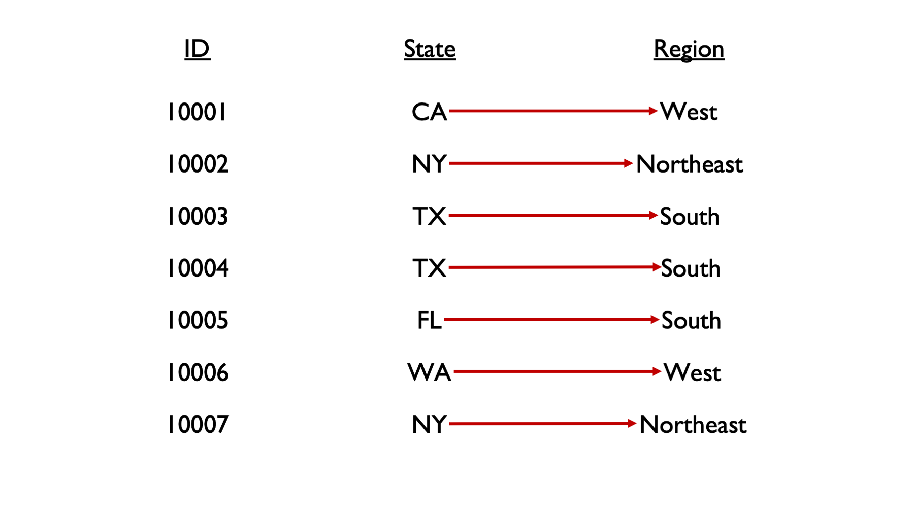
```

We don't really have a way to do this with the tools we currently have in our toolbox. We can manually type out all the region values, but that isn't very scalable. Wouldn't it be nice if we could just give R some rules, or conditions (e.g., TX is in the South, CA is in the West), and have R fill in the region values for us? Well, that's exactly what we are going to learn how to do in this chapter.

```{r echo=FALSE}
knitr::include_graphics("img/05_part_data_management/06_conditional_processing/conditions.png")
```

These kinds of operations are called conditional operations because we type in a set of conditions, R evaluates those conditions, and then executes a different process or procedure based on whether or not the condition is met.

As a silly example, let’s say that I want my daughter to wear a raincoat if it’s raining outside, but I don't want her to wear a raincoat if it is not raining outside. So, I give her a conditional request: “If it’s raining outside, then make sure to wear your raincoat, please. Otherwise, please don't wear your raincoat.” 

```{r echo=FALSE}
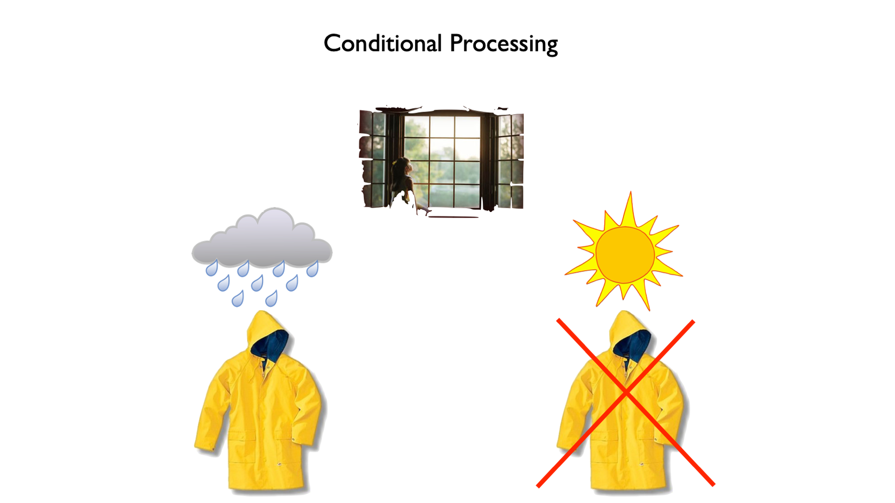
```

In this hypothetical scenario, she then says, “yes, dad,” and goes to the window to see if it’s raining. She either puts on, or does not put on, her raincoat depending on whether or not the condition (raining) is met. 

Just like I have to ask my daughter to put on a raincoat using conditional logic, I sometimes have to ask R to execute commands using conditional logic, and I have to do so in a way that R understands. One such form is `dplyr`'s `if_else()` function. Let's go ahead and take a look at an example now:

```{r message=FALSE}
library(dplyr)
```

```{r}
rainy_days <- tibble(
  day     = 1:5,
  weather = c("rain", "rain", "no rain", "rain", "no rain")
) %>% 
  print()
```

👆**Here's what we did above:**

* We simulated some data that contains information about whether or not it rained on each of 5 days. 

Now, let's say that we want to create a new column in our data frame called `raincoat`. We want the value of `raincoat` to be `wear` on rainy days and `no wear` on days when it isn't raining. Here's how we can do that with the if_else() function:

```{r}
rainy_days %>% 
  mutate(
    raincoat = if_else(
      condition = weather == "rain", 
      true      = "wear", 
      false     = "no wear"
    )
  )
```

👆**Here's what we did above:**

* We used `dplyr`'s `if_else()` function to assign the values `wear` and `no wear` to the column `raincoat` conditional on the values in each row of the `weather` column.

* You can type `?if_else` into your R console to view the help documentation for this function and follow along with the explanation below.

* The first argument to the `if_else()` function is the `condition` argument. The condition should typically be composed of a series of operands and operators (we'll talk more about these soon) that tell R the condition(s) that we want it to test. For example, is the value of `weather` equal to `rain`?

* The second argument to the `if_else()` function is the `true` argument. The value passed to the `true` argument tells R what value the `if_else()` function should return when the condition is `TRUE`. In this case, we told `if_else()` to return the character value `wear`.

* The third argument to the `if_else()` function is the `false` argument. The value passed to the `false` argument tells R what value the `if_else()` function should return when the condition is `FALSE`. In this case, we told `if_else()` to return the character value `no wear`.

* Finally, we assigned all the values returned by the `if_else()` function to a new column that we named `raincoat`.

<p class="note"> 🗒**Side Note:** For the rest of the book, I will pass values to the `if_else()` function by position instead of name. In other words, I won't write `condition =`, `true =`, or `false =` anymore. However, the first value passed to the `if_else()` function will always be passed to the `condition` argument, the second value will always be passed to the `true` argument, and the third value will always be passed to the `false` argument.</p>

Before moving on, let's dive into this a little further. R must always be able to reduce whatever value we pass to the `condition` argument of `if_else()` to TRUE or FALSE. That's how R views any expression we pass to the `condition` argument. We can literally even pass the value `TRUE` or the value `FALSE` (not that doing so has much practical application):

```{r}
if_else(TRUE, "wear", "no wear")
```

Because the value passed to the `condition` argument is `TRUE` (in this case, literally), the `if_else()` function returns the value `wear`. What happens if we use this code to assign values to the `raincoat` column?

```{r}
rainy_days %>% 
  mutate(
    raincoat = if_else(TRUE, "wear", "no wear")
  )
```

Again, the `if_else()` function returns the value `wear` because the value passed to the `condition` argument is `TRUE`. Then, R uses its recycling rules to copy the value `wear` to every row of the `raincoat` column. What would do you think will happen if we pass the value `FALSE` to the `condition` argument instead?

```{r}
rainy_days %>% 
  mutate(
    raincoat = if_else(FALSE, "wear", "no wear")
  )
```

Hopefully, that was the result you expected. The `if_else()` function returns the value `no wear` because the value passed to the `condition` argument is `FALSE`. Then, R uses its recycling rules to copy the value `no wear` to every row of the `raincoat` column.

We can take this  a step further and actually pass a vector of logical (`TRUE`/`FALSE`) values to the `condition` argument. For example:

```{r}
rainy_days %>% 
  mutate(
    raincoat = if_else(c(TRUE, TRUE, FALSE, TRUE, FALSE), "wear", "no wear")
  )
```

In reality, that's sort of what we did in the very first `if_else()` example above. But, instead of typing the values manually, we used an expression that returned a vector of logical values. Specifically, we used the equality operator (`==`) to check whether or not each value in the `weather` column was equal to the value "rain" or not. 

```{r}
rainy_days$weather == "rain"
```

That pretty much covers the basics of how the `if_else()` function works. Next, let's take a look at some of the different combinations of operands and operators that we can combine and pass to the `condition` argument of the `if_else()` function.

## Operands and operators

Let's start by taking a look at some commonly used operands:

```{r echo=FALSE}
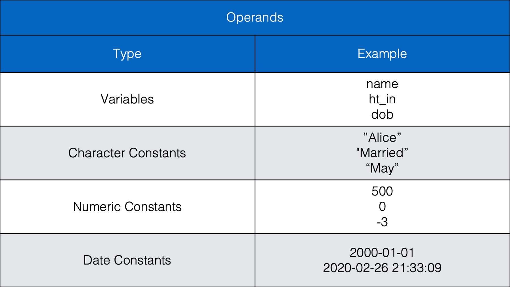
```

As you can see in the table above, operands are the _values_ we want to check, or test. Operands can be variables or they can be individual values (also called constants). The example above (`weather == "rain"`) contained two operands; the variable `weather` and the character constant `"rain"`. The operator we used in this case was the equality operator (`==`). Next, let's take a look at some other commonly used operators.

```{r echo=FALSE}
knitr::include_graphics("img/05_part_data_management/06_conditional_processing/comparison-numeric.png")
```

```{r echo=FALSE}
knitr::include_graphics("img/05_part_data_management/06_conditional_processing/comparison-character.png")
```

```{r echo=FALSE}
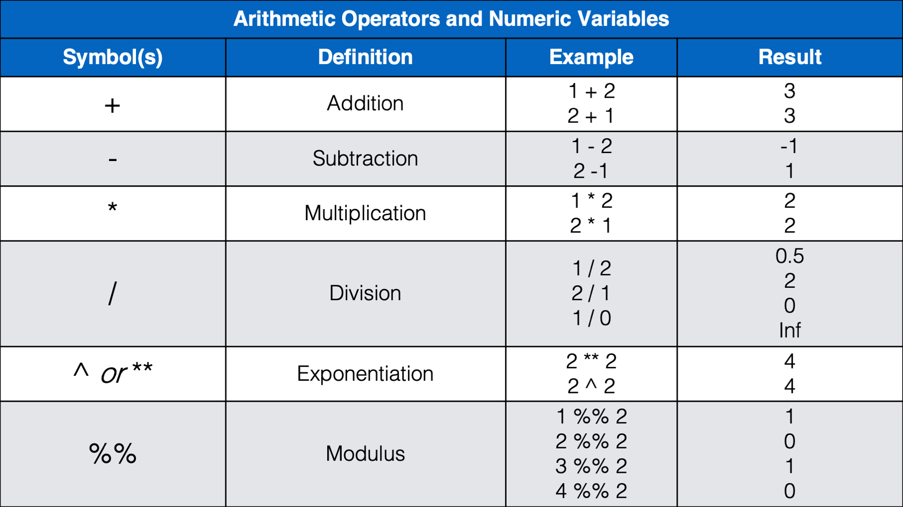
```

```{r echo=FALSE}
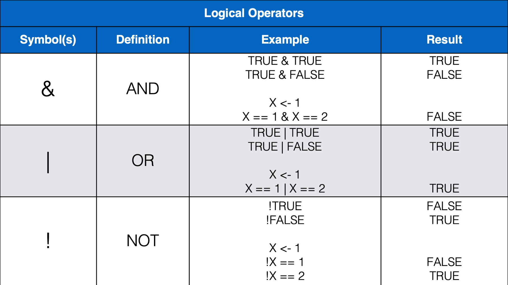
```

I think that most of the operators above will be familiar, or a least intuitive, for most of you. However, I do want to provide a little bit of commentary for a few of them.

* We haven't seen the `%in%` operator before, but I will wait to discuss it below. 

* Some of you may have been a little surprised by the results we get from using less than (`<`) and greater than (`>`) with characters. It's basically just testing alphabetical order. A comes before B in the alphabet, so A is less than B. Additionally, when two letters are the same, the upper-case letter is considered greater than the lowercase letter. However, alphabetical order takes precedence over case. So, b is still greater than A even though b is lowercase and A is upper case.

* Many of you may not have seen the modulus operator (`%%`) before. The modulus operator returns the remainder that is left after dividing two numbers. For example, 4 divided by 2 is 2 with a remainder of 0 because 2 goes into 4 _exactly_ two times. Said another way, 2 * 2 = 4 and 4 - 4 = 0. So, `4 %% 2 = 0`. However, 3 divided by 2 is 1 with a remainder of 1 because 2 goes into 3 one time with 1 left over. Said another way, 2 * 1 = 2 and 3 - 2 = 1. So, `3 %% 2 = 1`.  How is this useful? Well, the only times I can remember using the modulus operator have been when I needed to separate even and odd rows of a data frame. For example, let's say that we have a data frame where each person has two rows. The first row always corresponds to treatment A and the second row always corresponds to treatment B. However, for some reason (maybe blinding?), there was no `treatment` column in the data when we received it. We could use the modulus operator to add a `treatment` column like this:

```{r}
df <- tibble(
  id        = c(1, 1, 2, 2),
  outcome   = c(0, 1, 1, 1)
) %>% 
  print()
```

```{r}
df %>% 
  mutate(
    # Odd rows are treatment A
    # Even rows are treatment B
    treatment = if_else(row_number() %% 2 == 1, "A", "B")
  )
```

* I also want to remind you that we should always use the `is.na()` function to check for missing values. Not the equality operator. Using the equality operator when there are missing values can give results that may be unexpected. For example:

```{r}
df <- tibble(
  name1 = c("Jon", "John", NA),
  name2 = c("Jon", "Jon", "Jon")
)
```

```{r}
df %>% 
  mutate(
    name_match = name1 == name2
  )
```

Many of us would expect the third value of the `name_match` column to be `FALSE` instead of `NA`. There are a couple of different ways we can get `FALSE` in the third row instead of `NA`. One way, although not necessarily the best way, is to use the `if_else()` function:

```{r}
df %>% 
  mutate(
    name_match = name1 == name2,
    name_match = if_else(is.na(name_match), FALSE, name_match)
  )
```

👆**Here's what we did above:**

* We used `dplyr`'s `if_else()` function to assign the value `FALSE` to the column `name_match` where the original value of `name_match` was `NA`. 

* The value we passed to the `condition` argument was `is.na(name_match)`. In doing so, we asked R to check each value of the `name_match` column and see if it was `NA`. 

* If it was `NA`, then we wanted to return the value that we passed to the `true` argument. Somewhat confusingly, the value we passed to the `true` argument was `FALSE`. All that means is that we wanted `if_else()` to return the literal value `FALSE` when the value for `name_match` was `NA`.

* If the value in `name_match` was NOT `NA`, then we wanted to return the value that we passed to the `false` argument. In this case, we asked R to return the value that already exists in the `name_match` column.

* In more informal language, we asked R to replace missing values in the `name_match` column with `FALSE` and leave the rest of the values unchanged. 

## Testing multiple conditions simultaneously

So far, we have only ever passed one condition to the `condition` argument of the `if_else()` function. However, we can pass as many conditions as we want. Having said that, more than 2, or maybe 3, gets very convoluted. Let's go ahead and take a look at a couple of examples now. We'll start by simulating some blood pressure data:

```{r}
blood_pressure <- tibble(
  id     = 1:10,
  sysbp  = c(152, 120, 119, 123, 135, 83, 191, 147, 209, 166),
  diasbp = c(78, 60, 88, 76, 85, 54, 116, 95, 100, 106)
) %>% 
  print()
```

A person may be categorized as having normal blood pressure when their systolic blood pressure is less than 120 mmHG _AND_ their diastolic blood pressure is less than 80 mmHG. We can use this information and the `if_else()` function to create a new column in our data frame that contains information about whether each person in our simulated data frame has normal blood pressure or not:

```{r}
blood_pressure %>% 
  mutate(bp = if_else(sysbp < 120 & diasbp < 80, "Normal", "Not Normal"))
```

👆**Here's what we did above:**

* We used `dplyr`'s `if_else()` function to create a new column in our data frame (`bp`) that contains information about whether each person has normal blood pressure or not. 

* We actually passed two conditions to the `condition` argument. The first condition was that the value of `sysbp` had to be less than `120`. The second condition was that  the value of `diasbp` had to be less than `80`. 

* Because we separated these conditions with the AND operator (`&`), both conditions had to be true in order for the `if_else()` function to return the value we passed to the `true` argument -- `Normal`. Otherwise, the `if_else()` function returned the value we passed to the `false` argument -- `Not Normal`.

* Participant 2 had a systolic blood pressure of 120 and a diastolic blood pressure of 60. Although 60 is less than 80 (condition number 2), 120 is not less than 120 (condition number 1). So, the value returned by the `if_else()` function was `Not Normal`.

* Participant 3 had a systolic blood pressure of 119 and a diastolic blood pressure of 88 Although 119 is less than 120 (condition number 1), 88 is not less than 80 (condition number 2). So, the value returned by the `if_else()` function was `Not Normal`.

* Participant 6 had a systolic blood pressure of 83 and a diastolic blood pressure of 54. In this case, conditions 1 _and_ 2 were met. So, the value returned by the `if_else()` function was `Normal`.

This is useful! However, in some cases, we need to be able to test conditions sequentially, rather than simultaneously, and return a different value for each condition. 

## Testing a sequence of conditions

Let's say that we wanted to create a new column in our `blood_pressure` data frame that contains each person's blood pressure category according to the following scale:

```{r echo=FALSE}
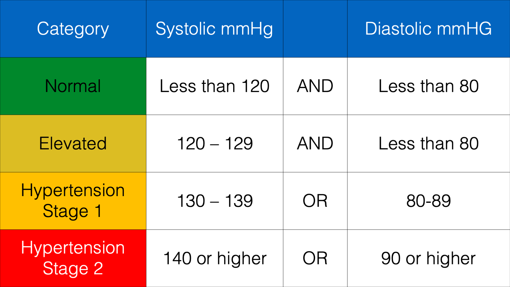
```

This is the perfect opportunity to use `dplyr`'s `case_when()` function. Take a look:

```{r}
blood_pressure %>% 
  mutate(
    bp = case_when(
      sysbp < 120 & diasbp < 80                               ~ "Normal",
      sysbp >= 120 & sysbp < 130 & diasbp < 80                ~ "Elevated",
      sysbp >= 130 & sysbp < 140 | diasbp >= 80 & diasbp < 90 ~ "Hypertension Stage 1",
      sysbp >= 140 | diasbp >= 90                             ~ "Hypertension Stage 2"
    )
  )
```

👆**Here's what we did above:**

* We used `dplyr`'s `case_when()` function to create a new column in our data frame (`bp`) that contains information about each person's blood pressure category. 

* You can type `?case_when` into your R console to view the help documentation for this function and follow along with the explanation below.

* The `case_when()` function only has a single argument -- the `...` argument. You should pass one or more two-sided formulas separated by commas to this argument. What in the heck does that mean?

  - When the help documentation refers to a two-sided formula, it means this: `LHS ~ RHS`. Here, `LHS` means left-hand side and `RHS` means right-hand side. 
  
  - The `LHS` should be the condition or conditions that we want to test. You can think of this as being equivalent to the `condition` argument of the `if_else()` function. 
  
  - The `RHS` should be the value you want the `case_when()` function to return when the condition on the left-hand side is met. You can think of this as being equivalent to the `true` argument of the `if_else()` function. 
  
  - The tilde symbol (`~`) is used to separate the conditions on the left-hand side and the return values on the right-hand side. 
  
* The `case_when()` function doesn't have a direct equivalent to the `if_else()` function's `false` argument. Instead, it evaluates each two-sided formula sequentially until if finds a condition that is met. If it never finds a condition that is met, then it returns an `NA`. I will expand on this more below.

* Finally, we assigned all the values returned by the `case_when()` function to a new column that we named `bp`.
  
<p class="note"> 🗒**Side Note:** Traditionally, the tilde symbol is used to represent relationships in a statistical model. Here, it doesn't have that meaning. I assume this symbol was picked somewhat out of necessity. Remember, any of the comparison operators, arithmetic operators, and logical operators may be used to define a condition in the left-hand side, and commas are used to separated multiple two-sided formulas. Therefore, there aren't very many symbols left to choose from. Therefore, tilde it is. That's my guess anyway. </p>

The `case_when()` function was really useful for creating the `bp` column above, but there was also a lot going on there. Next, we'll take a look at a slightly less complex example and clarify a few things along the way. 

## Recoding variables

In epidemiology, recoding variables is really common. For example, we may collect information about people's ages as a continuous variable, but decide that it makes more sense to **collapse** age into age categories for our analysis. Let's say that our analysis plan calls for assigning each of our participants to one of the following age categories: 

1 = `child` when the participant is less than 12 years old   
2 = `adolescent` when the participant is between the ages of 12 and less than 18   
3 = `adult` when the participant is 18 years old or older   

<p class="note"> 🗒**Side Note:** You may not have ever heard of **collapsing** variables before. It simply means combing two or more values of your variable. We can collapse continuous variables into categories, as we discussed in the example above, or we can collapse categories into broader categories (as you will see with the race category example below). After we collapse a variable, it always contains fewer (and broader) possible values than it contained before we collapsed it.</p>

I'm going to show you how to do this below using the `case_when()` function. However, I'm going to do it piecemeal so that I can highlight a few important concepts. First, let's simulate some data that includes 10 participant's ages.

```{r}
# Simulate some age data
set.seed(123)
ages <- tibble(
  id  = 1:10,
  age = c(sample(1:30, 9, TRUE), NA)
) %>% 
  print()
```

Then, let's start the process of collapsing the `age` column into a new column called `age_3cat` that contains the 3 age categories we discussed above:

```{r}
ages %>% 
  mutate(
    age_3cat = case_when(
      age < 12 ~ 1
    )
  )
```

👆**Here's what we did above:**

* We used `dplyr`'s `case_when()` function to create a new column in our data frame (`age_3cat`) that will eventually categorize each participant into one of 3 categories depending on their continuous age value.

* Notice that we only passed one two-sided formula to the `case_when()` function -- `age < 12 ~ 1`. 

  - The `RHS` of the two-sided formula is `age < 12`. This tells the `case_when()` function to check whether or not every value in the `age` column is less than `12` or not. 
  
  - The `LHS` of the two-sided formula is `1`. This tells the `case_when()` function what value to return each time it finds a value less than `12` in the `age` column.
  
  - The tilde symbol is used to separate the `RHS` and the `LHS` of the two-sided formula.
  
* Here is how the `case_when()` function basically works. It will test the condition on the left-hand side for each value of the variable, or variables, passed to the left-hand side (i.e., `age`). If the condition is met (i.e., `< 12`), then it will return the value on the right-hand side of the tilde (i.e., `1`). If the condition is not met, it will test the condition in the next two-sided formula. When there are no more two-sided formulas, then it will return an `NA`.
  
  - Above, the first value in `age` is `15`. `15` is _NOT_ less than `12`. So, `case_when()` tries to move on to the next two-sided formula. However, there is no next two-sided formula. So, the first value returned by the `case_when()` function is `NA`. The same is true for the next two values of age. 

  -  The fourth value in `age` is `3`. `3` is less than `12`. So, the fourth value returned by the `case_when()` function is `1`. And so on...
  
  - Finally, after the `case_when()` function has tested all conditions, the returned values are assigned to a new column that we named `age_3cat`.
  
* Notice that I named the new variable `age_3cat`. I'm not sure where I picked up this naming convention, but I use it a lot when I collapse variables. The basic format is the name of variable I'm collapsing, an underscore, and the number of categories in the collapsed variable. I like using this convention for two reasons. First, the resulting column names are meaningful and informative. Second, I don't have to spend any time trying to think of a different meaningful or informative name for my new variable. It's totally fine if you don't adopt this naming convention, but I would recommend that you try to use names that are more informative than `age2` or something like that.

* Notice that I used a number (`1`) on the right-hand side of the two-sided formula above. We could have used a character value instead (i.e., `child`); however, for reasons I discussed in the section on factor variables, I prefer to recode my variables using numeric categories and then later creating a factor version of the variable using the `_f` naming convention.

Now, let's add a second two-sided formula to our `case_when()` function.

```{r}
ages %>% 
  mutate(
    age_3cat = case_when(
      age < 12             ~ 1,
      age >= 12 & age < 18 ~ 2
    )
  )
```

👆**Here's what we did above:**

* We used `dplyr`'s `case_when()` function to create a new column in our data frame (`age_3cat`) that will eventually categorize each participant into one of 3 categories depending on their continuous age value.

* Notice that this time we passed two two-sided formulas to the `case_when()` function -- `age < 12 ~ 1` and `age >= 12 & age < 18 ~ 2`. 

  - Notice that we separated the two two-sided formulas with a comma (i.e., immediately after the `1` in `age < 12 ~ 1`.
  
  - Notice that the second two-sided formula is actually testing two conditions. First, it tests whether or not the value of age is greater than or equal to 12. Then, it tests whether or not the value of age is less than 18.
  
  - Because we separated the two conditions with the and operator (`&`), both must be TRUE for `case_when()` to return the value `2`. Otherwise, it will move on to the next two-sided formula.
  
  - Above, the first value in `age` is `15`. `15` is _NOT_ less than `12`. So, `case_when()` moves on to evaluate the next two-sided formula. `15` is greater than or equal to `12` _AND_ `15` is less than `18`. Because both conditions of the second two-sided formula were met, `case-when()` returns the value on the right-hand side of the second two-sided formula -- `2`. So, the first value returned by the `case_when()` function is `2`. 
  
  - The second value in `age` is `19`. `19` is _NOT_ less than `12`. So, `case_when()` moves on to evaluate the next two-sided formula. `19` is greater than or equal to `12`, but `19` is _NOT_ less than `18`. So, `case_when()` tries to move on to the next two-sided formula. However, there is no next two-sided formula. So, the second value returned by the `case_when()` function is `NA`.

  -  The fourth value in `age` is `3`. `3` is less than `12`. So, the fourth value returned by the `case_when()` function is `1`. **At this point, because a condition was met, `case_when()` does not continue checking the current value of `age` against the remaining two-sided formulas. It returns a `1` and moves on to the next value of `age`.**
  
  - Finally, after the `case_when()` function has tested all conditions, the returned values are assigned to a new column that we named `age_3cat`.
  
* In everyday speech, we may express the second two-sided condition above as "categorize all people between the ages of 12 and 18 as an adolescent." I want to make two points about that before moving on.

  - First, while that statement may be totally reasonable in everyday speech, it isn't quite specific enough for what we are trying to do here. "Between 12 and 18" is a little bit ambiguous. What category is a person put in if they are exactly 12? What category are they put in if they are exactly 18? So, clearly we need to be more precise. I'm not aware of any hard and fast rules for making these kinds of decisions about categorization, but I tend to _include_ the lower end of the range in the current category and _exclude_ the value on the upper end of the range in the current category. So, in the example above, I would say, "categorize all people between the ages of 12 and less than 18 as an adolescent."
  
  - Second, when we are testing for a "between" condition like this one, I often see students write code like this: `age >= 12 & < 18`. R won't understand that. You have to use the column name in each condition to be tested (i.e., `age >= 12 & age < 18`), even though it doesn't change. Otherwise, you get an error that looks something like this:
  
```{r error=TRUE}
ages %>% 
  mutate(
    age_3cat = case_when(
      age < 12             ~ 1,
      age >= 12 & < 18     ~ 2
    )
  )
```

Ok, let's go ahead and wrap up this age category variable:

```{r}
ages %>% 
  mutate(
    age_3cat = case_when(
      age < 12             ~ 1,
      age >= 12 & age < 18 ~ 2,
      age >= 18            ~ 3
    )
  )
```

👆**Here's what we did above:**

* We used `dplyr`'s `case_when()` function to create a new column in our data frame (`age_3cat`) that categorized each participant into one of 3 categories depending on their continuous age value.

## case_when() is lazy

What do I mean when I say that `case_when()` is lazy? Well, it may not have registered when I mentioned it above, but `case_when()` stops evaluating two-sided functions for a value as soon as it finds one that is `TRUE`. For example:

```{r}
df <- tibble(
  number = c(1, 2, 3)
) %>% 
  print()
```

```{r}
df %>% 
  mutate(
    size = case_when(
      number < 2 ~ "Small",
      number < 3 ~ "Medium",
      number < 4 ~ "Large"
    )
  )
```

Why wasn't the value for the `size` column `Large` in every row of the data frame? After all, `1`, `2`, and `3` are all less than `4`, and `number < 4` was the final possible two-sided formula that could have been evaluated for each value of `number`. The answer is that `case_when()` is lazy. The first value in `number` is `1`. `1` is less than `2`. So, the condition in the first two-sided formula evaluates to `TRUE`. So, `case_when()` immediately returns the value on the right-hand side (`Small`) and **does not continue checking two-sided formulas. It moves on to the next value of `number`.**

The fact that `case_when()` is lazy isn't a bad thing. It's just something to be aware of. In fact, we can often use it to our advantage. For example, we can use `case_when()`'s laziness to rewrite the `age_3cat` code from above a little more succinctly:

```{r}
ages %>% 
  mutate(
    age_3cat = case_when(
      age < 12  ~ 1,
      age < 18  ~ 2,
      age >= 18 ~ 3
    )
  )
```

👆**Here's what we did above:**

* Because `case_when()` is lazy, we were able to omit the `age >= 12` condition from the second two-sided formula. It's unnecessary because the value `1` is immediately returned for every person with an `age` value less than `12`. By definition, any value being evaluated in the second two-sided function (`age < 18`) has an age value greater than or equal to 12.

## Recode missing

We've already talked about how R uses the special `NA` value to represent missing data. We've also learned how to convert other representations of missing data (e.g., ".") to `NA` when we are importing data. However, It is extremely common for data sets that we use in epidemiology to include "don't know" and "refused" answer options in addition to true "missing". By convention, those options are often coded as `7` and `9`. For questions that include 7 or more response options (e.g., month), then `77` and `99` are commonly used to represent "don't know" and "refused". For questions that include 77 or more response options (e.g., age), then `777` and `999` are commonly used to represent "don't know" and "refused". 
  
Differentiating between true missing (i.e., the respondent was never asked the question or just left the response blank on a written questionnaire), don't know (i.e., the respondent doesn't know the answer), and refused (i.e., the respondent knows the answer, but doesn't want to reveille it -- possibly out of shame, fear, or embarrassment) can be of some interest for survey design purposes. However, all three of the values described above typically just amount to missing data by the time you get around to the substantive analyses. In other words, knowing that a person refused to give their age doesn't help me figure out how old they are any more than if they had never been asked at all. Therefore, we commonly use conditional operations in epidemiology to recode these kinds of values to explicitly missing values (`NA`). 

We'll walk through an example below, but first we will simulate some additional data. Specifically, we'll add a `race` column and a `hispanic` column to our `ages` data frame, and name the new data frame `demographics`.

Let's assume that we have a survey that asks people what race they most identify with. For the moment, let's assume that they can only select one race. Further, let's say that the options they are given to select from are:

1 = White   
2 = Black or African American   
3 = American Indian or Alaskan Native   
4 = Asian    
5 = Pacific Islander   
7 = Don't know    
9 = Refused    

Let's say that we also ask if they self-identify their ethnicity as Hispanic or not. The options they are given to select from are:

0 = No, not Hispanic   
1 = Yes, Hispanic   
7 = Don't know    
9 = Refused 

```{r}
demographics <- ages %>% 
  mutate(
    race     = c(1, 2, 1, 4, 7, 1, 2, 9, 1, 3),
    hispanic = c(7, 0, 1, 0, 1, 0, 1, 9, 0, 1)
  ) %>% 
  print()
```

A very common way that we may want to transform data like this is to collapse race and ethnicity into as single combined race and ethnicity column. Further, notice that American Indian or Alaskan Native race and Asian race are only observed once each, and Pacific Islander race is not observed at all. When values are observed very few times in the data like this, it is common to collapse them into an "other" category. Therefore, our new combined race and ethnicity column will have the following possible values:

1 = White, non-Hispanic   
2 = Black, non-Hispanic   
3 = Hispanic, any race   
4 = Other race, non-Hispanic   

There are multiple ways that we can create this new column. We could start by using `if_else()` to recode `7` and `9` to missing:

```{r error=TRUE}
demographics %>% 
  mutate(
    # Recode 7 and 9 to missing
    race_recode = if_else(race == 7 | race == 9, NA, race),
    hispanic_recode = if_else(hispanic == 7 | hispanic == 9, NA, hispanic)
  )
```

I intentionally made this error because it's a really easy one to make, and you will probably make it too. If you look back to the [Let's get programming chapter](#missing-data), you will see that I briefly discussed the `NA` value being type logical by default. I also talked about "type coercion" and how most of the time you don’t have to worry about it. I said that R generally coerces `NA` to `NA_character` or `NA_double` or whatever for you under the hood, automatically. I also said that sometimes it doesn’t, especially when using the if_else() and case_when() functions, and it will cause R to give you an error. Finally, I said I would discuss it later. It's later now. Long story short, the developers of the `if_else()` function do this on purpose to make the function's returned result more predictable and slightly faster. 

For you, it just means that you have to remember to use `NA_character`, `NA_integer`, or `NA_real` as appropriate. For example, the error message above says, "`false` must be a logical vector, not a double vector." This means that the value we passed to the `false` argument was type double, but `if_else()` was expecting it to be type logical. Why? Well, `if_else()` was expecting it to be type logical because the value we passed to the `true` argument (`NA`) is type logical, and vectors can only ever have one type. To fix this error, we simply need to change the value we are passing to the `true` argument from logical (`NA`) to double (`NA_real`) so that it matches the values we are passing to the `false` argument.

Let's try again using `NA_real` instead of `NA`.

```{r error=TRUE}
demographics %>% 
  mutate(
    # Recode 7 and 9 to missing
    race_recode = if_else(race == 7 | race == 9, NA_real_, race),
    hispanic_recode = if_else(hispanic == 7 | hispanic == 9, NA_real_, hispanic)
  )
```

Great! We can move on with creating our new race and ethnicity column now that we've explicitly transformed `7`'s and `9`'s to `NA`. There's nothing "new" in the code below, so I'm not going to explain it line-by-line. However, it's a little bit dense, so I recommend that you take a few minutes to review it thoroughly and make sure you understand what each line is doing.

```{r error=TRUE}
demographics %>% 
  mutate(
    # Recode 7 and 9 to missing
    race_recode     = if_else(race == 7 | race == 9, NA_real_, race),
    hispanic_recode = if_else(hispanic == 7 | hispanic == 9, NA_real_, hispanic),
    race_eth_4cat   = case_when(
      # White, non-Hispanic
      race_recode == 1 & hispanic_recode == 0 ~ 1,
      # Black, non-Hispanic
      race_recode == 2 & hispanic_recode == 0 ~ 2,
      # American Indian or Alaskan Native to Other race, non-Hispanic
      race_recode == 3 & hispanic_recode == 0 ~ 4,
      # Asian to Other race, non-Hispanic
      race_recode == 4 & hispanic_recode == 0 ~ 4,
      # Pacific Islander to Other race, non-Hispanic
      race_recode == 4 & hispanic_recode == 0 ~ 4,
      # Hispanic, any race
      hispanic_recode == 1                    ~ 3
    )
  )
```

The code above works, and it is very explicit. However, we can definitely make it more succinct and easier to read. For example:

```{r}
demographics %>% 
  mutate(
    race_eth_4cat = case_when(
      is.na(hispanic) | hispanic %in% c(7, 9) ~ NA_real_, # Unknown ethnicity
      hispanic == 1                           ~ 3,        # Hispanic, any race
      is.na(race) | race %in% c(7, 9)         ~ NA_real_, # non-Hispanic, unknown race
      race == 1                               ~ 1,        # White, non-Hispanic
      race == 2                               ~ 2,        # Black, non-Hispanic
      TRUE                                    ~ 4         # Other race, non-Hispanic
    )
  )
```

👆**Here's what we did above:**

* We used `dplyr`'s `case_when()` function to create a new column in our data frame (`race_eth_4cat`) that categorized each participant into one of 4 race and ethnicity categories depending on their values in the `race` column and the `hispanic` column.

* Compared to the first method we used, the second method doesn't explicitly create new `race` and `hispanic` columns with the `7`'s and `9`'s recoded to `NA`. In the second method, those columns aren't needed.

* The very first two-sided formula tells `case_when()` to set the value of `race_eth_4cat` to `NA_real_` when the value of `hispanic` is missing. 

  - We put this two-sided formula first because if we don't know a person's Hispanic ethnicity, then we can't put them into any category of `race_eth_4cat`. All categories of `race_eth_4cat` are dependent on a known value for `hispanic`. For example, look at participant number 1. They reported being white, but they don't give their ethnicity. Which category do we put them in? We can't put them in `White, non-Hispanic` because they very well could be Hispanic. We can't put them in `Hispanic, any race` because they very well could be non-Hispanic. We don't know. We never will. We code them as missing and don't evaluate any further. And because `case_when()` is lazy, any other participants with a missing value for `hispanic` would also only have this first two-sided formula evaluated.  
  
  - There were no actual `NA` values in the `hispanic` column, but I put it in the code for completeness. There will be some true missing (`NA`) values in most real-world data sets.
  
  - Notice that we finally used the `%in%` operator above (`hispanic %in% c(7, 9)`). This is equivalent to typing `hispanic == 7 | hispanic == 9`. Notice that's an _OR_. In this case, it doesn't save us a ton of typing and visual clutter, but in many cases it can. 
  
* The second two-sided formula tells `case_when()` to set the value of `race_eth_4cat` to `3` (i.e., Hispanic any-race) when the value of `hispanic` is `1`. Why did we put this second? If we know that someone is Hispanic, does it matter what race they reported? Nope! No matter what race they reported (even missing race) they get coded as `Hispanic, any race`. And because `case_when()` is lazy, putting this two-sided formula second has two advantages:

  - Any other participants with a value of `1` for `hispanic` would only have the first two two-sided formulas evaluated. In other words, for each Hispanic participant, R would only evaluate 2 two-sided formulas instead of the 6 we used in the first method. With only 10 participants in the data, we won't notice any performance improvement. But, this performance improvement can add up when we have thousands or millions of rows.
  
  - It allows us to remove the `hispanic == 0` from the remaining two-sided formulas. Think about it. All participants with a missing value for `hispanic` were accounted for in the first two-sided formula. All participants with a `1` for `hispanic` were accounted for in the second two-sided formula. By definition, any participant left in the data must have a value of `0` for `hispanic`. There's no need to write that code and there's no need for R to evaluate that condition. Less typing for us and further performance improvements to boot.
  
* The third two-sided formula tells `case_when()` to set the value of `race_eth_4cat` to `NA_real_` when the value of `race` is missing. At this point in the code, there are no participants left with a value of `1` for `hispanic`. Therefore, if they are missing a value for `race` we won't be able to assign them a value for `race_eth_4cat`. We code them as missing and don't evaluate any further.

* The fourth and fifth two-sided formulas tell `case_when()` to set the value of `race_eth_4cat` to `1` and `2` respectively when the value of `race` is `1` and `2`.

* The final two-sided formula is simply `TRUE ~ 4`. This tells `case_when()` to set the value of `race_eth_4cat` to `4` when none of the other two-sided formulas above evaluated to `TRUE`. Why did we do this? Well, every participant with missing data has been accounted for, every `Hispanic` participant has been accounted for, every `White, non-Hispanic` participant has been accounted for, and every `Black, non-Hispanic` participant has been accounted for. Because case_when() is lazy, we know that any participant that makes it to this part of the code must fall into the `Other race, non-Hispanic` category. 

  - Notice that there is nothing at all about `race` or `hispanic` in this two-sided formula. It just says `TRUE`. What does `case_when()` do when a condition on the left-hand side evaluates to `TRUE`? It returns the value on the right-hand side. In this case `4`.  
  
<p class="warning"> ⚠️**Warning:** Sometimes, adding an a final `TRUE` condition like the one above can be really useful. However, you have to be really careful. You can easily get unintended results if you aren't absolutely sure that you've already accounted for every possible combination of relevant conditions in the two-sided formulas that come before.</p>

Let's go ahead and wrap up this chapter with one consolidated code chunk that cleans our demographics data:

```{r}
demographics %>% 
  # Recode variables
  mutate(
    # Collapse continuous age into 3 categories
    age_3cat = case_when(
      age < 12  ~ 1, # child
      age < 18  ~ 2, # adolescent
      age >= 18 ~ 3  # adult
    ),
    age_3cat_f = factor(
      age_3cat, 
      labels = c("child", "adolescent", "adult")
    ),
    # Combine race and ethnicity
    race_eth_4cat = case_when(
      is.na(hispanic) | hispanic %in% c(7, 9) ~ NA_real_, # Unknown ethnicity
      hispanic == 1                           ~ 3,        # Hispanic, any race
      is.na(race) | race %in% c(7, 9)         ~ NA_real_, # non-Hispanic, unknown race
      race == 1                               ~ 1,        # White, non-Hispanic
      race == 2                               ~ 2,        # Black, non-Hispanic
      TRUE                                    ~ 4         # Other race, non-Hispanic
    ),
    race_eth_4cat_f = factor(
      race_eth_4cat,
      labels = c(
        "White, non-Hispanic", "Black, non-Hispanic", "Hispanic, any race",
        "Other race, non-Hispanic"
      )
    )
  )
```

Now that we've mastered conditional operations, we can use them to help us navigate another common data collection technique in epidemiology -- skip patterns.

<!--chapter:end:chapters/05_part_data_management/06_conditional_operations.Rmd-->

# Working with multiple data frames

<!--
Stacking data frames vertically
Stacking data frames horizontally
Introduction to relational data
Joining data frames deterministically 
Joining data frames probabilistically 
Add link to cheat sheet
-->

Up to this point, the data we’ve needed has always been stored in a single data frame. However, that won’t always be the case. At times you may need to combine data from multiple agencies in order to complete your analysis. 

```{r echo=FALSE}
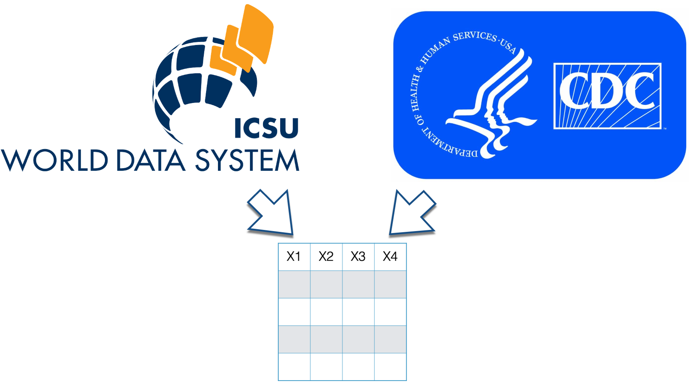
```

Additionally, large studies often gather data at multiple sites.

```{r echo=FALSE}
knitr::include_graphics("img/05_part_data_management/08_multiple_data_frames/sites.png")
```

Or, data is sometimes gathered over long periods of time. When this happens, it is not uncommon for observations across the study sites or times to be stored as separate data sets.

```{r echo=FALSE}
knitr::include_graphics("img/05_part_data_management/08_multiple_data_frames/time.png")
```

Another common scenario in which you end up with multiple data sets for the same study is when researchers use different data sets to record the results of different survey instruments or groups of similar instruments.

```{r echo=FALSE}
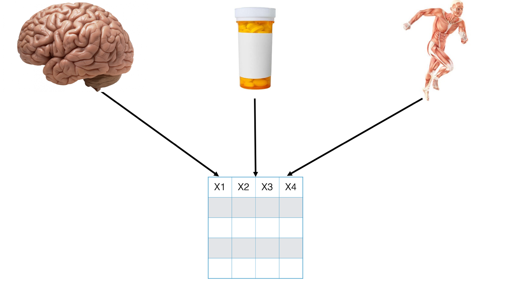
```

In any of these cases, you may need to combine data from across data sets in order to complete your analysis. 

```{r echo=FALSE}
knitr::include_graphics("img/05_part_data_management/08_multiple_data_frames/datasets.png")
```

This combining of data comes in two basic forms: combining vertically and combining horizontally. First we’ll learn about combining vertically, or adding rows. Later, we’ll learn about combining horizontally, or adding columns.

Below we have two separate data frames - data frame one and data frame two. In this case both data frames contain the exact same variables: Var1, Var2, and Var3. However, they aren’t identical because they contain different observations.

```{r echo=FALSE}
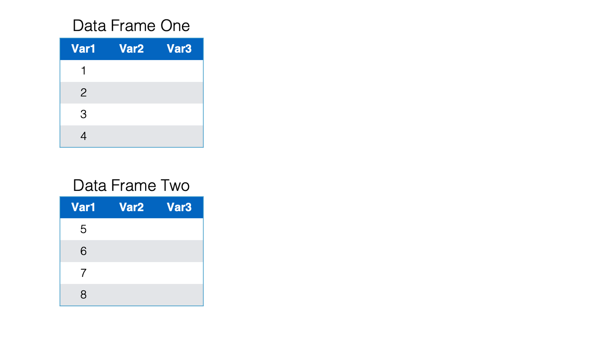
```

Now, you want to combine these two data frames and end up with one data frame that includes the observations from data frame two listed directly below the observations from data frame one. This is a situation where we want to combine data frames vertically.

```{r echo=FALSE}
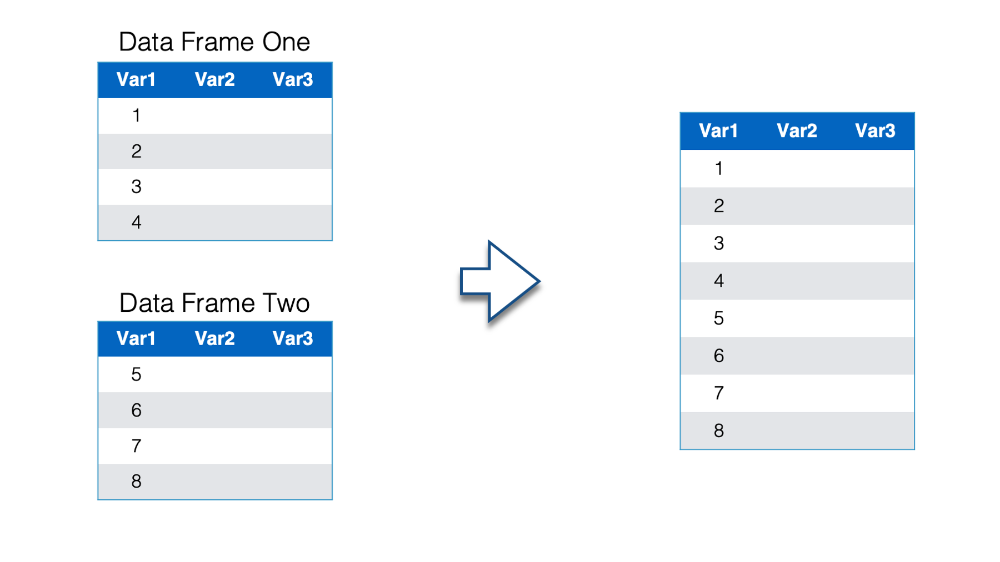
```

When combining data frames vertically, one of the most important questions to ask is, “do the data frames have variables in common?” Just by examining data frame one and data frame two, you can see that the variables have the same names. How can you check to make sure that the variables also contain the same type of data? Well, you can use the `str()` or `glimpse()` functions to compare the details of the columns in the two data frames.

Sometimes, you might find that columns that have different names across data frames contain the same data. For example, suppose that data frame one has a variable named ID and data frame two has a variable named subject ID. In this situation you might want R to combine these two variables when you combine data frames.

On the other hand, you may find that variables that have the same name across data frames, actually contain different data. For example, both data frames may contain the variable `date`. But, one `date` variable might store birth date and the other might store date of admission. You would not want to combine these two variables.

As you may have guessed, when combining data frames vertically, it’s easiest to combine data frames that have identical variables. However, you will also learn how to combine data frames that have different variables.

## Combining data frames vertically: Adding rows

Suppose you are working on a multisite clinical trial recruiting participants over multiple years. You have a data frame named Trial, that stores the number of participants recruited each year, as well as the number of participants who experienced the outcome of interest. Another data frame named Trial_2020 was just sent to you with the recruitment numbers for the year 2020. 

```{r echo=FALSE}
knitr::include_graphics("img/05_part_data_management/08_multiple_data_frames/trial.png")
```

You want to add the observations about the participants recruited in 2020 to the master data frame so that it contains the information about all years. To do this, you bind the rows in the `trial_2020` data frame to the `trial` data frame.

Let's go ahead and load `dplyr`:

```{r message=FALSE}
library(dplyr)
```

And simulate our data frames:

```{r}
trial <- tibble(
  year    = c(2016, 2017, 2018, 2019),
  n       = c(501, 499, 498, 502),
  outcome = c(51, 52, 49, 50) 
) %>% 
  print()
```

```{r}
trial_2020 <- tibble(
  year    = 2020,
  n       = 500,
  outcome = 48 
) %>% 
  print()
```

We can see above that column names and types in both data frames are identical. In this case, we can easily bind them together vertically with `dplyr`'s `bind_rows()` function:

```{r}
trial %>% 
  bind_rows(trial_2020)
```

👆**Here's what we did above:**

* We used `dplyr`'s `bind_rows()` function to vertically stack, or bind, the rows in `trial_2020` to the rows in `trials`.

* You can type `?bind_rows` into your R console to view the help documentation for this function and follow along with the explanation below.

* The first argument to the `bind_rows()` function is the `...` argument. Typically, we will pass one or more data frames that we want to combine to the `...` argument.

### Combining more than 2 data frames

What if we want to vertically combine more than two data frames? This isn't a problem. Thankfully, `bind_rows()` lets us pass as many data frames as we want to the `...` argument. For example:

```{r}
trial_2021 <- tibble(
  year      = 2021,
  n         = 598,
  outcome   = 57
) %>% 
  print()
```

```{r}
trial %>% 
  bind_rows(trial_2020, trial_2021)
```

### Adding rows with differing columns

What happens when the data frames we want to combine don't have identical sets of columns? For example, let's say that we started collecting data on adverse events for the first time in 2020. In this case, `trials_2020` would contain a column that `trials` doesn't contain. Can we still row bind our two data frames? Let's see:

```{r}
trial_2020 <- tibble(
  year      = 2020,
  n         = 500,
  outcome   = 48,
  adv_event = 3 # Here is the new column
) %>% 
  print()
```

```{r}
trial %>% 
  bind_rows(trial_2020)
```

We sure can! R just sets the value of `adv_event` to `NA` in the rows that came from the `trial` data frame. 

### Differing column positions

Next, let's say that the person doing data entry accidently put the columns in a different order in 2020. Is `bind_rows()` able to figure out which columns go together?

```{r}
trial_2020 <- tibble(
  year      = 2020,
  n         = 500,
  adv_event = 3, # This was previously the fourth column
  outcome   = 48 # This is the thrid column in trial
) %>% 
  print()
```

```{r}
trial %>% 
  bind_rows(trial_2020)
```

Yes! The `bind_rows()` function binds the data frames together based on column names. So, having our columns in a different order in the two data frames isn't a problem. But, what happens when we have different column names?

### Differing column names

As a final wrinkle, let's say that the person doing data entry started using different column names in 2020 as well. For example, below, the `n` column is now named `count` and the `outcome` column is now named `outcomes`. Will `bind_rows()` still be able to vertically combine these data frames?

```{r}
trial_2020 <- tibble(
  year      = 2020,
  count     = 500,
  adv_event = 3,
  outcomes  = 48
) %>% 
  print()
```

```{r}
trial %>% 
  bind_rows(trial_2020)
```

In this case, `bind_rows()` plays it safe and doesn't make any assumptions about whether columns with different names belong together or not. However, we only need to rename the columns in one data frame or the other to fix this problem. We could do this in separate steps like this:

```{r}
trial_2020_rename <- trial_2020 %>% 
  rename(
    n = count,
    outcome = outcomes
  )

trial %>% 
  bind_rows(trial_2020_rename)
```

Or, we could rename and bind in a single step by nesting functions like this:

```{r}
trial %>% 
  bind_rows(
    trial_2020 %>% 
      rename(
        n = count,
        outcome = outcomes
      )
  )
```

👆**Here's what we did above:**

* We _nested_ the code that we previously used to create the `trial_2020_rename` data frame inside of the `bind_rows()` function instead creating the actual `trial_2020_rename` data frame and passing it to `bind_rows()`.

* I don't think you can really say that one method is "better" or "worse". The first method requires two steps and creates a data frame in our global environment that we may or may not ever need again (i.e., potentially just clutter). However, one could make an argument that the first method is also easier to glance at and read. I would typically use the second method, but this is really just a personal preference in this case.

And that's pretty much it. The `bind_rows()` function makes it really easy to combine R data frames vertically. Next, let's learn how to combine data frames horizontally.

## Combining data frames horizontally: Adding columns

In this section we will once again begin with two separate data frames - data frame one and data frame two. But, unlike before, these data frames share only one variable in common. And, the data contained in both data frames pertains to the same observations.

```{r echo=FALSE}
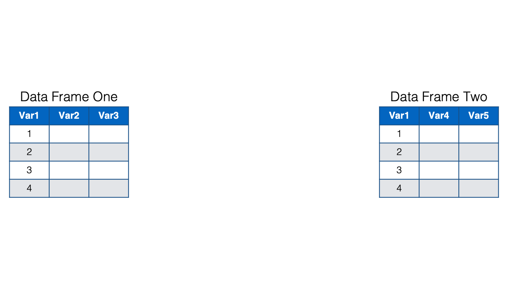
```

Our goal is once again to combine these data frames. But, this time we want to combine them horizontally. In other words, we want a combined data frame that combines all the _columns_ from data frame one and data frame two.

```{r echo=FALSE}
knitr::include_graphics("img/05_part_data_management/08_multiple_data_frames/goal.png")
```

Combining data frames horizontally can be slightly more complicated than combining them vertically. As shown in the following flow chart, we can either match the rows of our two data frames up by position or by key values. 

```{r echo=FALSE}
knitr::include_graphics("img/05_part_data_management/08_multiple_data_frames/flow_chart.png")
```

### Combining data frames horizontally by position

In the simplest case, we match the rows in our data frames up by position. In other words, row 1 in data frame one is matched up with row 1 in data frame two, row 2 in data frame one is matched up with row 2 in data frame two, and so on. Row n (meaning, any number) in data frame one always gets matched to row n in data frame two, regardless of the values in any column of those rows.

```{r echo=FALSE}
knitr::include_graphics("img/05_part_data_management/08_multiple_data_frames/position.png")
```

Combining data frames horizontally by position is very easy in R. We just use `dplyr`'s `bind_cols()` function similarly to the way used `bind_rows()` above. Just remember that when we horizontally combine data frames by position both data frames must have the same number of rows. For example:

```{r}
df1 <- tibble(
  color = c("red", "green", "blue"),
  size  = c("small", "medium", "large")
) %>% 
  print()
```

```{r}
df2 <- tibble(
  amount = c(1, 4, 3),
  dose   = c(10, 20, 30)
) %>% 
  print()
```

```{r}
df1 %>% 
  bind_cols(df2)
```

👆**Here's what we did above:**

* We used `dplyr`'s `bind_cols()` function to horizontally bind the columns in `df1` to the columns in `df2`.

* You can type `?bind_cols` into your R console to view the help documentation for this function and follow along with the explanation below.

* The only argument to the `bind_cols()` function is the `...` argument. Typically, we will pass one or more data frames that we want to combine to the `...` argument.

In general, it's a bad idea to combine data frames that contain different kinds of information (i.e., variables) about the same set of people (or places or things) in this way. It's difficult to ensure that the information in row n in both data frames is really about the same person (or place or thing). However, I do sometimes find `bind_cols()` to be useful when I'm writing my own functions in R. We haven't quite learned how to do that yet, but we will soon. 

### Combining data frames horizontally by key values

In all the examples from here on out we will match the rows of our data frames by one or more key values.

```{r echo=FALSE}
knitr::include_graphics("img/05_part_data_management/08_multiple_data_frames/flow_chart_key_value.png")
```

In epidemiology, the term I most often hear used for combining data frames in this way is **merging**. So, I will mostly use that term below. However, in other disciplines it is common to use the term **joining**, or performing a data **join**, to mean the same thing. The `dplyr` package, in specific, refers to these as "mutating joins."

#### Relationship types

When we merge data frames it’s important to ask ourselves, “what is the relationship between the observations in the original data frames?” The observations can be related in several different ways.

In a one-to-one relationship, a single observation in one data frame is related to no more than one observation in the other data frame. We know how to align, or connect, the rows in the two data frames based on the values of one or more common variables.

```{r echo=FALSE}
knitr::include_graphics("img/05_part_data_management/08_multiple_data_frames/one_to_one.png")
```

This common variable, or set of common variables, is also called a **key**. When we use the values in the key to match rows in our data frames, we can say that we are _matching on key values_. 

In the example above, There is one key column -- `Var1`. Both data frames contain the column named `Var1`, and the values of that column tell R how to align the rows in both data frames so that all the values in that row contain data are about the same person, place, or thing. In the example above, we know that the first row of data frame one goes with the _second_ row of data frame two because both rows have the same key value -- `1`.

In a one-to-many relationship, a single observation in one data frame is related to multiple observations in the other data frame.

```{r echo=FALSE}
knitr::include_graphics("img/05_part_data_management/08_multiple_data_frames/one_to_many.png")
```

And finally, in a many-to-many relationship, multiple observations in one data frame are related to multiple observations in the other data frame.

```{r echo=FALSE}
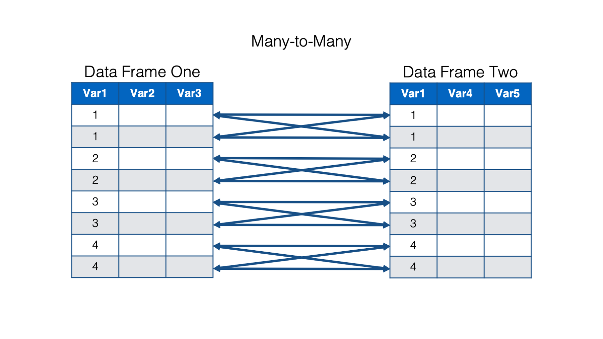
```

Many-to-many relationships are messy and are generally best avoided, if possible. In practice, I'm not sure that I've ever merged two data frames that had a _true_ many-to-many relationship. I emphasize _true_ because I have definitely merged data frames that had a many-to-many relationship when matching on a single key column. However, after matching on multiple key columns (e.g., study id and date instead of just study id), the relationship became one-to-one or one-to-many. We'll see an example of matching on multiple key columns later. 

#### dplyr join types

In this chapter, we will merge data frames using one of `dplyr`'s four mutating join functions. 

The first three arguments to all four of `dplyr`'s mutating join functions are: `x`, `y`, and `by`. You should pass the names of the data frames you want to merge to the `x` and `y` arguments respectively. You should pass the name(s) of the key column(s) to the `by` argument. In many cases, you will get a different merge result depending on which data frame you pass to the `x` and `y` arguments, and which mutating join function you use. Below, I will give you a brief overview of each of the mutating join functions, and then we will jump into some examples.

The four mutating join functions are:

1. `left_join()`. This is probably the join function that you will use the most. It's important to remember that `left_join()` keeps all the rows from the `x` data frame in the resulting combined data frame. However, it only keeps the rows from the `y` data frame that have a key value match in the `x` data frame. The values for columns with no key value match in the opposite data frame are set to `NA`.

```{r echo=FALSE}
knitr::include_graphics("img/05_part_data_management/08_multiple_data_frames/left_join.png")
```

2. `right_join()`. This is just the mirror opposite of `left_join()`. Accordingly, `right_join()` keeps all the rows from the `y` data frame in the resulting combined data frame, and only keep the rows from the `x` data frame that have a key value match in the `y` data frame. The values for columns with no key value match in the opposite data frame are set to `NA`.

```{r echo=FALSE}
knitr::include_graphics("img/05_part_data_management/08_multiple_data_frames/right_join.png")
```

3. `full_join()`. Full join keeps all the rows from both data frames in the resulting combined data frame. The values for columns with no key value match in the opposite data frame are set to `NA`.

```{r echo=FALSE}
knitr::include_graphics("img/05_part_data_management/08_multiple_data_frames/full_join.png")
```

4. `inner_join()`. Inner join keeps only the rows from both data frames that have a key value match in the opposite data frame in the resulting combined data frame. 

```{r echo=FALSE}
knitr::include_graphics("img/05_part_data_management/08_multiple_data_frames/inner_join.png")
```

Now that we have a common vocabulary, let's take a look at some more concrete examples. 

Suppose we are analyzing data from a study of aging and functional ability. At baseline, we assigned a study id to each of our participants. We then ask them their date of birth and their race and ethnicity. We saved that information in a data frame called `demographics`. 

```{r}
demographics <- tibble(
  id       = c("1001", "1002", "1003", "1004"),
  dob      = as.Date(c("1968-12-14", "1952-08-03", "1949-05-27", "1955-03-12")),
  race_eth = c(1, 2, 2, 4)
) %>% 
  print()
```

Then, we asked our participants to do a series of functional tests. The functional tests included measuring grip strength in their right hand (`grip_r`) and grip strength in their left hand (`grip_l`). We saved each measure, along with their study id, in a separate data frame called `grip_strength`.

```{r}
grip_strength <- tibble(
  id     = c("1002", "1001", "1003", "1004"),
  grip_r = c(32, 28, 32, 22),
  grip_l = c(30, 30, 28, 22)
) %>% 
  print()
```

Now, we want to merge these two data frames together so that we can include age, race/ethnicity, and grip strength in our analysis.

Let's first ask ourselves, “what is the relationship between the observations in `demographics` and the observations in `grip_strength`?”

#### One-to-one relationship merge

It's a one-to-one relationship because each participant in `demographics` has no more than one corresponding row in `grip_strength`. Since both data frames have exactly four rows, we can go ahead hand combine them horizontally using `bind_cols()` like this:

```{r}
demographics %>% 
  bind_cols(grip_strength)
```

👆**Here's what we did above:**

* We used `dplyr`'s `bind_cols()` function to horizontally bind the columns in `demographics` to the columns in `grip_strength`. **This was a bad idea!** 

* Notice the message that `bind_cols()` gave us this time: `New names: * id -> id...1 * id -> id...2`. This is telling us that both data frames had a column named `id`. If `bind_cols()` had left the column names as-is, then the resulting combined data frame would have had two columns named `id`, which isn't allowed.

* **More importantly**, notice the demographic data for participant 1001 is now aligned with the grip strength data for participant 1002, and vice versa. The grip strength data was recorded in the order that participants came in to have their grip strength measured. In this case, participant 1002 came in before 1001. Remember that `bind_cols()` matches rows by position, which results in mismatched data in this case.

Now, let's learn a better way to merge these two data frames -- `dplyr`'s `left_join()` function:

```{r}
demographics %>% 
  left_join(grip_strength, by = "id")
```

👆**Here's what we did above:**

* We used `dplyr`'s `left_join()` function to perform a one-to-one merge of the `demographics` data frame with the `grip_strength` data frame.

* You can type `?left_join` into your R console to view the help documentation for this function and follow along with the explanation below.

* The first argument to the `left_join()` function is the `x` argument. You should pass a data frame to the `x` argument.

* The second argument to the `left_join()` function is the `y` argument. You should pass a data frame to the `y` argument.

* The third argument to the `left_join()` function is the `by` argument. You should pass the name of the column, or columns, that contain the key values. The column name should be wrapped in quotes.

* Notice that the demographics and grip strength data are now correctly aligned for participants 1001 and 1002 even though they were still misaligned in the original data frames. That's because row position is irrelevant when we match by key values.

* Notice that the result above only includes a single `id` column. This is because we aren't simply smooshing two data frames together, side-by-side. We are integrating information from across the two data frames based on the value of the key column -- `id`.

The merge we did above is about as simple as it gets. It was a one-to-one merge where every key value in the `x` data frame had one, and only one, matching key value in the `y` data frame. Therefore, in this simple case, all four join types give us the same result:

```{r}
# Right join
demographics %>% 
  right_join(grip_strength, by = "id")
```

```{r}
# Full join
demographics %>% 
  full_join(grip_strength, by = "id")
```

```{r}
# Inner join
demographics %>% 
  inner_join(grip_strength, by = "id")
```

Additionally, aside from the order of the rows and columns in the resulting combined data frame, it makes no difference which data frame you pass to the `x` and `y` arguments in this case:

```{r}
# Switching order
grip_strength %>% 
  left_join(demographics, by = "id")
```

As our merges get more complex, we will get different results depending on which join function we choose and the ordering in which we pass our data frames to the `x` and `y` arguments. I'm not going to attempt to cover every possible combination. But, I am going to try to give you a flavor for some of the scenarios I believe you are most likely to encounter in practice.

#### Differing rows

In the real world, participants don't always attend scheduled visits. Let's suppose that there was actually a fifth participant that we collected baseline data from:

```{r}
demographics <- tibble(
  id       = c("1001", "1002", "1003", "1004", "1005"),
  dob      = as.Date(c(
    "1968-12-14", "1952-08-03", "1949-05-27", "1955-03-12", "1942-06-07"
  )),
  race_eth = c(1, 2, 2, 4, 3)
) %>% 
  print()
```

However, participant 1005 never made it back in for a grip strength test. Now, what do you think will happen when we merge `demographics` and `grip_strength` using `left_join()`?

```{r}
demographics %>% 
  left_join(grip_strength, by = "id")
```

The resulting data frame includes _all_ rows from the `demographics` data frame _and all_ the rows from the `grip_strength` data frame. Because participant 1005 never had their grip strength measured, and therefore, had no rows in the `grip_strength` data frame, their values for `grip_r` and `grip_l` are set to missing. 

This scenario is a little a different than the one above. It's still a one-to-one relationship because each participant in `demographics` has no more than one corresponding row in `grip_strength`. However, every key value in the `x` data frame no longer has one, and only one, matching key value in the `y` data frame. Therefore, we will now get different results depending on which join function we choose, and the order in which we pass our data frames to the `x` and `y` arguments. Before reading further, think about what you expect the results from each join function to look like. Think about what you expect the results of switching the data frame order to look like.

```{r}
# Right join
demographics %>% 
  right_join(grip_strength, by = "id")
```

```{r}
# Full join
demographics %>% 
  full_join(grip_strength, by = "id")
```

```{r}
# Inner join
demographics %>% 
  inner_join(grip_strength, by = "id")
```

```{r}
# Switching order
grip_strength %>% 
  left_join(demographics, by = "id")
```

Well, were those the results you expected? In practice, the "correct" result depends on what we are trying to do. In the scenario above, I would probably tend to want the result from `left_join()` or `full_join()` in most cases. The reason is that it's much harder to add data into my analysis that never made it into my combined data frame than it is to drop rows from my results data frame that I don't need for my analysis.

#### Differing key column names

Sometimes the key columns will have different names across data frames. For example, let's imagine that the team collecting the grip strength data named the participant id column `pid` instead of `id`:

```{r}
grip_strength <- tibble(
  pid    = c("1002", "1001", "1003", "1004"),
  grip_r = c(32, 28, 32, 22),
  grip_l = c(30, 30, 28, 22)
) %>% 
  print()
```

If we try to merge `demographics` and `grip_strength` as we did before, we will get an error.

```{r error=TRUE}
demographics %>% 
  left_join(grip_strength, by = "id")
```

This error is `left_join()` telling us that it couldn't find a column named `id` in both data frames. To get around this error, we can simply tell `left_join()` which column is the matching key column in the opposite data frame using a named vector like this:

```{r}
demographics %>% 
  left_join(grip_strength, by = c("id" = "pid"))
```

Just make sure that the first column name you pass to the named vector (i.e., `"id"`) is the name of the key column in the `x` data frame and that the second column name you pass to the named vector (i.e., `"pid"`) is the name of the key column in the `y` data frame.

#### One-to-many relationship merge

Now suppose that our grip strength study has a longitudinal design. The demographics data was only collected at enrollment into the study. After all, race and dob don't change. There's no need to ask our participants about them at every follow-up interview. 

```{r}
demographics
```

Grip strength, however, was measured pre and post some intervention. 

```{r}
grip_strength <- tibble(
  id     = rep(c("1001", "1002", "1003", "1004"), each = 2),
  visit  = rep(c("pre", "post"), 4),
  grip_r = c(32, 33, 28, 27, 32, 34, 22, 27),
  grip_l = c(30, 32, 30, 30, 28, 30, 22, 26)
) %>% 
  print()
```

Now what is the relationship of these two data frames?

These data frames have a one-to-many relationship because at least one observation in one data frame is related to multiple observations in the other data frame. The `demographics` data frame has one observation for each value of `id`. The `grip_strength` data frame has two observations for each value of the `id`'s `1001` through `1004`.

Now, to conduct our analysis, we need to combine the data in `demographics` with the data in the longitudinal `grip_strength` data frame. And how will we ask R to merge these two data frames? Well, here is some good news. To perform a one-to-many or many-to-many merge, we use the exact same syntax that we used to perform a one-to-one merge. R will figure out the relationship between the data frames automatically. Take a look:

```{r}
demographics %>% 
  left_join(grip_strength, by = "id")
```

#### Multiple key columns

Let's throw one more little wrinkle into our analysis. Let's say that each participant had a medical exam prior to being sent into the gym to do their functional assessments. The results of that medical exam, along with the participant's study id, were recorded in the university hospital system's electronic medical records. As part of that medical exam, each participant's weight was recorded. Luckily, we were given access to the electronic medical records, which look like this:

```{r}
emr <- tibble(
  id     = rep(c("1001", "1002", "1003", "1004"), each = 2),
  visit  = rep(c("pre", "post"), 4),
  weight = c(105, 99, 200, 201, 136, 133, 170, 175)
) %>% 
  print()
```

Now, we would like to add participant weight to our analysis. Our first attempt might look something like this:

```{r}
demographics %>% 
  left_join(grip_strength, emr, by = "id")
```

Of course, that doesn't work because `left_join()` can only merge two data frames at a time -- `x` and `y`. The `emr` data frame was ignored. Then we think, "hmmm, maybe we should try merging them sequentially." In other words, merge `demographics` and `grip_strength` first. Then merge the combined `demographics`/`grip_strength` data frame with `emr`. So, our next attempt might look like this:

```{r}
demographics %>% 
  left_join(grip_strength, by = "id") %>% 
  left_join(emr, by = "id")
```

But, if you look closely, that isn't what we want either. Each participant didn't have four visits. They only had two. Here's the problem. Each participant in the combined `demographics`/`grip_strength` data frame has two rows (i.e., one for pre and one for post). Each participant in the `emr` data frame also has two rows (i.e., one for pre and one for post). Above, we told `left_join()` to join by `id`. So, `left_join()` aligns all rows with matching key values -- `id`’s. 

For example, row one in the combined `demographics`/`grip_strength` data frame has the key value `1001`. So, `left_join()` aligns row one in the combined `demographics`/`grip_strength` data frame with rows one _and_ two in the `emr` data frame. Next, row _two_ in the combined `demographics`/`grip_strength` data frame has the key value `1001`. So, `left_join()` aligns row _two_ in the combined `demographics`/`grip_strength` data frame with rows one _and_ two in the `emr` data frame. This results in 2 * 2 = 4 rows for each id - a **many-to-many** merge.
 

```{r echo=FALSE}
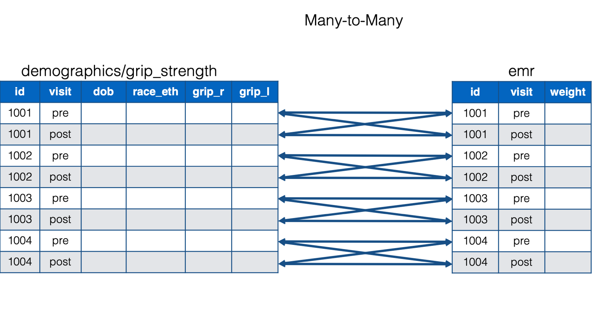
```

But in reality, study id alone no longer uniquely identifies observations in our data. Now, observations are uniquely identified by study id and visit. For example, `1001` _and_ `pre` are a unique observation, `1001` _and_ `post` are a unique observation, `1002` _and_ `pre` are a unique observation, and so on. We now have two key columns that identify unique observations. And once we give that information to `left_join`, the relationship between the data frames becomes a one-to-one relationship. In other words, each observation (defined by `id` _and_ `visit`) in one data frame is related to no more than one observation (defined by `id` _and_ `visit`) in the other data frame.

```{r echo=FALSE}
knitr::include_graphics("img/05_part_data_management/08_multiple_data_frames/one_to_one_emr.png")
```

Here is how we tell `left_join()` to merge our data frames by `id` _and_ `visit`:

```{r}
demographics %>% 
  left_join(grip_strength, by = "id") %>% 
  left_join(emr, by = c("id", "visit"))
```

👆**Here's what we did above:**

* We used `dplyr`'s `left_join()` function to perform a one-to-many merge of the `demographics` data frame with the `grip_strength` data frame. Then, we used `left_join()` again to perform a one-to-one merge of the combined `demographics`/`grip_strength` data frame with the `emr` data frame.

* We told `left_join()` that it needed to match the values in the `id` key column _and_ the values in the `visit` key column in order to align the rows in the combined `demographics`/`grip_strength` data frame with the `emr` data frame.

We now have a robust set of tools we can use to work with data that is stored in more than one data frame – a common occurrence in epidemiology!


<!--chapter:end:chapters/05_part_data_management/08_multiple_data_frames.Rmd-->

# Restructuring data frames

<!--
Use elapsed time as an example of long to wide?
-->

We've already seen data frames with a couple of different structures, but we haven't explicitly discussed those structures yet. When I say structure, I basically mean the way the data is organized into columns and rows. Traditionally, data are described as being organized in one of two ways:    

1. With a **person-level**, or **wide**, structure. In person-level data, each person (observational unit) has one observation (row) and a separate column contains data for each measurement. For example:

```{r echo=FALSE, fig.cap="Baby weights at 3, 6, 9 , and 12 months."}
knitr::include_graphics("img/05_part_data_management/10_restructuring/wide1.png")
```

2. With a **person-period**, or **long**, structure. In the person-period data structure each person (observational unit) has multiple observations – one for each measurement occasion.

```{r echo=FALSE, fig.cap="Baby weights at 3, 6, 9 , and 12 months. Babies 1001 and 1002 only."}
knitr::include_graphics("img/05_part_data_management/10_restructuring/long1.png")
```

<p class="note"> 🗒**Side Note:** Often, people are our observational unit in epidemiology. However, our observational units could also be schools, states, or air quality monitors. It’s the entity from which we are gathering data.</p>

In some cases, only the person-level data structure will practically make sense. For example, the table below contains the sex, weight, length, head circumference, and abdominal circumference for eight newborn babies measured cross-sectionally (i.e., at one point in time) at birth.

```{r echo=FALSE, fig.cap="Various measurements take at birth for 8 newborn babies."}
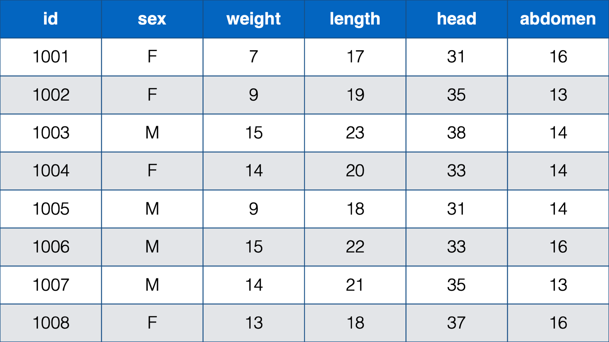
```

In this table, each baby has one observation (row) and a separate column contains data for each measurement. Further, each measurement is only taken on _one_ occasion. There really is no other structure that makes sense for this data.

For contrast, the next table below is also person-level data. It contains the weight in pounds for eight babies at ages 3 months, 6 months, 9 months, and 12 months. 

```{r echo=FALSE, fig.cap="Baby weights at 3, 6, 9 , and 12 months"}
knitr::include_graphics("img/05_part_data_management/10_restructuring/wide1.png")
```

Notice that each baby still has one, and only one, row. This time, however, there are only 2 measurements -- sex and weight. Sex is measured on one occasion, but weight is measured on four occasions, and a _new column_ is created in the data frame for each subsequent measure of weight. So, although each baby has a single _row_ in the data, they really have four _observations_ (i.e., measurement occasions). **Notice that this is the first time that we've explicitly drawn a distinction between a row and an observation.** Further, unlike the first table we saw, this table could actually be structured in a different way.

An alternative, and often preferable, data structure for data with repeated measures is the person-period, or long, data structure. Below, we look at the baby weights again. In the interest of saving space, we’re only looking at the first two babies from the previous table of data. 

```{r echo=FALSE, fig.cap="Baby weights at 3, 6, 9 , and 12 months. Babies 1001 and 1002 only."}
knitr::include_graphics("img/05_part_data_management/10_restructuring/long2.png")
```

Notice that each baby in the person-period table has four rows – one for each weight measurement. Also notice that there is a new variable in the person-period data that explicitly records time (i.e., `months`). 

<p class="note"> 🗒**Side Note:** Let's quickly learn a couple of new terms: _time-varying_ and _time-invariant_ variables. In the data above, `sex` is time invariant. It remains constant over all 4 measurement occasions for each baby. Not only that, but for all intents and purposes it isn’t really _allowed_ to change. The `weight` variable, on the other hand, is time varying. The weight values change over time. And not only do they change, but the amount, rate, and/or shape of their change may be precisely what this researcher is interested in.</p>

Below, we can compare the person-level version of the baby weight data to the person-period version of the baby weight data. I'm only including babies 1001 and 1002 in the interest of saving space. As you can see, given the same data, the person-level structure is wider (i.e., more _columns_) than the person-period data and the person-period structure is longer (i.e., more _rows_) than the person-level data. That's why the two structures are sometimes referred to as wide and long respectively.

```{r echo=FALSE, fig.cap="Comparing wide and long data for the babies 1001 and 1002."}
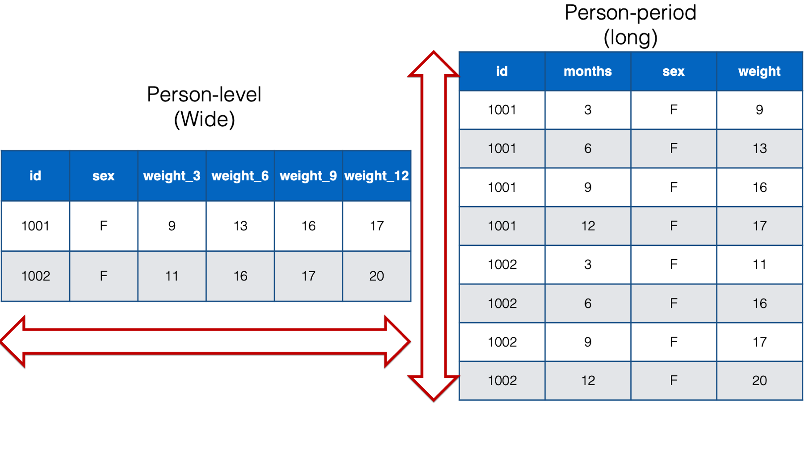
```

Ok, so this data _can_ be structured in either a person-level _or_ a person-period format, but which structure _should_ we use? 

Well, in general, I'm going to suggest that you use the person-period structure for the kind of longitudinal data we have above for the following reasons:

1. It contains an explicit time variable. The time information may be descriptively interesting on its own, or we may need to include it in our statistical models. In fact, many longitudinal analyses will require that our data have a person-period structure. For example, mixed models, gereralized estimating equations, and survival analysis.

2. The person-period structure can be more efficient when we the intervals between repeated measures vary across observational units. For example, in the data above the baby weight columns were named `weight_3`, `weight_6`, `weight_9`, and `weight_12`, which indicated each baby's weight at a 3-month, 6-month, 9-month, and 12-month checkup. However, what if the study needed a more precise measure of each baby's age. Let's say that we needed to record each baby's weight at their precise age in days at each checkup. That might look something like the following if structured in a person-level format:

```{r echo=FALSE, fig.cap="Baby weights at age in days. Babies 1001 and 1002 only."}
knitr::include_graphics("img/05_part_data_management/10_restructuring/days_wide.png")
```

Notice all the missing data in this format -- even with only two babies. For example, baby 1001 had her first check-up at 36 days old. She was 9 lbs. Baby 1002, however, didn't have her first checkup until she was 84 days old. So, baby 1002 has a missing value for `weight_36`. That pattern continues throughout the data. Now, just try to imagine what this would look like for tens, hundreds, or thousands of babies. It would be a mess! By contrast, the person-period version of this data is much more efficient. In fact, it looks almost identical to the first person-period version of this data:

```{r echo=FALSE, fig.cap="Baby weights at age in days. Babies 1001 and 1002 only."}
knitr::include_graphics("img/05_part_data_management/10_restructuring/days_long.png")
```

3. For essentially the same reasons already discussed above, the person-period format is better suited for handling time-varying predictors. In the baby weight data, the only predictor variable (other than time) was sex, which is time invariant. Regardless of which structure we use, sex only requires one column in the data frame because it never changes. However, imagine a scenario where we also collect height and information about diet at each visit. Using a person-level structure to store these variables would have the same limitations that we already discussed above (i.e., no explicit measure of time, incompatibility with many analysis techniques, and potentially inefficient storage).

4. Many of the "tidyverse" packages we use in this book (e.g., `dplyr` and `ggplot2`) assume, or at least work best, with data organized in a person-period, or long, format. 

So, does this mean that we should _never_ organize our data frames in a person-level format? Of course not! There are going to be some occasions when there are advantages to organizing our data frames in a person-level format. For example:

1. Many people prefer the person-level format during the data entry process because it can require less typing. Thinking about our baby weight data above, we would only need to type one new value at each checkup (i.e., weight) if the data is organized in a person-level format. However, if the data is organized in a person-period format, we have to type three new values (i.e., id, sex, and weight). This limitation grows with the number of time-invariant variables in the data.

2. There are some analyses that will require that our data have a person-level structure. For example, the traditional ANOVA and MANOVA techniques assume the wide format.

3. There are times when our data is easier to manipulate when it is organized in a person-level format.

4. There are times when it's advantageous to restructure statistical results from a longer format to a wider format to present them in the most effective way possible.

Luckily, we rarely have to choose one structure or the other in an absolute sense. The `tidyr` package generally makes it very easy for us to restructure ("reshape" is another commonly used term) our data frames from wide to long and back again. This allows us to organize our data in the manner that is best suited for the particular task at hand. Let's go ahead and take a look at some examples.

## The tidyr package

The tools we will use for restructuring our data will primarily come from a package we haven't used before in this book -- `tidyr`. If you haven't already done so, and you'd like to follow along, please install and load `tidyr`, `dplyr`, and `ggplot2` now.

```{r message=FALSE, warning=FALSE}
library(tidyr)
library(dplyr)
library(ggplot2)
```

## Pivoting longer

In epidemiology, it's common for data that we analyze to be measured on multiple occasions. It's also common for repeated measures data to be entered into a spreadsheet or database in such a way that each new measure is a new column. We saw an example of this above: 

```{r, echo=FALSE, fig.cap="Baby weights at 3, 6, 9 , and 12 months"}
knitr::include_graphics("img/05_part_data_management/10_restructuring/wide1.png")
```

We already concluded that this data has a person-level (wide) structure. As discussed above, many techniques that we may want to use to analyze this data will require us to restructure it to a person-period format. Let's go ahead and walk through a demonstration of how do that. We will start by simulating this data in R:

```{r}
babies <- tibble(
  id       = 1001:1008,
  sex      = c("F", "F", "M", "F", "M", "M", "M", "F"),
  weight_3  = c(9, 11, 17, 16, 11, 17, 16, 15),
  weight_6  = c(13, 16, 20, 18, 15, 21, 17, 16),
  weight_9  = c(16, 17, 23, 21, 16, 25, 19, 18),
  weight_12 = c(17, 20, 24, 22, 18, 26, 21, 19)
) %>% 
  print()
```

Now, let's use the `pivot_longer()` function to restructure the `babies` data frame to a person-period format:

```{r}
babies_long <- babies %>% 
  pivot_longer(
    cols         = starts_with("weight"),
    names_to     = "months",
    names_prefix = "weight_",
    values_to    = "weight"
  ) %>% 
  print()
```

👆**Here's what we did above:**

* We used `tidyr`'s `pivot_longer()` function to restructure the `babies` data frame from person-level (wide) to person-period (long).

* You can type `?pivot_longer` into your R console to view the help documentation for this function and follow along with the explanation below.

* The first argument to the `pivot_longer()` function is the `data` argument. You should pass the name of the data frame you want to restructure to the `data` argument. Above, we passed the `babies` data frame to the `data` argument using a pipe operator.

* The second argument to the `pivot_longer()` function is the `cols` argument. You should pass the name of the columns you want to make longer to the `cols` argument. Above, we passed the names of the four weight columns to the `cols` argument. The `cols` argument actually accepts tidy-select argument modifiers. We first discussed tidy-select argument modifiers in the [chapter on subsetting data frames](the-select-function). In the example above, we used the `starts_with()` tidy-select modifier to simplify our code. Instead of passing each column name directly to the `cols` argument, we asked `starts_with()` to pass the name of any column that has a column name that starts with the word "weight" to the `cols` argument.

* The third argument to the `pivot_longer()` function is the `names_to` argument. You should pass the `names_to` argument a character string or character vector that tells `pivot_longer()` what you want to name the column that will contain the previous column names that were pivoted. By default, the value passed to the `names_to` argument is `"name"`. We passed the value `"months"` to the `names_to` argument. This tells `pivot_longer()` what to name the column that contains the names of the previous column names. If that seems really confusing, I'm with you. Unfortunately, I don't currently know a better way to write it, but I will _show_ you what the `names_to` argument does below.

* The fourth argument to the `pivot_longer()` function is the `names_prefix` argument. You should pass the `names_prefix` argument a regular expression that tells `pivot_longer()` what to remove from the start of each of the previous column names that we pivoted. By default, the value passed to the `names_prefix` argument is `NULL` (i.e., it doesn't remove anything). We passed the value `"weight_"` to the `names_prefix` argument. This tells `pivot_longer()` that we want to remove the character string "weight_" from the start of each of the previous column names that we pivoted. For example, removing "weight_" from "weight_3" results in the value "3", removing "weight_" from "weight_6" results in the value "6", and so on.  Again, I will show you what the `names_prefix` argument does below.

* The eighth argument (we left the 5th, 6th, and 7th arguments at their default values) to the `pivot_longer()` function is the `values_to` argument. You should pass the `values_to` argument a character string or character vector that tells `pivot_longer()` what you want to name the column that will contain the values from the columns that were pivoted. By default, the value passed to the `values_to` argument is `"value"`. We passed the value `"weight"` to the `values_to` argument. This tells `pivot_longer()` what to name the column that contains values from the columns that were pivoted. I will demonstrate what the `values_to` argument does below as well.

### The names_to argument

The official help documentation for `pivot_longer()` says that the value passed to the `names_to` argument should be "a string specifying the name of the column to create from the data stored in the column names of data." I don't blame you if you feel like that's a little bit difficult to wrap your head around. Let's take a look at the result we get when we don't adjust the value passed to the `names_to` argument:

```{r}
babies %>% 
  pivot_longer(
    cols = starts_with("weight")
  )
```

```{r echo=FALSE}
knitr::include_graphics("img/05_part_data_management/10_restructuring/names_to.png")
```

As you can see, when we only pass a value to the `cols` argument, `pivot_longer()` creates a new column that contains the column names from the data frame passed to the `data` argument, that are being pivoted into long format. By default, `pivot_longer()` names that column `name`. However, that name isn't very informative. We will go ahead and change the column name to "months" because we know that this column will eventually contain month values. We do so by passing the value `"months"` to the `names_to` argument like this:

```{r}
babies %>% 
  pivot_longer(
    cols     = starts_with("weight"),
    names_to = "months"
  )
```

### The names_prefix argument

The official help documentation for `pivot_longer()` says that the value passed to the `names_prefix` argument should be "a regular expression used to remove matching text from the start of each variable name." Passing a value to this argument can be really useful when column names actually contain data values, which was the case above. Take the column name "weight_3" for example. The "weight" part is truly a column name -- it tells us what the values in that column are. They are weights. The "3" part is actually a separate data value meaning "3 months." If we can remove the "weight_" part of the column name, then what remains is a useful column of information -- time measured in months. Passing the value "weight_" to the `names_prefix` argument does exactly that.

```{r}
babies %>% 
  pivot_longer(
    cols         = starts_with("weight"),
    names_to     = "months",
    names_prefix = "weight_"
  )
```

Now, the value passed to the `names_prefix` argument can be any regular expression. So, we could have written a more complicated, and flexible, regular expression like this:

```{r}
babies %>% 
  pivot_longer(
    cols         = starts_with("weight"),
    names_to     = "months",
    names_prefix = "\\w+_"
  )
```

The regular expression above would have removed _any_ word characters followed by an underscore. However, in this case, the value `"weight_"` is straightforward and gets the job done.

### The values_to argument

The official help documentation for `pivot_longer()` says that the value passed to the `values_to` argument should be "a string specifying the name of the column to create from the data stored in cell values." All that means is that we use this argument to name the column that contains the values that were pivoted. 

```{r echo=FALSE}
knitr::include_graphics("img/05_part_data_management/10_restructuring/values_to.png")
```

By default, `pivot_longer()` names that column "value." However, we will once again want a more informative column name in our new data frame. So, we'll go ahead and change the column name to "weight" because that's what the values in that column are -- weights. We do so by passing the value `"weight"` to the `values_to` argument like this:

```{r}
babies %>% 
  pivot_longer(
    cols         = starts_with("weight"),
    names_to     = "months",
    names_prefix = "weight_",
    values_to    = "weight"
  )
```

### The names_transform argument

As one little final touch on the data restructuring at hand, it would be nice to coerce the `months` column from type character to type integer. We already know how to do this with `mutate()`:

```{r}
babies %>% 
  pivot_longer(
    cols         = starts_with("weight"),
    names_to     = "months",
    names_prefix = "weight_",
    values_to    = "weight"
  ) %>% 
  mutate(months = as.integer(months))
```

However, we can also do this directly inside the `pivot_longer()` function by passing a list of column names paired with type coercion functions. For example:

```{r}
babies %>% 
  pivot_longer(
    cols            = starts_with("weight"),
    names_to        = "months",
    names_prefix    = "weight_",
    names_transform = list(months = as.integer),
    values_to       = "weight"
  )
```

👆**Here's what we did above:**

* We coerced the `months` column from type character to type integer by passing the value `list(months = as.integer)` to the `names_transform` argument. The list passed to `names_transform` should contain one or more column names paired with a type coercion function. The column name and type coercion function should be paired using an equal sign. Multiple pairs should be separated by commas.

### Pivoting multiple sets of columns

Let's add a little layer of complexity to our situation. Let's say that our `babies` data frame also includes each baby's length in inches measured at each visit:

```{r}
set.seed(123)
babies <- tibble(
  id       = 1001:1008,
  sex      = c("F", "F", "M", "F", "M", "M", "M", "F"),
  weight_3  = c(9, 11, 17, 16, 11, 17, 16, 15),
  weight_6  = c(13, 16, 20, 18, 15, 21, 17, 16),
  weight_9  = c(16, 17, 23, 21, 16, 25, 19, 18),
  weight_12 = c(17, 20, 24, 22, 18, 26, 21, 19),
  length_3  = c(17, 19, 23, 20, 18, 22, 21, 18),
  length_6  = round(length_3 + rnorm(8, 2, 1)),
  length_9  = round(length_6 + rnorm(8, 2, 1)),
  length_12 = round(length_9 + rnorm(8, 2, 1)),
) %>% 
  print()
```

Here is what we want our final data frame to look like:

```{r}
babies %>% 
  pivot_longer(
    cols      = c(-id, -sex),
    names_to  = c(".value", "months"),
    names_sep = "_"
  )
```

Next, we'll walk through getting to this result step-by-step.

We are once again starting with a person-level data frame, and we once again want to restructure it to a person-period data frame. This is the result we get if we use the same code we previously used to restructure the data frame that didn't include each baby's length:

```{r}
babies_long <- babies %>% 
  pivot_longer(
    cols         = starts_with("weight"),
    names_to     = "months",
    names_prefix = "weight_",
    values_to    = "weight"
  ) %>% 
  print()
```

Because we aren't passing any of the `length_` columns to the `cols` argument, `pivot_longer()` is treating them like the other time-invariant variables (i.e., `id` and `sex`). Their values are just being recycled across every row within each id. So, let's add the `length_` columns to the `cols` argument and see what happens:

```{r}
babies_long <- babies %>% 
  pivot_longer(
    cols         = c(-id, -sex),
    names_to     = "months",
    names_prefix = "weight_",
    values_to    = "weight"
  ) %>% 
  print()
```

👆**Here's what we did above:**

* We passed the `weight_` and `length_` columns to the `cols` argument _indirectly_ by passing the value `c(-id, -sex)`. Basically, this tells `pivot_longer()` that we would like to pivot every column _except_ `id` and `sex`. 

Now, we are pivoting both the `weight_` columns and the `length_` columns. That's an improvement. However, we obviously still don't have the result we want. 

Remember that the value passed to the `names_prefix` argument is used to remove matching text from the start of each variable name. Passing the value `"weight_"` to the `names_prefix` argument made sense when all of our pivoted columns began with the character sting "weight_". Now, however, some of our pivoted columns begin with the character string "length_". That's why we are still seeing values in the `months` column like `length_3`, `length_6`, and so on. 

Now, your first instinct might be to just add `"length_"` to the `names_prefix` argument. Unfortunately, that doesn't work:

```{r}
babies_long <- babies %>% 
  pivot_longer(
    cols         = c(-id, -sex),
    names_to     = "months",
    names_prefix = c("weight_", "length_"),
    values_to    = "weight"
  ) %>% 
  print()
```

Instead, we need to drop the `names_prefix` argument altogether before we can move forward to the correct solution:

```{r}
babies_long <- babies %>% 
  pivot_longer(
    cols      = c(-id, -sex),
    names_to  = "months",
    values_to = "weight"
  ) %>% 
  print()
```

Additionally, not all the values in the third column (i.e., `weight`) are weights. Half of those values are lengths. So, we also need to drop the `values_to` argument:

```{r}
babies_long <- babies %>% 
  pivot_longer(
    cols     = c(-id, -sex),
    names_to = "months"
  ) %>% 
  print()
```

Believe it or not, we are actually pretty close to accomplishing our goal. Next, we need to somehow tell `pivot_longer()` that the column names we are pivoting contain a description of the values (i.e., heights and weights) _and_ time values (i.e., 3, 6, 9, and 12 months). Notice that in all cases, the description and the time value are separated by an underscore. It turns out that we can use the `names_sep` argument to give `pivot_longer()` this information.

### The names_sep argument

Let's start by simply passing the adding the `names_sep` argument to the `pivot_longer()` function and pass it the value that separates our description and our time value:

```{r error=TRUE}
babies_long <- babies %>% 
  pivot_longer(
    cols      = c(-id, -sex),
    names_to  = "months",
    names_sep = "_"
  ) %>% 
  print()
```

And we get an error. The reason we get an error can be seen in the following figure:

```{r echo=FALSE}
knitr::include_graphics("img/05_part_data_management/10_restructuring/names_sep1.png")
```

We are asking `pivot_longer()` to break up each column name (e.g., `weight_3`) at the underscore. That results in creating two separate character strings. In this case, the character string "weight" and the character string "3". However, we only passed one value to the `names_to` argument -- `"months"`. So, which character string should `pivot_longer()` put in the `months` column? Of course, we know that the answer is "3", but `pivot_longer()` doesn't know that. 

So, we have to pass two values to the names_to argument. But, what values should we pass?

```{r echo=FALSE}
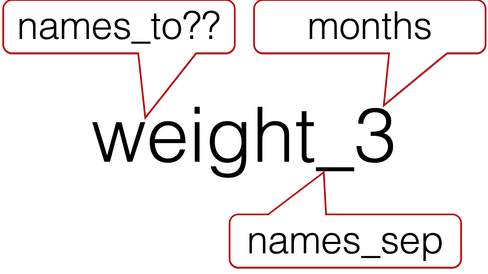
```

We obviously want to character string that comes after the underscore to be called "months". However, we can't call the character string in front of the underscore "weight" because this column isn't just identifying rows that contain weights. Similarly, we can't call the character string in front of the underscore "length" because this column isn't just identifying rows that contain lengths. For lack of a better idea, let's just call it "measure".

```{r}
babies_long <- babies %>% 
  pivot_longer(
    cols      = c(-id, -sex),
    names_to  = c("measure", "months"),
    names_sep = "_"
  ) %>% 
  print()
```

That sort of works. Except, what we really want is one row for each combination of id and months, each containing a value for weight and length. Instead, we have two rows for each combination of id and months. One set of rows contains weights and the other set of rows contains lengths.

What we really need is for `pivot_longer()` to make `weight` one column and `length` a separate column, and then put the appropriate values from `value` under each. We can do this with the `.value` special value.

### The .value special value

The official help documentation for `pivot_longer()` says that the `.value` special value "indicates that [the] component of the name defines the name of the column containing the cell values, overriding values_to." Said another way, `.value` tells `pivot_longer()` the character string in front of the underscore is the value description. Further, `.value` tells `pivot_longer()` to create a new column for each unique character string that is in front of the underscore.

```{r echo=FALSE}
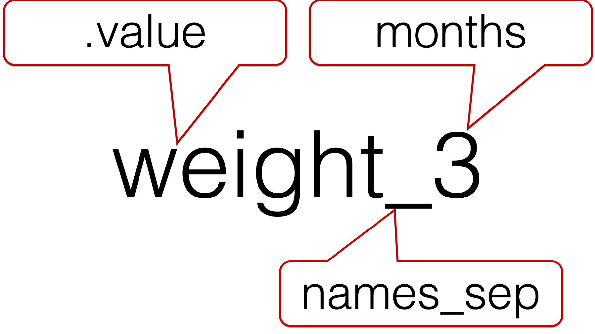
```

Now, let's add the `.value` special value to our code:

```{r}
babies_long <- babies %>% 
  pivot_longer(
    cols      = c(-id, -sex),
    names_to  = c(".value", "months"),
    names_sep = "_",
    names_transform = list(months = as.integer)
  ) %>% 
  print()
```

And that is exactly the result we wanted. However, there was one little detail we didn't cover. How does `.value` know to create a new column for each unique character string that is in _front_ of the underscore. Why didn't it create a new column for each unique character string that is _behind_ the underscore?

The answer is simple. It knows because of the ordering we used in the value we passed to the `names_to` argument. If we changed the order to `c("months", ".value")`, `pivot_longer()` would have created a new column for each unique character string that is _behind_ the underscore. Take a look:

```{r error=TRUE}
babies %>% 
  pivot_longer(
    cols      = c(-id, -sex),
    names_to  = c("months", ".value"),
    names_sep = "_"
  )
```

So, be careful about the ordering of the values you pass to the `names_to` argument.

### Why person-period?

Why might we want the `babies` data in this person-period format? Well, as we discussed above, there are many analytic techniques that require our data to be in this format. Unfortunately, those techniques are beyond the scope of this chapter. However, this person-period format is still necessary for something as simple as plotting baby weight against baby height as we've done in the scatter plot below:

```{r}
babies_long %>% 
  mutate(months = factor(months, c(3, 6, 9, 12))) %>% 
  ggplot() +
    geom_point(aes(weight, length, color = months)) +
    labs(
      x = "Weight (Pounds)",
      y = "Length (Inches)",
      color = "Age (Months)"
    ) +
    theme_classic()
```

## Pivoting wider

As previously discussed, the person-period, or long, data structure is _usually_ preferable for longitudinal data analysis. However, there are times when the person-level data structure is preferable, or even necessary. Further, there are times when we have tables of analysis results, as opposed than actual data values, that we need to restructure for ease of interpretation. We will demonstrate how to do both below. 

We'll start by learning how to restructure, or reshape, our person-period `babies_long` data frame back to a person-level format. As a reminder, here is what our `babies_long` data frame currently looks like:

```{r}
babies_long
```

As you probably guessed, we will use `tidyr`'s `pivot_wider()` function to restructure the data:

```{r}
babies <- babies_long %>% 
  pivot_wider(
    names_from  = "months",
    values_from = c("weight", "length")
  ) %>% 
  print()
```

👆**Here's what we did above:**

* We used `tidyr`'s `pivot_wider()` function to restructure the `babies_long` data frame from person-period (long) to person-level (wide).

* You can type `?pivot_wider` into your R console to view the help documentation for this function and follow along with the explanation below.

* The first argument to the `pivot_wider()` function is the `data` argument. You should pass the name of the data frame you want to restructure to the `data` argument. Above, we passed the `babies_long` data frame to the `data` argument using a pipe operator.

* The third argument (we left the second argument at its default value) to the `pivot_wider()` function is the `names_from` argument. You should pass this argument the name of a column, or columns, that exists in the data frame you passed to the `data` argument. The column(s) you choose should contain values that you want to become column names in the wide data frame. That's a little be confusing, and our example above is sort of subtle, so here is a more obvious example:

```{r}
df <- tribble(
  ~id, ~measure, ~lbs_inches,
  1, "weight", 9,
  1, "length", 17,
  2, "weight", 11,
  2, "length", 19 
) %>% 
  print()
```

* In the data frame above, the values in the column named `measure` are what we want to use as column names in our wide data frame. Therefore, we would pass `"measure"` to the `names_to` argument of `pivot_wider()`:

```{r}
df %>% pivot_wider(
  names_from  = "measure",
  values_from = "lbs_inches"
)
```

* Our `babies` example was more subtle in the sense that the long version of our data frame already had columns named `weight` and `height`. However, we essentially wanted to _change_ those column names by _adding_ the values from the column named `months` to the current column names. So, `weight` to `weight_3`, with the "3" coming from the column `months`.

* The ninth argument (we left the fourth through eighth arguments at their default value) to the `pivot_wider()` function is the `values_from` argument. You should pass this argument the name of a column, or columns, that exists in the data frame you passed to the `data` argument. The column(s) you choose should contain values for the new columns you want to create in the new wide data frame. In our `babies` data frame, we wanted to pull the values from the `weight` and `length` columns respectively. 

* The combination of arguments (i.e., `names_from  = "months"` and `values_from = c("weight", "length")`) that we passed to `pivot_wider()` above essentially said, "make new columns from each combination of the values in the column named `months` and the column names `weight` and `length`. So, `weight_3`, `weight_6`, etc. Then, the values you put in each column should come from the intersection of `month` and `weight` (for the `weight_#`) columns, or `month` and `length` (for the `length_#`) columns.

### Why person-level?

Why might we want the `babies` data in this person-level format? Well, as we discussed above, there are a handful analytic techniques that require our data to be in this format. Unfortunately, those techniques are beyond the scope of this chapter. However, this person-level format is still useful for something as simple as calculating descriptive statistics about time-invariant variables. For example, the number of female and male babies in our data frame:

```{r}
babies %>% 
  count(sex)
```

## Pivoting summary statistics

What do I mean by pivoting "summary statistics?" Well, in all the examples above we were manipulating the actual data values that were gathered about our observational units -- babies. However, the ultimate goal of doing this kind of data management is typically to analyze it. In other words, we can often learn more from collapsing our data into a relatively small number of summary statistics than we can by viewing the actual data values themselves. Having said that, not all ways of organizing our summary statistics are equally informative. Or, perhaps it's more accurate to say that not all ways of organizing our summary statistics convey the information with equal efficiency.

There are probably a near-infinite number of possible examples of manipulating summary statistics that we could discuss. Obviously, I can't cover them all. However, I will walk through two examples below that are intended to give you a feel for what we are talking about.

### Pivoting summary statistics wide to long

Our first example is a pretty simple one. Let's say that we are working with our person-level `babies` data frame. In this scenario, we want to calculate the mean and standard deviation of weight at the 3, 6, 9, and 12-month follow-up visits. We might do the calculations like this:

```{r}
mean_weights <- babies %>% 
  summarise(
    mean(weight_3),
    sd(weight_3),
    mean(weight_6),
    sd(weight_6),
    mean(weight_9),
    sd(weight_9),
    mean(weight_12),
    sd(weight_12),
  ) %>% 
  print()
```

<p class="note"> 🗒**Side Note:** This is not the most efficient way to do this analysis. We are only doing the analysis in this way to give us an excuse to use `pivot_longer()` to restructure some summary statistics.</p>

By default, the mean and standard deviation are organized in a single row, side-by-side. One issue with organizing our results this way is that is that they don't all fit on the screen at the same time. However, even if they did, it's much more difficult for our brains to quickly scan the numbers and make comparisons across months when the summary statistics are organized this way than when they are stacked on top of each other. Take a look for yourself below:

```{r}
mean_weights %>% 
  pivot_longer(
    cols = everything(),
    names_to = c(".value", "measure", "months"),
    names_pattern = "(\\w+)\\((\\w+)_(\\d+)"
  )
```

👆**Here's what we did above:**

* We used `tidyr`'s `pivot_longer()` function to restructure our data frame of summary statistics from wide to long.

* The only new argument above is the `names_pattern` argument. You should pass a regular expression to the `names_pattern` argument. This regular expression will tell `pivot_longer()` how to break up the original column names and repurpose them for the new column names. The regular expression we used above is not intended to be the main lesson here. But, I'm sure that some of you will be curious about how it works, so I will try to briefly explain it below. In a way, this is how R interprets the regular expression above (feel free to skip if you aren't interested):

```{r}
stringr::str_match("mean(weight_3)", "(\\w+)\\((\\w+)_(\\d+)")
```

* We haven't used parentheses yet in our regular expressions, but they create something called "capturing groups." Instead of saying, "look for this _one thing_ in the character string," we say "look for these _groups of things_ in this character string."

* The first capture group in the regular expression is `(\\w+)`. This tells R to look for one or more word characters. The value that R grabs as part of this first capture group is given under the second result (i.e., `[,2]`) above -- `"mean"`.

* Then, the regular expression tells R to look for a literal open parenthesis `\\(`. However, this parenthesis is not included in a capture group. In this case, it's really just used as landmark to tell R where the first capture group stops, and the second capture group starts.

* The second capture group in the regular expression is another `(\\w+)`. This again tells R to look for one or more word characters, but this time, R starts look for the word characters _after_ the open parenthesis. The value that R grabs as part of the second capture group is given under the third result (i.e., `[,3]`) above -- `"weight"`.

* Next, the regular expression tells R to look for a literal underscore `_`. However, this underscore is not included in a capture group. In this case, it's really just used as landmark to tell R where the second capture group stops, and the third capture group starts.

* The third and final capture group in the regular expression is `(\\d+)`. This tells R to look for one or more digits after the underscore. The value that R grabs as part of the third capture group is given under the third result (i.e., `[,4]`) above -- `"3"`.

* Finally, R matches the values it grabs in each of the three capture groups with the three values passed to the `names_to` argument, which are `".value"`, `"measure"`, and `"months"`. We already discussed the .value special value above. Similar to before, .value will create a new column for each unique value captured in the first capture group. In this case, `mean` and `sd`. Next, the values captured in the second capture group are assigned to a column named `measure`. Finally, the values captured in the third capture group are assigned to a column named `months`.

### Pivoting summary statistics long to wide

This next example comes from an actual project I was involved with. As a part of this project, researchers asked the parents of elementary-aged children about series of sun protection behaviors. Below, I'm not simulating the data that was collected. Rather, I am simulating a small part of the results of one of the early descriptive analyses we conducted:

```{r}
summary_stats <- tribble(
  ~period, ~behavior, ~value, ~n, ~n_total, ~percent,
  "School Year Weekends", "Long sleeve shirt", "Never",	6, 78,	8,	
  "School Year Weekends", "Long sleeve shirt", "Seldom", 16, 78,	21,	
  "School Year Weekends", "Long sleeve shirt", "Sometimes",	33,	78,	42,	
  "School Year Weekends", "Long sleeve shirt", "Often", 17,	78,	22,	
  "School Year Weekends", "Long sleeve shirt", "Always", 6,	78,	8,	
  "School Year Weekends", "Long Pants", "Never", 5,	79,	6,	
  "School Year Weekends", "Long Pants", "Seldom",	15,	79, 19,	
  "School Year Weekends", "Long Pants", "Sometimes", 32, 79, 41,	
  "School Year Weekends", "Long Pants", "Often", 19, 79, 24,	
  "School Year Weekends", "Long Pants", "Always",	8, 79, 10,	
  "Summer", "Long sleeve shirt", "Never",	9, 80, 11,	
  "Summer", "Long sleeve shirt", "Seldom", 18, 80, 22,	
  "Summer", "Long sleeve shirt", "Sometimes", 31,	80,	39,	
  "Summer", "Long sleeve shirt", "Often",	14,	80,	18,	
  "Summer", "Long sleeve shirt", "Always", 8,	80, 10,	
  "Summer", "Long Pants", "Never", 7,	76, 9,	
  "Summer", "Long Pants", "Seldom",	16,	76,	21,	
  "Summer", "Long Pants", "Sometimes", 27,	76,	36,	
  "Summer", "Long Pants", "Often", 18, 76,	24,	
  "Summer", "Long Pants", "Always", 8, 76,	11
) %>% 
  print()
```

* The `period` column contains the time frame the researchers were asking the parents about. It can take the values `School Year Weekends` or `Summer`.

* The `behavior` column contains each of the specific behaviors that the researchers were interested in. Above, `behavior` takes only the values `Long sleeve shirt` and `Long Pants`. 

* The `value` column contains the possible answer choices that parents could select from.

* The `n` column contains the number of parents who selected the response in `value` for the behavior in `behavior` and the time frame in `period`. For example, `n` = 6 in the first row indicates that six parents said that their child never wears long sleeve shirts on weekends during the school year.

* The `n_total` column is the sum of `n` for each period/behavior combination. 

* The `percent` column contains the percentage of parents who selected the response in `value` for the behavior in `behavior` and the time frame in `period`. For example, `percent` = 8 in the first row indicates that 8 percent of parents said that their child never wears long sleeve shirts on weekends during the school year.

These results are relatively difficult to scan and get a feel for. In particular, these researchers were interested in whether or not engagement in these protective behaviors differed by period. In other words, were kids more likely to wear long sleeve shirts on weekends during the school year than they were during the summer? It's difficult to answer that quickly with the way the summary statistics above are organized. We can improve the interpretability of our results by combining `n` and `percent` into a single character string, and pivoting them wider so that the two periods are presented side-by-side:

```{r}
summary_stats %>% 
  # Combine n and percent into a single character string
  mutate(n_percent = paste0(n, " (", percent, ")")) %>% 
  # We no longer need n, n_total, percent
  select(-n:-percent) %>% 
  pivot_wider(
    names_from = "period",
    values_from = "n_percent"
  )
```

The layout of our summary statistics above is now much more compact. Further, it's much easier to compare behaviors between the two time periods. For example, we can see that a slightly higher percentage of people (11%) reported that their child never wears a long sleeve shirt during the summer as compared to weekends during the school year (8%).

## Tidy data

As I said above, the person-level (wide) and person-period (long) data structures are the _traditional_ way of classifying how longitudinal (or repeated measures) data are organized. In reality, however, structuring data in a way that is most conducive to analysis is often more complicated than the examples above would lead you to believe. Simply thinking about data structure in terms of wide and long sometimes leaves us with an incomplete model for how to take many real-world data sets and prepare them for conducting analysis in an efficient way. In his seminal paper on the topic, Hadley Wickham, provides us with a set of guidelines for systematically (re)structuring our data in a way that is consistent, and generally optimized for analysis. He refers to this process as "tidying" our data, and to the resulting data frame as "tidy data". @Wickham2014-gy

<p class="note"> 🗒**Side Note:** If you are interested, you can download the entire article for free from the [Journal of statistical Software here](https://www.jstatsoft.org/article/view/v059i10).</p>

The three basic guidelines for tidy data are:

1. Each variable (i.e., measurement or characteristic about the observational unit) must have its own column.

2. Each observation (i.e. the people, places, or things we are interested in characterizing or comparing _at a particular occasion_) must have its own row.   

3. Each value must have its own cell. 

According to the tidy data philosophy, any data frame that does not conform to the guidelines above is considered "messy" data. In my opinion, it's kind of hard to read the guidelines above and wrap your head around what tidy data is. I think it's actually easier to get a _feel_ for tidy data by looking at examples of data that are not tidy. Let's go ahead and take a look at a few examples:

### Each variable must have its own column

What does it mean for every variable to have its own column? Well, let's say we interested the rate of neural tube defects by state. So, we pull some data from a government website that looks like this:

```{r}
births_ntd <- tibble(
  state   = rep(c("CA", "FL", "TX"), each = 2),
  outcome = rep(c("births", "neural tube defects"), 3),
  count   = c(454920, 318, 221542, 155, 378624, 265)
) %>% 
  print()
```

In this case, there is only one `count` column, but that column really contains two variables: the count of live births and the count of neural tube defects. Further, the `outcome` column doesn't really contain "data." In this case, the values stored in the `outcome` column are really data _labels_. We can tidy this data using the `pivot_wider()` function:

```{r}
births_ntd %>% 
  pivot_wider(
    names_from  = "outcome",
    values_from = "count"
  )
```

Now, `births` and `neural tube defects` each have their own column. It might also be a good idea to remove the spaces from `neural tube defects` and make it clear that the values in each column are counts. But, I'm going to leave that to you.

Another common violation of the "each variable must have its own column" guideline is when column names contain data values. We already saw an example of this above. Our `weight_` and `length_` column names actually had time data embedded in them. 

In the example below, each column name contains two data values (i.e., sex and year); however, neither variable currently has a column in the data:

```{r}
births_sex <- tibble(
  state  = c("CA", "FL", "TX"),
  f_2018 = c(222911, 108556, 185526),
  m_2018 = c(232009, 112986, 193098)
) %>% 
  print()
```

In this case, we can tidy the data by giving `sex` and `year` a column, and giving the other data values (i.e., count of live births) a more informative column name. We can do so with the `pivot_longer()` function:

```{r}
births_sex %>% 
  pivot_longer(
    cols      = -state,
    names_to  = c("sex", "year"),
    names_sep = "_",
    values_to = "births"
  )
```

### Each observation must have its own row

Our person-level `babies` data frame above also violated this guideline. 

```{r}
babies
```

Notice that each baby in this data has one `row`, but that each row actually contains four unique observations -- at 3, 6, 9, and 12 months. As another example, let's say that we've once again downloaded birth count data from a government website. This time, we are interested in investigating the absolute change in live births over the decade between 2010 and 2020. That data may look like this:

```{r}
births_decade <- tibble(
  state  = c("CA", "FL", "TX"),
  `2010` = c(409428, 199388, 340762),
  `2020` = c(454920, 221542, 378624)
) %>% 
  print()
```

In this example, each state has a single row, but multiple observations. We can once again tidy this data using the `pivot_longer()` function:

```{r}
births_decade %>% 
  pivot_longer(
    cols      = -state,
    names_to  = "year",
    values_to = "births"
  )
```

### Each value must have its own cell

In my personal experience, violations of this guideline are rarer than violations of the first two guidelines. However, let's imagine a study where we are monitoring the sleeping habits of newborn babies. Specifically, we are interested in the range of lengths of time they sleep. That data could be recorded the following way:

```{r}
baby_sleep <- tibble(
  id          = c(1001, 1002, 1003),
  sleep_range = c(".5-2", ".75-2.4", "1.1-3.8")
) %>% 
  print()
```

In this case, we will use a new function to tidy our data. We will use `tidyr`'s `separate()` function to spread these values out across two columns:

```{r}
baby_sleep %>% 
  separate(
    col     = sleep_range,
    into    = c("min_hours", "max_hours"),
    sep     = "-",
    convert = TRUE
  )
```

👆**Here's what we did above:**

* We used `tidyr`'s `separate()` function to tidy the `baby_sleep` data frame.

* You can type `?separate` into your R console to view the help documentation for this function and follow along with the explanation below.

* The first argument to the `separate()` function is the `data` argument. You should pass the name of the data frame you want to restructure to the `data` argument. Above, we passed the `baby_sleep` data frame to the `data` argument using a pipe operator.

* The second argument to the `separate()` function is the `col` argument. You should pass the name of the column contain the data values that you want to split up to the `col` argument.

* The third argument to the `separate()` function is the `into` argument. You should pass the `into` argument a character vector of column names you want to give the new columns that will be created when you break apart the values in the `col` column.

* The fourth argument to the `separate()` function is the `sep` argument. You should pass the `sep` argument a character string that tells `separate()` what character separates the individual values in the `col` column.

* Finally, we passed the value `TRUE` to the `convert` argument. In doing so, we asked `separate()` to coerce the values in `min_hours` and `max_hours` from character type to numeric type.

## The complete() function

The final function we're going to discuss in this chapter is `tidyr`'s `complete()` function. After we pivot data, we will sometimes notice "holes" in the data. This typically happens to me in the context of time data. When this happens, we can use the `complete()` function to fill-in the holes in our data. 

This next example didn't actually involve pivoting, but it did come from another actual project that I was involved with, and nicely demonstrates the importance of filling-in holes in the data. As a part of this project, researchers were interested in increasing the number of reports of elder mistreatment that were being made to Adult Protective Services (APS) by emergency medical technicians (EMTs) and paramedics. Each row in the raw data the researchers received from the emergency medical services provider represented a report to APS. Let's say that the data from the week of October 28th, 2019 to November 3rd, 2019 looked something like this:

```{r}
reports <- tibble(
  date      = as.Date(c(
    "2019-10-29", "2019-10-29", "2019-10-30", "2019-11-02", "2019-11-02"
  )),
  emp_id    = c(5123, 2224, 5153, 9876, 4030),
  report_id = c("a8934", "af2as", "jzia3", "3293n", "dsf98")
) %>% 
  print()
```

Where:

* `date` is the date the report was made to APS.

* `emp_id` is a unique identifier for each EMT or paramedic.

* `report_id` is the unique identifier APS assigns to the incoming report.

Let's say that the researchers were interested in calculating the average number of reports per day. We would first need to count the number of reports made each day:

```{r}
reports %>% 
  count(date)
```

Next, we might naively go ahead and calculate the mean of n like this:

```{r}
reports %>% 
  count(date) %>% 
  summarise(mean_reports_per_day = mean(n))
```

And conclude that the mean number of reports made per day was 1.67. However, there is a problem with this strategy. Our study period wasn't three days long. It was seven days long (i.e., October 28th, 2019 to November 3rd, 2019). Because there weren't any reports made on 2019-10-28, 2019-10-31, 2019-11-01, or 2019-11-03 they don't exist in our count data. But, their absence doesn't represent a missing or unknown value. Their absence represents zero reports being made on that day. We need to explicitly encode that information in our count data if we want to accurately calculate the mean number of reports per day. In this tiny little simulated data frame, it's trivial to do this calculation manually. However, the real data set was collected over a three-year period. That's over 1,000 days that would have to be manually accounted for. 

Luckily, we can use `tidyr`'s `complete()` function, along with the `seq.Date()` function we learned in the chapter on working with date variables, to fill-in the holes in our count data in an automated way:

```{r}
reports %>% 
  count(date) %>% 
  complete(
    date = seq.Date(
      from = as.Date("2019-10-28"), 
      to = as.Date("2019-11-03"), 
      by = "days"
    )
  )
```

👆**Here's what we did above:**

* We used `tidyr`'s `complete()` function to fill-in the holes in the dates between 2019-10-28 and 2019-11-03.

* You can type `?complete` into your R console to view the help documentation for this function and follow along with the explanation below.

* The first argument to the `complete()` function is the `data` argument. You should pass the name of the data frame that contains the column you want to fill-in to the `data` argument. Above, we passed the `reports` data frame to the `data` argument using a pipe operator.

* The second argument to the `complete()` function is the `...` argument. This is where you tell the `complete()` function which column you want to fill-in, or expand, and give it instructions for doing so. Above, we asked `complete()` to make sure that each day between 2019-10-28 and 2019-11-03 was included in our `date` column. We did so by asking `complete()` to set the date column equal to the returned values from the `seq.Date()` function. 

Notice that all the days during our period of interest are now included in our count data. However, by default, the value for each new row of the `n` column is set to `NA`. But, as we already discussed, `n` isn't missing for those days, it's zero. We can change those values from `NA` to zero by adjusting the value we pass to the `fill` argument. We'll do that next:

```{r}
reports %>% 
  count(date) %>% 
  complete(
    date = seq.Date(
      from = as.Date("2019-10-28"), 
      to = as.Date("2019-11-03"), 
      by = "days"
    ),
    fill = list(n = 0)
  )
```

Now, we can finally calculate the correct value for mean number of reports made per day during the week of October 28th, 2019 to November 3rd, 2019:

```{r}
reports %>% 
  count(date) %>% 
  complete(
    date = seq.Date(
      from = as.Date("2019-10-28"), 
      to = as.Date("2019-11-03"), 
      by = "days"
    ),
    fill = list(n = 0)
  ) %>% 
  summarise(mean_reports_per_day = mean(n))
```

That concludes the chapter on restructuring data. For now, it also concludes the part of this book devoted to the basics of data management. At this point, you should have the tools you need to tackle the majority of the common data management tasks that you will come across. Further, there's a good chance that the packages we've used in this part of the book will contain a solution for the remaining data management challenges that we haven't explicitly covered. In the next part of the book, we will dive into repeated operations.

<!--chapter:end:chapters/05_part_data_management/10_restructuring_data_frames.Rmd-->

# (PART) Repeated Operations {-}

<!-- This Rmd just creates a part heading in the table of contents -->

<!--chapter:end:chapters/07_part_repeated_operations/00_part_repeated_operations.Rmd-->

# Introduction to repeated operations

<!--
We rarely _have_ to use the techniques that we will learn in this part of the book to accomplish a given task.
-->

This part of the book is all about the DRY principle. We first discussed the DRY principle in the [section on creating and modifying multiple columns](#adding-or-modifying-multiple-columns). As a reminder, [DRY](https://en.wikipedia.org/wiki/Don%27t_repeat_yourself) is an acronym for "Don't Repeat Yourself." But, what does that mean? 

```{r echo=FALSE}

```

Well, think back to the conditional operations chapter. In that chapter, I compared conditional statements in R with asking my daughter to wear a raincoat if it's raining. To extend the analogy, now imagine that I wake up one morning and say, "please wear your raincoat if it's raining today - July 1st." Then, I wake up the next morning and say, "please wear your raincoat if it's raining today - July 2nd." Then, I wake up the next morning and say, "please wear your raincoat if it's raining today - July 3rd." And, that pattern continues every morning until my daughter moves out of the house. That's a ton of repetition!! Alternatively, wouldn't it be much more efficient for me to just say, "please wear your raincoat on every day that it rains," just once?

The same logic applies to our R code. We often want to do the same (or very similar) thing multiple times in our R code. This can result in many lines of code that are very similar and unnecessarily repetitive. This unnecessary repetition can occur in all phases of our projects.

```{r echo=FALSE}
knitr::include_graphics("img/01_part_getting_started/02_what_is_r/competencies_overview.png")
```

For example:

* We may need to write R code to import many different data sets. In such a situation, it isn't uncommon for the code that imports the data to be the same for each data set -- only the file name changes. 

* We may need to recode certain values in multiple columns of our data frame to missing. In such a situation, it isn't uncommon for the code that recodes the values to be the same for each column -- only the column name changes. 

* We may need to calculate the same set of statistical measures for many different variables in our data frame. In such a situation, the code to calculate the statistical measures doesn't change -- only the variables being passed to the code. 

* We may need to create a table of results that includes statistical measures for many different variables in our data frame. In such a situation, the code to prepare and combine the statistical measures into a single table of results doesn't change -- only the variables being passed to the code. 

In all of these situations we are asking our R code to do something repeatedly, or **iteratively**, but with a slight change each time. We can write a separate chunk of code for each time we want to do that thing, or we can write one chunk of code that asks R to do that thing over and over. Writing code in the later way will often result in R programs that:

* *Are more concise.* In other words, we can write one line of code (or relatively few lines of code) instead of many lines of code. Further, such code generally removes "visual clutter" (i.e., the repetitive stuff) that can obscure what the overarching _intent_ of the code.

* *Contain fewer typos.* Every keystroke we make is an opportunity to press the wrong key. If we are writing fewer lines of code, then it logically follows that we are making fewer keystrokes and creating fewer opportunities to hit the wrong key. Similarly, if we are repeatedly copying and pasting code, we are creating opportunities to accidently forget to change a column name, date, file name, etc. in the pasted code.

* *Are easier to maintain.* If we want to change our code, we only have to change it in one place instead of many places. For example, let's say that we write R code to check the weather every morning. Later, we decide that we want our R code to check the weather _and_ the traffic every morning. Would you rather add that additional request (i.e., check the traffic) to a separate line of code for each day or to the one line of code that asks R to check the weather every day?

<p class="note"> 🗒**Side Note:** When I say "one line of code" above, I mean it figuratively. The code we use to remove unnecessary repetition will not necessarily be on one line; however, it should generally require less typing than code that includes unnecessary repetition.</p>

So, writing code that is highly repetitive is usually not a great idea, and this part of the book is all about teaching you to recognize and remove unnecessary repetition from your code. As is often the case with R, there are multiple different methods we can use.

## Multiple methods for repeated operations in R

In the chapters that follow, we will learn four different methods for removing unnecessary repetition from our code. They are:

```{r echo=FALSE, fig.cap="Four methods for removing unnecessary repetition."}
knitr::include_graphics("img/07_part_repeated_operations/01_intro/stickers.png")
```

1. Writing our own functions that can be reused throughout our code.

2. Using `dplyr`'s column-wise operations.

3. Using for loops.

4. Using the `purrr` package.

It's also important to recognize that each of the methods above can be used independently or in combination with each other. We will see examples of both.

## Tidy evaluation

In case it isn't obvious to you by now, I'm a fan of the `tidyverse` packages (i.e., `dplyr`, `ggplot2`, `tidyr`, etc.). I use `dplyr`, in particular, in virtually every single one of my R programs. The use of **non-standard evaluation** is just one of the many aspects of the `tidyverse` packages that I am a fan of. As a reminder, among other things, [non-standard evaluation](#non-standard-evaluation) is what allows us to refer to data frame columns without using dollar sign or bracket notation (i.e., data masking). However, non-standard evaluation will create some challenges for us when we try to use functions from `tidyverse` packages inside of functions and for loops that we write ourselves. Therefore, we will have to learn more about _tidy evaluation_ if we want to continue to use the `tidyverse` packages that we've been using throughout the book so far.

Tidy evaluation can be tricky even for experienced R programmers to wrap their heads around at first. Therefore, I don't think it will be productive for us to try to learn a lot about the theory behind, or internals of, tidy evaluation as a standalone concept. Instead, in the chapters that follow, I plan to sprinkle in just enough tidy evaluation to accomplish the task at hand. As a little preview, a telltale sign that we are using tidy evaluation will be when you start seeing the `{{` (said, curly-curly) operator and the `!!` (said, bang bang) operator. Hopefully, this will all make more sense in the next chapter when we start to get into some examples. 

I recommend the following resources for those of you who are interested in developing a deeper understanding of `rlang` and tidy evaluation:

1. Programming with dplyr. Accessed July 31, 2020. https://dplyr.tidyverse.org/articles/programming.html

2. Wickham H. Introduction. In: Advanced R. Accessed July 31, 2020. https://adv-r.hadley.nz/metaprogramming.html

Now, let's learn how to write our own functions!🤓

<!--chapter:end:chapters/07_part_repeated_operations/01_introduction.Rmd-->

# Writing functions

<!--

-->

Have you noticed how we will often calculate the same statistical measures for many different variables in our data? For example, let's say that we have some pretty standard data about some study participants that looks like this: 

```{r message=FALSE}
library(dplyr)
```

```{r}
study <- tibble(
  age       = c(32, 30, 32, 29, 24, 38, 25, 24, 48, 29, 22, 29, 24, 28, 24, 25, 
                25, 22, 25, 24, 25, 24, 23, 24, 31, 24, 29, 24, 22, 23, 26, 23, 
                24, 25, 24, 33, 27, 25, 26, 26, 26, 26, 26, 27, 24, 43, 25, 24, 
                27, 28, 29, 24, 26, 28, 25, 24, 26, 24, 26, 31, 24, 26, 31, 34, 
                26, 25, 27, NA),
  age_group = c(2, 2, 2, 1, 1, 2, 1, 1, 2, 1, 1, 1, 1, 1, 1, 1, 1, 1, 1, 1, 1, 
                1, 1, 1, 2, 1, 1, 1, 1, 1, 1, 1, 1, 1, 1, 2, 1, 1, 1, 1, 1, 1, 
                1, 1, 1, 2, 1, 1, 1, 1, 1, 1, 1, 1, 1, 1, 1, 1, 1, 2, 1, 1, 2, 
                2, 1, 1, 1, NA),
  gender    = c(2, 1, 1, 2, 1, 1, 1, 2, 2, 2, 1, 1, 2, 1, 1, 1, 1, 2, 2, 1, 1, 
                1, 1, 2, 1, 1, 2, 1, 1, 1, 2, 1, 1, 2, 2, 1, 2, 2, 1, 2, 2, 1, 
                1, 1, 1, 1, 1, 1, 1, 2, 2, 1, 1, 1, 1, 2, 2, 1, 1, 2, 1, 2, 1, 
                1, 1, 2, 1, NA),
  ht_in     = c(70, 63, 62, 67, 67, 58, 64, 69, 65, 68, 63, 68, 69, 66, 67, 65, 
                64, 75, 67, 63, 60, 67, 64, 73, 62, 69, 67, 62, 68, 66, 66, 62, 
                64, 68, NA, 68, 70, 68, 68, 66, 71, 61, 62, 64, 64, 63, 67, 66, 
                69, 76, NA, 63, 64, 65, 65, 71, 66, 65, 65, 71, 64, 71, 60, 62, 
                61, 69, 66, NA),
  wt_lbs    = c(216, 106, 145, 195, 143, 125, 138, 140, 158, 167, 145, 297, 146, 
                125, 111, 125, 130, 182, 170, 121, 98, 150, 132, 250, 137, 124, 
                186, 148, 134, 155, 122, 142, 110, 132, 188, 176, 188, 166, 136, 
                147, 178, 125, 102, 140, 139, 60, 147, 147, 141, 232, 186, 212, 
                110, 110, 115, 154, 140, 150, 130, NA, 171, 156, 92, 122, 102, 
                163, 141, NA),
  bmi       = c(30.99, 18.78, 26.52, 30.54, 22.39, 26.12, 23.69, 20.67, 26.29, 
                25.39, 25.68, 45.15, 21.56, 20.17, 17.38, 20.8, 22.31, 22.75, 
                26.62, 21.43, 19.14, 23.49, 22.66, 32.98, 25.05, 18.31, 29.13, 
                27.07, 20.37, 25.01, 19.69, 25.97, 18.88, 20.07, NA, 26.76, 
                26.97, 25.24, 20.68, 23.72, 24.82, 23.62, 18.65, 24.03, 23.86, 
                10.63, 23.02, 23.72, 20.82, 28.24, NA, 37.55, 18.88, 18.3, 
                19.13, 21.48, 22.59, 24.96, 21.63, NA, 29.35, 21.76, 17.97, 
                22.31, 19.27, 24.07, 22.76, NA),
  bmi_3cat  = c(3, 1, 2, 3, 1, 2, 1, 1, 2, 2, 2, 3, 1, 1, 1, 1, 1, 1, 2, 1, 1, 
                1, 1, 3, 2, 1, 2, 2, 1, 2, 1, 2, 1, 1, NA, 2, 2, 2, 1, 1, 1, 1, 
                1, 1, 1, 1, 1, 1, 1, 2, NA, 3, 1, 1, 1, 1, 1, 1, 1, NA, 2, 1, 
                1, 1, 1, 1, 1, NA)
) %>% 
  mutate(
    age_group = factor(age_group, labels = c("Younger than 30", "30 and Older")),
    gender    = factor(gender, labels = c("Female", "Male")),
    bmi_3cat  = factor(bmi_3cat, labels = c("Normal", "Overweight", "Obese"))
  ) %>% 
  print()
```

When we have data like this, it's pretty common to calculate something like the number of missing values, mean, median, min, and max for all of the continuous variables. So, we might use the following code to calculate these measures:

```{r}
study %>% 
  summarise(
    n_miss = sum(is.na(age)),
    mean   = mean(age, na.rm = TRUE),
    median = median(age, na.rm = TRUE),
    min    = min(age, na.rm = TRUE),
    max    = max(age, na.rm = TRUE)
  )
```

Great! Next, we want to do the same calculations for `ht_in`. Of course, we don't want to type everything in that code chunk again, so we copy and paste. And change all the instances of `age` to `ht_in`:

```{r}
study %>% 
  summarise(
    n_miss = sum(is.na(ht_in)),
    mean   = mean(ht_in, na.rm = TRUE),
    median = median(ht_in, na.rm = TRUE),
    min    = min(ht_in, na.rm = TRUE),
    max    = max(ht_in, na.rm = TRUE)
  )
```

Now, let's do the same calculations for `wt_lbs` and `bmi`. Again, we will copy and paste, and change the variable name as needed:

```{r}
study %>% 
  summarise(
    n_miss = sum(is.na(wt_lbs)),
    mean   = mean(wt_lbs, na.rm = TRUE),
    median = median(wt_lbs, na.rm = TRUE),
    min    = min(ht_in, na.rm = TRUE),
    max    = max(wt_lbs, na.rm = TRUE)
  )
```

```{r}
study %>% 
  summarise(
    n_miss = sum(is.na(bmi)),
    mean   = mean(bmi, na.rm = TRUE),
    median = median(bmi, na.rm = TRUE),
    min    = min(bmi, na.rm = TRUE),
    max    = max(bmi, na.rm = TRUE)
  )
```

And, we're done! 

However, there's a problem. Did you spot it? We accidently forgot to change `ht_in` to `wt_lbs` in the min calculation above. Therefore, our results incorrectly indicate that the minimum weight was 58 lbs. Part of the reason for making this mistake in the first place is that there is a fair amount of visual clutter in each code chunk. What I mean is that it's hard to quickly scan each chunk and see only the elements that are _changing_. 

Additionally, each code chunk was about 8 lines of code. Even with only 4 variables, that's still 32 lines. I think we can improve on this code by writing our own function. That’s exactly what we will do in the code chunk below. For now, don’t worry if you don’t understand _how_ the code works. We will dissect it later. 

```{r}
continuous_stats <- function(var) {
  study %>% 
    summarise(
      n_miss = sum(is.na({{ var }})),
      mean   = mean({{ var }}, na.rm = TRUE),
      median = median({{ var }}, na.rm = TRUE),
      min    = min({{ var }}, na.rm = TRUE),
      max    = max({{ var }}, na.rm = TRUE)
    )
}
```

Now, let’s _use_ the function we just created above to once again calculate the descriptive measures we are interested in.

```{r}
continuous_stats(age)
```

```{r}
continuous_stats(ht_in)
```

```{r}
continuous_stats(wt_lbs)
```

```{r}
continuous_stats(bmi)
```

Pretty cool, right? We reduced 32 lines of code to 13 lines of code! Additionally, it's very easy to quickly scan our code and see that the only thing changing from chunk-to-chunk is the name of the variable that we are passing to our function and ensure that it is _actually_ changing. As an added bonus, because we've strategically given our function an informative name, the intent behind what we are trying to accomplish is clearer now -- we are calculating summary statistics about our continuous variables.

I hope that this little demonstration has left you feeling like writing your own functions can be really useful, and maybe even kind of fun. I'm going to get into the nuts and bolts of _how_ to write your own functions shortly, but first I want to briefly discuss _when_ to write your own functions.

## When to write functions

I'll again quote Hadley Wickham, prolific R developer and teacher. He says, "You should consider writing a function whenever you’ve copied and pasted a block of code more than twice (i.e. you now have three copies of the same code)." @Grolemund2017-qp I completely agree with this general sentiment. I'm only going to amend my advice to you slightly. Specifically, you should consider using an appropriate method for repeating operations whenever you’ve copied and pasted a block of code more than twice. In other words, _writing a function_ is not the _only_ option available to us when we notice ourselves copying and pasting code.

## How to write functions

Now, the fun part -- writing our own functions. I know that writing functions can seem intimidating to many people at first. However, the basics are actually pretty simple. 

### The function() function

It all starts with the `function()` function. This is how you tell R that you are about to write your own function.

```{r echo=FALSE, fig.cap="The function() function."}
knitr::include_graphics("img/07_part_repeated_operations/02_functions/function.png")
```

If you think back to the chapter on [Speaking R's language](#functions), we talked about the analogy that is sometimes drawn between functions and factories. 

```{r echo=FALSE, fig.cap="A factory making bicycles."}
knitr::include_graphics("img/01_part_getting_started/04_speaking_r/factory1.png")
```

To build on that analogy, the`function()` function is sort of like the factory building. Without it, there is no factory, but an empty building alone doesn't do anything interesting:

```{r error=TRUE}
function()
```

In order to build our bicycles, we need to add some workers and equipment to our empty factory building. The R function equivalent to the workers and equipment is the **function body.**

```{r echo=FALSE, fig.cap="The function body."}
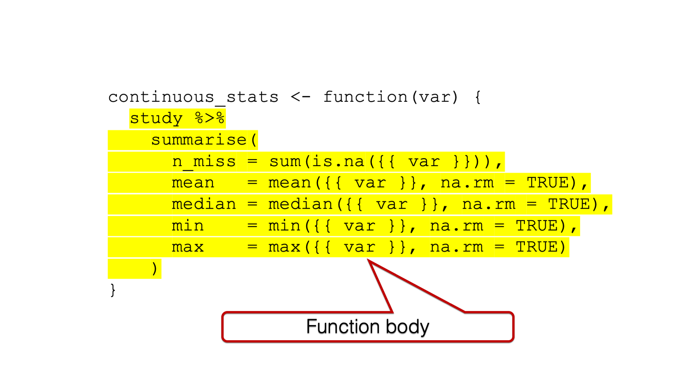
```

And just like the factory needs doors to contain our workers and equipment and keep them safe (I'm admittedly reaching a little on this one, but just go with it), our function body needs to be wrapped with curly braces.

```{r echo=FALSE, fig.cap="Curly braces around the function body."}
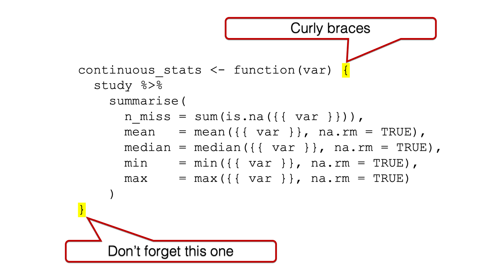
```

We already talked about how the values we pass to **arguments** are raw material inputs that go into the factory.

```{r echo=FALSE, fig.cap="The function argument(s)."}
knitr::include_graphics("img/07_part_repeated_operations/02_functions/arguments.png")
```

In the bicycle factory example, the raw materials were steel and rubber. In the function displayed above, the raw materials are variables.

If we want to be able to call our function (i.e., use it) later, then we have to have some way to refer to it. Therefore, we will assign our function a name.

```{r echo=FALSE, fig.cap="The named function."}
knitr::include_graphics("img/07_part_repeated_operations/02_functions/name.png")
```

### The function writing process

So, we have some idea about _why_ writing our own functions can be a good idea. We have some idea about _when_ to write functions (i.e., don't repeat yourself... more than twice). And, we now know what the basic components of functions are. They are the `function()` function, the function body (wrapped in curly braces), the function argument(s), and the function name. But, if this is your first time being exposed to functions, then you may still be feeling like you aren't quite sure how to get started with writing your own. So, here's a little example of how my function writing workflow typically goes. 

First, let's simulate some new data for this example. Let's say we have two data frames that contain first and last names:

```{r}
people_1 <- tribble(
  ~id_1, ~name_first_1, ~name_last_1, ~street_1,
  1,     "Easton",      NA,           "Alameda",
  2,     "Elias",       "Salazar",    "Crissy Field",
  3,     "Colton",      "Fox",        "San Bruno",
  4,     "Cameron",     "Warren",     "Nottingham",
  5,     "Carson",      "Mills",      "Jersey",
  6,     "Addison",     "Meyer",      "Tingley",
  7,     "Aubrey",      "Rice",       "Buena Vista",
  8,     "Ellie",       "Schmidt",    "Division",
  9,     "Robert",      "Garza",      "Red Rock",
  10,    "Stella",      "Daniels",    "Holland"
) %>% 
  print()
```

```{r}
people_2 <- tribble(
  ~id_2, ~name_first_2, ~name_last_2, ~street_2,
  1,     "Easton",      "Stone",      "Alameda",
  2,     "Elas",        "Salazar",    "Field",
  3,     NA,            "Fox",        NA,
  4,     "Cameron",     "Waren",      "Notingham",
  5,     "Carsen",      "Mills",      "Jersey",
  6,     "Adison",      NA,           NA,
  7,     "Aubrey",      "Rice",       "Buena Vista",
  8,     NA,            "Schmidt",    "Division",
  9,     "Bob",         "Garza",      "Red Rock",
  10,    "Stella",      NA,           "Holland"
) %>% 
  print()
```

In this scenario, we want to see if first name, last name, and street name match at each ID between our data frames. More specifically, we want to combine the two data frames into a single data frame and create three new dummy variables that indicate whether first name, last name, and address match respectively. Let's go ahead and combine the data frames now:

```{r}
people <- people_1 %>% 
  bind_cols(people_2) %>% 
  print()
```

Now, our first attempt at creating the dummy variables might look something like this:

```{r}
people %>% 
  mutate(
    name_first_match = name_first_1 == name_first_2,
    name_last_match  = name_last_1 == name_last_2,
    street_match     = street_1 == street_2
  ) %>% 
  # Order like columns next to each other for easier comparison
  select(id_1, starts_with("name_f"), starts_with("name_l"), starts_with("s"))
```

Let’s take a moment to review the results we got. In row 1 we see that "Easton" and "Easton" match, and the value for `name_first_match` is `TRUE`. So far, so good. In row 2, we see that "Elias" and "Ela" do not match, and the value for `name_first_match` is `FALSE`. That is also the result we wanted. In row 3, we see that "Colton" and "NA" do not match; however, the value in `name_first_match` is `NA`. In this case, this is not the result we want. We have a problem. That brings us to the first step in my typical workflow.

#### I spot a need for a function

In some cases, the need I spot is purely repetitive code -- like the example at the beginning of this chapter. In other cases, like this one, a built-in R function is not giving me the result I want. 

Here is the basic problem in this particular case:

```{r}
1 == 1
```

```{r}
1 == 2
```

```{r}
1 == NA
```

```{r}
NA == 2
```

```{r}
NA == NA
```


The equality operator (`==`) always returns `NA` when one, or both, of the values being tested is `NA`. Often, that is exactly the result we want. In this case, however, it is not. Fortunately, we can get the result we want by writing our own function. That brings us to step 2 in the workflow.

#### I make the code work for one specific case

Don't try to solve the entire problem for every case right out of the gate. Instead, solve one problem for a specific case, and then build on that win! Let's start by trying to figure out how to get the result we want for `name_first_match` in row 3 of our example data.

```{r}
"Colton" == NA
```

This is essentially what we already had above. But, we want to change our result from `NA` to `FALSE`. Let's start by saving the result to an object that we can manipulate:

```{r}
result <- "Colton" == NA
result
```

So, now the value returned by the equality comparison is saved to an object named `result`. Let's go ahead and use a conditional operation to change the value of `result` to `FALSE` when it is initially `NA`, and leave it alone otherwise:

```{r}
result <- "Colton" == NA
result <- if_else(is.na(result), FALSE, result)
result
```

Alright! This worked! At least, it worked for this case. That brings us to step 3 in the workflow.

#### I make the solution into a "function"

How do I do that? Well, first I start with a skeleton of the function components we discussed above. They are the `function()` function, the function body (wrapped in curly braces), and the function name. At the moment, we don't have any arguments. I'll explain why soon.

```{r eval=FALSE}
is_match <- function() {
  
}
```

Then, I literally copy the solution from above and paste it into the function body, making sure to indent the code. Next, we need to run the code chunk to _create_ the function. After doing so, you should see the function appear in your global environment. Keep in mind, this _creates_ the function so that we can use it later, but the function isn't immediately _run_.

```{r}
is_match <- function() {
  result <- "Colton" == NA
  result <- if_else(is.na(result), FALSE, result)
  result
}
```

Now, let's test out our shiny new function. To _run_ the function, we can simply type the function name, with the parentheses, and run the code chunk.

```{r}
is_match()
```

And, it works! When we ask R to run a function we are really asking R to run the _code_ in the _body_ of the function. In this case, we know that the code in the body of the function results in the value `FALSE` because this results in `FALSE`:

```{r}
result <- "Colton" == NA
result <- if_else(is.na(result), FALSE, result)
result
```

And all we did was stick that code in the function body. Said another way, this:

```{r eval=FALSE}
result <- "Colton" == NA
result <- if_else(is.na(result), FALSE, result)
result
```

and this:

```{r eval=FALSE}
is_match()
```

mean essentially the same thing to R now. I hope that makes sense. Stick with me even if it still isn't quite clear. We'll get more practice soon. 

At this point, you may be wondering about the function arguments, and why there aren't any. Well, we can try passing a value to our `is_match()` function. How about we pass the name "Easton" from the first row of our example data above:

```{r error=TRUE}
is_match(name = "Easton")
```

But, we get an error. R doesn't know what the `name` argument is or what to do with the values we are passing to it. That's because we never said anything about any arguments when we created the `is_match()` function. We left the parentheses where the function arguments go empty.

```{r}
is_match <- function() {
  result <- "Colton" == NA
  result <- if_else(is.na(result), FALSE, result)
  result
}
```

Let's create `is_match()` again, but this time, let's add an argument:

```{r}
is_match <- function(name) {
  result <- "Colton" == NA
  result <- if_else(is.na(result), FALSE, result)
  result
}
```

```{r}
is_match(name = "Easton")
```

Hmmm, let's add another argument and see what happens:

```{r}
is_match <- function(name_1, name_2) {
  result <- "Colton" == NA
  result <- if_else(is.na(result), FALSE, result)
  result
}
```

```{r}
is_match(name_1 = "Easton", name_2 = "Easton")
```

It looks as though the arguments we are adding don't have any effect on our returned value. That's because they don't. I oversimplified how function arguments work just a little bit in our factory analogy earlier. When we add arguments to function our definition (i.e., when we create the function) it's really more like adding a loading dock to our factory. It's a place where our factory can _receive_ raw materials. However, there still needs to be equipment inside the factory that can _use_ those raw materials. If we drop off a load of rubber at our bicycle factory, but there's no machine inside our bicycle factory that uses rubber, then we wouldn't expect dropping off the rubber to have any effect on the outputs coming out of the factory. 

We have similar situation above. We dropped the name "Easton" off at our `is_match()` function, but nothing _inside_ our `is_match()` function can _use_ the name "Easton". There's no machinery to plug that name into. That brings us to step 4 in the workflow.

#### I start generalizing the function

As it stands right now, our `is_match()` function can't accept any new names. The only result we will ever get from the current version of our `is_match()` function is the result of testing the equality between the values "Colton" and NA, and then converting that value to `FALSE`. This isn't a problem if the only values we care about comparing are "Colton" and NA, but of course, that isn't the case. We need a way to make our function work for other values too. Said another way, we need to make our function more general.

As you may have guessed already, that will require us creating an argument to receive input values _and_ a place to use those input values in the function body. Let's start by adding a `first_name` argument:

```{r}
is_match <- function(first_name) {
  result <- first_name == NA
  result <- if_else(is.na(result), FALSE, result)
  result
}
```

```{r}
is_match(first_name = "Easton")
```

👆**Here's what we did above:**

* We once again created our `is_match()` function. However, this time we created it with a single argument -- `first_name`. We didn't have to name the argument `first_name`. We could have named it anything that we can name any other variable in R. But, `first_name` seemed like a reasonable choice since the value we want to pass to this argument is a person's first name. The `first_name` argument will _receive_ the first name values that we want to pass to this function.

* We replaced the constant value "Colton" in the function body with the variable `first_name`. It isn't a coincidence that the name of the variable `first_name` matches the name of the argument `first_name`. R will take whatever value we give to the `first_name` argument and _pass_ it to the variable with a matching name inside the function body. Then, R will run the code inside the function body as though the variable _is_ the value we passed to it.

So, when we type:

```{r}
is_match(first_name = "Easton")
```

R sees:

```{r}
result <- "Easton" == NA
result <- if_else(is.na(result), FALSE, result)
result
```

It looks like our `is_match()` function is still going to return a value of `FALSE` no matter what value we pass to the `first_name` function. That's because no matter what value we pass to `result <- first_name == NA`, `result` will equal `NA`. Then, `result <- if_else(is.na(result), FALSE, result)` will change the value of `result` to `FALSE`. So, we still need to make our function more general. As you may have guessed, we can do that by adding a second argument:

```{r error=TRUE}
is_match <- function(first_name, first_name) {
  result <- first_name == first_name
  result <- if_else(is.na(result), FALSE, result)
  result
}
```

Uh, oh! We got an error. This error is telling us that each function argument must have a unique name. Let's try again:

```{r error=TRUE}
is_match <- function(first_name_1, first_name_2) {
  result <- first_name_1 == first_name_2
  result <- if_else(is.na(result), FALSE, result)
  result
}
```

```{r}
is_match(first_name_1 = "Easton", first_name_2 = "Colton")
```

Is this working or is our function still just returning `FALSE` no matter what we pass to the arguments? Let's try to pass "Easton" to `first_name_1` and `first_name_2` and see what happens:

```{r}
is_match(first_name_1 = "Easton", first_name_2 = "Easton")
```

We got a `TRUE`! That's exactly the result we wanted! Let's do one final check. Let's see what happens when we pass `NA` to our `is_match()` function:

```{r}
is_match(first_name_1 = "Easton", first_name_2 = NA)
```

Perfect! It looks like our function is finally ready to help us solve the problem we identified way back at step one. But, while we are talking about _generalizing_ our function, shouldn't we go ahead and use more general names for our function arguments? I mean, we were only using first names when we were _developing_ our function, but we are going to use our function to compare last names and street names as well. In fact, our function will compare any two values and tell us whether or not they are a match. So, let's go ahead and change the argument names to `value_1` and `value_2`:

```{r}
is_match <- function(value_1, value_2) {
  result <- value_1 == value_2  # Don't forget to change the variable names here!!
  result <- if_else(is.na(result), FALSE, result)
  result
}
```

Now, we are ready to put our function to work testing whether or not the first name, last name, and street name match at each ID between our data frames:

```{r}
people %>% 
  mutate(
    name_first_match = is_match(name_first_1, name_first_2),
    name_last_match  = is_match(name_last_1, name_last_2),
    street_match     = is_match(street_1, street_2)
  ) %>% 
  # Order like columns next to each other for easier comparison
  select(id_1, starts_with("name_f"), starts_with("name_l"), starts_with("s"))
```

Works like a charm! Notice, however, that we still have a lot of repetition in the code above. Unfortunately, we still don't have all the tools we need to remove it. But, we will soon.

At this point in the chapter, my hope is that you are developing a feel for how to write your own functions and why that might be useful. With R, it's possible to write functions that are very complicated. But, I hope the examples above show you that functions don't have to be complicated to be useful. In that spirit, I'm hesitant to dive too much deeper into the details and technicalities of function writing at this point. However, there are a few details that I feel like I should at least mention so that you aren't caught off guard by them as you begin to write your own functions. I will touch on each below, and then wrap up this chapter with resources for those of you who wish to dive deeper.

## Giving your function arguments default values

I've been introducing new functions to you all throughout the book so far. Each time I do, I try to discuss some, or all, of the function's arguments -- including the default values that are passed to the arguments. I imagine that most of you have developed some sort of intuitive understanding of just what it meant for the argument to have a default value. However, this seems like an appropriate point in the book to talk about default arguments a little more explicitly and show you how to add them to the functions you write. 

Let's say that we want to write a function that will increase the value of a number, or set of numbers, incrementally. We may start with something like this:

```{r}
increment <- function(x) {
  x + 1
}
```

👆**Here's what we did above:**

* We _created_ our own function that will increase the value of a number, or set of numbers, incrementally. Specifically, when we pass a number to the `x` argument the value of that number plus one will be returned.

Let's go ahead and use our function now:

```{r}
increment(2)
```

👆**Here's what we did above:**

* We passed the value `2` to the `x` argument of our `increment()` function. The `x` argument then passed the value `2` to the `x` variable in the function body. Said another way, R replaced the `x` variable in the function body with the value `2`. Then, R executed the code in the function body. In this case, the code in the function body added the values `2` and `1` together. Finally, the function returned the value `3`.

Believe it or not, our simple little `increment()` function is a full-fledged R function. It is just as legitimate as any other R function we've used in this book. But, let's go ahead and add a little more to its functionality. For example, maybe we want to be able to increment by values other than just one. How might we do that?

Hopefully, your first thought was to replace the constant value `1` in the function body with a variable that can have _any_ number passed to it. That's exactly what we will do next:

```{r}
increment <- function(x, by) {
  x + by
}
```

👆**Here's what we did above:**

* We _created_ our own function that will increase the value of a number, or set of numbers, incrementally. Specifically, when we pass a number to the `x` argument the value of that number will be incremented by the value passed to the `by` argument. 

What value should `increment()` return if we pass `2` to the `x` argument and `2` to the `by` argument?

```{r}
increment(2, 2)
```

Hopefully, that's what you were expecting. But, now what happens if we don't pass any value to the `by` argument?

```{r error=TRUE}
increment(2)
```

We get an error saying that there wasn't any value passed to the `by` argument, and the `by` argument doesn't have a default value. But, we are really lazy, and it takes a lot of work to pass a value to the `by` argument every time we use the `increment()` function. Plus, we _almost_ always only want to increment our numbers by one. In this case, our best course of action is to set the default value of `by` to `1`. Fortunately for us, doing so is really easy!

```{r}
increment <- function(x, by = 1) {
  x + by
}
```

👆**Here's what we did above:**

* We _created_ our own function that will increase the value of a number, or set of numbers, incrementally. Specifically, when we pass a number to the `x` argument the value of that number will be incremented by the value passed to the `by` argument. The default value passed to the `by` argument is `1`. Said another way, R will _pretend_ that we passed the value `1` to the `by` argument if we don't explicitly pass a number other than `1` to the `by` argument.

* All we had to do to give `by` a default value was type `=` followed by the value (i.e., `1`) when we created the function.

Now let's try out our latest version of `increment()`:

```{r}
# Default value
increment(2)
```

```{r}
# Passing the value 1
increment(2, 1)
```

```{r}
# Passing a value other than 1
increment(2, 2)
```

```{r}
# Passing a vector of numbers to the x argument
increment(c(1, 2, 3), 2)
```

## The values your functions return

When we run our functions, they typically execute each line of code in the function body, one after another, starting with the first line and ending at the last line. Therefore, the value that your function _returns_ (i.e., the thing that comes out of the factory) is typically dictated by the last line of code in your function body. 

To show you what I mean, let's take another look at our `is_match()` function:

```{r}
is_match <- function(value_1, value_2) {
  result <- value_1 == value_2                     # Do this first
  result <- if_else(is.na(result), FALSE, result)  # Then this
  result                                           # Then this
}
```

Why did we type that third line of code? Afterall, that line of code isn't _doing_ anything. Well, let's see what happens if we take it out:

```{r}
is_match <- function(value_1, value_2) {
  result <- value_1 == value_2 
  result <- if_else(is.na(result), FALSE, result)
}
```

```{r}
is_match("Easton", "Easton")
```

It appears as though nothing happened! Did our function break?

Let's think about what typically happens when we use R's built-in functions. When we don't _assign_ the value returned by the function to an object, then the returned value is printed to the screen:

```{r}
sum(1, 1)
```

But, when we do assign the value returned by the function to an object, nothing is printed to the screen:

```{r}
x <- sum(1, 1)
```

The same thing is happening in our function above. The last line of our function body is assigning a value (i.e., `TRUE` or `FALSE`) to the variable `result`. Just like `x <- sum(1, 1)` didn't print to the screen, `result <- if_else(is.na(result), FALSE, result)` doesn't print to the screen when we run `is_match("Easton", "Easton")` using this version of `is_match()`.

However, we can see in the example below that result of the operations being executed inside the function body can still be assigned to an object in our global environment, and we can print the contents of that object to screen:

```{r}
x <- is_match("Easton", "Easton")
x
```

If all of that seems confusing, here is the bottom line. In general, it's a best practice for your function to print its return value to the screen. You can do this in one of three ways:

1️⃣ The value that results from the code in the last line of the function body isn't assigned to anything. We saw an example of this above with our `increment()` function:

```{r}
increment <- function(x, by = 1) {
  x + by # Last line doesn't assign the value to an object
}
```

```{r}
increment(2)
```

2️⃣ If you assign values to objects inside your function, then type the name of the object that contains the value you want your function to return on the last line of the function body. We saw an example of this with our `is_match()` function. We can also amend our `increment()` function follow this pattern:

```{r}
increment <- function(x, by = 1) {
  out <- x + by # Now we assign the value to an object
  out           # Type object name on last line of the function body 
}
```

```{r}
increment(2)
```

3️⃣ Use the `return()` function.

```{r}
increment <- function(x, by = 1) {
  out <- x + by 
  return(out)   
}
```

```{r}
increment(2)
```

So, which method _should_ you use? Well, for all but the simplest functions (like the one above) method 1 is not considered good coding practice. Method 3 may seem like it's the most explicit; however, it's actually considered best practice to use the `return()` function only when you want your function to return its value before R reaches the last line of the function body. For example, let's add another line of code to our function body that adds another `1` to the value of out:

```{r}
increment <- function(x, by = 1) {
  out <- x + by 
  out <- out + 1 # Adding an extra 1
  return(out)    # Return still in the last line
}
```

```{r}
increment(2)
```

Now, let's move `return(out)` to the second line of the function body -- above the line of code that adds an additional `1` to the value of `out`:

```{r}
increment <- function(x, by = 1) {
  out <- x + by 
  return(out)    # Return in the second line above adding an extra 1
  out <- out + 1 # Adding an extra 1
}
```

```{r}
increment(2)
```

In the example above, the last `1` wasn't added to the value of `out` because we used the `return()` function. Said another way, `increment()` returned the value of `out` "early", and the last line of the function body was never executed. 

In the example above, using the `return()` function in the way that we did obviously makes no sense. It was just meant to illustrate what the `return()` function _can_ do. The `return()` function doesn't actually become useful until we start writing more complex functions. But, because the `return()` function has the special ability to end the execution of the function body early, it's considered a best practice to only use it for that purpose. 

Therefore, in most situations, you will want to use method 2 (i.e., object name on last line) when writing your own functions.

One final note before we move on to the next section. Notice that we never used the `print()` function on the last line of our code. This was intentional. Using `print()` will give you the result you expect when you don't assign the value that your function returns to an object in your global environment:

```{r}
increment <- function(x, by = 1) {
  out <- x + by 
  print(out)   
}
```

```{r}
increment(2)
```

But, it will not give you the result you want if you do assign the value that your function returns to an object in your global environment: 

```{r}
increment <- function(x, by = 1) {
  out <- x + by 
  print(out)   
}
```

```{r}
x <- increment(2)
x
```

## Lexical scoping and functions

If you have been following along with the code above on your computer, you may have noticed that the objects we create inside our functions do not appear in our global environment. If you haven't been following along, you may want to jump on your computer really quickly for this section (or just take my word for it).

The reason the objects we created inside our functions do not appear in our global environment is that R actually has _multiple_ environments were objects can live. Additionally, R uses something called **lexical scoping rules** to look for the objects you refer to in your R code. The vast majority of the time, we won't need to concern ourselves much with any of these other environments or the lexical scoping rules. However, function writing does require us to have some minimal understanding of these concepts. At the very least, you should be aware of the following when writing your own functions:

1️⃣ Objects we create inside of functions don't live in our global environment and we can't do anything with them outside of the function we created them in. 

In the example below, we create an object named `out` inside of the `increment()` function:

```{r}
increment <- function(x, by = 1) {
  out <- x + by # Assign the value to the out object inside the function
  out           
}
```

We then use the function:

```{r}
x <- increment(2)
x
```

However, the `out` object is not available to us:

```{r error=TRUE}
out
```

2️⃣ If the function we write can't find the object it's looking for inside the function body, then it will try to find it in the global environment.

For example, let's create a new function named `add` that adds the values of `x` and `y` together in its function body. Notice, however, that there is no `y` argument to pass a value to, and that `y` is never assigned a value inside of the `add()` function:

```{r}
add <- function(x) {
  x + y
}
```

When we call the function:

```{r error=TRUE}
add(2)
```

We get an error. R can't find the object `y`. Now let's create a `y` object in our global environment:

```{r}
y <- 100
```

And call the `add()` function again:

```{r}
add(2)
```

As you can see, R wasn't able to find a value for `y` _inside_ of the function body so it looked _outside_ of the function in the global environment. This is definitely something to be aware of, but usually isn't an actual problem. 

For starters, I can't think of a good reason to add a variable to your function body without assigning it a value inside the function body or matching it to a function argument. In other words, there's generally no good reason to have variables that serve no purpose floating around inside your functions. 

If you do assign it a value inside the function, then R will not look outside of the function for a value:

```{r}
add <- function(x) {
  y <- 1
  x + y
}
```

```{r}
y <- 100
add(2)
```

Likewise, if you create the function with a matching argument, then R will not look outside of the function for a value:

```{r}
add <- function(x, y) {
  x + y
}
```

```{r error=TRUE}
y <- 100
add(2)
```

Again, this aspect of the lexical scoping rules is something to be aware of, but generally isn't a problem in practice.

## Tidy evaluation

Now that you have all the basics of function writing under your belt, let's take look at what happens when we try to write functions that use `tidyverse` package functions in the function body.

For this section, let's return to our study data we used for the first example in this chapter. As a reminder, here's what the data looks like:

```{r}
study
```

We already calculated the number of missing values, mean, median, min, and max for all of the continuous variables. So, let's go ahead and calculate the number and percent of observations for each level of our categorical variables.

We know that we have 3 categorical variables (i.e., `age_group`, `gender`, and `bmi_3cat`), and we know that we want to perform the same calculation on all of them. So, we decide to write our own function. Following the workflow we discussed earlier, our next step is to make the code work for one specific case:

```{r}
study %>% 
  count(age_group) %>% 
  mutate(percent = n / sum(n) * 100)
```

Great! Thanks to `dplyr`, we have the result we were looking for! The next step in the workflow is to make our solution into a function. Let's copy and paste our solution into a function skeleton like we did before:

```{r}
cat_stats <- function(var) {
  study %>% 
    count(age_group) %>% 
    mutate(percent = n / sum(n) * 100)
}
```

```{r}
cat_stats()
```

So far, so good! Now, let's replace `age_group` with `var` in the function body to generalize our function:

```{r}
cat_stats <- function(var) {
  study %>% 
    count(var) %>% 
    mutate(percent = n / sum(n) * 100)
}
```

```{r error=TRUE}
cat_stats(age_group)
```

Unfortunately, this doesn't work. As I said in the introduction to this part of the book, non-standard evaluation prevents us from using `dplyr` and other `tidyverse` packages inside of our functions in the same way that we might use other functions. Fortunately, the fix for this is pretty easy. All we need to do is **embrace** (i.e., wrap) the `var` variable with double curly braces:

```{r}
cat_stats <- function(var) {
  study %>% 
    count({{ var }}) %>% 
    mutate(percent = n / sum(n) * 100)
}
```

```{r}
cat_stats(age_group)
```

Now, we can use our new function on the rest of our categorical variables:

```{r}
cat_stats(gender)
```

```{r}
cat_stats(bmi_3cat)
```

This is working beautifully! However, we should probably make one final adjustment to our `cat_stats()` function. Let's say that we had another data frame with categorical variable we wanted to analyze:

```{r}
other_study <- tibble(
  id = 1:10,
  age_group = c(rep("Younger", 9), "Older"),
) %>% 
  print()
```

Now, let's pass age_group to our `cat_stats()` function again:

```{r}
cat_stats(age_group)
```

Is that the result you expected? I hope not! That's the same result we got from the original study data. Have you figured out why this happened? Take another look at our function definition:

```{r eval=FALSE}
cat_stats <- function(var) {
  study %>% 
    count({{ var }}) %>% 
    mutate(percent = n / sum(n) * 100)
}
```

We have the `study` data frame hard coded into the first line of the function body. In the same way we need a matching argument-variable pair to pass multiple different columns into our function, we need a matching argument-variable pair to pass multiple different data frames into our function. We start by adding an argument to accept the data frame:

```{r eval=FALSE}
cat_stats <- function(data, var) {
  study %>% 
    count({{ var }}) %>% 
    mutate(percent = n / sum(n) * 100)
}
```

Again, we could name this argument almost anything, but `data` seems like a reasonable choice. Then, we replace `study` with `data` in the function body to generalize our function:

```{r}
cat_stats <- function(data, var) {
  data %>% 
    count({{ var }}) %>% 
    mutate(percent = n / sum(n) * 100)
}
```

And now we can use our `cat_stats()` function on any data frame -- including the `other_study` data frame we created above:

```{r}
cat_stats(other_study, age_group)
```

We can even use it with a pipe:

```{r}
other_study %>% 
  cat_stats(age_group)
```

Some of you may be wondering why we didn't have to wrap `data` with double curly braces in the code above. Remember, we only have to use the curly braces with column names because of non-standard evaluation. More specifically, because of one aspect of non-standard evaluation called data masking. Data masking is what lets us refer to a column in a data frame without using dollar sign or bracket notation. For example, `age_group` doesn't exist in our global environment as a standalone object:

```{r error=TRUE}
age_group
```

It only exists as a part of (i.e. a column in) the `other_study` object:

```{r}
other_study$age_group
```

But the data frames themselves are not data masked. They do exist as standalone objects in our global environment:

```{r}
other_study
```

Therefore, there is no need to wrap them with double curly braces. Having said that, it doesn't appear as though doing so will hurt anything:

```{r}
cat_stats <- function(data, var) {
  {{data}} %>% 
    count({{ var }}) %>% 
    mutate(percent = n / sum(n) * 100)
}
```

```{r}
cat_stats(other_study, age_group)
```

```{r echo=FALSE}
rm(list = ls())
```

That pretty much wraps up this chapter on the basics of writing function to reduce unnecessary repetition in your R code. If you're feeling good about writing your own functions, great! If you want to dig even deeper, take a look at the [functions chapter of the Advanced R book](https://adv-r.hadley.nz/functions.html). 

If you're still feeling a little apprehensive or confused, don't feel bad. It takes most people (myself included) awhile to get comfortable with writing functions. Just remember, functions _can_ be complicated, but they don't _have_ to be. Even very simple functions can sometimes be useful. So, start simple and get more complex as your skills and confidence grow.

If you find that you've written a function that is really useful, consider saving it for use again in the future. Early on, I would just save my functions as R scripts in a folder on my computer. I could then copy and paste those functions from the scripts into my R programs as needed. Then, I learned about the `source()` function, which allowed me to use my saved functions without having to manually copy and paste them. Eventually, I learned how to make my [own packages](http://r-pkgs.had.co.nz/) that contained groups of related functions and save them to my [Github account](https://github.com/). From there, I could use my functions on any computer, and even share them with others. Finally, you can even publish your packages on [CRAN](https://cran.r-project.org/) if you want to them with the broadest possible audience.

<!--chapter:end:chapters/07_part_repeated_operations/02_writing_functions.Rmd-->

# Column-wise operations in dplyr

<!--

-->

Throughout the chapters in this book we have learned to do a really vast array of useful data transformations and statistical analyses with the help of the `dplyr` package.

```{r echo=FALSE}
knitr::include_graphics("img/07_part_repeated_operations/03_dplyr_column_wise/dplyr.png")
```

So far, however, we've always done these transformations and statistical analyses on one column of our data frame at a time. There isn't anything inherently "wrong" with this approach, but, for reasons we've already discussed, there are often advantages to telling R what you want to do one time, and then asking R to do that thing repeatedly *across* all, or a subset of, the columns in your data frame. That is exactly what `dplyr`'s `across()` function allows us to do.

There are so many ways we might want to use the `across()` function in our R programs. We can't begin to cover, or even imagine, them all. Instead, the goal of this chapter is just to provide you with an overview of the `across()` function and show you some examples of using it with `filter()`, `mutate()`, and `summarise()` to get you thinking about how you might want to use it in your R programs.

Before we discuss further, let's take a look at a quick example. The first thing we will need to do is load `dplyr`.

```{r message=FALSE}
library(dplyr, warn.conflicts = FALSE)
```

Then, we will simulate some data. In this case, we are creating a data frame that contains three columns of 10 random numbers:

```{r}
set.seed(123)
df_xyz <- tibble(
  row = 1:10,
  x   = rnorm(10),
  y   = rnorm(10),
  z   = rnorm(10)
) %>% 
  print()
```

Up to this point, if we wanted to find the mean of each column, we would probably have written code like this:

```{r}
df_xyz %>% 
  summarise(
    x_mean = mean(x),
    y_mean = mean(y),
    z_mean = mean(y)
  )
```

With the help of the `across()` function, we can now get the mean of each column like this:

```{r}
df_xyz %>%
  summarise(
    across(
      .cols  = c(x:z),
      .fns   = mean,
      .names = "{col}_mean"
    )
  )
```

Now, you might ask why this is a better approach. Fair question.

In this case, using `across()` doesn't actually reduce the number of lines of code we wrote. In fact, we wrote two additional lines when we used the `across()` function. However, imagine if we added 20 additional columns to our data frame. Using the first approach, we would have to write 20 additional lines of code inside the `summarise()` function. Using the `across()` approach, we wouldn't have to add any additional code at all. We would simply update the value we pass to the `.cols` argument.

Perhaps *more importantly*, did you notice that we "accidentally" forgot to replace `y` with `z` when we copied and pasted `z_mean = mean(y)` in the code chunk for the first approach? If not, go back and take a look. That mistake is fairly easy to catch and fix in this very simple example. But, in real-world projects, mistakes like this are easy to make, and not always so easy to catch. We are much less likely to make similar mistakes when we use `across()`.

## The across() function

The `across()` function is part of the `dplyr` package. We will always use `across()` *inside* of one of the `dplyr` verbs we've been learning about. Specifically, `mutate()`, and `summarise()`. We will not use `across()` *outside* of the `dplyr` verbs. Additionally, we will always use `across()` within the context of a data frame (as opposed to a vector, matrix, or some other data structure).

To view the help documentation for `across()`, you can copy and paste `?dplyr::across` into your R console. If you do, you will see that `across()` has four arguments. They are:

1️⃣`.cols`. The value we pass to this argument should be columns of the data frame we want to operate on. We can once again use tidy-select argument modifiers here. In the example above, we used `c(x:z)` to tell R that we wanted to operate on columns x through z (inclusive). If we had also wanted the mean of the `row` column for some reason, we could have used the `everything()` tidy-select modifier to tell R that we wanted to operate on all of the columns in the data frame.

2️⃣`.fns`. This is where you tell `across()` what function, or functions, you want to apply to the columns you selected in `.cols`. In the example above, we passed the mean function to the `.fns` argument. Notice that we typed `mean` without the parentheses (i.e., `mean()`).

3️⃣`...`. In this case, the `...` argument is where we pass any additional arguments to the function we passed to the `.fns` argument. For example, we passed the `mean` function to the `.fns` argument above. In the data frame above, none of the columns had any missing values. Let's go ahead and add some missing values so that we can take a look at how `...` works in `across()`.

```{r}
df_xyz$x[2] <- NA_real_
df_xyz$y[4] <- NA_real_
df_xyz$z[6] <- NA_real_
df_xyz
```

As we've already seen many times, R won't drop the missing values and carry out a complete case analysis by default:

```{r}
df_xyz %>% 
  summarise(
    x_mean = mean(x),
    y_mean = mean(y),
    z_mean = mean(y)
  )
```

Instead, we have to explicitly tell R to carry out a complete case analysis. We can do so by filtering our rows with missing data (more on this later) or by changing the value of the `mean()` function's `na.rm` argument from `FALSE` (the default) to `TRUE`:

```{r}
df_xyz %>% 
  summarise(
    x_mean = mean(x, na.rm = TRUE),
    y_mean = mean(y, na.rm = TRUE),
    z_mean = mean(z, na.rm = TRUE)
  )
```

When we use `across()`, we will need to pass the `na.rm = TRUE` to the `mean()` function in `across()`'s `...` argument like this:

```{r}
df_xyz %>%
  summarise(
    across(
      .cols  = everything(),
      .fns   = mean,
      na.rm  = TRUE, # Passing na.rm = TRUE to the ... argument
      .names = "{col}_mean"
    )
  )
```

Notice that we do not actually type out `... =` or anything like that.

4️⃣`.names`. You can use this argument to adjust the column names that will result from the operation you pass to `.fns`. In the example above, we used the special `{cols}` keyword to use each of the column names that were passed to the `.cols` argument as the first part of each of the new columns' names. Then, we asked R to add a literal underscore and the word "mean" because these are all mean values. That resulted in the new column names you see above. The default value for `.names` is just `{cols}`. So, if we hadn't modified the value passed to the `.names` argument, our results would have looked like this:

```{r}
df_xyz %>%
  summarise(
    across(
      .cols  = everything(),
      .fns   = mean,
      na.rm  = TRUE
    )
  )
```

There is also a special `{fn}` keyword that we can use to pass the name of each of the functions we used in `.fns` as part of the new column names. However, in order to get `{fn}` to work the way we want it to, we have to pass a list of name-function pairs to the `.fns` argument. Let me show you what we mean.

First, we will keep the code exactly as it was, but replace "mean" with "{fn}" in the `.names` argument:

```{r}
df_xyz %>%
  summarise(
    across(
      .cols  = everything(),
      .fns   = mean, 
      na.rm  = TRUE,
      .names = "{col}_{fn}"
    )
  )
```

This is not the result we wanted. Because, we didn't *name* the function that we passed to `.fns`, `across()` essentially used "function number 1" as its name. In order to get the result we want, we need to pass a list of name-function pairs to the `.fns` argument like this:

```{r}
df_xyz %>% 
  summarise(
    across(
      .cols  = everything(),
      .fns   = list(mean = mean),
      na.rm  = TRUE,
      .names = "{col}_{fn}"
    )
  )
```

Although it may not be self-evident from just looking at the code above, the first `mean` in the `list(mean = mean)` name-function pair is a name that we are choosing to be passed to the new column names. Theoretically, we could have picked any name. For example:

```{r}
df_xyz %>% 
  summarise(
    across(
      .cols  = everything(),
      .fns   = list(r4epi = mean),
      na.rm  = TRUE,
      .names = "{col}_{fn}"
    )
  )
```

The second `mean` in the `list(mean = mean)` name-function pair is the name of the actual function we want to apply to the columns in `.cols`. This part of the name-function pair must be the name of the function that we actually want to apply to the columns in `.cols`. Otherwise, we will get an error:

```{r error=TRUE}
df_xyz %>% 
  summarise(
    across(
      .cols  = everything(),
      .fns   = list(mean = r4epi),
      na.rm  = TRUE,
      .names = "{col}_{fn}"
    )
  )
```

An additional advantage of passing a list of name-function pairs to the `.fns` argument is that we can pass *multiple* functions at once. For example, let's say that we want the minimum and maximum value of each column in our data frame. Without `across()` we might do that analysis like this:

```{r}
df_xyz %>% 
  summarise(
    x_min = min(x, na.rm = TRUE),
    x_max = max(x, na.rm = TRUE),
    y_min = min(y, na.rm = TRUE),
    y_max = max(y, na.rm = TRUE),
    z_min = min(z, na.rm = TRUE),
    z_max = max(z, na.rm = TRUE)
  )
```

But, we can simply pass `min` and `max` as a list of name-function pairs if we use `across()`:

```{r}
df_xyz %>% 
  summarise(
    across(
      .cols  = everything(),
      .fns   = list(min = min, max = max),
      na.rm  = TRUE,
      .names = "{col}_{fn}"
    )
  )
```

How great is that?!?

So, we've seen how to pass an individual function to the `.fns` argument and we've seen how to pass a list containing multiple functions to the `.fns` argument. There is actually a third syntax for passing functions to the `.fns` argument. The `across()` documentation calls it "a purrr-style lambda". This can be a little bit confusing, so I'm going to show you an example, and then walk through it step by step.

```{r}
df_xyz %>% 
  summarise(
    across(
      .cols  = everything(),
      .fns   = ~ mean(.x, na.rm = TRUE),
      .names = "{col}_mean"
    )
  )
```

The purrr-style lambda always begins with the tilde symbol (\~). Then we type out a function call behind the tilde symbol. We place the special `.x` symbol inside the function call where we would normally want to type the name of the column we want the function to operate on. The `across()` function will then substitute each column name we passed to the `.cols` argument for `.x` sequentially. In the example above, there isn't really any good reason to use this syntax. However, this syntax can be useful at times. We will see some examples below.

## Across with mutate

We've already seen a number of examples of manipulating columns of our data frames using the `mutate()` function. In this section, we are going to take a look at two examples where using the `across()` function inside `mutate()` will allow us to apply the same manipulation to multiple columns in our data frame at once.

Let's go ahead and simulate the same `demographics` data frame we simulated for the [recoding missing](#recode-missing) section of the conditional operations chapter. Let's also add two new columns: a four-category education column and a six-category income column. For all columns except `id` and `age`, a value of `7` represents "Don't know" and a value of `9` represents "refused."

```{r}
set.seed(123)
demographics <- tibble(
  id       = 1:10,
  age      = c(sample(1:30, 9, TRUE), NA),
  race     = c(1, 2, 1, 4, 7, 1, 2, 9, 1, 3),
  hispanic = c(7, 0, 1, 0, 1, 0, 1, 9, 0, 1),
  edu_4cat = c(4, 2, 9, 1, 2, 3, 4, 9, 3, 3),
  inc_6cat = c(1, 4, 1, 1, 5, 3, 2, 2, 7, 9)
) %>% 
  print()
```

When working with data like this, it's common to want to recode all the `7`'s and `9`'s to `NA`'s. We saw how to do that one column at a time already:

```{r}
demographics %>% 
  mutate(
    race     = if_else(race == 7 | race == 9, NA_real_, race),
    hispanic = if_else(race == 7 | hispanic == 9, NA_real_, hispanic),
    edu_4cat = if_else(edu_4cat == 7 | edu_4cat == 9, NA_real_, edu_4cat)
  )
```

🚩In the code chunk above, we have essentially the same code copied more than twice. That's a red flag that we should be thinking about removing unnecessary repetition from our code.

Also, did you notice that we forgot to replace `race` with `hispanic` in `hispanic = if_else(race == 7 | hispanic == 9, NA_real_, hispanic)`? This time, we didn't write "forgot" in quotes because we *really did forget* and only noticed it later. In this case, the error caused a value of `1` to be recoded to `NA` in the `hispanic` column. These typos we've been talking about really do happen -- even to me!

Here's how we can use `across()` in this situation:

```{r}
demographics %>% 
  mutate(
    across(
      .cols = c(-id, -age),
      .fns  = ~ if_else(.x == 7 | .x == 9, NA_real_, .x)
    )
  )
```

👆**Here's what we did above:**

-   We used a purrr-style lambda to replace `7`'s and `9`'s in all columns in our data frame, except `id` and `age`, with `NA`.

-   Remember, the special `.x` symbol is just shorthand for each column passed to the `.cols` argument.

As another example, let's say that we are once again working with data from a drug trial that includes a list of side effects for each person:

```{r}
set.seed(123)
drug_trial <- tibble(
  id           = 1:10,
  se_headache  = sample(0:1, 10, TRUE),
  se_diarrhea  = sample(0:1, 10, TRUE),
  se_dry_mouth = sample(0:1, 10, TRUE),
  se_nausea    = sample(0:1, 10, TRUE)
) %>% 
 print()
```

Now, we want to create a factor version of each of the side effect columns. We've already learned how to do so one column at a time:

```{r}
drug_trial %>% 
  mutate(
    se_headache_f  = factor(se_headache, 0:1, c("No", "Yes")),
    se_diarrhea_f  = factor(se_diarrhea, 0:1, c("No", "Yes")),
    se_dry_mouth_f = factor(se_dry_mouth, 0:1, c("No", "Yes"))
  )
```

🚩Once again, we have essentially the same code copied more than twice. That's a red flag that we should be thinking about removing unnecessary repetition from our code. Here's how we can use `across()` to do so:

```{r}
drug_trial %>% 
  mutate(
    across(
      .cols  = starts_with("se"),
      .fns   = ~ factor(.x, 0:1, c("No", "Yes")),
      .names = "{col}_f"
    )
  )
```

👆**Here's what we did above:**

-   We used a purrr-style lambda to create a factor version of all the side effect columns in our data frame.

-   We used the `.names` argument to add an "\_f" to the end of the new column names.

```{r echo=FALSE}
rm(demographics, drug_trial)
```

## Across with summarise

Let's return to the `ehr` data frame we used in the chapter on working with character strings for our first example of using `across()` inside of `summarise`.

[You may click here to download this file to your computer](https://github.com/brad-cannell/r4epi/blob/master/data/ehr.Rds).

```{r message=FALSE}
# We will need readr and stringr in the examples below
library(readr)
library(stringr)
```

```{r}
# Read in the data
ehr <- read_rds("data/ehr.Rds")
```

For this example, the only column we will concern ourselves with is the `symptoms` column:

```{r}
symptoms <- ehr %>% 
  select(symptoms) %>% 
  print()
```

You may recall that we created dummy variables for each symptom like this:

```{r}
symptoms <- symptoms %>% 
  mutate(
    pain     = str_detect(symptoms, "Pain"),
    headache = str_detect(symptoms, "Headache"),
    nausea   = str_detect(symptoms, "Nausea")
  ) %>% 
  print()
```

<p class="note"> 🗒**Side Note:** Some of you may have noticed that we repeated ourselves more than twice in the code chunk above and thought about using `across()` to remove it. Unfortunately, `across()` won't solve our problem in this situation. We will need some of the tools that we learn about in later chapters if we want to remove this repetition. </p> 

And finally, we used the `table()` function to get a count of how many people reported having a headache:

```{r}
table(symptoms$headache)
```

This is where the example stopped in the chapter on working with character strings. However, what if we wanted to know how many people reported the other symptoms as well? Well, we could repeatedly call the `table()` function:

```{r}
table(symptoms$pain)
```

```{r}
table(symptoms$nausea)
```

But, that would cause us to copy and paste repeatedly. Additionally, wouldn't it be nice to view these counts in a way that makes them easier to compare? One solution would be to use `summarise()` like this:

```{r}
symptoms %>% 
  summarise(
    had_headache = sum(headache, na.rm = TRUE),
    had_pain     = sum(pain, na.rm = TRUE),
    had_nausea   = sum(nausea, na.rm = TRUE)
  )
```

This works, but we can do better with `across()`:

```{r}
symptoms %>% 
  summarise(
    across(
      .cols  = c(headache, pain, nausea),
      .fns   = ~ sum(.x, na.rm = TRUE)
    )
  )
```

Great! But, wouldn't it be nice to know the proportion of people with each symptom as well? You may recall that R treats `TRUE` and `FALSE` as `1` and `0` when used in a mathematical operation. Additionally, you may already be aware that the mean of a set of `1`'s and `0`'s is equal to the proportion of `1`'s in the set. For example, there are three ones and three zeros in the set `(1, 1, 1, 0, 0, 0)`. The proportion of `1`'s in the set is 3 out of 6, which is 0.5. Equivalently, the mean value of the set is (1 + 1 + 1 + 0 + 0 + 0) / 6, which equals 3 / 6, which is 0.5. So, when we have dummy variables like `headache`, `pain`, and `nausea` above, passing them to the `mean()` function returns the proportion of `TRUE` values. In this case, the proportion of people who had each symptom. We know we can do that calculation like this:

```{r}
symptoms %>% 
  summarise(
    had_headache = mean(headache, na.rm = TRUE),
    had_pain     = mean(pain, na.rm = TRUE),
    had_nausea   = mean(nausea, na.rm = TRUE)
  )
```

As before, we can do better with the `across()` function like this:

```{r}
symptoms %>% 
  summarise(
    across(
      .cols = c(pain, headache, nausea),
      .fns  = ~ mean(.x, na.rm = TRUE)
    )
  )
```

Now, at this point, we might think, "wouldn't it be nice to see the count *and* the proportion in the same result?" Well, we can do that by supplying our purrr-style lambdas as functions in a list of name-function pairs like this:

```{r}
symptom_summary <- symptoms %>% 
  summarise(
    across(
      .cols = c(pain, headache, nausea),
      .fns  = list(
        count = ~ sum(.x, na.rm = TRUE),
        prop  = ~ mean(.x, na.rm = TRUE)
      )
    )
  ) %>% 
  print()
```

In this case, it's probably fine to stop here. But, what if we had 20 or 30 symptoms that we were analyzing? It would be really difficult to read and compare them arranged horizontally like this, wouldn't it?

Do you recall us discussing restructuring our results in the [chapter on restructuring data frames][Restructuring data frames]? This is a circumstance where we might want to use `pivot_longer()` to make our results easier to read and interpret:

```{r}
symptom_summary %>% 
  tidyr::pivot_longer(
    cols      = everything(),
    names_to  = c("symptom", ".value"),
    names_sep = "_"
  )
```

There! Isn't that result much easier to read?

```{r echo=FALSE}
rm(ehr, symptom_summary, symptoms)
```

For our final example of this section, let's return the first example from the [writing functions chapter](#writing-functions). We started with some simulated study data:

```{r}
study <- tibble(
  age       = c(32, 30, 32, 29, 24, 38, 25, 24, 48, 29, 22, 29, 24, 28, 24, 25, 
                25, 22, 25, 24, 25, 24, 23, 24, 31, 24, 29, 24, 22, 23, 26, 23, 
                24, 25, 24, 33, 27, 25, 26, 26, 26, 26, 26, 27, 24, 43, 25, 24, 
                27, 28, 29, 24, 26, 28, 25, 24, 26, 24, 26, 31, 24, 26, 31, 34, 
                26, 25, 27, NA),
  age_group = c(2, 2, 2, 1, 1, 2, 1, 1, 2, 1, 1, 1, 1, 1, 1, 1, 1, 1, 1, 1, 1, 
                1, 1, 1, 2, 1, 1, 1, 1, 1, 1, 1, 1, 1, 1, 2, 1, 1, 1, 1, 1, 1, 
                1, 1, 1, 2, 1, 1, 1, 1, 1, 1, 1, 1, 1, 1, 1, 1, 1, 2, 1, 1, 2, 
                2, 1, 1, 1, NA),
  gender    = c(2, 1, 1, 2, 1, 1, 1, 2, 2, 2, 1, 1, 2, 1, 1, 1, 1, 2, 2, 1, 1, 
                1, 1, 2, 1, 1, 2, 1, 1, 1, 2, 1, 1, 2, 2, 1, 2, 2, 1, 2, 2, 1, 
                1, 1, 1, 1, 1, 1, 1, 2, 2, 1, 1, 1, 1, 2, 2, 1, 1, 2, 1, 2, 1, 
                1, 1, 2, 1, NA),
  ht_in     = c(70, 63, 62, 67, 67, 58, 64, 69, 65, 68, 63, 68, 69, 66, 67, 65, 
                64, 75, 67, 63, 60, 67, 64, 73, 62, 69, 67, 62, 68, 66, 66, 62, 
                64, 68, NA, 68, 70, 68, 68, 66, 71, 61, 62, 64, 64, 63, 67, 66, 
                69, 76, NA, 63, 64, 65, 65, 71, 66, 65, 65, 71, 64, 71, 60, 62, 
                61, 69, 66, NA),
  wt_lbs    = c(216, 106, 145, 195, 143, 125, 138, 140, 158, 167, 145, 297, 146, 
                125, 111, 125, 130, 182, 170, 121, 98, 150, 132, 250, 137, 124, 
                186, 148, 134, 155, 122, 142, 110, 132, 188, 176, 188, 166, 136, 
                147, 178, 125, 102, 140, 139, 60, 147, 147, 141, 232, 186, 212, 
                110, 110, 115, 154, 140, 150, 130, NA, 171, 156, 92, 122, 102, 
                163, 141, NA),
  bmi       = c(30.99, 18.78, 26.52, 30.54, 22.39, 26.12, 23.69, 20.67, 26.29, 
                25.39, 25.68, 45.15, 21.56, 20.17, 17.38, 20.8, 22.31, 22.75, 
                26.62, 21.43, 19.14, 23.49, 22.66, 32.98, 25.05, 18.31, 29.13, 
                27.07, 20.37, 25.01, 19.69, 25.97, 18.88, 20.07, NA, 26.76, 
                26.97, 25.24, 20.68, 23.72, 24.82, 23.62, 18.65, 24.03, 23.86, 
                10.63, 23.02, 23.72, 20.82, 28.24, NA, 37.55, 18.88, 18.3, 
                19.13, 21.48, 22.59, 24.96, 21.63, NA, 29.35, 21.76, 17.97, 
                22.31, 19.27, 24.07, 22.76, NA),
  bmi_3cat  = c(3, 1, 2, 3, 1, 2, 1, 1, 2, 2, 2, 3, 1, 1, 1, 1, 1, 1, 2, 1, 1, 
                1, 1, 3, 2, 1, 2, 2, 1, 2, 1, 2, 1, 1, NA, 2, 2, 2, 1, 1, 1, 1, 
                1, 1, 1, 1, 1, 1, 1, 2, NA, 3, 1, 1, 1, 1, 1, 1, 1, NA, 2, 1, 
                1, 1, 1, 1, 1, NA)
) %>% 
  mutate(
    age_group = factor(age_group, labels = c("Younger than 30", "30 and Older")),
    gender    = factor(gender, labels = c("Female", "Male")),
    bmi_3cat  = factor(bmi_3cat, labels = c("Normal", "Overweight", "Obese"))
  ) %>% 
  print()
```

And wrote our own function to calculate the number of missing values, mean, median, min, and max for all of the continuous variables:

```{r}
continuous_stats <- function(var) {
  study %>% 
    summarise(
      n_miss = sum(is.na({{ var }})),
      mean   = mean({{ var }}, na.rm = TRUE),
      median = median({{ var }}, na.rm = TRUE),
      min    = min({{ var }}, na.rm = TRUE),
      max    = max({{ var }}, na.rm = TRUE)
    )
}
```

We then used that function to calculate our statistics of interest for each continuous variable:

```{r}
continuous_stats(age)
```

```{r}
continuous_stats(ht_in)
```

```{r}
continuous_stats(wt_lbs)
```

```{r}
continuous_stats(bmi)
```

This is definitely an improvement over all the copying and pasting we were doing before we wrote our own function. However, there is still some unnecessary repetition above. One way we can remove this repetition is to use `across()` like this:

```{r}
summary_stats <- study %>% 
  summarise(
    across(
      .cols = c(age, ht_in, wt_lbs, bmi),
      .fns  = list(
        n_miss = ~ sum(is.na(.x)),
        mean   = ~ mean(.x, na.rm = TRUE),
        median = ~ median(.x, na.rm = TRUE),
        min    = ~ min(.x, na.rm = TRUE),
        max    = ~ max(.x, na.rm = TRUE)
      )
    ) 
  ) %>% 
  print()
```

This method works, but it has the same problem that our symptom summaries had above. Our results are hard to read and interpret because they are arranged horizontally. We can once again pivot this data longer, but it won't be *quite* as easy as it was before. Our first attempt might look like this:

```{r}
summary_stats %>% 
  tidyr::pivot_longer(
    cols      = everything(),
    names_to  = c("characteristic", ".value"),
    names_sep = "_"
  )
```

What do you think the problem is here?

Well, we passed an underscore to the `names_sep` argument. This tells `pivot_longer()` that that character string on the left side of the underscore should make up the values of the new `characteristic` column and each unique character string on the right side of the underscore should be used to create a new column name. In the symptoms data, this worked fine because all of the column names followed this pattern (e.g., `pain_count` and `pain_prop`). But, do the column names in `summary_stats` always follow this pattern? What about `age_n_miss` and `ht_in_n_miss`? All the extra underscores in the column names makes this pattern ineffective.

There are probably many ways we could address this problem. We think the most straightforward way is probably to go back to the code we used to create `summary_stats` and use the `.names` argument to separate the column name and statistic name with a character other than an underscore. Maybe a hyphen instead:

```{r}
summary_stats <- study %>% 
  summarise(
    across(
      .cols  = c(age, ht_in, wt_lbs, bmi),
      .fns   = list(
        n_miss = ~ sum(is.na(.x)),
        mean   = ~ mean(.x, na.rm = TRUE),
        median = ~ median(.x, na.rm = TRUE),
        min    = ~ min(.x, na.rm = TRUE),
        max    = ~ max(.x, na.rm = TRUE)
      ),
      .names = "{col}-{fn}" # This is the new part of the code
    ) 
  ) %>% 
  print()
```

Now, we can simply pass a hyphen to the `names_sep` argument to `pivot_longer()`:

```{r}
summary_stats %>% 
  tidyr::pivot_longer(
    cols      = everything(),
    names_to  = c("characteristic", ".value"),
    names_sep = "-"
  )
```

Look at how much easier those results are to read!

```{r}
rm(study, summary_stats, continuous_stats)
```

## Across with filter

We've already discussed [complete case analyses][Complete case analysis] multiple times in this book. That is, including only the rows from our data frame that don't have any missing values in our analysis. Additionally, we've already seen how we can use the `filter()` function to remove the rows of a *single* column where the data are missing. For example:

```{r}
df_xyz %>% 
  filter(!is.na(x))
```

Notice that row 2 -- the row that had a missing value for `x` -- is no longer in the data frame, and we can now easily calculate the mean value of `x`.

```{r}
df_xyz %>% 
  filter(!is.na(x)) %>% 
  summarise(mean = mean(x))
```

However, we want to remove the rows that have a missing value in *any* column -- not just `x`. We could get this result using multiple sequential `filter()` functions like this:

```{r}
df_xyz %>% 
  filter(!is.na(x)) %>% 
  filter(!is.na(y)) %>% 
  filter(!is.na(z))
```

As you can see, rows 2, 4, and 6 -- the rows with a missing value for `x`, `y`, and `z` -- were dropped.

🚩Of course, in the code chunk above, we have essentially the same code copied more than twice. That's a red flag that we should be thinking about removing unnecessary repetition from our code.

At this point in the book, our first thought might be to use the `across()` function, inside the `filter()` function, to remove *all* of the rows rows with missing values from our data frame. However, as of `dplyr version 1.0.4`, using the `across()` function inside of `filter()` is deprecated. That means we shouldn't use it anymore. Instead, we should use the `if_any()` or `if_all()` functions, which take the exact same arguments as `across()`. In the code chunk below, we will show you how to solve this problem, then we will dissect the solution below.

```{r}
df_xyz %>% 
  filter(
    if_all(
      .cols = c(x:z),
      .fns  = ~ !is.na(.x)
    )
  )
```

👆**Here's what we did above:**

-   You can type `?dplyr::if_any` or `?dplyr::if_all` into your R console to view the help documentation for this function and follow along with the explanation below.

-   We used the `if_all()` function inside of the `filter()` function to keep only the rows in our data frame that had nonmissing values for *all* of the columns `x`, `y`, and `z`.

-   We passed the value `c(x:z)` to the `.cols` argument. This told R to apply the function passed to the `.fns` argument to the columns `x` through `z` inclusive.

-   We used a purrr-style lambda to test whether or not each value of each of the columns passed to `.cols` is NOT missing.

-   Remember, the special `.x` symbol is just shorthand for each column passed to the `.cols` argument.

So, how does this work? Well, first let's remember that the `is.na()` function returns `TRUE` when the value of the vector passed to it is missing and `FALSE` when it is not missing. For example:

```{r}
is.na(df_xyz$x)
```

We can then use the `!` operator to "flip" those results. In other words, to return `TRUE` when the value of the vector passed to it is *not* missing and `FALSE` when it is missing. For example:

```{r}
!is.na(df_xyz$x)
```

[The filter() function] then returns the rows from the data frame where the values returned by `!is.na()` are `TRUE` and drops the rows where they are `FALSE`. For example, we can copy and paste the TRUE/FALSE values above to keep only the rows with nonmissing values for `x`:

```{r}
df_xyz %>% 
  filter(c(TRUE, FALSE, TRUE, TRUE, TRUE, TRUE, TRUE, TRUE, TRUE, TRUE))
```

Now, let's repeat this process for the columns `y` and `z` as well.

```{r}
!is.na(df_xyz$y)
```

```{r}
!is.na(df_xyz$z)
```

Next, let's stack these results next to each other to make them even easier to view.

```{r}
not_missing <- tibble(
  row = 1:10,
  x   = !is.na(df_xyz$x),
  y   = !is.na(df_xyz$y),
  z   = !is.na(df_xyz$z)
) %>% 
  print()
```

👆**Here's what we did above:**

-   We created a data frame that contains the value `TRUE` in each position where `df_xyz` has a nonmissing value and `FALSE` in each position where `df_xyz` has a missing value. We wouldn't typically create this for our data analysis. We just created it here for teaching purposes.

You can think of the data frame of `TRUE` and `FALSE` values above as an intermediate product that `if_any()` and `if_all()` uses "under the hood" to decide which rows to keep. We think using this data frame as a conceptual model makes it a little easier to understand how `if_any()` and `if_all()` differ.

`if_any()` will keep the rows where *any* value of `x`, `y`, *or* `z` are `TRUE`. In this case, there is at least one `TRUE` value in every row. Therefore, we would expect `if_any()` to return all rows in our data frame. And, that's exactly what happens.

```{r}
df_xyz %>% 
  filter(
    if_any(
      .cols = c(x:z),
      .fns  = ~ !is.na(.x)
    )
  )
```

On the other hand, `if_all()` will the keep the rows where *all* value of `x`, `y`, *and* `z` are `TRUE.` In this case, there is at least one `FALSE` value in rows 2, 4, and 6. Therefore, we would expect `if_all()` to return all rows in our data frame *except* rows 2, 4, and 6. That's exactly what happens, and it's exaclty the result we want.

```{r}
df_xyz %>% 
  filter(
    if_all(
      .cols = c(x:z),
      .fns  = ~ !is.na(.x)
    )
  )
```

Because this is a small, simple example, using `if_all()` doesn't actually reduce the number of lines of code we wrote. But again, try to imagine if we added 20 additional columns to our data frame. We would only need to update the value we pass to the `.cols` argument. This makes our code more concise, easier to maintain, and less error-prone.

## Summary

We are big fans of using `across()`, `if_any()`, and `if_all()` in conjunction with the `dplyr` verbs. They allows us to remove a lot of the unnecessary repetition from our code in a way that integrates pretty seamlessly with the tools we are already using. Perhaps you will see value in using these functions as well. In the next chapter, we will learn about using **for loops** to remove unnecessary repetition from our code.

```{r echo=FALSE}
rm(list = ls())
```

<!--chapter:end:chapters/07_part_repeated_operations/03_dplyr_column_wise.Rmd-->

# Writing for loops

<!--

-->

In this third chapter on repeated operations, we are going to discuss writing **for loops**. 

```{r echo=FALSE}
knitr::include_graphics("img/07_part_repeated_operations/01_intro/stickers.png")
```

In other documents you read, you may see for loops referred to as iterative processing, iterative operations, iteration, or just loops. Regardless of what you call them, for loops are not unique to R. Basically every statistical software application I'm aware of allows users to write for loops; although, the exact words and symbols used to construct them may differ slightly from one program to another. 

Let's take a look at an example. After seeing a working example, we will take the code apart iteratively (do you see what I did there? 😆) to figure out how it works. 

We'll start by simulating some data. This is the same data we simulated at the beginning of the chapter on column-wise operations in `dplyr`. It's a data frame that contains three columns of 10 random numbers:

```{r message=FALSE}
library(dplyr)
```

```{r}
set.seed(123)
df_xyz <- tibble(
  x = rnorm(10),
  y = rnorm(10),
  z = rnorm(10)
) %>% 
  print()
```

As we previously discussed, if we wanted to find the mean of each column before learning about repeated operations, we would probably have written code like this:

```{r}
df_xyz %>% 
  summarise(
    x_mean = mean(x),
    y_mean = mean(y),
    z_mean = mean(y)
  )
```

In the previous chapter, we learned how to use the `across()` function to remove unnecessary repetition from our code like this:

```{r}
df_xyz %>%
  summarise(
    across(
      .cols  = everything(),
      .fns   = mean,
      .names = "{col}_mean"
    )
  )
```

An alternative approach that would also work is to use a for loop like this:

```{r}
xyz_means <- vector("double", ncol(df_xyz))

for(i in seq_along(df_xyz)) {
  xyz_means[[i]] <- mean(df_xyz[[i]])
}
```

```{r}
xyz_means
```

I think most people would agree that the for loop code is a little more complicated looking, and it's a little bit harder to quickly glance at it and figure out what's going on. It may even be a little bit intimidating for some of you.

Also, note that the result from the code that uses the `across()` function is a data frame with three columns and one row. The result from the code that uses a for loop is a character vector with three elements.

For the particular case above, I would personally use the `across()` function instead of a for loop. However, as we will see below, there are some challenges that can be overcome with for loops that cannot currently be overcome with the `across()` function. But, before we jump into more examples, let's take a look at the basic structure of the for loop.

## How to write for loops

For starters, _using_ for loops in practice will generally require us to write code for two separate structures: An object to contain the results of our for loop and the for loop itself.

```{r echo=FALSE}
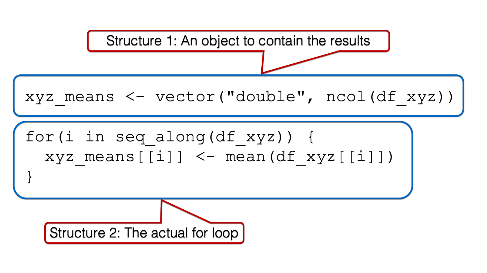
```

In practice, we will generally write the code for structure 1 before writing the code for structure 2. However, I think it will be easier to understand why we need structure 1 if we first learn about the components of the for loop, and how they work together. Further, I think it will be easiest to understand the components of the for loop if we start on the inside and work our way out. Therefore, the first component of for loops that we are going to discuss is the body.

### The for loop body

```{r echo=FALSE}
knitr::include_graphics("img/07_part_repeated_operations/04_for_loops/body.png")
```

Similar to when we learned to write our own functions, the body of the for loop is where all the "stuff" happens. This is where we write the code that we want to be executed over and over. In our example, we want the mean value of the `x` column, the mean value of the `y` column, and the mean value of the `z` column of our data frame called `df_xyz`. We can do that manually like this using dollar sign notation:

```{r}
mean(df_xyz$x)
mean(df_xyz$y)
mean(df_xyz$z)
```

Or, we've also learned how to get the same result using bracket notation:

```{r}
mean(df_xyz[["x"]])
mean(df_xyz[["y"]])
mean(df_xyz[["z"]])
```

In the code above, we used the quoted column _names_ inside the double brackets. However, we could have also used each column's _position_ inside the double brackets. In other words, we can use `1` to refer to the `x` column because it is the first column in the data frame, we can use `2` to refer to the `y` column because it is the second column in the data frame, and we can use `3` to refer to the `z` column because it is the third column in the data frame:

```{r}
mean(df_xyz[[1]])
mean(df_xyz[[2]])
mean(df_xyz[[3]])
```

For reasons that will become clearer later, this will actually be the syntax we want to use inside of our for loop. 

Notice, however, the we copied the same code more than twice above. For all of the reasons we've already discussed, we would like to just type `mean(df_xyz[[ # ]]` once and have R fill in the number inside the double brackets for us, one after the other. As you've probably guessed, that's exactly what the for loop does.

### The for() function

All for loops start with the `for()` function. This is how you tell R that you are about to write a for loop.

```{r echo=FALSE}
knitr::include_graphics("img/07_part_repeated_operations/04_for_loops/for.png")
```

In the examples in this book, the arguments to the `for()` function are generally going to follow this pattern:

```{r echo=FALSE}
knitr::include_graphics("img/07_part_repeated_operations/04_for_loops/for2.png")
```

1️⃣An index variable, which is also sometimes called a "counter," to the left of the keyword `in`.

2️⃣The keyword `in`.

3️⃣The name of the object we want to loop (or iterate) over — often passed to the` seq_along()` function. 

It can be a little intimidating to look at, but that's the basic structure. We will talk about all three arguments simultaneously because they all work together, and we will get an error if we are missing any one of them:

```{r echo=FALSE}
rm(i)
```

```{r error=TRUE}
# No index variable
for(in 1) {
  print(i)
}
```

```{r error=TRUE}
# No keyword "in"
for(i 1) {
  print(i)
}
```

```{r error=TRUE}
# No object to loop over
for(i in ) {
  print(i)
}
```

So, what happens when we do have all three of these components? Well, the index variable will take on each value of the object to loop over _iteratively_ (i.e., one at a time). If there is only one object to loop over, this is how R sees the index variable inside of the loop:

```{r}
for(i in 1) {
  print(i)
}
```

If there are multiple objects to loop over, this is how R sees the index variable inside of the loop:

```{r}
for(i in c(1, 2, 3)) {
  print(i)
}
```

Notice that the values being printed out are _not_ a single numeric vector with three elements (e.g. `[1] 1, 2, 3`) like the object we started with to the right of the keyword `in`. Instead, three vectors with one element each are being printed out. One for 1 (i.e., `[1] 1`), one for 2 (i.e., `[1] 2`), and one for 3 (i.e., `[1] 3`). I point this out because it illustrates the _iterative_ nature of a for loop. What I mean is that the index variable doesn't take on the values of the object to the right of the keyword `in` _simultaneously_. It takes them on _iteratively_, or separately, one after the other.

Further, it may not be immediately obvious at this point, but that's the basic "magic" of the for loop. _The index variable changes once for each element of whatever object is on the right side of the keyword `in`_. Even the most complicated for loops generally start from this basic idea.

As a quick sidebar, I want to point out that the index variable does not have to be the letter `i`. It can be any letter:

```{r}
for(x in c(1, 2, 3)) {
  print(x)
}
```

Or even a word:

```{r}
for(number in c(1, 2, 3)) {
  print(number)
}
```

```{r echo=FALSE}
rm(i, number, x)
```

However, `i` is definitely the most common letter to use as the index variable and I'm going to suggest that you also use it in most cases. It's just what people will expect to see and easily understand.

Now, let's discuss the object to the right of the keyword `in`. In all of the examples above, we passed a vector to the right of the keyword `in`. As you saw, when there is a vector to the right of the keyword `in`, the index variable takes on the value of each element of the vector. However, the object to the right of the keyword `in` does not have to be a vector. In fact, it will often be a data frame. 

When we ask the for loop to iterate over a data frame, what value do you think the index variable will take? The value of each cell of the data frame? The name or number of each column? The name or number of each row? Let's see:

```{r}
for(i in df_xyz) {
  print(i)
}
```

It may not be totally obvious to you, but inside the for loop above, the index variable took on three separate _vectors_ of values -- one for each column in the data frame. Of course, getting the mean value of each of these _vectors_ is equivalent to getting the mean value of each _column_ in our data frame. Remember, data frame columns _are_ vectors. So, let's replace the `print()` function with the `mean()` function in the for loop body and see what happens:

```{r}
for(i in df_xyz) {
  mean(i)
}
```

Hmmm, it doesn't seem as though anything happened. This is probably a good time to mention a little peculiarity about using for loops. As you can see in the example above, the return value of functions, and the contents of objects, referenced inside of the for loop body will not be printed to the screen unless we explicitly pass them to the `print()` function:

```{r}
for(i in df_xyz) {
  print(mean(i))
}
```

It worked! This is the exact same answer we got above. And, if all we want to do is print the mean values of `x`, `y`, and `z` to the screen, then we could stop here and call it a day. However, we often want to save our analysis results to an object. In the chapter on using column-wise operations with `dplyr`, we saved our summary statistics to an object in the usual way (i.e., with the assignment arrow):

```{r}
xyz_means <- df_xyz %>%
  summarise(
    across(
      .cols  = everything(),
      .fns   = mean,
      .names = "{col}_mean"
    )
  )
```

From there, we can manipulate the results, save the results to a file, or print them to screen:

```{r}
xyz_means
```

At first, it may seem as though we can assign the results of our for loop to an object in a similar way:

```{r}
xyz_means <- for(i in df_xyz) {
  mean(i)
}
```

```{r}
xyz_means
```

Unfortunately, this doesn't work. Instead, we need to create an object that can store the results of our for loop. Then, we _update_ (i.e., add to) that object at each iteration of the for loop. That brings us back to structure number 1.

```{r echo=FALSE}

```

Because the result of our for loop will be three numbers -- the mean of `x`, the mean of `y`, and the mean of `z` -- the most straightforward object to store them in is a numeric vector with a length of three (i.e., three "slots"). We can use the `vector()` function to create an empty vector:

```{r}
my_vec <- vector()
my_vec
```

As you can see, by default, the `vector()` function creates a logical vector with length zero. We can change the vector type to numeric by passing `"numeric"` to the `mode` argument of the `vector()` function. We can also change the length to 3 by passing `3` to the length argument of the `vector()` function, and because we know we want this vector to hold the mean values of `x`, `y`, and `z`, let's name it `xyz_means`:

```{r}
xyz_means <- vector("numeric", 3)
xyz_means
```

Finally, let's update `xyz_means` inside our for loop body:

```{r}
for(i in df_xyz) {
  xyz_means <- mean(i)
}
```

```{r}
xyz_means
```

Hmmm, we're getting closer, but that obviously still isn't the result we want. Below, I try to illustrate what's going on inside our loop. 

R starts executing at the top of the for loop. In the first iteration, the value of i is set to a numeric vector with the same values as the `x` column in `df_xyz`. Then, the `i` in `mean(i)` inside the for loop body is replaced with those numeric values. Then, the mean of those numeric values is calculated and assigned to the object named `xyz_means`.

```{r echo=FALSE}
knitr::include_graphics("img/07_part_repeated_operations/04_for_loops/iteration_1_1.png")
```

At this point, there is no more code left to execute inside of the for loop, so R returns to the top of the loop.

```{r echo=FALSE}
knitr::include_graphics("img/07_part_repeated_operations/04_for_loops/iteration_1_2.png")
```

`i` has not yet taken every value of the object to the right of the keyword `in`, so R starts another iteration of the for loop. In the second iteration, the value of `i` is set to a numeric vector with the same values as the `y` column in `df_xyz`. Then, the `i` in `mean(i)` inside the for loop body is replaced with those numeric values. Then, the mean of those numeric values is calculated and assigned to the object named `xyz_means`.

```{r echo=FALSE}
knitr::include_graphics("img/07_part_repeated_operations/04_for_loops/iteration_1_3.png")
```

At this point, there is no more code left to execute inside of the for loop, so R returns to the top of the loop.

```{r echo=FALSE}
knitr::include_graphics("img/07_part_repeated_operations/04_for_loops/iteration_1_4.png")
```

`i` still has not yet taken every value of the object to the right of the keyword `in`, so R starts another iteration of the for loop. In the third iteration, the value of `i` is set to a numeric vector with the same values as the `z` column in `df_xyz`. Then, the `i` in `mean(i)` inside the for loop body is replaced with those numeric values. Then, the mean of those numeric values is calculated and assigned to the object named `xyz_means`.

```{r echo=FALSE}
knitr::include_graphics("img/07_part_repeated_operations/04_for_loops/iteration_1_5.png")
```

At this point, there is no more code left to execute inside of the for loop, so R returns to the top of the loop. However, this time, `i` has taken every value of the object to the right of the keyword `in`, so R does not start another iteration. It leaves the looping process, and the value of `xyz_means` remains `-0.4245589` -- The result we got above. 

You might be thinking, "wait, we made three slots in the `xyz_means` vector. Why does it only contain one number?" Well, remember that all we have to do to overwrite one object with another object is to assign the second object to the same name. For example, let's create a vector with three values called `my_vec`:

```{r}
my_vec <- c(1, 2, 3)
my_vec
```

Now, let's assign another value to `my_vec`:

```{r}
my_vec <- -0.4245589
my_vec
```

```{r echo=FALSE}
rm(my_vec)
```

As you can see, assignment (`<-`) doesn't _add to_ the vector, it _overwrites_ (i.e., replaces) the vector. That's exactly what was happening inside of our for loop. To R, it basically looked like this:

```{r}
xyz_means <- 0.07462564
xyz_means <- 0.208622
xyz_means <- -0.4245589
xyz_means
```

What we really want is to create the empty vector:

```{r}
xyz_means <- vector("numeric", 3)
xyz_means
```

And then add a value to each _slot_ in the vector. Do you remember how to do this? 

We can do this using bracket notation:

```{r}
xyz_means[[1]] <- 0.07462564
xyz_means[[2]] <- 0.208622
xyz_means[[3]] <- -0.4245589
xyz_means
```

That's exactly the result we want. 

Does that code above remind you of any other code we've already seen? How about this code:

```{r}
mean(df_xyz[[1]])
mean(df_xyz[[2]])
mean(df_xyz[[3]])
```

Hmmm, what if we combine the two? First, let's once again create our empty vector, and then try combining the two code chunks above to fill it:

```{r}
xyz_means <- vector("numeric", 3)
xyz_means
```

```{r}
xyz_means[[1]] <- mean(df_xyz[[1]])
xyz_means[[2]] <- mean(df_xyz[[2]])
xyz_means[[3]] <- mean(df_xyz[[3]])
xyz_means
```

Again, that's exactly the result we want. Of course, there is still unnecessary repetition. If you look at the code carefully, you may notice that the only thing that changes from line to line is the number inside the double brackets. So, if we could just type `xyz_means[[ # ]] <- mean(df_xyz[[ # ]])` once, and update the number inside the double brackets, we should be able to get the result we want. We've actually already seen how to do that with a for loop too. Remember this for loop for the very beginning of the chapter:

```{r}
for(i in c(1, 2, 3)) {
  print(i)
}
```

That looks promising, right? Let's once again create our empty vector, and then try combining the two code chunks above to fill it:

```{r}
xyz_means <- vector("numeric", 3)
xyz_means
```

```{r}
for(i in c(1, 2, 3)) {
  xyz_means[[i]] <- mean(df_xyz[[i]])
}
```

```{r}
xyz_means
```

It works! We have used a for loop to successfully remove the unnecessary repetition from our code. However, there's still something we could do to make the code more robust. In the for loop above, we knew that we needed three iterations. Therefore, we passed `c(1, 2, 3)` as the object to the right of the keyword `in`. But, what if we didn't know exactly how columns there were? What if we just knew that we wanted to iterate over all the columns in the data frame passed to the right of the keyword `in`. How could we do that?

We can do that with the `seq_along()` function. When we pass a vector to the `seq_along()` function, it returns a sequence of integers with the same length as the vector being passed, starting at one. For example:

```{r}
seq_along(c(4, 5, 6))
```

Or:

```{r}
seq_along(c("a", "b", "c", "d"))
```

Similarly, when we pass a data frame to the `seq_along()` function, it returns a sequence of integers with a length equal to the number of columns in the data frame being passed, starting at one. For example:

```{r}
seq_along(df_xyz)
```

Therefore, we can replace `for(i in c(1, 2, 3))` with `for(i in seq_along(df_xyz))` to make our code more robust (i.e., it will work in more situations):

```{r}
xyz_means <- vector("numeric", 3)

for(i in seq_along(df_xyz)) {
  xyz_means[[i]] <- mean(df_xyz[[i]])
}

xyz_means
```

Just to make sure that we really understand what's going on in the code above, let's walk through the entire process one more time. 

```{r echo=FALSE}
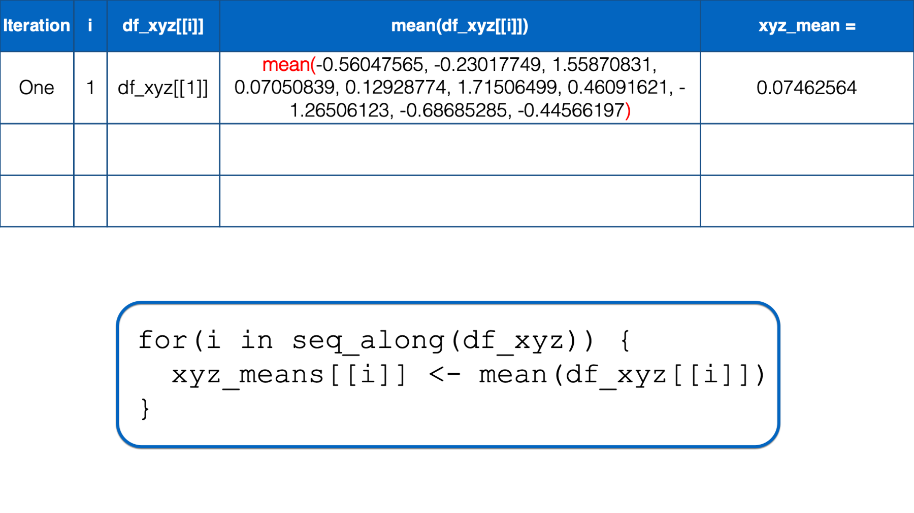
```

R starts executing at the top of the for loop. In the first iteration, the value of i is set to the first value in `seq_along(df_xyz)`, which is `1`. Then, the `i` in `df_xyz[[i]]` inside the for loop body is replaced with `1`. Then, R calculates the mean of `df_xyz[[1]]`, which is `x` column of the `df_xyz` data frame. Finally, the mean value is assigned to `xyz_means[[i]]`, which is `xyz_means[[1]]` in this iteration. So, the value of the first element in the `xyz_means` vector is `0.07462564`.

At this point, there is no more code left to execute inside of the for loop, so R returns to the top of the loop. `i` has not yet taken every value of the object to the right of the keyword `in`, so R starts another iteration of the for loop. 

```{r echo=FALSE}
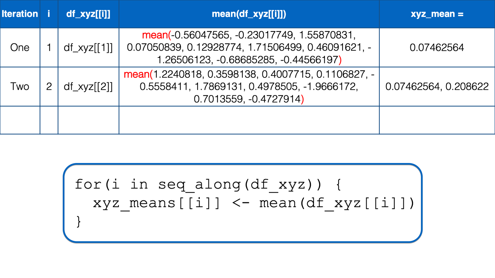
```

In the second iteration, the value of i is set to the second value in `seq_along(df_xyz)`, which is `2`. Then, the `i` in `df_xyz[[i]]` inside the for loop body is replaced with `2`. Then, R calculates the mean of `df_xyz[[2]]`, which is `y` column of the `df_xyz` data frame. Finally, the mean value is assigned to `xyz_means[[i]]`, which is `xyz_means[[2]]` in this iteration. So, the value of the second element in the `xyz_means` vector is `0.20862196`.

At this point, there is no more code left to execute inside of the for loop, so R returns to the top of the loop. `i` still has not yet taken every value of the object to the right of the keyword `in`, so R starts another iteration of the for loop.

```{r echo=FALSE}
knitr::include_graphics("img/07_part_repeated_operations/04_for_loops/iteration_2_3.png")
```

In the third iteration, the value of i is set to the third value in `seq_along(df_xyz)`, which is `3`. Then, the `i` in `df_xyz[[i]]` inside the for loop body is replaced with `3`. Then, R calculates the mean of `df_xyz[[3]]`, which is `z` column of the `df_xyz` data frame. Finally, the mean value is assigned to `xyz_means[[i]]`, which is `xyz_means[[3]]` in this iteration. So, the value of the third element in the `xyz_means` vector is `-0.42455887`.

```{r echo=FALSE}
knitr::include_graphics("img/07_part_repeated_operations/04_for_loops/iteration_1_5.png")
```

At this point, there is no more code left to execute inside of the for loop, so R returns to the top of the loop. However, this time, `i` has taken every value of the object to the right of the keyword `in`, so R does not start another iteration. It leaves the looping process, and the value of `xyz_means` remains `0.07462564, 0.20862196, -0.4245589`. 

There's one final adjustment we should probably make to the code above. Did you notice that when we create the empty vector to contain our results, we're still hard coding its length to `3`? For the same reason we replaced `for(i in c(1, 2, 3))` with `for(i in seq_along(df_xyz))`, we want to replace `vector("numeric", 3)` with `vector("numeric", length(df_xyz))`.

Now, let's add a fourth column to our data frame:

```{r}
df_xyz <- df_xyz %>% 
  mutate(a = rnorm(10)) %>% 
  print()
```

And see what happens when we pass it to our new, robust for loop code:

```{r}
xyz_means <- vector("numeric", length(df_xyz)) # Using length() instead of 3

for(i in seq_along(df_xyz)) { # Using seq_along() instead of c(1, 2, 3)
  xyz_means[[i]] <- mean(df_xyz[[i]])
}

xyz_means
```

Our for loop now gives us the result we want no matter how many columns are in the data frame. Having the flexibility to loop over an arbitrary number of columns wasn't that important in this case -- we knew exactly how many columns we wanted to loop over. However, what if we wanted to add more columns in the future? Using the second method, we wouldn't have to make any changes to our code. This is often an important consideration when we embed for loops inside of functions that we write ourselves.

For example, maybe we think, "that for loop above was really useful. I want to write it into a function so that I can use it again in my other projects." Well, we've already seen how to take our working code, embed it inside of a function, make it more general, and assign it a name. If you forgot how to do this, please review [the function writing process](#the-function-writing-process). In this case, that process would result in something like this:

```{r}
multi_means <- function(data) {
  # Create a structure to contain results
  result <- vector("numeric", length(data))
  
  # Iterate over each column of data
  for(i in seq_along(data)) {
    result[[i]] <- mean(data[[i]])
  }
  
  # Return the result
  result
}
```

Which we can easily apply to our data frame like this:

```{r}
multi_means(df_xyz)
```

Further, because we've made the for loop code inside of the function body flexible with `length()` and `seq_along()` we can easily pass any other data frame (with all numeric columns) to our function like this:

```{r}
set.seed(123)
new_df <- tibble(
  age    = rnorm(10, 50, 10),
  height = rnorm(10, 65, 5),
  weight = rnorm(10, 165, 10)
) %>% 
  print()
```

```{r}
multi_means(new_df)
```

If we want our for loop to return the results with informative names, similar those that are returned when we use the `across()` method, we can simply add one line of code to our for loop body that names each result:

```{r}
xyz_means <- vector("numeric", length(df_xyz))

for(i in seq_along(df_xyz)) {
  xyz_means[[i]] <- mean(df_xyz[[i]])
  names(xyz_means)[[i]] <- paste0(names(df_xyz)[[i]], "_mean") # Name results here
}

xyz_means
```

If it isn't quite clear to you why that code works, try picking it apart, replacing `i` with a number, and figuring out how it works. 

We can make our results resemble those returned by the `across()` method even more by converting our named vector to a data frame like this:

```{r}
xyz_means %>% 
  as.list() %>% 
  as_tibble()
```

Finally, we can update our `multi_means()` function with changes we made above so that our results are returned as a data frame with informative column names:

```{r}
multi_means <- function(data) {
  # Create a structure to contain results
  result <- vector("numeric", length(data))
  
  # Iterate over each column of data
  for(i in seq_along(data)) {
    result[[i]] <- mean(data[[i]])
    names(result)[[i]] <- paste0(names(data)[[i]], "_mean")
  }
  
  # Return the result as a tibble
  as_tibble(as.list(result))
}
```

```{r}
multi_means(new_df)
```

```{r echo=FALSE}
rm(df_xyz, new_df, i, xyz_means, multi_means)
```

## Using for loops for data transfer

In the previous section, we used an example that wasn't really all that realistic, but it was useful (hopefully) for learning the mechanics of for loops. As I said at the beginning of the chapter, I personally wouldn't use a for loop for the analysis above. I would probably use `across()` with `summarise()`. 

However, keep in mind that `across()` is designed specifically for repeatedly applying functions column-wise (i.e., across columns) of a _single_ data frame in conjunction with `dplyr` verbs. By definition, if we are repeating code outside of `dplyr`, or if we are applying code across _multiple data frames_, then we probably aren't going to be able to use `across()` to complete our coding task.

For example, let's say that we have data stored across multiple sheets of an Excel workbook. This simulated data contains some demographic information about three different cities: Houston, Atlanta, and Charlotte. We need to import each sheet, clean the data, and combine them into a single data frame in order to complete our analysis. First, we will load the `readxl` package:

```{r}
library(readxl)
```

[You may click here to download this file to your computer.](https://github.com/brad-cannell/r4epi/blob/master/data/city_ses.xlsx)

Then, we may import each sheet like this:

```{r read-in-city-ses-xlsx, cache = TRUE, cache.invalidate.if = tools::md5sum('city_ses.xlsx')}
houston <- read_excel(
  "data/city_ses.xlsx",
  sheet = "Houston"
) %>% 
  print()
```

```{r read-in-city-ses-xlsx-2, cache = TRUE, cache.invalidate.if = tools::md5sum('city_ses.xlsx')}
atlanta <- read_excel(
  "data/city_ses.xlsx",
  sheet = "Atlanta"
) %>% 
  print()
```

```{r read-in-city-ses-xlsx-3, cache = TRUE, cache.invalidate.if = tools::md5sum('city_ses.xlsx')}
charlotte <- read_excel(
  "data/city_ses.xlsx",
  sheet = "Charlotte"
) %>% 
  print()
```

🚩In the code chunks above, we have essentially the same code copied more than twice. That's a red flag that we should be thinking about removing unnecessary repetition from our code. Of course, we could write our own function to reduce some of the repetition:

```{r echo=FALSE}
rm(atlanta, charlotte, houston)
```

```{r}
import_cities <- function(sheet) {
  df <- read_excel(
    "data/city_ses.xlsx",
    sheet = sheet
  )
}
```

```{r}
houston <- import_cities("Houston") %>% print()
```

```{r}
atlanta <- import_cities("Atlanta") %>% print()
```

```{r}
charlotte <- import_cities("Charlotte") %>% print()
```

That method is better. And depending on the circumstances of your project, it may be the best approach. However, an alternative approach would be to use a for loop. Using the for loop approach might look something like this:

```{r echo=FALSE}
rm(atlanta, charlotte, houston)
```

```{r}
# Save the file path to an object so we don't have to type it repeatedly 
# or hard-code it in.
path <- "data/city_ses.xlsx"

# Use readxl::excel_sheets to get the name of each sheet in the workbook.
# this makes our code more robust.
sheets <- excel_sheets(path)

for(i in seq_along(sheets)) {
  # Convert sheet name to lowercase before using it to name the df
  new_nm <- tolower(sheets[[i]])
  assign(new_nm, read_excel(path, sheet = sheets[[i]]))
}
```

```{r}
houston
```

```{r}
atlanta
```

```{r}
charlotte
```

👆**Here's what we did above:**

* We used a for loop to import every sheet from an Excel workbook.

* First, we saved the path to the Excel workbook to a separate object. We didn't have to do this. However, doing so prevented us from having to type out the full file path repeatedly in the rest of our code. Additionally, if the file path ever changed, we would only have to update it in one place.

* Second, we used the `excel_sheets()` function to create a character vector containing each sheet name. We didn't have to do this. We could have typed each sheet name manually. However, there shouldn't be any accidental typos if we use the `excel_sheets()` function, and we don't have to make any changes to our code if more sheets are added to the Workbook in the future. 

* Inside the for loop, we assigned each data frame created by the `read_excel()` function to our global environment using the `assign()` function. We haven't used the `assign()` function before, but you can read the help documentation by typing `?assign` in your R console.

    - The first argument to the `assign()` function is `x`. The value you pass to `x` should be the name of the object you want to create. Above, we passed `new_nm` (for new name) to the `x` argument. At each iteration of the for loop, `new_nm` contained the name of each sheet in `sheets`. So, `Houston` at the first iteration, `Atlanta` at the second iteration, and `Charlotte` at the third iteration. Of course, we like using lowercase names for our data frames, so we used `tolower()` to convert `Houston`, `Atlanta`, and `Charlotte` to `houston`, `atlanta`, and `charlotte`. These will be the names used for each data frame assigned to our global environment inside of the for loop.
    
    - The second argument to the `assign()` function is `value`. The value you pass to `value` should be the contents you want to assign the object with the name you passed to the `x` argument. Above, we passed the code that imports each sheet of the `city_ses.xlsx` data frame to the `value` argument.
    
For loops can often be helpful for data transfer tasks. In the code above, we looped over sheets of a single Excel workbook. However, we could have similarly looped over file paths to import multiple different Excel workbooks instead. We could have even used nested for loops to import multiple sheets from multiple Excel workbooks. The code would not have looked drastically different. 

```{r echo=FALSE}
rm(atlanta, charlotte, houston, i, new_nm, path, sheets, import_cities)
```

## Using for loops for data management

In the [chapter on writing functions](#the-function-writing-process), we created an `is_match()` function. In that scenario, we wanted to see if first name, last name, and street name matched at each ID between our data frames. More specifically, we wanted to combine the two data frames into a single data frame and create three new dummy variables that indicated whether first name, last name, and address matched respectively. 

Here are the data frames we simulated and combined:

```{r}
people_1 <- tribble(
  ~id_1, ~name_first_1, ~name_last_1, ~street_1,
  1,     "Easton",      NA,           "Alameda",
  2,     "Elias",       "Salazar",    "Crissy Field",
  3,     "Colton",      "Fox",        "San Bruno",
  4,     "Cameron",     "Warren",     "Nottingham",
  5,     "Carson",      "Mills",      "Jersey",
  6,     "Addison",     "Meyer",      "Tingley",
  7,     "Aubrey",      "Rice",       "Buena Vista",
  8,     "Ellie",       "Schmidt",    "Division",
  9,     "Robert",      "Garza",      "Red Rock",
  10,    "Stella",      "Daniels",    "Holland"
)
```

```{r}
people_2 <- tribble(
  ~id_2, ~name_first_2, ~name_last_2, ~street_2,
  1,     "Easton",      "Stone",      "Alameda",
  2,     "Elas",        "Salazar",    "Field",
  3,     NA,            "Fox",        NA,
  4,     "Cameron",     "Waren",      "Notingham",
  5,     "Carsen",      "Mills",      "Jersey",
  6,     "Adison",      NA,           NA,
  7,     "Aubrey",      "Rice",       "Buena Vista",
  8,     NA,            "Schmidt",    "Division",
  9,     "Bob",         "Garza",      "Red Rock",
  10,    "Stella",      NA,           "Holland"
)
```

```{r}
people <- people_1 %>% 
  bind_cols(people_2) %>% 
  print()
```

Here is the function we wrote to help us create the dummy variables:

```{r}
is_match <- function(value_1, value_2) {
  result <- value_1 == value_2
  result <- if_else(is.na(result), FALSE, result)
  result
}
```

And here is how we applied the function we wrote to get our results:

```{r}
people %>% 
  mutate(
    name_first_match = is_match(name_first_1, name_first_2),
    name_last_match  = is_match(name_last_1, name_last_2),
    street_match     = is_match(street_1, street_2)
  ) %>% 
  # Order like columns next to each other for easier comparison
  select(id_1, starts_with("name_f"), starts_with("name_l"), starts_with("s"))
```

🚩However, in the code chunk above, we still have essentially the same code copied more than twice. That's a red flag that we should be thinking about removing unnecessary repetition from our code. Because we are using dplyr, and all of our data resides inside of a single data frame, your first instinct might be to use `across()` inside of `mutate()` to perform column-wise operations. Unfortunately, that method won't work in this scenario. 

The `across()` function will apply the function we pass to the `.fns` argument to each column passed to the `.cols` argument, one at a time. But, we need to pass two columns at a time to the `is_match()` function. For example, `name_first_1` and `name_first_2`. There's really no good way to accomplish this task using `is_match()` inside of `across()`. However, it is fairly simple to accomplish this task with a for loop:

```{r}
cols <- c("name_first", "name_last", "street")

for(i in seq_along(cols)) {
  col_1   <- paste0(cols[[i]], "_1")
  col_2   <- paste0(cols[[i]], "_2")
  new_col <- paste0(cols[[i]], "_match")
  people[[new_col]] <- is_match(people[[col_1]], people[[col_2]])
}
```

```{r}
people %>% 
  select(id_1, starts_with("name_f"), starts_with("name_l"), starts_with("s"))
```

👆**Here's what we did above:**

* We used our `is_match()` function inside of a for loop to create three new dummy variables that indicated whether first name, last name, and address matched respectively.

Let's pull the code apart piece-by-piece to see how it works.

```{r}
cols <- c("name_first", "name_last", "street")

for(i in seq_along(cols)) {
  col_1   <- paste0(cols[[i]], "_1")
  col_2   <- paste0(cols[[i]], "_2")
  new_col <- paste0(cols[[i]], "_match")
  print(col_1)
  print(col_2)
  print(new_col)
}
```

First, we created a character vector that contained the base name (i.e., no `_1` or `_2`) of each of the columns we wanted to compare. Then, we iterated over that character vector by passing it as the object to the right of the keyword `in`.

At each iteration, we used `paste0()` to create three column names from the character string in `cols`. For example, in the first iteration of the loop, the value of `cols` was `name_first`. The first line of code in the for loop body combined `name_first` with `_1` to make the character string `name_first_1` and save it as an object named `col_1`. The second line of code in the for loop body combined `name_first` with `_2` to make the character string `name_first_2` and save it as an object named `col_2`. And, the third line of code in the for loop body combined `name_first` with `_match` to make the character string `name_first_match` and save it as an object named `new_col`.

This will allow us to use `col_1`, `col_2`, and `new_col` in the code that compares the columns and creates each dummy variable. For example, here is what `people[[col_1]]` looks like at each iteration:

```{r}
cols <- c("name_first", "name_last", "street")

for(i in seq_along(cols)) {
  col_1 <- paste0(cols[[i]], "_1")
  col_2 <- paste0(cols[[i]], "_2")
  print(people[[col_1]])
}
```

It is a vector that matches `people[["name_first_1"]]`, `people[["name_last_1"]]`, and `people[["street_1"]]` respectively. 

And here is what `col_2` looks like at each iteration:

```{r}
cols <- c("name_first", "name_last", "street")

for(i in seq_along(cols)) {
  col_1 <- paste0(cols[[i]], "_1")
  col_2 <- paste0(cols[[i]], "_2")
  print(people[[col_2]])
}
```

Now, we can pass each vector to our `is_match()` function at each iteration like this:

```{r}
cols <- c("name_first", "name_last", "street")

for(i in seq_along(cols)) {
  col_1 <- paste0(cols[[i]], "_1")
  col_2 <- paste0(cols[[i]], "_2")
  print(is_match(people[[col_1]], people[[col_2]]))
}
```

These logical vectors are the results we want to go into our new dummy variables. Therefore, the last step is to assign each logical vector above to a new variable in our data frame called `people[["name_first_match"]]`, `people[["name_last_match"]]`, and `people[["street_match"]]` respectively. We do so by allowing `people[[new_col]]` to represent those values at each iteration of the loop:

```{r}
cols <- c("name_first", "name_last", "street")

for(i in seq_along(cols)) {
  col_1   <- paste0(cols[[i]], "_1")
  col_2   <- paste0(cols[[i]], "_2")
  new_col <- paste0(cols[[i]], "_match")
  people[[new_col]] <- is_match(people[[col_1]], people[[col_2]])
}
```

And here is our result:

```{r}
people %>% 
  select(id_1, starts_with("name_f"), starts_with("name_l"), starts_with("s"))
```

In the code above, we used roughly the same amount of code to complete the task with a loop that we used to complete it without a loop. However, this code still has some advantages. We only typed "name_first", "name_last", and "street" once at the beginning of the code chunk. Therefore, we didn't have to worry about forgetting to change a column name after copying and pasting code. Additionally, if we later decide that we also want to compare other columns (e.g., middle name, birth date, city, state, zip code), we only have to update the code in one place -- where we create the `cols` vector. 

```{r echo=FALSE}
rm(people, people_1, people_2, col_1, col_2, i, new_col, is_match)
```

## Using for loops for analysis

For our final example of this chapter, let's return to the final example from the [column-wise operations chapter](#across-with-summarise). We started with some simulated study data:

```{r}
study <- tibble(
  age       = c(32, 30, 32, 29, 24, 38, 25, 24, 48, 29, 22, 29, 24, 28, 24, 25, 
                25, 22, 25, 24, 25, 24, 23, 24, 31, 24, 29, 24, 22, 23, 26, 23, 
                24, 25, 24, 33, 27, 25, 26, 26, 26, 26, 26, 27, 24, 43, 25, 24, 
                27, 28, 29, 24, 26, 28, 25, 24, 26, 24, 26, 31, 24, 26, 31, 34, 
                26, 25, 27, NA),
  age_group = c(2, 2, 2, 1, 1, 2, 1, 1, 2, 1, 1, 1, 1, 1, 1, 1, 1, 1, 1, 1, 1, 
                1, 1, 1, 2, 1, 1, 1, 1, 1, 1, 1, 1, 1, 1, 2, 1, 1, 1, 1, 1, 1, 
                1, 1, 1, 2, 1, 1, 1, 1, 1, 1, 1, 1, 1, 1, 1, 1, 1, 2, 1, 1, 2, 
                2, 1, 1, 1, NA),
  gender    = c(2, 1, 1, 2, 1, 1, 1, 2, 2, 2, 1, 1, 2, 1, 1, 1, 1, 2, 2, 1, 1, 
                1, 1, 2, 1, 1, 2, 1, 1, 1, 2, 1, 1, 2, 2, 1, 2, 2, 1, 2, 2, 1, 
                1, 1, 1, 1, 1, 1, 1, 2, 2, 1, 1, 1, 1, 2, 2, 1, 1, 2, 1, 2, 1, 
                1, 1, 2, 1, NA),
  ht_in     = c(70, 63, 62, 67, 67, 58, 64, 69, 65, 68, 63, 68, 69, 66, 67, 65, 
                64, 75, 67, 63, 60, 67, 64, 73, 62, 69, 67, 62, 68, 66, 66, 62, 
                64, 68, NA, 68, 70, 68, 68, 66, 71, 61, 62, 64, 64, 63, 67, 66, 
                69, 76, NA, 63, 64, 65, 65, 71, 66, 65, 65, 71, 64, 71, 60, 62, 
                61, 69, 66, NA),
  wt_lbs    = c(216, 106, 145, 195, 143, 125, 138, 140, 158, 167, 145, 297, 146, 
                125, 111, 125, 130, 182, 170, 121, 98, 150, 132, 250, 137, 124, 
                186, 148, 134, 155, 122, 142, 110, 132, 188, 176, 188, 166, 136, 
                147, 178, 125, 102, 140, 139, 60, 147, 147, 141, 232, 186, 212, 
                110, 110, 115, 154, 140, 150, 130, NA, 171, 156, 92, 122, 102, 
                163, 141, NA),
  bmi       = c(30.99, 18.78, 26.52, 30.54, 22.39, 26.12, 23.69, 20.67, 26.29, 
                25.39, 25.68, 45.15, 21.56, 20.17, 17.38, 20.8, 22.31, 22.75, 
                26.62, 21.43, 19.14, 23.49, 22.66, 32.98, 25.05, 18.31, 29.13, 
                27.07, 20.37, 25.01, 19.69, 25.97, 18.88, 20.07, NA, 26.76, 
                26.97, 25.24, 20.68, 23.72, 24.82, 23.62, 18.65, 24.03, 23.86, 
                10.63, 23.02, 23.72, 20.82, 28.24, NA, 37.55, 18.88, 18.3, 
                19.13, 21.48, 22.59, 24.96, 21.63, NA, 29.35, 21.76, 17.97, 
                22.31, 19.27, 24.07, 22.76, NA),
  bmi_3cat  = c(3, 1, 2, 3, 1, 2, 1, 1, 2, 2, 2, 3, 1, 1, 1, 1, 1, 1, 2, 1, 1, 
                1, 1, 3, 2, 1, 2, 2, 1, 2, 1, 2, 1, 1, NA, 2, 2, 2, 1, 1, 1, 1, 
                1, 1, 1, 1, 1, 1, 1, 2, NA, 3, 1, 1, 1, 1, 1, 1, 1, NA, 2, 1, 
                1, 1, 1, 1, 1, NA)
) %>% 
  mutate(
    age_group = factor(age_group, labels = c("Younger than 30", "30 and Older")),
    gender    = factor(gender, labels = c("Female", "Male")),
    bmi_3cat  = factor(bmi_3cat, labels = c("Normal", "Overweight", "Obese"))
  ) %>% 
  print()
```

Then we saw how to use `across()` with `pivot_longer()` to remove repetition and get our results into a format that were easier to read an interpret: 

```{r}
summary_stats <- study %>% 
  summarise(
    across(
      .cols  = c(age, ht_in, wt_lbs, bmi),
      .fns   = list(
        n_miss = ~ sum(is.na(.x)),
        mean   = ~ mean(.x, na.rm = TRUE),
        median = ~ median(.x, na.rm = TRUE),
        min    = ~ min(.x, na.rm = TRUE),
        max    = ~ max(.x, na.rm = TRUE)
      ),
      .names = "{col}-{fn}" # This is the new part of the code
    ) 
  ) %>% 
  print()
```

```{r}
summary_stats %>% 
  tidyr::pivot_longer(
    cols      = everything(),
    names_to  = c("characteristic", ".value"),
    names_sep = "-"
  )
```

```{r echo=FALSE}
rm(summary_stats)
```

I think that method works really nicely for our continuous variables; however, the situation is slightly more complicated for categorical variables. To illustrate the problem as simply as possible, let's start by just getting counts for each of our categorical variables: 

```{r}
study %>% 
  count(age_group)
```

```{r}
study %>% 
  count(gender)
```

```{r}
study %>% 
  count(bmi_3cat)
```

You are, of course, and old pro at this by now, and you quickly spot all the unnecessary repetition. So, you decide to pass `count` to the `.fns` argument like this:

```{r error=TRUE}
study %>% 
  summarise(
    across(
      .cols = c(age_group, gender, bmi_3cat),
      .fns  = count
    )
  )
```

Unfortunately, this won't work. At least not currently. There are a couple reasons why this won't work, but the one that is probably easiest to wrap your head around is related to the number of results produced by `count()`. What do I mean by that? Well, when we pass each continuous variable to `mean()` (or `median`, `min`, or `max`) we get _one_ result back for each column:

```{r}
study %>% 
  summarise(
    across(
      .cols = c(age, ht_in),
      .fns  = ~ mean(.x, na.rm = TRUE)
    )
  )
```

It's easy for `dplyr` to arrange those results into a data frame. However, the results from `count()` are much less predictable. For example, `study %>% count(age_group)` had three results, `study %>% count(gender)` had three results, and `study %>% count(bmi_3cat)` had four results. Also, remember that every column of a data frame has to have the same number of rows. So, if the code we used to try to pass `count` to the `.fns` argument above would actually run, it might look something like this:

```{r echo=FALSE}
knitr::include_graphics("img/07_part_repeated_operations/04_for_loops/summarise.png")
```

Because `summarise()` lays the results out side-by-side, it's not clear what would go into the 4 cells in the bottom-left corner of the results data frame. Therefore, it isn't necessarily straightforward for `dplyr` to figure out how it should return such results to us.

However, when we use a for loop, _we can create our own structure_ to hold the results. And, that structure can be pretty much any structure that meets our needs. In this case, one option would be to create a data frame to hold our categorical counts that looks like this:

```{r echo=FALSE}
knitr::include_graphics("img/07_part_repeated_operations/04_for_loops/our_structure_1.png")
```

Then, we can use a for loop to fill in the empty data frame so that we end up with results that look like this:

```{r echo=FALSE}
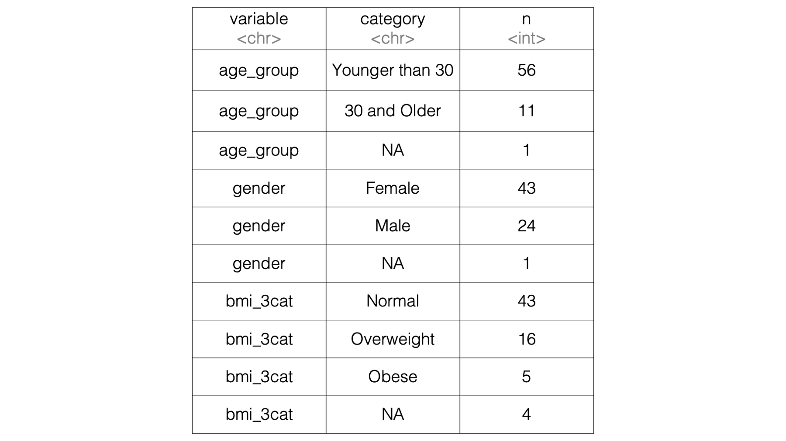
```

The process for getting to our finished product is a little bit involved (and probably a little intimidating for some of you) and will require us to cover a couple new topics. So, I'm going to start by giving you the complete code for accomplishing this task. Then, we'll pick the code apart, piece-by-piece, to make sure we understand _how_ it works.

Here is the complete solution:

```{r}
# Structure 1. An object to contain the results.
  # Create the data frame structure that will contain our results
cat_table <- tibble(
  variable = vector("character"), 
  category = vector("character"), 
  n        = vector("numeric")
) 

# Structure 2. The actual for loop.
  # For each column, get the column name, category names, and count.
  # Then, add them to the bottom of the results data frame we created above.
for(i in c("age_group", "gender", "bmi_3cat")) {
  cat_stats <- study %>% 
    count(.data[[i]]) %>% # Use .data to refer to the current data frame.
    mutate(variable = names(.)[1]) %>% # Use . to refer to the result to this point.
    rename(category = 1)
  
  # Here is where we update cat_table with the results for each column
  cat_table <- bind_rows(cat_table, cat_stats)
}
```

```{r}
cat_table
```

We'll use the rest of this chapter section to walk through the code above and make sure we understand how it works. For starters, we will create our results data frame structure like this:

```{r}
cat_table <- tibble(
  variable = vector("character"), 
  category = vector("character"), 
  n        = vector("numeric")
) 
```

```{r}
str(cat_table)
```

As you can see, we created an empty data frame with three columns. One to hold the variable names, one to hold the variable categories, and one to hold the count of occurrences of each category. Now, we can use a for loop to iteratively add results to our empty data frame structure. This works similarly to the way we added mean values to the `xyz_means` vector in the first example above. As a reminder, here is what the for loop code looks like:

```{r eval=FALSE}
for(i in c("age_group", "gender", "bmi_3cat")) {
  cat_stats <- study %>% 
    count(.data[[i]]) %>%
    mutate(variable = names(.)[1]) %>%
    rename(category = 1)
  
  cat_table <- bind_rows(cat_table, cat_stats)
}
```

For our next step, let's walk through the first little chunk of code inside the for loop body. Specifically:

```{r eval=FALSE}
cat_stats <- study %>% 
  count(.data[[i]]) %>%
  mutate(variable = names(.)[1]) %>%
  rename(category = 1)
```

If we were using this code to analyze a single variable, as opposed to using it in a for loop, this is what the result would look like:

```{r}
cat_stats <- study %>% 
  count(age_group) %>%
  mutate(variable = names(.)[1]) %>%
  rename(category = 1) %>% 
  print()
```

We've already seen what the `study %>% count(age_group)` part of the code does, and we already know that we can use `mutate()` to create a new column in our data frame. In this case, the name of the new column is `variable`. But, you may be wondering what the `names(.)[1]` after the equal sign does. Let's take a look. Here, we can see the data frame that is getting passed to `mutate()`:

```{r}
cat_stats <- study %>% 
  count(age_group) %>% 
  print()
```

It's a data frame with two columns. The first column actually has two different kinds of information that we need. It contains the name of the variable being analyzed as the column name, and it contains all the categories of that variable as the column values. We want to separate those two pieces of information into two columns. This task is similar to some of the "tidy data" tasks we worked through in the [chapter on restructuring data frames](#tidy-data). In fact, we can also use `pivot_longer()` to get the result we want:

```{r}
study %>% 
  count(age_group) %>% 
  tidyr::pivot_longer(
    cols      = "age_group",
    names_to  = "variable",
    values_to = "category"
  )
```

In my solution for this task, however, I'm not going to use `pivot_longer()` for a couple of reasons. First, it's an opportunity for us to learn about the special use of dot (`.`) inside of `dplyr` verbs. Second, my solution will use `dplyr` only. It will not require us to use the `tidyr` package. 

Before we talk about the dot, however, let's make sure we know what the `names()[1]` is doing. There aren't any new concepts here, but we may not have used them this way before. The `name()` function just returns a character vector containing the column names of the data frame we pass to it. So, when we pass the `cat_stats` data frame to it, this is what it returns:

```{r}
names(cat_stats)
```

We want to use the first value, `"age_group"` to fill-in our the new `variable` column we want to create. We can use bracket notation to subset the first element of the character vector of column names above like this:

```{r}
names(cat_stats)[1]
```

What does the dot do? Well, outside of our `dplyr` pipeline, it doesn't do anything useful:

```{r error=TRUE}
names(.)[1]
```

_Inside_ of our `dplyr` pipeline, you can think of it as a placeholder for whatever is getting passed to the `dplyr` verb -- `mutate()` in this case. So, what is getting passed to mutate? The result of everything that comes before `mutate()` in the pipeline. And what does that result look like in this case? It looks like this:

```{r}
study %>% 
  count(age_group)
```

So, we can use the dot inside of mutate as a substitute for the results data frame getting passed to `mutate()`. Said another way. To `dplyr`, this:

```{r eval=FALSE}
names(study %>% count(age_group))
```

and this:

```{r eval=FALSE}
study %>% count(age_group) %>% names(.)
```

are the exact same thing in this context:

```{r}
cat_stats <- study %>% 
  count(age_group) %>%
  mutate(variable = names(.)[1]) %>%
  print()
```

Now, we have all the variables we wanted for our final results table. Keep in mind, however, that we will eventually be stacking similar results from our other variables (i.e., `gender` and `bmi_3cat`) below these results using `bind_rows()`. You may remember from the [chapter on working with multiple data frames](#combining-data-frames-vertically-adding-rows) that the `bind_rows()` function matches columns together by _name_, not by position. So, we need to change the `age_group` column name to `category`. If we don't, we will end up with something that looks like this:

```{r}
study %>% 
  count(age_group) %>% 
  bind_rows(study %>% count(gender))
```

Not what we want, right? Again, if we were doing this analysis one variable at a time, our code might look like this:

```{r}
cat_stats <- study %>% 
  count(age_group) %>% 
  mutate(variable = names(.)[1]) %>% 
  rename(category = age_group) %>% 
  print()
```

We used the `rename()` function above to change the name of the first column from `age_group` to `category`. Remember, the syntax for renaming columns with the `rename()` function is `new_name = old_name`. But, inside our for loop we will actually have 3 old names, right? In the first iteration `old_name` will be `age_group`, in the second iteration `old_name` will be `gender`, and in the third iteration `old_name` will be `bmi_cat`. We could loop over the names, but there's an even easier solution. Instead of asking `rename()` to rename our column by name using this syntax, `new_name = old_name`, we can also ask `rename()` to rename our column by _position_ using this syntax, `new_name = column_number`. So, in our example above, we could get the same result by replacing `age_group` with `1` because `age_group` is the first column in the data frame:

```{r}
cat_stats <- study %>% 
  count(age_group) %>% 
  mutate(variable = names(.)[1]) %>% 
  rename(category = 1) %>% # Replace age_group with 1
  print()
```

And, using this method, we don't have to make any changes to the value being passed to `rename()` when we are analyzing our other variables. For example:

```{r}
cat_stats <- study %>% 
  count(gender) %>% # Changed the column from age_group to gender
  mutate(variable = names(.)[1]) %>% 
  rename(category = 1) %>% # Still have 1 here
  print()
```

At this point, we have all the elements we need manually create the data frame of final results we want. First, we create the empty results table:

```{r}
cat_table <- tibble(
  variable = vector("character"), 
  category = vector("character"), 
  n        = vector("numeric")
) %>%
  print()
```

Then, we get the data frame of results for `age_group`:

```{r}
cat_stats <- study %>% 
  count(age_group) %>%
  mutate(variable = names(.)[1]) %>% 
  rename(category = 1) %>% 
  print()
```

Then, we use `bind_rows()` to add those results to our `cat_table` data frame:

```{r}
cat_table <- cat_table %>% 
  bind_rows(cat_stats) %>% 
  print()
```

Then, we copy and paste the last two steps above, replacing `age_group` with `gender`:

```{r}
cat_stats <- study %>% 
  count(gender) %>% # Change to gender
  mutate(variable = names(.)[1]) %>% 
  rename(category = 1)

cat_table <- cat_table %>% 
  bind_rows(cat_stats) %>% 
  print()
```

Then, we copy and paste the two steps above, replacing `gender` with `bmi_3cat`:

```{r}
cat_stats <- study %>% 
  count(bmi_3cat) %>%  # Change to bmi_3cat
  mutate(variable = names(.)[1]) %>% 
  rename(category = 1)

cat_table <- cat_table %>% 
  bind_rows(cat_stats) %>% 
  print()
```

That is exactly the final result we wanted, and I'm sure you noticed that the only elements of the code chunks above that changed were the column names being passed to `count()`. If we can just figure out how to loop over the column names, then we can remove a ton of unnecessary repetition from our code. Our first attempt might look like this:

```{r error=TRUE}
for(i in c(age_group, gender, bmi_3cat)) {
  study %>% 
    count(i) %>% 
    mutate(variable = names(.)[1]) %>% 
    rename(category = 1)
}
```

However, it doesn't work. In the code above, R is looking for and _object_ in the global environment called `age_group`. Of course, there is no object in the global environment named `age_group`. Rather, there is an object in the global environment named `study` that has a column named `age_group`. 

We can get rid of that error by wrapping each column name in quotes:

```{r error=TRUE}
for(i in c("age_group", "gender", "bmi_3cat")) {
  study %>% 
    count(i) %>% 
    mutate(variable = names(.)[1]) %>% 
    rename(category = 1)
}
```

Unfortunately, that just gives us a different error. In the code above, `count()` is looking for a column named `i` in the `study` data frame. You may be wondering why `i` is not being converted to `"age_group"`, `"gender"`, and `"bmi_3cat"` in the code above. The short answer is that it's because of [tidy evaluation and data masking](#tidy-evaluation).

So, we need a way to iteratively pass each quoted column name to the `count()` function inside our for loop body, but also let `dplyr` know that they _are column names_, not just random character strings. Fortunately, the `rlang` package (which is partially imported with `dplyr`), provides us with a special construct that can help us solve this problem. It's called the `.data` pronoun. Here's how we can use it:

```{r}
for(i in c("age_group", "gender", "bmi_3cat")) {
  study %>% 
    count(.data[[i]]) %>% 
    mutate(variable = names(.)[1]) %>% 
    rename(category = 1) %>% 
    print()
}
```

Here's how it works. Remember that data masking allows us to write column names directly in `dplyr` code without having to use dollar sign or bracket notation to tell R which data frame that column lives in. For example, in the following code, `dplyr` just "knows" that `age_group` is a column in the `study` data frame:

```{r}
study %>% 
  count(age_group)
```

The same is not true for base R functions. For example, we can't pass `age_group` directly to the `table()` function: 

```{r error=TRUE}
table(age_group)
```

We have to use dollar sign or bracket notation to tell R that `age_group` is a column in `study`:

```{r}
table(study[["age_group"]])
```

This is a really nice feature of `dplyr` when we're using dplyr interactively. But, as we've already discussed, it does present us with some challenges when we use `dplyr` functions inside of the functions we write ourselves and inside of for loops. 

As you can see in the code below, the tidy evaluation essentially blocks the `i` inside of `count()` from being replaced with each of the character strings we are looping over. Instead, `dplyr` looks for a literal `i` as a column name in the `study` data frame.

```{r error=TRUE}
for(i in c("age_group", "gender", "bmi_3cat")) {
  study %>% 
    count(i)
}
```

So, we need a way to tell `dplyr` that `"age_group"` is a column _in_ the `study` data frame. Well, we know how to use quoted column names inside bracket notation. So, we could write code like this:

```{r}
study %>% 
  count(study[["age_group"]])
```

However, the column name (i.e., `study[["age_group"]]`) in the results data frame above isn't ideal to work with. Additionally, the code above isn't very flexible because we have the `study` data frame hard-coded into it (i.e., `study[["age_group"]]`). That's where the `.data` pronoun comes to the rescue:

```{r}
study %>% 
  count(.data[["age_group"]])
```

The `.data` pronoun "is not a data frame; it’s a special construct, a pronoun, that allows you to access the current variables either directly, with .data$x or indirectly with .data[[var]]." @Wickham2020-dx

When we put it all together, our code looks like this:

```{r}
# Create the data frame structure that will contain our results
cat_table <- tibble(
  variable = vector("character"), 
  category = vector("character"), 
  n        = vector("numeric")
) 

# For each column, get the column name, category names, and count.
# Then, add them to the bottom of the results data frame we created above.
for(i in c("age_group", "gender", "bmi_3cat")) {
  cat_stats <- study %>% 
    count(.data[[i]]) %>% # Use .data to refer to the current data frame.
    mutate(variable = names(.)[1]) %>% # Use . to refer to the current data frame.
    rename(category = 1)
  
  # Here is where we update cat_table with the results for each column
  cat_table <- bind_rows(cat_table, cat_stats)
}
```

```{r}
cat_table
```

And, we can do other interesting things with our results now that we have it in this format. For example, we can easily add percentages along with our counts like this:

```{r}
cat_table %>% 
  group_by(variable) %>% 
  mutate(
    percent = n / sum(n) * 100
  )
```

Finally, we could also write our own function that uses the code above. That way, we can easily reuse this code in the future:

```{r}
cat_stats <- function(data, ...) {
  # Create the data frame structure that will contain our results
  cat_table <- tibble(
    variable = vector("character"), 
    category = vector("character"), 
    n        = vector("numeric")
  ) 
  
  # For each column in ..., get the column name, category names, and count.
  # Then, add them to the bottom of the results data frame we created above.
  for(i in c(...)) {
    stats <- data %>% 
      count(.data[[i]]) %>% # Use .data to refer to the current data frame.
      mutate(variable = names(.)[1]) %>% # Use . to refer to the current data frame.
      rename(category = 1)
    
    # Here is where we update cat_table with the results for each column
    cat_table <- bind_rows(cat_table, stats)
  }
  # Return results
  cat_table
}
```

```{r}
cat_stats(study, "age_group", "gender", "bmi_3cat")
```

```{r echo=FALSE}
rm(list = ls())
```

We covered a lot of material in this chapter. For loops tend to be confusing for people who are just learning to program. When you throw in the tidy evaluation stuff, it can be really confusing -- even for experienced R programmers. So, if you are still feeling a little confused, don't beat yourself up. Also, I don't recommend trying to memorize everything we covered in this chapter. Instead, I recommend that you read it until you have understood what for loops are and when they might be useful at a high level. Then, refer back to this chapter (or other online references that discuss for loops) if you find yourself in a situation where you believe that for loops might be the right tool to help you complete a given programming task. Having said that, also keep in mind that for loops are rarely the _only_ tool you will have at your disposal to complete the task. In the next chapter, we will learn how to use functionals, specifically the `purrr` package, in place of for loops. You may find this approach to iteration more intuitive.

<!--chapter:end:chapters/07_part_repeated_operations/04_writing_for_loops.Rmd-->

# Using the purrr package

<!--

-->

In this final chapter of the repeated operations part of the book, we are going to discuss the [purrr package](https://purrr.tidyverse.org/). 

```{r echo=FALSE}
knitr::include_graphics("img/07_part_repeated_operations/01_intro/stickers.png")
```

The `purrr` package provides a really robust set of functions that can help us more efficiently complete a bunch of different tasks in R. For the purposes of this chapter, however, we are going to focus on using the `purrr::map` functions as an alternative approach to removing unnecessary repetition from the various different code chunks we've already seen in other chapters. 

For our purposes, you can think of the `purrr::map` functions as a replacement for for loops. In other words, you can think of them as _doing_ the same thing as a for loop, but writing the code in a different way. 

<p class="note"> 🗒**Side Note:** I also want to mention that the `purrr` package is closely related to base R's `apply` functions (i.e., `apply()`, `lapply()`, `sapply()`, `tapply()`). We aren't going to discuss those functions any further, but you will often see them mentioned side-by-side as solutions to a given coding challenge on websites like Stack Overflow. The `purrr` package is partially meant to be an improved replacement for the `apply` functions.</p>

As usual, let's start by taking a look at a simple example -- the same one we used to start the [chapter on column-wise operations](#column-wise-operations-in-dplyr) and the [chapter on writing for loops](#writing-for-loops). Afterwards, we will compare the basic structure of `purrr::map` functions to the basic structure of for loops. Finally, we will work through a number of the examples we've already worked through in this part of the book using the `purrr` approach.

At this point, we will go ahead and load `dplyr` and `purrr` and simulate our data:

```{r message=FALSE}
library(dplyr)
library(purrr)
```

```{r}
set.seed(123)
df_xyz <- tibble(
  x = rnorm(10),
  y = rnorm(10),
  z = rnorm(10)
) %>% 
  print()
```

In the [chapter on column-wise operations](#column-wise-operations-in-dplyr) we used `dplyr`'s `across()` function to efficiently find the mean of each column in the `df_xyz` data frame:

```{r}
df_xyz %>%
  summarise(
    across(
      .cols  = everything(),
      .fns   = mean,
      .names = "{col}_mean"
    )
  )
```

In the [chapter on writing for loops](#writing-for-loops), we learned an alternative approach that would also work:

```{r}
xyz_means <- vector("double", ncol(df_xyz))

for(i in seq_along(df_xyz)) {
  xyz_means[[i]] <- mean(df_xyz[[i]])
}

xyz_means
```

An alternative way to complete the analysis above is with the `map_dbl()` function from the `purrr` package like this:

```{r}
xyz_means <- map_dbl(
  .x = df_xyz, 
  .f = mean
) 

xyz_means
```

👆**Here's what we did above:**

* We used `purr`'s `map_dbl()` function to iteratively calculate the mean of each column in the `df_xyz` data frame. There are other `map` functions beside `map_dbl()`. We will eventually discuss them all.

* You can type `?purrr::map_dbl` into your R console to view the help documentation for this function and follow along with the explanation below.

* The first argument to all of the `map` functions is the `.x` argument. You should pass the name of a list, data frame, or vector that you want to iterate over to the `.x` argument. If the object passed to the `.x` argument is a vector, then `map` will apply the function passed to the `.f` argument (see below) to each element of the vector. If the object passed to the `.x` argument is a data frame, then `map` will apply the function passed to the `.f` argument to each column of the data frame. Above, we passed the `df_xyz` data frame to the `.x`.

* The second argument to all of the `map` functions is the `.f` argument. You should pass the name of function, or functions, you want to apply iteratively to the object you passed to the `.x` argument. In the example above, we passed the mean function to the `.f` argument. Notice that we typed `mean` without the parentheses.

* The third argument to all of the `map` functions is the `...` argument. In this case, the `...` argument is where we pass any additional arguments to the function we passed to the `.f` argument. For example, we passed the `mean` function to the `.f` argument above. If the data frame above had missing values, we could have passed `na.rm = TRUE` to the `mean()` function using the `...` argument. We saw a similar [example of this when we were learning about `across()`](#the-across-function).

As you can see, using the `map_dbl()` package requires far less code than the for loop did, which has at least two potential advantages. First, it's less typing, which means less opportunity for typos. Second, many people in the R community feel as though this _functional_ (i.e., use of a function) approach to iteration is much easier to read and understand than the traditional for loop approach. 

Additionally, you may have also noticed that we were able to assign the returned results of `map_dbl(df_xyz, mean)` to an object in our global environment in the usual way (i.e., with the assignment arrow). This eliminates the need for creating a structure to hold our results ahead of time as we had to do with the for loop. 

Finally, when we use `map_dbl()` there isn't a leftover index variable (i.e., `i`) floating around our global environment the way there was when we were writing for loops.

For those reasons, and possibly others, it's been my observation that the majority of R users prefer the functional approach to iteration -- either `purrr` or the `apply` functions -- over using for loops in most situations.

However, my first experiences with programming were not with programming R. In fact, R was the third or fourth programming language I learned. And, all the others I had learned before R relied much more heavily on for loops. Perhaps for this reason, I tend to first think in terms of a for loop and then mentally convert the for loop to a `map` function before writing my code. Perhaps that is true for some of you reading this chapter as well. Therefore, the next section is going to compare and contrast the _basic_ for loop with the `map` functions. You may find this section instructive or interesting even if you aren't someone who first learned iteration using for loops.

```{r echo=FALSE}
rm(df_xyz, i, xyz_means)
```


## Comparing for loops and the map functions

```{r echo=FALSE}
knitr::include_graphics("img/07_part_repeated_operations/05_purrr/compare.png")
```

In this section, we will compare for loops and the `purrr::map` functions using the example from the beginning of the chapter.

```{r echo=FALSE}
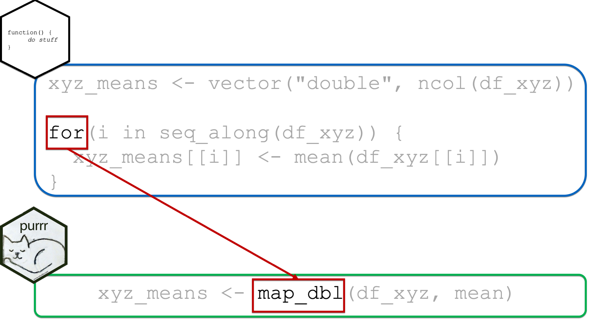
```

It's probably obvious to you at this point, but I'll go ahead and say it anyway. When using `purrr::map` instead of a for loop, we will be using one of the `map` functions instead of the `for()` function. 

```{r echo=FALSE}
knitr::include_graphics("img/07_part_repeated_operations/05_purrr/compare_assign.png")
```

Next, as previously discussed above, we are able to assign the returned results of `map_dbl(df_xyz, mean)` to an object in our global environment in the usual way (i.e., with the assignment arrow). This eliminates the need for creating a structure to hold our results ahead of time as we had to do with the for loop. It also eliminates the need to write code that explicitly updates the returned results structure at each iteration (i.e., `xyz_means[[i]]`) as we had to do with the for loop.

However, one nice byproduct of creating the structure to hold our returned results ahead of time was that doing so made it obvious what form and type we expected our results to take. 

```{r echo=FALSE}
knitr::include_graphics("img/07_part_repeated_operations/05_purrr/compare_type1.png")
```

In the `xyz_means` example above, it's obvious that we expected our returned results to be a vector of numbers because the structure we created to contain our results was a vector of type double.

```{r echo=FALSE}
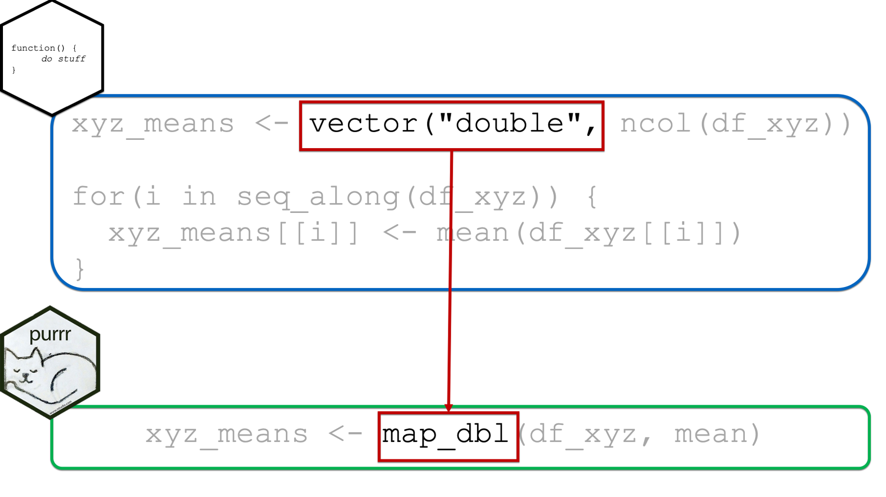
```

When using the `purrr::map` functions, which `map` function we choose will serve the same purpose. In the example above, we used `map_dbl()`, which implied that we expected our results to be a vector of type double. In fact, it not only implied that our results _should_ be a vector of type double, but it _guaranteed_ that our results _would_ be a vector of type double (or we would get an error). In this sense, the `map` functions are much safer to use than for loops -- we don't get unexpected results. 

As a silly example, let's say that we want to extract the number of letters in each name contained in a vector of names. We'll start by creating a vector that contains three random names:

```{r}
names <- c("Avril", "Joe", "Whitney")
```

Next, let's create a structure to contain our results:

```{r}
n_letters <- vector("double", length(names)) # Expecting double
```

The code above (i.e., `vector("double", length(names))`) implies that we expect our results to be type double, which make sense if we expect our results to be the number of letters in some names.

Finally, let's write our for loop:

```{r}
for(i in seq_along(names)) {
  n_letters[[i]] <- stringr::str_extract(names[[i]], "\\w") # Returns character
}

n_letters
```

Uh, oh! Those "counts" are letters! What happened? Well, apparently we thought that `stringr::str_extract(names[[i]], "\\w")` would return the count of letters in each name. In actuality, it returns the first letter in each name. 

As I said before, this is a silly example. In this case, it's easy to see and fix our mistake. However, it could be very difficult to debug this problem if the code were buried in a long script or inside of other functions.

Now, let's see what happens when we use `purrr`. We still start with the names:

```{r}
names <- c("Avril", "Joe", "Whitney")
```

We also still imply our expectations that the returned result should be a numeric vector. However, this time we do so by using the `map_dbl` function:

```{r error=TRUE}
n_letters <- map_dbl(
  .x = names, 
  .f = stringr::str_extract, "\\w{1}"
)
```

But, this time, we don't get an unexpected result. This time, we get an error. This may seem like a pain if you are new'ish to programming. But, believe me when I say that you would much rather get an error that you can go fix than an incorrect result that you are totally unaware of! 

While we are discussing return types, let's go ahead and introduce some of the other `map` functions. They are:

* `map_dbl()`, which we've already seen. The `map_dbl()` function always returns a numeric vector or an error.

* `map_int()`, which always returns an integer vector or an error.

* `map_lgl()`, which always returns a logical vector or an error.

* `map_chr()`, which always returns a character vector or an error.

* `map_dfr()`, which always returns a data frame created by row-binding results or an error.

* `map_dfc()`, which always returns a data frame created by column-binding results or an error.

* `map()`, which is the most generic, and always returns a list (or an error). We've haven't discussed lists much in this book, but whenever something won't fit into any other kind of object, it will fit into a list.

* `walk()`, which is the only `map` function without a `map` name. We will use `walk()` when we are more interested in the "side-effects" of the function passed to `.f` than its return value. What in the world does that mean? It means that the only thing `walk()` "returns" is exactly what was passed to its `.x` argument. No matter what you pass to the `.f` argument, the object passed to `.x` will be returned by `walk()` unmodified. Your next question might be, "then what's the point? How could that ever be useful?" Typically, `walk()` will only be useful to us for plotting (e.g., where you are interested in viewing the plots, but not saving them as an object) and/or data transfer (we will see an example of this below).

```{r echo=FALSE}
knitr::include_graphics("img/07_part_repeated_operations/05_purrr/compare_object.png")
```

Next, the object we pass to the `.x` function of the `map` function replaces the entire `i in seq_along(object)` pattern that is passed to the for loop. Again, if the object passed to the `.x` argument is a vector, then `map` will apply the function passed to the `.f` argument to each element of the vector. If the object passed to the `.x` argument is a data frame, then `map` will apply the function passed to the `.f` argument to each column of the data frame.

```{r echo=FALSE}
knitr::include_graphics("img/07_part_repeated_operations/05_purrr/compare_function.png")
```

Finally, the function passed to the `.f` argument can replace the rest of the "stuff" going on in the for loop body. We can pass a single function (e.g., mean) to the `.f` argument as we did above. However, we can also pass anonymous functions to the `.f` argument. We pass anonymous functions to the `.f` function in basically the exact same way passed anonymous functions to the `.fns` argument of the `across()` function in the [chapter on column-wise operations](#column-wise-operations-in-dplyr). And, yes, we can also write our anonymous functions using purrr-style lambdas. In fact, the purrr-style lambda syntax is called the purrr-style lambda syntax because it was first created for the `purrr` package and later adopted by `dplyr::across()`. I bet that name makes a lot more sense than it did a couple of chapters ago!

That pretty much covers the basics of using the `purrr::map` functions. If you've been reading this book in sequence, there won't really be any conceptually new material in this chapter. We're basically going to do the same things we've been doing for the last couple of chapters. We'll just be using a slightly different (and perhaps preferable) syntax. If you haven't been reading the book in sequence, you might want to read the chapters on [writing functions](#writing-functions), [column-wise operations](#column-wise-operations-in-dplyr), and [writing for loops](#writing-for-loops) to get the most of the examples below.

```{r echo=FALSE}
rm(n_letters, names)
```

## Using purrr for data transfer

### Example 1: Importing multiple sheets from an Excel workbook

In the [chapter on writing functions](#writing-functions) we used a for loop to help us import data from an Excel workbook that was stored across multiple sheets. We will once again go through this example using the `purrr` approach. 

The simulated data contains some demographic information about three different cities: Houston, Atlanta, and Charlotte. In this scenario, we need to import each sheet, clean the data, and combine them into a single data frame in order to complete our analysis. First, we will load the `readxl` package:

```{r}
library(readxl)
```

[You may click here to download this file to your computer.](https://www.dropbox.com/s/6nt00hmdzfdigp3/city_ses.xlsx?dl=1)

Then, we may import each sheet like this:

<!-- No need to cache because eval=FALSE -->

```{r eval=FALSE}
houston <- read_excel(
  "data/city_ses.xlsx",
  sheet = "Houston"
)

atlanta <- read_excel(
  "data/city_ses.xlsx",
  sheet = "Atlanta"
)

charlotte <- read_excel(
  "data/city_ses.xlsx",
  sheet = "Charlotte"
)
```

🚩In the code chunks above, we have essentially the same code copied more than twice. That's a red flag that we should be thinking about removing unnecessary repetition from our code. So, our next step was to write a function to remove some of the unnecessary repetition:

<!-- No need to cache because eval=FALSE -->

```{r eval=FALSE}
import_cities <- function(sheet) {
  df <- read_excel(
    "data/city_ses.xlsx",
    sheet = sheet
  )
}

houston   <- import_cities("Houston")
atlanta   <- import_cities("Atlanta")
charlotte <- import_cities("Charlotte")
```

🚩However, that approach still has some repetition. So, we next learned how to use a for loop as an alternative approach:

<!-- No need to cache becaue eval=FALSE -->

```{r eval=FALSE}
path <- "data/city_ses.xlsx"
sheets <- excel_sheets(path)

for(i in seq_along(sheets)) {
  new_nm <- tolower(sheets[[i]])
  assign(new_nm, read_excel(path, sheet = sheets[[i]]))
}
```

That works just fine! However, we could alternatively use `purrr::walk()` instead like this:

<!-- No need to cache because eval=FALSE -->

```{r}
# Save the file path to an object so we don't have to type it repeatedly 
# or hard-code it in.
path <- "data/city_ses.xlsx"
  
walk(
  .x = excel_sheets(path),
  .f = function(x) {
    new_nm <- tolower(x)
    assign(new_nm, read_excel(path, sheet = x), envir = .GlobalEnv)
  }
)
```

```{r}
houston
```

```{r}
atlanta
```

```{r}
charlotte
```

👆**Here's what we did above:**

* We used the `walk()` function from the `purrr` package to import every sheet from an Excel workbook.

* First, we saved the path to the Excel workbook to a separate object. We didn't have to do this. However, doing so prevented us from having to type out the full file path repeatedly in the rest of our code. Additionally, if the file path ever changed, we would only have to update it in one place.

* Second, we passed the return value of the `excel_sheets()` function, which is a character vector containing each sheet name, to the `.x` argument of the `walk()` function. We didn't have to do this. We could have typed each sheet name manually. However, there shouldn't be any accidental typos if we use the `excel_sheets()` function, and we don't have to make any changes to our code if more sheets are added to the Workbook in the future. 

* Third, we passed an anonymous function to the `walk()`'s `.f` argument. Inside the anonymous function, we assigned each data frame created by the `read_excel()` function to our global environment using the `assign()` function. Notice that because we are using the `assign()` _inside_ of another function, we have to explicitly tell the `assign()` function to assign the data frames being imported to the global environment using `envir = .GlobalEnv`. Without getting too technical, keep in mind that functions create their own little enclosed environments ([see a discussion here](#lexical-scoping-and-functions)), which makes the `envir = .GlobalEnv` part necessary.

Additionally, you may have some questions swirling around your head right now about the `walk()` function itself. In particular, I'm imagining that you are wondering why we used `walk()` instead of `map()` and why we didn't assign the return value of `walk()` to an object. I'll answer both questions next.

### Why walk instead of map?

The short answer is that `map` functions return _one_ thing (i.e., a vector, list, or data frame). In this situation, we wanted to "return" _three_ things (i.e., the `houston` data frame, the `atlanta` data frame, and the `charlotte` data frame).

Technically, we could have used the `map()` function to return a list of data frames like this: 

```{r}
list_of_df <- map(
  .x = excel_sheets(path),
  .f = ~ read_excel(path, sheet = .x)
)
```

```{r}
str(list_of_df)
```

From there, we could extract and modify each data frame from the list like this:

```{r}
houston <- list_of_df[[1]]
houston
```

```{r}
atlanta <- list_of_df[[2]]
atlanta
```

```{r}
charlotte <- list_of_df[[2]]
charlotte
```

Of course, now we have a bunch of repetition again! Alternatively, we could have also used the `map_dfr()`, which always returns a data frame created by row-binding results or an error. You can think of `map_dfr()` as taking the three data frames above and passing them to the `bind_rows()` function and returning that result:

```{r}
# Passing list_of_df to bind_rows()
bind_rows(list_of_df)
```

```{r}
# Using map_dfr() to directly produce the same result
cities <- map_dfr(
  .x = excel_sheets(path),
  .f = ~ read_excel(path, sheet = .x)
)

cities
```

There would be absolutely nothing wrong with taking this approach and then cleaning up the combined data you see above. However, my preference in this case was to import each sheet as a separate data frame, clean up each separate data frame, and then combine myself. If your preference is to use `map_dfr()` instead, then you definitely should. 

```{r echo=FALSE}
rm(cities, list_of_df, atlanta, houston, charlotte)
```

### why we didn't assign the return value of `walk()` to an object?

As we discussed above, the only thing `walk()` "returns" is exactly what was passed to its `.x` argument. No matter what you pass to the `.f` argument, the object passed to `.x` will be returned by `walk()` unmodified. In this case, that would just be the sheet names:

```{r}
returned_by_walk <- walk(
  .x = excel_sheets(path),
  .f = function(x) {
    new_nm <- tolower(x)
    assign(new_nm, read_excel(path, sheet = x), envir = .GlobalEnv)
  }
)

returned_by_walk
```

Don't be confused, the data frames are still being imported and assigned to the global environment via the anonymous function we passed to `.f` above. But, but those data frames aren't the values _returned by_ `walk()` -- They are a _side-effect_ of the operations taking place inside of `walk()`. 

```{r echo=FALSE}
rm(returned_by_walk, atlanta, charlotte, houston)
```

Finally, we could make our original `walk()` code slightly more concise by using the purrr-style lambda syntax to write our anonymous function like this:

```{r}
path <- "/Users/bradcannell/Dropbox/Datasets/Cities SES/city_ses.xlsx"
  
walk(
  .x = excel_sheets(path),
  .f = ~ assign(tolower(.), read_excel(path, sheet = .), envir = .GlobalEnv)
)
```

```{r}
houston
```

```{r}
atlanta
```

```{r}
charlotte
```

```{r echo=FALSE}
rm(atlanta, charlotte, houston, path)
```

## Using purrr for data management

### Example 1: Adding NA at multiple positions

We'll start this section with a relatively simple example using the same data we used to start the [chapter on column-wise operations](#column-wise-operations-in-dplyr) and the [chapter on writing for loops](#writing-for-loops).

```{r}
set.seed(123)
df_xyz <- tibble(
  x = rnorm(10),
  y = rnorm(10),
  z = rnorm(10)
) %>% 
  print()
```

In those chapters, we used the code below to add missing values to our data frame: 

```{r}
df_xyz$x[2] <- NA_real_
df_xyz$y[4] <- NA_real_
df_xyz$z[6] <- NA_real_
df_xyz
```

_Dealing_ with those missing values, rather than _adding_ those missing values was the point of the previously mentioned examples. So, we ignored the unnecessary repetition in the code above. But, for all the reasons we've been discussing, we should strive to write more robust code. Imagine, for example, that you were adding missing data to hundreds or thousands of rows as part of a simulation study. Using the method above would become problematic pretty quickly.

In this case, I think it might be useful to start our solution with writing a function ([click here to review function writing](#writing-functions)). Let's name our function `add_na_at()` because it helps us add an `NA` value to a vector at a position of our choosing. Logically, then, it follows that we will need to be able to pass our function a _vector_ that we want to add the `NA` value to, and a _position_ to add the `NA` value at. So, our first attempt might look something like this:

```{r}
add_na_at <- function(vect, pos) {
  vect[[pos]] <- NA
}
```

Let's test it out:

```{r}
add_na_at(df_xyz$x, 2) %>% print()
```

Is a single `NA` the result we wanted? Nope! If this result is surprising to you, please review the [section of the writing functions chapter on return values](#the-values-your-functions-return). Briefly, the last line of our function body is the single value `df_xyz$x[[2]]`, which was set to be equal to `NA`. But, we don't want our function to return just one position of the vector -- we want it to return the entire vector. So, let's reference the entire vector on the last line of the function body:

```{r}
add_na_at <- function(vect, pos) {
  vect[[pos]] <- NA
  vect
}
```

```{r}
add_na_at(df_xyz$x, 2)
```

That's better! Again, we know that data frame columns _are_ vectors, so we can use our new function inside of mutate to add `NA` values to each column in our data frame at a position of our choosing:

```{r}
df_xyz %>% 
  mutate(
    x = add_na_at(x, 2),
    y = add_na_at(y, 4),
    z = add_na_at(z, 6)
  )
```

I can hear what you are saying now. "Sure, that's the result we wanted, but we didn't eliminate very much repetitive code." You are not wrong. A case could be made that this code is easier to quickly glance at and understand, but it isn't much less repetitive. That's where `purrr` comes in. Let's try using `purrr` to come up with a better solution now. 

The first question we might ask ourselves is, "which `map` function should we choose?" Well, we know we want our end result to be a data frame, so it makes sense for us to choose either `map_dfr` or `map_dfc`. However, I personally find it useful to start with the plain `map()` function that returns a list as I begin to experiment with solving a problem using `purrr`. I think I do that because R can put almost anything into a list, and therefore, we will almost always get _something_ returned to us (as opposed to an error) by `map()`. Further, the thing returned to us typically can provide us with some insight into what's going on inside `.f`. 

Next, we know that we want to iterate over every column of the `df_xyz` data frame. So, we can pass it to the `.x` argument.

We also know that we want each column to get passed to the `vect` argument of `add_na_at()` iteratively. So, we want to pass `add_na_at` (without parentheses) to the `.f` argument.

Finally, we can't supply `add_na_at()` with just one argument -- the vector -- can we? 

```{r error=TRUE}
add_na_at(df_xyz$x)
```

No way! We have to give it position as well. Do you remember which argument allows us to pass any additional arguments to the function we passed to the `.f` argument?

The `...` argument is where we pass any additional arguments to the function we passed to the `.f` argument. But remember, we don't actually type out `... =`. We simply type additional arguments, separated by commas, after the function name supplied to `.f`:


```{r}
map(
  .x = df_xyz,
  .f = add_na_at, 2
)
```

Or alternatively, we can use the purrr-style lambda to pass our function to `.f`:

```{r}
map(
  .x = df_xyz,
  .f = ~ add_na_at(.x, 2)
)
```

Notice that we have to use the special `.x` symbol inside the function call where we would normally want to type the name of the column we want the function to operate on. We saw something similar before in the [chapter on column-wise operations](#column-wise-operations-in-dplyr). 

Now, let's discuss the result we are getting. The result you see above is a list, which is what `map()` will always return to us. Specifically, this is a list with three elements -- `x`, `y`, and `z`. Each element of the list is a vector of numbers. Does this feel familiar? Does it seem sort of similar to a data frame? If so, good intuition! In R, a data frame _is_ a list. It's simply a special case of a list. It's a special case because all vectors in the data frame must have the length, and because R knows to print each vector to the screen as a column. In fact, we can easily convert the list above to a data frame by passing it to the `as.data.frame()` function:

```{r}
map(
  .x = df_xyz,
  .f = ~ add_na_at(.x, 2)
) %>% 
  as.data.frame()
```

Alternatively, we could just use `map_dfc` as a shortcut instead:

```{r}
map_dfc(
  .x = df_xyz,
  .f = ~ add_na_at(.x, 2)
)
```

Why `map_dfc` instead of `map_dfr`? Because we want to combine `x`, `y`, and `z` together as _columns_, not as rows.

Ok, so we almost have the solution we want. There's just one problem. In the code above, the `NA` is always being put into the second position because we have `2` hard-coded into `add_na_at(.x, 2)`. We need a way to iterate over our columns _and_ a set of numbers _simultaneously_ in order to get the final result we want. Fortunately, that's exactly what the `map2` variants (i.e., `map2_dbl()`, `map2_int()`, `map2_lgl()`, etc.) of each of the `map` functions allows us to do.

Instead of supplying map a single object to iterate over (i.e., `.x`) we can supply it with _two_ objects to iterate over (i.e., `.x` and `.y`):

```{r}
map2_dfc(
  .x = df_xyz,
  .y = c(2, 4, 6),
  .f = ~ add_na_at(.x, .y)
)
```

This can sometimes take a second to wrap your mind around. Here's an illustration that may help:

```{r echo=FALSE}
knitr::include_graphics("img/07_part_repeated_operations/05_purrr/iteration_1_1.png")
```

In the first iteration, `.x` took on the value of the first column in the `df_xyz` data frame (i.e., `x`) and `.y` took on the value of the first element in the numeric vector that we passed to the `.y` argument (i.e., `2`). Then, the `.x` and `.y` were replaced with `df_xyz$x` and `2` respectively in the function we passed to `.f`. The result of that iteration was a vector of numbers that was identical to `df_xyz$x` except that its second element was an `NA`.

```{r echo=FALSE}
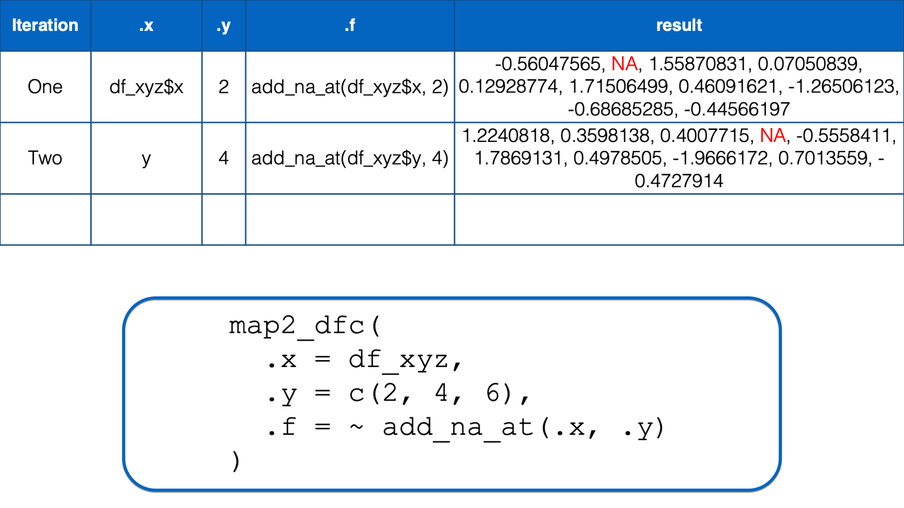
```

In the second iteration, `.x` took on the value of the second column in the `df_xyz` data frame (i.e., `y`) and `.y` took on the value of the second element in the numeric vector that we passed to the `.y` argument (i.e., `4`). Then, the `.x` and `.y` were replaced with `df_xyz$y` and `4` respectively in the function we passed to `.f`. The result of that iteration was a vector of numbers that was identical to `df_xyz$y` except that its fourth element was an `NA`.

```{r echo=FALSE}
knitr::include_graphics("img/07_part_repeated_operations/05_purrr/iteration_1_3.png")
```

In the third iteration, `.x` took on the value of the third column in the `df_xyz` data frame (i.e., `z`) and `.y` took on the value of the third element in the numeric vector that we passed to the `.y` argument (i.e., `6`). Then, the `.x` and `.y` were replaced with `df_xyz$z` and `6` respectively in the function we passed to `.f`. The result of that iteration was a vector of numbers that was identical to `df_xyz$z` except that its sixth element was an `NA`.

Finally, `map2_dfc()` passed all of these vectors to `bind_cols()` (invisibly to us) and returned them as a data frame.

The code above gives us our entire solution. But, if we really were using this code in a simulation with hundreds or thousands of columns, we probably wouldn't want to manually supply a vector of column positions to the `.y` argument. Instead, we could use the `sample()` function to supply random column positions to the `.y` argument like this:

```{r}
set.seed(8142020)

map2_dfc(
  .x = df_xyz,
  .y = sample(1:10, 3, TRUE),
  .f = ~ add_na_at(.x, .y)
)
```

Pretty nice, right?

Before moving on, I want to point out that we did not have to create the `add_na_at()` function ahead of time the way we did. If we didn't think we would need to use `add_na_at()` in any other part of our program, we might have decided to pass the code inside of `add_na_at()` to the `.f` argument as an anonymous function instead. 

As a reminder, here is what our _named_ function looks like:

```{r eval=FALSE}
add_na_at <- function(vect, pos) {
  vect[[pos]] <- NA
  vect
}
```

And here is what our `purrr` code would look like if we used an _anonymous_ function instead:

```{r}
map2_dfc(
  .x = df_xyz,
  .y = c(2, 4, 6),
  .f = function(vect, pos) {
    vect[[pos]] <- NA
    vect
  }
)
```

Or, if we used a purrr-style lambda anonymous function instead:

```{r}
map2_dfc(
  .x = df_xyz,
  .y = c(2, 4, 6),
  .f = ~ {
    .x[[.y]] <- NA
    .x
  }
)
```

Whichever style you choose to use is largely just a matter of preference in this case (as it is in many cases).

```{r echo=FALSE}
rm(add_na_at)
```

### Example 2. Detecting matching values by position

In the [chapter on writing functions](#the-function-writing-process), we created an `is_match()` function. In that scenario, we wanted to see if first name, last name, and street name matched at each ID between our data frames. More specifically, we wanted to combine the two data frames into a single data frame and create three new dummy variables that indicated whether first name, last name, and address matched respectively. 

Here are the data frames we simulated and combined:

```{r}
people_1 <- tribble(
  ~id_1, ~name_first_1, ~name_last_1, ~street_1,
  1,     "Easton",      NA,           "Alameda",
  2,     "Elias",       "Salazar",    "Crissy Field",
  3,     "Colton",      "Fox",        "San Bruno",
  4,     "Cameron",     "Warren",     "Nottingham",
  5,     "Carson",      "Mills",      "Jersey",
  6,     "Addison",     "Meyer",      "Tingley",
  7,     "Aubrey",      "Rice",       "Buena Vista",
  8,     "Ellie",       "Schmidt",    "Division",
  9,     "Robert",      "Garza",      "Red Rock",
  10,    "Stella",      "Daniels",    "Holland"
)

people_2 <- tribble(
  ~id_2, ~name_first_2, ~name_last_2, ~street_2,
  1,     "Easton",      "Stone",      "Alameda",
  2,     "Elas",        "Salazar",    "Field",
  3,     NA,            "Fox",        NA,
  4,     "Cameron",     "Waren",      "Notingham",
  5,     "Carsen",      "Mills",      "Jersey",
  6,     "Adison",      NA,           NA,
  7,     "Aubrey",      "Rice",       "Buena Vista",
  8,     NA,            "Schmidt",    "Division",
  9,     "Bob",         "Garza",      "Red Rock",
  10,    "Stella",      NA,           "Holland"
)

people <- people_1 %>% 
  bind_cols(people_2) %>% 
  print()
```

Here is the function we wrote to help us create the dummy variables:

```{r}
is_match <- function(value_1, value_2) {
  result <- value_1 == value_2
  result <- if_else(is.na(result), FALSE, result)
  result
}
```

And here is how we applied the function we wrote to get our results:

```{r}
people %>% 
  mutate(
    name_first_match = is_match(name_first_1, name_first_2),
    name_last_match  = is_match(name_last_1, name_last_2),
    street_match     = is_match(street_1, street_2)
  ) %>% 
  # Order like columns next to each other for easier comparison
  select(id_1, starts_with("name_f"), starts_with("name_l"), starts_with("s"))
```

🚩However, in the code chunk above, we still have essentially the same code copied more than twice. That's a red flag that we should be thinking about removing unnecessary repetition from our code. Because we are using dplyr, and all of our data resides inside of a single data frame, your first instinct might be to use `across()` inside of `mutate()` to perform column-wise operations. Unfortunately, that method won't work in this scenario. 

The `across()` function will apply the function we pass to the `.fns` argument to each column passed to the `.cols` argument, one at a time. But, we need to pass two columns at a time to the `is_match()` function. For example, `name_first_1` _and_ `name_first_2`. That makes this task a little trickier than most. But, here's how we accomplished it using a for loop:

```{r}
cols <- c("name_first", "name_last", "street")

for(i in seq_along(cols)) {
  col_1   <- paste0(cols[[i]], "_1")
  col_2   <- paste0(cols[[i]], "_2")
  new_col <- paste0(cols[[i]], "_match")
  people[[new_col]] <- is_match(people[[col_1]], people[[col_2]])
}

people %>% 
  select(id_1, starts_with("name_f"), starts_with("name_l"), starts_with("s"))
```

```{r echo=FALSE}
people <- people %>% select(-ends_with("_match"))
```

Now, let's go over one way to get the same result using `purrr`. The first method very closely resembles our for loop. In fact, we will basically just copy and paste our for loop body into an anonymous function being passed to the `.f` argument:

```{r}
map_dfc(
  .x = c("name_first", "name_last", "street"),
  .f = function(col, data = people) {
    col_1 <- paste0(col, "_1")
    col_2 <- paste0(col, "_2")
    new_nm <- paste0(col, "_match")
    data[[new_nm]] <- data[[col_1]] == data[[col_2]]
    data[[new_nm]] <- if_else(is.na(data[[new_nm]]), FALSE, data[[new_nm]])
    data[c(col_1, col_2, new_nm)]
  }
)
```

In the code above, we used roughly the same amount of code to complete the task with a loop that we used to complete it without a loop. However, this code still has some advantages. We only typed "name_first", "name_last", and "street" once at the beginning of the code chunk. Therefore, we didn't have to worry about forgetting to change a column name after copying and pasting code. Additionally, if we later decide that we also want to compare other columns (e.g., middle name, birth date, city, state, zip code), we only have to update the code in one place -- where we create the `cols` vector. 

```{r echo=FALSE}
rm(people, people_1, people_2, col_1, col_2, cols, i, new_col, is_match)
```

## Using purrr for analysis

Let's return to the examples from the [column-wise operations chapter](#across-with-summarise) and the [chapter on writing for loops](#using-for-loops-for-analysis) for our discussion of using the `purrr` package to remove unnecessary repetition from our analyses. We will once again use the simulated for the examples below.

```{r}
study <- tibble(
  age       = c(32, 30, 32, 29, 24, 38, 25, 24, 48, 29, 22, 29, 24, 28, 24, 25, 
                25, 22, 25, 24, 25, 24, 23, 24, 31, 24, 29, 24, 22, 23, 26, 23, 
                24, 25, 24, 33, 27, 25, 26, 26, 26, 26, 26, 27, 24, 43, 25, 24, 
                27, 28, 29, 24, 26, 28, 25, 24, 26, 24, 26, 31, 24, 26, 31, 34, 
                26, 25, 27, NA),
  age_group = c(2, 2, 2, 1, 1, 2, 1, 1, 2, 1, 1, 1, 1, 1, 1, 1, 1, 1, 1, 1, 1, 
                1, 1, 1, 2, 1, 1, 1, 1, 1, 1, 1, 1, 1, 1, 2, 1, 1, 1, 1, 1, 1, 
                1, 1, 1, 2, 1, 1, 1, 1, 1, 1, 1, 1, 1, 1, 1, 1, 1, 2, 1, 1, 2, 
                2, 1, 1, 1, NA),
  gender    = c(2, 1, 1, 2, 1, 1, 1, 2, 2, 2, 1, 1, 2, 1, 1, 1, 1, 2, 2, 1, 1, 
                1, 1, 2, 1, 1, 2, 1, 1, 1, 2, 1, 1, 2, 2, 1, 2, 2, 1, 2, 2, 1, 
                1, 1, 1, 1, 1, 1, 1, 2, 2, 1, 1, 1, 1, 2, 2, 1, 1, 2, 1, 2, 1, 
                1, 1, 2, 1, NA),
  ht_in     = c(70, 63, 62, 67, 67, 58, 64, 69, 65, 68, 63, 68, 69, 66, 67, 65, 
                64, 75, 67, 63, 60, 67, 64, 73, 62, 69, 67, 62, 68, 66, 66, 62, 
                64, 68, NA, 68, 70, 68, 68, 66, 71, 61, 62, 64, 64, 63, 67, 66, 
                69, 76, NA, 63, 64, 65, 65, 71, 66, 65, 65, 71, 64, 71, 60, 62, 
                61, 69, 66, NA),
  wt_lbs    = c(216, 106, 145, 195, 143, 125, 138, 140, 158, 167, 145, 297, 146, 
                125, 111, 125, 130, 182, 170, 121, 98, 150, 132, 250, 137, 124, 
                186, 148, 134, 155, 122, 142, 110, 132, 188, 176, 188, 166, 136, 
                147, 178, 125, 102, 140, 139, 60, 147, 147, 141, 232, 186, 212, 
                110, 110, 115, 154, 140, 150, 130, NA, 171, 156, 92, 122, 102, 
                163, 141, NA),
  bmi       = c(30.99, 18.78, 26.52, 30.54, 22.39, 26.12, 23.69, 20.67, 26.29, 
                25.39, 25.68, 45.15, 21.56, 20.17, 17.38, 20.8, 22.31, 22.75, 
                26.62, 21.43, 19.14, 23.49, 22.66, 32.98, 25.05, 18.31, 29.13, 
                27.07, 20.37, 25.01, 19.69, 25.97, 18.88, 20.07, NA, 26.76, 
                26.97, 25.24, 20.68, 23.72, 24.82, 23.62, 18.65, 24.03, 23.86, 
                10.63, 23.02, 23.72, 20.82, 28.24, NA, 37.55, 18.88, 18.3, 
                19.13, 21.48, 22.59, 24.96, 21.63, NA, 29.35, 21.76, 17.97, 
                22.31, 19.27, 24.07, 22.76, NA),
  bmi_3cat  = c(3, 1, 2, 3, 1, 2, 1, 1, 2, 2, 2, 3, 1, 1, 1, 1, 1, 1, 2, 1, 1, 
                1, 1, 3, 2, 1, 2, 2, 1, 2, 1, 2, 1, 1, NA, 2, 2, 2, 1, 1, 1, 1, 
                1, 1, 1, 1, 1, 1, 1, 2, NA, 3, 1, 1, 1, 1, 1, 1, 1, NA, 2, 1, 
                1, 1, 1, 1, 1, NA)
) %>% 
  mutate(
    age_group = factor(age_group, labels = c("Younger than 30", "30 and Older")),
    gender    = factor(gender, labels = c("Female", "Male")),
    bmi_3cat  = factor(bmi_3cat, labels = c("Normal", "Overweight", "Obese"))
  ) %>% 
  print()
```

### Example 1: Continuous statistics

In this first example, we will use `purrr` to calculate a set of statistics for multiple continuous variables in our data frame. We will start by creating the same function we created at the beginning of the [chapter on writing functions](#writing-functions).

```{r}
continuous_stats <- function(var) {
  study %>% 
    summarise(
      n_miss = sum(is.na({{ var }})),
      mean   = mean({{ var }}, na.rm = TRUE),
      median = median({{ var }}, na.rm = TRUE),
      min    = min({{ var }}, na.rm = TRUE),
      max    = max({{ var }}, na.rm = TRUE)
    )
}
```

Now, let’s once again _use_ the function we just created above to calculate the descriptive measures we are interested in.

```{r}
continuous_stats(age)
```

```{r}
continuous_stats(ht_in)
```

```{r}
continuous_stats(wt_lbs)
```

```{r}
continuous_stats(bmi)
```

🚩Once again, you notice that we have essentially the same code copied more than twice. That's a red flag that we should be thinking about removing unnecessary repetition. We've already seen how to accomplish this goal using the `across()` function. Now, let's learn how to accomplish this goal using the `purrr` package. 

```{r}
map_dfr(
  .x = quos(age, ht_in, wt_lbs, bmi),
  .f = continuous_stats
)
```

👆**Here's what we did above:**

* We used the `map_dfr()` function from the `purrr` package to iteratively pass the columns `age`, `ht_in`, `wt_lbs`, and `bmi` to our `continuous_stats` function _and_ row-bind the results into a single results data frame. 

* We haven't seen the `quos()` function before. It's another one of those tidy evaluation functions. You can type `?rlang::quos` in your console to read more about it. When we can wrap a single column name with the `quo()` function, or a list of column names with the `quos()` function, we are telling R to look for them in the data frame being passed to a `dplyr` verb rather than looking for them as objects in the global environment. 

At this point, you may be wondering which row in the results data frame above corresponds to which variable? Great question! When we were using `continuous_stats()` to analyze one variable at a time, it didn't really matter that the variable name wasn't part of the output. However, now that we are apply `continuous_stats()` to multiple columns, it would really be nice to have the column name in the results. Luckily, we can easily make that happen with one small tweak to our `continuous_stats()` function.

```{r}
continuous_stats <- function(var) {
  study %>% 
    summarise(
      variable = quo_name(var), # Add variable name to the output
      n_miss   = sum(is.na({{ var }})),
      mean     = mean({{ var }}, na.rm = TRUE),
      median   = median({{ var }}, na.rm = TRUE),
      min      = min({{ var }}, na.rm = TRUE),
      max      = max({{ var }}, na.rm = TRUE)
    ) 
}
```

👆**Here's what we did above:**

* We used the `quo_name()` function to grab the name of the column being passed to the `summarise()` function and turn it into a character string. Then, we assigned that character string to column in the results data frame called `variable`. So, when the `age` column is passed to `summarise()` inside of the function body, `quo_name(var)` returns the value `"age"` and then that value is assigned to the `variable` column in the expression `variable = quo_name(var)`.

Let's try out our new and improved `continuous_stats()` function:

```{r}
map_dfr(
  .x = quos(age, ht_in, wt_lbs, bmi),
  .f = continuous_stats
)
```

That works great, but we'd probably like to be able to use `continuous_stats()` with other data frames too. Currently, we can't do that because we have the `study` data frame hard-coded into our function. Luckily, we've already seen how to replace a hard-coded data frame by adding a `data` argument to our function like this:

```{r}
continuous_stats <- function(data, var) {
  data %>%  # Don't forget to replace "study" with "data" here too!
    summarise(
      variable = quo_name(var),
      n_miss   = sum(is.na({{ var}} )),
      mean     = mean({{ var }}, na.rm = TRUE),
      median   = median({{ var }}, na.rm = TRUE),
      min      = min({{ var }}, na.rm = TRUE),
      max      = max({{ var }}, na.rm = TRUE)
    ) 
}
```

And now, we can analyze all the continuous variables in the `study` data:

```{r}
map_dfr(
  .x = quos(age, ht_in, wt_lbs, bmi),
  .f = continuous_stats, data = study
)
```

And all the continuous variables in the `df_xyz` data:

```{r}
map_dfr(
  .x = quos(x, y, z),
  .f = continuous_stats, data = df_xyz
)
```

### Example 2: Categorical statistics

For our second example of using the `purrr` package for analysis, we'll once again write some code to iteratively analyze all the categorical variables in our `study` data frame. In the last chapter, we learned how to use a for loop to do this analysis. As a refresher, here is the final solution we arrived at:

```{r}
# Structure 1. An object to contain the results.
  # Create the data frame structure that will contain our results
cat_table <- tibble(
  variable = vector("character"), 
  category = vector("character"), 
  n        = vector("numeric")
) 

# Structure 2. The actual for loop.
  # For each column, get the column name, category names, and count.
  # Then, add them to the bottom of the results data frame we created above.
for(i in c("age_group", "gender", "bmi_3cat")) {
  cat_stats <- study %>% 
    count(.data[[i]]) %>% # Use .data to refer to the current data frame.
    mutate(variable = names(.)[1]) %>% # Use . to refer to the current data frame.
    rename(category = 1)
  
  # Here is where we update cat_table with the results for each column
  cat_table <- bind_rows(cat_table, cat_stats)
}
```

```{r}
cat_table
```

To use `purrr` instead, we can pretty much copy and paste the code from the for loop body above as an anonymous function to the `.f` argument to `map_dfr()` like this:

```{r}
map_dfr(
  .x = c("age_group", "gender", "bmi_3cat"),
  .f = function(x) {
    study %>% 
      count(.data[[x]]) %>% 
      mutate(variable = names(.)[1]) %>% 
      rename(category = 1) %>% 
      select(variable, category, n)
  }
)
```

As you can see, the code that is _doing the analysis_ is exactly the same in our for loop solution and our `purrr` solution. However, in this case, the `purrr` solution requires a lot less code _around_ the analysis code. And, in my personal opinion, the `purrr` code is easier to read. 

If we didn't want to type our column names in quotes, we could use tidy evaluation again. All we have to do is pass the column names to the `quos()` function in the `.x` argument and change the `.data[[x]]` being passed to the `count()` function to `{{ x }}` like this:

```{r}
map_dfr(
  .x = quos(age_group, gender, bmi_3cat), # Change c() to quos()
  .f = function(x) {
    study %>% 
      count({{ x }}) %>% # Change .data[[x]] to {{ x }}
      mutate(variable = names(.)[1]) %>% 
      rename(category = 1) %>% 
      select(variable, category, n)
  }
)
```

And as before, we'd probably like to be able to use this code with other data frames too. So, we will once again replace a hard-coded data frame by adding a `data` argument to our function:

```{r}
map_dfr(
  .x = quos(age_group, gender, bmi_3cat),
  .f = function(x, data = study) {
    data %>% # Don't forget to replace "study" with "data" here too!
      count({{ x }}) %>% 
      mutate(variable = names(.)[1]) %>% 
      rename(category = 1) %>% 
      select(variable, category, n)
  }
)
```

```{r echo=FALSE}
rm(list = ls())
```

And that concludes the chapter! I don't blame you if you feel a little bit like your head is swimming at this point. It was a lot to take in! As I said at the end of the for loop chapter, I don't recommend trying to memorize everything we covered in this chapter. Instead, I recommend that you read it until you sort of get the general idea of the `purrr` package and when it might be useful. Then, refer back to this chapter, or other online references that discuss the `purrr` package (there are many good ones out there), if you find yourself in a situation where you believe that the `purrr` package might be the right tool to help you complete a given programming task.  

If you feel as though you want to take a deeper dive into the `purrr` package right away, then I suggest checking out the [iteration chapter of R for Data Science](https://r4ds.had.co.nz/iteration.html#for-loops-vs.functionals). For an even deeper dive, I recommend reading the [functionals chapter of Advanced R](https://adv-r.hadley.nz/functionals.html).

This concludes the repeated operations part of the book. If you aren't feeling totally comfortable with the material we covered in this part of the book right now, that's ok. I honestly wouldn't expect you to yet. It takes _time_ and _practice_ for most people to be able to wrap their head around repeated operations. I think you are on track at this point as long as you understand why unnecessary repetition in your code is generally something you want to avoid. Then, slowly start using any of the methods _you feel most comfortable with_ to remove the unnecessary repetition from your code. Start by doing so in very simple cases and gradually work your way up to more complicated cases. With some practice, you may eventually think this stuff is even fun!

<!--chapter:end:chapters/07_part_repeated_operations/05_using_purrr.Rmd-->

# (PART) Collaboration {-}

<!-- This Rmd just creates a part heading in the table of contents -->

<!--chapter:end:chapters/08_part_collaboration/00_part_collaboration.Rmd-->

# Introduction to git and GitHub

<!--
Hidden comments placeholder
-->

```{r echo=FALSE}
knitr::include_graphics("img/08_part_collaboration/logos.png")
```

If you read this book's introductory material, specifically the section on [Contributing to R4Epi], then you have already been briefly exposed to GitHub. If not, taking a quick look at that section may be useful. [GitHub](https://github.com/) is a website specifically designed to facilitate collaboratively creating programming code. In many ways, GitHub is a cloud-based file storage service like Dropbox, Google Drive, and OneDrive, but with special tools built-in for collaborative coding. **Git** is the name of the **versioning** software that powers many of GitHub’s special tools. We will talk about what versioning means shortly. 

The goal of this, and the next few, chapters isn’t to teach you everything you need to know about git and GitHub. Not even close! That would fill up its own book. The goal here is just to expose you to git and GitHub, show you a brief example of how they may be useful to you, and provide you with some resources you can use to learn more if you’re interested. 

But, why should you be interested in the first place? Well, there are at least four overarching reasons why you should consider learning to use git and GitHub as part of your workflow when your projects include data and/or coding:

1. Versioning   
2. Preservation   
3. Reproducibility   
4. Collaboration   

We’ll elaborate on what each of these means to us below. Then, we will introduce you to git and GitHub, and explain why they are some of the best tools currently available to help you with versioning and collaborating. We’ll go ahead and warn you now — git and GitHub can be hard to wrap your mind around at first. In fact, using git and GitHub still frequently causes us confusion and frustration at times. However, we still believe that the payoff is ultimately worth the upfront investment in time and frustration. Additionally, we will do our best to make this introduction as gentle, comprehensible, and practically applicable as possible.

## Versioning

Have you ever worked on a paper or report and had a folder on your computer that looked something like this?

```{r echo=FALSE}
knitr::include_graphics("img/08_part_collaboration/many_files.png")
```

Saving a bunch of different versions of a file like this is a real mess. It becomes even worse when you are trying to work with multiple people. What is contained in each document again? What order were the documents created in? What are the differences between the documents? Versioning helps us get around all of these problems.

Instead of jumping straight into learning versioning with git and GitHub, we will start our discussion about versioning using a simple example in Google Docs. Not because Google Docs are especially relevant to anything else in this course, but because there are a lot of parallels between the Google Docs versioning system and the git versioning system when it is paired with Github. However, the Google Docs versioning system is a little bit more basic, easy to understand, and easy to experiment with. Later, we will refer back to some of these Google Docs examples when we are trying to explain how to use git and GitHub. If you’d like to do some experimenting of your own, feel free to navigate to https://docs.google.com/ now and follow along with the following demonstration.

First, we will type a little bit of text in our Google Doc. It doesn’t really matter what we type — this is purely for demonstration purposes. In the example below, we type “Here is some text.”

```{r echo=FALSE}
knitr::include_graphics("img/08_part_collaboration/google_doc_01.gif")
```

Now, let’s say that we decide to make a change to our text. Specifically, we decide to replace “some” with “just a little.”

```{r echo=FALSE}
knitr::include_graphics("img/08_part_collaboration/google_doc_02.gif")
```

Now, let’s say that we changed our mind again and we want to go back to using the original text. In this case, it would be really easy to go back to using the original text even without versioning. We could just use “undo” or even retype the previous text. But, let’s pretend for a minute that we changed a lot of text, and that we made those changes several weeks ago. Under those circumstances, how might we view the original version of the document? We can use the Google Docs versioning system. To do so, we can click `File` then `Version history` then `See version history`. This will bring up a new view that shows us all the changes we’ve made to this document, and when we made them. 

```{r echo=FALSE}
knitr::include_graphics("img/08_part_collaboration/google_doc_03.gif")
```

This is great! We don’t have to save a bunch of different files like we saw in the “messy” folder at the beginning of this section. Instead, there is only one document, and we can see all the versions of that document, who created the various versions of that document, when all the various versions of that document were created, and exactly what changed from one version to the next. In other words, we have a complete record of the evolution of this document in the **version history** — how we got from the blank document we started with to the current version of the document we are working with today. 

Further, if we want to turn back the clock to a previous version of the document, we need only select that version and click the `Restore this version` button like this. 

```{r echo=FALSE}
knitr::include_graphics("img/08_part_collaboration/google_doc_04.gif")
```

But, you can probably imagine how difficult it can be to find a previous version of a document by searching through a list of dates. In the example above, there were only three dates to look through, but in a real work document, there may be hundreds of versions saved. The dates, by themselves, aren’t very informative. Luckily, when we hit key milestones in the development of our document, Google Docs allows us to name them. That way, it will be easy to find that version in the future if we ever need to refer to it (assuming we give it an [informative name](coding-best-practices)). 

For example, let’s say that we just added a table to our document that includes the mean values of the 
variables X and Y for two groups of people - Group 1 and Group 2. Completing this table is a key milestone in the evolution of our document and this is a great time to name the current version of the document just in case we ever need to refer back to it. To do so, we can click `File` then `Version history` then `Name current version`.

```{r echo=FALSE}
knitr::include_graphics("img/08_part_collaboration/google_doc_05.gif")
```

Notice that in the example above I used the word **commit** instead of the word **save**. In this case, they essentially mean the same thing, but soon you will see that git also uses the word **commit** to refer to taking a snapshot of the state of our project — similar to the way we just took a snapshot of the state of our document. 

Now let’s say that we decide to use medians in our table instead of means. After making that change, our document now looks like this.

```{r echo=FALSE}
knitr::include_graphics("img/08_part_collaboration/google_doc_06.png")
```

Can you guess what we are about to do next? That’s right! We changed our minds again and decided to switch back to using the mean values in the table. No problem! We can easily search for the version of the document that we committed, which includes the table of mean values. We can then restore that version as we did above.

```{r echo=FALSE}
knitr::include_graphics("img/08_part_collaboration/google_doc_07.gif")
```

## Preservation

In addition to versioning, the ability to preserve all of your code and related project files in the cloud is another great reason to consider using GitHub. In other words, you don’t have to worry about losing your code if your computer is lost, damaged, or replaced. All of your project files can easily be retrieved and restored from GitHub. Although the same is true for other cloud-based file storage services like Dropbox, Google Drive, and OneDrive, remember that GitHub has special built-in tools that those services do not provide. 

## Reproducibility

Reproducibility, or more precisely, **reproducible research**, is a term that may be unfamiliar to many of you. Peng and Hichs (2021) give a nice introduction to reproducible research: @Peng2021-xk

> Scientific progress has long depended on the ability of scientists to communicate to others the
details of their investigations… In the past, it might have sufficed to describe the
data collection and analysis using a few key words and high-level language. However, with today’s computing-intensive research, the lack of details about the data analysis in particular can make it impossible to recreate any of the results presented in a paper. Compounding these difficulties is the impracticality of describing these myriad details in traditional journal publications using natural language. To address this communication problem, a concept has emerged known as reproducible research, which aims to provide for others far more precise descriptions of an investigator’s work. As such, reproducible research is an extension of the usual communications practices of scientists, adapted to the modern era.

They go on to define reproducible research in the following way: @Peng2021-xk @Peng2011-bg

> A published data analysis is reproducible if the analytic data sets and the computer code used to create the data analysis are made available to others for independent study and analysis.

We will not delve deeper into the general importance and challenges of reproducible research in this book; however, we encourage readers who are interested in learning more about reproducible research to take a look at both of the articles cited above. Additionally, we believe it’s important to highlight that GitHub is a great tool for making our research more reproducible. Specifically, it provides a platform where others can easily download the data (when we are allowed to make it available), computer code, and documentation needed to recreate our research results. This is a great asset for scientific progress, but only if researchers like us use it effectively. 

## Collaboration 

In the sections above, we discussed the ways in which git and GitHub are tools we can use for versioning, preserving our code in the cloud, and making our research more reproducible. All of these are important benefits of using git and GitHub even if we don’t routinely collaborate with others to complete our projects. However, the power of GitHub is even greater when we think about using it as a tool for collaboration — including collaboration with our future selves.

For example, one research project that we (the authors) both work on is the Detection of Elder abuse Through Emergency Care Technicians (DETECT) project. Let’s say that we would like to start collaborating with you on DETECT. Perhaps we need your help preprocessing some of the DETECT data and conducting an analysis. So, how do we get started? 

Because we created a **repository** on GitHub for the DETECT project, all of the files and documentation you need to get started are easily accessible to you. In fact, you don’t even have to reach out to us first for access. They are freely available to anyone who is interested. Please go ahead and use the following URL to view the DETECT repository now: https://github.com/brad-cannell/detect_pilot_test_5w. GitHub repositories may look a little confusing at first, but you will get used to them with practice.

<p class="note"> 🗒**Side Note:** Repository is a git term that can seem a little confusing or intimidating at first. However, it’s really no big deal. You can think of a git repository as a folder that holds all of the files related to your project. On GitHub, each repository has its own separate website where people from anywhere in the world can access the files and documents related to your project. They can also communicate with you through your GitHub repository, post issues to your GitHub repository if they encounter a problem, and contribute code to your project. </p> 

We could have emailed the files back and forth, but what if we accidentally forget to send you one? What if one of the files is too large to email? What if two people are working on the same file at the same time and send out their revisions via email? Which version should we use? In the chapters that follow, we will show you how using GitHub to share project files gets around these, and other, collaboration issues.

## Summary

In summary, git and GitHub are awesome tools to use when our projects involve research and/or data analysis. They allow us to store all of our files in the cloud with the added benefit of versioning and many other collaboration tools. The primary disadvantage of using GitHub instead of just emailing code files or using general-purpose cloud storage services is its learning curve. But, in the following chapters, we hope to give you enough knowledge to make GitHub immediately useful to you. Over time, you can continue to hone your GitHub skills and really take advantage of everything it has to offer. We think if you make this initial investment, it is unlikely that you will ever look back.

<!--chapter:end:chapters/08_part_collaboration/01_intro_git_github.Rmd-->

# Using git and GitHub

<!--
Hidden comments placeholder

To preview:
bookdown::preview_chapter("chapters/08_part_collaboration/02_using_git_github.Rmd")

👆**Here's what we did above:**
-->

```{r echo=FALSE}
knitr::include_graphics("img/08_part_collaboration/logos.png")
```

[In the previous chapter][Introduction to git and GitHub], we discussed _why_ we should consider learning to use git and GitHub as part of our workflow when our projects include data and/or coding. In this chapter, we will begin to talk about _how_ to use git and GitHub. We will also introduce a third tool, GitKraken, that makes it easier for us to use git and GitHub.

## Install git

Before we can use git, we will need to install it on our computer. The following chapter of Pro Git provides instructions for installing git on Linux, Windows, and MacOS operating systems: https://git-scm.com/book/en/v2/Getting-Started-Installing-Git. 

If you are using a Mac, it’s likely that you already have git — most Macs ship with git installed. To check, open your Terminal app. The Terminal app is located in the Utilities folder, which is located in the Applications folder. In the terminal app, type “git version”. If you see a version number, then it is already installed. If not, then please follow the installation instructions given in the link to Pro Git above.

```{r terminal, echo=FALSE, fig.cap="Checking git version in the MacOS terminal."}
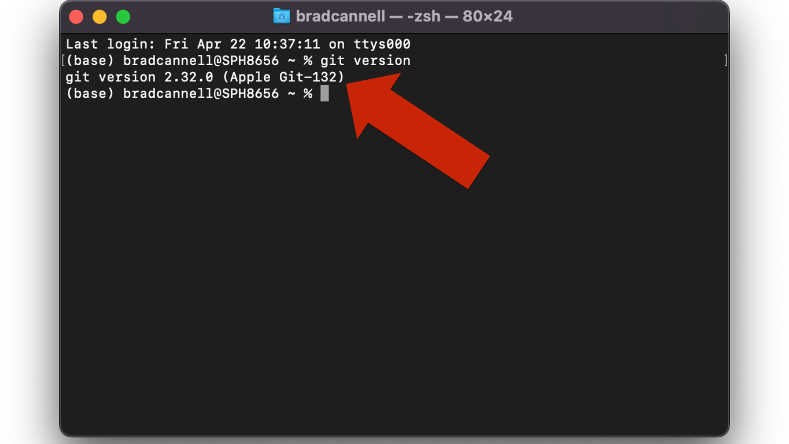
```

## Sign up for a GitHub account

We have already alluded to the fact that git and GitHub are not the same thing. You can use git locally on your computer without ever using GitHub. Conversely, you can browse GitHub, and even do some limited contributing to code, without ever installing git on your computer (e.g., see [Contributing to R4Epi](#contributing-to-r4epi))). However, git and GitHub work best when used together. You don’t need to download anything to start using GitHub, but you will need to sign up for a free GitHub account. To do so, just navigate to https://github.com/ 

```{r echo=FALSE}
knitr::include_graphics("img/08_part_collaboration/github_01_home.png")
```

## Install GitKraken

Git is software for our computer. However, unlike most of the software we are used to using, git does not have a [graphical user interface](https://en.wikipedia.org/wiki/Graphical_user_interface) (GUI - pronounced "gooey"). In other words, there is no git application that we can open and start clicking around in. Instead, by default, we interact with git by typing commands into the computer’s terminal -- also called "command line" in GitHub's documentation -- like we saw in \@ref(fig:terminal). The commands we type to use git kind of look like their own programming language. In our experience, interacting with git in the terminal is awkward, inefficient, and unnecessary for most new git users. And learning to use git in this way is a barrier to getting started in the first place. 😩

Thankfully, other third-party vendors have made excellent GUI's for git that we can download and use for free. Our current favorite is called **GitKraken**. To use GitKraken, you will first need to navigate to the GitKraken website (https://www.gitkraken.com/). If it helps, you can think of git and GitKraken as having a relationship that is very similar to the relationship between R and RStudio. R is the language. RStudio is the application that makes it easier for us to use the R language to work with data. Similarly, git is the language and GitKraken is the application that makes it easier for us to use git to track versions of our project files.

Before you use the GitKraken client, you will need to sign up for an account. It may say that you need to sign up for a free trial. Go ahead and do it. The free trial is just for the “Pro” version. At the end of the free trial, you will automatically be downgraded to the “Free” version, which is… free. And, the free version will do everything you need to do to follow along with this book. 

```{r echo=FALSE}
knitr::include_graphics("img/08_part_collaboration/gitkraken_01_home.png")
```

Next, you will need to click on the “Try Free” button. Then, download and install the GitKraken Client to your computer.

```{r echo=FALSE}
knitr::include_graphics("img/08_part_collaboration/gitkraken_02_client.png")
```

As you are installing GitKraken, it should ask you if you want to sign up with your GitHub account. Yes, you do! It will make your life much easier down the road. If you didn't sign up for a GitHub account in the previous step, please go back and do so. 

```{r echo=FALSE}
knitr::include_graphics("img/08_part_collaboration/gitkraken_03_github.png")
```

Then click the green `Continue authorization` button. 

```{r echo=FALSE}
knitr::include_graphics("img/08_part_collaboration/gitkraken_04_authorize.png")
```

Then, you will be asked to sign into your GitHub account -- possibly using your two-factor authentication. When you see the success screen, you can close your browser and return to GitKraken.

```{r echo=FALSE}
knitr::include_graphics("img/08_part_collaboration/gitkraken_05_success.png")
```

The next thing you will do is create a profile. After you create a profile, you will be asked if you want the Repo Tab first or the Terminal Tab first. We recommend that you select the Repo Tab option. 

```{r echo=FALSE}
knitr::include_graphics("img/08_part_collaboration/gitkraken_06_repo_tab.png")
```

Once you have installed Git and GitKraken, and you’ve created your GitHub account, you will have all the tools you need to follow along with all of the examples in this book. Speaking of examples, let’s go ahead and take a look at a couple now.

## Example 1: Contribute to R4Epi 

If you haven't already done so, please read the [contributing to R4Epi portion of the book's welcome page](#contributing-to-r4epi)). This will give you a gentle introduction to using GitHub, for a very practical purpose, without even needing to use git or GitKraken. 

## Example 2: Create a repository for a research project

In this example, we will learn how to create our very own git and GitHub repositories from scratch. We can immediately begin using the lessons from this example for our research projects -- even if we aren't collaborating with others on them. Remember, [there are at least four overarching reasons why you should consider learning to use git and GitHub as part of your workflow for your projects][Introduction to git and GitHub], and collaboration is only one of them. Not to mention the fact that it is often useful to think of our future selves as other collaborators, which we have mentioned and/or alluded to many times in this book. 

There are many possible ways we could set up our project to take advantage of all that git and GitHub have to offer. We're going to show you one possible sequence of steps in this example, but you may decide that you prefer a different sequence as you get more experience, and that's totally fine!

This example is long! So, we created a brief outline that you can quickly reference in the future. Details are below.

[Step 1: Create a repository on GitHub]    
[Step 2: Clone the repository to your computer]   
[Step 3: Add an R project file to the repository]   
[Step 4: Update and commit gitignore]    
[Step 5: Keep adding and committing files]    

### Step 1: Create a repository on GitHub {-}

The first thing we will do is create a repository on _GitHub_. **Repositories** are the fundamental organizational units of your GitHub account. Other cloud storage services like Dropbox are organized into file folders at every level. Meaning, you have your main Dropbox folder, which has other folders nested inside of it -- many of which may have their own nested folders. Your GitHub account also stores all your files in file folders; however, the level one folders — those that aren’t nested inside of another folder — are called repositories (represented by the book icon in the image below and on the GitHub website). Typically, each repository is an entire, self-contained project. Like a file folder, each repository can contain other folders, code files, media files, data sets, and any other type of file needed to reproduce your research project.

```{r echo=FALSE, fig.cap="GitHub repositories compared to Dropbox."}
knitr::include_graphics("img/08_part_collaboration/repositories_01.png")
```

<p class="warning"> ⚠️**Warning:** Just because we _can_ upload data to GitHub doesn't mean we _should_ upload data to GitHub. Often, the data we use in epidemiology contains [protected health information](https://privacyruleandresearch.nih.gov/pr_07.asp) (PHI) that we must go to great lengths to keep secure. In general, GitHub is **NOT** considered a secure place to store our data and should not be used for this purpose. Below, we will demonstrate how to make sure our data isn't uploaded to GitHub with the rest of the files in our repository. </p>

To create a new repository in GitHub, we will simply click the green `Create repository` button. This button will look slightly different depending on where we are at in the GitHub website. The screenshot below was taken from Arthur Epi's (our fictitious research assistant) main landing page (i.e., https://github.com/).

```{r echo=FALSE}
knitr::include_graphics("img/08_part_collaboration/new_repository_01_create.png")
```

After clicking the green `Create repository` button, the next page Arthur will see is the setup page for his repository. For the purposes of this example, he will use the following information to set it up.

* **Repository name**: As the on-screen prompt says, great repository names are short and memorable. Further, the repository name must be unique to his account (i.e., he can't have two repositories with the same name), and it can only include letters, numbers, dashes (`-`), underscores (`_`), and periods (`.`). We recommend using underscores to separate words to be consistent with the object naming guidelines from [coding-best-practices]. For this example, he will name the repository `r4epi_example_project`.

* **Description**: The description is optional, but we like to fill it in. Arthur's description should also be brief. Ideally it will allow others scanning our repository to quickly determine what it's all about. For this example, the description will say, "An example repository that accompanies the git and GitHub chapters in the R4Epi book."

* **Public/Private**: We can choose to make our repositories public or private. If we make them public, they can be _viewed_ by anyone on the internet. If we make them private, we can control who is able to view them. At first, you may be tempted to make your repositories private. It can feel vulnerable to put your project/code out there for the entire internet to view. However, we are going to recommend that you make all of your repositories public and be thoughtful about the files/documents/information you choose to upload to them. For example, we **NEVER** want to upload data containing information with PHI or individual identifiers in it. So, we will often need to figure out a different way to share our data with others who legitimately need access to it, but we can often use GitHub to share all other files related to the project. Making our repository public makes it easier for others to locate our work and potentially collaborate with us.

* **Add a README file**: A **README** file has a special place in GitHub. Under the hood, it is just a markdown file. No different than the markdown files we learned about in the chapter on [R markdown]. However, naming it `README` gives it a special status. When we include a README file in our repository, GitHub will automatically add it to our repository's homepage. We should use it to give others more information about our project, what our repository does, how to use the files in our repository, and/or how to contribute. So, we will definitely want a README file. Arthur may as well go ahead and check the box to create it along with his repository (although, we can always add it later). 

* **Add .gitignore**: We will discuss `.gitignore` later. Briefly, you can think of it as a list of files we are telling GitHub to ignore (i.e., not to track). This gets back to versioning, which we discussed in the [Versioning] section of the introduction to git and GitHub chapter. For now, Arthur will just leave it as is. 

* **License**: The GitHub documentation states that, "Public repositories on GitHub are often used to share open-source software. For your repository to truly be open source, you'll need to license it so that others are free to use, change, and distribute the software." @GitHub2022-iw Because we aren't currently using our repository to create and distribute open-source software (like R!!), we don't need to worry about adding a license. That isn't to say that you won't _ever_ need to worry about a license. For more on choosing a license, we can consult the [GitHub documentation](https://docs.github.com/en/repositories/managing-your-repositorys-settings-and-features/customizing-your-repository/licensing-a-repository) or potentially consult with our employer or study sponsor. For example, our universities have officials that help us determine if our repositories need a license.

```{r echo=FALSE}
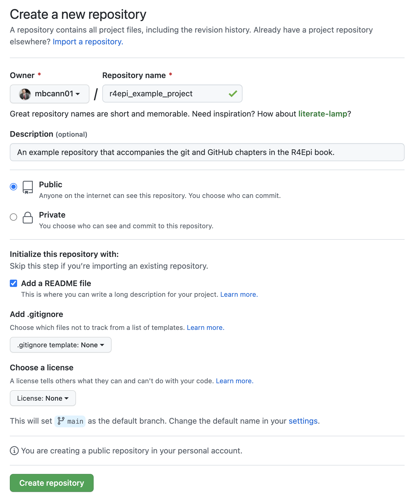
```

Now, that he has completed all the setup steps, Arthur can click the green `Create repository` button. This will create his repository and take him to its homepage on GitHub. As you can see in the screenshot below ([you can also navigate to the website yourself](https://github.com/arthur-epi/r4epi_example_project)), GitHub creates a basic little website for the repository. The top middle portion of the page (outlined in red below) displays all of the files and folders in the repository. Currently, the repository only contains one file -- `README.md` -- but Arthur will add others soon.

```{r echo=FALSE}
knitr::include_graphics("img/08_part_collaboration/new_repository_03_files.png")
```

To the right of files and folders section of the homepage is the `About` section of the page. This section (outlined in red below) contains the repository's description, tags, and other information that we will ignore for now.

```{r echo=FALSE}
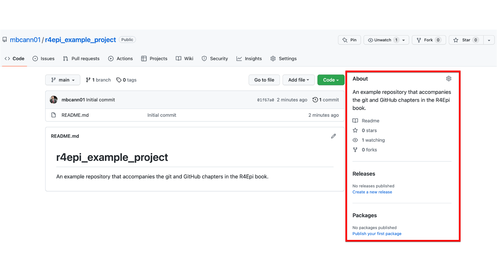
```

Below the files and folders section of the page is where the **README** file is displayed. Notice that by default, GitHub added the repository's name and description to the README file. Not a bad start, but we can add all kinds of cool stuff to README -- including tables, figured, images, links, and other media. In fact, you can add almost anything to a README file that you can add to any other website. This is a great place to get creative and really make your project stand out! 

```{r echo=FALSE}
knitr::include_graphics("img/08_part_collaboration/new_repository_05_readme.png")
```

Now, Arthur has a working GitHub repository up and running. Let's pause for a moment to and celebrate! 🎉 

Okay, celebration complete. Now, what does he do with this new GitHub repository? Well, he does the four things covered in [Introduction to git and GitHub].

1. He will start adding files to his repository and document their purpose and evolution with **versioning**.   
2. In the process, he will **preserve** his files, and by extension, his project.   
3. Doing so will help to make his research more **reproducible**.    
4. And make it easier for him to **collaborate** with others -- including his future self.      

Let's start by taking a look at versioning in GitHub. As we discussed in the [Versioning] section of the [Introduction to git and GitHub] chapter, GitHub uses the word **commit** to refer to taking a snapshot of the state of our project, similar to how we might typically think about saving a version of a document we are working on. We saw how we could view the version history of our Google Doc by clicking `File` then `Version history` then `See version history`. In GitHub, we can similarly view the version history (also called the commit history) of our repository. To do so, we navigate to our repository's homepage, and click on the word `commit` in the top right corner of the files section (outlined in red below).

```{r echo=FALSE}
knitr::include_graphics("img/08_part_collaboration/new_repository_06_commit.png")
```

This will take us to our repository's version history page. Currently, this repository only has one commit -- the "Initial commit". This name is used by convention in the GitHub community to refer to the first commit in the repository. The history also tells us when the commit was made and who made it. On the right side of the commit, there are three buttons. 

```{r echo=FALSE}
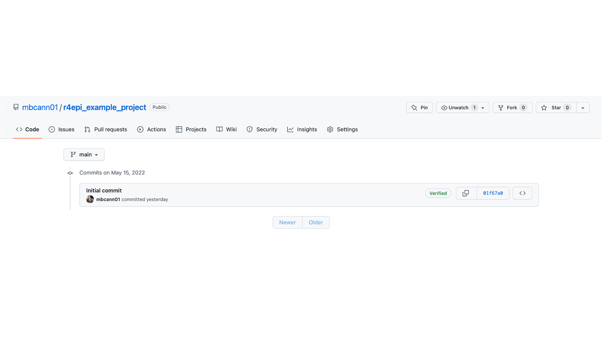
```

1. The first button on the left that looks like two partially overlapping boxes will copy the commit's ID so that we can paste it elsewhere if we want. In GitHub, every commit is assigned a unique ID, which is also called an "SHA" or "hash". The commit ID is a string of 40 characters that can be used to refer to a specific commit. The `274519` displayed on the middle button is the first 7 characters of this commit's ID.

2. As noted above, the middle button is labeled with the first 7 characters of this commit's ID - `274519`. Clicking on it will take us to a new screen with the details of what this commit does to the files in the repository (i.e., additions, edits, and deletions). Arthur will click it so we take a look momentarily. 

3. The button on the far right, which is labeled with two angle brackets (`< >`) will take us back to the repository's homepage. However, the files in the repository will be set back to the state they were in when the commit was made. In this case, there is only one commit. So, there's no difference between the current state of the repository and the state it would be in if Arthur clicked this button. However, this button can be useful. If Arthur makes some changes to a file and then later wants to see what the file looked like before he made those changes, he can use this button to take a look.

Now, Arthur will click the middle button labeled with the short version of the commit ID.

On the page he is taken to, we can see more details about what commit `274519` does to the files in the repository. The top section of the page (outlined in red below) contains pretty much the same information we saw on the previous page. The little symbol on the left that looks kind of like a backwards 4 with open circles at the ends of the lines tells us which branch we are operating on. Branches are a more advanced topic that we will discuss later. Currently, our repository only has one branch -- the default `main` branch -- and the symbol followed by the word "main" is telling us that this commit is on the main branch. To the far right of this section, there is a button that says `Browse files`. Clicking this button does the exact same thing as the button on the previous page that was labeled with two angle brackets (`< >`). Below the `Browse files` button, are the words `0 parents` and `commit 277451996a7e9a0a6e583124d762db2a9cd439a2`. This tells us that this commit doesn't have any parent commits and that the full commit ID is `277451996a7e9a0a6e583124d762db2a9cd439a2`. We discussed commit ID's above. The parent commit is the commit or commits that this commit is based on. In other words, what were the other things that happened to get us to this point? Because this is the initial commit, there are no parent commits. 

```{r echo=FALSE}
knitr::include_graphics("img/08_part_collaboration/new_repository_08_commit_details_01.png")
```

The middle section of the commit details page tells us that applying this commit to the repository changes 1 file. In that file, there are two additions and no deletions. Below this text we can see which file was changed - `README.md`. This is also called the **diff view** because we can see the **diff**erences between this version of the file and previous versions of the file. In this case, because there wasn't a previous version of the file, we just see the two additions that were made to the file. They are the level one header that was added to the first line of the file (i.e., `# r4epi_example_project`) and our project's description was added to the second line of the file. These additions were made automatically by GitHub. We know they are additions because the background color is green and there is a little plus sign immediately to their left. We know which lines of the file were changed because GitHub shows us the line number immediately to the left of the plus signs. 

```{r echo=FALSE}
knitr::include_graphics("img/08_part_collaboration/new_repository_08_commit_details_02.png")
```

The final section of the commit details page shows us any existing comments that Arthur, or others, made about this commit. It also allows us, or others to create a new comment, using the text box. 

```{r echo=FALSE}
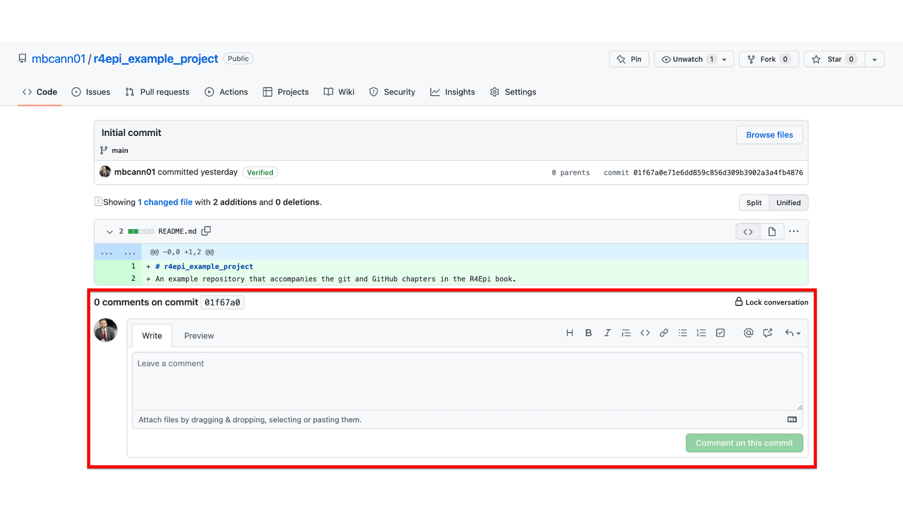
```

In the screenshot below, we can see an example comment. Note all the cool things features GitHub comments allow us to use. We can format the text, add bullets, add links, and even add clickable checkboxes.

```{r echo=FALSE}
knitr::include_graphics("img/08_part_collaboration/new_repository_08_commit_details_04.png")
```

Finally, clicking the green `Comment on this commit` button adds our comment to the commit details page.

```{r echo=FALSE}
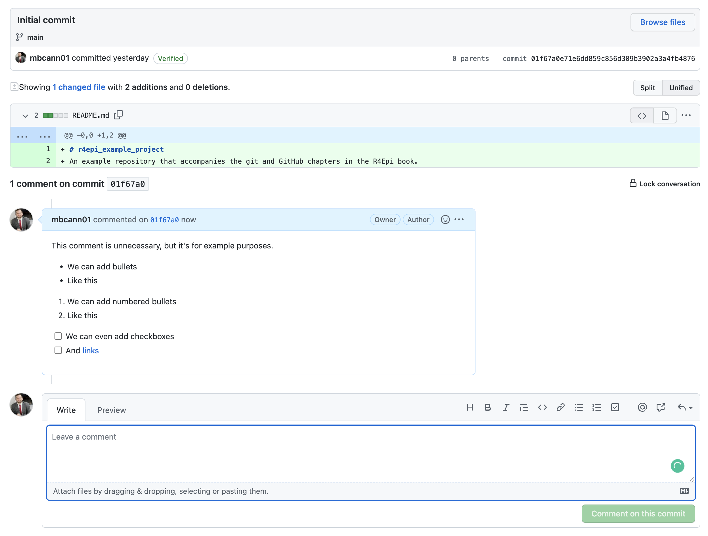
```

Let's pause here for a moment and try to appreciate how powerful GitHub already is compared to other cloud-based file storage services like Dropbox, Google Drive, or OneDrive. Like those file storage services, all of our files are backed up and preserved in the cloud and can easily be shared with others. However, unlike Dropbox, Google Drive, and OneDrive, we can turn our repository's homepage into a little website describing our project, we can view all the changes that have been made to our project over time, we can see which specific lines of each file have changed and how, and we can gather all comments, questions, and concerns about the files in one place. Oh, and it's **Free**! 

### Step 2: Clone the repository to your computer {-}

At this point, Arthur's repository, which is just a fancy file folder, and the one file in his repository (README.md), only exist on the GitHub cloud. 

<p class="note"> 🗒**Side Note:** What is "the GitHub cloud"? For our purposes, the cloud just refers to a specific type of computer -- called a server -- that physically exists somewhere else in the world, which we can connect to over the internet. GitHub owns many servers, and our files are stored on one of them. After we connect to the GitHub server, we can pass files back and forth between our computer and GitHub's computer (i.e., the server). </p>

```{r github-cloud, echo=FALSE, fig.cap="GitHub Cloud."}
knitr::include_graphics("img/08_part_collaboration/new_repository_09_github_cloud.png")
```

So, how does he get the repository from the GitHub cloud to his computer so that he can start making changes to it? 

He will [clone](https://docs.github.com/en/repositories/creating-and-managing-repositories/cloning-a-repository) the repository to his computer. Don't get thrown off by the funny name. You can simply think "make a copy of" whenever you see the word "clone" for now. So, he will "make a copy of" the repository on his computer. However, cloning the repository actually does two very useful things at once:

1. It creates a copy of our repository, and all of the files and folders in it, on our computer.   
2. It creates a connection between our computer and the GitHub cloud that allows us to pass files back and forth.    

There are multiple possible ways we could clone our repository, but we're going to use GitKraken in this book. If you did not already download GitKraken and connect it with your GitHub account as demonstrated at the beginning of the chapter, please do so now. 

When we open GitKraken, we should see something similar to the screenshot below. Arthur will start the cloning process by clicking the `Clone a repo` button.

```{r echo=FALSE}
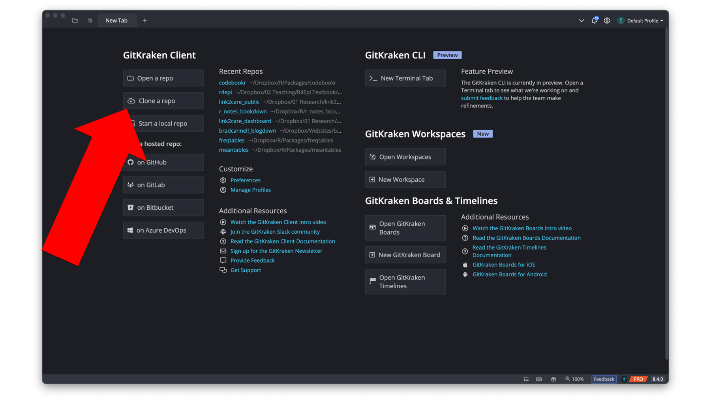
```

When the Repository Management dialogue box opens, he will need to make 3 changes.

1. Click `GitHub.com` in the clone menu. This tells GitKraken that the repository he wants to clone currently lives on his GitHub account. Note that it has to be on **his** account in order for it to show up on this list -- not someone else's account. We will learn how to get files from someone else's account later.   

2. Set the path where he wants the repository to be cloned to. Remember, the repository is a just a folder with some files in it. When we clone the repository to our computer, those files and folders will live on our computer somewhere. We need to tell GitKraken where we want them to live. In the screenshot below, Arthur is just cloning the repository to his computer's desktop. 

3. Tell GitKraken which repository on his GitHub account he wants to clone. We can use the drop-down arrow to search a list of all of our repositories. In the screenshot below, Arthur selected the `r4epi_example_project` repository. 

```{r echo=FALSE}
knitr::include_graphics("img/08_part_collaboration/new_repository_10_clone_02.png")
```

Finally, he will click the green `Clone the repo!` button. Now, he has successfully cloned his repository to his computer! 🎉

Before moving on, let's pause and review what just happened. 

```{r echo=FALSE}
knitr::include_graphics("img/08_part_collaboration/new_repository_10_clone_03.png")
```

As we discussed above, Arthur's repository already existed on the GitHub cloud (see \@ref(fig:github-cloud). In git terminology, the GitHub cloud called a **remote repository**, or "repo" for short. Remote repositories are just copies of our repository that live on the internet or some other network. Arthur then **cloned** his remote repository to his computer. That means, he made a copy of all of the files and folders on his computer. In git terminology, the repository on our computer is called a **local** repository.

Now that he has successfully cloned his repository, he should be able to view it in two different ways.  

First, he should be able to see his repository's file folder on his desktop (because that's the location he chose above). 

```{r echo=FALSE}
knitr::include_graphics("img/08_part_collaboration/new_repository_11_view_folder.png")
```

Second, he should be able to open a tab in GitKraken with all the versioning information about his repository. 

```{r echo=FALSE}
knitr::include_graphics("img/08_part_collaboration/new_repository_12_view_gitkraken_01.png")
```

Let's pause here and **watch a brief video** from GitKraken that orients us to the GitKraken user interface. For now, the first three minutes of the video is all we need. There may be some unfamiliar terms in the video. Don't stress about it! We will cover the most important parts after the video and learn some of the other terms in future examples. 

```{r echo=FALSE, out.width="100%"}
knitr::include_url("https://www.youtube.com/embed/RiAeNSFjjLc")
```

Moving back to Arthur's repository, we can see that the repository graph in the middle section of the user interface has only on commit -- the initial commit. This matches what we saw on GitHub. 

```{r echo=FALSE}
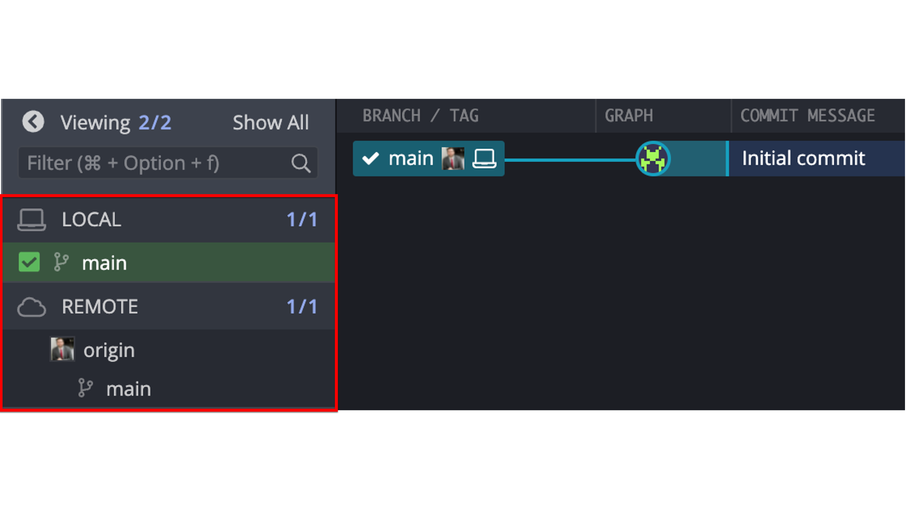
```

If we zoom in on the upper left corner of the left sidebar menu (outlined in red below), we can see that GitKraken is aware of two different places where the repository lives. First, it tells us that Arthur has a local repository on his computer with one branch -- the main branch. Next, it tells us that there is one remote location for the repository -- called "origin" -- with one branch -- the main branch.

The term "origin" is used by convention in the git language to refer to the remote repository that we originally cloned from. It uses the nickname "origin" instead of using the remote repository's full URL (i.e., web address). Arthur could change this name if he wanted, but there's really no need.

```{r echo=FALSE}
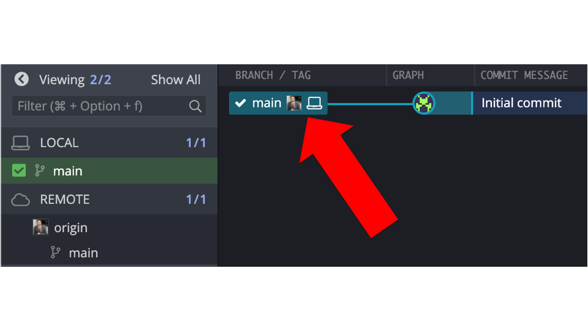
```

Another useful thing we can see in the current view, is that the local repository and the remote repository on GitHub are in sync. Meaning, the files and folders in the repository on Arthur's computer are identical to the files and folders in the repository on the GitHub cloud. We know this because the little white and gray picture that represents the remote repository and the little picture of the laptop that represents the local repository are located side-by-side on the repository graph (see red arrow below). When we have made changes in one location or another, but haven't synced those changes to the other location, the two icons will be in different rows of the repository graph. We will see an example of this soon.

```{r echo=FALSE}
knitr::include_graphics("img/08_part_collaboration/new_repository_12_view_gitkraken_04.png")
```

### Step 3: Add an R project file to the repository {-}

This step is technically optional, but we highly recommend it! We introduced [R projects] earlier in the book. Arthur will go ahead and add an R project file to his repository now. This will make his life easier later. To create a new R project, he just needs to click the drop-down arrow next to the words `Project: (None)` to open the projects menu. Then, he will click the `New Project...` option.

```{r echo=FALSE}
knitr::include_graphics("img/08_part_collaboration/new_repository_13_new_project_01.png")
```

That will open the new project dialogue box. This time, he will click the `Existing Directory` option instead of clicking the `New Directory` option. Why? Because the directory (i.e., folder) he wants to contain his R project already exists on his computer. Arthur cloned it to his desktop in [step 2][Step 2: Clone the repository] above.  

```{r echo=FALSE}
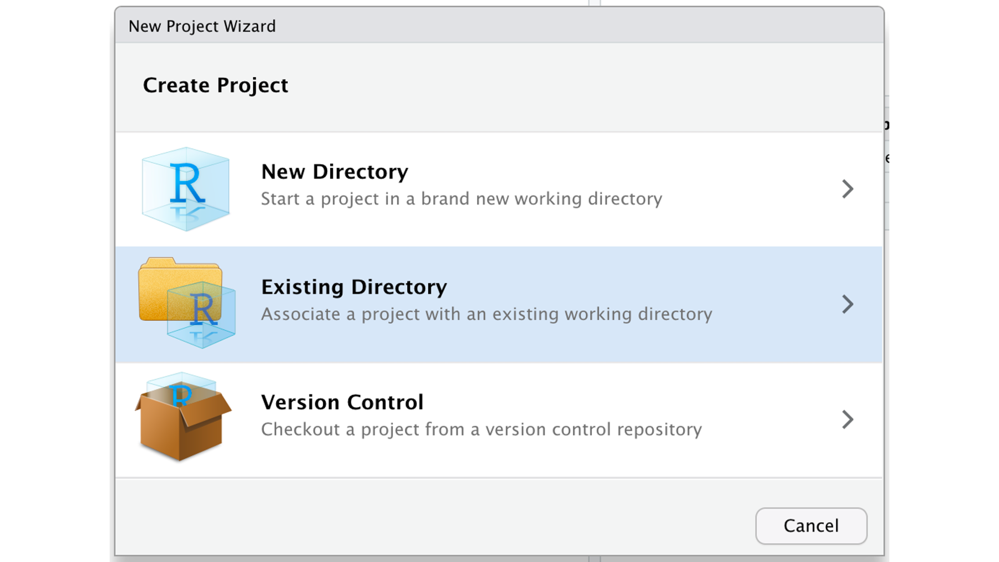
```

All Arthur has to do now, is tell RStudio where to find the `r4epi_example_project` directory on his computer using the `Browse...` button. In this case, on his desktop. Finally, he will click the `Create Project` button. 

```{r echo=FALSE}
knitr::include_graphics("img/08_part_collaboration/new_repository_13_new_project_03.png")
```

### Step 4: Update and commit gitignore {-}

Let's take a look at Arthur's RStudio files pane. Notice that there are now three files in the project directory. There is the `README` file, the `.Rproj` file, and a file called `.gitignore`. RStudio created this file automatically when Arthur designated the directory as an R project. 

Outside of the name -- `.gitignore` -- there is nothing special about this file. It's just a plain text file. But naming it `.gitignore` tells the git software that it contains a list of files that git should ignore. By ignore, we mean, "pretend they don't exist." 

```{r echo=FALSE}
knitr::include_graphics("img/08_part_collaboration/new_repository_14_gitignore_01.png")
```

Arthur will now open the `.gitignore` file and see what's there.

```{r echo=FALSE}
knitr::include_graphics("img/08_part_collaboration/new_repository_14_gitignore_02.png")
```

Currently, there are four files on the `.gitignore` list. These files were added automatically by RStudio to try to help him out. Tracking versions of these files typically isn't useful. Because these files are on the `.gitignore` list, git and GitHub won't even notice if Arthur creates, edits, or deletes any of them. This means that they also won't ever be uploaded to GitHub.

At this point, Arthur is going to go ahead and add one more file to the `.gitignore` list. He will add `.DS_store` to the list. `.DS_store` is a file that the MacOS operating system creates automatically when a Mac user navigates to a file or folder using Finder. None of that really matters for our purposes, though. What does matter is that there is no need to track versions of this file and it will be a constant annoyance if Arthur doesn't ignore it. 

If Arthur were using a Windows PC instead of a Mac, the `.DS_store` file should not be an issue. However, adding `.DS_store` to `.gitignore` isn't a bad idea even when using a Windows PC for at least two reasons. First, there is no harm in doing so. Second, if Arthur ever collaborates with someone else on this project who is using a Mac, then the `.DS_store` file could find its way into the repository and become an annoyance. Therefore, we recommend always adding `.DS_store` to the `.gitignore` list regardless of the operating system you personally use. 

Adding `.DS_store` (or any other file name) to the `.gitignore` list is as simple as typing `.DS_store` on its own line of the `.gitignore` file and clicking `Save`. 

```{r echo=FALSE}
knitr::include_graphics("img/08_part_collaboration/new_repository_14_gitignore_03.png")
```

Typically, the next thing we would do after creating our repository is to start creating and adding the files we need to complete our analyses. 

Now, Arthur will open GitKraken so we can take a look. Notice that Arthur's GitKraken looks different than it did the last time we viewed it. That's because we've been making changes to the repository. Specifically, we've added two files since the last commit was made. There are at least two ways we can tell that is the case. 

First, the repository graph in the middle section of the user interface has now has two rows. The bottom row is still the initial commit, but now there is a row above it that says `// WIP` and has a `+ 2` symbol. `WIP` stands for work in progress and the `+ 2` indicates that there are two files that have changed (in this case, they were added) since the last commit. So, Arthur has been working on two files since his last commit. 

Additionally, the commit panel on the right side of the screen shows that there are two new uncommitted and unstaged files in the directory. They are `.gitignore` and `r4epi_example_project.Rproj`.

```{r echo=FALSE}
knitr::include_graphics("img/08_part_collaboration/new_repository_15_commit_01.png")
```

At this point, Arthur wants to take a snapshot of the state of his repository. Meaning, he wants to save a version of his repository as it currently exists. To do that, he first needs to **stage** the changes since the previous commit that he wants to be included in this commit. In this case, he wants to include all changes. So, he will click the green `Stage all changes` button located in the commit panel.

```{r echo=FALSE}
knitr::include_graphics("img/08_part_collaboration/new_repository_15_commit_02.png")
```

After clicking the `Stage all changes` button, the two new files are moved down to the `Staged Files` window of the commit panel.

```{r echo=FALSE}
knitr::include_graphics("img/08_part_collaboration/new_repository_15_commit_03.png")
```

Next, Arthur will write a commit message. Just like there are [best practices for writing R code][Coding best practices], there are also best practices for writing commit messages. Here is a link to a blog post that we think does a good job of explaining these best practices: https://cbea.ms/git-commit/. 

The first line is called the **commit message**. You can think of the commit message as a brief summary of what this commit does to the repository. This message will help Arthur and his collaborators find key commits later in the future. In this context, "brief" means 72 characters or less. GitKraken tries to help us out by telling us how many characters we've typed in our commit message. Additionally, the commit message should be written in the imperative voice -- like a command. Another way to think about it is that the commit message should typically complete the phrase, "If applied, this commit will...". The screenshot below shows that Arthur wrote `Add Rproj and gitignore to project` (red arrow 1). 

In addition to the commit message, there is also a description box we can use to add more details about the commit. Sometimes, this is unnecessary. However, when we do choose to add a description, it is best practice to use it to explain _what_ the commit does or _why_ we chose to do it rather than _how_ it does whatever it does. That's in the code. In the screenshot below, you can see that Arthur added some bulleted notes to the description (red arrow 2).

Finally, Arthur will click the green commit button at the bottom of the commit panel (red arrow 3). This will commit (save) a version of our repository that includes the changes to any of the files in the `Staged Files` window.  

```{r echo=FALSE}
knitr::include_graphics("img/08_part_collaboration/new_repository_15_commit_04.png")
```

And here is what his GitKraken screen looks like after committing.

```{r echo=FALSE}
knitr::include_graphics("img/08_part_collaboration/new_repository_15_commit_05.png")
```

Let's pay special attention to what is being displayed in a couple of different areas. We'll start by zooming in on the commit panel.

At the top of the commit panel, we can see the short version of the commit ID -- `4a394b`. Below that, we can see the commit message and description. Below that, we can see who created the commit and when. This tends to be more useful when we are collaborating with others. To the right of that information, GitKraken also shows us the commit ID for this commit's parent commit -- `277451`. Finally, it shows us the file changes that this commit applies to our repository. More specifically, it shows us the changes that commit `4a394b` makes to commit `277451`. 

```{r echo=FALSE}
knitr::include_graphics("img/08_part_collaboration/new_repository_15_commit_06.png")
```

At this point, you may be wondering what this whole parent-child thing is and why we keep talking about it. The diagram below is a very simple graphical representation of how git views our repository. It views it as a series of commits that chronologically build our repository when they are applied to each other in sequence. Familial terms are often used in the git community to describe the relationship between commits. For example, in the diagram below commit `4a394b` is a child of commit `288451`. Child commits are always more recent than parent commits. This knowledge is not incredibly useful to us at this point, but it can be helpful when we start to learn about more advanced topics like merging commits. For now, just be aware of the terminology.

```{r echo=FALSE}
knitr::include_graphics("img/08_part_collaboration/new_repository_15_commit_07.png")
```

It is also important to point out that Arthur's most recent commit (`4a394b`) **only exists in his local repository**. That is, the repository on his computer. He has not yet shared the commit -- or the new files associated with the commit -- to the remote repository on GitHub. 

```{r echo=FALSE}
knitr::include_graphics("img/08_part_collaboration/new_repository_15_commit_08.png")
```

How do we know? Well, one way we can tell is by looking at Arthur's GitKraken window. In the repository graph, the local repository (i.e., the little laptop icon) and the remote repository (i.e., the little gray and white icon) are on different rows. Additionally, there is a little `1` next to an up arrow displayed to the left of the main branch of our local repository in the left panel of GitKraken. Both of these indicate that the most recent commits contained in each repository are different. Specifically, that the local repository is one commit ahead of the remote repository.

This concept is important to understand. [In Google Docs][Versioning], when we made a change to our document locally, that change was automatically synced to Google's servers. We didn't have to _do_ anything to save/create a version of the document. We had to put in a little effort if we wanted to name a particular version, but the version itself was already saved -- identified using a date-time stamp. Conversely, git does not automatically make commits (i.e., save snapshots of the state of the files in our repository), nor does our local repository automatically sync up with our remote repository (in this case, GitHub). We have to do both of these things manually. This will create a little extra work for us, but it will also give us a lot more control. 

```{r echo=FALSE}
knitr::include_graphics("img/08_part_collaboration/new_repository_15_commit_09.png")
```

As one additional check, Arthur can go look at the repository's commit history on GitHub. As shown in the screenshot below, the commit history still only shows one commit -- the initial commit. 

```{r echo=FALSE}
knitr::include_graphics("img/08_part_collaboration/new_repository_15_commit_10.png")
```

Let's quickly pause and recap what Arthur has done so far. 

```{r echo=FALSE}
knitr::include_graphics("img/08_part_collaboration/new_repository_15_commit_11.png")
```

First, Arthur created a repository on GitHub. It was a remote repository because he accesses it over the internet. Then, he cloned (i.e., made a copy of) the remote repository to his computer. This copy is referred to as a local repository. Next, Arthur made some changes to the repository locally and committed them. At this point, the local repository is 1 commit ahead of the remote repository, and the changes that Arthur made locally are not currently reflected on GitHub. 

So, how does Arthur sync the changes he made locally with GitHub? He will **push** them to GitHub, which GitKraken makes incredibly easy. All he needs to do is click the `Push` button at the top of his GitKraken window (see below). 

```{r echo=FALSE}
knitr::include_graphics("img/08_part_collaboration/new_repository_15_commit_12.png")
```

After doing so, we will once again see some changes. What changes do you notice in the screenshot below?

```{r echo=FALSE}
knitr::include_graphics("img/08_part_collaboration/new_repository_15_commit_13.png")
```

In the repository graph, the local repository (i.e., the little laptop icon) and the remote repository (i.e., the little gray and white icon) are back on the same row. Additionally, the little `1` next to an up arrow is no longer displayed in the left panel. Both of these changes indicate that the most recent commits contained in each repository are the same.

And if Arthur once again checks GitHub...

```{r echo=FALSE}
knitr::include_graphics("img/08_part_collaboration/new_repository_15_commit_14.png")
```

He will now see that the GitHub repository also has two commits. He can click on the text that says `2 commits` to view each commit in the commit history. 

```{r echo=FALSE}
knitr::include_graphics("img/08_part_collaboration/new_repository_15_commit_15.png")
```

In the commit history, he can now see commit `4a394b7`. Let's take another pause here and recap.

```{r echo=FALSE}
knitr::include_graphics("img/08_part_collaboration/new_repository_15_commit_16.png")
```

First, Arthur created a repository on GitHub. Then, he **cloned** the remote (i.e., GitHub) repository to his computer. Next, Arthur made some changes to the repository locally and **committed** them locally. Finally, he **pushed** the local commit up to GitHub. Now, his GitHub repository and local repository are in sync with each other. 

We realize that it probably seems like it took a lot of work for Arthur to get everything set up. But in reality, all of the steps up to this point will only take a couple of minutes once you've gone through them a few times. 

### Step 5: Keep adding and committing files {-}

At this point, Arthur has his repositories all set up and is ready to start rocking and rolling on his actual data analysis. To round out this example, Arthur will add some data to his repository that he will eventually analyze using R.

```{r echo=FALSE}
knitr::include_graphics("img/08_part_collaboration/new_repository_15_commit_17.png")
```

The screenshot above shows that Arthur created a new folder inside the R project directory called `data`. He created it in the same way he would create any other new folder in his computer's operating system. Then, he added a data set to the data folder he created. This particular data set happens to be stored in an Excel file named `form_20.xlsx`.

Now, when Arthur checks GitKraken, this is what he sees in the commit panel.

```{r echo=FALSE}
knitr::include_graphics("img/08_part_collaboration/new_repository_15_commit_18.png")
```

Just like before, GitHub is telling Arthur that he has a new unstaged file in the repository. Stop for a moment and think. What should Arthur do next?

Was your answer, "stage and commit the new file"? If so, slow down and think again. Remember, in general, we don't _ever_ want to commit our research data to our GitHub repository. GitHub is not typically considered secure or private. So, how can Arthur keep the data in his local repository so that he can work with it, keep his local repository synced with GitHub, but make sure the data doesn't get pushed up to GitHub?

Do you remember earlier when Arthur told git and GitHub to ignore the `.DS_Store` file? In exactly the same way, Arthur can tell git and GitHub to ignore this data set. And once it's ignored, it won't ever be pushed to GitHub. Remember, our local git repository only includes files it's **tracking** in commits, and it only pushes commits (and the files included in them) up to GitHub. 

In the screenshot below, Arthur added `data/` to line 6 of the `.gitignore` file. He could have added `form_20.xlsx` instead. That would have told git to ignore the `form_20.xlsx` data set specifically. However, Arthur doesn't want to push _any_ data to GitHub -- including any data sets that he may add in the future. By adding `data/` to the `.gitignore` file, he is telling git to ignore the entire folder named `data` and all of the files it contains -- now and in the future. 

```{r echo=FALSE}
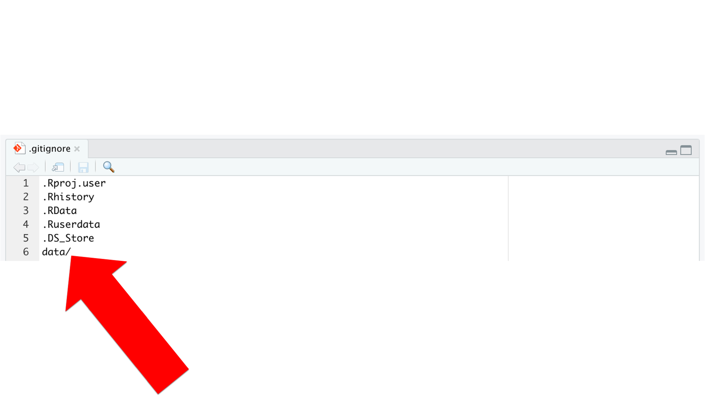
```

After saving the updated `.gitignore` file, the commit pane in GitKraken changes once again.

```{r echo=FALSE}
knitr::include_graphics("img/08_part_collaboration/new_repository_15_commit_20.png")
```

The new file `data/form_20.xlsx` is no longer showing up as an unstaged change. Instead, the only unstaged change showing up is the edited `.gitignore` file. We can tall that the changes to the `.gitignore` file are edits -- as opposed to adding the file for the first time -- because there is a little pencil icon to the left of the file name instead of a little green plus icon. Now what should Arthur do next?

Was your answer, "stage and commit the edited file"? If so, you are correct! Now it is safe for Arthur to go ahead and commit these changes. 

After doing so, he can see that the GitHub repository contains 3 commits. Additionally, as shown the red box below, the data folder is nowhere to be found among the files contained in the GitHub repository. 

```{r echo=FALSE}
knitr::include_graphics("img/08_part_collaboration/new_repository_15_commit_21.png")
```

Arthur will now add one final file to the `r4epi_example_project` as part of this example. He will add an R markdown file with a little bit of R code in it. The code will import `form_20.xlsx` into the global environment as a data frame. 

```{r echo=FALSE}
knitr::include_graphics("img/08_part_collaboration/new_repository_16_add_code.png")
```

An then he will commit and push the `data_01_import.Rmd` to GitHub in the same way he committed and pushed previous files to Github.

```{r echo=FALSE}
knitr::include_graphics("img/08_part_collaboration/new_repository_17_commit_data_01_import.gif")
```

Arthur can continue adding files to his local repository and then pushing them to GitHub in this fashion for the remainder of the time he is working on this project, and the [introduction to git and GitHub chapter][Introduction to git and GitHub] discusses _why_ he should consider doing so.

After going through this example, many students have three lingering questions: 

1. How often should we commit? 

2. How often should we push our commits to GitHub?

3. If we can't use GitHub to share our data, how _should_ we share data?

We will answer questions 1 & 2 immediately below. We will answer the third question in the [next example][Example 3: Contribute to a research project].

## Committing and pushing

As we are learning to use git and GitHub, it is reasonable to ask how often we should commit our work as we go along. For better or worse, there is no hard-and-fast rule we can give you here. In Happy Git and GitHub for the useR, Dr. Jennifer (Jenny) Bryan writes that we should commit "every time you finish a valuable chunk of work, probably many times a day." @Bryan2016-yy This seems like a pretty good starting place to us.

Of course, a natural follow-up question is to ask how often we should push our commits to GitHub. We could automatically push every commit we make to GitHub as soon as we make it. However, this isn't always a good idea. It is much easier to edit or rollback commits that we have only made locally than it is to edit or rollback commits that we've pushed to our remote repository. For example, if we accidentally include a data set in a commit and push it to GitHub, this is a much bigger problem than if we accidentally include a data set in a commit and catch it before we push to GitHub. For this reason, we don't suggest that you automatically push every commit you make to GitHub. So, how often _should_ you push? Well, once again, there is no hard-and-fast rule. And once again, we think Dr. Bryan's advice is a good starting point. She writes, "Do this [push] a few times a day, but possibly less often than you commit." @Bryan2016-yy It is also worth noting that how often you commit and push will also be dictated, at least partially, by the dynamics of the group of people who are contributing to the repository. So far, we have really only seen a repository with a single contributor (i.e., Arthur Epi). That will change in the next example. 

The advice above about committing and pushing may seem a little vague to you right now. It _is_ a little vague. We apologize for that. However, we believe it's also the best we can do. On the bright side, as you practice with git and GitHub, you will eventually fall into a rhythm that works well for you. Just give it a little time! 

## Example 3: Contribute to a research project

When our research assistants begin helping us with data management and analysis projects, we often have them start by going to the project’s GitHub repository to read the existing documentation and [clone][Step 2: Clone the repository to your computer] all the existing code to their computer. This example is going to walk through that process step-by-step. For demonstration purposes, we will work with the example repository that our fictitious research assistant named Arthur Epi created in [Example 2 above][Example 2: Create a repository for a research project]. 

<p class="note"> 🗒**Side Note:** It's probably worth noting that in most real-world scenarios the roles here would be reversed. That is, we (Brad or Doug) would have created the original repository and Arthur would be working off of it. However, the example repository above was already created using Arthur's GitHub account, and we will continue to work off of it in this example. If you are a research assistant working with us (i.e., Brad or Doug) in real life, and using this example to walk yourself through getting started on a real project, you should insert yourself (and your GitHub account) into Brad's role (and GitHub account) in the example below. </p> 

In this example, we're going to work collaboratively with Arthur on the `r4epi_example_project`. Arthur could have just emailed us all of the project files, but sometimes that might be _many_ files, some of them may be very large, and he runs the risk of forgetting to send some of them by accident. Further, every time any of the contributors adds or updates a file, they will have to email all the other contributors the new file(s) and an explanation of the updates they've made. This process is typically inefficient and error prone. Conversely, Arthur could set up a shared folder on a cloud-based file storage service like Dropbox, Google Drive, or OneDrive. Doing so would circumvent the issues caused by emailing files that we just mentioned (i.e., many files, large files, forgetting files, and manually sending updates). However, Dropbox, Google Drive, and OneDrive aren’t designed to take advantage of all that git and GitHub have to offer (e.g., project documentation, versioning and version history, viewing differences between code versions, issue tracking, creating static websites for research dissemination, and more). Because Arthur created his repository on GitHub, all of the files and documentation we need to get started assisting him are easily accessible to us. All, he has to do is send us the repository’s web address, which is https://github.com/arthur-epi/r4epi_example_project.

After navigating to a GitHub repository, the first thing we typically want to do is read the README. It should have some useful information for us about what the repository does, how it is organized, and how to use it. Because this is a fictitious, minimal example for the book, the current README in the `r4epi_example_project` project isn't that useful, impressive, or informative. Matias Singers maintains a list of great READMEs at the following link that you may want to check out: https://github.com/matiassingers/awesome-readme. If you want to see an example README from a real research project that we worked on, you can check out this link: https://github.com/brad-cannell/detect_pilot_test_5w. 
After we read over the README file, we are ready to start making edits and additions to the project. But how do we do that? 

While it is technically possible for us to edit code files directly on GitHub (see [Contributing to R4Epi]), this is typically _only_ a good idea for _extremely minor edits_ (e.g., a typo in the documentation). Typically, we will want to make a copy of all the code files on our computer so that we can experiment with the edits we are making. Said another way, we can suggest _edits_ to R code files directly on GitHub, but we can't _run_ those files in R directly on GitHub to make sure they do what we intend for them to do. To test our changes in R, we will need all of the repository's files on our local computer. And how do we do that?

### Forking a repository 

If your answer the question above was, "we **clone** the `r4epi_example_project` repository to our computer" you were close, but that isn't our best option here. While we technically _can_ clone public repositories that aren't on our account, we _can't_ push any changes to them. And this is a **good thing**! Think about it, do we really want any person out there on the internet to be able to make changes to our repository anytime they want without any oversight from us? No way!

```{r echo=FALSE}
knitr::include_graphics("img/08_part_collaboration/forking_01.png")
```

In this case, **forking** the repository is going to be the better option. This is another funny name, but we are once again just talking about making a copy of the repository. However, this time we are copying the repository from the original _GitHub account_ (i.e., Arthur's) to our _GitHub account_. With cloning, we were copying the repository from the original _GitHub account_ to our _computer_. Do you see the difference? Let's try to visualize it.

```{r echo=FALSE}
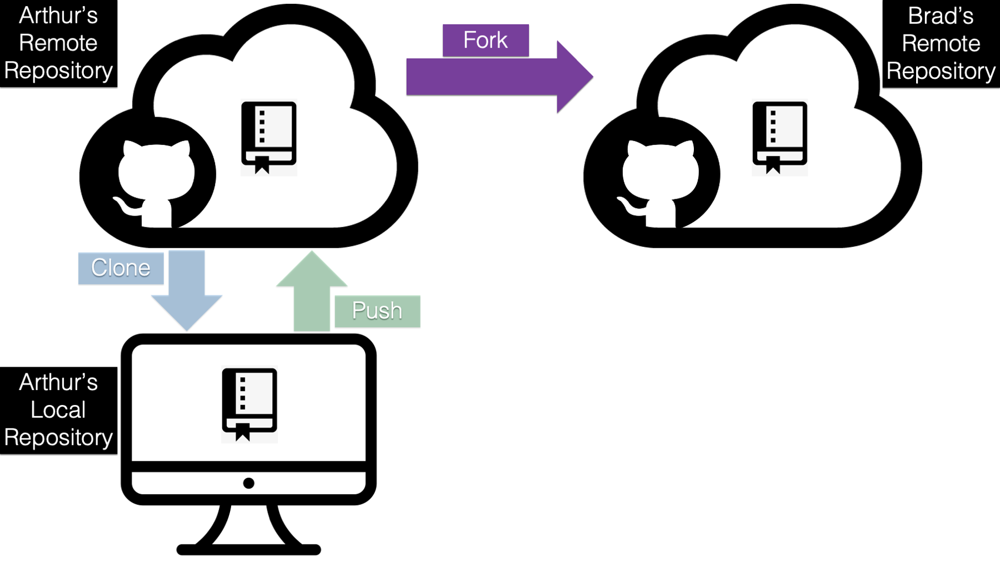
```

The purple arrow above indicates that we are forking (i.e., making a copy of) the original `r4epi_example_project` repository on Arthur's GitHub account to Brad's GitHub account. And doing so is really easy. All Brad has to do is log in to GitHub and navigate to _Arthur's_ `r4epi_example_project` repository located at https://github.com/arthur-epi/r4epi_example_project. Then, he needs to click on the `Fork` button located near the top-right corner of the screen. 

```{r echo=FALSE}
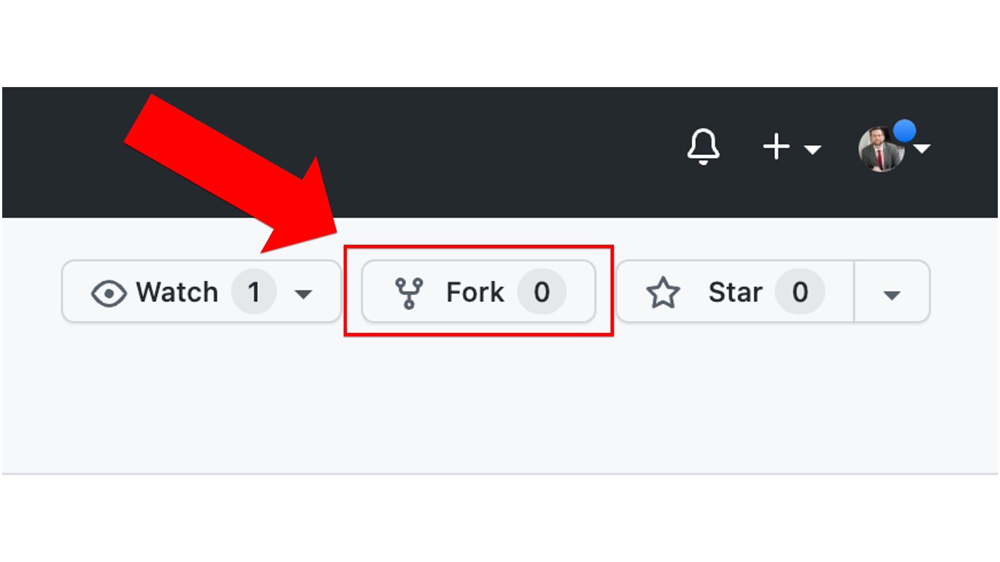
```

Then Brad will click the green `Create fork` button on the next page.

```{r echo=FALSE}
knitr::include_graphics("img/08_part_collaboration/forking_04.png")
```

And after a few moments, this will create an entirely new repository on Brad's GitHub account. It will contain an exact copy of the all the files that were on the repository in Arthur's GitHub account, but _Brad_ is the owner of _this_ repository on his account (shown in the screenshot below).

```{r echo=FALSE}
knitr::include_graphics("img/08_part_collaboration/forking_05.png")
```

Because Brad is the owner of this repository, he can clone it to his local computer, work on it, and push changes up to GitHub in exactly the same way that Arthur did in the [example above][Step 2: Clone the repository to your computer]. Just to be clear, the changes that Brad pushes to _his_ GitHub repository will have no effect on Arthur's GitHub repository.

<p class="note"> 🗒**Side Note:** As we've pointed out multiple times in this chapter, we generally do not want to upload research data to GitHub. Why? Because it isn't typically considered private or secure. However, in order for Brad to do work on this project, he will need to access the data somehow. This will require Arthur to share to data with Brad through some means other than GitHub. Different organizations have different rules about what is considered secure. For example, it may be an encrypted email or it may be a link to a shared drive on a secure server. However the data is shared, it is important for Brad to **create the same file structure on his computer** that Arthur has on his computer. Otherwise, the R code will not work on both computers. Remember from the example above that Arthur created a `data/` folder in his local repository and he moved the `form_20.xlsx` data to that folder. Then, in the `data_01_import` R markdown file, he imports the data using the relative path `data/form_20.xlsx`. In the chapter on [file paths][File paths] we discussed the advantages of using relative file paths when working collaboratively. Just remember, in order for this relative file path to work identically on Arthur's computer and Brad's computer, the folder structure and file names must also be _identical_. So, if Brad put the `form_20.xlsx` data in a folder in his local repository called `data sets/` instead of `data/`, then the code in the `data_01_import` R markdown file would throw an error. </p>

```{r echo=FALSE}
knitr::include_graphics("img/08_part_collaboration/forking_06.png")
```

Notice that in the diagram above, Arthur's original repository is totally unaffected by any changes that Brad is pushing from his local computer to the repository on his GitHub account. There is no arrow from Brad's remote repository going _into_ Arthur's remote repository. Again, this is a good thing. Literally anyone else in the world with a GitHub account could just as easily fork the repository and start making changes. If they also had the ability to make changes to the original repository at will, they could potentially do a lot of damage!

However, in this case, Arthur and Brad _do_ know each other and they _are_ working collaboratively on this project. And at some point, the work that Brad is doing needs to be synced up with the work that Arthur is doing. In order to make that happen, Brad will need to send Arthur a _request_ to _pull_ the changes from Brad's remote repository into Arthur's remote repository. This is called a **pull request**.

```{r echo=FALSE}
knitr::include_graphics("img/08_part_collaboration/pull_request_01.png")
```

### Creating a pull request

To make this section slightly more realistic, let's say that Brad adds some code to `data_01_import.Rmd`. Specifically, he adds some code that will coerce the `date_received` column from character strings to dates (code below).

```{r echo=FALSE}
knitr::include_graphics("img/08_part_collaboration/pull_request_02.png")
```

Then, Brad commits the changes and pushes them up to his GitHub account. Now, when he checks his GitHub account he can see that his remote repository is 1 commit ahead of Arthur's remote repository. And that makes sense, right? Brad just updated the code in `data_01_import.Rmd`, committed that changed, and pushed the commit to his GitHub account, but nothing has changed in the repository on Arthur's GitHub account. 

```{r echo=FALSE}
knitr::include_graphics("img/08_part_collaboration/pull_request_03.png")
```

Now, Brad needs to create a pull request. This pull request will let Arthur know that Brad has made some changes to the code that he wants to share with Arthur. To do so, Brad will click `Contribute` and then click the green `Open pull request` button as shown below.

```{r echo=FALSE}
knitr::include_graphics("img/08_part_collaboration/pull_request_04.png")
```

The top section of the next screen, which is outlined in red below, allows Brad to select the repository and branch on his GitHub account that he wants to share with Arthur (to the right of the arrow). More specifically, he is sending a request to Arthur asking him to merge his code into Arthur's code. In this case, the code he wants to ask Arthur to merge is on the main branch of the `brad-cannell/r4epi_example_project repository` (Brad's repository only has one branch -- the main branch -- at this point). To the left of the arrow, Brad can select the repository and branch on Arthur's GitHub account that he wants to ask Arthur to merge the code into. In this case, the main branch of the `arthur-epi/r4epi_example_project repository` (Arthur's repository only has the main branch at this point as well).

Below the red box, GitHub is telling Brad about the commits that will be sent in this pull request and the changes that will be made to Arthur's files if he merges the pull request into his repository. In this case, only one file in Arthur's repository would be altered -- `data_01_import.Rmd`. Below that, Brad can see that the exact differences between his version of `data_01_import.Rmd` and the version that currently exists in Arthur's repository. How cool is that that Brad and Arthur can actually see exactly how this pull request changes the file state down to individual lines of code?

Because Brad is satisfied with what he sees here, he clicks the green `Create pull request` button shown in the middle right of the screenshot below.

```{r echo=FALSE}
knitr::include_graphics("img/08_part_collaboration/pull_request_05.png")
```

Let's pause here and get explicit about two things.

1. As we've tried to really drive home above, this pull request will **not** automatically make any changes to Arthur's repository. Rather, it will only send Arthur Brad's code, ask him to review it, and then allow him to _choose_ whether to incorporate it into his repository or not. 

2. Pull requests are sent at the **branch level** not at the **file level**. Meaning, if Arthur accepts Brad's pull request, it will make _all_ of the files on his main branch identical to _all_ of the files on Brad's main branch (the main branch because that is the branch Brad chose in the screenshot above -- and currently the only branch in either repository). In this case, that means that the only file that would change as a result of copying over the entire branch is `data_01_import.Rmd`. However, if Brad had made changes to `data_01_import.Rmd` _and_ another file, Arthur would only have the option to merge _both_ files or _neither_ file. He would not have the option of merging `data_01_import.Rmd` _only_. Pull requests merge the entire branch, not specific files. We are emphasizing this because this may affect how you commit, push, and create pull requests when you are working collaboratively. More specifically, you may want to commit, push, and send pull requests more frequently than you would if you were working on a project independently. 

On the next screen, Brad is given an opportunity to give the pull request a title and add a message for Arthur that give him some additional details. In general, it's a good idea to fill this part out using similar conventions to those described above for commit messages. 

After filling out the commit message, Brad will click the green `Create pull request` button on last time, and he is done. This will send Arthur the pull request. 

```{r echo=FALSE}
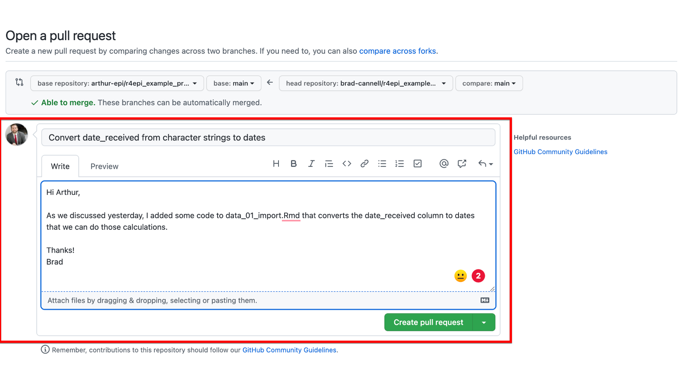
```

The next time Arthur checks the `r4epi_example_project` on GitHub, he will see that he has a new pull request.

```{r echo=FALSE}
knitr::include_graphics("img/08_part_collaboration/pull_request_07.png")
```

If he clicks on the text `Pull requests` text, he will be taken to his pull requests page. It will show him all pending pull requests. In this case, there is just the one pull request that Brad sent. 

```{r echo=FALSE}
knitr::include_graphics("img/08_part_collaboration/pull_request_08.png")
```

When he clicks on it, he will see a screen like the one in the screenshot below. Scanning from top to bottom, it will tell him which branch Brad is requesting to merge the code into, show him the message Brad wrote, tell him that he can merge this branch without any conflicts if he so chooses, and give him an opportunity to write a message back to Brad before deciding whether to merge this pull request or close it. 

```{r echo=FALSE}
knitr::include_graphics("img/08_part_collaboration/pull_request_09.png")
```

He also has the option to view some additional details by clicking the `Commits` tab, `Checks` tab, and/or `Files changed` tab towards the top of the screen. Let's say he decides to click on the `Files changed` tab. 

On the `Files changed` tab, Arthur can see each of the files that the pull request would change if he were to merge it into his repository (in this case, only one file). For each file, he can see (and even comment on) each specific line of code that would change. In this case, Arthur is pleased with the changes and navigates back to the `Conversation` tab by clicking on it.

```{r echo=FALSE}
knitr::include_graphics("img/08_part_collaboration/pull_request_10.png")
```

Back on the `Conversation` tab (see screenshot below), Arthur has some options. If he wants more clarification about the pull request, he can send leave a comment for Brad using the comment box near the bottom of the screen. If he knows that he does **NOT** want to merge this pull request into his code, he can click the `Close pull request` button at the bottom of the screen. This will close the pull request and his code will remain unchanged. In this case, Arthur wants to incorporate the changes that Brad sent over, so he clicks the green `Merge pull request` button in the middle of the screen.

```{r echo=FALSE}
knitr::include_graphics("img/08_part_collaboration/pull_request_11.png")
```

Then, he is given an opportunity to add some details about the changes this merge will make to the repository once it is committed. You can once again think of this message as having a very similar purpose to commit messages, which were discussed above. In fact, it will appear as a commit in the repository's commit history.

Finally, he clicks the green `Confirm merge` button. 

```{r echo=FALSE}
knitr::include_graphics("img/08_part_collaboration/pull_request_12.png")
```

And if Arthur navigates back to his commit history page, he can see two new commits. Brad's commit with the updated `data_01_import.Rmd` file, and the commit that was automatically created when Arthur merged the branches together. 

```{r echo=FALSE}
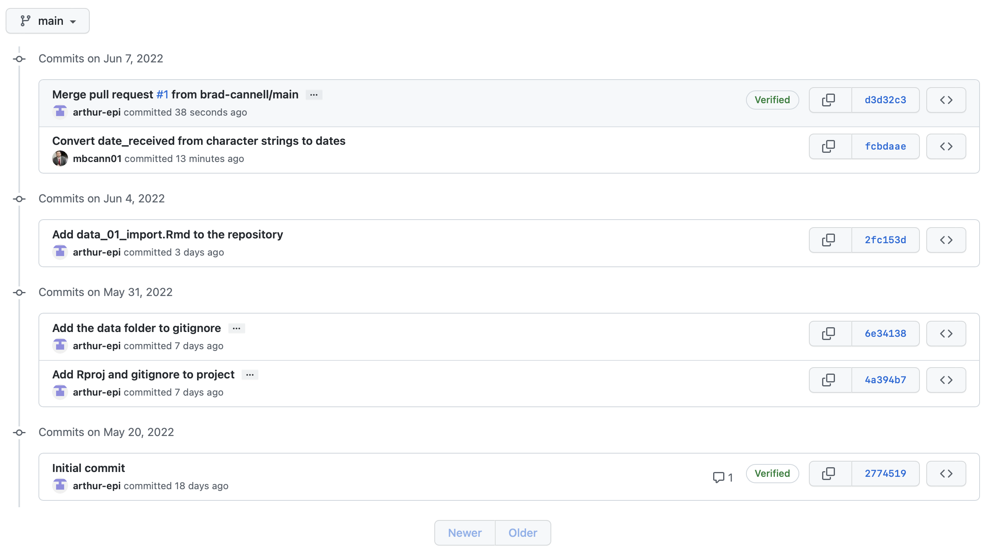
```

Now, Arthur takes a look at `data_01_import.Rmd` on his computer. To his surprise, the code to coerce date_received into dates isn't there. Why not?

```{r echo=FALSE}
knitr::include_graphics("img/08_part_collaboration/pull_request_16.png")
```

Well, let's open GitKraken on Arthur's computer and see if we can help him figure it out. In the repository graph, Arthur's local repository (i.e., the little laptop icon) and the remote repository (i.e., the little gray and white icon) are on different rows. Additionally, there is a little `2` next to a down arrow displayed to the left of the main branch of our local repository in the left panel of GitKraken. Both of these indicate that the most recent commits contained in each repository are different. Specifically, that the local repository is two commits _behind_ the remote repository.

```{r echo=FALSE}
knitr::include_graphics("img/08_part_collaboration/pull_request_17.png")
```

So, let's pause here for a second and review what we've done so far. As shown in the figure below:

1. Brad made some updates to the code on his computer and then committed those changes to his local repository. At this point, his local repository is out of sync with his remote repository, Arthur's remote repository, and Arthur's local repository.

2. Next, Brad pushed that commit from his local repository up to his remote repository on GitHub. After doing so, his local repository and remote repository are synced with each other, but they are still out of sync with Arthur's remote repository and Arthur's local repository.

3. Then, Brad created a pull request for Arthur. The request was for Arthur to pull the latest commit from Brad's remote repository into Arthur's remote repository.

4. Arthur accepted and merged Brad's pull request. After doing so, his remote repository, Brad's remote repository, and Brad's local repository are all contain the updated `data_01_import.Rmd` file, but Arthur's local repository still does not. 

```{r echo=FALSE}
knitr::include_graphics("img/08_part_collaboration/pull_request_18.png")
```

So, how does Arthur get his local repository in sync with his remote repository?

Arthur just needs to use the **pull** command to download the files from his updated remote repository and merge them into his local repository (step 5 below).

```{r echo=FALSE}
knitr::include_graphics("img/08_part_collaboration/pull_request_19.png")
```

And GitKraken makes pulling the files from his remote repository really easy. All Arthur needs to do is click the pull button shown in the screenshot below. GitKraken will download (also called **fetch**) the updated repository and merge the changes into his local repository.

```{r echo=FALSE}
knitr::include_graphics("img/08_part_collaboration/pull_request_20.png")
```

And as shown in the screenshot below, Arthur can now see that his local repository is now in sync with his remote repository once again! 🎉

```{r echo=FALSE}
knitr::include_graphics("img/08_part_collaboration/pull_request_21.png")
```

But, what about Brad's repository? Well, as you can see in the screenshot below, Brad's remote repository is now 1 commit _behind_ Arthur's. Why? 

This one is kind of weird/tricky. Although the code in Brad's repository is now identical to the code in Arthur's repository, the _commit history_ is not. Remember, Arthur's commit history from above? When he merged Brad's code into his own, that automatically created an additional commit. And that additional commit does not currently exist in Brad's commit history. It's an easy fix though!

```{r echo=FALSE}
knitr::include_graphics("img/08_part_collaboration/pull_request_22.png")
```

All Brad needs to do is a quick **fetch** from Arthur's remote repository to merge that last commit into his commit history, and then **pull** it down to his local repository. 

```{r echo=FALSE}
knitr::include_graphics("img/08_part_collaboration/pull_request_23.png")
```

To do so, Brad will first click `Fetch upstream` followed by the green `Fetch and merge` button. 

```{r echo=FALSE}
knitr::include_graphics("img/08_part_collaboration/pull_request_24.png")
```

After a few seconds, GitHub will show him that his remote repository is now synced up with Arthur's remote repository. All he as to do now is a quick pull in GitHub. 

```{r echo=FALSE}
knitr::include_graphics("img/08_part_collaboration/pull_request_25.png")
```

And now we have seen the basic process for collaboratively coding with git and GitHub. Don't feel bad if you are still feeling a little bit confused. Git and GitHub are confusing at times even for experienced programmers. But that doesn't mean that they aren't still valuable tools! They are! 

We also recognize that it might seem like that was a ton of steps above. Again, we went through this process slowly and methodically because we are all trying to learn here. In a real-life project with two experienced collaborators, the steps in this example would typically be completed in a matter of minutes. No big deal.

## Summary

There is so much more to learn about git and GitHub, but that's not what this book is about. So, we will stop here. We hope the examples above demonstrate some of the potential value of using git and GitHub in your project workflow. We also hope they give you enough information to get you started.

Here are some free resources we recommend if you want to learn even more:

1. Chacon S, Straub B. Pro Git. Second. Apress; 2014. Accessed June 13, 2022. https://git-scm.com/book/en/v2

2. GitHub. Getting started with GitHub. GitHub Docs. Accessed June 13, 2022. https://ghdocs-prod.azurewebsites.net/en/get-started

3. Bryan J. Happy Git and GitHub for the useR.; 2016. Accessed June 2, 2022. https://happygitwithr.com/index.html

4. Keyes D. How to Use Git/GitHub with R. R for the Rest of Us. Published February 13, 2021. Accessed June 13, 2022. https://rfortherestofus.com/2021/02/how-to-use-git-github-with-r/

5. Wickham H, Bryan J. Chapter 18 Git and GitHub. In: R Packages. Accessed June 13, 2022. https://r-pkgs.org/git.html

<!--chapter:end:chapters/08_part_collaboration/02_using_git_github.Rmd-->

# (PART) Presenting Results {-}

<!-- This Rmd just creates a part heading in the table of contents -->

<!--chapter:end:chapters/09_part_presenting_results/00_part_presenting_results.Rmd-->

# Creating tables with R and Microsoft Word

```{r include=FALSE}
library(dplyr)
```

At this point, you should all know that it is generally a bad idea to submit raw R output as part of a report, presentation, or publication. You should also understand when it is most appropriate to use tables, as opposed to charts and graphs, to present your results. If not, please stop here and read Chapter 7 of _Successful Scientific Writing_, which discusses the "why" behind much of what I will show you "how" to do in this chapter. @Matthews2014-ah

_R for Epidemiology_ is predominantly a book about using R to manage, visualize, and analyze data in ways that are common in the field epidemiology. However, in most modern work/research environments it is difficult to escape the requirement to share your results in a Microsoft Word document. And often, because we are dealing with data, those results include tables of some sort. However, not all tables communicate your results equally well. In this chapter, I will walk you through the process of starting with some results you calculated in R and ending with a nicely formatted table in Microsoft Word. Specifically, we are going to create a Table 1.

## Table 1

In epidemiology, medicine, and other disciplines, "Table 1" has a special meaning. Yes, it's the first table shown to the reader of your article, report, or presentation, but the special meaning goes beyond that. In many disciplines, including epidemiology, when you speak to a colleague about their "Table 1" it is understood that you are speaking about a table that describes (statistically) the relevant characteristics of the sample being studied. Often, but not always, the sample being studied is made up of people, and the relevant descriptive characteristics about those people include sociodemographic and/or general health information. Therefore, it is important that you don't label any of your tables as "Table 1" arbitrarily. Unless you have a _really_ good reason to do otherwise, your Table 1 should always be a descriptive overview of your sample. 

Here is a list of other traits that should consider when creating your Table 1:

* All other formatting best practices that apply to scientific tables in general. This includes formatting requirements specific to wherever you are submitting your table (e.g., formatting requirements in the American Journal of Public Health).  

* Table 1 is often, but not always, stratified into subgroups (i.e., descriptive results are presented separately for each subgroup of the study sample in a way that lends itself to between-group comparisons). 

* When Table 1 is stratified into subgroups, the variable that contains the subgroups is typically the primary exposure/predictor of interest in your study.

## Opioid drug use

As a motivating example, let's say that we are working at the North Texas Regional Health Department and have been asked to create a report about drug use in our region. Our stakeholders are particularly interested in opioid drug use. To create this report, we will analyze data from a sample of 9,985 adults who were asked about their use of drugs. One of the first analyses that we did was a descriptive comparison of the sociodemographic characteristics of 3 subgroups of people in our data. We will use these analyses to create our Table 1.

```{r message=FALSE, echo=FALSE}
drugs <- readr::read_csv("/Users/bradcannell/Dropbox/Datasets/Drugs - opioid/drugs.csv")

# Making factor levels more readable
drugs <- drugs %>% 
  mutate(
    edu_f = factor(
      edu, labels = c("Less than high school", "High school", "Some college", "College graduate")
    ),
    female_f = factor(female, labels = c("No", "Yes")),
    use_f = factor(use, labels = c("Non-users", "Use other drugs", "Use opioid drugs"))
  )
```

<p class="note"> 🗒**Side Note:** This data includes over 9,000 rows, so I don't show the code for creating a data frame from this data. In fact, I directly imported this data into R from a comma separated values (.csv) file. We haven't yet learned how to import csv files, but you can view/download the data by [clicking here](https://www.dropbox.com/s/18pf6liosfsemg9/03_creating_word_tables.Rmd?dl=1) if you'd like to check it out anyway.</p>

```{r message=FALSE, echo=FALSE}
drugs %>% 
  freqtables::freq_table(use_f) %>% 
  # So that values aren't rounded
  as.data.frame()
```

```{r message=FALSE, echo=FALSE}
drugs %>% 
  group_by(use) %>% 
  summarise(
    var    = "age",
    n      = n(),
    mean   = mean(age),
    sd     = sd(age),
    t_crit = qt(0.975, n - 1),
    sem    = sd / sqrt(n),
    lcl    = mean - t_crit * sem,
    ucl    = mean + t_crit * sem,
  ) %>% 
  select(var, everything())  %>% 
  # So that values aren't rounded
  as.data.frame()
```

```{r echo=FALSE}
drugs %>% 
  freqtables::freq_table(use, female_f)  %>% 
  # So that values aren't rounded
  as.data.frame()
```

```{r echo=FALSE}
drugs %>% 
  freqtables::freq_table(use, edu_f) %>% 
  # So that values aren't rounded
  as.data.frame()
```

Above, we have the results of several different descriptive analyses we did in R. Remember that we never want to present raw R output. Perhaps you’ve already thought to yourself, “wow, these results are really overwhelming. I’m not sure what I’m even looking at.” Well, that’s exactly how many of the people in your audience will feel as well. In its current form, this information is really hard for us to process. We want to take some of the information from the output above and use it to create a Table 1 in Word that is much easier to read.

Specifically, we want our final Table 1 to look like this: 

```{r echo=FALSE}
knitr::include_graphics("img/09_part_presenting_results/03_creating_word_tables/table1.png")
```

You may also [click here to view/download the Word file that contains the Table 1](https://www.dropbox.com/s/bu8r81jhzr2r3cj/final_table_01.docx?dl=0).

Now that you've seen the end result, let's learn how to make this Table 1 together, step-by-step. Go ahead and open Microsoft Word now if you want to follow along.

## Table columns

The first thing I typically do is figure out how many columns and rows my table will need. This is generally pretty straightforward; although, there are exceptions. For a basic Table 1 like the one we are creating above we need the following columns:

One column for our row headers (i.e., the names and categories of the variables we are presenting in our analysis).

```{r echo=FALSE}
knitr::include_graphics("img/09_part_presenting_results/03_creating_word_tables/row_header.png")
```

One column for each subgroup that we will be describing in our table. In this case, there are 3 subgroups so we will need 3 additional columns.

```{r echo=FALSE}
knitr::include_graphics("img/09_part_presenting_results/03_creating_word_tables/subgroups.png")
```

So, we will need 4 total columns.  

<p class="note"> 🗒**Side Note:** If you are going to describe the entire sample overall without stratifying it into subgroups then you would simply have 2 columns. One for the row headers and one for the values.</p>

## Table rows

Next, we need to figure out how many rows our table will need. This is also pretty straightforward. Generally, we will need the following rows:

One row for the title. Some people write their table titles outside (above or below) the actual table. I like to include the title directly in the top row of the table. That way, it moves with the table if the table gets moved around.

```{r echo=FALSE}
knitr::include_graphics("img/09_part_presenting_results/03_creating_word_tables/title.png")
```

One row for the column headers. The column headers generally include a label like "Characteristic" for the row headers column and a descriptive label for each subgroup we are describing in our table.

```{r echo=FALSE}
knitr::include_graphics("img/09_part_presenting_results/03_creating_word_tables/column_header.png")
```

One row for each variable we will analyze in our analysis. In this example, we have three -- age, sex, and education. **NOTE** that we do _NOT_ need a separate row for each category of each variable. 

```{r echo=FALSE}
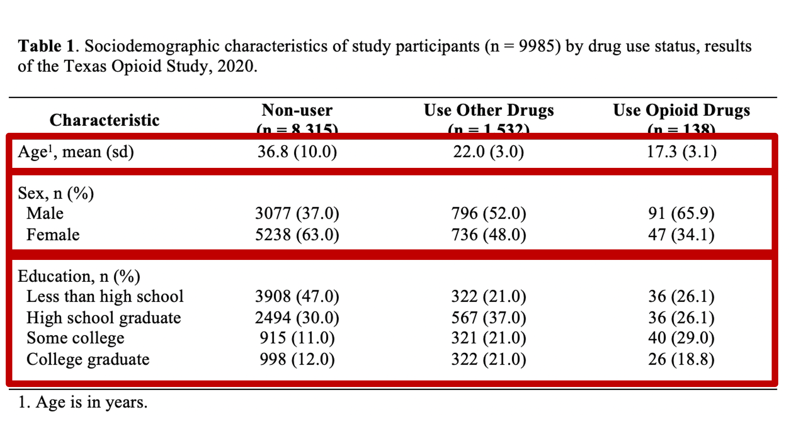
```

One row for the footer.

```{r echo=FALSE}
knitr::include_graphics("img/09_part_presenting_results/03_creating_word_tables/footer.png")
```

So, we will need 6 total rows.

## Make the table skeleton

Now that we know we need to create a table with 4 columns and 6 rows, let's go ahead and do that in Microsoft Word. We do so by clicking the `Insert` tab in the ribbon above our document. Then, we click the `Table` button and select the number of columns and rows we want.

```{r echo=FALSE}
knitr::include_graphics("img/09_part_presenting_results/03_creating_word_tables/make_table.gif")
```

## Fill in column headers

Now we have our table skeleton. The next thing I would typically do is fill in the column headers. Remember that our column headers look like this:

```{r echo=FALSE}
knitr::include_graphics("img/09_part_presenting_results/03_creating_word_tables/column_header.png")
```

Here are a couple of suggestions for filling in your column headers:

* Put your column headers in the second row of the empty table shell. The title will eventually go into the first row. I don't add the title right away because it is typically long and will distort the table's dimensions. Later, we will see how to horizontally merge table cells to remove this distortion, but we don't want to do that now. Right now, we want to leave all the cells unmerged so that we can easily resize our columns.

* The first column header is generally a label for our row headers. Because the rows are typically characteristics of our sample, I almost always use the word "characteristic" here. If you come up with a better word, please feel free to use it.

* The rest of the column headers are generally devoted to the subgroups we are describing. 

   - The subgroups should be ordered in a way that is meaningful. For example, by level of severity or chronological order. Typically, ordering in alphabetical order isn't that meaningful. 
   
   - The subgroup labels should be informative and meaningful, but also succinct. This can sometimes be a challenge.

  - I have seen terms like "Value", "All", and "Full Sample" used when Table 1 was describing the entire sample overall rather than describing the sample by subgroups.
  
### Group sample sizes

You should always include the group sample size in the column header. They should typically be in the format "(n = sample size)" and typed in the same cell as the label, but below the label (i.e., hit the return key). The group sample sizes can often provide important context to the statistics listed below in the table, and clue the reader into missing data issues.

```{r echo=FALSE}
knitr::include_graphics("img/09_part_presenting_results/03_creating_word_tables/sample_size.png")
```
  
### Formatting column headers

I generally bold my column headers, horizontally center them, and vertically align them to the bottom of the row.

At this point, your table should look like this in Microsoft Word:

```{r echo=FALSE}
knitr::include_graphics("img/09_part_presenting_results/03_creating_word_tables/make_column_headers.png")
```

## Fill in row headers

The next thing I would typically do is fill in the row headers. Remember, that our row headers look like this:

```{r echo=FALSE}
knitr::include_graphics("img/09_part_presenting_results/03_creating_word_tables/row_header.png")
```

Here are a couple of suggestions for filling in your row headers:

* The variables should be organized in a way that is meaningful. In our example, we have only 3 sociodemographic variables. However, if we also had some variables about health status and some variables related to criminal history, then we would almost certainly want the variables that fit into each of these categories to be vertically arranged next to each other. 

* Like the column headers, the row headers should be informative and meaningful, but also succinct. Again, this can sometimes be a challenge. In our example, we use "Age", "Sex", and "Education". Something like "Highest level of formal education completed" would have also been informative and meaningful, but not succinct. Something like "Question 6" is succinct, but isn't informative or meaningful at all. 

### Label statistics

You should always tell the reader what kind statistics they are looking at -- don't assume that they know. For example, the highlighted number in figure \@ref(fig:what-stats) are 36.8 and 10. What is 36.8? The mean, the median? The percentage of people who had a non-missing value for age? What is 10? The sample size? The standard error of the mean? An odds ratio? You know that 36.8 is a mean and 10 is the standard deviation because I identified what they were in row header. \@ref(fig:identify-stats) When you label the statistics in the row headers as we've done in our example, they should take the format you see in figure \@ref(fig:identify-stats). That is, the variable name, followed by a comma, followed by the statistics used in that row. Also notice the use of parentheses. We used parentheses around the letters "sd" (for standard deviation) because the numbers inside the parentheses in that row are standard deviations. So, the label used to identify the statistics should give the reader a blueprint for interpreting the statistics that matches the format of the statistics themselves.

```{r what-stats, echo=FALSE, fig.cap="What are these numbers."}
knitr::include_graphics("img/09_part_presenting_results/03_creating_word_tables/what_stats.png")
```

```{r identify-stats, echo=FALSE, fig.cap="Identifying statistics in the row header."}
knitr::include_graphics("img/09_part_presenting_results/03_creating_word_tables/identify_stats.png")
```

The statistics can, and sometimes are, labeled in the column header instead of the row header. This can sometimes be a great idea. However, it can also be a source of confusion. For example, in the figure below, the column headers include labels (i.e., n (%)) for the statistics below. However, _not all the statistics below are counts (n) and percentages_! 

```{r echo=FALSE}
knitr::include_graphics("img/09_part_presenting_results/03_creating_word_tables/bad_stat_labels.png")
```

Even though the Age variable has its own separate statistics label in the row header, this is still generally a really bad idea! Therefore, I highly recommend only labeling your statistics in the column header when those labels are accurate for _every_ value in the column. For example:

```{r echo=FALSE}
knitr::include_graphics("img/09_part_presenting_results/03_creating_word_tables/good_stat_labels.png")
```

### Formatting row headers

* Whenever possible, make sure that variable name and statistic identifier fit on one line (i.e., they don't carryover into the line below).

* Always type the category labels for categorical variables in the same cell as the variable name. However, each category should have it's own line (i.e., hit the return key).

* Whenever possible, make sure that each category label fits on one line (i.e., it doesn't carryover into the line below).

* Indent each category label two spaces to the left of the variable name. 

* Hit the return key once after the last category for each categorical variable. This creates a blank line that adds vertical separation between row headers and makes them easier to read.

At this point, your table should look like this in Microsoft Word:

```{r echo=FALSE}
knitr::include_graphics("img/09_part_presenting_results/03_creating_word_tables/make_row_headers.png")
```

## Fill in data values

So, we have some statistics visible to us on the screen in RStudio. Somehow, we have to get those numbers over to our table in Microsoft Word. There are many different ways we can do this. I'm going to compare a few of those ways here. 

### Manually type values

One option is to manually type the numbers into your word document. 
  
👍 If you are in a hurry, or if you just need to update a small handful of statistics in your table, then this option is super straightforward. However, there are at least two big problems with this method. 
    
👎 First, it is _extremely_ error prone. Most people are very likely to type a wrong number or misplace a decimal here and there when they manually type statistics into their Word tables.
    
👎 Second, it isn't very scalable. What if you need to make very large tables with lots and lots of numbers? What if you update your data set and need to change every number in your Word table? This is not fun to do manually.

### Copy and paste values
    
Another option is to copy and paste values from RStudio into Word. This option is similar to above, but instead of _typing_  each value into your Word table, you highlight and copy the value in RStudio and _paste_ it into Word. 
  
👍 If you are in a hurry, or if you just need to update a small handful of statistics in your table, then this option is also pretty straightforward. However, there are still issues associated with this method. 
    
👎 First, it is still somewhat error prone. It's true that the numbers and decimal placements should always be correct when you copy and paste; however, you may be surprised by how often many people accidently paste the values into the wrong place or in the wrong order. 
    
👎 Second, I've noticed that there are often weird formatting things that happen when I copy from RStudio and paste into Word. They are usually pretty easy to fix, but this is still a small bit of extra hassle. 
    
👎 Third, it isn't very scalable. Again, if we need to make very large tables with lots and lots of numbers or update our data set and need to change every number in your Word table, this method is time-consuming and tedious.
    
### Knit a Word document
    
So far, we have only used the HTML Notebook output type for our R markdown files. However, it's actually very easy have [RStudio create a Word document from you R markdown files](https://rmarkdown.rstudio.com/lesson-9.html). We don't have all the R knowledge we need to fully implement this method yet, so I don't want to confuse you by going into the details here. But, I do want to mention that it is possible.
  
👍 The main advantages of this method are that it is much less error prone and much more scalable than manually typing or copying and pasting values. 
    
👎 The main disadvantages are that it requires more work on the front end and still requires you to open Microsoft Word a do a good deal of formatting of the table(s).
  
### flextable and officer

A final option I'll mention is to create your table with the [flextable](https://davidgohel.github.io/flextable/index.html) and [officer](https://davidgohel.github.io/officer/) packages. This is my favorite option, but it is also definitely the most complicated. Again, I'm not going to go into the details here because they would likely just be confusing for most readers.
  
👍 This method essentially overcomes all of the previous methods' limitations. It is the least error prone, it is extremely scalable, and it allows us to do basically all the formatting in R. With a push of a button we have a complete, perfectly formatted table output to a Word document. If we update our data, we just push the button again and we have a new perfectly formatted table. 
    
👎 The primary downside is that this method requires you to invest some time in learning these packages, and requires the greatest amount of writing code up front. If you just need to create a single small table that you will never update, this method is probably not worth the effort. However, if you absolutely need to make sure that your table has no errors, or if you will need to update your table on a regular basis, then this method is definitely worth learning.

### Significant digits

No matter which of the methods above you choose, you will almost never want to give your reader the level of precision that R will give you. For example, the first row of the R results below indicates that 83.274912% of our sample reported that they don't use drugs. 

```{r message=FALSE, echo=FALSE}
as.data.frame(freqtables::freq_table(drugs, use_f))
```

Notice the level of precision there. R gives us the percentage out to 6 decimal places. If you fill your table with numbers like this, it will be much harder for your readers to digest your table and make comparisons between groups. It's just the way our brains work. So, the logical next question is, "how many decimal places should I report?" Unfortunately, this is another one of those times that I have to give you an answer that may be a little unsatisfying. It is true that there are rules for [significant figures (significant digits)](https://en.wikipedia.org/wiki/Significant_figures); however, the rules are not always helpful to students in my experience. Therefore, I'm going to share with you a few things I try to consider when deciding how many digits to present.

* I don't recall _ever_ presenting a level of precision greater than 3 decimal places in the research I've been involved with. If you are working in physics or genetics and measuring really tiny things it may be totally valid to report 6, 8, or 10 digits to the right of the decimal. But, in epidemiology -- a population science -- this is rarely, if ever, useful.
  
* What is the overall message I am trying to communicate? That is the point of the table, right? I'm trying to clearly and honestly communicate information to my reader. In general, the simpler the numbers are to read and compare, the clearer the communication. So, I tend to error on the side of simplifying as much as possible. For example, in the R results below, we could say that 83.274912% of our sample reported that they don't use drugs, 15.343015% reported that they use drugs other than opioids, and 1.382073% reported that they use opioid drugs. Is saying it that way really more useful than saying that "83% of our sample reported that they don't use drugs, 15% reported that they use drugs other than opioids, and 1% reported that they use opioid drugs"? Are we missing any actionable information by rounding our percentages to the nearest integer here? Are our overall conclusions about drug use any different? No, probably not. And, the rounded percentages are much easier to read, compare, and remember. 

* Be consistent -- especially within a single table. I have experienced some rare occasions where it made sense to round one variable to 1 decimal place and another variable to 3 decimals places in the same table. But, circumstances like this are definitely the exception. Generally speaking, if you round one variable to 1 decimal place then you want to round them all to one decimal place.

Like all other calculations we've done in this book, I suggest you let R do the heavy lifting when it comes to rounding. In other words, have R round the values for you _before_ you move them to Word. R is much less likely to make a rounding error than your are! You may recall that we learned how to round in the [chapter on numerical descriptions of categorical variables](#formatting-results).

### Formatting data values

Now that we have our appropriately rounded values in our table, we just need to do a little formatting before we move on.

First, make sure to fix any fonts, font sizes, and/or background colors that may have been changed if you copied and pasted the values from RStudio into Word.

Second, make sure the values line up horizontally with the correct variable names and category labels. 

Third, I tend to horizontally center all my values in their columns.

At this point, your table should look like this in Microsoft Word:

```{r echo=FALSE}
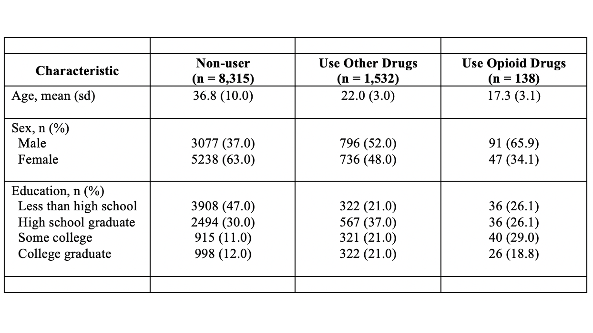
```

## Fill in title

At this point in the process, I will typically go ahead and add the title to the first cell of my Word table. The title should always start with "Table #." In our case, it will start with "Table 1." In general, I use bold text for this part of the title. What comes next will change a little bit from table to table but is extremely important and worth putting some thought into.

Remember, all tables and figures need to be able to _stand on their own_. What does that mean? It means that if I pick up your report and flip straight to the table, I should be able to understand what it's about and how to read it without reading any of the other text in your report. The title is a critical part of making a table stand on its own. In general, your title should tell the reader what the table contains (e.g., sociodemographic characteristics) and who the table is about (e.g., results of the Texas Opioid Study). I will usually also add the size of the sample of people included in the table (e.g., n = 9985) and the year the data was collected (e.g., 2020). 

In different circumstances, more or less information may be needed. However, always ask yourself, "can this table stand on its own? Can most readers understand what's going on in this table even if they didn't read the full report?"

At this point, your table should look like this in Microsoft Word:

```{r echo=FALSE}
knitr::include_graphics("img/09_part_presenting_results/03_creating_word_tables/make_title.png")
```

Don't worry about your title being all bunched up in the corner. We will fix it soon.

## Fill in footnotes 

Footnotes are another tool we can use to help our table stand on its own. The footnotes give readers additional information that they may need to read and understand our table. Again, there are few hard and fast rules regarding what footnotes you should include, but I can give you some general categories of things to think about.

First, use footnotes to explain any abbreviations in your table that aren't standard and broadly understood. These abbreviations are typically related to statistics used in the table (e.g., RR = risk ratio) and/or units of measure (e.g., mmHg = millimeters of mercury). Admittedly, there is some subjectivity associated with "standard and broadly understood." In our example, I did not provide a footnote for "n", "sd", or "%" because most researchers would agree that these abbreviations are standard and broadly understood, but I typically do provide footnotes for statistics like "OR" (odds ration) and "RR" (relative risk or risk ratio).

Additionally, I mentioned above that it is desirable, but sometimes challenging, to get your variable names and category labels to fit on a single line. Footnotes can sometimes help with this. In our example, instead of writing "Age in years, mean (sd)" as a row header I wrote "Age, mean (sd)" and added a footnote that tells the reader that age is measured in years. This may not be the best possible example, but hopefully you get the idea.

### Formatting footnotes

When using footnotes, you need to somehow let the reader know which element in the table each footnote goes with. Sometimes, there will be guidelines that require you to use certain symbols (e.g., *, †, and ‡), but I typically use numbers to match table elements to footnotes when I can. In the example below, there is a superscript "1" immediately after the word "Age" that lets the reader know that footnote number 1 is adding additional information to this part of the table.

```{r echo=FALSE}
knitr::include_graphics("img/09_part_presenting_results/03_creating_word_tables/number_footnotes.png")
```

If you do use numbers to match table elements to footnotes, make sure you do so in the order people read [English], which is left to right and top to bottom. For example, the following would be inappropriate because the number 2 comes before the number 1 when reading from top to bottom:

```{r echo=FALSE}
knitr::include_graphics("img/09_part_presenting_results/03_creating_word_tables/bad_footnote_1.png")
```

As another example, the following would be inappropriate because the number 2 comes before the number 1 when reading from left to right:

```{r echo=FALSE}
knitr::include_graphics("img/09_part_presenting_results/03_creating_word_tables/bad_footnote_2.png")
```

Additionally, when using numbers to match table elements to footnotes, it's a good idea to superscript the numbers in the table. This makes it clear that the number is being used to identify a footnote rather than being part of the text or abbreviation. Formatting a number as a superscript is easy in Microsoft Word. Just highlight the number you want to format and click the superscript button like so:

```{r echo=FALSE}
knitr::include_graphics("img/09_part_presenting_results/03_creating_word_tables/make_footnotes.gif")
```

At this point, your table should look like this in Microsoft Word:

```{r echo=FALSE}
knitr::include_graphics("img/09_part_presenting_results/03_creating_word_tables/make_footnotes.png")
```

## Final formatting

We have all of our data and explanatory text in our table. The last few remaining steps are just about formatting our table to make it as easy to read and digest as possible.

### Adjust column widths

As I've already mentioned more than once, we don't want our text carryover onto multiple lines whenever we can help it. In my experience, this occurs most often in the row headings. Therefore, I will often need to adjust (widen) the first column of my table. You can do that by clicking on the black border that separates the columns and moving your mouse left or right.

```{r echo=FALSE}
knitr::include_graphics("img/09_part_presenting_results/03_creating_word_tables/adjust_columns.gif")
```

After you adjust the width of your first column, the widths of the remaining columns will likely be uneven. To distribute the remaining space in the table evenly among the remaining columns, first select the columns by clicking immediately above the first column you want to select and dragging your cursor across the remaining columns. Then, click the `layout` tab in ribbon above your document and the `Distribute Columns` button. 

```{r echo=FALSE}
knitr::include_graphics("img/09_part_presenting_results/03_creating_word_tables/even_columns.gif")
```

In our particular example, there was no need to adjust column widths because all of our text fit into the default widths.

### Merge cells

Now, we can finally merge some cells so that our title and footnote spread the entire width of the table. We waited until now to merge cells because if we had done so earlier it would have made the previous step (i.e., adjust column widths) more difficult. 

To spread our title out across the entire width of the table, we just need to will select all the cells in the first row, then right click and select `merge cells`. 

```{r echo=FALSE}
knitr::include_graphics("img/09_part_presenting_results/03_creating_word_tables/merge_title.gif")
```

After merging the footnote cells in exactly the same way, your table should look like this:

```{r echo=FALSE}
knitr::include_graphics("img/09_part_presenting_results/03_creating_word_tables/make_merged.png")
```

### Remove cell borders

The final step is to clean up our borders. In my experience, students like to do all kinds of creative things with cell borders. However, when it comes to borders, keeping it simple is usually the best approach. Therefore, we will start by removing _all_ borders in the table. We do so by clicking the little cross with arrowheads that pops up diagonal to the top-left corner of the table when you move your mouse over it. Clicking this button will highlight your entire table. Then, we will click the downward facing arrow next to the `borders` button in the ribbon above your document. Then, we will click the `No Border` option.

```{r echo=FALSE}
knitr::include_graphics("img/09_part_presenting_results/03_creating_word_tables/remove_borders.gif")
```

Our final step will be to add a single horizontal border under the title, as single horizontal border under the column header row, and a single horizontal border above the footnotes. We will add the borders by highlighting the correct rows and selecting the correct options for the same `borders` dropdown menu we used above.

```{r echo=FALSE}
knitr::include_graphics("img/09_part_presenting_results/03_creating_word_tables/make_borders.gif")
```

Notice that there are _no vertical lines (borders) anywhere on our table_. That should almost always be the case for your tables too.

## Summary

Just like with guidelines we've discussed about R coding style; you don't have to create tables in exactly the same way that I do. But, you should have a good reason for all the decisions you make leading up to the finished table, and you should apply those decisions consistently across all your tables within a given project or report. Having said that, in the absence of needing to adhere to specific guidelines that conflict with the table we've created above, this is the general template I would ask someone working on my team to use when creating a table for a report or presentation.


<!--chapter:end:chapters/09_part_presenting_results/03_creating_word_tables.Rmd-->

# (PART) Introduction to Epidemiology {-}

<!-- This Rmd just creates a part heading in the table of contents -->

<!--
Hidden comments placeholder
Git and GitHub
Creating codebooks
Creating your own packages
-->

<!--chapter:end:chapters/10_part_intro_epi/00_part_intro_epi.Rmd-->

# Introduction to Epidemiology

<!-- 
Hidden comments placeholder
---------------------------

To preview:
bookdown::preview_chapter("chapters/10_part_intro_epi/03_measures_of_association.Rmd")

Copy and paste:
👆**Here's what we did above:**

To do:
* Need to add more pictures, charts, visuals.

-->

<p class="under-construction"> `r fontawesome::fa("hammer", fill = "#000000", height="1em")` This chapter is under heavy development and may still undergo significant changes. </p>

This book has primarily been about R programming and data management up to this point. We have tried to create examples and scenarios that would resonate with epidemiologists and other people who are interested in epidemiology, but there was very little information in the previous chapters that epidemiology can claim exclusive ownership of. The same may be true for the rest of the book; however, from this point on, we will shift focus slightly from learning about R generally to learning about how to use R as a tool for grasping the concepts, and conducting the analyses, that are central to the practice of modern epidemiology.

This book isn't intended to be a broad introduction to epidemiology. If you're reading this, we expect that you've already had some exposure to the basics of epidemiology. If you haven't had any exposure to the basics of epidemiology, [*Epidemiology by Leon Gordis*](https://www.us.elsevierhealth.com/gordis-epidemiology-9780323552295.html) is a popular introductory textbook and we recommend that you start there. Alternatively, you could read [**Modern Epidemiology by Lash, VanderWeele, Haneuse, and Rothman**](https://shop.lww.com/Modern-Epidemiology/p/9781451193282), which is our personal favorite, but is also regarded as a challenging text by some. Having said all of that, we would like to briefly touch on some core concepts that are important for epidemiology as they apply to _this_ book. Namely, we want to introduce **measurement** and **uncertainty**.

## Measurement

Epidemiology is typically defined as some version of, "the study of the occurrence and distribution of health-related states or events in specified populations, including the study of the determinants influencing such states, and the application of this knowledge to control the health problems." @Porta2008-ij We usually say, "who gets sick or stays healthy, and why." Because this isn't an introductory course on epidemiology, we're not going to attempt to pick apart all the nuances of either definition. However, it may be worth taking a step back and thinking about how we study the occurrence and distribution of these health states. Do we consult powerful oracles or deities? Not typically. Do we go into a deep meditative state until the answers just occur to us? Not typically. At least doing that alone would not typically be very convincing evidence to most people. Instead, we almost always study health-related states and populations by measuring characteristics about them that are thought to be relevant. Then, we look for useful patterns in those measurements. Recording those measurements typically results in data and looking for useful patterns typically occurs by applying statistical procedures to the data. Hence, data and statistics are probably the two most commonly used tools in many epidemiologists' toolbox.

We want to quickly note that the **relevance** of a characteristic is often based on previous observations and/or the relevance of the same characteristic(s) to other similar health-related events or populations. To be even more specific, when we say that we are "measuring characteristics," we mean that we are recording numerical or qualitative values somewhere as we observe varying quantities or qualities of those characteristics. Sometimes, those values may be more or less dictated by nature (e.g., you have a certain genetic variation or you don't), while others are socially constructed (e.g., race), and sometimes they are assigned somewhat arbitrarily by us (e.g., mild, moderate, and severe pain). Note that what we measure, how we measure it, and how we interpret different measurements we collect are driven by what we believe to be important, and make up part of the assumptions we bring to the research process. This subjectivity should give you some pause. While this is not an ethics or philosophy textbook, it's important to point out that data is not value-neutral. If you want to do this work well, you should take the time to think through the assumptions you bring to the table.

If that all sounds a little too "deep" to be meaningful, I think the relevant takeaway for our purposes is that a typical day in the life of most epidemiologists includes attempting to **describe**, **predict**, and/or **explain** health-related phenomena. A potentially helpful way to frame this is that epidemiologists are storytellers. We tell stories about how different things impact people's health, and we tell stories about whose health is impacted. What makes us different from some other storytellers is our heavy reliance on quantitative data to help us sort through which stories are useful for impacting population health.

## Uncertainty

In epidemiology generally, and parts of this book specifically, it is important that we become comfortable with **uncertainty**. What do we mean when we say "uncertainty"? In epidemiological research (and quantitative research more generally), we actually need to get comfortable with uncertainty in a few different ways: statistical uncertainty, uncertainty in the research process itself, and epistemological uncertainty.

First, we should get comfortable with uncertainty in the statistical sense, which is something we will try to measure and quantify. Indeed, it may be an oversimplification, but not entirely inaccurate, to define statistics as the science of quantifying uncertainty. In the chapters that follow, we will discuss statistical uncertainty in more detail. For now, it is important to understand that even when everything goes well our estimates are not perfectly precise. Statistical estimation does not give us the "right" answer, but helps understand what is most plausible based on our data. This is often a challenge for new students of epidemiology who are used to taking math classes where there is just one correct answer to a problem. As an epidemiologist, it is important to get comfortable with statistical uncertainty because of how heavily we rely on statistical methods to make sense of quantitative data.

Next, in a very practical sense, all students of epidemiology (including us) must get comfortable with a lack of certainty in the research process itself. Epidemiology is not a series of check-lists and procedures. Students often wish that there was a simple checklist or algorithm that we can follow that will always lead us to the correct answer. But epidemiological inquiry does not work that way. In reality, we rely on (sometimes untestable) assumptions to inform how we conduct research (we will return to this again when we discuss DAGs). A common phrase in our classrooms is "don't let the data do the thinking for you." Ultimately, the quantitative analyses discussed in this book are just one part of the process of making a well-reasoned (ideally) scientific argument about the research question under study. Clear-cut procedures that provide valid and reliable, black and white answers are the exception rather than the rule. On the bright side, this should also provide us with some measure of job security for the foreseeable future. If epidemiology could simply be reduced to a checklist or algorithm, then our jobs would almost certainly be outsourced to computers in no time.

And finally, we have to get comfortable with uncertainty on the level of our conclusions. In epidemiology, the questions we are called to answer are often causal questions (e.g., Did this cause that? If we stop this, can we stop that?). On one hand, these questions are usually incredibly exciting and have the potential to lead to real, tangible changes in population health. On the other hand, our two primary tools, data and statistics, are not sufficient to answer such questions in and of themselves. The conclusions that we are able to make are almost always loaded with caveats and assumptions. This is true even for many non-causal questions. However, the questions being asked are often so important that we don't have the luxury of completely deferring our conclusions until some imaginary later date when the stars align, and the inner workings of the world are magically revealed to us with complete clarity. No, we must often do our best with the information and resources that are available to us **now**. Therefore, when we make conclusions, we will have to be comfortable with the fact that they may be wholly or partially incorrect, there may be important exceptions, and we may have to revisit them again in the future when circumstances, or the information available to us, changes. Even when they are entirely correct, we will often not be able to prove as much with complete certainty. Said another way, our conclusions will rarely, if ever, be exactly correct or provable; however, sometimes they will still be useful for a given purpose. That is an unsettling thought for many people. But it is true nevertheless and we must become comfortable with it if we want to practice epidemiology. If it makes you feel any better, the history of public health, including epidemiology, is littered with notable examples of useful conclusions that were not entirely correct or not entirely proven, yet still extremely useful. For example, citrus fruit to prevent and cure scurvy, drinking tainted water as a cause of cholera, and tobacco smoke as a cause of lung cancer (and many other diseases).

## Summary

As we've already seen, R is a powerful tool for accessing, managing, analyzing, and presenting data. In the chapters that follow, we will learn how to use R to describe, predict, and explain health-related phenomena in populations of people. We will also use R to help ourselves develop a more concrete understanding of the key concepts related to correctly carrying out epidemiologic research.

<!--chapter:end:chapters/10_part_intro_epi/01_intro_epi.Rmd-->

# (PART) Appendix {-}

<!-- This Rmd just creates a part heading in the table of contents -->

<!--chapter:end:chapters/90_part_appendix/00_part_appendix.Rmd-->

# Appendix A: Glossary {-}

**Console**. Coming soon.

**Data frame**. For our purposes, data frames are just R's term for data set or data table. Data frames are made up of columns (variables) and rows (observations). In R, all columns of a data frame must have the same length.

**Functions**. Coming soon.

  * **Arguments:** Arguments always go _inside_ the parentheses of a function and give the function the information it needs to give us the result we want.   

  * **Pass:** In programming lingo, you _pass_ a value to a function argument. For example, in the funtion call `seq(from = 2, to = 100, by = 2)` we could say that we passed a value of 2 to the `from` argument, we passed a value of 100 to the `to` argument, and we passed a value of 2 to the `by` argument.  

  * **Returns:** Instead of saying, “the `seq()` function _gives us_ a sequence of numbers…” we could say, “the `seq()` function _returns_ us a sequence of numbers…” In programming lingo, functions _return_ one or more results.  
  
**Global environment**. Coming soon.

**Objects**. Coming soon.

**R**. R is an integrated suite of software facilities for data manipulation, calculation and graphical display. R is very much a vehicle for newly developing methods of interactive data analysis. It has developed rapidly and has been extended by a large collection of packages. However, most programs written in R are essentially ephemeral, written for a single piece of data analysis. @R_Development_Core_Team2020-sj

**R markdown documents**. R markdown documents are text files that can be used to clean and analyze your data interactively as well as share your final results in many different formats (e.g., Microsoft Word, PDF, and even websites). R markdown documents weave together R code, narrative text, and multimedia content together into a polished final product. @RStudio2020-yx

**RStudio**. RStudio is an integrated development environment (IDE) for R. It includes a console, syntax-highlighting editor that supports direct code execution, as well as tools for plotting, history, debugging and workspace management. RStudio is available in open source and commercial editions and runs on the desktop (Windows, Mac, and Linux) or in a browser connected to RStudio Server or RStudio Server Pro (Debian/Ubuntu, Red Hat/CentOS, and SUSE Linux). @RStudio2020-fe

 

<!--chapter:end:chapters/90_part_appendix/01_glossary.Rmd-->

# Appendix: Alternative table formats {-}

This is a temporary appendix intended for gathering feedback about the use of alternative table formats only. I'm curious to know which format for displaying data frames readers find most useful. I think it's possible that the answer partially depends on the size of the data frame (and possibly other factors), so I have two examples below -- one smaller data frame and one larger data frame.

## Smaller data frame

```{r}
demo <- tibble(
  id       = c("001", "002", "003", "004"),
  age      = c(30, 67, 52, 56),
  edu      = c(3, 1, 4, 2),
  edu_char = c("Some college", "Less than high school", "College graduate", 
                     "High school graduate")
)
```

### Default method for printing the data frame to the screen

```{r}
demo
```

This method produces the least aesthetically pleasing results, but they are also the most similar to the results you actually see when you run the code on your computer. For example, this output shows the type of each column.

However, the two methods below produce much more attractive looking tables. Perhaps that's more desirable to readers?

### Using the kable function

```{r}
knitr::kable(demo)
```

### Using the datatable function

```{r}
DT::datatable(demo)
```

## Larger data frame

```{r}
aws <- readxl::read_excel("/Users/bradcannell/Dropbox/Datasets/Aging Women Study/aws.xlsx")
```

### Default method for printing the data frame to the screen

```{r}
head(aws, 100)
```

### Using the kable function

```{r}
knitr::kable(head(aws, 100)) %>% 
  kableExtra::scroll_box(height = "300px", width = "100%")
```

### Using the datatable function

```{r}
DT::datatable(head(aws, 20), options = list(scrollX = TRUE))
```


<!--chapter:end:chapters/90_part_appendix/02_kable.Rmd-->

`r if (knitr::is_html_output()) '# References {-}'`

<!-- 
Useful website: https://bookdown.org/yihui/bookdown/citations.html
-->

<!--chapter:end:chapters/90_part_appendix/90_references.Rmd-->

