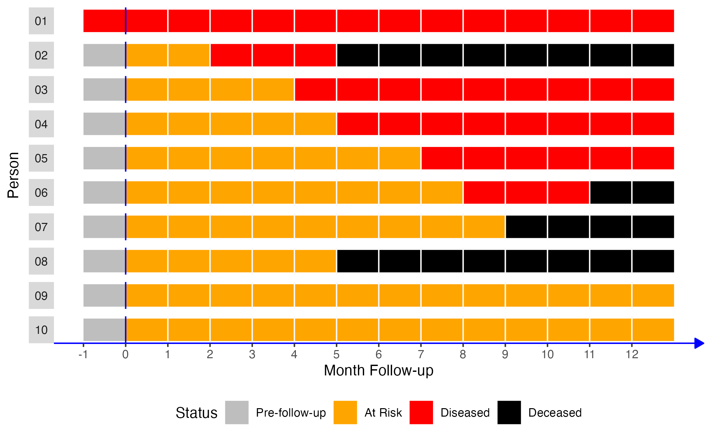

# Measures of Occurrence

```{=html}
<!-- 
Hidden comments placeholder
---------------------------

For more population plot code see: 
- Dropbox/Teaching/epi_3_public/modules/graphics/population_plots.Rmd
- Dropbox/Teaching/epi_3_public/modules/graphics/epi_3_graphics.Rmd

To preview:
bookdown::preview_chapter("chapters/10_part_intro_epi/03_measures_of_occurrence.Rmd")

Copy and paste:
👆**Here's what we did above:**

-->
```

::: under-construction
`r fontawesome::fa("hammer", fill = "#000000", height="1em")` This chapter is under heavy development and may still undergo significant changes.
:::

```{r measures_of_occurrence_load_helper_functions, echo=FALSE}
# Adding some helper functions to help with population plots.
# Set everything to echo=FALSE. The goal here isn't to teach learners how to make population plots. It is simply to use them as a visual aid for learning about populations and samples.
# source("../../R/templates.R") # For colors
# source("../../R/sample_ny.R") # To make sampling easier
# source("../../R/make_pop.R")  # To make an example population
# source("../../R/plot_pop.R")  # To make a population plot

source("R/templates.R") # For colors
source("R/sample_ny.R") # To make sampling easier
source("R/make_pop.R")  # To make an example population
source("R/plot_pop.R")  # To make a population plot
```

<!-- Add a banner -->

In the [Introduction to Epidemiology] chapter, we said that epidemiology is usually defined as something like, "the study of the _occurrence_ and distribution of health-related states or events in specified populations, including the study of the determinants influencing such states, and the application of this knowledge to control the health problems." @Porta2008-ij In this chapter, we begin to explore _how_ we study the occurrence and distribution of these health-related states. 

::: note
🗒**Side Note:** Writing (and reading) "health-related states or events" over and over starts to get cumbersome after a while. Therefore, we will often just use "conditions" or "events" in the text below instead. Further, the methods we discuss below can just as easily be applied to better understanding characteristics of populations that would not typically be described as a "condition" or "event". For example, sex assigned at birth or ethnicity.
:::

We already learned some basic descriptive analysis techniques in the [descriptive analysis][Introduction to Descriptive Analysis] part of the book. If you haven't read that part of the book yet, you may want to go back and do so now. Specifically, we already discussed:

- Methods for calculating the frequency with which each level (or category) of our categorical variables appears in our data.
- Methods for calculating the percentage of observations in our data for which each level (or category) of our categorical variables appears.
- Methods for calculating the center of our numerical variables.
- Methods for calculating the dispersion of our numerical variables. 

In this chapter, and the chapters that follow, we will build on these basic descriptive measures, practice applying them to plausible public health scenarios, and pick up some new methods and terminology along the way. It may also be important to acknowledge up front that this chapter is heavily skewed towards methods for working with categorical outcomes (e.g., diabetes - yes or no) rather than numerical outcomes (e.g., blood sugar levels). This isn't meant to imply that epidemiologists are never interested in investigating numerical outcomes -- they are; however, many of the tools, methods, and theories used in epidemiology are geared towards working with categorical data.

## Terminology

Before we get into calculating measures of occurrence, it may be a good idea to make sure that we are all on the same page with regard to some terms that will be used in this chapter.

<!-- Add:
https://github.com/orgs/brad-cannell/projects/3/views/6?pane=issue&itemId=37768119
-->

### Prevalence and incidence

In our experience, if we walk up to a stranger on the street and ask them what they know about epidemiology, the most common response we will get is a blank stare. However, if that stranger does happen to know a little something about epidemiology, there is a good chance they will mention the words “incidence” or “prevalence”.^[These statements are based on anecdotal experience. They are not based on any empirical evidence that we are aware of. Believe them at your own risk.😂] These two categories of occurrence measures have become really closely associated with the field of epidemiology for good reason. At some level, the vast majority of stories we tell as epidemiologists have to do with how many people currently have a particular health-related state (i.e., prevalence) or how frequently people are moving into a particular health-related state (i.e., incidence).

Notice that in the paragraph above we referred to prevalence and incidence as _categories_ of occurrence measures. We did so because neither prevalence nor incidence are technically measures in and of themselves -- they are more like concepts -- and there are multiple different specific ways we can measure them both. 

At a high-level, **prevalence** is our attempt to quantify how often a particular health-related state _exists_ in our population of interest during a specified period of time. Sometimes we want to quantify how many people have _ever_ had a particular health-related state, and sometimes we want to quantify how many people _currently_ have a particular health-related state. For example, we might want to know the quantity of people in the United States who have ever had a measles infection at some point in their life, or we might want to know the quantity of people in the United States who currently have a measles infection right now. We can report those quantities as a counts, proportions, or odds. 

**Incidence**, on the other hand, is our attempt to quantify how frequently _new incidents_ of a particular health-related state occur in our population of interest during a specified period of time. We may want to quantify the incidence of events that happen one time (e.g., diagnosis of Alzheimer's disease or death), or we may want to quantify the incidence of events that can happen more than once (e.g., number of hip fractures), which are called **recurrent events**. For example, we might want to know the quantity of people in the United States who developed a new measles infection during the previous year. We can report that quantity as a count, a proportion, an odds, or a rate. In the sections that follow, we will we discuss the differences between these measures in greater detail and show you how to use R to calculate them.

The key difference between incidence and prevalence is that incidence is a measure of _new_, as opposed to _existing_, occurrences of the condition we are attempting to quantify. Said another way, incidence quantifies the _transition_ from the absence of the condition to the presence of the condition _over a specified period of time_. @Westreich2019-lg

### Point prevalence and period prevalence

Some readers who have already had an introduction to epidemiology may be aware that the concept of prevalence is sometimes broken down further into the complimentary concepts of **point prevalence** and **period prevalence**. As the names imply, point prevalence is supposed to quantify the prevalence of a health-related state at a particular point in time, and period prevalence is supposed to quantify the prevalence of a health-related state over a longer period of time. However, we find these terms to be somewhat ambiguous.

For example, if we want to estimate the point prevalence of heart disease in the United States, does that mean that we need to figure out if every single person in the United States has heart disease at the exact same moment in time, or even? If so, that hardly seems possible. Even if we only wanted to collect this information from a nationally representative sample of people, it still seems like a tall order. But, what if we ascertain everyone’s status at some point during a single day? Is that a point or a period? What if we do so at some point during a single month? What about a year? Well, we are unaware of any rule about what duration of time is short enough to be considered a “point” in time. Therefore, we don't find the distinction between point prevalence and period prevalence to generally be particularly useful in practice. What _is_ useful, actually _critical_, in practice is to make the time frame our results apply to perfectly clear whenever we interpret and report them.

## Quantifying prevalence

### Prevalence counts

Prevalence counts (or just "counts") are perhaps the most basic measure of occurrence we can use. Prevalence counts tell us the number of people who are living with the condition that we are interested in. As the name implies, we simply count the number of people in our population of interest who have the characteristic we are interested in or who have experienced the event we are interested in. Like all counts, the prevalence count must be an integer value and ranges between 0 and the total number of people in the population who could potentially be living with the condition of interest. For example, let's simulate a hypothetical population of 100 people. 

```{r measures_of_occurrence_pop_100_load_packages}
# Load the packages we will need below
library(dplyr, warn.conflicts = FALSE)
library(ggplot2)
```

```{r measures_of_occurrence_pop_100}
# Set the seed for the random number generator so that we can reproduce our results
set.seed(123)

# Create a 10x10 group of 100 people
pop_100 <- tidyr::expand_grid(x = 1:10, y = 1:10) |> 
  mutate(outcome = sample(c("No", "Yes"), 100, TRUE, c(0.5, 0.5)))
```

All of the the people represented by a orange dot below experienced the event of interest. All of the people represented by a blue dot did not. We can simply count the number of people who experienced the event of interest and report it.

```{r measures_of_occurrence_count_plot_01}
# Plot the population as colored dots
ggplot(pop_100, aes(x, y)) + 
  geom_point(size = 10, aes(color = outcome)) +
  scale_color_manual("Event", values = c(u_blue, u_orange)) +
  theme(
    panel.background = element_blank(),
    axis.title = element_blank(),
    axis.text = element_blank(),
    axis.ticks = element_blank()
  )
```

To make our task a little easier, we will visually organize our figure by event. That is, we will arrange the population so that all of the people who did not experience the event of interest are located next to each other, and all of the people who did experience the event of interest are located next to each other.

```{r measures_of_occurrence_count_plot_02, echo=FALSE}
# Set the seed for the random number generator so that we can reproduce our results
set.seed(123)

# Create a 10x10 group of people
pop_100 <- expand_grid(x = 1:10, y = 1:10)
pop_100$outcome <- sample_ny() |> sort()
n_no <- filter(pop_100, outcome == "No") |> nrow()
n_yes <- filter(pop_100, outcome == "Yes") |> nrow()
count <- c(seq(1, n_no), seq(1, n_yes))

# Rearrange the count number so that it displays in the order we want.
pop_100 <- pop_100 |> 
  mutate(count = count) |> 
  group_by(x, outcome) |> 
  mutate(count = rev(count))

# Create the plot
ggplot(pop_100, aes(x, y)) + 
  geom_point(size = 10, aes(color = outcome)) +
  geom_text(aes(label = count), color = "white") +
  scale_color_manual("Event", values = c(u_blue, u_orange)) +
  theme(
    panel.background = element_blank(),
    axis.title = element_blank(),
    axis.text = element_blank(),
    axis.ticks = element_blank()
  )
```

After doing so, we can simply count the number of people who did and did not experience the event of interest. In this case, 53 and 47 respectively. However, we won't typically want to calculate prevalence counts by plotting people and counting them as we did above. It makes a lot more sense for us to ask R to tell us how many people did and did not experience the event of interest. We learned a few different methods for asking R to do this in the chapter about [numerical descriptions of categorical variables][Numerical Descriptions of Categorical Variables]. We will use one of those methods -- the `table()` function -- below to ask R to calculate the count of people in our population who did and did not experience the event of interest. 


```{r measures_of_occurrence_count_table}
table(pop_100$outcome)
```

Is that enough information? Well, it depends. What is our question? For example, let's say that any person living with the event needs a ventilator, and we want to know if we have enough ventilators. In that case, simply knowing the count of people who are living with the event of interest may be all the information we need. On the other hand, if we want to know if "a lot" of people are living with the event of interest, then knowing the prevalence count alone may or may not be enough information. Said another way, prevalence counts tend to be most useful in communicating the public health importance of a condition or when we just want to get a sense of numbers of health-related events occurring in our population of interest. Regrettably, prevalence counts can also be used to exaggerate the public health importance of a condition. This can occur when we report prevalence counts that sound large without providing the information needed to put the numbers into context. Therefore, it is important for us to responsibly provide context to our audience when reporting prevalence counts (or any other measure of occurrence). Alternatively, we may want to consider reporting the prevalence proportion instead of (or in addition to) the prevalence count.

### Prevalence proportion

As discussed above, prevalence counts can be useful in some circumstances. However, when epidemiologists think about prevalence, they are typically thinking about a prevalence proportion (or percentage). That is, the number of people who have the condition of interest divided by the total number of people in the population of interest.

<!-- For Testing -->
<!-- $$\frac{Count\, of\, condition}{Total\, members\, of\, the\, population}$$ -->
\begin{equation}
  \frac{Count\, of\, condition}{Total\, members\, of\, the\, population}
   (\#eq:prevalence-proportion)
\end{equation}

Because no fewer than zero people in our population of interest can be living with the condition of interest, and no more than all of the people in our population of interest can be living with the condition of interest, the prevalence proportion will range between 0 and 1.

Let's simulate some more data we can use to illustrate prevalence proportions and the other measures that will follow. In this simulated data, we are following 10 people over a 12-month period. Each month, we ascertain and record whether they have some disease or not.

```{r measures_of_occurrence_pop_10}
# Simulate data for 10 hypothetical people
# From Lash TL, VanderWeel TJ, Haneuse S, Rothman KJ. Modern Epidemiology. fourth. Wolters Kluwer; 2021.
people <- 1:10
months <- -1:12
pop_10 <- expand_grid(person = people, month = months)
rows_per_person <- length(months)

# Count from the beginning of each month.
# So, person 2 is pre-follow-up at the beginning of time 1 (month -01), at risk 
# at the beginning of time 2 (month 00), at risk at the beginning of time 3 
# (month 01), diseased at the beginning of time 4 (month 02), etc.
p01 <- rep("Diseased", rows_per_person)
p02 <- c(rep("Pre-follow-up", 1), rep("At Risk", 2), rep("Diseased", 3), rep("Deceased", 8))
p03 <- c(rep("Pre-follow-up", 1), rep("At Risk", 4), rep("Diseased", 9), rep("Deceased", 0))
p04 <- c(rep("Pre-follow-up", 1), rep("At Risk", 5), rep("Diseased", 8), rep("Deceased", 0))
p05 <- c(rep("Pre-follow-up", 1), rep("At Risk", 7), rep("Diseased", 6), rep("Deceased", 0))
p06 <- c(rep("Pre-follow-up", 1), rep("At Risk", 8), rep("Diseased", 3), rep("Deceased", 2))
p07 <- c(rep("Pre-follow-up", 1), rep("At Risk", 9), rep("Diseased", 0), rep("Deceased", 4))
p08 <- c(rep("Pre-follow-up", 1), rep("At Risk", 5), rep("Diseased", 0), rep("Deceased", 8))
p09 <- c(rep("Pre-follow-up", 1), rep("At Risk", 13), rep("Diseased", 0), rep("Deceased", 0))
p10 <- c(rep("Pre-follow-up", 1), rep("At Risk", 13), rep("Diseased", 0), rep("Deceased", 0))
status <- c(p01, p02, p03, p04, p05, p06, p07, p08, p09, p10)

# Add status to pop_10
pop_10$status <- status

# Create factor versions of person and status
pop_10 <- pop_10 |> 
  mutate(
    person_f = factor(person, labels = c(paste0(0, 1:9), "10")),
    status_f = factor(status, levels = c("Pre-follow-up", "At Risk", "Diseased", "Deceased"))
  )

# Add coordinates for line segments in the plot
pop_10_wide <- pop_10 |> 
  group_by(person_f, status_f) |> 
  mutate(
    x    = min(month),
    xend = max(month)
  ) |> 
  ungroup() |> 
  # Keep distinct values only
  distinct(person, status, .keep_all = TRUE) |> 
  # Make the line ends touch
  group_by(person) |> 
  mutate(
    xend_adjusted = lead(x),
    xend_adjusted = if_else(is.na(xend_adjusted), xend, xend_adjusted)
  ) |> 
  relocate(xend_adjusted, .after = xend) |> 
  ungroup()

# Print pop_10 to the screen
pop_10
```

Next, let's create a figure from our simulated data to make it easier to visualize. Time is represented on the x-axis of the figure as months from each person's baseline visit, shown as month 0. Each bar running parallel to the x-axis represents one person's health status during the 12 months of follow-up.

```{r measures_of_occurrence_pop_10_plot}
# Create the figure
pop_10_plot <- ggplot(pop_10_wide) +
  geom_segment(aes(x = x, xend = xend_adjusted, y = 1, yend = 1, color = status_f), size = 5) +
  # Show all months
  scale_x_continuous("Month Follow-up", breaks = -1:12) +
  facet_wrap(vars(person_f), nrow = 10, strip.position = "left") +
  # Add a line marking the start of follow up
  geom_vline(xintercept = 0, color = "blue") +
  # Add vertical lines to mark the start of each month
  geom_vline(xintercept = 1:12, color = "#f9f9f9") +
  # Change fill colors
  scale_color_manual("Status", values = c("gray", "orange", "red", "black", "#4682B4")) +
  # Change y-axis label
  ylab("Person") +
  theme(
    # Remove gray background
    panel.background = element_blank(),
    # Remove the "p" from the x axis
    axis.text.y = element_blank(),
    axis.ticks.y = element_blank(),
    # Move legend
    legend.position = "bottom",
    # Change the color and style of the "months" axis 
    axis.line.x = element_line(
      color = "blue", arrow = grid::arrow(length = unit(0.1, "inches"), type = "closed")
    ),
    # Rotate the facet label to the right
    strip.text.y.left = element_text(angle = 0)
  )
```

```{r measures_of_occurrence_pop_10_plot_save, echo=FALSE}
# Save the plot above and reuse the image below.
# This speeds up the time it takes to build the book.
# Additionally, if we make changes to the figure in the future, we only need to
# make them in one place.
ggsave(
  "img/10_part_intro_epi/03_measures_of_occurrence/pop_10_plot.png",
  pop_10_plot, 
  width = 7.29, height = 4.51
)
```

```{r measures_of_occurrence_pop_10_plot_prevalence_proportion, echo=FALSE}

```

Now, let's say that we come along and decide to do a study with the people in our simulated population of interest. Using equation \@ref(eq:prevalence-proportion), what is the prevalence proportion of disease over the 12 months of follow-up? 

The prevalence proportion of disease is equal to the number of people with disease divided by the number of people in the sample. In this case, that would be 6 people (persons 01 through 06) divided by 10. 

$$\frac{6}{10} = 0.6 \hspace{1.5mm} or \hspace{1.5mm} 60\%$$

Among the members of our population, the prevalence of disease during the 12-month follow-up period was 0.6. Said another way, 60% of our population had the disease during the 12-month follow-up period.

#### Calculating prevalence proportions with R

Now, let’s look at some ways we can calculate a prevalence proportion with R.

One way (of many) to calculate prevalence proportions is to create objects matching the elements of our equation above and then assign the relevant values to those objects. An advantage of using this method is that the objects are reusable later if we need them. For example:

```{r}
# Create a vector containing the number of people with the condition of interest
n_condition <- 6
# Create a vector containing the number of people in the population of interest
n_population <- 10
# Calculate the prevalence proportion and assign it to an object called 
# prevalence_prop
prevalence_prop <- n_condition / n_population
# Print the value stored in prevalence_prop to the screen
prevalence_prop
```

We can also simply use R like a fancy calculator. An advantage of this method is that it is quick and easy to understand.

```{r}
6 / 10
```

Additionally, we can simply multiply proportions by 100 to convert them to percentages.

```{r}
(6 / 10) * 100
```

And converting the value stored in the `prevalence_prop` object works exactly the same way.

```{r}
# Convert the value in prevalence_prop to a percentage and assign it to a new
# object called prevalence_percent
prevalence_percent <- prevalence_prop * 100
# Print the value stored in prevalence_percent to the screen
prevalence_percent
```

Sometime, it can be useful to add a percent sign to the value for reporting purposes. We can add a percent sign using the `paste0()` function as shown below. Just keep in mind adding the percent sign turns our value into a _character string_. It will no longer have a numeric value to R.

```{r}
# Add percent sign to the value in prevalence_percent
prevalence_percent <- paste0(prevalence_percent, "%")
# Print the value stored in prevalence_percent_formatted to the screen
prevalence_percent
```

Sometimes, it can be useful simulate and analyze a little data frame with the characteristics of interest.

```{r}
# Simulate a small data frame that has the characteristics we are interested in.
df <- tibble(
  id = 1:10,
  disease = c(rep(1, 6), rep(0, 4))
)

# Print the simulated data to the screen
df
```

We can then analyze the data using the methods we learned in the [descriptive analysis][Introduction to Descriptive Analysis] part of the book.

```{r}
# Load the freqtables package
library(freqtables)
```

```{r}
# Calculate the prevalence proportion (and other measures) and assign them to a 
# new object called results
results <- df |> 
  freq_table(disease)

# Print the value stored in results to the screen
results
```

We can even grab specific values from our results that we can reuse later. For example, let's grab the prevalence percent from our results and store them as an object in our global environment.

```{r}
# Assign the percent values from the results object to a new object called
# prevalence_percent
prevalence_percent <- results |> 
  filter(cat == 1) |>  # Keep only the row with cat == 1
  pull(percent)        # Keep only the value of percent from that row

# Print the value stored in prevalence_percent to the screen
prevalence_percent
```

We can also use base R's [bracket notation] if we prefer.

```{r}
prevalence_percent <- results$percent[2]
prevalence_percent
```

#### Interpretation

And here are some ways that we can interpret the prevalence proportion we calculated above.

1. Among the members of our population, the prevalence of disease over the 12-month follow-up period was 0.6.

2. Among the members of our population, 60% had disease over the 12-month follow-up period. 

3. Sixty percent of the members of our population had disease over the 12-month follow-up period.

4. The prevalence of disease in our population over the 12-month follow-up period was 0.60 (or 60%).


### Prevalence Odds

The prevalence odds are less familiar to many people and may feel more awkward to use. However, the prevalence odds are simply a function of the prevalence proportion. Specifically, the prevalence odds are equal to the prevalence proportion divided by 1 minus the prevalence proportion. Why do we calculate the prevalence odds? Well, we generally don't calculate the prevalence odds manually as we will do below; however, sometimes the prevalence odds are conveniently returned from regression models we will learn to use later in the book. Therefore, a gentle introduction to prevalence odds here may come in handy later.

<!-- For Testing -->
<!-- $$\frac{Prevalence\, proportion}{1 - Prevalence\, proportion}$$ -->
\begin{equation}
  \frac{Prevalence\, proportion}{1 - Prevalence\, proportion}
   (\#eq:prevalence-odds)
\end{equation}

Like all odds, the prevalence odds can range from 0 to infinity. Let's once again use our simulated data to walk through an applied example of calculating prevalence odds.

#### Calculating prevalence odds with R

```{r measures_of_occurrence_pop_10_plot_prevalence_odds, echo=FALSE}

```

We can calculate the prevalence odds similarly to the way we calculated prevalence proportion above. Notice that we are able to reuse the `prevalence_prop` object we created above. However, we have to make sure to use `prevalence_prop` instead of `prevalence_percent` and we can't forget to place parentheses around `1 - prevalence_prop`.

```{r}
# Calculate the prevalence odds and assign it to an object called 
# prevalence_odds
prevalence_odds <- prevalence_prop / (1 - prevalence_prop) # Don't forget parentheses
# Print the value stored in prevalence_odds to the screen
prevalence_odds
```

Of course, we could still use R as a calculator as we did above for prevalence proportion.

```{r}
0.6 / (1 - 0.6)
```

And we can also calculate this estimate directly from our simulated data.

```{r}
df |> 
  freq_table(disease) |> 
  # Convert percent back to a proportion by dividing by 100
  # Use mutate to do this: https://www.r4epi.com/creating-and-modifying-columns.html
  mutate(prop = percent / 100) |> 
  # Keep only the row of results that contains the proportion of people who 
  # with disease (event)
  filter(cat == 1) |> 
  # Distill our results into a summary table (with one row and column)
  # Use summarise to do this: https://www.r4epi.com/numerical-descriptions-of-categorical-variables.html#the-tidyverse-way
  summarise(prevalence_odds = prop / (1 - prop)) 
```

#### Interpretation 

And here are some ways that we can interpret the prevalence odds we calculated above.

1. Among the members of our population, the odds of disease during the 12-month follow-up period were 1.5.

2. Among the members of our population, the odds of disease during the 12-month follow-up period were 1.5:1.

3. We can also multiply both sides of the ratio above by 10 and interpret our results this as: Among the members of our population, the odds of disease during the 12-month follow-up period were 15:10. 

4. Among the members of our population, for every 1.5 people who had disease during the 12-month follow-up period there was one person who did not.

5. Among the members of our population, for every 15 people who had disease during the 12-month follow-up period there were ten people who did not.

#### Interpretation of odds less than one

When odds are less than 1, they can be especially tricky to interpret. To help illustrate this point, let's assume that we only followed our population for two months instead of 12 months. Only 2 of the 10 people in our population had developed disease at month 2. What would the prevalence odds be in that case?

Well, the prevalence proportion would be:

$$\frac{2}{10} = 0.2$$

So, the prevalence odds would be:

$$\frac{Prevalence\, proportion}{1 - Prevalence\, proportion} = \frac{0.2}{1-0.2} = 0.25$$

And we can interpret those odds in any of the following ways:

1. Among the members of our population, the odds of disease during the 2-month follow-up period were 0.25.

2. Among the members of our population, the odds of disease during the 2-month follow-up period were 0.25:1.

```{r}
# Make 0.25:1 more intuitive by dividing the the second number by the first
1 / 0.25
```

3. Among the members of our population, the odds of disease during the 2-month follow-up period were 1:4. 

4. Among the members of our population, for every person who had disease during the 2-month follow-up period there were four people who did not.

In our opinion, interpretation 4, while not necessarily the most commonly used, is probably the easiest for most people to understand in a meaningful way. If we go back and look at our simulated population, we can see interpretation 4 visually. For every one person who had disease at month two there were four people who did not. Two people had disease at month 2 (person 01 and person 02). Therefore, we expect that 8 people did not have disease at month 2. And that's exactly what we see -- persons 03 through 10 did not have disease in month 2.

## Quantifying incidence

As discussed at the beginning of the chapter, incidence is our attempt to quantify how frequently _new incidents_ of a particular health-related state occur in our population of interest during a specified period of time. Therefore, it doesn't make logical sense to include people who _already_ have the condition of interest in our calculations. How can we measure their _transition_ from not having the condition to having the condition if they already have the condition? This idea is commonly captured in the concept of a population "at risk". Below, we will quantify incidence in many of the same ways as we quantified prevalence -- as incidence counts, incidence proportions, and incidence odds. In addition, we will also introduce the concept of person-time and incidence rates.

### Incidence Count

Incidence counts are identical to prevalence counts except that we count the number of _new_ occurrences of the disease or condition of interest during a specified period of time.

```{r measures_of_occurrence_pop_10_plot_incidence_count, echo=FALSE}

```

To solidify the concept in our minds, let's look take another look at our simulated population of 10 people. At the start of follow-up, which is month 0 in the figure above, there are 10 people alive in our population. How many of those 10 people have the disease we are interested in?

At the start of follow-up, person 01 has the disease of interest.

How many of the 10 people in our simulated population are "at risk" of newly getting the disease we are interested in (assume that this disease cannot reoccur)?

At the start of follow-up, 9 people (every person except person 01) are at risk of getting the disease. Person 01 is not at risk of getting the disease because they already developed the disease at some point prior to month 0. Let's pause here and note a couple of key points.

1. We can count person 01 as a _prevalent_ case at month 0, but we cannot count person 01 as an _incident_ case at month 0. This is a concrete example of the difference between prevalence and incidence.

2. Assuming they weren't born with this disease, person 01 _did_ newly acquire it at _some point_ in the past. In other words, they were an "incident" case at some time in the past; however, they didn't newly acquire the disease during our _specified period of time_. This is a concrete example of the importance of being explicit about the timing and duration of our period of study.

Now, let's move down to follow-up month 1. We check up on our population of 10 people. Who many people have the disease of interest? 

At follow-up month 1, two people have the disease of interest -- person 01 and person 02. 

What is the incident count at month 1?

At follow-up month 1, the incident count of the disease of interest is 1. Person 01 and person 02 both have the disease of interest, but only person 02 has a _new_ case of the disease.

Let's do this one more time. Take a look at follow-up month 6. When we do our 6-month checkup, how many people have the disease of interest?

At follow-up month 6, five people have the disease of interest -- person 01, person 03, person 04, and person 05.

What is the incident count at month 6?

Well, we need to be really careful about our language here because we could answer this question in a couple of different ways.

- If we are interested in knowing the count of incident cases _at_ month 6 (relative to month 5), then the answer is 1. Only person 05 developed disease specifically at month 6.

- If we are interested in knowing the count of incident cases during our period of study at month 6 (relative to month 0), then the answer is 4. Person 01, person 03, person 04, and person 05 are alive and have the disease of interest at month 6, but only person 02, person 03, person 04, and person 05 _newly acquired_ the disease during our period of study (month 0 to month 6). You may have been tempted to leave out person 02 because they were deceased at month 6, but that would be incorrect. They were dead at month 5, but we observed them develop a new case of disease during our study period before they died.

### Incidence proportion

When people use the word "incidence" without a qualifier, they are typically, though not always, talking about the incidence proportion. Other terms that are commonly used to refer to an incidence proportion are "risk" and "cumulative incidence". We prefer to use incidence proportion because we find it to be less ambiguous than risk or cumulative incidence. 

The numerator we use to calculate the incidence proportion is the incident count we learned about above. The denominator we use to calculate the incidence proportion is the count of people in the population of interest who were _at risk_ experiencing a _new_ occurrence of the disease or condition of interest during the specified period of time.

$$\frac{Count\, of\, new\, occurences}{Population\, at\, risk}$$

```{r measures_of_occurrence_pop_10_plot_incidence_proportion, echo=FALSE}

```

Let's look take another look at our simulated population of 10 people. We already determined that nine of those people were at risk of getting the disease of interest. Person 01 was not at risk because they acquired the disease at some point prior to the start of our study period. Therefore, what is the incidence proportion over the 12 months of follow-up?

The incidence proportion during over the 12 months of follow-up was 5/9 or 0.56. Our numerator included the 5 people who developed the disease during the study period -- person 02, person 03, person 04, person 05, and person 06 -- and our denominator included the 9 people who were at risk of disease at the start of the study period.

#### Calculating incidence proportions with R

Now, let’s look at some ways we can calculate an incidence proportion with R.

```{r}
# Create a vector containing the number of people with incident disease
incidence_count <- 5
# Create a vector containing the number of people in the population of interest
# who were at risk at the start of follow-up
population_at_risk <- 9
# Calculate the incidence proportion and assign it to an object called 
# incidence_prop
incidence_prop <- incidence_count / population_at_risk
# Print the value stored in prevalence_prop to the screen
incidence_prop
```

Let's round to the hundredths place (2 decimal places).

```{r}
# Round the value stored in incidence_prop to the hundredths place and assign
# that value back to the incidence_prop vector
incidence_prop <- round(incidence_prop, 2)
# Print the value stored in prevalence_prop to the screen
incidence_prop
```

#### Interpretation

And here are some ways that we can interpret the incidence proportion we calculated above.

1. Among the members of our population, the incidence of disease over 12 months of follow-up was 0.56.

2. Fifty six percent of the members of our population developed disease over 12 months of follow-up.

We would like to once again remind you how important it explicitly report information about the period of study along with the incidence proportion. Let's consider death as an outcome for a moment in order to further illustrate this point. All humans eventually die; therefore, over a sufficiently long duration of follow-up, the incidence proportion of death will be 1.0. So, if we report that the incidence proportion of death in our study was 0.2, that isn't particularly meaningful. Did 20% of the population die in a day? A week? A year? Over a 10-year period? It would be far more useful for us to report that 20% of the population died _during the 3 years of follow-up_ (or whatever the study period was).

### Incidence Odds

Like prevalence odds, incidence odds are not commonly used as a measure of occurrence in epidemiology. However, we will demonstrate how to calculate them here for the sake of completeness. The incidence odds are equal to the incidence proportion divided by 1 minus the incidence proportion.

$$\frac{Incidence\, proportion}{1 - Incidence\, proportion}$$

#### Calculating incidence odds with R

We can calculate the incidence odds similarly to the way we calculated prevalence odds above. 

```{r}
# Calculate the incidence odds and assign it to an object called 
# incidence_odds
incidence_odds <- incidence_prop / (1 - incidence_prop) # Don't forget parentheses
# Print the value stored in incidence_odds to the screen
incidence_odds
```

Again, we can round the value of `incidence_odds` to make it easier to read.

```{r}
# Round the value stored in incidence_odds to the hundredths place and assign
# that value back to the incidence_odds vector
round(incidence_odds, 2)
```

#### Interpretation

And here are some ways that we can interpret the incidence odds we calculated above.

1. Among the members of our population, the odds of incident disease over 12 months of follow-up were 1.27.

2. Among the members of our population, the odds of incident disease over 12 months of follow-up were 1.27:1.

3. Among the members of our population, the odds of incident disease over 12 months of follow-up were 127:100. 

4. Among the members of our population, for every 127 people develop incident disease over 12 months of follow-up there were 100 people who did not.

### Incidence Rate

To calculate an accurate incidence proportion using the methods we learned above, our population of interest must be a closed population and we we must have complete follow-up all of the population members. In other words, new people can't enter the population during the study period, nobody can leave the population (except through death), and we have to be able to collect data from everyone throughout the entire duration of the study. Why are these conditions important? Let's take another look at our simulated population to help us understand.

```{r measures_of_occurrence_pop_10_plot_incidence_rate_intro, echo=FALSE}

```

Let's assume that our population of interest is geographically defined. It is an incredibly small town that we are interested in. We know that 10 people are members of the population, but we don't actually know them by name. Perhaps this town is on the other side of the world, or existed at some time in the past, and we only have access to written records.

Next, let's say that two new people moved to the little town at some point during the 12 month study period (shown as person 11 and person 12 below). Additionally, person 02 and person 03 moved out of the little town during the 12 month study period. The figure below illustrates these changes.

```{r measures_of_occurrence_pop_12, echo=FALSE}
# Simulate data for 12 hypothetical people
# From Lash TL, VanderWeel TJ, Haneuse S, Rothman KJ. Modern Epidemiology. fourth. Wolters Kluwer; 2021.
people <- 1:12
months <- -1:12
pop_12 <- expand_grid(person = people, month = months)
rows_per_person <- length(months)

# Count from the beginning of each month.
# So, person 2 is pre-follow-up at the beginning of time 1 (month -01), at risk 
# at the beginning of time 2 (month 00), at risk at the beginning of time 3 
# (month 01), diseased at the beginning of time 4 (month 02), etc.
p01 <- rep("Diseased", rows_per_person)
# Person 02 and 03 move out of town during follow-up
p02 <- c(rep("Pre-follow-up", 1), rep("At Risk", 1), rep("Diseased", 0), rep("Deceased", 0), rep("Censored", 12))
p03 <- c(rep("Pre-follow-up", 1), rep("At Risk", 2), rep("Diseased", 0), rep("Deceased", 0), rep("Censored", 11))
p04 <- c(rep("Pre-follow-up", 1), rep("At Risk", 5), rep("Diseased", 8), rep("Deceased", 0))
p05 <- c(rep("Pre-follow-up", 1), rep("At Risk", 7), rep("Diseased", 6), rep("Deceased", 0))
p06 <- c(rep("Pre-follow-up", 1), rep("At Risk", 8), rep("Diseased", 3), rep("Deceased", 2))
p07 <- c(rep("Pre-follow-up", 1), rep("At Risk", 9), rep("Diseased", 0), rep("Deceased", 4))
p08 <- c(rep("Pre-follow-up", 1), rep("At Risk", 5), rep("Diseased", 0), rep("Deceased", 8))
p09 <- c(rep("Pre-follow-up", 1), rep("At Risk", 13), rep("Diseased", 0), rep("Deceased", 0))
p10 <- c(rep("Pre-follow-up", 1), rep("At Risk", 13), rep("Diseased", 0), rep("Deceased", 0))
# Person 11 and 12 move into town during follow-up
p11 <- c(rep("Censored", 6), rep("Pre-follow-up", 0), rep("At Risk", 8), rep("Diseased", 0), rep("Deceased", 0))
p12 <- c(rep("Censored", 8), rep("Pre-follow-up", 0), rep("At Risk", 6), rep("Diseased", 0), rep("Deceased", 0))
status <- c(p01, p02, p03, p04, p05, p06, p07, p08, p09, p10, p11, p12)

# Add status to pop_12
pop_12$status <- status

# Create factor versions of person and status
pop_12 <- pop_12 |> 
  mutate(
    person_f = factor(person, labels = c(paste0(0, 1:9), 10:12)),
    status_f = factor(status, levels = c("Pre-follow-up", "At Risk", "Diseased", "Deceased", "Censored"))
  )

# Add coordinates for line segments in the plot
pop_12_wide <- pop_12 |> 
  group_by(person_f, status_f) |> 
  mutate(
    x    = min(month),
    xend = max(month),
    y    = person,
    yend = person
  ) |> 
  ungroup() |> 
  # Keep distinct values only
  distinct(person, status, .keep_all = TRUE) |> 
  # Make the line ends touch
  group_by(person) |> 
  mutate(
    xend_adjusted = lead(x),
    xend_adjusted = if_else(is.na(xend_adjusted), xend, xend_adjusted)
  ) |> 
  relocate(xend_adjusted, .after = xend) |> 
  ungroup()

# Create the figure
pop_12_plot <- ggplot(pop_12_wide) +
  geom_segment(aes(x = x, xend = xend_adjusted, y = 1, yend = 1, color = status_f), size = 5) +
  # Show all months
  scale_x_continuous("Month Follow-up", breaks = -1:12) +
  facet_wrap(vars(person_f), nrow = 12, strip.position = "left") +
  # Add a line marking the start of follow up
  geom_vline(xintercept = 0, color = "blue") +
  # Add vertical lines to mark the start of each month
  geom_vline(xintercept = 1:12, color = "#f9f9f9") +
  # Change fill colors
  scale_color_manual("Status", values = c("gray", "orange", "red", "black", "#4682B4")) +
  # Change y-axis label
  ylab("Person") +
  theme(
    # Remove gray background
    panel.background = element_blank(),
    # Remove the "p" from the x axis
    axis.text.y = element_blank(),
    axis.ticks.y = element_blank(),
    # Move legend
    legend.position = "bottom",
    # Change the color and style of the "months" axis 
    axis.line.x = element_line(
      color = "blue", arrow = grid::arrow(length = unit(0.1, "inches"), type = "closed")
    ),
    # Rotate the facet label to the right
    strip.text.y.left = element_text(angle = 0)
  )
```

```{r measures_of_occurrence_pop_12_plot_save, echo=FALSE}
# Save the plot above and reuse the image below.
# This speeds up the time it takes to build the book.
# Additionally, if we make changes to the figure in the future, we only need to
# make them in one place.
ggsave(
  "img/10_part_intro_epi/03_measures_of_occurrence/pop_12_plot.png",
  pop_12_plot, 
  width = 7.29, height = 4.51
)
```

```{r measures_of_occurrence_pop_12_plot_incidence_rate, echo=FALSE}
knitr::include_graphics("img/10_part_intro_epi/03_measures_of_occurrence/pop_12_plot.png")
```

Under these conditions, we still observe that 9 people were at risk of disease at the start of follow-up (persons 02 - 10). At some point during the 12 months of follow-up, persons 02 and 03 move out and persons 11 and 12 move in. When we go to analyze our study data at the end of follow-up, we observe that 3 people developed the disease (person 04, person 05, and person 06). _We_ know that person 02 and person 03 also developed disease because we are simulating this scenario. Additionally, _we_ know that person 11 and person 12 weren't in the population at the start of the study because we are simulating this scenario. But, if we weren't simulating this scenario, all we would know is that we started with 10 people, 9 of whom were at risk, and that 3 of them had disease at the end of 12 months of follow-up. Therefore, we would calculate the incidence proportion as 3/9 or 0.33, which underestimates the true population incidence proportion of 0.56.

As another example, let's return to our original population of 10 people. This time, let's imagine that person 06 and person 07 decide that they don't want to participate in our study anymore and stop showing up for their follow-up appointments at month 6. This change doesn't have any affect on our denominator. We still observe that 9 people were at risk of disease at the start of follow-up (persons 02 - 10). However, we no longer know the status of person 06 and person 07 at the end of the study period (month 12). So, what value are we to use for our numerator?

```{r measures_of_occurrence_pop_10_censored, echo=FALSE}
# Add censored values to person 6 and person 7
pop_10_censored <- pop_10 |>
  mutate(
    across(
      c(status, status_f),
      ~ case_when(
        (person == 6 | person == 7) & month >= 6 ~ "Censored",
        TRUE ~ .x
      )
    )
  ) |> 
  # Add censored as a factor level
  mutate(status_f = factor(status, levels = c("Pre-follow-up", "At Risk", "Diseased", "Deceased", "Censored")))

# Add coordinates for line segments in the plot
pop_10_censored_wide <- pop_10_censored |> 
  group_by(person_f, status_f) |> 
  mutate(
    x    = min(month),
    xend = max(month)
  ) |> 
  ungroup() |> 
  # Keep distinct values only
  distinct(person, status, .keep_all = TRUE) |> 
  # Make the line ends touch
  group_by(person) |> 
  mutate(
    xend_adjusted = lead(x),
    xend_adjusted = if_else(is.na(xend_adjusted), xend, xend_adjusted)
  ) |> 
  relocate(xend_adjusted, .after = xend) |> 
  ungroup()

# Create the figure
pop_10_censored_plot <- ggplot(pop_10_censored_wide) +
  geom_segment(aes(x = x, xend = xend_adjusted, y = 1, yend = 1, color = status_f), size = 5) +
  # Show all months
  scale_x_continuous("Month Follow-up", breaks = -1:12) +
  facet_wrap(vars(person_f), nrow = 10, strip.position = "left") +
  # Add a line marking the start of follow up
  geom_vline(xintercept = 0, color = "blue") +
  # Add vertical lines to mark the start of each month
  geom_vline(xintercept = 1:12, color = "#f9f9f9") +
  # Change fill colors
  scale_color_manual("Status", values = c("gray", "orange", "red", "black", "#4682B4")) +
  # Change y-axis label
  ylab("Person") +
  theme(
    # Remove gray background
    panel.background = element_blank(),
    # Remove the "p" from the x axis
    axis.text.y = element_blank(),
    axis.ticks.y = element_blank(),
    # Move legend
    legend.position = "bottom",
    # Change the color and style of the "months" axis 
    axis.line.x = element_line(
      color = "blue", arrow = grid::arrow(length = unit(0.1, "inches"), type = "closed")
    ),
    # Rotate the facet label to the right
    strip.text.y.left = element_text(angle = 0)
  )
```

```{r measures_of_occurrence_pop_10_censored_plot_save, echo=FALSE}
# Save the plot above and reuse the image below.
# This speeds up the time it takes to build the book.
# Additionally, if we make changes to the figure in the future, we only need to
# make them in one place.
ggsave(
  "img/10_part_intro_epi/03_measures_of_occurrence/pop_10_censored_plot.png",
  pop_10_censored_plot, 
  width = 7.29, height = 4.51
)
```

```{r measures_of_occurrence_pop_10_plot_incidence_rate_loss_to_follow_up, echo=FALSE}
knitr::include_graphics("img/10_part_intro_epi/03_measures_of_occurrence/pop_10_censored_plot.png")
```

Well, we may be tempted to say that neither of them developed the disease because they were disease free at the last follow-up visit they _did_ attend (month 5). Using that logic, we would calculate our incidence proportion as 4/9 or 0.44 -- counting persons 02, 03, and 04 only in our numerator. Of course, because this is a simulated population, we know that 0.44 once again underestimates the true population incidence proportion of 0.56. This approach is clearly not ideal. Unfortunately, this kind of loss to follow-up is an incredibly common occurrence in the real world. So, what are we to do? 

One option is to quantify incidence using methods that take the length of time each member of the population is under observation into account. However, we need to introduce another key concept -- **person-time** -- before diving into time-to-event methods.

#### Person-time

> "Person-time is the amount of time observed for all people under study while at risk of experiencing an incident outcome." @Westreich2019-lg

The definition above can also be written in a more formulaic way like this.

$$\sum_{people} Time\, spent\, at\, risk$$

Some readers may never have seen the symbol above that kind of looks like a backward 3. It is the Greek letter sigma, and it is shorthand for "add up everything to the right". The word "people" written below the sigma means "for all people." So, taken together, the formula means, for all people in the population, add up each of their individual times spent at risk of disease. 

Let's once again use our simulated population to 10 people to dig into this definition a little bit.

```{r measures_of_occurrence_pop_10_plot_person_time, echo=FALSE}

```

How many people were at risk of experiencing a new occurrence of disease during the period of observation? We already decided that the answer to this question is 9.

For how many months were these 9 people under observation and at risk of developing a new occurrence of disease? To answer that question, we need to determine each individual person's observed time at risk.

```{r measures_of_occurrence_individual_person_time_at_risk}
# Have R calculate the total person-months at risk
pop_10_wide |> 
  # Keep only the rows with a status of At Risk
  filter(status == "At Risk") |> 
  # Calculate the time between follow-up months for each person
  mutate(time_at_risk = xend_adjusted - x) |> 
  # Keep only the person and time_at_risk columns to make the results easier to
  # read
  select(person_f, time_at_risk)
```

- Person 02: 2 month
- Person 03: 4 months
- Person 04: 5 months
- Person 05: 7 months
- Person 06: 8 months
- Person 07: 9 months
- Person 08: 5 months
- Person 09: 12 months
- Person 10: 12 months

After we determine each person's individual time spent at risk, we add them up to the population time at risk. 

```{r}
# Calculate the population time at risk and assign it to an object called 
# pop_time_at_risk
pop_time_at_risk <- 2 + 4 + 5 + 7 + 8 + 9 + 5 + 12 + 12
# Print the value stored in pop_time_at_risk to the screen
pop_time_at_risk
```

But, instead of doing this calculation manually, let's ask R to do it for us using the simulated data directly.

```{r measures_of_occurrence_total_person_time_at_risk}
# Have R calculate the total person-months at risk
pop_10_wide |> 
  # Keep only the rows with a status of At Risk
  filter(status == "At Risk") |> 
  # Calculate the time between follow-up months for each person
  mutate(time_at_risk = xend_adjusted - x) |> 
  # Total all of the individual person-months at risk
  summarise(time_at_risk = sum(time_at_risk))
```

So, these people were under observation and at risk of developing a new occurrence of disease for a combined total of 64 months. However, it might be a little confusing if we simply say that we observed our population for 64 months. That can easily be interpreted to mean that our study was 64 months long. In reality, it was only 12 months long. So, we typically say that we observed our population for 64 _person-months_, or that we had 64 _person-months_ of follow-up data, or something along those lines. 

Why do we say person- _months_ instead of, for example, person- _years_? Well, it is probably the most natural why to describe the amount of person-time our population was under observation because our study was less than a year long and we collected data every month. Having said that, we are not _required_ to report the person-time under observation as person-months. We can easily convert person-months to person-years by dividing the person-months by 12.

```{r}
# Convert person-months to person-years by dividing by 12
64/12
```

::: note
🗒**Side Note:** Why divide person-months by 12 to convert them to person-years? Because there are 12 months in a year. Think about it this way: If we followed one person for 12 months, we would have observed them for 12 person-months, right? We would have also observed them for 1 year, right? And how can we convert 12 to 1? We can convert 12 to 1 by dividing it by 12 (12 / 12 = 1). More generally, to convert a shorter unit of person-time into a longer unit of person-time, we divide the shorter unit by the number of times it will goes into the longer. The opposite is true when converting a longer unit of person-time into a shorter unit of person-time.
:::

So, saying that we have 64 person-months of data, and saying that we have 5.33 person-years of data, are saying the exact same thing. We are just saying it in 2 different ways. Actually, we could convert person-months to person-weeks, person-days, or a number of other different versions of person-time. So, which one do we choose? Well, there are some areas of study that tend to use a particular person-time measure more often than others by convention. However, our ultimate goal should typically be to choose measures that communicate our findings in the most honest and useful way possible. This may require us to do a little experimenting at times.

#### Calculating incidence rates with R

In the sections above, we discussed some reasons why incidence proportions can be difficult to accurately calculate in practice. We also learned to calculate the person-time experience for our population of interest. In this section, we will build on those two concepts and learn how to calculate incidence rates. 

> Incidence rates are "a measure of the average intensity at which an event occurs in the experience of people over time, and, for a population followed from baseline, it is calculated as the number of cases in that population divided by the amount of person-time at risk accumulated by that population." @Westreich2019-lg

The definition above can also be written in a more formulaic way like this.

$$\frac{Count\, of\, new\, occurences}{Person\, time\, at\, risk}$$

With this definition in mind, what is the incidence rate of disease in our simulated population of 10 people? Well we already determined that 5 people at risk (person 02, person 03, person 04, person 05, person 06) developed a new occurrence of disease during the 12 months of follow-up. Additionally, we already determined that we observed 64 person-months of time at risk during the 12 months of follow-up. Let's use that information to calculate the incidence rate with R.

```{r}
# Create a vector containing the incident count
n_occurrences <- 5
# Create a vector containing the person months at risk
person_months_at_risk <- 64
# Calculate the incidence rate and assign it to an object called 
# incidence_rate
incidence_rate <- n_occurrences / person_months_at_risk
# Print the value stored in incidence_rate to the screen
incidence_rate
```

#### Interpretation

And here are just a few (of many) ways that we can interpret the incidence rates we calculated above.

1. The incidence rate of disease among the members of our population was 5 cases per 64 person-months during 12 months of follow-up.

```{r}
# Calculate the person-month rate
incidence_rate
```

2. The incidence rate of disease among the members of our population was 0.078 cases per person-month during 12 months of follow-up.

```{r}
# Calculate the 100 person-month rate
incidence_rate * 100
```

3. The incidence rate of disease among the members of our population was 7.8 cases per 100 person-months during 12 months of follow-up.

```{r}
# Calculate the person-year rate
# First, convert person-time to years
person_years_at_risk <- person_months_at_risk / 12
# Divide the incidence count by person-years at risk
n_occurrences / person_years_at_risk
```

4. The incidence rate of disease among the members of our population was 0.94 cases per person-year during 12 months of follow-up.

Notice that we can't simply divide the person-month incidence rate by 12 to get the person-year incidence rate.

```{r}
incidence_rate / 12
```

If you need to do a little sanity check to convince yourself that 0.94 cases per person-year is correct, then think about the following. We aleady said that there were 0.078 per person-month in our population. We also know that we followed everyone for 12 months. Therefore, we would expect the person-year incidence rate to be roughly 0.078 * 12, which is:

```{r}
0.078 * 12
```

```{r echo=FALSE}
# clean up
rm(list = ls())
```


