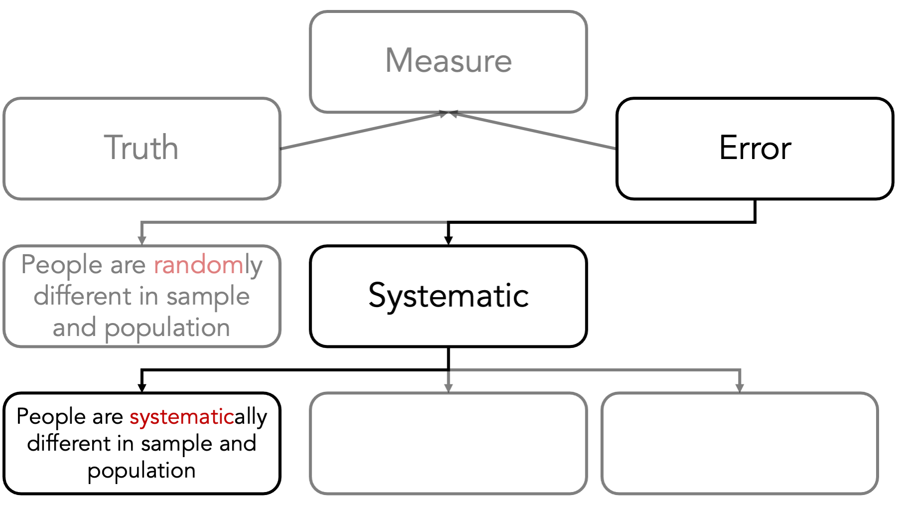
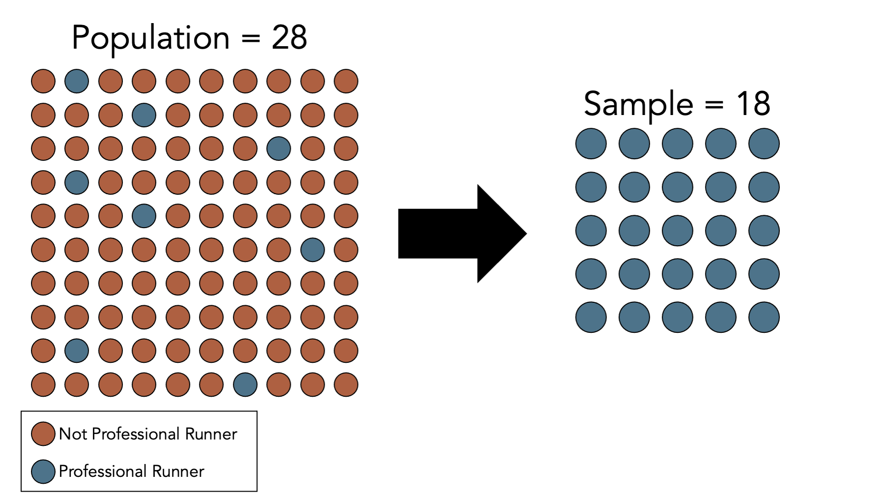

# Selection Bias

```{=html}
<!-- 
Hidden comments placeholder
---------------------------

To preview:
bookdown::preview_chapter("chapters/10_part_epi_foundations/10_selection_bias.Rmd")

Copy and paste:
👆**Here's what we did above:**
-->
```

::: under-construction
`r fontawesome::fa("hammer", fill = "#000000", height="1em")` This chapter is under heavy development and may still undergo significant changes.
:::

```{r selection-bias, echo=FALSE}
# knitr::include_graphics("img/10_part_epi_foundations/11_selection_bias/figure.png")
```

Systematic error refers to the differences between our conclusions and the truth that are caused by the way we collected our data or conducted our analysis. There are many different flavors of systematic error that may affect the difference between our measure and the truth. Although it is not a perfect classification scheme, it can be useful to think of systematic errors arising in 3 general ways. 

First, people are systematically different in our sample than they are in the population of interest. This doesn’t happen because of chance or luck. It happens because of the choices we make or the choices the study participants make.

```{r selection-bias-error-diagram, echo=FALSE}

```

Consider this, admittedly very extreme, example. Let’s once again say that we are interested in estimating the average BMI of adults living in Texas by measuring the BMI of a sample of adults living in Texas. However, this time we don’t measure the BMI of a simple random sample of adults living in Texas. This time, we only measure the BMI of professional runners and find that the average in our sample is 18. Of course, in this hypothetical world we know that 18 is 10 units lower than the truth, and the reason for that 10-unit difference is that the people we chose to be in our study are systematically different than the average person in the population that we were interested in. 

```{r selection-bias-example-01, echo=FALSE}

```

Note that, in this case, increasing our sample size does nothing to reduce this kind of error. If we collected data from 1,000 additional professional runners, we would simply feel more confident in our wrong answer. This is generally the case for all types of systematic errors.

I should probably also mention that when I talk about people being different, randomly or systematically, it is implied that they are different in ways that are meaningful relative to the question at hand. Not all differences are meaningful. As a silly example, the professional runners might systematically differ from our population of interest in their preference for shoe brands. However, we wouldn’t expect that difference to be relevant to our question at hand – average height – assuming we measure heights when people aren’t wearing shoes. 

It’s also important to note that I keep referring to “people,” but I do so as shorthand for units of whatever we are studying. In epidemiology, we often, though not always, draw our measurements of interest from people.

## Direction of bias

<!-- Taken directly from slide. Clean up -->

Typically, we describe bias as being towards or away from the null.

Observed measure of effect is closer/further from the true value

Ratios: Null is 1

Differences: Null is 0

```{r selection-bias-direction-of-bias, echo=FALSE}
knitr::include_graphics("img/10_part_epi_foundations/10_selection_bias/direction_of_bias.png")
```

## Summary

<!-- Needs a lot of work -->

That’s sort of a big picture overview of bias. In my opinion, it is far more important for you to understand these basic concepts than it is for you to be able to name all the various little special cases of bias that are floating around out there in the literature. However, my opinion is not the only one that counts, and I admit that it will probably be useful to see some additional examples of how these things play out in the real world. The book provides a lot of specific examples from actual studies and the different specific ways selection and information bias were suspected to have entered the studies. We will also talk about some more specific examples in the weeks ahead.

```{r selection-bias-clean-up, echo=FALSE}
# clean up
rm(list = ls())
```
