# Systematic Error in Measures

```{=html}
<!-- 
Hidden comments placeholder
---------------------------

To preview:
bookdown::preview_chapter("chapters/10_part_epi_foundations/11_systematic_error.Rmd")

Copy and paste:
👆**Here's what we did above:**
-->
```

::: under-construction
`r fontawesome::fa("hammer", fill = "#000000", height="1em")` This chapter is under heavy development and may still undergo significant changes.
:::

```{r systematic-error, echo=FALSE}
# knitr::include_graphics("img/10_part_epi_foundations/11_systematic_error/figure.png")
```


Systematic error refers to the differences between our conclusions and the truth that are caused by the way we collected our data or conducted our analysis. There are many different flavors of systematic error that may affect the difference between our measure and the truth. Although it is not a perfect classification scheme, it can be useful to think of systematic errors arising in 3 general ways. 

The second general form of systematic error is error that arises from the way we collect or measure data. Said another way, we aren’t accurately measuring whatever it is that we want to measure.

```{r systematic-error-error-diagram, echo=FALSE}
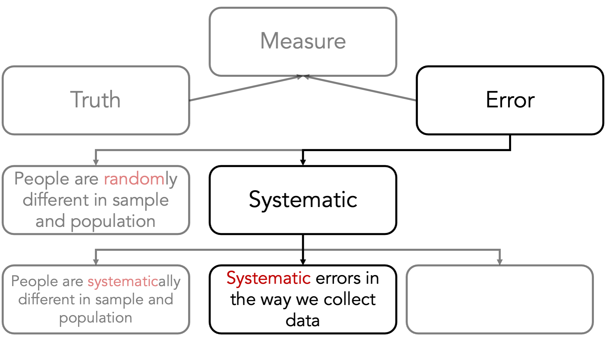
```

As an extreme example, let’s say that we want to evaluate the differences in weight associated with exposure to a vegetarian school lunch among high school students. We randomly select different high school students to eat a special vegetarian school lunch or the standard school lunch. After some amount of time, we go weigh everybody and see if there is a difference in the average weight by diet. There are actually many potential sources of error in this study, but for now, let’s focus on measurement error.

```{r systematic-error-weight-example-01, echo=FALSE}

```

If the scale we are using to take everyone’s weight is properly calibrated, then we expect the average measured weights to be equal to the average true weight. So, for standard diet, the true average weight is 150 and the measured average weight is 150. For the vegetarian diet, the true average weight is 140 and the measured average weight is 140.

```{r systematic-error-weight-example-02, echo=FALSE}
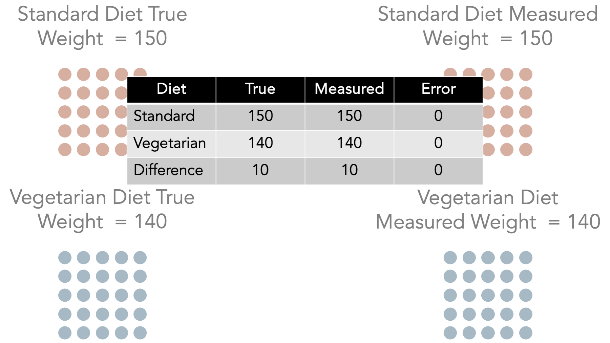
```

Further, we expect the difference between the average weights we measured to be equal to the true difference in average weights. In this case, the difference between the true average weight in the standard diet group and the true average weight in vegetarian diet group 150 -140 = 10. Likewise, the difference between the measured average weight in the standard diet group and the measured average weight in vegetarian diet group 150 -140 = 10. Here, we have no systematic bias caused by our measurement tool being improperly calibrated.

```{r systematic-error-weight-example-03, echo=FALSE}

```

For comparison, let’s say that the scale we are using to take everyone’s weight is not properly calibrated – the measured weight is always 5 lbs. higher than the actual weight. Now, we expect the average measured weight to be different than the average true weight. So, for standard diet, the true average weight is 150 and the measured average weight is 155. For the vegetarian diet, the true average weight is 140 and the measured average weight is 145.

```{r systematic-error-weight-example-04, echo=FALSE}

```

In this scenario, we have systematic measurement error in the outcome of interest. We said the students were one weight, but in reality, they were 5 pounds less than the weight we said they were. So, the error in our measurement of weight associated with standard diet is 5 pounds. Likewise, the error in our measurement of weight associated with vegetarian diet is 5 pounds. We have error in our measurement for both groups. 

However, notice that the amount of error was the same in both groups. The amount of error was 5 pounds regardless of which exposure – which diet – the students had. As a result, we can see that there is no error in our estimate of the difference between average weights. 

So, we have measurement error in our outcome – measured weight is systematically different than true weight. However, the misclassification is nondifferential because it’s direction and magnitude are the same regardless of which exposure group – diet -- the students were in.

```{r systematic-error-weight-example-05, echo=FALSE}
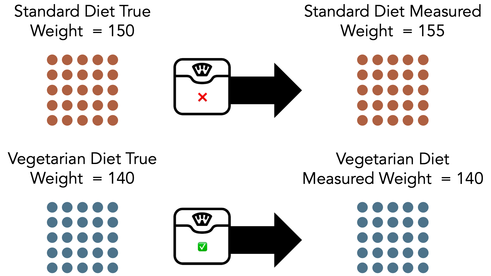
```

Finally, let’s say that schools who had a vegetarian diet received special grant funds to implement the new diet. They also used some of that money to buy a brand-new scale. The standard diet schools – because nothing was really changing – continued using the old scale that had been sitting in the locker room for the past 30 years.

Now, the scale we are using to take the weight of everyone exposed to standard diet is not properly calibrated – the measured weight is always 5 lbs. higher than the actual weight. But, the scale we are using to take the weight of everyone exposed to vegetarian diet is properly calibrated. So, we expect the average measured weight to be different than the average true weight for students exposed to standard diet, but not for students exposed to vegetarian diet.

```{r systematic-error-weight-example-06, echo=FALSE}
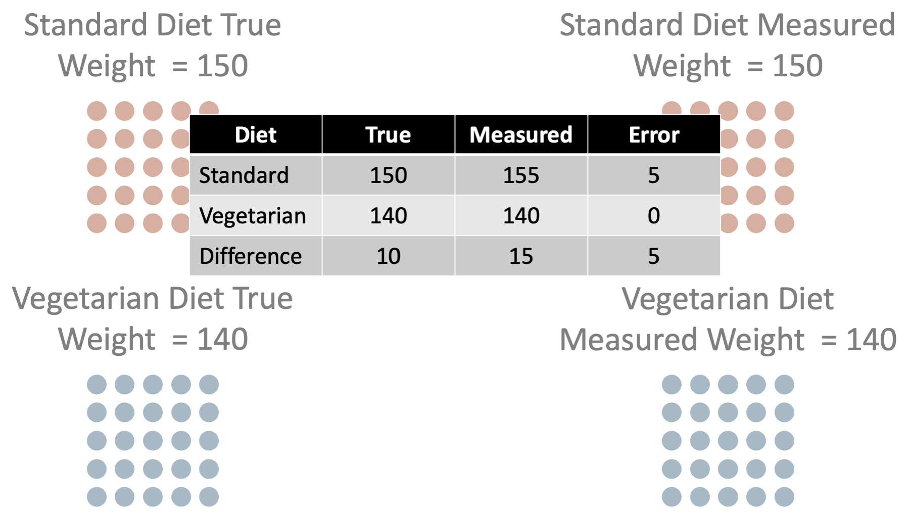
```

In this scenario, we have measurement error for some of the high school student’s weights. We said they were one weight, but in reality they were 5 pounds less than the weight we said they were. So, the error in our measurement of weight associated with standard diet is 5 pounds. However, we didn’t have measurement error in all of the high school student’s weights. 

Further, notice that the amount of error was not randomly spread around all the students. The amount of error was associated with (in this caused by) which exposure group the students were in. As a result, we can see that now there is error in our estimate of the difference between average weights. Specifically, we have 5 lbs. of error in our estimate of the difference in average weight associated with diet. The true difference is 10 and we think it’s 15.

So, we have systematic measurement error in our outcome – measured weight is systematically different than true weight. And, the error is differential because it’s direction and magnitude differ depending on which exposure group – diet -- the students were in.

Also, note once again that increasing our sample size does nothing to reduce this kind of error. If we collected data from 1,000 additional high school students using the incorrectly calibrated scale, we would simply feel more confident in our wrong answer. Again, this is generally the case for all types of systematic errors.

## Misclassification

<!-- Slide Comment: Make this graphic more obvious -->

```{r systematic-error-misclassification-01, echo=FALSE}
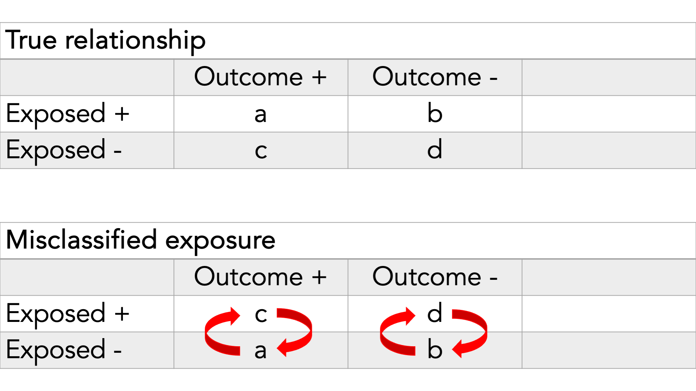
```

When our measurement error pertains to categories of exposure or outcome, as opposed to continuous values, we sometimes call it misclassification.

In this example, we see misclassification of the exposure.

In other words, some people who really belong in cell a are being put in cell c and vice versa. Additionally, some people who really belong in cell b are being put in cell d and vice versa.

```{r systematic-error-misclassification-02, echo=FALSE}
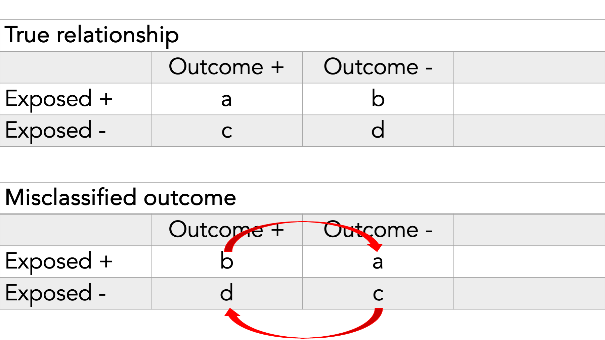
```

In this example, we see misclassification of the outcome.

Whenever we have misclassification, we expect there to be some amount of bias, on average.

## Direction of bias

<!-- Taken directly from slide. Clean up -->

Typically, we describe bias as being towards or away from the null.

Observed measure of effect is closer/further from the true value

Ratios: Null is 1

Differences: Null is 0

Here are some examples of interpreting bias towards and away from the null. 

```{r systematic-error-direction-of-bias, echo=FALSE}
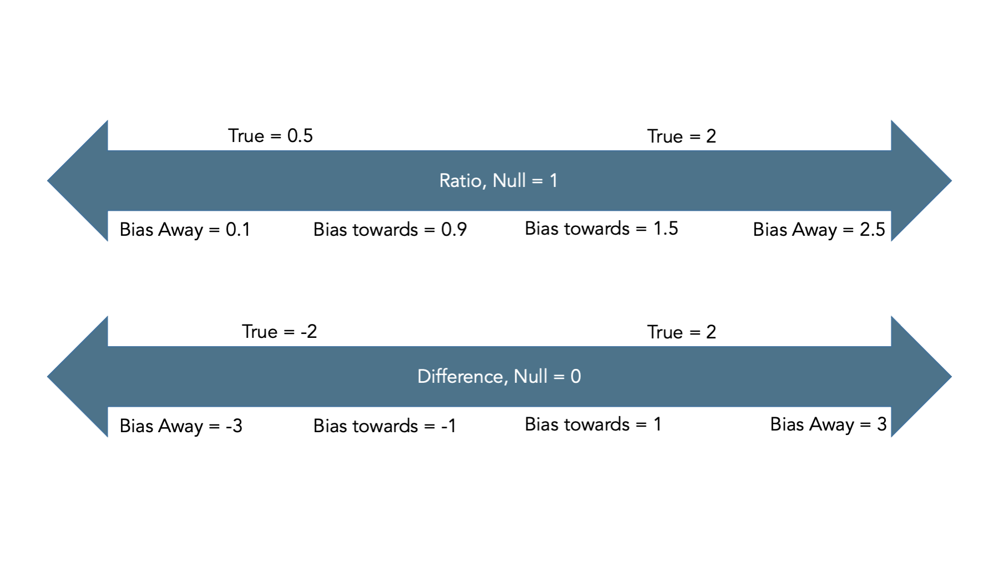
```

## Sensitivity

We can also calculate the sensitivity and specificity with which we assign participants to exposure categories.

```{r systematic-error-sensitivity-01, echo=FALSE}
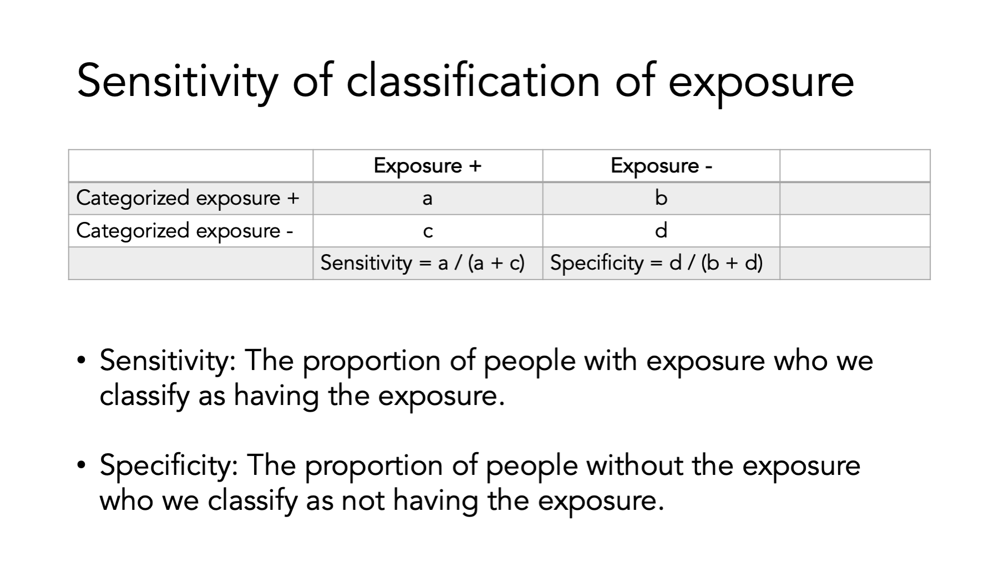
```

Let’s take a look at how sensitivity and specificity relate to misclassification and how that misclassification creates bias (i.e., a difference between our estimate and the truth).

Here we have the true OR between exposure and outcome. We also see the sensitivity and specificity for each cell of the table.

```{r systematic-error-sensitivity-02, echo=FALSE}
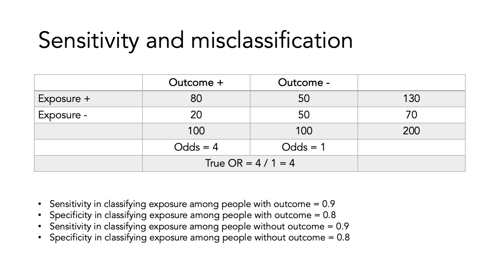
```

Here's an example.

```{r systematic-error-sensitivity-03, echo=FALSE}
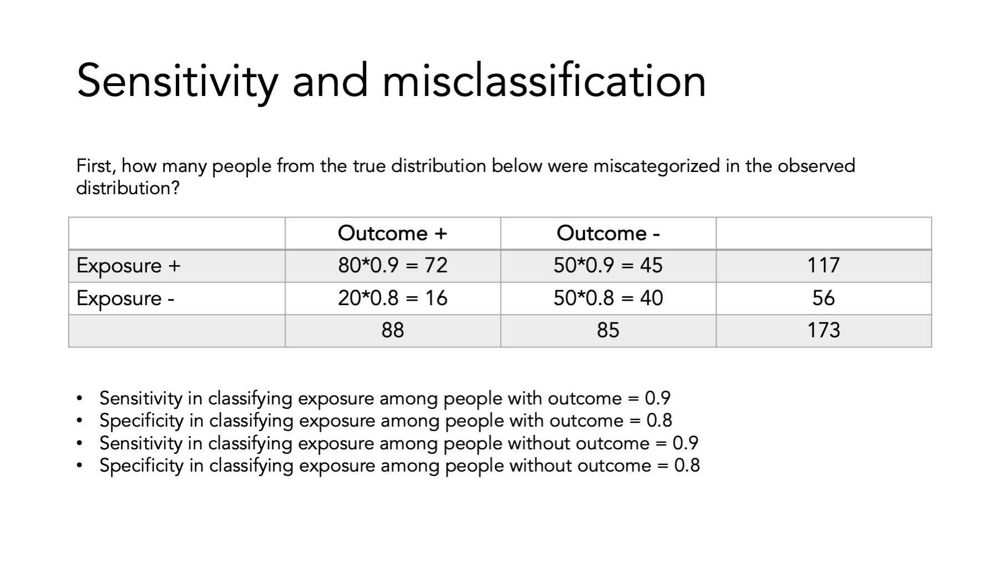
```

<!-- Add narrative -->

```{r systematic-error-sensitivity-04, echo=FALSE}
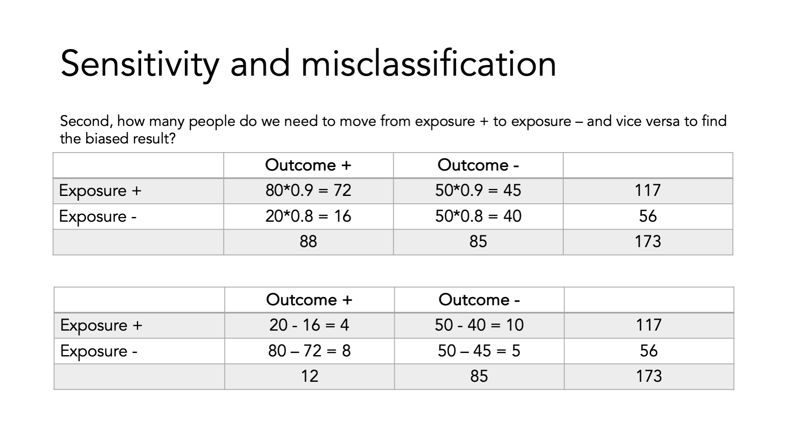
```

<!-- Add narrative -->

```{r systematic-error-sensitivity-05, echo=FALSE}
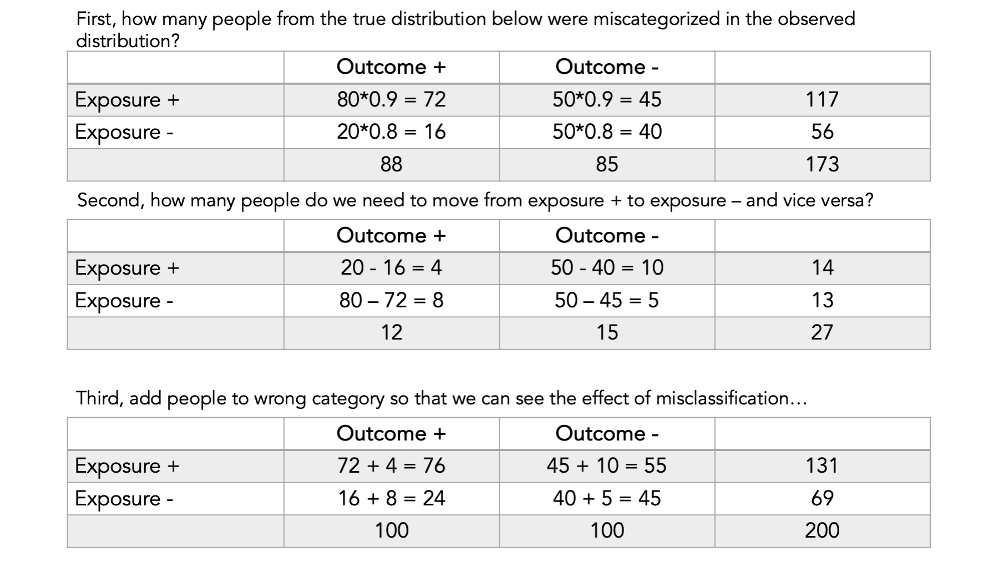
```

Finally, compare the ORs…

```{r systematic-error-sensitivity-06, echo=FALSE}
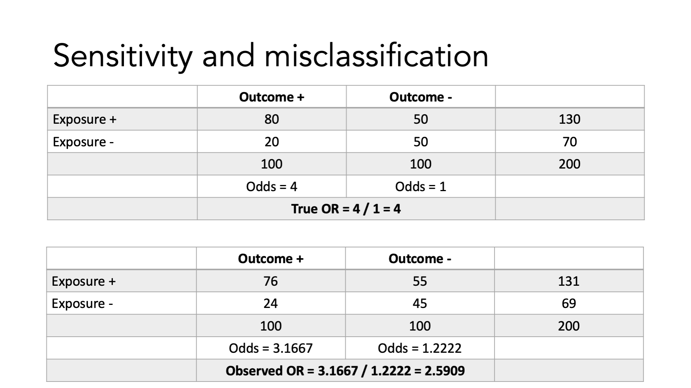
```

## Non-diffrential misclassification

<!-- Copied directly from slides -->

Sensitivity and specificity of:
- Exposure is not dependent on outcome status or
- Outcome is not dependent on exposure status

**Equal** misclassification of:
- Exposure between participants with outcome and participants without outcome or
- Outcome between exposed and non-exposed participants

<!-- Give examples -->

Consequences
- On average, results in a measure of effect biased towards the null with a binary outcome

Caveats
- Just because non-differential measurement error will on average bias an estimate toward the null does not mean a specific estimate is biased towards the null
  - Random error alone may cause the observed estimate to be further away from the null than the true estimate
- All bets are off if non-differential errors in the disease and exposure are correlated with each other

## Differential misclassification

<!-- Copied directly from slides -->

Sensitivity and specificity for:
- Exposure is dependent on the outcome status
- Outcome is dependent on exposure status

**Unequal** misclassification of: 
- Exposure between participants with outcome and participants without outcome or
- Outcome between exposed and non-exposed participants

Consequences
- Measure of effect may be biased towards or away from null

<!-- Give examples -->

## Precision and validity

While we are comparing random and systematic error, I should also point out that the they are closely linked with the concepts of precision and validity. That is, a study can be precise in its statistical inference, but invalid due to methodological problems. Therefore, precision is typically linked conceptually with random error and validity is typically linked conceptually with systematic error.

```{r systematic-error-precision-and-validity, echo=FALSE}
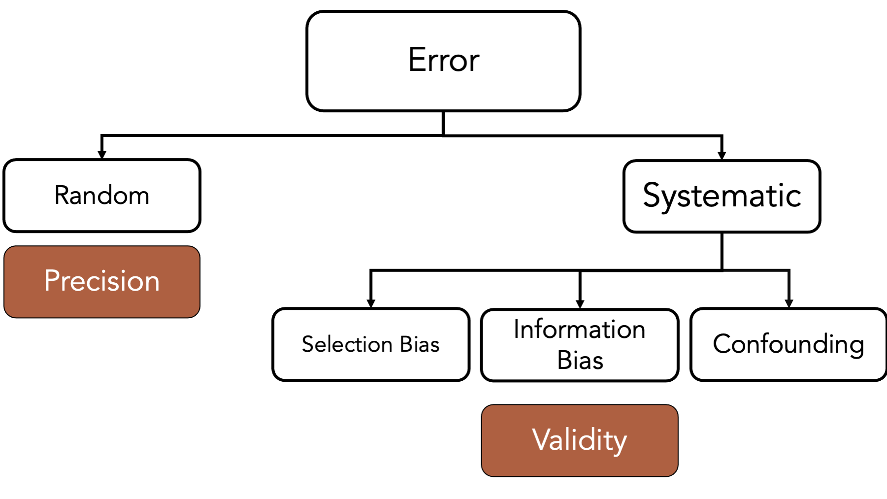
```

As a reminder, one classic way of illustrating precision and validity is with a target. 

Validity is a lack of bias, on average.

```{r systematic-error-targets, echo=FALSE}
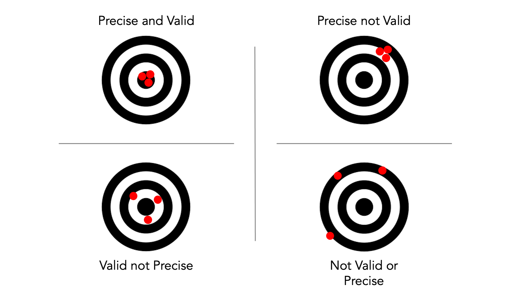
```

<!-- Thinking about precision question asked on the Serious Epidemiology podcast: -->

<!-- Precision is the relative amount of error in our measurement that is modeled as random error. It can also be the amount of difference between point estimates from repeated sampling, which is the more intuitive way of understanding it, but in reality, we rarely actually take repeated samples. -->

<!-- For any single point estimate, precision is difficult to interpret. In fact, it may be impossible to quantify above, and beyond a binary qualification, such as perfectly precise vs not perfectly precise. That's not to say that we can't calculate measures of precision for a single point estimate – we clearly can – it's just that judging their size is difficult in isolation. Measures of precision become much more practically useful when we start comparing them across samples or across studies. -->

<!-- When we create confidence intervals, we are essentially drawing a comparison between the precision and our estimate, and some hypothetical distribution of values. -->

<!-- Also, see screenshots from conversation with Doug -->

## Summary

<!-- Needs a lot of work -->

That’s sort of a big picture overview of bias. In my opinion, it is far more important for you to understand these basic concepts than it is for you to be able to name all the various little special cases of bias that are floating around out there in the literature. However, my opinion is not the only one that counts, and I admit that it will probably be useful to see some additional examples of how these things play out in the real world. The book provides a lot of specific examples from actual studies and the different specific ways selection and information bias were suspected to have entered the studies. We will also talk about some more specific examples in the weeks ahead.

```{r systematic-error-clean-up, echo=FALSE}
# clean up
rm(list = ls())
```


