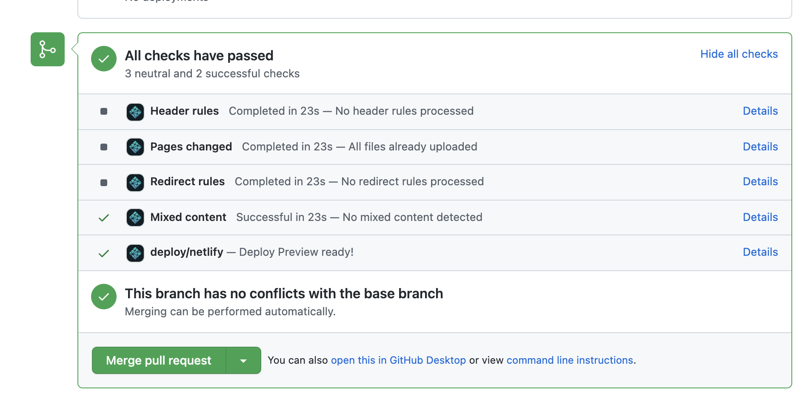

--- 
title: "R for Epidemiology"
author: "Brad Cannell"
date: "`r Sys.Date()`"
description: "This is the textbook for Brad Cannell's Introduction to R Programming for Epidemiologic Research course."
cover-image: "r4epi_icon.png"
site: bookdown::bookdown_site
output: bookdown::gitbook
documentclass: book
bibliography: [book.bib, packages.bib]
link-citations: yes
csl: ama.csl
github-repo: "brad-cannell/r4epi"
url: 'https://brad-cannell.github.io/r4epi/'
---

```{r setup, include=FALSE}
# automatically create a bib database for R packages
knitr::write_bib(c(
  .packages(), 'bookdown', 'knitr', 'rmarkdown'
), 'packages.bib')

# To fix error that says: "Error: Input files not all in same directory, please supply explicit wd
# Execution halted"
options(bookdown.render.file_scope = FALSE)

# Add Font Awesome icons (https://fontawesome.com/)
library(fontawesome)
```

# Welcome {-}

<!-- R4Epi Hex Sticker -->


Welcome to R for Epidemiology! 

This electronic book was originally created to accompany my Introduction to R Programming for Epidemiologic Research course at the [University of Texas Health Science Center School of Public Health](https://sph.uth.edu/). However, I hope it will be useful to anyone who is interested in R and epidemiology.

## Acknowledgements {-}

This book is currently a work in progress (and probably always will be); however, there are already many people who have played an important role (some unknowingly) in helping develop it thus far. First, I’d like to offer my gratitude to all past, current, and future members of the R Core Team for maintaining this _amazing_, _free_ software. I’d also like to express my gratitude to everyone at RStudio. You are also developing and _giving away_ some amazing software. In particular, I’d like to acknowledge **Garrett Grolemund** and **Hadley Wickham**. Both have had a huge impact on how I use, and teach, R. I’d also like to thank my students for all the feedback they’ve given me while taking my course. In particular, I want to thank **Jared Wiegand** and **Yiqun Wang** for their many edits and suggestions. 

This electronic textbook was created and published using [R](https://cran.r-project.org/), [RStudio](https://www.rstudio.com/), the [bookdown](https://bookdown.org/) package, [GitHub](https://github.com/), and [Netlify](https://www.netlify.com/).

<a href="https://www.netlify.com"></a>

# Introduction {-}

## Goals {-}

We're going to start the introduction by writing down some basic goals that underlie the construction and content of this book. We're writing this for you, the reader, but also to hold ourselves accountable as we write. So, feel free to read if you are interested or skip ahead if you aren't.

The goals of this book are:   

1. To teach you how to use R and RStudio as tools for applied epidemiology. Our goal is not to teach you to be a computer scientist or an advanced R programmer. Therefore, some readers who are experienced programmers may catch some technical inaccuracies regarding what we consider to be the fine points of what R is doing "under the hood."    

2. To make this writing as accessible and practically useful as possible without stripping out all of the complexity that makes doing epidemiology in real life a challenge. In other words, We're going to try to give you all the tools you need to _do_ epidemiology in "real world" conditions (as opposed to ideal conditions) without providing a whole bunch of extraneous (often theoretical) stuff that detracts from _doing_. Having said that, we will strive to add links to the other (often theoretical) stuff for readers who are interested.

3. To teach you to accomplish common _tasks_, rather than teach you to use functions or families of functions. In many R courses and texts, there is a focus on learning all the things a function, or set of related functions, can do. It's then up to you, the reader, to sift through all of these capabilities and decided which, if any, of the things that _can_ be done will accomplish the tasks that you are _actually trying_ to accomplish. Instead, we will strive to start with the end in mind. What is the task we are actually trying to accomplish? What are some functions/methods we could use to accomplish that task? What are the strengths and limitations of each?

4. To start each concept by showing you the end result and then deconstruct how we arrived at that result, where possible. We find that it is easier for many people to understand new concepts when learning them as a component of a final product.

5. To learn concepts with data instead of (or alongside) mathematical formulas and text descriptions, where possible. We find that it is easier for many people to understand new concepts by seeing them in action.

## Text conventions used in this book {-}

* **Bold** text is used to highlight important **terms**, file names, and file extensions.

* `Highlighted inline code` is used to emphasize small sections of R code and program elements such as variable or function names.  

## Other reading {-}

If you are interested in R4Epi, you may also be interested in:

* [Hands-on Programming with R](https://rstudio-education.github.io/hopr/) by Garrett Grolemund. This book is designed to provide a friendly introduction to the R language.   

* [R for Data Science](https://r4ds.had.co.nz/) by Garrett Grolemund and Hadley Wickham. This book is designed to teach readers how to do data science with R.   

* [Statistical Inference via Data Science: A ModernDive inot R and the Tidyverse](https://moderndive.com/). This book is designed to be a gentle introduction to the practice of analyzing data and answering questions using data the way data scientists, statisticians, data journalists, and other researchers would.   

* [Reproducable Research with R and RStudio](http://christophergandrud.github.io/RepResR-RStudio/) by Christopher Gandrud. This book gives you tools for data gathering, analysis, and presentation of results so that you can create dynamic and highly reproducible research.   

* [Advanced R](https://adv-r.hadley.nz/) by Hadley Wickham. This book is designed primarily for R users who want to improve their programming skills and understanding of the language.   

## Contributing to R4Epi {-}

Over the years, we have learned so much from our students and colleagues, and we anticipate that there is much more we can learn from you -- our readers. Therefore, we welcome and appreciate all constructive contributions to R4Epi!

### Typos {-}

The easiest way for you to contribute is to help us clean up the little typos and grammatical errors that inevitably sneak into the text. 

If you spot a typo, you can offer a correction directly in GitHub. You will first need to create a free GitHub account: [sign-up at github.com](https://github.com/join). Later in the book, we will cover using [GitHub in greater depth][Introduction to git and GitHub]. Here, we're just going to walk you through how to fix a typo without much explanation of how GitHub works.

Let's say you spot a typo while reading along.

```{r echo=FALSE}
knitr::include_graphics("img/index/typo_on_screen.png")
```

Next, click the edit button in the toolbar as shown in the screenshot below.

```{r echo=FALSE}
knitr::include_graphics("img/index/edit_button.png")
```

Close up, it looks like this:

```{r echo=FALSE, fig.align = 'center'}

```

The first time you click the icon, you will be taken to the R4Epi **repository** on GitHub and asked to **Fork** it. For our purposes, you can think of a GitHub repository as being similar to a shared folder on Dropbox or Google Drive. 

```{r echo=FALSE}
knitr::include_graphics("img/index/fork_button.png")
```

"Forking the repository" basically just means "make a copy of the repository" on your GitHub account. In other words, copy all of the files that make up the R4Epi textbook to your GitHub account. Then, you can fix the typos you found in your _copy_ of the files that make up the book instead of directly editing the _actual_ files that make up the book. This is a safeguard to prevent people from accidentally making changes that shouldn't be made. 

<p class="note"> 🗒**Side Note:** Forking the R4Epi repository does not cost any money or add any files to your computer. </p>

After you fork the repository, you will see a text editor on your screen.

```{r echo=FALSE}
knitr::include_graphics("img/index/text_editor.png")
```

The text editor will display the contents of the file (called an **R markdown** file), which is used to make the chapter you were looking at when you clicked the `edit` button. In our example, it was the "Contributing to R4Epi" section of the file named `index.Rmd`. We will learn more about R markdown files in the chapter on [R markdown], but for now just know that R Markdown files contain a mix of R `code` and plain text like the text you are reading right now. You may not understand the code yet, but you will probably be able to skim through the document and find the typo you want to fix.

Next, Scroll down through the text until you find the typo, and fix it. 

```{r echo=FALSE}
knitr::include_graphics("img/index/fix_typo.png")
```

Now, the only thing left to do is propose your typo fix to the authors. To do so, simply scroll to the bottom of the same screen where you made the edits to the file. There, you will see a "Propose changes" form box you can fill out. In the first line, type a brief (i.e., 72 characters or less) summary of the change you made. There is also a box to add a more detailed description of what you did, but you shouldn't need to use it for a simple typo fix. 

```{r echo=FALSE}
knitr::include_graphics("img/index/propose_changes.png")
```

Next, click the "Propose changes" button. That will take you to another screen where you will be able to create a **pull request**. This screen is kind of busy, but try not to let it overwhelm you. 

```{r echo=FALSE}
knitr::include_graphics("img/index/create_pull_request_1.png")
```

For now, we will focus on the three different sections of the screen that are highlighted with a red outline. We will start at the bottom and work our way up. The red box that is closest to the bottom of the screenshot shows us that the change we made was on line 93. We removed the word "typoo" (highlighted in red) and added the word "typo" (highlighted in green). The red box in the middle of the screenshot shows us the brief description we wrote for our proposed change -- "Fixed a typo in index.Rmd". Finally, the red box closest to the top of the screenshot is surrounding the "Create pull request" button. Let's go ahead and click it now. 

```{r echo=FALSE}
knitr::include_graphics("img/index/create_pull_request_2.png")
```

After doing so, we will get one final chance to amend our description of our proposed changes. We don't want to change our description, so let's go ahead and click "Create pull request" one more time. Our job is done! It is now up to the authors to review the changes we've proposed and "pull" them into the file in their repository. 

In case you are curious, here is what the process looks like on the authors' end. First, when we open the R4Epi repository page on GitHub, we will see that there is a new pull request. 

```{r echo=FALSE}
knitr::include_graphics("img/index/create_pull_request_3.png")
```

When we open the pull request, we can see the proposed changes to the file.

```{r echo=FALSE}
knitr::include_graphics("img/index/create_pull_request_4.png")
```

Then, all we have to do is click the "Merge pull request button" and the fixed file is "pulled in" to replace the file with the typo. 

```{r echo=FALSE}

```

### Issues {-}

There may be times when you see a problem that you don't know how to fix, but you still want to make the authors aware of. In that case, you can create an **issue** in the R4Epi repository. To do so, navigate to the issue tracker using this link: https://github.com/brad-cannell/r4epi/issues. 

```{r echo=FALSE}
knitr::include_graphics("img/index/issue_tracker.png")
```

Once there, you can check to see if someone has already raised the issue you are concerned about. If not, you can click the "New issue" button to raise it yourself.

Please note that R4Epi uses a [Contributor Code of Conduct](https://contributor-covenant.org/version/2/0/CODE_OF_CONDUCT.html). By contributing to this book, you agree to abide by its terms.

**License Information**

<a rel="license" href="http://creativecommons.org/licenses/by-nc-nd/4.0/"></a><br />This book was created by Brad Cannell and is licensed under a <a rel="license" href="http://creativecommons.org/licenses/by-nc-nd/4.0/">Creative Commons Attribution-NonCommercial-NoDerivatives 4.0 International License</a>.

# About the Authors {-}

## Brad Cannell {-}

**Brad Cannell, PhD, MPH**   
<!-- Cannell profile photo -->

Associate Professor    
Department of Epidemiology, Human Genetics and Environmental Sciences    
University of Texas Health Science Center    
School of Public Health    
[www.bradcannell.com](https://www.bradcannell.com)   

Dr. Cannell received his PhD in Epidemiology, and Graduate Certificate in Gerontology, in 2013 from the University of Florida. He received his MPH with a concentration in Epidemiology from the University of Louisville in 2009, and his BA in Political Science and Marketing from the University of North Texas in 2005. During his doctoral studies, he was a Graduate Research Assistant for the Florida Office on Disability and Health, an affiliated scholar with the Claude D. Pepper Older Americans Independence Center, and a student-inducted member of the Delta Omega Honorary Society in Public Health. In 2016, Dr. Cannell received a Graduate Certificate in Predictive Analytics from the University of Maryland University College, and a Certificate in Big Data and Social Analytics from the Massachusetts Institute of Technology. 

He previously held professional staff positions in the Louisville Metro Health Department and the Northern Kentucky Independent District Health Department. He spent three years as a project epidemiologist for the Florida Office on Disability and Health at the University of Florida. He also served as an Environmental Science Officer in the United States Army Reserves from 2009 to 2013.

Dr. Cannell’s research is broadly focused on healthy aging and health-related quality of life. Specifically, he has published research focusing on preservation of physical and cognitive function, living and aging with disability, and understanding and preventing elder mistreatment. Additionally, he has a strong background and training in epidemiologic methods and predictive analytics. He has been principal or co-investigator on multiple trials and observational studies in community and healthcare settings. He is currently the principal investigator on multiple data-driven federally funded projects that utilize technological solutions to public health issues in novel ways.

**Contact**   
Connect with Dr. Cannell and follow his work.   
<a href="https://www.bradcannell.com" target="_blank">`r fa("globe", fill = "#003087", height="2em")`</a>
<a href="https://www.facebook.com/Brad-Cannell-PhD-MPH-109345984850672" target="_blank">`r fa("facebook-square", fill = "#4267B2", height="2em")`</a>
<a href="https://www.linkedin.com/in/bradcannell/" target="_blank">`r fa("linkedin", fill = "#2867B2", height="2em")`</a>
<a href="https://twitter.com/brad_cannell" target="_blank">`r fa("twitter-square", fill = "#198CD8", height="2em")`</a>
<a href="https://www.instagram.com/brad_cannell/" target="_blank">`r fa("instagram-square", fill = "#833AB4", height="2em")`</a>


## Melvin Livingston {-}

**Melvin Livingston, PhD (Doug)**   
<!-- Livingston profile photo -->

Research Associate Professor    
Department of Behavioral, Social, and Health Education Sciences     
Emory University Woodruff Health Sciences Center    
Rollins School of Public Health    
[Dr. Livingston's Faculty Profile](https://sph.emory.edu/faculty/profile/index.php?FID=melvin-livingston-8970)

Dr. Livingston is a methodologist with expertise in the the application of quasi-experimental design principals to the evaluation for both community interventions and state policies. He has particular expertise in time series modeling, mixed effects modeling, econometric methods, and power analysis. As part of his work involving community trials, he has been the statistician on the long term follow-up study of a school based cluster randomized trial in low-income communities with a focus on explaining the etiology of risky alcohol, drug, and sexual behaviors. Additionally, he was the statistician for a longitudinal study examining the etiology of alcohol use among racially diverse and economically disadvantaged urban youth, and co-investigator for a NIAAA- and NIDA-funded trial to prevent alcohol use and alcohol-related problems among youth living in high-risk, low-income communities within the Cherokee Nation. Prevention work at the community level led him to an interest in the impact of state and federal socioeconomic policies on health outcomes. He is a Co-Investigator of a 50-state, 30-year study of effects of state-level economic and education policies on a diverse set of public health outcomes, explicitly examining differential effects across disadvantaged subgroups of the population.

His current research interests center around the application of quasi-experimental design and econometric methods to the evaluation of the health effects of state and federal policy.

**Contact**    
Connect with Dr. Livingston and follow his work.   
<a href="https://sph.emory.edu/faculty/profile/index.php?FID=melvin-livingston-8970" target="_blank">`r fa("globe", fill = "#003087", height="2em")`</a>
<a href="https://twitter.com/MD3_Phd" target="_blank">`r fa("twitter-square", fill = "#198CD8", height="2em")`</a>
